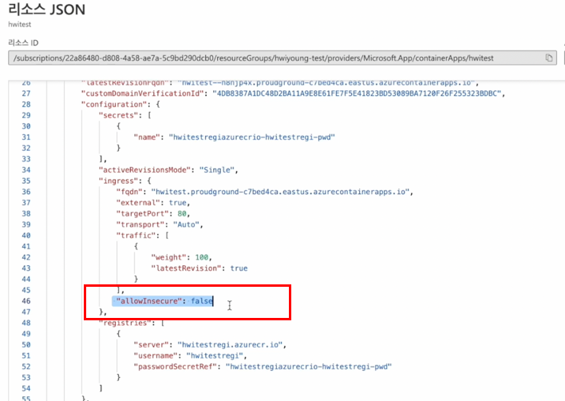

안녕하세요!

클라우메이트 TE팀 정휘영입니다 :)

2022년 05월 07에 진행했었던 Azure Korea User Group 새싹반 후기와 Container apps로 wordpress 를 올려본 방법을 간단히 작성하려고 합니다.

제가 발표했던 내용은 Container apps였습니다.

**현재는 GA가 되었습니다.**

Azure VM을 배포하지 않고 Azure Resource Manager에서 Kubernetes 수준의 Container Cluster를 관리할 수 있답니다!

---

**\[ 발표 유튜브 ]**

\[[Global Azure Virtual 2022] 컨테이너로 구성된 웹서비스 복잡한 구성 "멈춰!" Azure PaaS Service](https://www.youtube.com/watch?v=YAweyro1jF0)

**\[ Azure container apps ]**

[Azure Container Apps | Microsoft Azure](https://azure.microsoft.com/en-us/services/container-apps/#overview)

저는 Azure portal를 ‘처음' 접해보았기 때문에 차근차근 테스트해보고 포탈에 있는 것도 이것저것 눌러보았습니다. 재미있게 접했던 것 같네요.

테스트도 아주 쉽게 할 수 있게끔 가이드를 줬기에 편햇던 것 같습니다.

[빠른 시작: 첫 번째 컨테이너 앱 배포](https://docs.microsoft.com/ko-kr/azure/container-apps/get-started?tabs=bash)

Azure Container Apps를 설명하면서 발표 자료와 함께 개념 설명을 해보려고 합니다.

해당 내용은 **\[Global Azure Virtual 2022]의 컨테이너로 구성된 웹서비스 복잡한 구성 “멈춰!” Azure PaaS Service 로 발표한 Azure Container apps의 내용과 동일합니다.**

- - -

## \[ 공동책임모델 ]

기본적으로 Azure Container apps는 Azure의 Serverless 제품이기 때문에 이 Serverless의 개념이 필요하다고 생각했습니다.

여러분이 아주 많이 보신 장표일텐데. 클라우드 사용자의 책임과 클라우드 서비스 공급자(CSP), 즉 기업의 책임을 설명하는 것을 책임공유모델이라고 합니다.

기업은 운영 활동의 범위를 늘리게 되고 사용자는 자신의 핵심 역량에 집중할 수 있다는 것이 필요합니다.

On-premise, IaaS, PaaS, SaaS가 보여주는 이 장표는 기업이 관리하는 범위와 서비스로 제공하는 범위를 알 수 있어서 이것으로 사용자는 집중해서 관리해야 하는 영역이 어떤 부분인지를 체크할 수 있습니다.

제가 주니어다보니 처음에 잘 와닿지가 않았습니다. 그래서 사용자 입장에서 쉽게 이해하게끔 접근해보려고합니다.

\[데이터와 코드레벨에 따라서 공유책임모델이 정해지기 때문에 감안하고 설정한 예입니다.]

프레미스는 모든 것을 자동차 공장부터 시작해서 자동차를 제작하고 직접 운전해서 도착하는 것입니다.

무슨 자동차를 프레임은 어떻게 바퀴는 어떻게 만들지부터 어떻게 가야할지, 누가 운전할지 그리고 자동차를 만드는 비용을 전부 사용자가 책임져야합니다.

IaaS는 자동차는 이미 다 만들어졌으니 원하는 자동차를 내돈내산으로 구매했지만 운전은 사용자가 해야합니다. 종종 자동차가 사고가 나거나 고장이 나면 사용자가 수리를 해야하죠. 또 새로 구입하려면 자동차를 새 차로 사야합니다.

PaaS는 자동차도 내돈내산도 아니고 저렴하게 렌트를 합니다. 맘에 들지 않으면 빠르게 다른 자동차로 바꿀수도 있죠 그렇지만 목적지까지 운전은 사용자가 해야합니다. 어느정도의 사용자의 컨트롤은 필요하다는 것이죠.

SaaS는 내가 내야하는 것은 오로지 목적지를 가기위한 비용만 지불만 하면 됩니다. 기사님이 운전도 해주고 자동차는 내가 산 것도 아니니까요. 편하게 앉아서 경치구경만 하면 되죠.

이렇게 관리의 범위를 CSP와 사용자가 어디까지 책임지는 것이냐에 따라서 핵심이죠.

##\[ Serverless ] 

Serverless는 서버가 없는게 아닙니다.  

CSP가 설정해 놓은 제약사항들 안에서 어플리케이션을 띄우는것입니다.  컨테이너나, 빠르게 띄울수 있는 OS를 CSP에서 제공하고 관리하게 되고 사용자는 어플리케이션 레벨만 사용하면 되죠. 이 어플리케이션 레벨의 컨트롤은 사용자의 몫입니다.

그럼 이 Serverless가 등장하게 된 것을 한번 어플리케이션 레벨 배포시간 변화로 이야기해보겠습니다.

클라우드 컴퓨팅의 등장부터 알아야겠죠?

아까 자동차로 예를 든 온프레미스 시점부터 다시 되돌려보자면 서버에 선도 꽂고 서버도 가져오고 스토리지가 부족하면 또 주문해서 가져오고 서버운영비용도 들고 숨만 쉬어도 돈이 나가게 되는데 시간도 오래걸리게 되죠. 

이제 그걸 해결해줄 수 있는 클라우드가 등장하게 되면서 가상의 서버를 사용할 수 있게 된것이죠, 스토리지도 내가 필요한 만큼 금방 추가할 수 있고 인스턴스 타입도 변경할 수 있습니다. 

보통 고객사에서 구축해주세요~ 하면 빠르면 몇시간 혹은 몇 분이면 끝나죠.

**그러나 여전히 서버의 소프트웨어적인 부분은 사용자가 직접 관리를 해야 합니다. 서버에 깔린 운영체제 등을 업데이트하고, 데이터를 백업하고, 보안에도 신경 써야 하는 일이 생깁니다.**

그런데도 이것도 시간이 오래걸린다고 생각하면 하면서 더 빠른 배포를 해서 서비스를 출시하고자하는 니즈가 생겼습니다. 이미지만 올리면 나머지는 알아서 서비스를 컨테이너의 등장으로 수분, 수초면 서비스를 올릴 수 있는 관리형 서비스가 등장한 것입니다. 

요약하자면 관리의 대상을 줄이는 것으로 Serverless가 등장하게 된것이죠. 시간은 곧 돈이라고 하니깐요.

그럼 Serverless는 어떻게 동작하게끔 이해하면 될까요?

여러분이 방문하는 식당에서 예시를 들어보겠습니다. 

식당에 가서 주문표를 보고 내가 먹고싶은 것을 고를 때 옆에 웨이터가 하루종일 대기하고 있진 않죠.

벨을 누르면 와서 그 때 주문을 받아가죠? 그 후에 음식이 나오게 되잖아요. 

추가하고 싶으면 다시 웨이웨이터가 오는 것처럼요.

Serverless도 그렇습니다. 

서버가 없는 것이 아니라 보이지 않는 것이죠. 서버가 대기하고 있는 것이 아니라 현재 필요하다라는 호출을 하게 되면 실행하는 것입니다. 사용자는 필요한 것만 사용할 수 있습니다. 요청했을 때만  어플리케이션을 실행할 수 있으니 사용자는 어플리케이션 레벨만 사용하면 됩니다.

Serverless의 장점은 서버의 준비도 관리도 불필요해요. 관리자가 적은 입장에서는 편하게 사용 할 수 있죠. 프로비저닝 및 패치 적용과 같은 인프라 관리 작업이 필요하지 않으므로 고객은 본인 서비스 운영에 집중할 수 있습니다. 

또한 서버는 계속 돌아가고있으면 그 유지비용도 들텐데 Serverless는 비용 또한 **대기상태를 제외한** 호출시에만 작동하므로 비용 절감도 할 수 있죠 짧은 시간에 대해서만 비용을 지불한다는 말로 경제적입니다. 

또한 리소스 사용량에 따라서 동시 사용자를 수용 할 수 있도록 자동으로 확장되고 트래픽이 감소하면 축소도 할 수 있죠. 요청이 들어올때만 실행되고 동적으로 자원을 할당하기 때문에 가용성이 높고 스케일링에 신경 쓸 필요가 없습니다. 

이런 경우 기존 클라우드 컴퓨팅 모델에 비해 돈과 시간을 모두 절약할 수 있으니 **토이 프로젝트나 초기 서비스을 런칭하고 싶을 때** 추천드립니다.

---

##\[ Azure container apps ] 

오늘날의 개발자는 더 빠른 개발을 위한 플랫폼을 사용하길 원하고 그에 맞는 인프라를 쉽고 간단하게 운영하길 원합니다. 

사용자 즉, 서비스를 배포하는 개발자의 입장에서는  관리까지 신경쓸 수가 없고. 본인의 서비스에 집중할 수있는 것이 필요합니다.

Azure Container apps는 규모에 맞게끔 구축이 가능한 서버가 없는 완전관리형 컨테이너 서비스입니다. 그리고 자동 스케일링의 기능이 있어서 필요한 만큼 확장이 가능하고 수정관리에서 재배포도 가능합니다.

또한 이벤트 처리나 서비스 호출, Git-Hub Action 사용 등으로 code to pipeline의 설정도 가능하기 때문에 개발자분들도 쉽게 Azure 서비스를 이용하기 좋습니다.

기능을 몇가지 살펴보자면 

 첫 번째는 HTTP 트래픽 또는 이벤트 트리거를 기반으로 하는 강력한 자동 확장 기능이 있어서 유연성을 확보할 수 있습니다. 

두 번째는 Azure Container Apps는 수신 기능을 활성화하여 컨테이너 앱을 퍼블릭웹에 노출시키는데 수신 기능을 사용하도록 설정할 때는 HTTPS 요청을 사용하도록 설정합니다. 

컨테이너 앱의 FQDN(정규화된 도메인 이름)에서 유일하게 지원되는 프로토콜은 각각 포트 80과 포트 443을 통한 HTTP와 HTTPS입니다.  포트 80에 대한 HTTP 요청은 443에서 HTTPS로 자동 리디렉션되기 때문에 Azure 로드 밸런서나 퍼블릭 IP 주소 또는 다른 Azure 리소스를 생성할 필요가 없습니다. 

세번 째로는 개인 레지스트리에 호스트된 이미지를 배포하여 Container Apps를 구성할 수 있습니다. 현재 리눅스 기반의 운영체제의 이미지와 권한이 설정되어 있는 컨테이너는 런타임 오류가 발생하더라구요.

(GA되었어도 리눅스 기반의 운영체제로만 되어있네요.)

 네번째로 컨테이너를 배포하면 Log Analytics 에서 로그도 확인할 수 있습니다.

다른 Container 서비스랑도 비교를 해볼까 합니다.

 앞서 말씀드린 사용자의 컨트롤이 어느정도 필요한 어플리케이션 레벨의 컨트롤이 필요한 PaaS 서비스의 범주 안에 있는 Serverless 제품입니다.

간단히 훑어보자면 Container instance는 컨테이너의 단일 Pod를 제공합니다. 

Container Apps에 비해  scale up 이나 부하 분산 및 인증서와 같은 개념이 제공되지 않고 추가적으로 5개의 컨테이너 인스턴스로 확장하려면 5개의 고유한 컨테이너 인스턴스를 만들어야하기 때문에 번거롭죠.

 Azure Container Apps는 그것과 다르게 인증서나 수정 버전, scale up 및 환경을 포함하여 컨테이너를 기반으로 하는 다양한 애플리케이션 관련 개념을 제공을 할 수 있습니다.

Azure Kubernetes Service는 Azure에서 완전 관리형 Kubernetes 옵션을 제공합니다. Kubernetes API에 대한 직접 액세스를 지원하고 모든 Kubernetes 워크로드를 실행합니다. 

Azure App Service는 웹 사이트 및 웹 API를 비롯한 웹 애플리케이션에 대한 완전 관리형 호스팅을 제공하는데요. 웹 애플리케이션은 코드를 사용하여 배포할 수 있습니다. Azure App Service는 웹 애플리케이션에 최적화되어 있습니다. Azure App Service는 Azure Container Apps 또는 Azure Functions를 비롯한 다른 Azure 서비스와 통합하면서 같이 사용할 수 있습니다.

Azure Functions은 프로그래밍 모델을 사용하여 이벤트 기반 애플리케이션을 실행하는 데 최적화되어 있습니다.  Azure Container Apps와 많은 특징을 공유하지만 함수에 최적화되어 있는 것이 특징입니다.

## \[ Azure Container Apps - Wordpress]

간단하게 도커에서 이미지를 ACR에 업로드를 하고 Azure Container Apps에서 컨테이너를 올린 후 바로 뜨는 URL로 확인만 한다면 누구나 빠르게 할 수 있습니다. 하지만 당시 preview로 오류(?)가 발생해서 손수 오류 수정했던 썰도 있었습니다.

---

#### 첫 번째, 사전 작업

1. Docker를 사용할 VM 배포
2. 내부에 Azure CLI, Docker 설치

여기까지 사전 작업을 했다면 본격적으로 고고!

#### 두 번째, ContainerRegistry에 이미지 올리기

먼저 VM에 Docker를 설치했으니 wordpress 이미지를 pull 해옵니다.

그 후 ACR을 만들어 놓습니다.

개인적으로 프로젝트를 한다거나 보안이 필요할 때는 프라이빗을 사용하는 게 좋겠지만 단하게 웹 서비스를 올리는 과정이기 때문에 연결 구성은 공용 액세스로 체크할게요 !

메뉴에서  빠른 시작을 선택하면

이렇게 컨테이너 레지스트리에 로그인, 푸시하는 방법까지 친절하게 알려줍니다!

이렇게 따라하시면 됩니다 :) 
참 쉽죠?

이렇게 올라간 이미지는 컨테이너 레지스트리에서 확인할 수 있습니다.

그럼 이제 올라간 이미지를 컨테이너 앱에 올려봐야죠? 

기본 사항에서는 구독, 리소스그룹, 컨테이너 앱 이름을 지정합니다.

또한 로그를 남길 수 있는 Log Analytics 작업 영역을 생성하는 환경을 만들 수 있습니다.

신규환경 생성시 기본 사항에서 리전을 선택할 수 있습니다.

GA 되고 나서도 확인해봤는데 어서 한국도 생겼으면.. ! 

여기서 앱설정을 하는데 컨테이너의 세부정보를 적습니다. 이미지 원본은 아까 ACR에 올린 이미지를 사용할 수 있습니다. 내가 그동안 서버의 워드프레스를 사용하기 위해서 아파치나 php를 설치하지 않고도 이렇게 컨테이너로만 띄울 수 있는 거는 초보자들도 방법만 알고 이해를 할 수 있다면 누구나 자기의 웹 서비스를 만들 수 있다는 점이 큰 장점이죠.

여기서 서버리스의 특징이 딱 느껴지네요. 

어플리케이션 레벨만 사용자는 사용하면 서비스 만들기 끝!

CPU와 메모리도 설정할 수 있습니다. 

위에서 말씀드린 것처럼 포트 80에 대한 HTTP 수신설정도 가능하네요! 처음에 설정할 때는 Azure 로드 밸런서나 퍼블릭 IP 주소 또는 다른 Azure 리소스를 생성할 필요가 없는 점도 좋네요 🙂

이렇게 배포를 하고

컨테이너 앱을 확인해봅니다. 

어플리케이션 URL이 뜹니다! 한번 확인해보겠습니..?!

앗?! 제대로 된 Install 화면이 아니네요.

내부에서 리디렉션이 되는 것 같아요.

사실 도커파일 작성을 해서 이런 부분도 수정해서 배포를 하면 편하겠지만 주니어에게는 아직은 버거운 일이네요…?! ( 하하…)

정상적인 Install page로 배포하기 위해서 수정을 해야 하는 부분이 있을 것 같아요.

배포한 컨테이너 앱의 리소스 JSON을 확인해봅니다.

### \[ 참고자료 ]

[Azure Container Apps에서 HTTPS 수신 설정](https://docs.microsoft.com/ko-kr/azure/container-apps/ingress?tabs=bash)

제가 참고한 자료의 표 네 번째를 보시면 allowInsecure의 디폴트값은 false로 되어 있는데 이 false로 설정하면 https 리디렉션으로 자동으로 설정하게끔 되어 있습니다. 저는 이 부분을 true로 설정을 하고 다시 재배포를 하려고 합니다.

### \[ 수정해보기 ]

보통 이렇게 신규로 무언가를 만들 때 자동화에 대한 템플릿을 다운로드하는 편인데요 다행히 도움이 되는 날이 오는군요! 이 템플릿을 다운받아서 사용자 지정 템플릿을 배포를 할 예정입니다.

allowInsecure를 true로 바꾸고 사용자 지정 배포를 합니다.

다시 배포가 된 컨테이너 앱의 어플리케이션 URL을 확인해봅니다.

와아!! 이제 잘 뜨네요 🙂 !!

이렇게 간단하게 워드프레스를 띄워보고 오류 수정까지 해보는 멋진! 스토리로 마무리가 되었네요 

- - -

발표내용을 요약을 하자면 Container apps를 사용하면 클라우드 인프라 및 복잡한 컨테이너의 오케스트레이션 관리 걱정을 하지 않고 컨테이너를 실행할 수 있는 이점이 있죠.  애저 포털에서 구성 시 직관적으로 표기가 되어 있기 때문에 편리하게 배포가 됩니다. 익숙해지면 5분 컷이네요.

그리고 서버리스 컨테이너이기 때문에 간단하게 웹 애플리케이션을 실행할 수 있습니다.

GA가 되었기 때문에 이제 자유롭게 사용하실 수 있습니다. 아직은 Korea Region이 나오지 않아서 아쉽지만 빨리 나왔으면 하는 바램입니다!

이상 글을 마치겠습니다 🙂