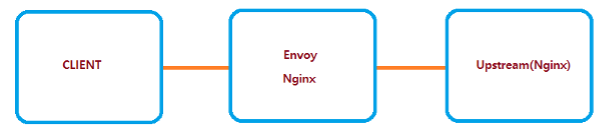

Envoy와 Nginx 둘 중 무엇을 쓸까? 한번쯤은 해본 고민일 것입니다. 그래서 간단히 성능 비교를 해보았습니다. 결론은 성능 차이는 있으나 나름의 장단점도 분명하다는 것입니다. 

본론에 들어가기에 앞서 Envoy와 Nginx가 왜 인기가 높은지 간단히 짚어 보겠습니다. 두 솔루션은 현대적인 애플리케이션 운영을 위한 스택에서 꽤 중요한 위치에 있습니다. Envoy와 Nginx는 최신 애플리케이션 아키텍처에서 널리 사용되는 리버시 프록시 서버이자 로드 밸런서입니다. 전통적인 프록시와 로드밸런서와 비교할 때 유연성과 기능성에서 꽤 큰 차이는 보입니다. 유연성의 경우 두 솔루션은 물리적 어플라이언스와 가상 어플라이언스 형태로 자유롭게 배포할 수 있습니다. 

다음은 각 솔루션이 제공하는 주요 기능입니다.

<br>

## Envoy
1. L7 프록시가 주요 기능이지만 핵심 부분은 L3/L4 프록시
2. HTTP L7 필터 레이어를 제공
3. HTTP/2를 기본 지원(HTTP/1.1도 지원)
4. HTTP L7 라우팅을 지원
5. gRPC를 지원
6. MongoDB L7 지원
7. DynamoDB L7 지원
8. 서비스 디스커버리(Service Discovery)와 설정을 동적으로 변경 가능
9. 헬스체킹 지원
10. 자동 재시도, 서킷브레이킹, 전역 비율 제한, 요청 셰도잉, 이상 탐지 등
11. 프론트/엣지 프록시
12. 관리를 위해 다양한 통계 정보 제공

<br>

## Nginx
1. 보안 기능(DDOS 방어)
  외부 노출되는 인터페이스에 대해 Nginx WAS 부분만 노출 가능함
  퍼블릭퍼(Nginx) , 프라이빗(backend-server)으로 노출하여 외부에서 백엔드에 바로 진입을 할 수 없도록 처리 가능
    - client max connection 조절
    - 서버(500 http status) 에러 처리 가능
    - prefix URI, 확장자별 처리 가능
    - header, body size filter 처리
    
<br>

2. 백엔드 서비스 장애 대응 처리
  백엔드대해 max fails, fail timeout 상황 발생시 백업 서버로 진입할 수 있도록 처리 가능

3. 로드밸런싱(TCP layer, Application layer)
  front, reverse proxy 기능 가능, image, stream 등에 대해 처리 가능

4. Keep alive 제어
  keep alive = true에 대해 max connection 수, 1개의 connection에 처리량 조절, 
  keep alive timeout 처리

5. sub domain (nginx) 관리 기능
  Nginx에서 여러 도메인으로 접근할 수 있도록 설정 가능

6. 사이즈가 큰 데이터 캐싱 처리 가능
  이미지 및 기타 콘텐츠 데이터에 대해 캐싱 expire로 제공 가능

<br>

## 테스트 환경
이제 본격적으로 테스트 과정을 소개하겠습니다. 테스트 환경은 다음과 같습니다.


### 가상머신 환경 : Azure Virtual Machine


### 도커 설치: Centos7
### 01. 먼저 시스템 패키지를 업데이트하고 필요한 종속성을 설치합니다.
```bash
$ sudo yum update
$ sudo yum install yum-utils device-mapper-persistent-data lvm2
```

### 02. 다음 명령을 실행하여 도커 안정적 리포지토리를 시스템에 추가합니다.

```bash 
$ sudo yum-config-manager --add-repo https://download.docker.com/linux/centos/docker-ce.repo
```

### 03. 이제 도커 리포지토리가 사용되도록 설정되었으므로 다음을 입력하여 yum을 사용하여 최신 버전의 도커 CE(Community Edition)를 설치합니다.
```bash 
$ sudo yum install docker-ce docker-ce-cli containerd.io
```

### 04. 도커 패키지가 설치되면 데몬을 시작하고 부팅 시 데몬이 자동으로 시작되도록 설정합니다.
```bash 
$ sudo systemctl start docker
$ sudo systemctl enable docker
```

### 05. 도커 서비스가 실행 중인지 확인하려면 다음을 입력합니다.
```bash 
$ sudo systemctl status docker
```

### 06. 작성 시 현재 안정적인 버전의 도커는 18.06.1로 Docker 버전 유형을 인쇄합니다.
```bash 
$ sudo docker -v
``` 

### 07. Sudo 없이 도커 명령 실행 
기본적으로 도커를 관리하려면 관리자 권한이 필요합니다. sudo를 미리 준비하지 않고 루트 사용자가 아닌 사용자로 도커 명령을 실행하려면 도커 CE 패키지를 설치하는 동안 생성된 도커 그룹에 사용자를 추가해야 합니다. 다음을 입력하여 이 작업을 수행할 수 있습니다.
```bash 
$ sudo usermod -aG docker $USER
```

<br>

## Envoy 도커 설치  
### 01. 이미지를 다운로드 받는다.

```bash 
virtualbox$ sudo docker pull envoyproxy/envoy-dev:f08b17516026882a0964a225c0135dc996b964af
```

### 02. Envoy를 실행한다.
```bash 
virtualbox$ sudo docker run --name envoy -p 9901:9901 -p 10000:10000 -dit envoyproxy/envoy-dev:f08b17516026882a0964a225c0135dc996b964af
```

### 03. 실행시킨 envoy 컨테이너로 들어간다.
```bash 
virtualbox$ sudo docker exec -it envoy /bin/bash
```

### 04. config 파일을 변경한다.
 
```bash 
envoy$ sudo cat > /etc/envoy/envoy.yaml << EOF
admin:
  access_log_path: /tmp/admin_access.log
  address:
    socket_address:
      protocol: TCP
      address: 127.0.0.1
      port_value: 9901
static_resources:
  listeners:
  - name: listener_0
    address:
      socket_address:
        protocol: TCP
        address: 0.0.0.0
        port_value: 10000
    filter_chains:
    - filters:
      - name: envoy.http_connection_manager
        typed_config:
          "@type": type.googleapis.com/envoy.config.filter.network.http_connection_manager.v2.HttpConnectionManager
          stat_prefix: ingress_http
          route_config:
            name: local_route
            virtual_hosts:
            - name: local_service
              domains: ["*"]
              routes:
              - match:
                  prefix: "/"
                route:
                  cluster: service_google
          http_filters:
          - name: envoy.router
  clusters:
  - name: service_google
    connect_timeout: 0.05s
    type: STRICT_DNS
    dns_refresh_rate: 1s
    dns_lookup_family: V4_ONLY
    lb_policy: ROUND_ROBIN
    load_assignment:
      cluster_name: service_google
      endpoints:
        - lb_endpoints:
            - endpoint:
                address:
                  socket_address:
                    address: Upstream IP address # 1.1.1.1
                    port_value: 80
EOF		
```
### 05. 빠져나온다.

```bash
envoy$ sudo exit
```
### 06. 정지 및 시작

```bash
virtualbox$ sudo docker stop envoy
```
```bash
virtualbox$ sudo docker start envoy
```

### 07. 버츄얼박스가 아닌 로컬 컴퓨터에서 파일을 다운로드 받는다.
- Local Web Browser => http://CloudSomeIP:10000/Zn0/1.zip

<br>

## Nginx 도커 설치 
### 01. 이미지를 다운로드 받는다
```bash
virtualbox$ sudo docker pull nginx
```

### 02. nginx를 실행시킨다.
```bash
virtualbox$ sudo docker run --name nginx_proxy -p 8080:80 -dit nginx
```

### 03. 실행시킨 nginx 컨테이너로 들어간다.
```bash
virtualbox$ sudo docker exec -it nginx_proxy /bin/bash
```

### 04. config 파일을 변경한다.
```bash
nginx$ sudo cat > /etc/nginx/nginx.conf << EOF
worker_processes  auto;

error_log  /var/log/nginx/error.log notice;
pid        /var/run/nginx.pid;

events {
    worker_connections  8192;
}

http {
    sendfile        on;	
	server {
		listen 80;
		server_name _;
		location / {
			proxy_pass         Upstream IP address # http://1.1.1.1/;
			proxy_redirect     off;
			proxy_set_header Host test.gscdn.com;
		}
	}	
}

EOF
```
### 05. 빠져나온다.
```bash
nginx$ sudo exit
```
### 06. 정지 및 시작
```bash
virtualbox$ sudo docker stop nginx_proxy
```
```bash
virtualbox$ sudo docker start nginx_proxy
```
### 07. 버츄얼박스가 아닌 로컬 컴퓨터에서 파일을 다운로드 받는다.

- Local Web Browser => http://CloudSomeIP:8080/Zn0/1.zip

<br>

## 테스트 결과


참고 : 
20개의 클라이언트가 1초당 500번 => 클라이언트당 1초에 25번 전송/수신
20개의 클라이언트가 1초당 1,000번 => 클라이언트당 1초에 50번 전송/수신

<br>

## 결론
테스트 후 CPU 로드 수치를 보면 Nginx가 Envoy 보다 두 배 가까이 높게 나왔습니다. 그리고 특정 구간 이후 응답 지연이 발생했습니다. 성능만 놓고 보면 Envoy의 승이라 할 수 있지만 사실 Envoy와 Nginx는 필요에 맞게 선택해야 한다고 봅니다. 이번 테스트 과정에서 Envoy의 다음 기능이 Nginx와 차별화된다고 느꼈습니다. 
 
1. 원본 (Upstream) 헬스체크 기능
2. 원본 (Upstream) 서버 트래픽 제어기능
3. 서킷 브레이커
4. 기타 등등

이들 기능은 Nginx에서 써드파티 모듈을 써서 이용할 수 있지만 경우에 따라 코어까지 손을 대야 할 수도 있습니다. 개인적으로 내린 결론은? 두 솔루션 모두 훌륭하다는 것입니다. 
