아래 내용은 마크다운 문법입니다. 확인 후, 모두 지우고 마크다운 문법으로 내용을 작성하세요.
안녕하세요, NBD팀 배지수입니다.

이번 시간에는 AWS CodeDeploy를 Spot Elastigroup에 연동하는 방법에 대해 공유하려고 합니다.

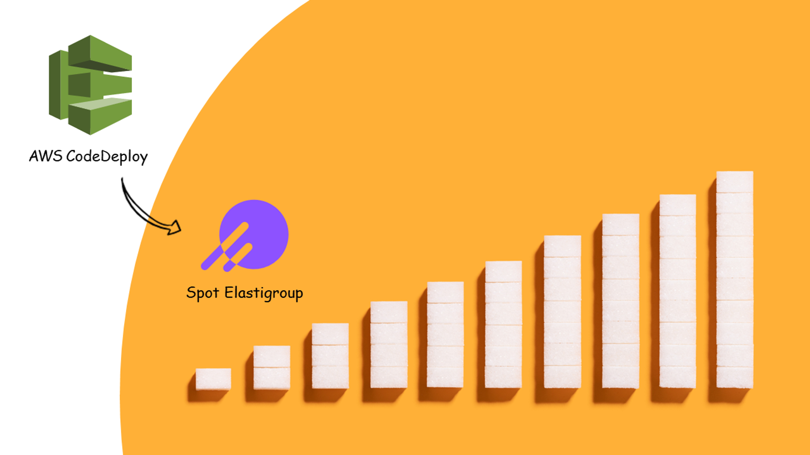

# Elastigroup

Elastigroup은 Spot by NetApp의 클라우드 관리형 인프라 자동화 서비스입니다. Elastigroup은 애플리케이션 수요에 따른 리소스 사용량을 지속적으로 분석하여 실시간으로 리소스를 확장하거나 축소하는 Autoscaling Group을 제공합니다. 또한 가장 저렴한 컴퓨팅 옵션을 사용하여 리소스를 최적화하므로 비용 효율적으로 최상의 성능을 유지할 수 있습니다.

# Elastigroup과 CodeDeploy

Elastigroup에 CodeDeploy를 연동한 다음 Blue/Green 방식으로 애플리케이션을 배포하면 다음과 같은 단계를 거쳐 동작합니다.

1. 소스 단계: Amazon S3 또는 GitHub 소스 코드 리포지토리에서 애플리케이션의 소스 코드를 가져옵니다.
2. 빌드 단계: 소스 코드를 기반으로 애플리케이션을 빌드하고 빌드 작업을 수행합니다.
3. 배포 단계: 빌드된 애플리케이션을 Elastigroup에 배포합니다. 이때 Blue/Green 방식을 사용하여 새로운 버전의 애플리케이션(Green)을 배포하고 기존 버전의 애플리케이션(Blue)과 병렬로 운영됩니다.
4. 테스트 단계: 배포된 새로운 버전의 애플리케이션(Green)의 상태를 확인합니다.
5. 트래픽 전환 단계: 테스트가 완료된 새로운 버전의 애플리케이션(Green)에 대해 트래픽을 전환합니다. Elastigroup을 통해 트래픽을 새로운 버전의 애플리케이션(Green)으로 라우팅하고, 기존 버전의 애플리케이션(Blue)과 병렬로 운영 중인 경우 트래픽을 공유하며 한 번에 하나의 버전으로 전환합니다.

이를 통해 애플리케이션의 안정성과 가용성을 유지하면서 비용 효율적인 배포 자동화를 구성할 수 있습니다.

또한 AWS CodePipeline과 AWS Lambda를 사용하여 Elastigroup 및 CodeDeploy의 API를 통해 애플리케이션의 배포 프로세스를 자동화함으로써 Spot 인스턴스로 Blue/Green 배포를 수행할 수도 있습니다. 아키텍처는 아래와 같으며 Codepipeline 사용에 대한 자세한 내용은 다음 문서[[1]](https://spot.io/blog/using-codepipeline-for-blue-green-deployment-and-cloud-cost-optimization/)를 참고해 주세요.

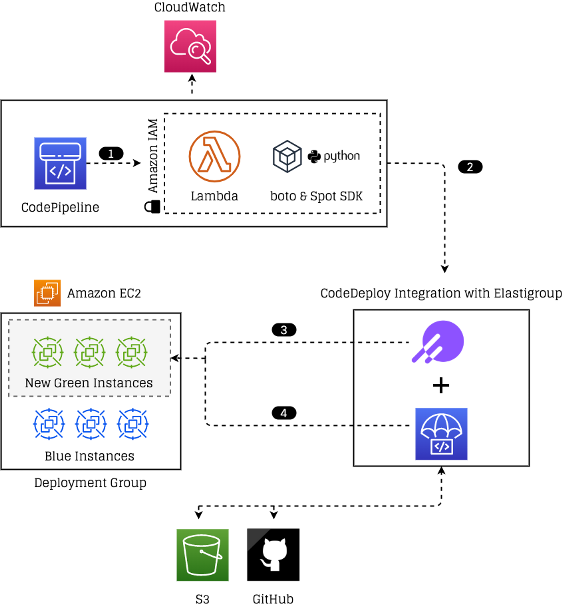

---

먼저 CodeDeploy를 Elastigroup에 연동하고 새로운 버전의 애플리케이션을 Blue/Green 방식으로 배포하기 위해 필요한 전제 조건부터 살펴볼까요?

# 1. 전제 조건
## -  1.1 배포 그룹 존재 여부 확인
## - 1.2 배포 그룹의 배포 유형 및 환경 구성 확인
## - 1.3 배포 그룹 생성 

<br>

## 1.1. 배포 그룹 존재 여부 확인

AWS CodeDeploy 콘솔 > CodeDeploy > 애플리케이션에서 배포하려는 애플리케이션 내 배포 그룹이 존재해야 합니다.

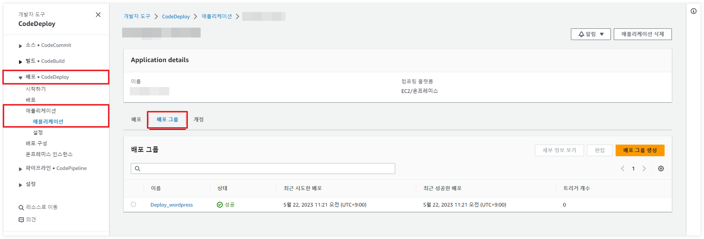

## 1.2. 배포 그룹의 배포 유형 및 환경 구성 확인

- 배포 그룹의 배포 유형을 **블루/그린**으로 선택해야 합니다.
- 환경 구성에서 **인스턴스 수동 프로비저닝**을 선택하고 배포에 추가할 인스턴스를 **Amazon EC2 인스턴스**로 선택해야 합니다.

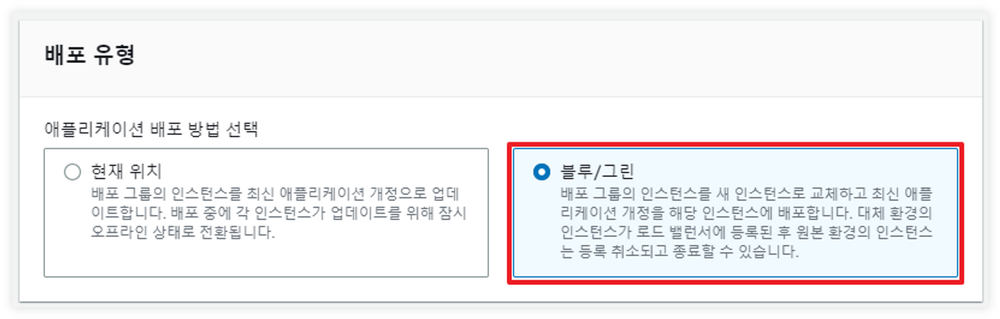
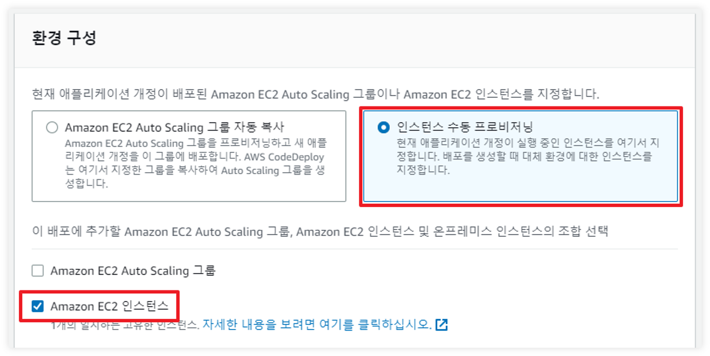

## 1.3 배포 그룹 생성

배포 그룹이 없는 경우 배포 그룹을 생성합니다.

1. AWS CodeDeploy 콘솔 > CodeDeploy > 애플리케이션에서 배포하려는 애플리케이션을 선택합니다.
2. **배포 그룹** 탭을 선택한 다음 **배포 그룹 생성**을 클릭합니다.
3. **배포 그룹 이름**에 배포 그룹을 설명하는 이름을 입력합니다.
4. **서비스 역할**에서 대상 인스턴스에 액세스할 수 있는 권한을 CodeDeploy에 부여하는 서비스 역할을 선택합니다.
5. **배포 유형**에서 **블루/그린**을 선택합니다.
    
    
    
6. **환경 구성**에서 대체 환경에 인스턴스를 제공하는 방법으로 **인스턴스 수동 프로비저닝**을 선택합니다. 
    - 인스턴스 수동 프로비저닝은 배포를 만들 때까지 대체 환경에 필요한 인스턴스를 지정할 수 없으며 배포를 시작하려면 먼저 인스턴스를 만들어야 합니다. 여기에서 대체할 인스턴스를 지정합니다.
    - 이 배포에 추가할 인스턴스 조합 선택에서 **Amazon EC2 인스턴스**를 선택합니다.
    - 태그를 추가합니다. 추적의 용이성을 위해 key와 value의 값을 업데이트 가능한 버전 명으로 관리하는 것을 권장합니다. (예: {“version”: “6.0”})
        
        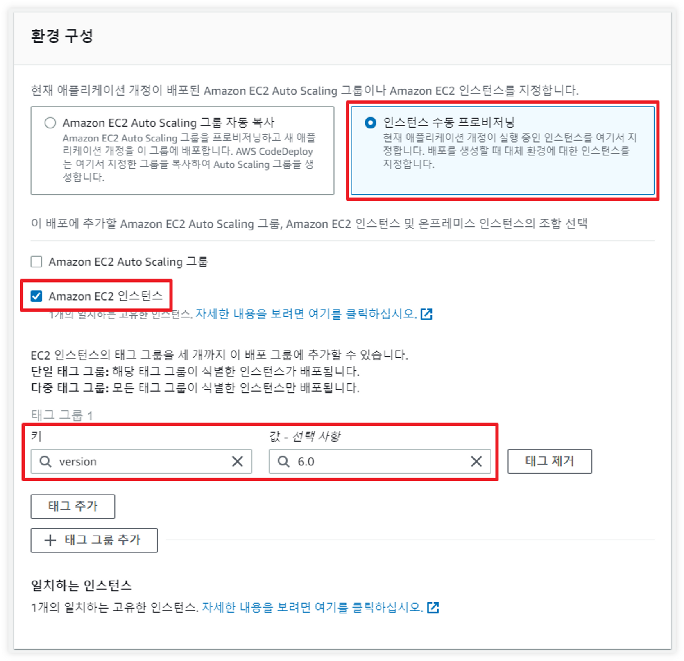
        
7. **배포 설정**에서 대체 환경으로 트래픽을 다시 라우팅하기 위한 기본 옵션(배포에 사용할 배포 구성임)과 배포 후 원본 환경의 인스턴스 처리 방법에 대한 기본 옵션을 검토합니다.
8. **블루/그린 배포**에 대한 배포 설정을 변경하려면 다음 설정을 선택합니다.
    - 트래픽 재 라우팅 여부를 선택합니다.
    - 배포에 성공한 다음 원본 환경의 인스턴스를 종료할지 여부와 종료 전 대기 시간을 선택합니다.
    - 배포 구성에서 대체 환경의 인스턴스가 로드 밸런서에 등록되는 속도를 선택합니다. (예: 한 번에 하나씩 또는 한 번에 모두)
9. **로드 밸런서**에서 배포 프로세스 중 인스턴스로 가는 트래픽을 관리할 기존 로드 밸런서와 대상 그룹을 선택합니다. 각 인스턴스는 로드 밸런서 또는 대상 그룹에서 등록 취소되어 배포 중 트래픽이 인스턴스로 라우팅되지 않도록 합니다. 배포가 완료되면 다시 등록됩니다.
10. **(선택 사항) 고급 – 선택사항**에서 배포에 포함하려는 모든 옵션(Amazon SNS 알림 트리거, Amazon CloudWatch 경보, 자동 롤백)을 구성합니다.
11. **배포 그룹 생성**을 클릭합니다. 

---
<br>
<br>
Spot Elastigroup에 AWS CodeDeploy를 연동하고 Blue/Green 방식으로 새로운 애플리케이션을 배포하는 방법은 다음과 같습니다.


# 2. Elastigroup에 CodeDeploy 연동하기(Blue/Green)

## - 2.1 Elastigroup 생성
## - 2.2 CodeDeploy B/G 배포
## - 2.3 AWS CodeDeploy 배포 생성

## 2.1. Elastigroup 생성

1. Spot 콘솔에서 Elastigroup의 Groups 탭으로 이동하여 Create > **Use Cases**를 선택합니다.
2. Use Cases에서 CodeDeploy를 선택한 다음, **Continue**를 선택합니다.
    
    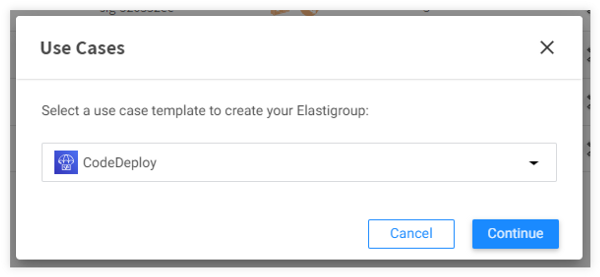
    

<aside>
💡 **참고**
다음 방법으로도 Elastigroup에 CodeDeploy를 구성할 수 있습니다.

1. Create > **Start from scratch**를 선택합니다.
2. Compute 탭의 INTEGRATIONS에서 **CodeDeploy**를 선택합니다.
    
    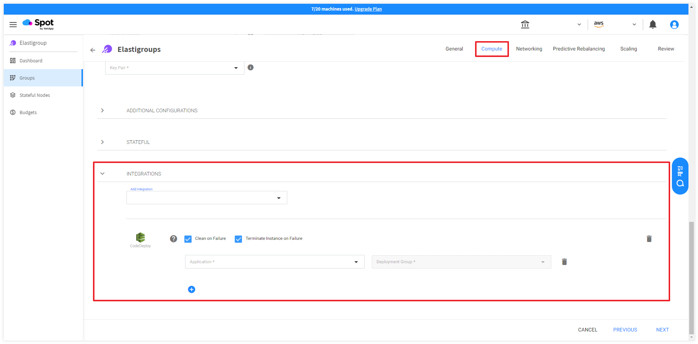
    
</aside>

### 1단계: General 설정

1. Elastigroup의 이름을 입력하고 그룹이 위치할 Region을 선택합니다. 필요한 경우 그룹에 대한 설명을 추가합니다.
2. **NEXT**를 선택합니다.

### 2단계: Compute 설정

1. **VPC**: Elastigrouop이 인스턴스를 실행할 VPC를 선택합니다.
2. **Product**: 사용할 운영 체제(OS) 유형을 선택합니다.
3. **On-Demand Type**: 시장에서 Spot 인스턴스를 사용할 수 없는 경우에 대비해 사용할 온디맨드 유형을 선택합니다.
4. **AVAILABILITY ZONES**: 가용성을 위해 하나 이상의 가용 영역(Availability Zone)을 선택하고 Elastigroup이 인스턴스를 분산하여 실행할 수 있도록 각 가용 영역에 대해 하나 이상의 서브넷을 선택합니다.
    
   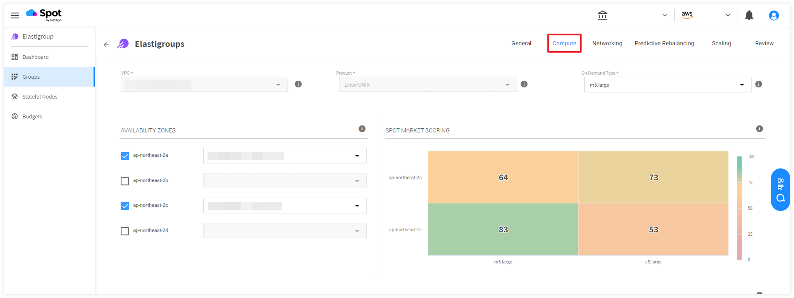
    
5. **SPOT TYPES**: Spot 인스턴스를 배포할 인스턴스 타입을 선택합니다.
    
    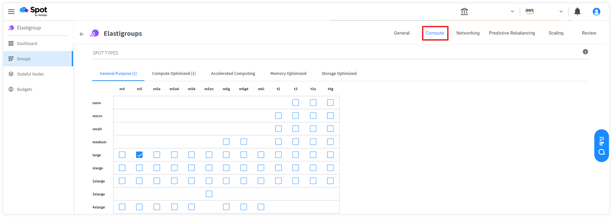
    
6. **LAUNCH SPECIFICATION**에서 다음을 수행합니다.
    - **Image**: Elastigroup에 사용할 AMI를 선택합니다. AMI는 Elastigroup과 동일한 리전을 기반으로 해야 합니다.
    - **Security Groups**: 인스턴스에 적용할 하나 이상의 보안 그룹을 선택합니다.
    - **Key Pair**: 인스턴스 인증에 사용할 키 페어를 선택합니다.
    - **TAGS**: `+` 아이콘을 클릭하여 태그를 추가합니다.
        
        <aside>
        💡 태그는 Blue 또는 Green을 식별할 수 있는 태그가 아닌 각 Elastigroup을 식별할 수 있는 태그여야 합니다. (예: {”Name”: “[Name]”, “Owner”: “[Owner]”})
        
        </aside>
        
        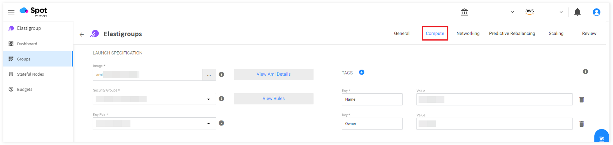
        
7. **ADDITIONAL CONFIGURATIONS**에서 다음을 수행합니다.
    - **IAM Role**: 인스턴스에 적용할 IAM Role을 선택합니다. 해당 Role은 AWS SSM(Systems Manager)과 CodeDeploy에 대한 권한 정책을 포함해야 합니다.
    - **USER DATA(STARTUP SCRIPT)**: AWS SSM을 사용하여 CodeDeploy Agent를 EC2 인스턴스에 설치할 수 있습니다. Amazon Linux 2 또는 Amazon Linux 2023(AL2023) 인스턴스에는 SSM Agent가 미설치되어 있으므로 다음 설치 명령 코드를 실행하여 SSM Agent를 수동으로 설치합니다.
        
        ```bash
        #!/bin/bash
        yum update -y
        sudo yum install -y https://s3.ap-northeast-2.amazonaws.com/amazon-ssm-ap-northeast-2/latest/linux_amd64/amazon-ssm-agent.rpm
        ```
        
        - Amazon Linux 인스턴스에 SSM Agent 수동으로 설치하는 것에 관해 다음 문서를 참조하십시오.
            
            [Manually installing SSM Agent on Amazon Linux instances - AWS Systems Manager](https://docs.aws.amazon.com/systems-manager/latest/userguide/agent-install-al.html)
            
8. **INTEGRATIONS**에서 다음을 수행합니다.
    - **Application**: 배포할 애플리케이션을 선택합니다.
    - **Deployment Group**: 애플리케이션의 배포 그룹을 선택합니다.
    
    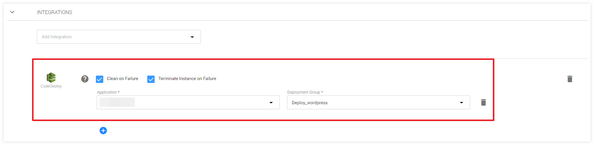
    
    - **NEXT**를 선택합니다.

### 3단계: Networking 설정

1. **INCOMING TRAFFIC BALANCING**: 유입되는 트래픽을 관리할 방법을 선택합니다. 
    - **Attach Existing Load Balancers**: 기존 로드밸런서를 사용하는 경우 이 옵션을 선택하고 로드 밸런서 이름을 선택합니다.
2. **NEXT**를 선택합니다.

### 4단계: Predictive Rebalancing 설정

1. **SET THE CAPACITY OF YOUR WORKLOAD**에서 다음을 수행합니다.
    - Capacity Unit: Instance(기본값) 또는 vCPU에서 필요한 수 단위를 선택합니다.
    - 다음 중 하나를 선택합니다.
        - **Set by % of spot instances**: Spot 인스턴스를 실행할 총 인스턴스의 백분율을 입력합니다.
        - **Set by specific On Demand count**: 온디맨드로 실행할 특정 인스턴스의 수를 입력합니다.
2. **DEFINE YOUR OPTIMIZATION STRATEGY**에서 최적화 전략을 정의합니다.
3. **KEEP IT OPTIMIZED**에서 최적화 방법을 선택합니다.
4. **INSTANCE AVAILABILITY**에서 최소 인스턴스 수명 및 기타 가용성 기본 설정을 정의합니다.

### 5단계: Scaling 설정(선택 사항)

사용자 정의에 따라 확장 정책을 적절하게 설정합니다.

### 6단계: Review

구성한 모든 Elastigroup 설정을 검토하고 **CREATE**를 선택하여 생성을 완료합니다.

또한 EXPORT를 선택하면 json, cloudformation, terraform으로 구성 내용을 다운로드할 수 있습니다.

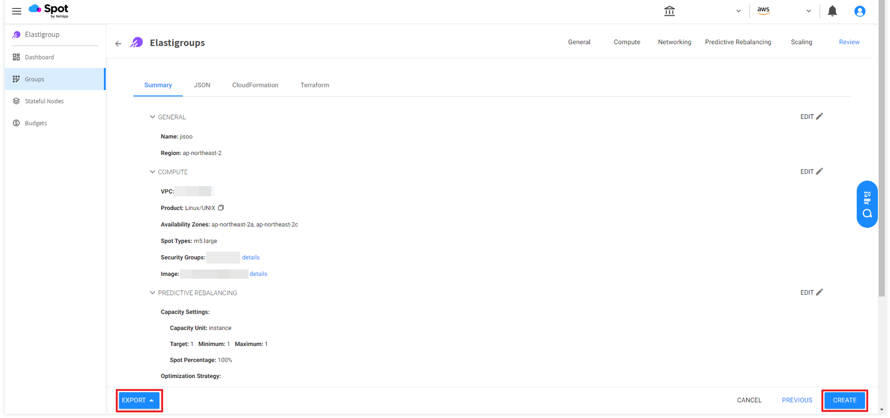

## 2.2 CodeDeploy B/G 배포

Elastigroup에서 CodeDeploy의 Blue/Green 배포를 수행하는 방법은 다음과 같습니다.

1. Elastigroup의 **CodeDeploy B/G** 탭을 선택합니다.
2. **Depolyment Group**: Elasitgroup에 매핑한 배포 그룹을 선택합니다.
3. **Deployment Timeout**: 배포 작업의 최대 시간을 초 단위로 설정합니다. 
    - 최대값은 존재하지 않으며 적절한 Timeout 값을 설정하여 충분한 시간을 제공하는 것이 좋습니다.
    - 배포 작업이 예상보다 오래 걸리게 되어 이 시간을 초과하면 더 이상 대기하지 않고 배포 작업 실패 후 종료됩니다.
4. GREEN TAGS에 태그를 추가합니다. 
    - Key와 Value 값을 입력한 다음 `+` 아이콘을 클릭해야 태그 추가가 완료됩니다.
        
       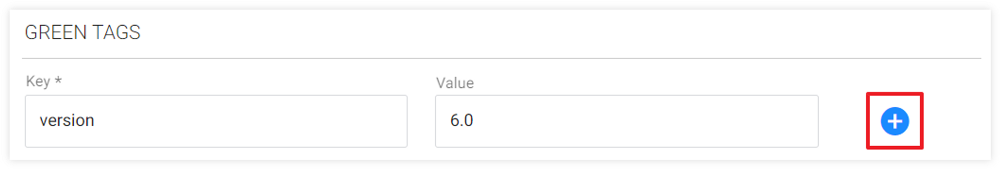
        
5. **START DEPLOYMENT MODE**를 선택합니다.
    
    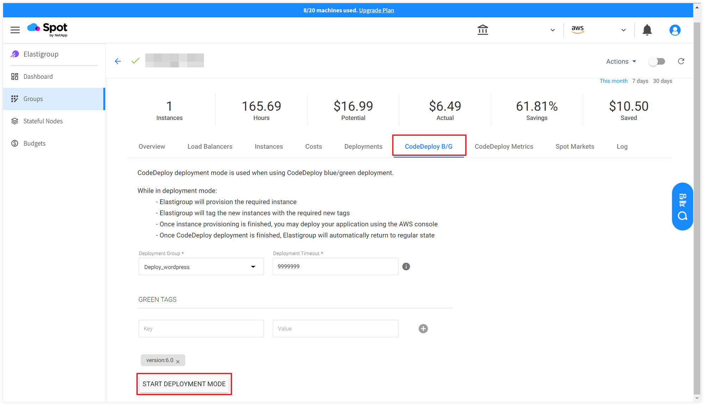
    

<aside>
💡 **주의
CodeDeploy B/G** 배포 시 현재 배포되어 있는 인스턴스 대수만큼 새로운 인스턴스가 배포됩니다.

</aside>

<aside>
💡 **주의
사용자 정의에 따라 CodeDeploy 배포 그룹 설정을 적절하게 선택하고 확인해야 합니다.**
1. AWS 콘솔 > CodeDeploy로 이동합니다.
2. 애플리케이션을 선택한 다음, **배포 그룹** 탭에서 배포 그룹을 선택합니다.
3. **배포 설정**에서 다음 항목에 선택한 옵션을 확인합니다.

- 트래픽 재 라우팅
- 배포 성공 후 원본 환경 인스턴스 종료 여부

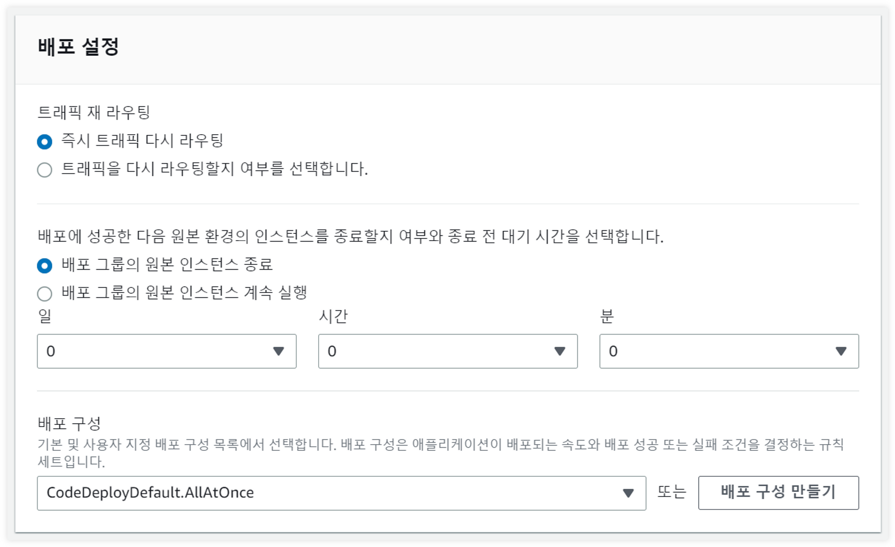

</aside>

## 2.3 AWS CodeDeploy 배포 생성

1. AWS 콘솔 > CodeDeploy로 이동합니다.
2. 애플리케이션을 선택한 다음, **배포** 탭에서 **배포 만들기**를 선택합니다.
3. **배포 그룹**: 이 배포에 사용할 배포 그룹을 선택합니다.
4. **개정 유형**에서 다음 중 하나를 선택합니다.
    - 애플리케이션을 S3에 저장
        - 개정 위치에 Amazon S3 링크를 입력하고 개정 파일 형식을 선택합니다.
    - 애플리케이션을 GitHub에 저장
        - 이미 연결된 계정이 있는 경우 GitHub 토큰 이름을 선택합니다. GitHub 계정에 처음 연결하려면 계정의 별칭을 입력한 다음 GitHub에 연결을 선택합니다.
    
    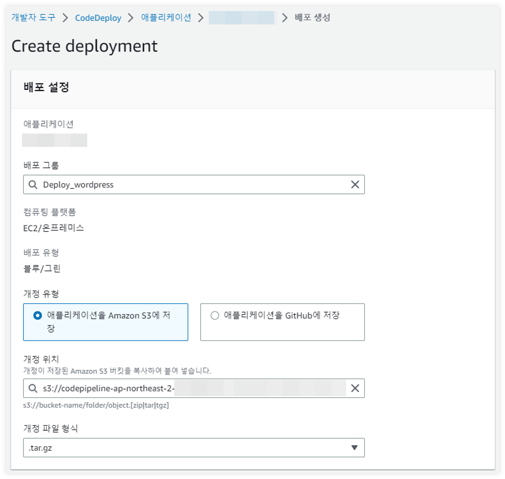
    
5. **환경 구성**에서 **Amazon EC2 인스턴스**를 선택합니다.
6. 태그를 추가합니다. 추적의 용이성을 위해 key와 value의 값을 업데이트 가능한 버전 명으로 관리하는 것을 권장합니다. (예: {“version”: “6.0”})
    
    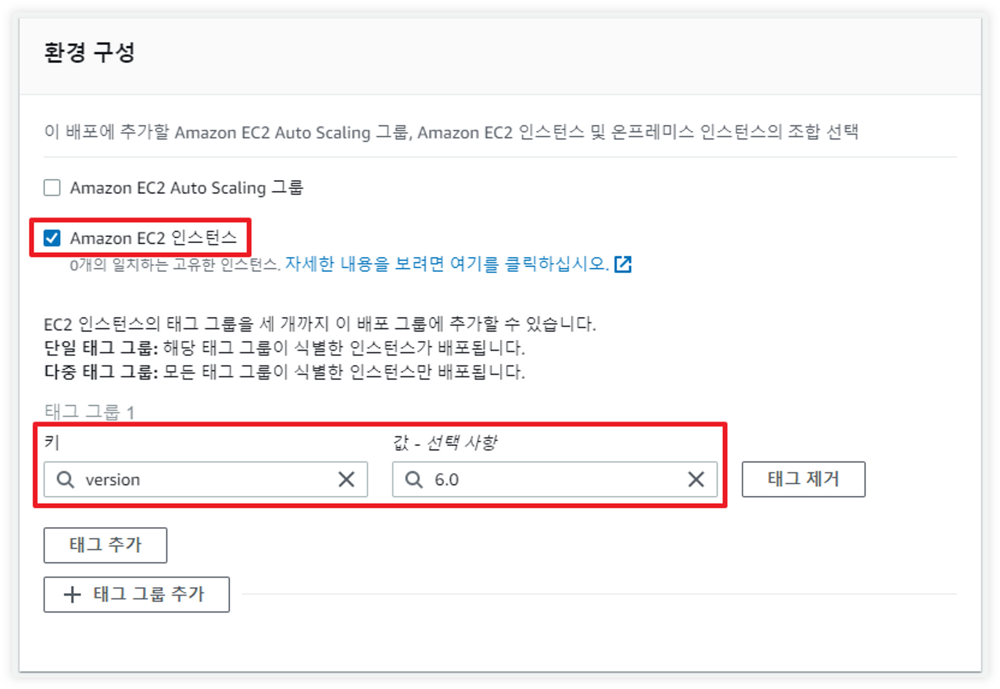
    
7. 필요한 경우 **배포 설명**에 배포에 대한 설명을 추가합니다.
8. 사용자 정의에 따라 다음 항목에 적절한 옵션을 선택합니다. 
    - **추가 배포 동작 설정**
    - **배포 그룹 재정의**
    - **롤백 구성 재정의**
9. **배포 만들기**를 선택합니다.
10. 배포 내역은 AWS 콘솔 > CodeDeploy > 애플리케이션의 **배포** 탭에서 모니터링할 수 있습니다.
    
   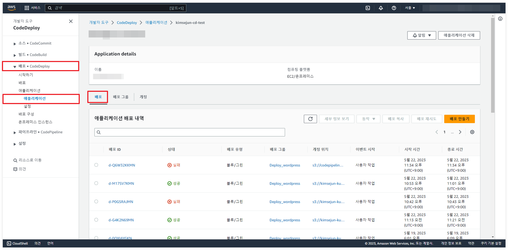

---

# FAQ

Q. **Elastigroup에 인스턴스가 추가되었지만 CodeDeploy가 작동하지 않는 경우 어떻게 해야 하나요?**

A. CodeDeploy가 처음 동작하려면 Elastigroup의 CodeDeploy B/G가 최초 1회 실행되어야 합니다.

**Q. Blue에 추가한 태그는 언제 인스턴스에 추가되나요?**

A. 인스턴스에 해당 태그가 추가되려면 Elastigroup의 CodeDeploy B/G가 한번 배포되어야 합니다. 인스턴스가 생성된 이후 태그가 추가됩니다. 

**Q. AWS 콘솔에서 다음과 같은 에러가 발생하면 어떻게 해야 하나요?**

<aside>
⚠️ “green fleet에 인스턴스를 찾을 수 없습니다”

</aside>

A. 배포 그룹에 추가한 태그가 Blue와 Green에 등록된 태그와 동일한 경우 배포에 실패합니다.

**Q. AWS 콘솔에서 대체가 없다고 나올 때 어떻게 해야 하나요?**

A. 배포 그룹에 기입된 태그 값이 Elastigroup의 태그에 포함되어 있는 경우 Source를 모든 EC2 인스턴스로 보기 때문에 발생하는 에러입니다. 

- 배포 그룹의 태그는 추적의 용이성을 위해 key와 value의 값을 업데이트 가능한 버전 명으로 관리하는 것을 권장합니다. (예: {“version”: “6.0”})
- Elastigroup의 태그는 Blue 또는 Green을 식별할 수 있는 태그가 아닌 각 Elastigroup을 식별할 수 있는 태그여야 합니다. (예: {”Name”: “[Name]”, “Owner”: “[Owner]”})

**Q. AWS CodeDeploy 배포가 실패하면 어떻게 해야 하나요?**

A. AWS CodeDeploy 배포 생성에 실패한 경우 인스턴스는 Spot 콘솔에서 수동으로 삭제해야 합니다.

이때 Elastigroup의 Capacity 중 Max 값이 변경되었으므로 다시 기존에 설정한 값으로 수정해야 합니다.

**Q. Elastigroup에 CodeDeploy를 연동한 경우 Roll 기능을 지원하나요?**

A. Elastigroup에 연동한 CodeDeploy에서는 Roll은 지원하지 않으며 Blue/Green 배포를 의미하는 Deploy 기능을 지원합니다.

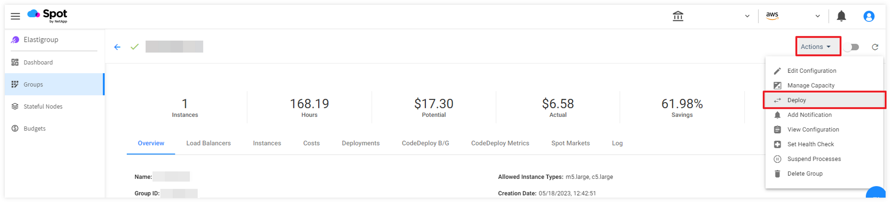

**Q. Green 배포를 완료했는데 인스턴스 수가 줄어들지 않으면 어떻게 해야 하나요?**

A. AWS 콘솔 > CodeDeploy > 애플리케이션에서 배포 설정에 **배포 그룹의 원본 인스턴스 계속 실행**이 선택되어 있는지 확인합니다. 배포에 성공한 후에도 종료하지 않고 계속 실행하도록 설정된 경우, Elastigroup은 Capacity를 늘리고 인스턴스를 추가합니다. 

예를 들어 배포 그룹의 원본 인스턴스 계속 실행 설정이 활성화된 경우 Elastigroup의 Capacity 설정은 다음과 같이 수정됩니다.

- 기존 Elastigroup의 Capacity 설정: [Target: 1, Min: 1, Max: 1]
- 배포 후 Capacity 설정: [Target: 2, Min: 1, Max: 2]

따라서 배포가 완료된 후 Elastigroup의 Capacity를 기존에 설정한 값으로 수정해야 합니다. 방법은 다음과 같습니다.

1. Spot 콘솔 > Elastigroup으로 이동합니다.
2. Elastigroup을 선택하고 Actions > **Manage Capacity**를 선택합니다.
3. Target을 기존에 설정한 값으로 수정한 다음, **UPDATE**를 선택합니다.

---

🖇️ 참고 문서

[1] Using CodePipeline for blue/green deployment and cloud cost optimization -  https://spot.io/blog/using-codepipeline-for-blue-green-deployment-and-cloud-cost-optimization/
