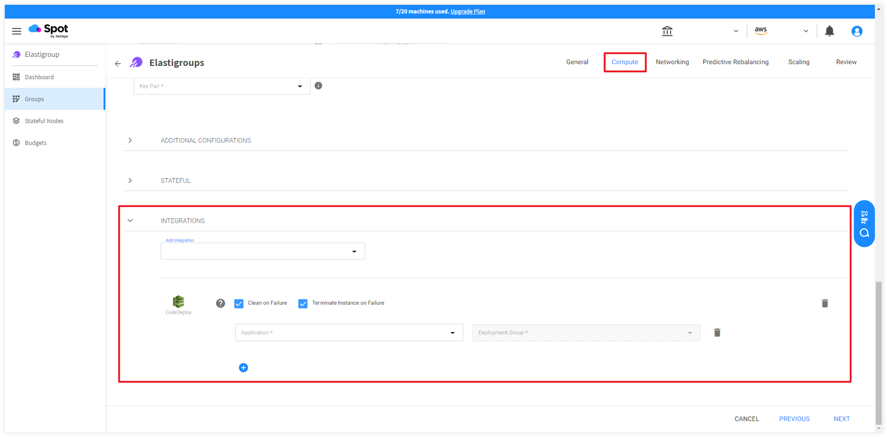

안녕하세요, NBD팀 배지수입니다.

지난 시간에는 AWS CodeDeploy를 Spot Elastigroup에 연동하고 새로운 버전의 애플리케이션을 Blue/Green 방식으로 배포하는 방법에 대해 알아보았습니다. 
-  [Elastigroup에 CodeDeploy 연동하기(Blue/Green) 바로가기](https://tech.cloudmt.co.kr/2023/07/10/230710/) 

Blue/Green 배포는 애플리케이션의 운영과 관리를 따로 하는 경우 두 개의 환경을 동시에 유지하고 모니터링하는 데 복잡성이 있는 반면 In-place 배포는 애플리케이션의 새로운 버전을 현재 위치에 배포하므로 배포 과정을 단순화할 수 있습니다. 이번 시간에는 CodeDeploy를 Elastigroup에 연동하고 In-place 방식으로 배포하는 방법을 공유하려고 합니다.


---

먼저 CodeDeploy를 Elastigroup에 연동하고 새로운 버전의 애플리케이션을 In-place 방식으로 배포하기 위해 필요한 전제 조건은 다음과 같습니다.

# 1. 전제 조건

## - 1.1 배포 그룹 존재 여부 확인

## - 1.2 배포 그룹의 배포 유형 및 환경 구성 확인
## - 1.3 배포 그룹 생성

<br>

## 1.1. 배포 그룹 존재 여부 확인

AWS CodeDeploy 콘솔 > CodeDeploy > 애플리케이션에서 배포하려는 애플리케이션 내 배포 그룹이 존재해야 합니다.


## 1.2. 배포 그룹의 배포 유형 및 환경 구성 확인

- 배포 그룹의 배포 유형을 **현재 위치**로 선택해야 합니다.
- 환경 구성에서 배포에 추가할 인스턴스 조합으로 **Amazon EC2 Auto Scaling 그룹과 Amazon EC2 인스턴스**를 ****선택해야 합니다.


## 1.3 배포 그룹 생성

배포 그룹이 없는 경우 배포 그룹을 생성합니다.

1. AWS CodeDeploy 콘솔 > CodeDeploy > 애플리케이션에서 배포하려는 애플리케이션을 선택합니다.
2. **배포 그룹** 탭을 선택한 다음 **배포 그룹 생성**을 클릭합니다.
3. **배포 그룹 이름**에 배포 그룹을 설명하는 이름을 입력합니다.
4. **서비스 역할**에서 대상 인스턴스에 액세스할 수 있는 권한을 CodeDeploy에 부여하는 서비스 역할을 선택합니다.
5. **배포 유형**에서 **현재 위치**를 선택합니다.
    
    

6. **환경 구성**에서 배포에 추가할 인스턴스 조합으로 **Amazon EC2 Auto Scaling 그룹과 Amazon EC2 인스턴스**를 ****선택합니다.
    - 이 배포에 추가할 인스턴스 조합 선택에서 **Amazon EC2 인스턴스**를 선택합니다.
    - 태그를 추가합니다. 추적의 용이성을 위해 key와 value의 값을 업데이트 가능한 버전 명으로 관리하는 것을 권장합니다. (예: {“version”: “8.0”})
        
        
        
7. AWS Systems Manager를 사용한 에이전트 구성을 확인합니다.
    - EC2 인스턴스에는 CodeDeploy 배포에 사용할 CodeDeploy 에이전트가 설치되어 있어야 합니다.
    - AWS Systems Manager를 사용하여 CodeDeploy 에이전트를 설치하고 업데이트를 예약할 수 있습니다. 이를 위해서는 SSM 에이전트가 설치되어 있어야 하며 Systems Manager에 CodeDeploy 에이전트를 설치할 수 있는 권한이 부여되어야 합니다.
    - 또는 User Script를 사용하여 CodeDeploy 에이전트를 설치할 수 있습니다.
8. **배포 설정**에서 애플리케이션이 배포되는 속도와 배포 성공 또는 실패 조건을 결정하는 규칙 세트인 배포 구성을 선택합니다.
9. **로드 밸런서**에서 배포 프로세스 중 인스턴스로 가는 트래픽을 관리할 기존 로드 밸런서와 대상 그룹을 선택합니다. 로드 밸런서는 배포 중인 각 인스턴스에 트래픽을 차단하고 배포가 완료되면 트래픽을 다시 허용합니다.
10. **(선택 사항) 고급 – 선택사항**에서 배포에 포함하려는 모든 옵션(Amazon SNS 알림 트리거, Amazon CloudWatch 경보, 자동 롤백)을 구성합니다.
11. **배포 그룹 생성**을 클릭합니다.

---
<br>

Spot Elastigroup에 AWS CodeDeploy를 연동하고 In-place 방식으로 새로운 애플리케이션을 배포하는 방법은 다음과 같습니다.

# 2. Elastigroup에 CodeDeploy 연동하기(In-place)

## - 2.1 Elastigroup 생성
## - 2.2 AWS CodeDeploy 배포 생성

<br>

## 2.1. Elastigroup 생성

1. Spot 콘솔에서 Elastigroup의 Groups 탭으로 이동하여 Create > Use Cases를 선택합니다.
2. Use Cases에서 CodeDeploy를 선택한 다음, Continue를 선택합니다.
    
    

<aside>
💡 **참고**
다음 방법으로도 Elastigroup에 CodeDeploy를 연동할 수 있습니다.

1. Create > **Start from scratch**를 선택합니다.
2. Compute 탭의 INTEGRATIONS에서 **CodeDeploy**를 선택합니다.
    
    
    
</aside>

### 1단계: General 설정

1. Elastigroup의 이름을 입력하고 그룹이 위치할 Region을 선택합니다. 필요한 경우 그룹에 대한 설명을 추가합니다.
2. **NEXT**를 선택합니다.

### 2단계: Compute 설정

1. **VPC**: Elastigrouop이 인스턴스를 실행할 VPC를 선택합니다.
2. **Product**: 사용할 운영 체제(OS) 유형을 선택합니다.
3. **On-Demand Type**: 시장에서 Spot 인스턴스를 사용할 수 없는 경우에 대비해 사용할 온디맨드 유형을 선택합니다.
4. **AVAILABILITY ZONES**: 가용성을 위해 하나 이상의 가용 영역(Availability Zone)을 선택하고 Elastigroup이 인스턴스를 분산하여 실행할 수 있도록 각 가용 영역에 대해 하나 이상의 서브넷을 선택합니다.
    
    
    
5. **SPOT TYPES**: Spot 인스턴스를 배포할 인스턴스 타입을 선택합니다.
    
    
    
6. **LAUNCH SPECIFICATION**에서 다음을 수행합니다.
    - **Image**: Elastigroup에 사용할 AMI를 선택합니다. AMI는 Elastigroup과 동일한 리전을 기반으로 해야 합니다.
    - **Security Groups**: 인스턴스에 적용할 하나 이상의 보안 그룹을 선택합니다.
    - **Key Pair**: 인스턴스 인증에 사용할 키 페어를 선택합니다.
    - **TAGS**: `+` 아이콘을 클릭하여 태그를 추가합니다.
        
        <aside>
        💡 태그는 각 Elastigroup을 식별할 수 있는 태그여야 합니다. (예: {”Name”: “[Name]”, “Owner”: “[Owner]”})
        
        </aside>
        
        
        
7. **ADDITIONAL CONFIGURATIONS**에서 다음을 수행합니다.
    - **IAM Role**: 인스턴스에 적용할 IAM Role을 선택합니다. 해당 Role은 AWS SSM(Systems Manager)과 CodeDeploy에 대한 권한 정책을 포함해야 합니다.
    - **USER DATA(STARTUP SCRIPT)**: AWS SSM을 사용하여 CodeDeploy Agent를 EC2 인스턴스에 설치할 수 있습니다. Amazon Linux 2 또는 Amazon Linux 2023(AL2023) 인스턴스에는 SSM Agent가 미설치되어 있으므로 다음 설치 명령 코드를 실행하여 SSM Agent를 수동으로 설치합니다.
        
        ```bash
        #!/bin/bash
        yum update -y
        sudo yum install -y https://s3.ap-northeast-2.amazonaws.com/amazon-ssm-ap-northeast-2/latest/linux_amd64/amazon-ssm-agent.rpm
        ```
        
        - Amazon Linux 인스턴스에 SSM Agent 수동으로 설치하는 것에 관해 다음 문서를 참조하십시오.
            
            [Manually installing SSM Agent on Amazon Linux instances - AWS Systems Manager](https://docs.aws.amazon.com/systems-manager/latest/userguide/agent-install-al.html)
            
8. **INTEGRATIONS**에서 다음을 수행합니다.
    - **Application**: 배포할 애플리케이션을 선택합니다.
    - **Deployment Group**: 애플리케이션의 배포 그룹을 선택합니다.
    
    
    
- **NEXT**를 선택합니다.

### 3단계: Networking 설정

1. **INCOMING TRAFFIC BALANCING**: 유입되는 트래픽을 관리할 방법을 선택합니다. 
    - **Attach Existing Load Balancers**: 기존 로드밸런서를 사용하는 경우 이 옵션을 선택하고 로드 밸런서 이름을 선택합니다.
2. **NEXT**를 선택합니다.

### 4단계: Predictive Rebalancing 설정

1. **SET THE CAPACITY OF YOUR WORKLOAD**에서 다음을 수행합니다.
- Capacity Unit: Instance(기본값) 또는 vCPU에서 필요한 수 단위를 선택합니다.
    - **Target**: 정상 작동 시 원하는 인스턴스 또는 vCPU 수를 입력합니다.
    - **Minimum**: 사용 가능한 최소 인스턴스 또는 vCPU 수를 입력합니다.
    - **Maximum**: 사용 가능한 최대 인스턴스 또는 vCPU 수를 입력합니다.
- 다음 중 하나를 선택합니다.
    - **Set by % of spot instances**: Spot 인스턴스를 실행할 총 인스턴스의 백분율을 입력합니다.
    - **Set by specific On Demand count**: 온디맨드로 실행할 특정 인스턴스의 수를 입력합니다.
1. **DEFINE YOUR OPTIMIZATION STRATEGY**에서 최적화 전략을 정의합니다.
2. **KEEP IT OPTIMIZED**에서 최적화 방법을 선택합니다.
3. **INSTANCE AVAILABILITY**에서 최소 인스턴스 수명 및 기타 가용성 기본 설정을 정의합니다.

### 5단계: Scaling 설정(선택 사항)

사용자 정의에 따라 확장 정책을 적절하게 설정합니다.

### 6단계: Review

구성한 모든 Elastigroup 설정을 검토하고 **CREATE**를 선택하여 생성을 완료합니다.

또한 EXPORT를 선택하면 json, cloudformation, terraform으로 구성 내용을 다운로드할 수 있습니다.


## 2.2 AWS CodeDeploy 배포 생성

1. AWS 콘솔 > CodeDeploy로 이동합니다.
2. 애플리케이션을 선택한 다음, **배포** 탭에서 **배포 만들기**를 선택합니다.
3. **배포 그룹**: 이 배포에 사용할 배포 그룹을 선택합니다.
4. **개정 유형**에서 다음 중 하나를 선택합니다.
    - 애플리케이션을 S3에 저장
        - 개정 위치에 Amazon S3 링크를 입력하고 개정 파일 형식을 선택합니다.
    - 애플리케이션을 GitHub에 저장
        - 이미 연결된 계정이 있는 경우 GitHub 토큰 이름을 선택합니다. GitHub 계정에 처음 연결하려면 계정의 별칭을 입력한 다음 GitHub에 연결을 선택합니다.
    
    
    
5. 필요한 경우 **배포 설명**에 배포에 대한 설명을 추가합니다.
6. 사용자 정의에 따라 다음 항목에 적절한 옵션을 선택합니다. 
    - **추가 배포 동작 설정**
    - **배포 그룹 재정의**
    - **롤백 구성 재정의**
7. **배포 만들기**를 선택합니다.
8. 배포 내역은 AWS 콘솔 > CodeDeploy > 애플리케이션의 **배포** 탭에서 모니터링할 수 있습니다.
    
    
    
    또는 AWS 콘솔 > CodeDeploy > 배포에서도 수행한 모든 배포 내역을 확인할 수 있습니다.
    
    
    
여기까지 CodeDeploy를 Elastigroup에 연동하고 In-place 방식으로 배포하는 방법을 소개하였습니다. 감사합니다. 

AWS, NetApp 관련하여 문의가 있으시면 [언제든 클라우드메이트로 연락주세요!](https://cloudmt.co.kr/?page_id=1837)


