# JavaScript V8 엔진의 asynchronous 알아보기

> 자바스크립트로 프로젝트를 진행하면서 여러가지 api와 통신을 하는 경우가 많았고
>
> api통신을 할 때 응답된 데이터를 다루다보면서 자연스럽게 자바스크립트의 비동기 제어에 대한
>
> 궁금증이 생기게 되어 알아보게 되었습니다.

자바스크립트 엔진중 가장 많이 사용하는 v8엔진을 기반으로 작성되었습니다. (구글 크롬)  

자바스크립트의 비동기 처리는 특정 코드의 연산이 실행되고있지만 결과를 기다리지 않고 다음 코드를 먼저 실행하는 자바스크립트의 특성을 의미합니다.

## 자바스크립트 엔진

자바스크립트 동작 방식은 아래이미지로 표현이 됩니다.
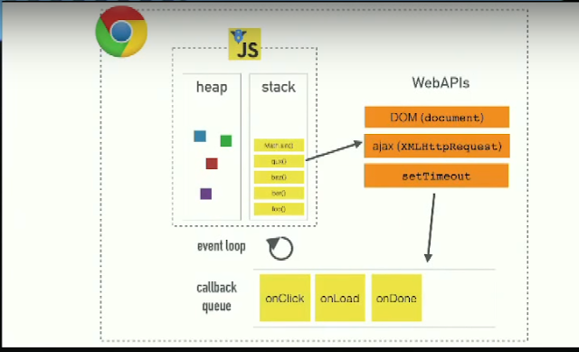

**V8엔진**은 크게 두 부분으로 구성됩니다.  

- 메모리 힙 (Memory Heap) : 메모리 할당이 이루어지는 곳
- 콜 스택 (call Stack) : 코드가 실행되면서 스택 프레임이 쌓이는곳

## 콜 스택 (Call Stack)

자바스크립트는 콜 스택이 하나이기에 싱글쓰레드 프로그래밍 언어입니다. 따라서 한번에 하나의 일만 처리할수 있습니다. 콜스택에 쌓인 함수나 코드를 위에서 아래로 차례대로 실행하며 하나의 작업이 끝나면 바로 아래의 코드를 실행합니다. 하나의 작업을 실행하고있으면 작업이 끝날때까지 다른 작업을 실행하지 않습니다.

다음 코드를 살펴보겠습니다.

```javascript
function first() {
  second();
  console.log("첫번째");
}
function second() {
  third();
  console.log("두번째");
}
function third() {
  console.log("세번째");
}

first();
```

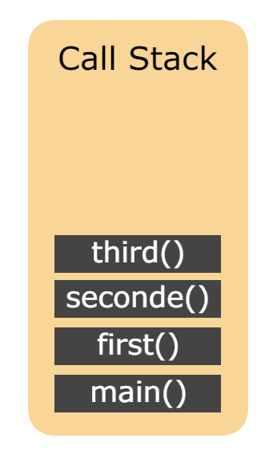

main() 함수는 함수가 호출되었을때 생성되는 함수입니다. 그림을 보면 third(), seconde(), first(), main() 순으로 Pop되며 main() 함수까지 실행이 완료되면 호출 스택이 지워집니다.  
위 코드를 실행하면

- 세번째
- 두번째
- 첫번째

순으로 콘솔에 출력됩니다.

## 자바스크립트 런타임

JS가 실행되는 환경을 런타임이라고 하며 JS엔진은 V8말고도 여러가지가 있습니다.  
구글 크롬이나 Node.js에서 JS코드를 실행하면 V8엔진이 코드를 인터프리팅합니다.  
런타임 환경에는 WebAPI와 EventLoop, Task Queue가 있습니다.  

- WebAPI : WebAPI는 브라우저에서 제공되는 API 입니다. setTimeout, Http 요청(ajax) 메소드, DOM 이벤트 등이 WebAPI에 속합니다.
- Task Queue : 이벤트가 발생한 후 호출되어야 할 콜백 함수들이 대기하고있는 공간입니다. 이벤트 루프가 정해준 순서대로 대기하고 있으며 콜백 큐 라고도 합니다.
- Event Loop : 이벤트 발생 시 호출할 콜백 함수들을 관리하며, 호출된 콜백함수의 실행순서를 결정합니다.

## Task Queue

자바스크립트에서 비동기 호출되는 함수들(setTimeout, ajax 등)은 콜 스택에 쌓이지 않고 WebAPI에서 처리 한 후 테스크 큐로 보내진다.  

그럼 아래의 코드가 어떤식으로 비동기 처리가 되는지 알아보겠습니다.

```javascript
console.log("시작");

setTimeout(() => {
  console.log("실행 중");
}, 3000);

console.log("종료");
```

위 코드를 실행하게 되면 실행하였을때 출력순서를 예측해보면 다음과 같은 순서의 결과값이 나올것이라 생각할 수 있습니다.  

- 시작 출력
- (3초간 대기 후) 실행 중 출력
- 종료 출력

하지만 실제 결과는  

- 시작 출력
- 종료 출력
- (3초간 대기 후) 실행 중 출력

예상과 달리 실제 결과값과 같이 출력이 된 이유는 setTimeout()함수가 비동기 방식으로 실행되기 때문에 3초를 기다렸다가 다음 코드가 실행되는것이 아니라 setTimeout()함수가 실행되고나서 바로 다음 코드가 실행되기 때문입니다.  

그렇다면

```javascript
console.log("시작");

setTimeout(() => {
  console.log("실행 중");
}, 0);

console.log("종료");
```

그럼 위 코드는 어떻게 실행될까요?  

위 코드도 마찬가지로  

- 시작
- 종료
- 실행 중

순으로 실행이 됩니다. 시간이 0초 더라도 비동기 함수를 사용했으므로 WebAPI -> 테스크 큐 -> 콜 스택순으로 이동하기 때문입니다.  
여기서 중요한 점은 테스크 큐에 대기하고있는 콜백함수는 콜 스택이 비어져있을 때만 이벤트 루프가 콜 스택으로 콜백 함수를 옮겨줍니다.  
위 코드들이 어떻게 실행되는지 이미지로 한번 확인해보겠습니다. 


1. 함수가 실행되면서 먼저 main()함수가 Call Stack에 쌓이고 console.log("시작)이 Call Stack에 쌓이고. 바로 실행되어 콘솔에 "시작"이 출력됩니다.  
  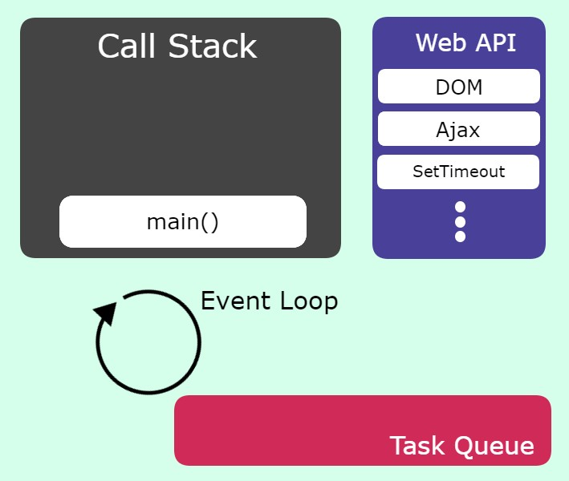
2. console.log("시작")이 리턴되고 Call Stack에서 제거됩니다.
  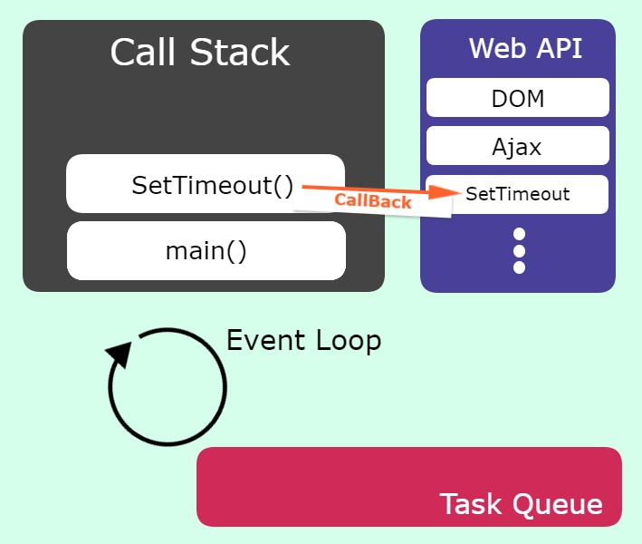
3. setTimeout() 함수가 실행이 되면서 Call Stack에 setTimeout함수가 들어가고. setTimeout 함수는 콜백 함수이므로 자바스크립트 엔진이 처리하지 않고 Web API로 전달하여 작업을 요청합니다.
  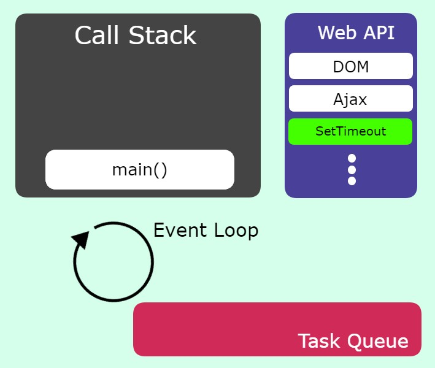
4. Call Stack에서는 setTimeout이 제거되고 Web API가 setTimeout을 처리합니다.
  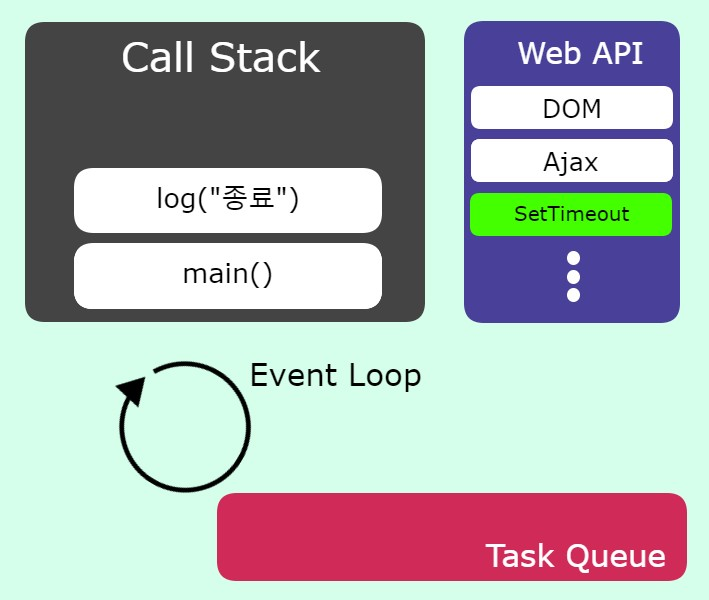
5. console.log("종료") 함수가 실행되며 Call Stack에 쌓이고 실행되어 콘솔에 "종료" 가 출력됩니다.
  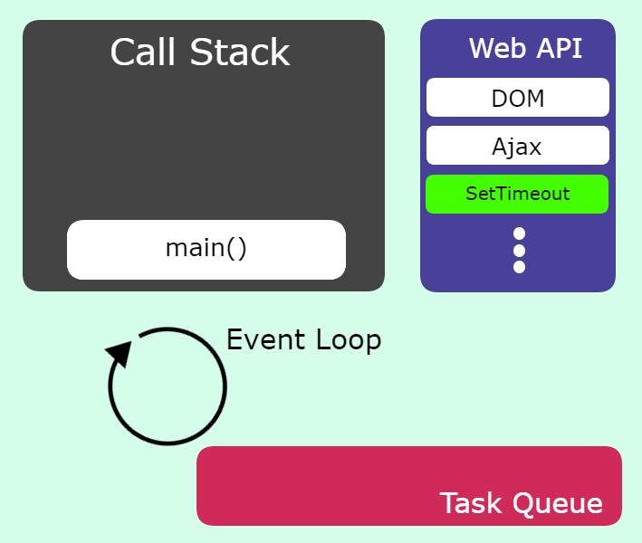
6. Call Stack에 있던 console.log("종료") 함수가 리턴되며 제거됩니다.
  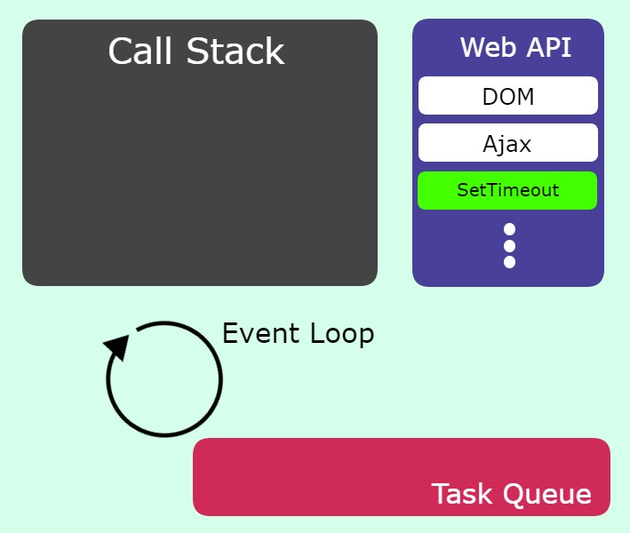
7. 모든 함수의 실행이 종료되었으므료 main() 함수가 리턴되며 Call Stack에서 제거됩니다.
  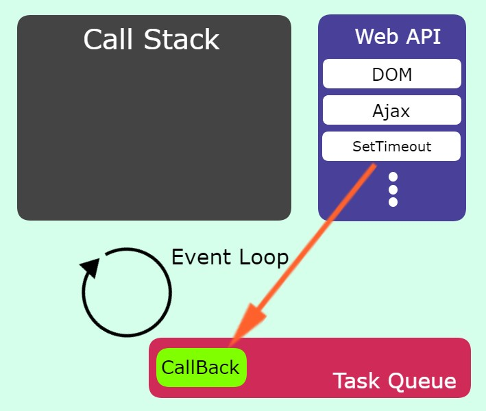
8. setTimeout의 시간이 종료되었으면 Task Queue로 CallBack함수를 보내준다.
  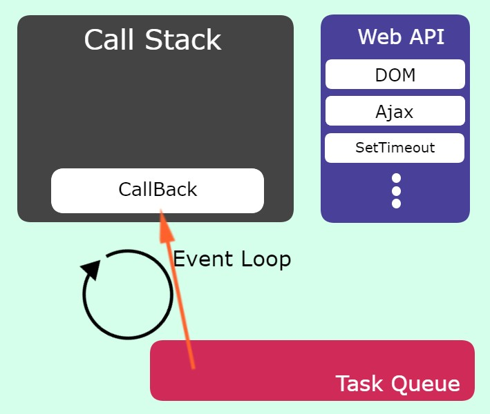
9. Call Stack가 비어잇으면 Event Loop가 Task Queue에 존재하는 함수를 하나씩 꺼내 Call Stack으로 옮겨준다.
  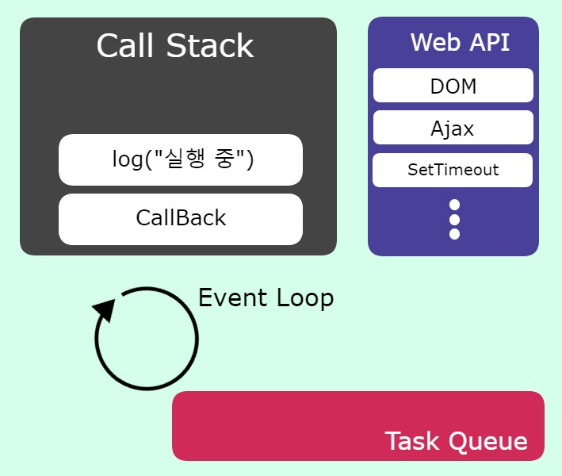
10. Call Stack 함수에 들어간 console.log("실행 중")함수가 실행되고 콘솔창에는 "실행 중"이 출력됩니다.
  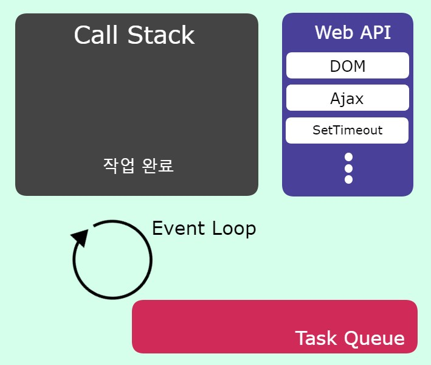
11.  console.log("실행 중") 함수가 리턴되고 Call Stack에서 제거되고 CallBack함수도 제거됩니다.


해당 행위를 반복하며 EventLoop는 Task Queue에 새로운 콜백함수가 들어올때까지 대기합니다.(이러한 반복적인 행동을 틱(tick)이라 합니다.)
만약 콜 스택에 너무 많은 함수들이 존재한다면 setTimeout에 설정한 시간이 정확하지 않을 수 있습니다.

# 콜백

자바스크립트가 어떤식으로 비동기 함수를 처리하는지 알아보았습니다.  
개발을 하다보면 실행순서가 중요한 경우가 있습니다. 예를 들어 api 요청을 보낸 후 응답을 받은 데이터를 이용해야 하는 상황에서 콜백함수를 사용해주면 됩니다.  
콜백함수는 현재 실행되고있는 함수가 끝난 후 실행되는 함수를 의미합니다.  

## 콜백 예시

```javascript
function first(callback) {
  setTimeout(function () {
    console.log("첫번째");
    callback();
  }, 3000);
}

function second() {
  console.log("두번째");
}

first(function () {
  second();
});
```

위 코드의 결과는 아래와 같다.

- 첫번째
- 두번째

first 함수가 실행되고 3초간 대기 후 "첫번째" 문구가 출력되고 인자로 받은 콜백함수를 실행하여 "두번째" 문구가 출력됩니다.

## 콜백지옥

비동기 처리와 콜백함수를 알아보았습니다.  
콜백함수를 많이 쓰게 되었을때 나타나는 문제점과 피하는 방법을 알아보도록 하겠습니다.  
여러개의 api를 호출하여 데이터를 가공해야하거나 화면에 렌더링 해줘야하는 경우 콜백함수를 여러개 중첩 하게되면 코드를 이해하기 어려워집니다. 이런 경우를 콜백 지옥(callback hell)이라고 합니다.

### 콜백지옥 예시

```javascript
setTimeout(
  (name) => {
    console.log(name);
    setTimeout(
      (name) => {
        console.log(name);
        setTimeout(
          (name) => {
            console.log(name);
            setTimeout(
              (name) => {
                console.log(name);
              },
              500,
              "Latte"
            );
          },
          500,
          "Mocha"
        );
      },
      500,
      "Americano"
    );
  },
  500,
  "Espresso"
);

//출력
//"Espresso"
//"Americano"
//"Mocha"
//"Latte"
```

한눈에 봐도 가독성이 떨어집니다. 앞으로 알아볼 Promise를 이용하여 콜백 지옥을 피하고 가독성이 좋은 코드로 만들어 보도록 하겠습니다.  

# 프로미스

콜백 지옥을 피하고 비동기 처리를 쉽게 처리할수 있도록 하기 위하여 ES6(ECMA 2015)부터 프로미스(Promise)가 추가되었습니다.  

## 프로미스의 3가지 상태(states)

프로미스를 사용할 때 알아야 하는 가장 기본적인 개념이 바로 프로미스의 `상태(states)`입니다. 여기서 말하는 상태란 프로미스의 처리 과정입니다. `new Promise()`로 프로미스를 생성하고 종료될때까지 프로미스는 3가지의 상태를 갖습니다.  

- 대기(pending) : 비동기 처리 로직이 아직 완료되지 않은 상태
- 이행(fulfilled) : 비동기 처리가 완료되어 프로미스가 결과 값을 반환해준 상태 (완료 상태)
- 거부(rejected) : 비동기 처리가 실패하거나 오류가 발생한 상태

### 대기 (Pending)

아래와 같이 `new Promise()` 메서드를 호출하면 대기 상태가 됩니다.

```javascript
new Promise();
```

`new Promise()` 메서드를 호출할 때 콜백 함수를 선언할 수 있습니다. 콜백 함수의 인자는 resolve, reject가 있습니다.

```javascript
const promise = new Promise(function(resolve, reject){
    ..
});

// Arrow Function
const promise = new Promise((resolve, reject) =>(){
    ..
});
```

### 이행 (Fulfilled)

promise 콜백 함수의 인자 resolve를 실행하면 이행(Fulfilled) 상태가 됩니다.

```javascript
new Promise((resolve, reject) => {
  resolve();
});
```

promise가 이행 상태가 되면 `then()`을 이용하여 처리 결과 값을 받을 수 있습니다.

```javascript
const promise = new Promise((resolve, reject) => {
  resolve("성공");
});

promise.then((message) => {
  alert(message);
});
```

### 실패 (Rejected)

promise의 콜백함수의 인자 reject를 호출하면 실패(Rejected) 상태가 됩니다.

```javascript
const promise = new Promise((resolve, reject) => {
  reject("에러");
});

promise.then().catch((err) => {
  alert(err);
});
```

실패 상태가 되면 실패 처리의 결과 값을 `catch()`로 받을 수 있습니다.


프로미스의 처리 흐름  <br/><br/>

### 프로미스 예제

프로미스 예제를 통하여 어떻게 콜백지옥을 피할 수 있는지 확인해 보겠습니다.

```javascript
const promise = new Promise((resolve, reject) => {
  setTimeout(() => {
    console.log("Espresso");
    resolve();
  }, 500);
});

promise
  .then((coffeeList) => {
    return new Promise((resolve) => {
      setTimeout(
        (coffeeName) => {
          console.log(coffeeName);
          return resolve();
        },
        500,
        "Americano"
      );
    });
  })
  .then((coffeeList) => {
    return new Promise((resolve) => {
      setTimeout(
        (coffeeName) => {
          console.log(coffeeName);
          return resolve();
        },
        500,
        "Mocha"
      );
    });
  })
  .then((coffeeList) => {
    return new Promise((resolve) => {
      setTimeout(
        (coffeeName) => {
          console.log(coffeeName);
        },
        500,
        "Latte"
      );
    });
  });

//출력
//"Espresso"
//"Americano"
//"Mocha"
//"Latte"
```

프로미스를 연결하여 비동기 처리를 순서대로 해주는 것을 `프로미스 체이닝`이라 합니다.  
위 코드를 더욱 간단하게 바꿔주면

```javascript
function addCoffee(coffeeName) {
  return () => {
    return new Promise((resolve) => {
      setTimeout(() => {
        console.log(coffeeName);
        return resolve();
      }, 500);
    });
  };
}

const promise = new Promise((resolve, reject) => {
  setTimeout(() => {
    let coffeeList = "Espresso";
    console.log(coffeeList);
    resolve();
  }, 500);
});

promise
  .then(addCoffee("Americano"))
  .then(addCoffee("Mocha"))
  .then(addCoffee("Latte"));

//출력
//"Espresso"
//"Americano"
//"Mocha"
//"Latte"
```

위 코드와 같이 반복적인 코드는 함수화 하여 표현하면 더욱 깔끔하게 콜백함수를 관리할 수 있습니다.  
프로미스의 문법과 프로미스 체이닝을 사용하면 콜백지옥을 좀 더 깔끔하게 관리하고 코드의 가독성을 높일 수 있습니다.  

프로미스의 사용법까지 배웠으니 아래 코드의 실행순서를 알아보도록 하겠습니다.

```javascript
console.log("script start");

setTimeout(function () {
  console.log("setTimeout");
}, 0);

Promise.resolve()
  .then(function () {
    console.log("promise1");
  })
  .then(function () {
    console.log("promise2");
  });

console.log("script end");
```

위 코드는
처음에 배웠던 자바스크립트의 동작방식으로 본다면 아래와 같은 순으로 출력되어야 합니다.

```javascript
script start
script end
setTimeout
promise1
promise2
```

하지만 실제로 동작하는 방식은 아래와 같은 순으로 출력이 됩니다.

```javascript
script start
script end
promise1
promise2
setTimeout
```

위와 같이 출력되는 이유를 알아보도록 하겠습니다.

# Task Queue, Microtask Queue, Animation Frames

이전까지는 모든 비동기 처리는 Task Queue에 순서대로 쌓이고 이벤트 루프에 의하여 하나씩 꺼내 콜스택으로 옮겨주고 실행을 하게 된다. 라고 설명을 하였는데 더 알아보니 Task Queue외에도 Microtask Queue와 Animation Frames또한 존재하는 것을 알게되었습니다.

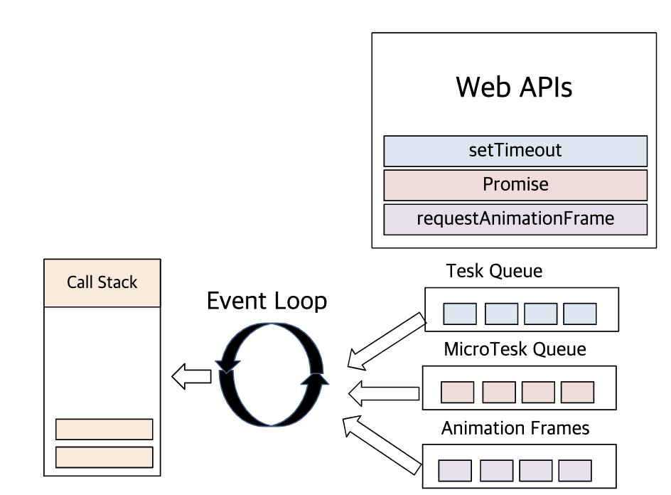

이해를 돕기 위한 사진

## Microtask Queue

위 코드에서 Promise가 먼저 실행된것을 먼저 설명하자면 Promise는 Microtask Quere를 사용합니다.  
Microtask Queue에는 Promise와 Mutation observer에 등록된 콜백이 들어오게 됩니다.  
Microtask Queue는 이벤트 루프가 한 번 방문하게되면 MicroTask Queue에 있는 모든 작업을 수행하게 됩니다. 즉, `Microtask Queue가 완전히 비어질 때까지 이벤트 루프는 순회하지 못합니다.(도중에 새로운 작업이 도착하면 새로운 작업도 실행하게 됩니다.)`

## AnimationFrames

WebAPI인 requestAnimationFrame() 함수를 호출하게 되면 그 안에 등록된 콜백이 Animation Frames에 쌓여집니다. Animation Frames도 Microtask Queue와 마찬가지로 이벤트 루프가 한 번 방문하면 큐 안에 들어있는 '모든' 작업을 수행한 후 순회를 재개합니다.  
`Animation Frames는 보통 애니메이션과 게임 같이 실시간으로 화면에 업데이트 해야하는 경우에 사용합니다.`

### Queue의 우선 순위

이벤트 루프는 콜 스택에 처리할 작업이 없을 경우 우선 Microtask Queue를 확인합니다.  
microtask Queue에 작업이 존재한다면 작업을 하나씩 꺼내 콜 스택에 넣어줍니다.  
microtask Queue에 존재하는 작업을 모두 처리한 후 AnimationFrames를 확인하여 브라우저 렌더링을 발생 시킵니다. 그 후 task queue에 있는 작업을 하나씩 꺼내 콜 스택에 넣어주고 처리합니다.  
여기서 Animation Frames는 Vsync(60hz)에 맞춰 호출되므로 requestAnimationFrame의 동작시간이 16ms가 넘어가면 task queue가 먼저 호출되기도 합니다.(브라우저마다 다르기도 합니다.)  

Task queue, Microtask queue, Animation queue의 실행 순서를 확인해 보도록 하겠습니다.

```javascript
function test() {
  console.log(`start`);

  requestAnimationFrame(function () {
    console.log(`animation`);
  });

  Promise.resolve().then(function () {
    console.log(`promise`);
  });

  setTimeout(function () {
    console.log(`setTimeout`);
  }, 0);
}

//출력 테스트
//"start"
//"promise"
//"setTimeout"
//"animation"
```

# async/await

async와 await는 ECMAScript 2017(ES8)부터 추가된 기능들 입니다. 비동기 처리 패턴 중 가장 최근에 나온 문법이며, 기존의 Promise보다 가독성이 좋아 많이 사용되고 있습니다.  
async/await는 이해하기 쉽고 사용법도 어렵지 않습니다.  

위에서 보았던 커피리스트를 나열하는 예제를 async/await 문법으로 바꿔보겠습니다.

```javascript
function addCoffee(coffeeName) {
  return new Promise((resolve) => {
    setTimeout(() => {
      console.log(coffeeName);
      resolve();
    }, 500);
  });
}

async function coffeeMaker() {
  await addCoffee("Espresso");
  await addCoffee("Americano");
  await addCoffee("Mocha");
  await addCoffee("Latte");
}
coffeeMaker();
```

먼저 함수의 앞에 async라는 예약어를 작성해야 합니다. 내부의 함수중 비동기 처리 함수앞에는 await를 작성해줘야 합니다. await 함수는 반드시 promise객체를 반환해 주어야 await가 의도한대로 동작합니다.

## async/await 예외처리

async/await를 사용할 때 예외처리를 하는법은 try catch를 사용하면 됩니다.

```javascript
async function addCoffee(coffeeName) {
  return new Promise((resolve, reject) => {
    setTimeout(() => {
      if (coffeeName === "Mocha") {
        reject("에러발생!!");
      }
      console.log(coffeeName);
      resolve();
    }, 500);
  });
}

async function coffeeMaker() {
  try {
    await addCoffee("Espresso");
    await addCoffee("Americano");
    await addCoffee("Mocha");
    await addCoffee("Latte");
  } catch (e) {
    console.log(e);
  }
}
coffeeMaker();
```

---

## 마무리

> 이상으로 자바스크립트로 개발을 하면서 꼭 알아둬야할 비동기와 제어법에 대해서 알아보았습니다.
>
> 감사합니다.

참고자료 :

- https://developer.mozilla.org/ko/docs/Web/JavaScript/Reference/Global_Objects/Promise
- https://velog.io/@bigbrothershin/JavaScript-Promise-%EC%83%9D%EC%84%B1%EC%9E%90
- https://velog.io/@thms200/Event-Loop-%EC%9D%B4%EB%B2%A4%ED%8A%B8-%EB%A3%A8%ED%94%84
- https://joshua1988.github.io/web-development/javascript/js-async-await/
- https://ingg.dev/js-work/#async
- https://velog.io/@1703979/TIL-19
- https://velog.io/@yujo/- JS%EC%BD%9C%EB%B0%B1-%EC%A7%80%EC%98%A5%EA%B3%BC-%EB%B9%84%EB%8F%99%EA%B8%B0-%EC%A0%9C%EC%96%B4
- https://meetup.toast.com/posts/89
- https://joshua1988.github.io/web-development/javascript/js-async-await/#async--await%EB%8A%94-%EB%AD%94%EA%B0%80%EC%9A%94
