DevOps, 컨테이너, 그리고 자동화라는 말은 많이 들어보셨는데 막상 어디서부터 시작해야 할지 고민이 되시거나  내 손으로 결과물을 만들어서 암기해야 하는 분들을 위해 무작정 컨테이너 애플리케이션을 배포해 보자! 라는 주제로 이번 포스팅을 작성해보았습니다.  

먼저, 무작정이라고는 하지만… 이 정도는 꼭 읽고 외워두자! 기본개념을 먼저 정리해보겠습니다.  

 
## 꼭 읽고 외워두자!  

### AKS(Azure Kubernetes Service) 란? 

  -  Azure에서 관리되는 Kubernetes 클러스터로 간단히 배포되며 상태 모니터링 및 유지 관리 같은  

     중요 작업을 처리해 줌으로써 관리 복잡성 및 운영에 대한 부하를 줄여준다. 

  -  Kubernetes는 컨테이너 기반 어플리케이션과 네트워크 및 스토리지 구성 요소를 관리하는 오픈소스 플랫폼  

     관리 작업을 위한 API들을 통해 선언적 배포 방식을 제공하고 자동화를 용이하게 한다.  

     어플리케이션의 가용성을 오케스트레이션하고 마이크로 서비스 기반 어플리케이션을 구축하고 실행할 수 있다. 

### CI/CD 란? 

  -  지속적 통합(Continuous integration, CI)과 지속적 제공(Continuous delivery, CD), 줄여서 CI/CD는 애플리케이션 개발팀이 더 자주, 안정적으로 코드 변경을  

제공하기 위해 그리고 자동화함으로써 소프트웨어 개발팀이 코드 품질과 소프트웨어 보안을 보장하는 동시에 비즈니스 요구사항을 충족하는 데  

집중할 수 있게 해준다. (CI/CD는 데브옵스 팀을 위한 권장 사항이자 애자일 방법론의 권장 사항이기도 하다)  

### CI/CD 파이프라인? 

  -  Azure에서 관리되는 Kubernetes 클러스터로 간단히 배포되며 상태 모니터링 및 유지 관리 같은  

     중요 작업을 처리해줌으로써 관리 복잡성 및 운영에 대한 부하를 줄여준다.  

  -  Kubernetes는 컨테이너 기반 어플리케이션과 네트워크 및 스토리지 구성 요소를 관리하는 오픈소스 플랫폼  

     관리 작업을 위한 API들을 통해 선언적 배포 방식을 제공하고 자동화를 용이하게 한다.  

     어플리케이션의 가용성을 오케스트레이션하고 마이크로 서비스 기반 어플리케이션을 구축하고 실행할 수 있다. 

 

### 아키텍처  
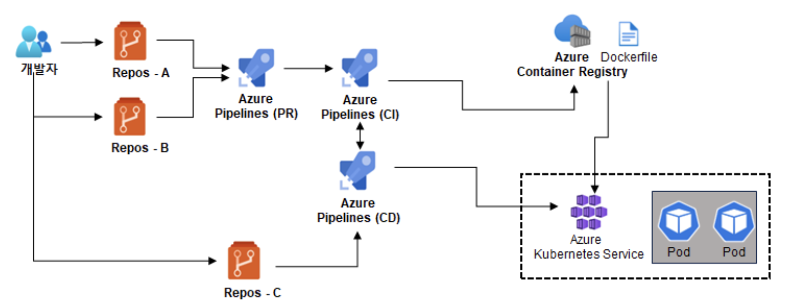

사전 준비 (Azure 리소스 구성) 

  -  ACR(Azure Container Registry) 만들기  

  -  AKS(Azure Kubernetes Service) 만들기       

 실습 준비 

  -  Azure Repos 총 3개 생성 (소스코드 용 Repos * 2EA, 별도의 Yaml 관리를 위한 Repos * 1EA) 

  -  Java 웹 소스코드 빌드를 위한 Azure Pipelines(PR) 구성 (WAR 파일, 도커파일 생성) 

  -  Azure DevOps에서 CD를 사용하여 Azure Pipelines(CI/CD) 구성  

  -  AKS 내에 Pod에 배포하기  

 

사전 준비 (Azure 리소스 구성) 

-  ACR(Azure Container Registry) 만들기  

-> Azure Portal -> 컨테이너 레지스트리 선택 -> 완료 
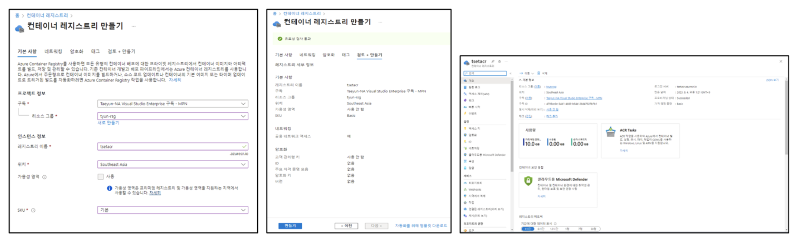

 

 

-  AKS(Azure Kubernetes Service) 만들기

-> Azure Portal -> Kubernetes 서비스 선택 -> 완료 
  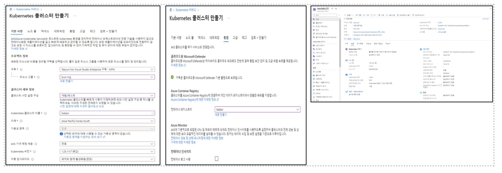

 

 

 

실습 준비 

-  Azure Repos 총 3개 생성 (소스코드 용 Repos * 2EA, 별도의 Yaml 관리를 위한 Repos * 1EA) 

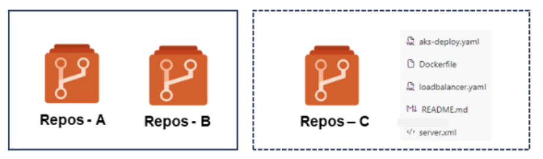

   -  Java 웹 소스코드 빌드를 위한 Azure Pipelines(PR) 구성 (WAR 파일, 도커파일 생성) 

-> Azure DevOps -> Pipelines -> Repos 선택 -> Maven 빌드 선택 
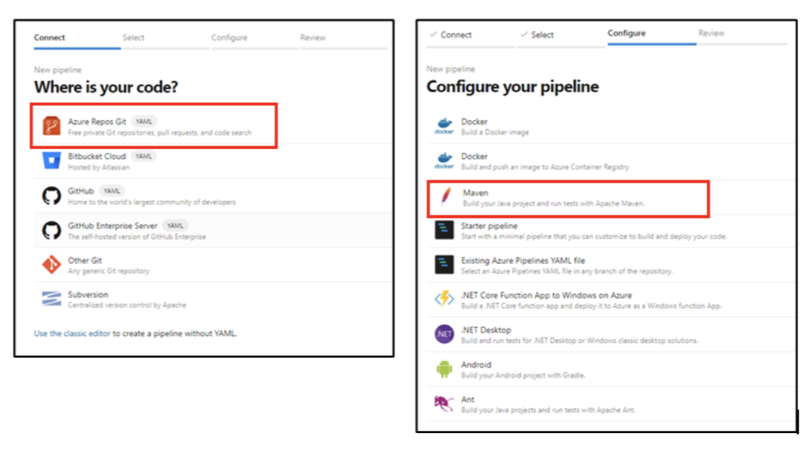

 

-> 기본 Yaml에 WAR 파일, 도커파일 생성 내용 추가 
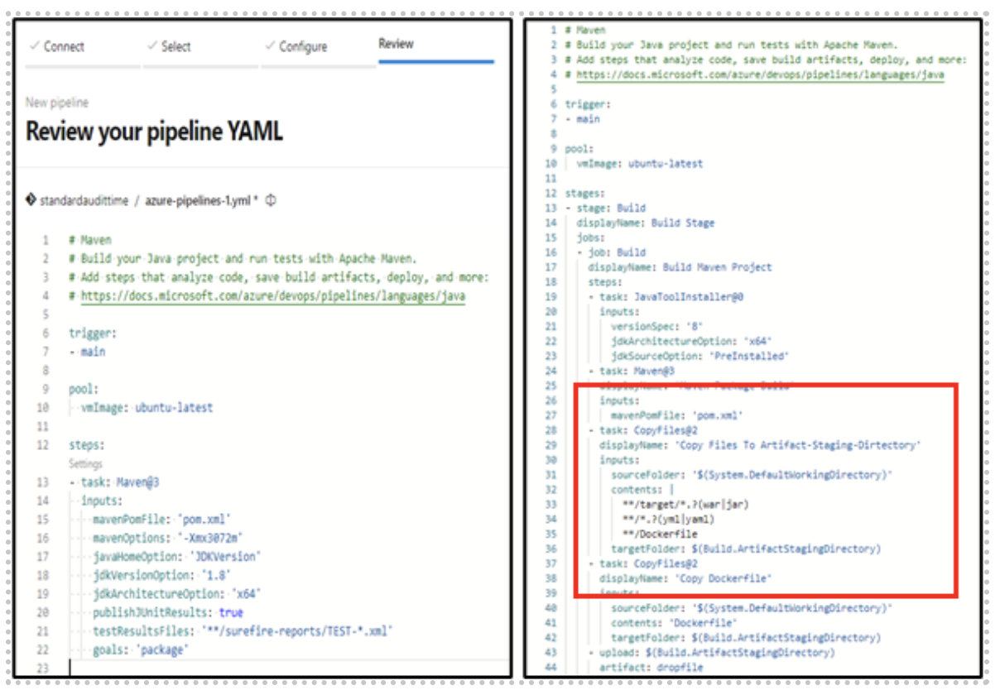
  

-  Java 웹 소스코드 빌드를 위한 Azure Pipelines(PR) 구성 (WAR 파일, 도커파일 생성) 

  -> Azure DevOps -> Pipelines -> Repos 선택 -> Maven 빌드 선택 -> 기본 Yaml에 WAR파일, 도커파일 생성 추가 -> Artifact 확인 

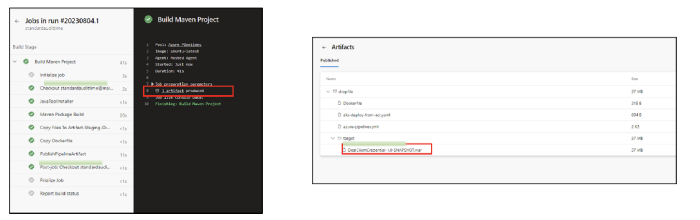

 

 

-  Azure DevOps에서 CD를 사용하여 Azure Pipelines(CI/CD) 구성  

   -> Pipelines->Releases탭 클릭 -> Stage 영역 에서 Empty job 클릭 
   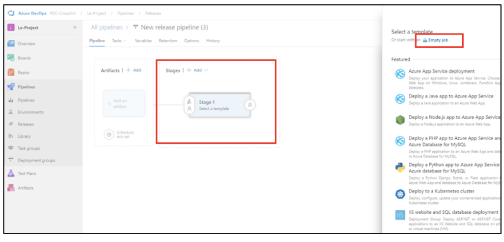
   -> Agent job -> Agent pool -> 사양 선택 
   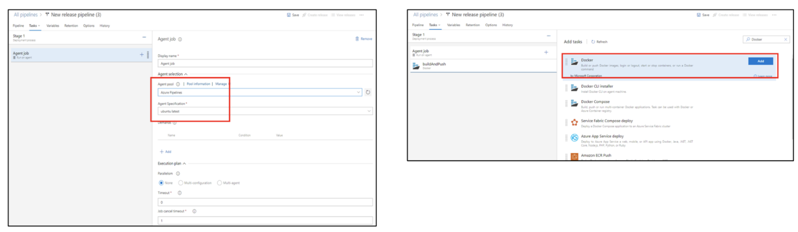
   -> Docker 이미지 ACR Push 를 위해 Docker(buildAndPush) 선택 후 이미 만들어 놓은 ACR 정보 입력
   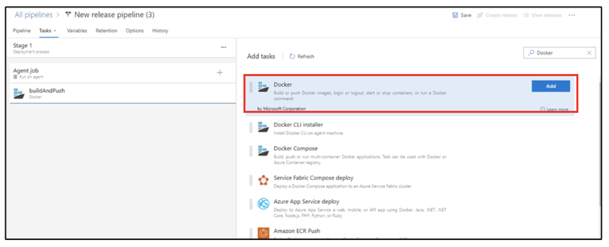  
   => ACR 설정 완료 후 Stage 2 아래 +Add 선택하여 AKS 정보 입력  
   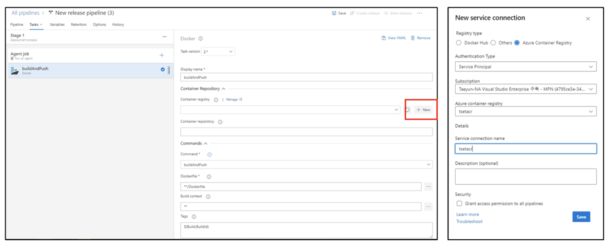
   (내용추가) AKS 정보 입력하시기 전에 배포 관련 Yaml 에 대한 토큰(치환) 정보 또는 경로 입력이 필요합니다. 
   -> loadbalancer.yaml과 aks-deploy.yaml 치환 경로 선택
   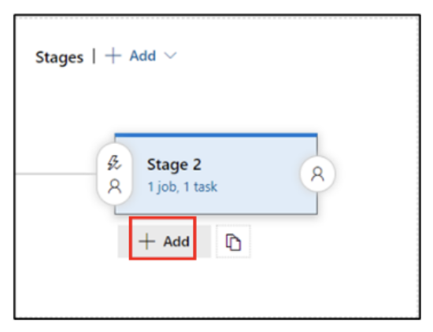 
   -> AKS 정보 입력 후 Command 탭에서 apply 선택 -> File path 부분에 Repos –C에 있는 aks-deploy.yaml 경로 선택 
   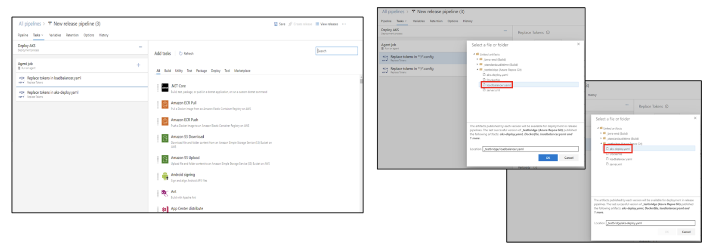
   -> 마지막으로 Artifacts 선택 -> Create release 선택 -> Pipeline 시작 
   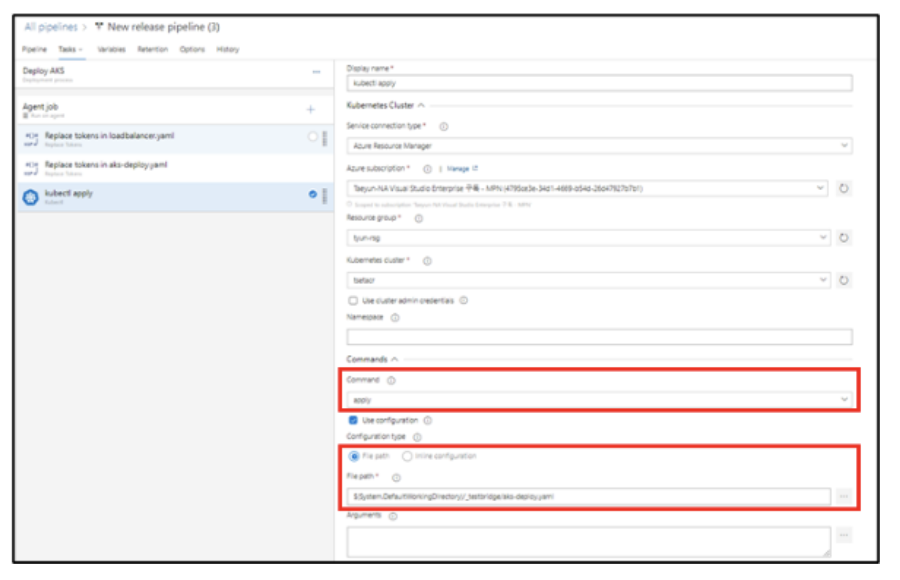
   -> Azure Portal -> Kubernetes 서비스 선택 -> 생성된 외부 IP 클릭 
   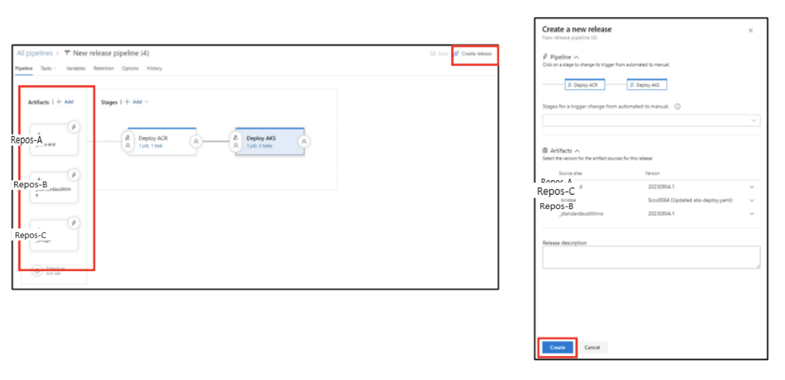
   -> Azure Portal -> Kubernetes 서비스 선택 -> 생성된 외부 IP 클릭(계속) 
   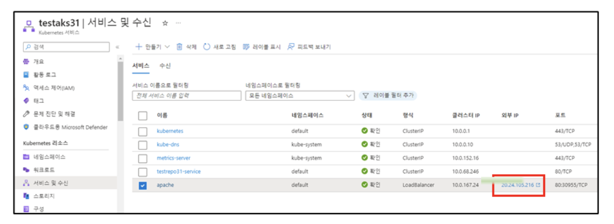

 

### 마무리 하며 

최근 고객사에서 진행했던 프로젝트 중의 일부를 참조하여 블로그 포스팅을 진행하였으며, 대부분 Azure Portal에서 직관적으로 구성이 가능하게 되어 있어 일부 과정은 생략되어 있음을 참고 부탁드립니다.  포스팅 작성에 많은 도움을 주신 클라우드메이트 조한준님께 감사하다는 말씀드리며, 해당 글을 끝까지 읽어주신 분들 또한 감사드립니다. 위 사례를 참고 하시어 컨테이너, 자동화, AKS등 다양한 클라우드 서비스에 도전해 보시기 바랍니다. 

감사합니다.  

 

컨테이너, 쿠버네티스 관련 클라우드 서비스 전문가를 찾으신다면? [클라우드메이트](https://cloudmt.co.kr)로 연락주세요!

 
 
 
🖇️ 참고 자료 

“CI/CD란?” 알기 쉽게 설명한 지속적 통합과 지속적 제공 / ITWORLD, https://www.itworld.co.kr/insider/233284 

