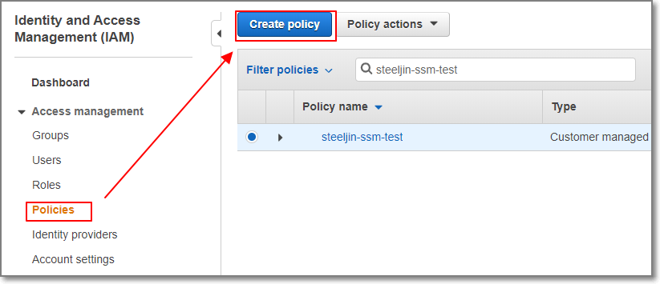
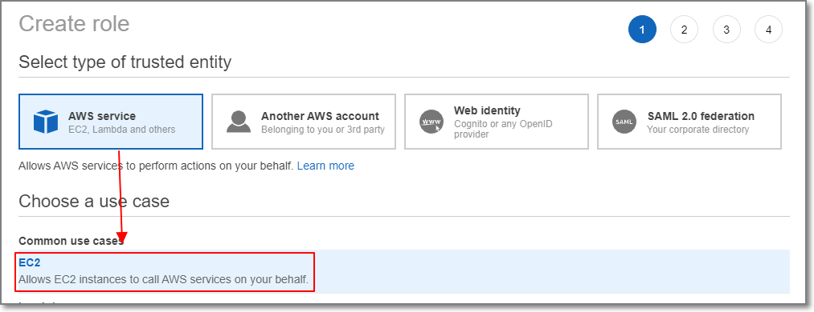
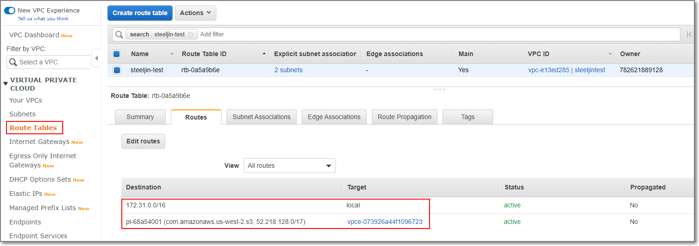
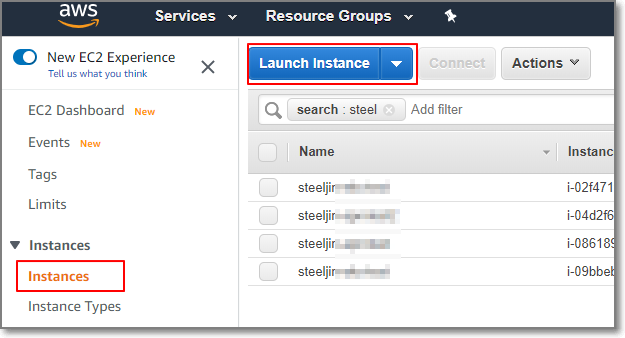
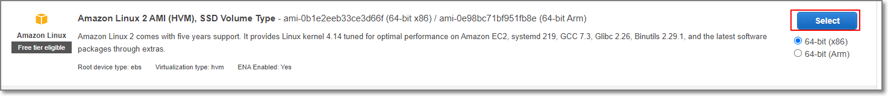
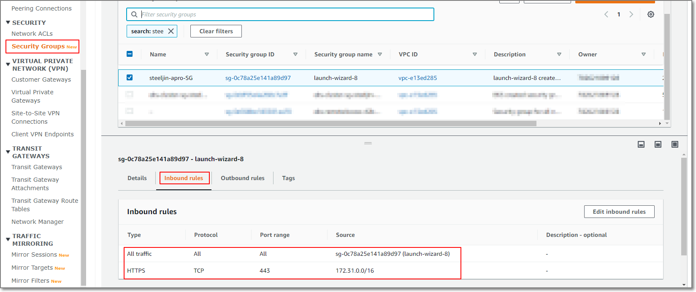
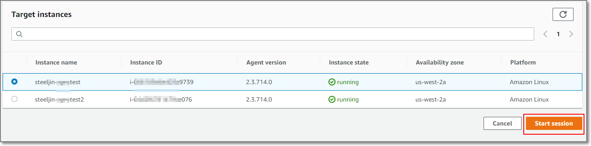
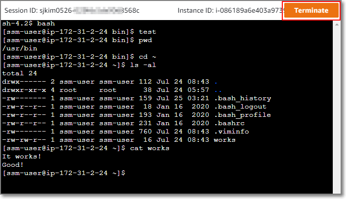

1. 소개  
  On-premise 에서든 Cloud 환경에서이든 서비스를 위한 운영환경은 외부 인터넷으로부터 분리되어 있어야하며 외부와의 접촉점이 있더라도 최소화해아하는 점은 동일합니다.  
  그래서 두 환경모두 내부 운영 서버접근을 위해서 별도의 Bastion Host나 VPN등을 사용해 인증된 사용자만 접근가능하도록 구성합니다.  
  AWS Systems Manager에서는 Private 망에 위치한 인스턴스 접근을 위해 위와 같은 별도 장치나 망구성을 변경하지 않고 IAM을 사용할 수 있습니다.
  Systems Manager의 Session Manger를 이용하면 인스턴스 접근 뿐만 아니라 인스턴스에서 해당 사용자의 활동 로깅까지 할 수 있습니다.
  지금 부터 이런 좋은 기능을 사용할 수 있게 환경을 구성해보겠습니다.

1. EC2 Policy 설정  
      
      

    JSON 편집기 창에 아래와 같은 Policy 정보를 입력합니다.  
    ```json
    {
        "Version": "2012-10-17",
        "Statement": [
            {
                "Effect": "Allow",
                "Action": "s3:GetObject",
                "Resource": [
                    "arn:aws:s3:::aws-ssm-us-east-2/*",
                    "arn:aws:s3:::aws-windows-downloads-us-east-2/*",
                    "arn:aws:s3:::amazon-ssm-us-east-2/*",
                    "arn:aws:s3:::amazon-ssm-packages-us-east-2/*",
                    "arn:aws:s3:::us-east-2-birdwatcher-prod/*",
                    "arn:aws:s3:::aws-ssm-distributor-file-us-east-2/*",
                    "arn:aws:s3:::patch-baseline-snapshot-us-east-2/*"
                ]
            },
            {
                "Effect": "Allow",
                "Action": [
                    "s3:GetObject",
                    "s3:PutObject",
                    "s3:PutObjectAcl",
                    "s3:GetEncryptionConfiguration"
                ],
                "Resource": [
                    "arn:aws:s3:::ssm-test-logs/*",
                    "arn:aws:s3:::ssm-test-logs "
                ]
            }
        ]
    }
    ```  

    붉은 색 부분에는 사용하고 있는 리전 및 SSM 로그를 저장할 S3 버킷을 적습니다.  
    Review Policy를 선택하여 적절한 Name을 입력하고 Create policy로 정책을 생성합니다.  

1. EC2 Role 설정  
    다음은 EC2에 적용할 Role을 설정합니다.  
    IAM &gt; Role &gt; Create role에서 EC2를 선택합니다.  
      
      
    SSM을 사용하기 위한 기본 Policy를 선택  
      
    이전에 작성한 Policy를 선택  
      
    다음으로 넘어가 Tag 및 적절한 Role의 이름을 부여하여 Create role을 선택하여 Role을 생성합니다

1. VPC 앤드포인트 설정  
    다음은 EC2가 Private한 환경에서도 AWS 서비스를 사용할 수 있도록 앤드포인트를 생성합니다.  
    VPC &gt; Endpoint에서 Create Endpoint를 선택합니다.  
      
    Service Name을 검색합니다.  
    (\*ssm, ssmmessages, ec2messages, s3 총 4개를 하나씩 생성해야합니다.)  
      
    앤드포인트 및 EC2 에 사용할 SG을 선택합니다.
      
    위 과정을 반복하여 아래와 같이 총 4개의 앤드포인트를 생성합니다.
      
    라우팅 테이블 확인  
      
    IGW 및 NAT가 없으므로 해당 라우팅 테이블이 속한 서브넷에서는 외부인터넷망에 접근이 불가능한 것을 확인할 수 있습니다.  

1. EC2 생성  
    EC2 &gt; Launch Instance를 선택합니다.  
      
      
    적절한 인스턴스 타입을 선택 후 Configure Instance에서 이전에 설정한 VPC 및 IAM Role을 선택하여 설정합니다.  
    (기존 사용중인 인스턴스에 적용할 경우 해당 인스턴스의 IAM Role만
    변경하면 됩니다.  
    \* Role 변경 시 기존 사용중인 Role의 정책에 의해 서비스에 영향이 있을 수
    있으니 주의하세요.)  
      
    이후 적절한 스토리지 및 Tag를 추가하신 후 Configure Security Group에서 이전에 설정한 SG를 적용합니다.  
      

1. Security Group 설정  
    SG를 아래와 같이 같은 SG를 가진 인터페이스간에는 통신이 가능하도록 같은 SG를 추가하고 HTTPS 정책을 VPC 내부의 CIDR을 적용하여 통신이 가능하도록 합니다.
    

1. System Manager  
    System Manager &gt; Managed Instances에서 생성한 EC2 인스턴스가 확인되기를 기다립니다.  
      
    인스턴스가 확인이 된다면 Session Manager에서 Preferences에서 로깅을 설정합니다.  
      
      
    \*CloudWatch 로깅설정이 필요한 경우 CloudWatch logs를 체크합니다.  
    \*로그 또는 세션 데이터에 대한 암호화가 필요한 경우는 KMS 설정 및 S3 버킷 암호화를 참고하시기 바랍니다.  

1. Session 시작하여 쉘 사용  
      
      
    작업이 완료된 후 Session을 Terminate합니다.  
      
    Session history에서 S3에 저장된 log를 확인할 수 있습니다.  
      
    S3에서 log 파일을 다운로드 받습니다.  
      
    Log를 확인합니다.  
      
    감사합니다.  
