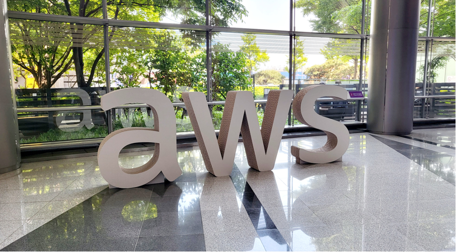
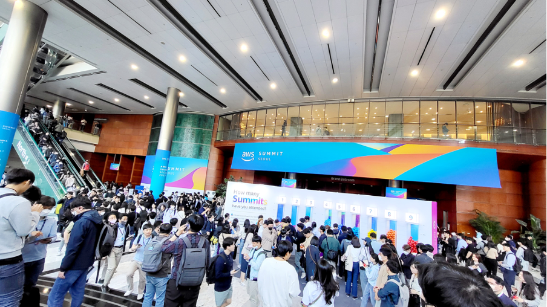
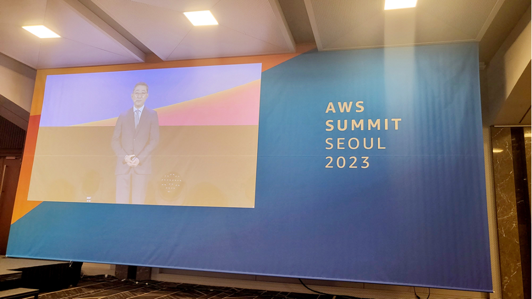
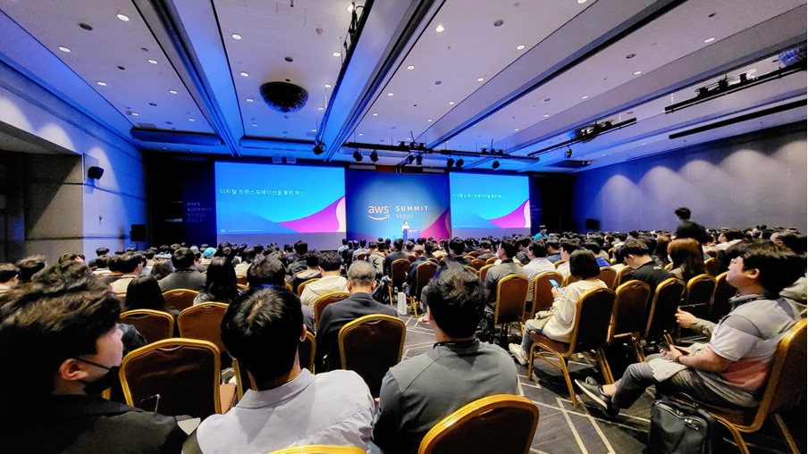
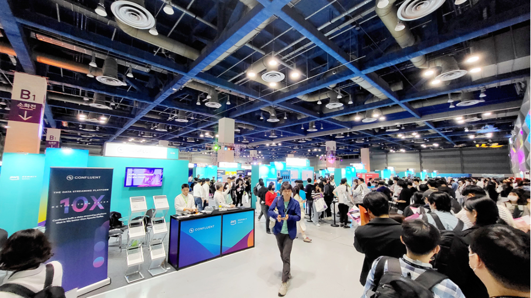
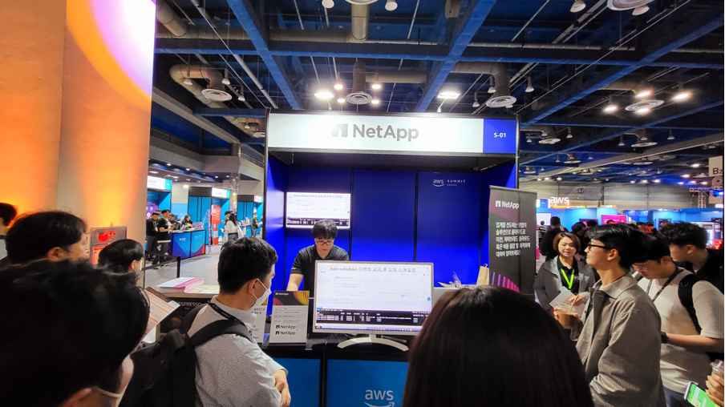
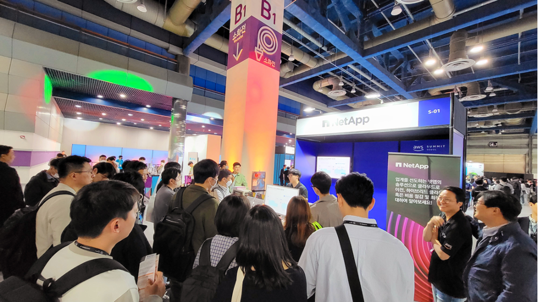
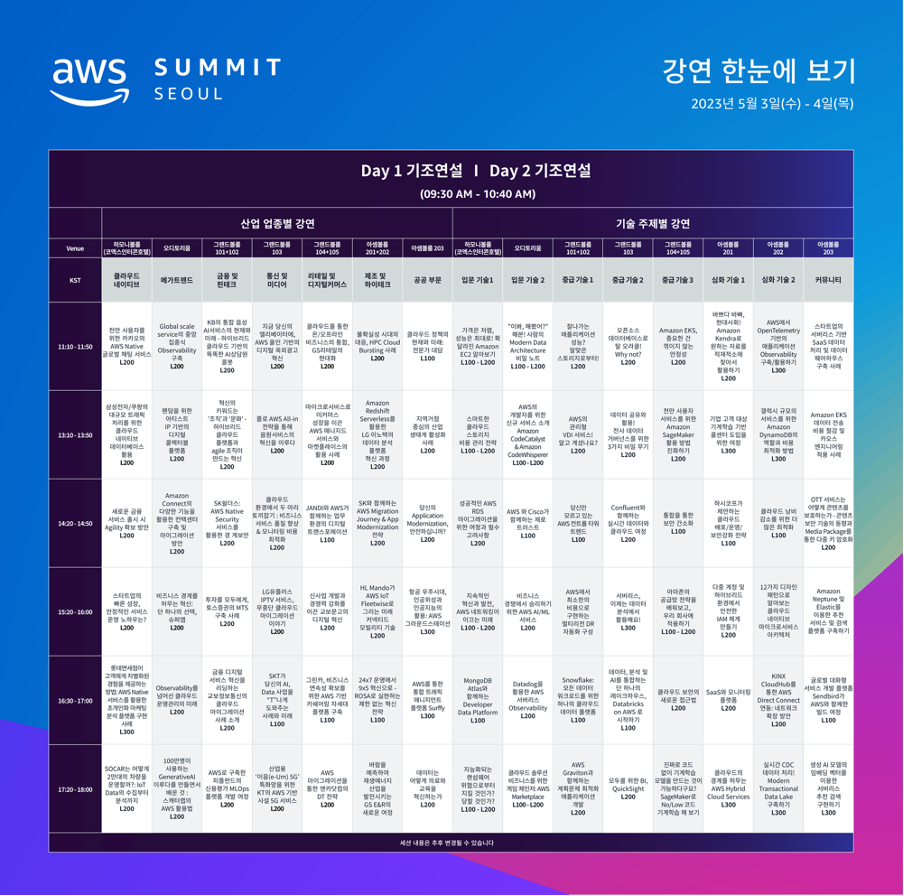

AWS Summit Seoul 2023 참관 후기 

 

안녕하세요! 클라우드메이트 추진주 입니다. 
5월 3일부터 4일 양일간, AWS Summit Seoul이 성공적으로 개최되었습니다. 올해로 9회째를 맞는 AWS Summit은 3년 만에 코로나19 이후 처음으로 오프라인으로 진행되는 행사였는데요. 이번 행사에서는 최신 IT 트렌드 및 솔루션에 대한 다양한 주제와 세션 발표가 이뤄졌으며, AWS를 이용한 다양한 고객의 경험과 성공 사례를 공유했습니다. 

 
사전 등록 인원수 2만 명을 넘어서며 폭발적인 인기를 증명한 국내 최대 IT 컨퍼런스답게 참가자들의 뜨거운 열기가 느껴졌습니다. 특히 기조연설이 진행되는 3층 오디토리움은 이른 아침 시간부터 빈자리가 없을 정도로 인파가 몰렸습니다. 뜨거운 열기에 밀려 저는 원격으로 진행되는 2층 아셈볼룸에서 생중계로 진행되는 현장에 참석하였습니다. 

 
첫날, AWS 코리아 함기호 대표의 기조연설 중 인상 깊었던 내용은 한국 고객들이 언어의 장벽 없이 클라우드 환경에서 더 쉽고 편리하게 혁신할 수 있도록 AWS가 한국어 지원을 대폭 강화했다는 것이었습니다. 이에 따라 AWS 리포트, 기술 블로그, 파트너와 함께 구축한 주요 솔루션 라이브러리 등이 영어와 함께 한국어로도 제공합니다. 이와 같은 발표는 국내 고객들에게 AWS의 더 나은 서비스 경험과 접근성을 제공하는 데 큰 역할을 할 것으로 보입니다. 

  

그 뿐만 아니라 양일 간 90개가 넘는 비즈니스 및 산업 기술 토픽별 세션이 진행되었습니다. 첫째 날은 금융, 핀테크, 미디어, 통신, 리테일, 디지털 커머스, 제조, 하이테크, 공공 부문 등 다양한 산업 분야별로 집중 트랙이 마련되었으며, 각 트랙에서는 고객 사례를 중심으로 다양한 내용을 소개하였습니다. 둘째 날은 개발자와 IT 엔지니어를 위한 기술 주제별 강연으로 구성되어 깊이 있는 세션과 필요한 심화 강연, 그리고 다양한 실제 적용 사례를 공유하는 등 다양한 주제의 세션이 제공되었습니다. 

 
이 밖에도 30여 개의 AWS 부스와 60개 이상의 AWS 파트너사의 부스를 통해 다양한 제품 및 서비스 소개와 함께 고객과의 대면 네트워킹을 즐길 기회를 제공했습니다. 이를 통해 관람객들은 AWS의 최신 기술과 파트너사의 다양한 솔루션을 직접 체험하고, 궁금한 내용에 관한 질문과 답변을 통해 실제 사용 경험을 나눌 수 있었습니다. 또한, 부스에서는 다양한 경품을 제공하여 관람객들에게 즐거운 경험을 선사했습니다. 

  
당일 수많은 부스 중 담당자의 눈길을 끌었던 곳은 단연 NetApp 부스였습니다. 특히 클라우드메이트에서 기술 지원을 제공 하는 서비스인 Spot by NetApp 데모 시연에서는 AWS의 Spot Instance를 활용하여 클라우드 인프라 비용을 최적화하기 위한 다양한 기능을 선보였습니다. 

 

Spot by NetApp은 사용자가 설정한 가격 범위 내에서 가장 저렴한 Spot Instance를 찾아 자동으로 사용하도록 구성됩니다. 또한, Spot 인스턴스가 종료되는 시점을 미리 예측하여, 이를 이용하여 비즈니스에 영향을 끼치지 않도록 작업을 종료하고 필요한 자원을 저장하도록 안내하는 등 다양한 기능을 제공합니다. 이를 통해 고객은 컴퓨팅 비용을 최대 90%까지 절감할 수 있습니다. 

만일 Spot by NetApp을 활용하여 컴퓨팅 자원의 효과적인 비용 절감과 더불어 비즈니스 성과를 극대화하고 싶으시다면 클라우드메이트로 문의 부탁드립니다. (어떤 문의라도 환영입니다!) 담당자 확인 후 상세히 안내해 드리겠습니다. 
 
### 문의하기 contact@cloudmt.co.kr

 

마지막으로 양일간 발표된 강연 발표 자료와 영상은 6월 중 AWS Summit 홈페이지를 통해 공개될 예정이라고 합니다. 따라서 당일 현장에 참여하지 못하셨더라도 추후 업로드되는 영상을 통해 현장의 열기를 느껴보는 기회를 가져보시기를 바랍니다! 

감사합니다! 

