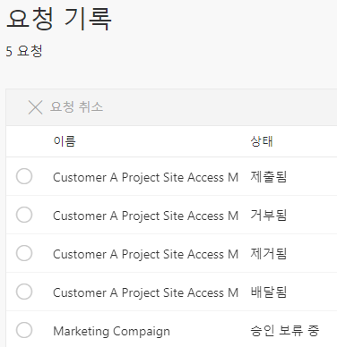
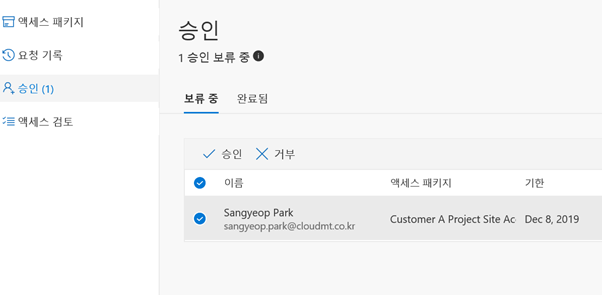

## Azure AD Identity Governance를 통한 리소스 접근 제어

Azure Active Directory에 대한 권한 관리를 통해 조직이 정보에 대한 액세스를 관리하도록 돕고 있습니다. 권한 관리는 직원 및 파트너 액세스 요청, 승인, 감사 및 워크 플로우를 특정 코드를 이용하지 않고 GUI를 통해서 간단하게 만들 수 있습니다.
뿐만 아니라, ID 관리 및 특정 민감한 정보에 대한 접근 제어와 함께 약관을 명시하여 동의를 해야만 하는 약관 기능도 제공을 합니다.

해당 기능을 활성화를 할 경우 다음의 라이선스 중 하나가 있어야 합니다.

•	**Azure AD Premium P2**  
•	Enterprise Mobility + Security E5 (Azure AD Premium P2 포함)

우선 이 기능 중에서 리소스 정보 접근에 대한 기능에 대해 알아보겠습니다.
내부 사용자 혹은 외부 사용자가 사내 특정 리소스에 접근하기 위해서는 액세스 패키지 설정이 필요합니다.

이 액세스 패키지를 통해서 내부 및 외부 사용자에 대한 액세스 권한을 관리자가 직접적으로 확인할 수 있으며, 팀 혹은 어플리케이션과 Sharepoint 사이트를 기준으로 하여 승인 이력을 관리할 수 있습니다.
액세스 패키지에 대한 흐름은 다음과 같습니다.  

내부에서 필요한 리소스에 대한 접근을 요청자와 승인자로 나누어, https://myaccess.microsoft.com/ 페이지를 통해 각 사의 조직에 배포된 액세스 패키지를 확인이 가능합니다.
사전에 Azure Active Directory에서 만들어진 액세스 패키지가 위 페이지에서 나열되며 사용자는 설정에 따라 외부 사용자도 조직의 액세스 패키지 목록에 접근할 수 있습니다.

액세스 패키지를 만드는 방법은 Azure Active Directory 의 하위 메뉴인 Identity Governance를 통해 만들 수 있으며, 만들 때 필요한 정보는 다음과 같습니다.  

#### 기본 사항  

•	사용자가 액세스를 요청 할 리소스의 패키지의 이름 및 설명을 입력합니다.

#### 리소스 역할  

•	접근할 리소스의 종류 및 리소스의 역할에 대해 지정합니다. (ex: Sharepoint 사이트의 구성원 혹은 방문자, 소유자)

#### 요청  

•	액세스 패키지를 요청할 수 있는 사람, 요청에 대한 승인을 할 사람, 액세스의 만료 시기를 지정할 수 있으며, 
승인자에 대해서는 대체 승인자 및 2차 승인자**(미리보기 기능)**를 지정할 수 있습니다.

#### 라이프사이클  

•	액세스 패키지의 사용자 할당이 종료 되는 기간을 설정할 수 있습니다.

예를 들어, 고객사 별 프로젝트를 정리하기 위한 Sharepoint 사이트가 내부에 있을 수 있으며, 어떠한 이유로 조직 외의 외부 사용자가 해당 프로젝트의 정보를 확인하기 위해 접근이 필요할 수 있습니다. 

요청자가 Sharepoint 사이트의 접근을 허용에 필요한  1차 및 2차 승인자가 존재하는 액세스 패키지를 만들었다면,
요청자는 요청에 대한 승인 절차를 통해 해당 액세스에 접근할 수 있게 됩니다.

https://myaccess.microsoft.com/  

위 사이트에서 "Customer A Project Site Access Management Package" 액세스 패키지에 대한 요청을 진행할 경우, 1차 승인자 및 2차 승인자까지 승인을 해야만 해당 리소스에 접근이 가능합니다.  

  
요청을 한 후에 위와 같이 요청에 대한 상태 또한 확인이 가능합니다.

| 메일을 통한 승인 액세스 패키지 접근 승인 요청                | 액세스 페이지를 통한 액세스 패키지 승인                      |
| ------------------------------------------------------------ | ------------------------------------------------------------ |
|  |  |

승인이 완료되면 요청자에게 액세스 패키지에 대한 접근 승인이 완료됨이 메일 발신됩니다.
모든 승인 프로세스를 거치게 되면 요청자에게 액세스 패키지에 대한 접근 권한을 받았음을 의미하는 메일을 받게 되며 실제로 해당 리소스에 접근을 할 수 있게 됩니다.

액세스 패키지를 이용하여 조직의 전역 관리자는 액세스 패키지에 부여된 권한을 Azure Active Directory의 Identity Governance를 통해서 제거도 할 수 있습니다.
