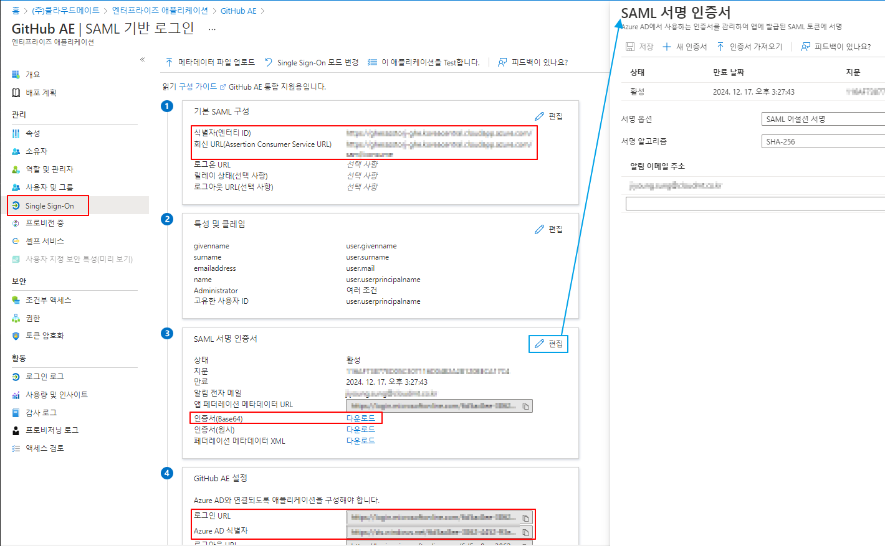

'''
(주)샌드박스메이트를 운영 중인 이사 주은 씨. Azure AD로 사내 계정을 관리하고 있는 와중 개발팀으로부터 github 무료 계정에서 engterprise로의 업그레이드에 대한 허가를 요청받았다.
''' 

Azure AD를 사용하고 있는 조직 내 사용자를 관리하다 보면 회사 운영의 편리성을 위해서 Azure뿐 아니라 3rd-Party 혹은 타사 애플리케이션을 이용하게 되고 해당 애플리케이션에 대해 SSO(Single Sign-On) 과 같은 액세스 관리나 추가 보안 요구사항이 생길 때가 있습니다. (때로는 자사가 개발한 애플리케이션일 수도 있죠!)

이럴 때 __Azure Active Directory 엔터프라이즈 애플리케이션__ 기능을 사용하여 애플리케이션을 관리하게 되면 다양한 이점을 취할 수가 있습니다.

1. 다양한 애플리케이션 통합
사전 통합된 애플리케이션 혹은 사용자 고유, 온-프레미스 애플리케이션을 Azure AD 갤러리에 추가하여 애플리케이션을 관리할 수 있습니다.
2. 액세스 관리
관리자 동의 워크플로우를 구성하거나 Single Sign-On 구성 등을 통하여 애플리케이션 및 사용자에 대한 액세스를 관리하고 안전성과 생산성을 보장할 수 있습니다. 
3. 애플리케이션 보안
엔터프라이즈 애플리케이션의 보안을 유지하는데 사용자 권한 설정, 조건부 액세스, 토큰에 대한 보안 구성 등으로 유지할 수 있습니다.
4. 모니터링
Azure AD에서 관리하는 여러 로그들을 통해 애플리케이션의 환경을 관리할 수 있습니다.

---

먼저 엔터프라이즈 애플리케이션의 주요 이점을 알아본 후 Azure AD와 GitHub 을 연동해보도록 하겠습니다. 가장 큰 이점인 Single Sign-On에 대해서 알아볼까요?

Single Sign-On은 사용자가 하나의 자격 증명을 사용하여 여러 독립 소프트웨어 시스템에 로그인할 수 있는 인증 방법입니다. SSO를 사용하면 사용자는 사용하는 모든 애플리케이션에 로그인할 필요 없이 한 번의 로그인으로 등록된 앱들에 액세스를 가능하게 해줍니다. (이는 Azure AD에서만 제공하는 서비스는 아니고, 다양한 인증 서비스에서 사용할 수 있는 인증 방법입니다.)
또한, Azure AD Enterprise Application에서 앱에 대해 자동 프로비저닝을 구성하여 함께 사용하면 편의성 및 암호 보안을 높일 수 있습니다. 특히나 중앙 집중식 관리 및 자동 사용자 프로비저닝을 통하여서 Identity 관리자의 관리 부담이 줄어들고 클라우드 애플리케이션뿐 아니라 온-프레미스에서 호스트 된 애플리케이션, 레거시 인증 기반 애플리케이션에도 안전하게 SSO으로 연결하여 더욱 안전한 애플리케이션 사용이 가능해집니다

Single Sign-on 구성 시 애플리케이션의 인증이 구성된 방식에 따라 선택해야 하는 Single Sign-On 구성 방법이 달라집니다. 각 애플리케이션 마다도 SSO 구성 시 설정하는 기본 구성 URL 형식, 매핑되는 특성, 인증서 등에서 차이가 있습니다. 이를 잘 확인하고 구현하여야지 안정적인 SSO를 구성할 수 있습니다.
SSO를 구현하는 방법은 애플리케이션이 호스트 되는 위치에 따라 달라집니다. 호스트 되는 위치에 따라서 애플리케이션에 액세스하기 위해 네트워크 트래픽이 라우팅 되는 방식이 결정되기 때문에 호스팅 위치가 중요하죠. 해서 위와 같은 SSO를 사용할 수 있는 Azure AD Enterprise Application 에서는,

- 클라우드 애플리케이션은 OpenID Connect, OAuth, SAML 등 프로토콜을 사용하는 페더레이션 기반, 암호 기반 또는 연결 기반을 통해 Sigle Sign-On을 구성할 수 있습니다.
    > - 페더레이션이란? 여러 ID 공급자를 통해서 작업하도록 SSO를 설정하는 것. Azure AD 가 사용자의 Azrue AD 계정을 이용하여 애플리케이션에 인증. 보안, 안전성, 최종 사용자 환경 및 구현이 개선. SAML 2.0, WS-Federation 또는 OpenID Connect 지원.
    > - 암호 기반? 최종 사용자는 애플리케이션에 처음 액세스할 때 사용자 이름 및 암호를 사용하여 로그인. 이후 로그온에서 Azure AD 가 사용자 이름 및 암호를 애플리케이션에 제공. 웹 브라우저 확장 또는 모바일 앱을 사용하여 안전하게 애플리케이션 암호를 저장하고 재생 가능. 관리자가 암호를 관리할 수 있으므로 사용자는 암호를 몰라도 됨.
    > - 연결 기반? 연결된 로그온은 일정 기간 동안 애플리케이션을 마이그레이션 하면서 일관된 사용자 경험을 제공. 연결된 애플리케이션을 사용해 인증한 후 계정을 만들어야만 최종사용자에게 Single Sign-On 액세스 제공. 자동/수동 프로비저닝 제공. Azure AD를 통한 Single Sign-on 제공을 하지 않아서 조건부 액세스 정책 혹은 다단계 인증을 적용할 수 없음.
- 온-프레미스 애플리케이션은 암호 기반, Windows 통합 인증, 헤더 기반, 연결 기반을 통해 Sigle Sign-On을 구성할 수 있습니다.

이렇게 환경에 따라 SSO 구성 설정을 완료하고 나면 실제로 애플리케이션 사용자의 ID 및 역할 또한 살펴보아야 합니다. 막상 Azure AD를 통해 추가된 애플리케이션에 한 번의 로그인으로 편리한 환경을 구성했지만, 새 사용자가 추가될 때마다 해당 애플리케이션에서 일일이 사용자 매핑을 해주어야 한다면 이것 또한 번거로운 작업이 될 것입니다. 그래서 Azure AD Enterprise Application에서는 해당 사용자의 ID 및 역할에 대해 자동으로 생성하고 할당하는 앱 프로비저닝이라는 서비스를 제공합니다. 사용자 생성하는 것 외에도 상태 또는 역할이 변경될 때 해당 계정에 대한 업데이트가 자동으로 이루어집니다.

이러한 앱 프로비저닝을 이용한다면 아래의 기능을 통한 이점을 확실히 누릴 수 있을 것입니다. Enterprise Application 구성으로 편리성과 관리 포인트의 감소를 동시에 누릴 수 있죠.
    > __*프로비저닝 및 프로비저닝 해제 자동화*__ | 새 사용자의 새 계정 자동 생성 및 삭제된 사용자 자동 비활성화
    > __*시스템 간 데이터 동기화*__ | 사용자의 변경 내용 최신 상태로 유지
    > __*그룹 프로비저닝*__ 
    > __*액세스 제어*__ | 사용자 액세스에 대한 모니터링 및 감사
    > __*브라운 필드 시나리오에서 원활하게 배포*__ | 대상 시스템의 사용자 특성으로 기존 ID 매칭
    > __*다양한 사용자 지정*__ | 사용자 지정 특성 매핑 가능
    > __*위험 이벤트에 대한 경고*__ | LogAnalytics 통합으로 경고 지정

---

그렇다면 이제, 개발팀의 요구사항대로 Azure Active Directory와 GitHub Enterprise를 연동하는 방법을 알아봅시다! :)
GitHub은 Azure AD 와 사전 통합된 애플리케이션으로서 SAML 인증을 사용하여 페더레이션 기반 SSO를 구성할 수 있습니다. Github 이외에도 Azure AD와 사전 통합된 다양한 애플리케이션이 있습니다. 조직 내 애플리케이션 연동에 대한 요구사항이 생기면 해당 [애플리케이션의 연동 가이드](https://docs.microsoft.com/ko-kr/azure/active-directory/saas-apps/tutorial-list)를 참고하여 손쉽게 구현할 수 있습니다.

---

먼저 Azure Active Directory 와 Github Enterprise 연동 환경을 만들기 위해서는 작업을 할 수 있는 권한을 가진 사용자가 필요합니다.
이 사용자는 __전역 관리자, 클라우드 애플리케이션 관리자, 애플리케이션 관리자 또는 서비스 주체의 소유자__ 권한이 있어야 합니다.
해당 권한들을 가진 사용자로 로그인을 하여서 밑의 작업들을 진행합니다.

Azure Active Direcoty 엔터프라이즈 애플리케이션에서 연결하고자 하는 새로운 애플리케이션을 검색하여 추가합니다.
GitHub 을 검색하게 되면 GitHub과 관련된 애플리케이션이 총 6개가 검색되게 되고 사용하고 있는 환경에 맞는 애플리케이션을 선택하여 추가 작업을 진행해 줍니다. Azure Active Directory 와 연동이 가능한 GitHub 버전은 기본적으로 Enterprise 버전만 가능합니다. (Free tier는 불가능!)
애플리케이션 추가에는 얼마 동안 시간이 필요한 작업이며, 완료 후 Single Sign-On 설정까지 진행할 수 있습니다.

해당 애플리케이션을 사용할 사용자 혹은 그룹을 선택하여 할당합니다. 
Single Sign-On 설정 마지막 단계에서 SAML 테스트를 진행할 수 있으며, 단적으로 SSO 테스트를 가장 빠르게 할 수 있는 기능이 있으니 구성 전 클릭하고 넘어가는 것이 좋습니다!

애플리케이션의 SAML 프로토콜 인증을 사용하여 Single Sign-On 할 수 있도록 설정을 시작합니다.

각 단계마다 편집을 누르고 기본 SAML 구성, 특성 및 클레임 항목에서 적절한 값들로 설정합니다.

- [Github](https://docs.microsoft.com/ko-kr/azure/active-directory/saas-apps/github-tutorial)
- [Github AE](https://docs.microsoft.com/ko-kr/azure/active-directory/saas-apps/github-ae-tutorial)
- [Github Enterprise Cloud – Enterprise account](https://docs.microsoft.com/ko-kr/azure/active-directory/saas-apps/github-enterprise-cloud-enterprise-account-tutorial)
- [Github Enterprise Managed user](https://docs.microsoft.com/ko-kr/azure/active-directory/saas-apps/github-enterprise-managed-user-tutorial)

GitHub에서의 SSO 설정을 진행하기 위해 SAML 서명 인증서를 다운로드하고 로그온 URL과 Azure AD 식별자 URL을 기록해 두어야 합니다.

SAML 프로토콜에서 애플리케이션 인증을 위한 SAML 토큰은 Azure AD 및 특정 표준 알고리즘에서 생성된 고유한 인증서로 서명됩니다.
인증서 서명 옵션에서 SAML 어설션 서명, SAML 응답 서명, SAML 응답 및 어설션 서명 옵션을 선택하여 서명 범위를 지정하며, SHA-256과 SHA-1 알고리즘을 통해 인증서에 서명합니다. 
이렇게 생성된 인증서는 3년의 유효기간을 가집니다. 해당 인증서 만료 60일, 30일, 7일전 이메일 알림을 받으면 새로운 인증서를 생성해 갱신하여 안정성을 유지합니다.
추가적으로 SAML 토큰에 대한 암호화도 구성할 수 있습니다. 애플리케이션용으로 내보낸 SAML 어설션을 인증서에서 가져온 공개키를 통해 암호화 하며 AES-256 알고리즘을 사용하여 SAML 어설션을 암호화 합니다. 이때 사용하는 인증서로 공개키를 포함하는 X.509 인증서 파일이 필요합니다.
인증서에 대한 옵션, SAML 토큰에 대한 암호화는 SAML SSO 를 구성할 때 설정하므로 사전 검토를 진행하는 것이 좋습니다.

이제 GitHub의 설정을 변경하도록 합시다!

Management Console의 Authentication 탭에서 SAML 인증 방법을 선택하고 세부 항목 설정들을 변경합니다. (GitHub Enterprise에서는 SAML 인증 이외에 LDAP, CAS 인증도 지원합니다.)
*Allow creation of accounts with built-in authentication* 을 선택하면, SAML 인증이 아닌 built-in 인증을 통해서도 로그인 및 계정 생성이 가능합니다. 
위에서 기록해두었던 로그온 URL 을 Singgle sign-on URL에, Azure AD 식별자 URL을 Issuer에 붙여 넣습니다.

또, 위에서 다운로드했던 SAML 서명 인증서를 선택하여 업로드하고 설정값들을 해당 환경에 저장합니다. 적용하는 데 다소 시간이 걸릴 수 있습니다.

GitHub에 대한 설정이 모두 저장되었으면 다시 Azure AD에 돌아와 SSO 가 정상으로 작동하는지 테스트를 통해 확인합니다. 

테스트가 완료되면 SAML 인증 설정이 완료됩니다. 
이후에는 테스트  사용자를 지우고 해당 애플리케이션을 사용하도록 사전에 논의된 사용자 및 그룹을 할당하여 사용합니다.

Azure AD의 애플리케이션 사용자 및 그룹 할당을 통해 Role Base Access Control(역할 기반 접근 제어) 혹은 Attribute Based Access Control(특성 기반 접근 제어)를 포함한 올바른 액세스 정책을 세울 수 있습니다. 
해당 애플리케이션 사용 권한을 갖는 특정 사용자나 그룹을 할당하여 액세스 제어도 할 수 있습니다. 특히나, 특정 그룹을 할당 규칙으로 공유함으로서 할당하게 되면 전반적인 관리 복잡성을 줄일 수 있습니다. 이러한 액세스 권한에 대해 적절한지 검토하고 관리하는 것이 필요합니다.
	> 그룹 기반 할당은 Azure AD Premium P1 또는 P2 라이선스가 필요합니다.
또한, 사용자가 Azure AD와 통합된 애플리케이션에 로그인하여 사용하기 위해 애플리케이션이 사용자 프로필 및 조직 데이터에 대한 액세스할 수 있어야 하고 이에 대한 동의가 필요합니다. 사용자가 이러한 사용 권한에 동의할 수 없는 경우가 많기에 관리자가 애플리케이션 액세스에 대한 검토 및 승인 요청할 수 있도록 관리자 동의 워크플로우를 구성하는 등 앱에 대한 액세스 정책을 세울 수 있습니다. 

이러한 Single Sign-On의 설정이 끝나게 되면 __프로비저닝 중__ 탭에서 프로비저닝 설정을 진행합니다. Azure AD 에서 지원하는 프로비저닝은 두가지 입니다.
1. 수동 프로비저닝 : 앱이 아직 자동 Azue AD 프로비저닝 커넥터가 없어 앱의 관리 포털에서 사용자를 직접 추가하거나 사용자 계정 세부 정보가 포함된 스프레드시트를 수동으로 업로드.
2. 자동 프로비저닝 : Azure AD 프로비전 커넥터가 자동으로 사용자를 프로비전하여 수동 프로세스에서 드는 시간과 비용을 절약. 사용자 계정 활성화 및 비활성화를 자동화 해주어 사람이 작업하는 번거로움을 줄이고 수동 작업에 대한 휴먼 에러를 줄일 수 있음. 관리자 자격증명을 제공함으로  설정 가능.
    - Azure에 사전 통합된 애플리케이션뿐만 아니라 SCIM 2.0 기반으로 사용자 관리 API를 구현하는 애플리케이션을 연결하여 프로비저닝을 구성할 수 있습니다.

    > 추가적인 보안 사항으로 각 애플리케이션 별로 조건부 액세스 정책을 설정함으로 언제 어디서 액세스를 요청하든 사용자의 생산성을 높이면서 사용자의 ID 기반으로 해당 애플리케이션을 보호할 수 있게 됩니다. 또한 사용자의 자격, IP 위치 정보 혹은 디바이스 정보에 따라서 액세스 허용/차단을 결정하고 추가적인 요구사항을 거치게끔 설정하여 올바른 액세스를 제공할 수 있습니다. 이를 통해 데이터와 애플리케이션에 대한 액세스 보호와 더 강력한 위험 기반 보안이 가능해집니다.
    >  특히나 액세스 허용 조건으로 다단계 인증을 사용하게 되면 암호 이외에도 사용자의 소유물 정보나 생체 인식 정보를 추가적으로 제공해야 하므로 더 강력한 보안을 보장할 수 있습니다.

이렇게 엔터프라이즈 어플리케이션의 적절한 설정으로 조직에서 사용하는 애플리케이션과 해당 사용자 관리를 용이하게 진행할 수 있습니다.
이러한 설정으로 (주)샌드박스메이트의 GitHub 업그레이드는 개발팀의 요구사항을 들어주며 오히려 관리 포인트를 줄이게 될 수 있게 된 것입니다! Happy Ever After~!

---

[참고자료]   
<https://azure.microsoft.com/ko-kr/services/active-directory/sso/#features](https://azure.microsoft.com/ko-kr/services/active-directory/sso/#features>
<https://docs.microsoft.com/ko-kr/azure/active-directory/manage-apps/what-is-single-sign-on](https://docs.microsoft.com/ko-kr/azure/active-directory/manage-apps/what-is-single-sign-on>
<https://docs.microsoft.com/ko-kr/azure/active-directory/manage-apps/plan-sso-deployment](https://docs.microsoft.com/ko-kr/azure/active-directory/manage-apps/plan-sso-deployment>