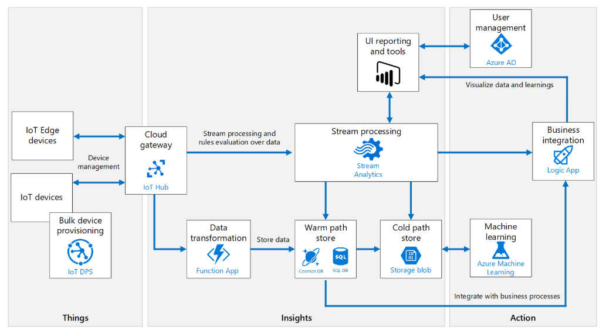

IoT란 각종 사물에 센서와 통신 기능을 내장하여 무선 네트워크 상에서 데이터를 수집하고 전송하는 시스템을 말합니다. [Azure Architecture Center](https://docs.microsoft.com/ko-kr/azure/architecture/)에서 제안하는 IoT 참조 아키텍처를 설명합니다.

# Azure IoT Reference Architecture

Microsoft가 제안하는 Azure PaaS component를 이용한 아키텍처는 다음과 같습니다. 

Edge Device와 IoT 디바이스로부터 온 데이터의 형식을 변환해서 *Cold Path*와 *Warm Path*로 데이터를 나눠서 처리하고, 미리 수집한 데이터와 디바이스 데이터를 결합하여 머신러닝을 적용해 비즈니스 인사이트를 도출합니다.

> **Cold Path, Warm Path?**
> 측정 데이터 처리 방식에 따라 나눌 수 있습니다.
> **Hot path**는 거의 실시간으로 측정 데이터를 분석합니다. 스트림 데이터를 처리하는 엔진으로 구현합니다. 처리 결과는 알람을 트리거하거나 분석 도구를 사용하여 쿼리할 수 있도록 구조화된 형식으로 기록됩니다. **Cold path**는 측정 데이터가 배치 작업으로 보내지고, 간격을 두고 작업을 수행합니다. 일반적으로 대량의 데이터에 적용됩니다.

## Architecture Component 설명

1. **[Azure IoT Edge](https://docs.microsoft.com/en-us/azure/iot-edge/)** : 장치 자체 또는 필드 게이트웨이에서 일부 데이터 처리를 수행하는 IoT devices는 Azure IoT Edge를 통해 관리할 수 있습니다. 장치에 코드를 일괄 배포하거나 원격으로 장치를 관리할 수 있습니다. 

2. **[IoT Hub](https://docs.microsoft.com/en-us/azure/iot-hub/)** : Cloud gateway 역할을 합니다. 장치로부터 오는 이벤트를 처리하는 클라우드 서비스를 호스팅합니다. IoT devices와 백엔드 서비스 사이의 브로커 역할로 이해할 수 있습니다. 보안 연결, 이벤트 수집, 양방향 통신 및 장치 관리 등 기능을 제공합니다. 

> IoT Hub 제공 프로토콜
- MQTT 3.1.1
- MQTT over WebSockets
- AMQP 1.0
- AMQP over WebSockets and
- HTTPS

3. **[IoT Hub Device Provisioning Service (DPS)](https://docs.microsoft.com/en-us/azure/iot-dps/)** : DPS를 사용하면 특정 Azure IoT Hub 엔드포인트에 장치를 할당하고 확장성이 뛰어난 방식으로 IoT devices를 자동 프로비저닝할 수 있습니다. 

4. **[Azure Stream Analytics](https://docs.microsoft.com/en-us/azure/stream-analytics/)** : 스트림 데이터를 집계하고 외부 데이터 소스를 결합하여 복잡한 분석을 실행할 수 있습니다. 

5. **[Cosmos DB](https://docs.microsoft.com/en-us/azure/cosmos-db/introduction)** : Warm path storage로 사용할 수 있는 PaaS 데이터베이스로는 Cosmos DB가 있습니다. Cosmos DB는 글로벌 분산과 확장이 용이합니다. Azure 에서 제안하는 IoT Architecture에 Cosmos DB를 Warm path로 사용하는 또 다른 시나리오를 쉽게 찾아볼 수 있습니다. [CosmosDB를 Warmpath DB로 활용한 아키텍처](https://docs.microsoft.com/en-us/azure/architecture/solution-ideas/articles/iot-using-cosmos-db)

6. **[Azure Blob Storage](https://docs.microsoft.com/en-us/azure/cosmos-db/introduction)** : Cold path storage로 Azure Blob Storage를 사용합니다. IoT Hub 메시지 라우팅을 사용하면 IoT devices 메시지를 Azure Blob 저장소에 저장할 수 있으므로, Blob 저장소가 저렴하고 장기적인 콜드 데이터 저장소 역할을 할 수 있습니다. **참고 >** [IoT Edge에서 Azure Blob Storage를 사용하여 데이터 저장](https://docs.microsoft.com/ko-kr/azure/iot-edge/how-to-store-data-blob)

7. **[protocol gateway](https://docs.microsoft.com/en-us/azure/iot-hub/iot-hub-protocol-gateway)** : 원격 측정 스트림 데이터를 조작하거나 집계하는 작업이 필요할 수 있습니다. 예를 들어 이진 데이터를 JSON으로 변환하거나 데이터 포인트를 결합하는 등 프로토콜 변환하는 작업이 이에 해당합니다. 데이터가 IoT Hub에 도달하기 전 변형되어야 할 경우, protocol gateway를 사용해 처리할 수 있습니다. 만약 데이터가 IoT Hub에 도달하고 나서 변환해야 하는 경우, IoT Hub에 발생하는 이벤트로 Azure Functions 함수를 트리거하여 작업할 수도 있습니다. 

8. **[Azure Logic Apps](https://docs.microsoft.com/en-us/azure/logic-apps/logic-apps-overview)** : 데이터를 서비스에 통합해야 할 때 필요한 작업이나 비즈니스 프로세스 및 워크플로를 예약하여 자동화하는 데 유용한 서비스입니다. 경보를 발생하거나 이메일 또는 SMS 메시지를 전송하는 작업을 정의할 수도 있습니다. 

9. **Azure Active Directory** : Azure Active Directory를 통해 서비스에 접근할 수 있는 사용자를 관리합니다. 

## Device Connectivity

장치를 클라우드 게이트웨이에 연결하는 4가지 방법이 있습니다. 

① **클라우드 게이트웨이에 직접 장치를 연결**: 인터넷을 통한 보안 연결을 의미합니다. 

② **필드 게이트웨이를 통한 연결(IoT Edge Device)**: 산업별 표준, 단거리 통신 기술(Bluetooth, ZigBee)을 사용하는 장치, TLS/SSL 스택을 호스팅할 수 없는 리소스 제약 장치 또는 인터넷에 노출되지 않은 장치를 연결할 때 사용합니다. 이 옵션은 스트림과 데이터 집계를 필드 게이트웨이에서 실행할 때 유용합니다.

③ **사용자 지정 클라우드 게이트웨이를 통한 연결**: 클라우드 게이트웨이 엔드포인트에 도달하기 전에 프로토콜 변환 또는 사용자 지정 처리가 필요한 경우 사용합니다. 

④ **필드 게이트웨이 및 사용자 지정 클라우드 게이트웨이를 통한 연결**: 클라우드 측에서 일부 프로토콜을 적용하거나 사용자 지정이 필요할 때, 클라우드에서 실행되는 사용자 지정 게이트웨이에 연결하도록 선택할 수 있습니다. 일부 시나리오는 VPN 기술을 사용하거나 애플리케이션 레벨 릴레이 서비스를 사용하여 격리된 네트워크 터널을 사용하는 필드 및 클라우드 게이트웨이와의 통합이 필요합니다.

> 추가로 [IoT 보안 관련 문서](https://docs.microsoft.com/ko-kr/azure/iot-fundamentals/iot-security-architecture#threat-modeling-the-azure-iot-reference-architecture)를 확인할 수 있습니다. 

# IoT 시나리오별 아키텍처 

### 1. [건축 산업 IoT Architecture](https://docs.microsoft.com/en-us/azure/architecture/example-scenario/data/big-data-with-iot)

대규모 장치 데이터를 수집하여 건설 장비를 원격으로 자동 제어하는 기능을 구현하기 위한 아키텍처입니다. 사물인터넷(IoT)과 GPS 기술을 탑재한 차량, 미터기, 드론을 구축해 원격측정 데이터를 내보냅니다. 건설 현장 장비 및 데이터를 통합하고 분석하여 장비 다운타임을 최소화하고 도난을 방지합니다. 

1. **Traffic Manager** : 트래픽 매니저는 서로 다른 Azure region의 서비스 엔드포인트에 대한 사용자 트래픽 분포를 제어합니다.

2.	**Load Balancer** : VM 기반 웹 서비스를 통해 건설 장비 디바이스에서 전송된 데이터를 분산하여 고가용성을 제공합니다.

3.	**Apache Cassandra** : 시공 데이터를 저장하는 데 사용되는 분산 NoSQL 데이터베이스입니다. Cosmos DB 로 대체할 수 있습니다. 

4.	**Web Apps** : 소스 데이터와 이미지를 쿼리하고 보는 데 사용할 수 있는 최종 사용자 웹 애플리케이션을 호스트합니다. 아파치 스파크에 대한 일괄 작업 수행에 사용합니다.

5.	**Apache Spark on HDInsight** : 빅데이터 분석 애플리케이션의 성능을 향상시키기 위해 메모리 내 처리를 지원합니다. 이 시나리오에서 스파크는 아파치 카산드라에 저장된 데이터에 대해 복잡한 알고리즘을 실행하는 데 사용합니다.

6.	**Blob storage** : IoT 허브 디바이스로부터 모인 이미지 데이터를 저장합니다. 웹 애플리케이션을 통해 이미지 데이터 조회합니다. Data Lake Storage로 대체할 수 있습니다.
 

### 2. [음성 도우미 IoT Architecture](https://docs.microsoft.com/en-us/azure/architecture/example-scenario/data/big-data-with-iot)

사용자가 음성을 이용해 비서 애플리케이션을 사용하는 시나리오입니다. IoT devices가 타사 IoT 클라우드에 연결되면 [Azure Bot Service](https://docs.microsoft.com/en-us/azure/bot-service/?view=azure-bot-service-4.0)를 통해 타사 서비스 API에 연결하여 장치에 명령을 전송합니다. 

### 3. [COVID-19 보호를 위한 IoT Architecture](https://docs.microsoft.com/ko-kr/azure/architecture/solution-ideas/articles/iot-connected-platform)

열 감지 카메라 등 다양한 센서에서 수집된 온도 및 시각 데이터를 IoT Edge 게이트웨이에서 전처리합니다. 클라우드에서는 IoT hub와 통신하여 네트워크를 제어하고 데이터를 Azure 리소스로 스트리밍합니다. Azure API Management는 웹 앱, 모바일 앱, Azure maps 및 Power BI와 같은 엔드포인트에 배포 시 내부와 외부 API를 통합하는 역할을 합니다. 배포 된 앱은 Azure Active Directory, [Azure Key Vault](https://azure.microsoft.com/ko-kr/services/key-vault/)및 [Azure Monitor](https://azure.microsoft.com/ko-kr/services/monitor/) 같은 azure 서비스로 관리됩니다. 

지금까지 Azure IoT 참조 아키텍처를 기반으로 IoT를 위한 Azure PaaS 서비스를 알아보았습니다. 