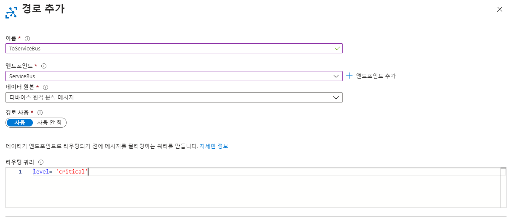
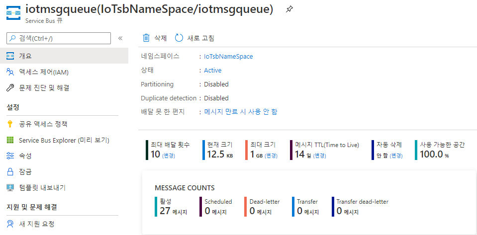

---
authors:
- yerim kim
date: "2020-07-31T00:00:00Z"
tags:
- Azure
- IoT
- Microsoft Azure
title: Azure IoT Hub 시작하기 -3
---

 IoT Hub에서 서비스 버스로 라우팅을 설정하고, Logic Apps를 이용해 메일 알람을 설정하는 방법을 알아보겠습니다. 

장비의 이상 탐지를 위해 IoT Hub에서 특정 값이 있는 메시지를 Azure Service Bus의 큐로 전송합니다. Logic Apps를 통해 큐의 메시지를 3분마다 한 번 검색하여 큐에 내용이 있으면 메일로 해당 내용을 전송하도록 합니다. 

목차는 다음과 같습니다.
- Azure Service Bus 네임스페이스 및 큐 생성
- IoT Hub 사용자 엔드포인트 추가
- Logic Apps 만들기
- 결과 확인

## 1. Azure Service Bus 네임스페이스 및 큐 생성

1) Azure Portal에 Azure Service Bus를 검색하여 클릭합니다. 

2) **+추가**를 클릭하고 리소스 그룹, 네임스페이스 이름, 위치, 계층을 선택합니다. 실습에서는 기본 계층을 사용합니다. 

3) 생성한 네임스페이스의 메뉴에서 **큐**를 클릭하여 다음과 같이 생성합니다. 

## 2. IoT Hub 사용자 엔드포인트 추가

1) IoT 허브 메뉴에서 **메시지 라우팅**을 클릭합니다. 

2) **+엔드포인트 추가**를 클릭하고 **Service Bus 큐**를 선택합니다. 

3) 엔드포인트 이름을 입력하고, 앞서 생성한 Service Bus 네임스페이스와 큐를 선택합니다. 

4) 경로 추가 창으로 돌아와 이름과 엔드포인트를 지정하고, 데이터 원본은 **디바이스 원격 분석 메시지**로 선택합니다. 

5) 라우팅 쿼리를 입력합니다. 기본 값을 사용하면 모든 메시지가 Service Bus 큐로 전송됩니다. 테스트를 위해 true로 설정하여 모든 메시지를 큐에 전송합니다.

> 아래와 같은 쿼리를 입력하면 레벨이 critical로 설정된 메시지만 Service Bus 큐로 전송됩니다. 
 

6) 라우팅 결과를 확인합니다. *Azure IoT Hub 시작하기 -1* 에서 설정했던 엔드포인트인 **스토리지 계정**과 **Azure Service Bus 큐**에 메시지가 전송되는 것을 확인할 수 있습니다. 

## 3. Logic Apps 만들기

Logic Apps를 사용하여 Service Bus Queue에 메시지가 있는 경우, 해당 내용을 포함한 메일을 발송하도록 설정합니다. 

1) Azure Portal에서 Logic Apps를 검색하여 선택합니다.

2) **+추가**를 클릭하여 리소스 그룹, 논리 앱 이름, 위치를 선택하고, **Log Analytics**는 끄기로 설정합니다. 

3) Logic Apps가 생성되면 메뉴에서 **논리 앱 디자이너**를 클릭합니다. 

4) 트리거로 *Service Bus 큐에서 메시지가 수신되는 경우*를 선택합니다. 

5) **계속**을 클릭하여 Service Bus 큐를 선택하고, 큐를 확인할 시간 간격을 지정합니다. 기본적으로 3분마다 큐를 검색합니다.

>참고 : 코드 보기를 클릭하여 frequency와 interval 변수 값을 수정할 수도 있습니다. 

6) 단계를 추가하여 outlook 메일 보내기를 선택합니다. (메신저로 슬랙, 아웃룩, 지메일 등을 지원합니다)

7) outlook에 로그인하고 상세 설정을 합니다. 

8) 아래 그림과 같이 본문에 Service Bus 내용을 넣습니다. 

9) 저장 후 결과를 확인합니다. 

>주의! : 앞서 큐에 모든 메시지를 저장하도록 설정한 경우, 메일 폭탄을 받을 수 있습니다. 

지금까지 3편의 포스팅에 걸쳐 IoT 허브를 생성하고, 다양한 엔드포인트로 데이터를 전송하는 방법을 알아보았습니다. [Azure IoT Architecture](https://tech.cloudmt.co.kr/2020/07/27/Azure-IoT-Architecture/)에서 IoT 허브와 Azure의 다양한 PaaS 서비스를 연동한 아키텍처도 참고하시길 바랍니다. 