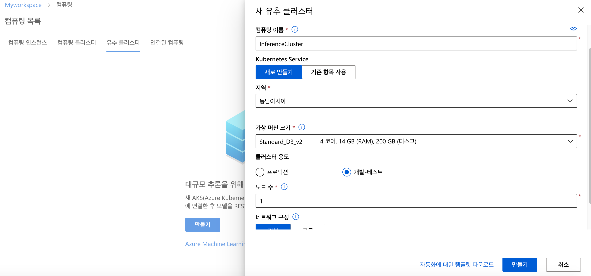
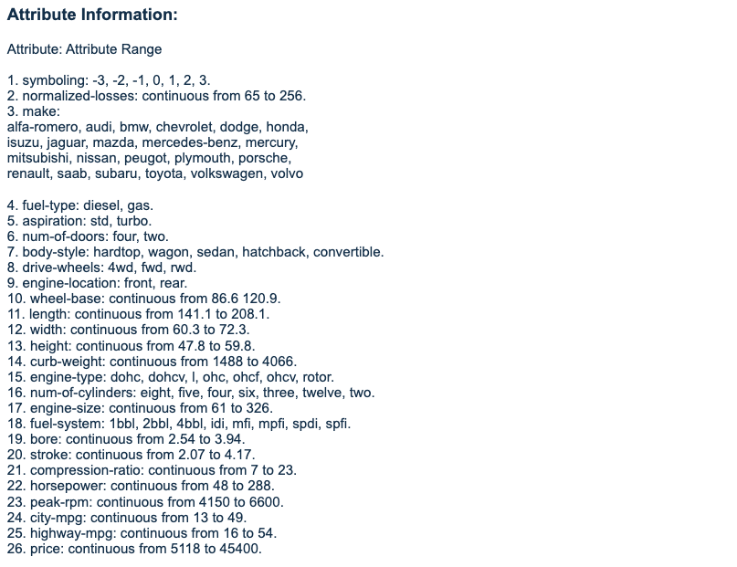
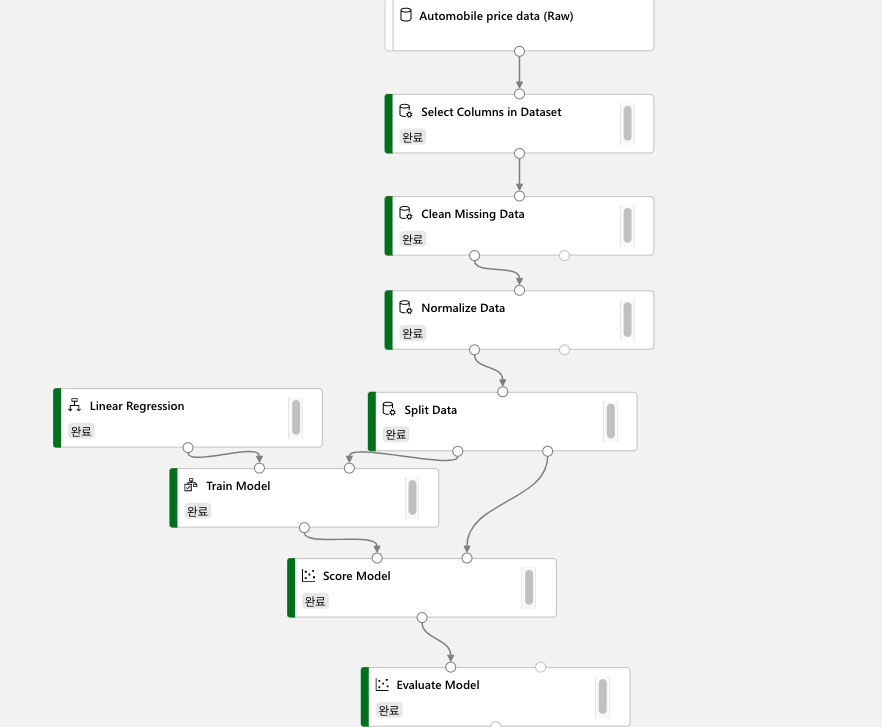
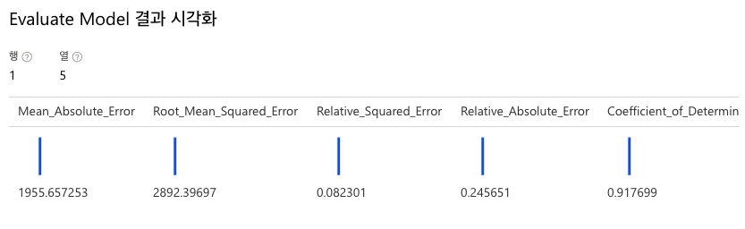

이번 포스팅은 [Azure Machine Learning 실습 자료](https://docs.microsoft.com/ko-kr/learn/modules/create-regression-model-azure-machine-learning-designer)를 바탕으로 작성하였습니다. 해당 모듈은 Azure Machine Learning을 사용하여 코드 없이 예측 모델 만들기 실습의 두 번째 모듈입니다.

### 1. 회귀란 무엇일까?

[지난 포스팅](https://tech.cloudmt.co.kr/2020/08/19/Azure-Machine-Learning/)에서도 특정 날짜의 자전거 대여 수를 예측하기 위해 회귀 분석을 사용하였습니다. 회귀는 특징(features)을 기반으로 numeric label을 예측하기 위해 사용하는 머신러닝 모델입니다. 예를 들어 중고 자동차 판매 회사는 엔진 크기, 시트 개수, 주행량 등 차의 특징을 이용하여 판매 가능한 가격을 예측할 수 있습니다. 이 경우, 차의 특징은 feature가 되고, 판매 가격은 label이 됩니다. 회귀는 알려진 값을 label로 사용하고 feature를 학습에 사용합니다. 학습이 끝나면, 알려지지 않은 새로운 항목에 대해 label을 예측하는 데 모델을 사용할 수 있습니다. Microsoft Azure Machine Learning designer를 사용하면 회귀 모델을 드로그앤드롭 방식으로 만들 수 있습니다. 이 모듈에서는

- Azure Machine Learning designer를 회귀 모델 학습에 사용합니다.
- 회귀 모델을 추론에 이용합니다.
- 회귀 모델을 서비스에 배포합니다.

### 2. 이용할 데이터 세트

Workspace와 컴퓨트 엔진은 지난 모듈을 실습할 때 만들었던 것을 그대로 사용합니다. 학습이 완료된 모델을 서비스에 배포하기 위해 Inference Clusters만 추가 생성합니다. 

실습에 이용할 데이터 세트는 제조사, 모델 및 기술 사양에 따른 다양한 자동차 가격 데이터입니다. Azure Machine Learning Designer에서 사용할 수 있는 샘플 데이터 중 하나입니다. 데이터 세트에 대한 자세한 설명은 원본 [데이터 저장소](https://archive.ics.uci.edu/ml/datasets/Automobile)에서 확인할 수 있습니다. 해당 데이터 세트에는 손실된 데이터가 있기 때문에 정제 작업이 필요합니다. *학습 파이프라인 - 데이터세트* 메뉴에서 **Automobile price data**를 검색하여 파이프라인 창에 드래그앤드롭으로 추가합니다.

이 데이터 집합의 지표 중 몇 가지를 살펴보겠습니다. 

- Symbolizing : 자동차의 위험도를 -3부터 3까지 정수로 나타낸 값입니다. +3은 자동차가 위험하다는 것을 나타내고, -3은 안전하다는 의미입니다. 

- nomalized-losses : 보험에 가입한 차량 연도당 상대적 평균 손실 지급액을 의미합니다. 해당 값은 자동차의 특징(도어 수, 소형/중형, 스포츠/특수 등)에 따라 결정되며, 65부터 256까지 값으로 구성됩니다. 

### 3. Machine Learning Designer로 데이터 정제 파이프라인 만들기

(1) *학습 파이프라인-모듈*에 **Select Columns in Dataset**을 검색하여 드래그앤드롭으로 파이프라인 창에 추가하고, 데이터 세트와 화살표를 연결합니다.

(2) 데이터 세트에서 사용할 열을 선택합니다. normalized-losses를 제외한 모든 열의 이름을 입력합니다.

(3) 손실된 데이터를 정제하기 위한 모듈을 추가합니다. **Clean Missing Data**를 검색하여 파이프라인 창에 추가하고, 다음 설정을 입력합니다. 손실된 데이터가 있는 Bore, stroke, horsepower column을 선택하고, 결측 값이 있는 열의 줄을 제거하도록 설정합니다.

(4) 데이터를 정규화하기 위한 모듈을 추가합니다. **Normalize Data**를 파이프라인 창에 추가하고, 정규화할 column의 이름을 입력합니다. 

> symboling, wheel-base, length, width, height, curb-weight, engine-size, bore, stroke, compression-ratio, horsepower, peak-rpm, city-mpg, highway-mpg

(5) **제출**을 클릭하여 파이프라인 실행 후, 결과를 검토합니다. 결측 값이 있던 **Stroke** Column을 자세히 살펴보겠습니다. 

아무런 처리도 하지 않은 상태의 stroke 데이터는 3.15와 3.39 사이 누락된 값이 4개 존재하는 것을 볼 수 있습니다. 

손실 데이터를 정제하는 모듈과 정규화하는 모듈을 거친 후 데이터를 각각 확인해보았습니다. 손실 값이 없어지고, 정규화 결과에 따라 최대값은 1, 최소값은 0이 된 것을 확인할 수 있습니다. 

### 4. Machine Learning Designer로 데이터 학습 파이프라인 만들기

정제된 데이터를 둘로 나눕니다. 총 199개 줄 데이터 중 70%인 139행은 모델을 학습시키는 데에 사용하고, 나머지 60행은 모델을 평가하는 데에 사용합니다. 

(1) **Split Data**를 검색하여 파이프라인 창에 추가하고, 다음 설정을 사용하여 데이터를 나눕니다.

(2) **Train Model** 모듈을 검색하여 파이프라인 창에 추가합니다. **Split Data** 결과로 나온 70%의 데이터를 **Train Model**에 연결합니다. **Train Model**의 매개 변수의 **Label column**에는 학습을 통해 추정하고 싶은 변수를 입력합니다. 여기서는 자동차의 가격을 추정할 것이기 때문에 **price**를 입력합니다.

(3) **Linear Regression**을 검색하여 파이프라인 창에 추가하고, **Train Model**에 연결합니다.

**참고 :** OLS(Ordinary Least Squares)는 가장 기본적인 선형 회귀 방법입니다. 잔차제곱합(오차를 제곱한 합계)을 최소화하는 가중치 벡터를 행렬 미분으로 구하는 방법입니다. 

**참고 :** 설정의 L2 regularization weight는 일반화(regularization)를 위한 가중치 설정입니다. 일반화는 overfitting을 해결하기 위한 방식입니다. local noise가 학습에 큰 영향을 끼지지 않고, outlier의 영향을 적게 받도록 합니다. overfitting은 학습 데이터 양을 늘리면서 극복할 수 있지만, 학습 데이터 확보가 어렵고, 데이터가 많아질수록 학습에 시간이 걸리는 문제가 생깁니다. L2 regulation weight 값은 특정 가중치가 비이상적으로 커지고 학습의 효과에 큰 영향을 끼치는 것을 방지할 수 있습니다. 

(4) label을 추론하여 값을 출력하기 위해 **Score Model** 모듈을 파이프라인 창에 추가합니다. **제출**을 클릭하여 모델 학습 및 추론을 시작합니다. 

(5) **Score Model**을 마우스 우클릭하여 *시각화*를 클릭하면 결과를 검토할 수 있습니다. 학습된 모델을 바탕으로 60개 차량의 가격을 예측한 값을 **Scored Labels** 행에서 볼 수 있습니다.

(6) 학습을 바탕으로 추론한 결과가 얼마나 정확한지 평가할 차례입니다. **Evaluate Model** 모듈을 검색하여 파이프라인 창에 추가합니다. 실행 후 결과를 검토합니다.

**참고 :** 5가지 평가 지표의 의미는 다음과 같습니다. 

- Mean Absolute Error(MAE): 예측 값과 실제 값 사이 차이(잔차)의 평균이다. 이 값이 낮을수록 모형 예측 정확도가 높다. (단위: 달러)
- Root Mean Squared Error(RMSE): 오차의 제곱에 평균을 낸 것이다. MAE와 비교했을 때, 차이가 크면 개별 오류의 분산이 더 크다는 것을 나타낸다. (큰 값일수록 제곱한 값이 커지기 때문) 만약 MAE와 RMSE가 거의 동일하다면, 모든 개별 오류가 비슷하다는 것을 의미한다. 
- Relative Squared Error(RSE): 예측 값과 참 값 사이 차이를 제곱한 것을 기준으로 산정한 0과 1 사이 상대적 메트릭이다. 이 값이 0에 가까울수록 모델의 예측도가 높다는 것을 의미한다. 이 메트릭은 상대적이기 때문에 레이블이 서로 다른 단위에 있는 모형을 비교하는 데 사용할 수 있다.
- Relative Absolute Error(RAE): 예측 값과 참 값 사이의 절대적 차이를 기준으로 산정한 0과 1 사이 상대적 메트릭이다. 이 값이 0에 가까울수록 모델의 예측도가 높다는 것을 의미한다. RSE와 마찬가지로 이 메트릭은 레이블이 다른 단위에 있는 모형을 비교하는 데 사용될 수 있다.
- Coefficient_of_Determination(R^2): 이 측정지표를 R-제곱이라고 부른다. 예측값과 참값 사이의 분산이 모형에 의해 얼마나 잘 설명되는지 요약한다. 이 값이 1에 가까울수록 모델의 예측도가 높다는 것을 의미한다.

이번 포스팅에서는 Azure Machine Learning Studio의 preview 기능인 AI Designer를 이용하여 자동차 가격을 예측하는 회귀 학습 모델 파이프라인을 만들어 보았습니다. 다음 포스팅에서는 실시간 유추 파이프라인을 통해 label이 없는 새로운 데이터에 대한 추론 파이프라인을 만들어보고, AKS 클러스터를 이용해 서비스에 배포하는 방법을 소개하겠습니다. 