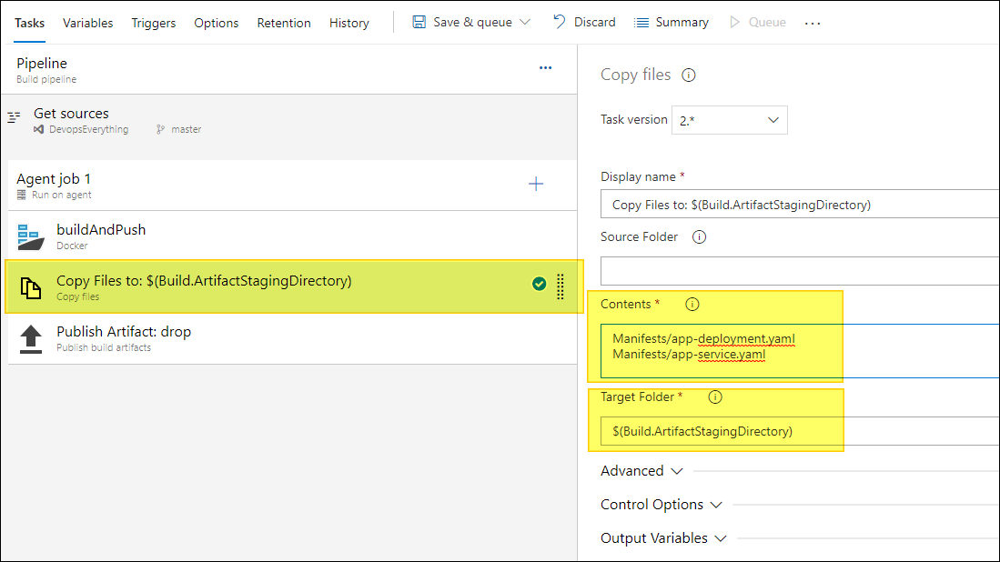
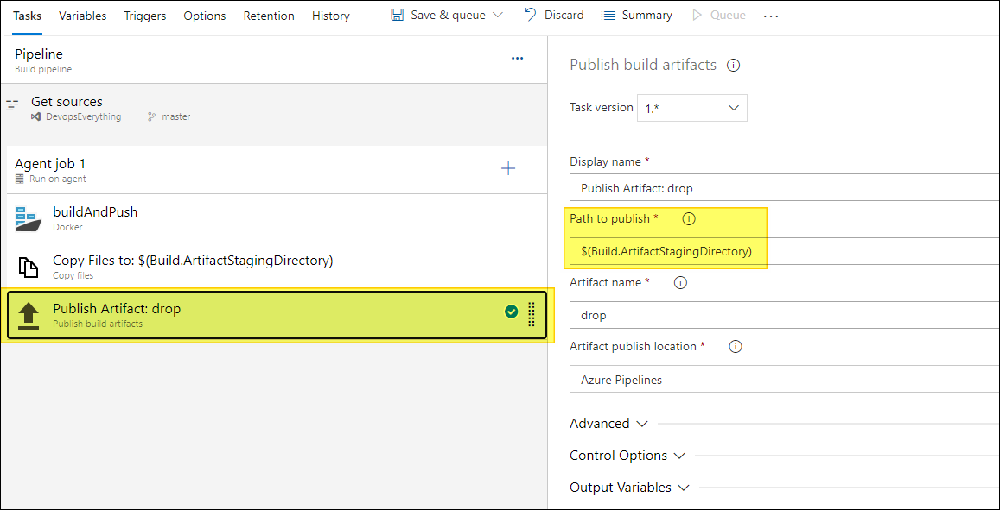
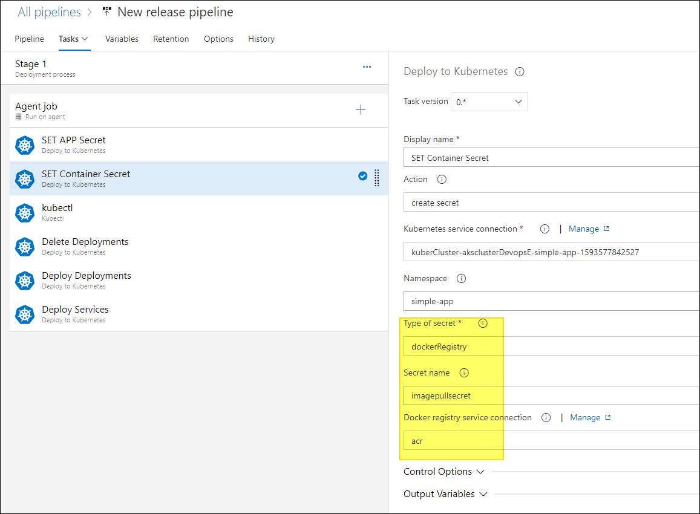
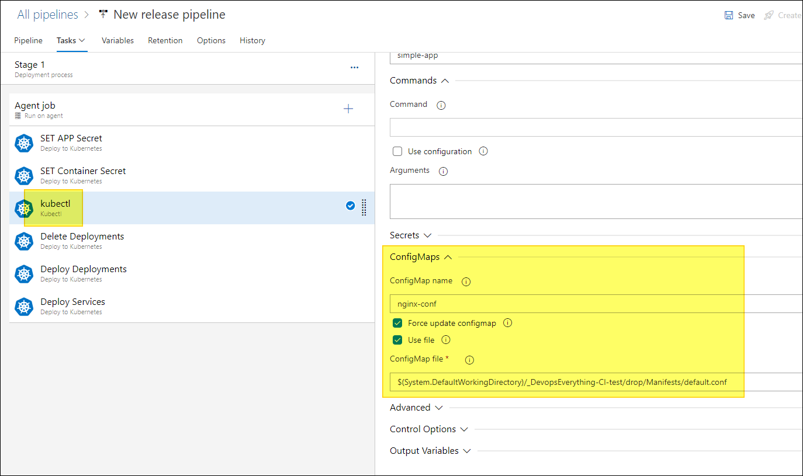
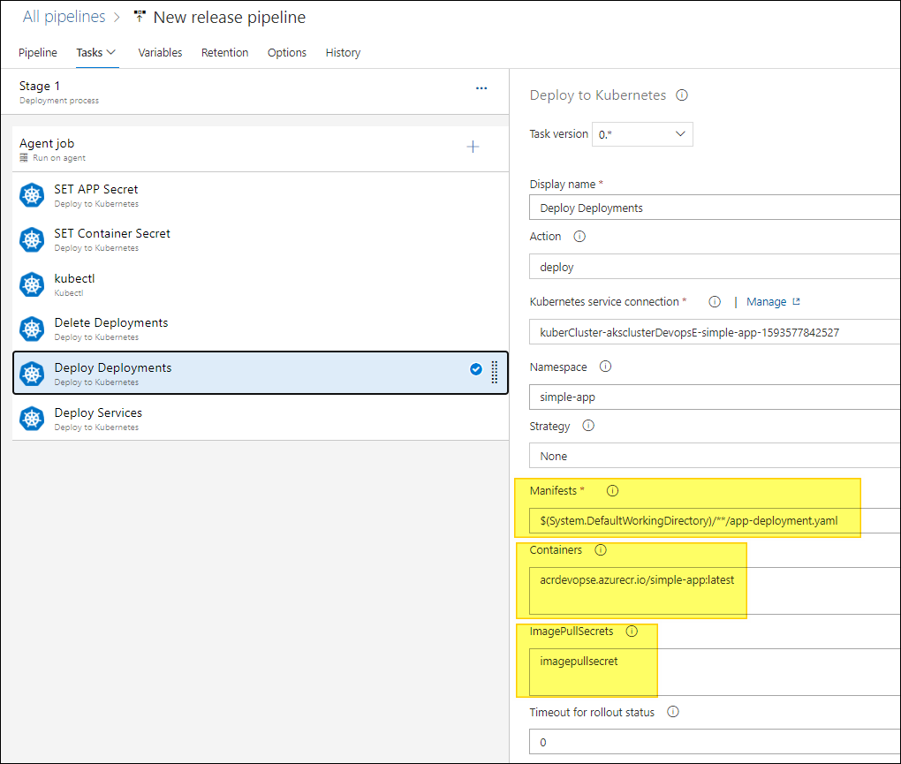
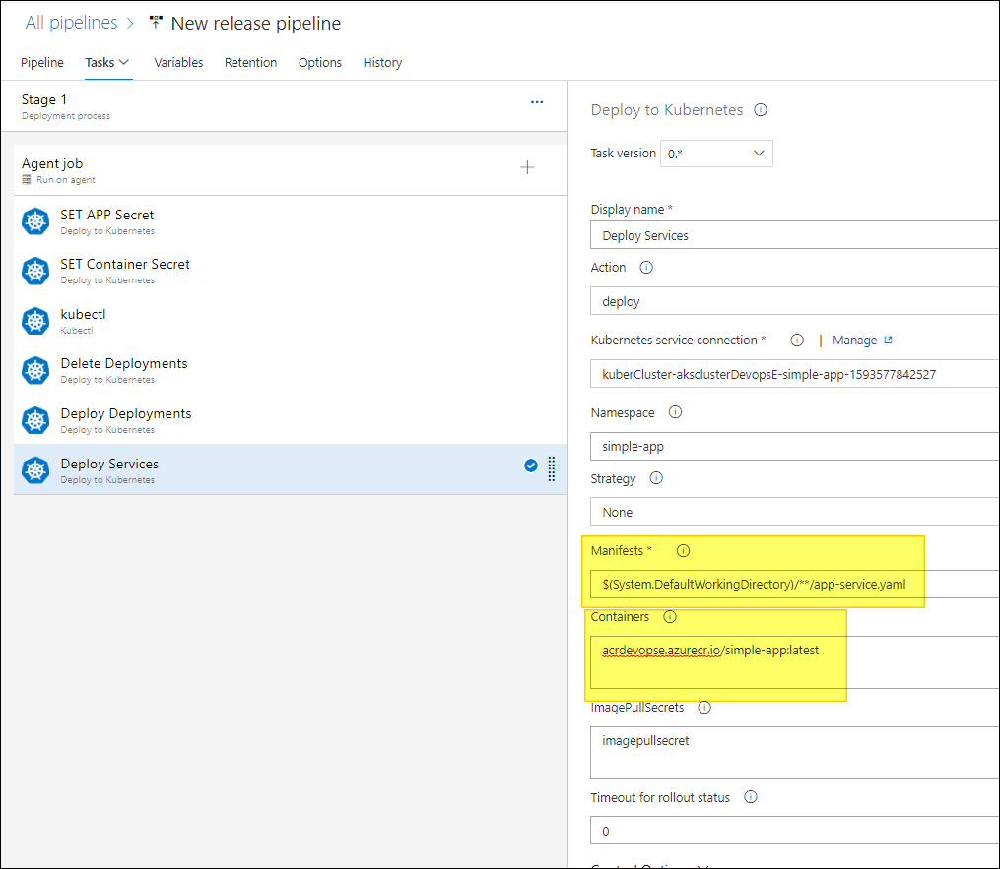

[Azure Devops 프로젝트 위치](https://dev.azure.com/TestingProjectCM/DevopsEverything)
# Azure Devops와 AKS배포 관리 2편 - Docker 이미지의 AKS 배포
빌드된 어플리케이션을 배포하는 방법은 여러가지 방법이 있다. 통합된 Devops 툴을 사용하기 전에는 Jenkins와 같은 빌드서버에서 Ansible과 같은 배포툴로 서버에 배포했다. 그러기 위해서는 어플리케이션에 따른 빌드환경과 배포환경을 직접 셋팅이 필요했다. 통합된 Devops와 Cloud Service는 이러한 작업을 상당히 줄여준다.

아래는 전체 아키텍쳐이다. 상당히 통합되어 있어보인다.


> 여러개의 어플리케이션 구현을 위해 Mysql을 직접 배포해보았다.

# 2편 구현 목표
1. Artifact 배포
2. Manifest 파일을 통해 Kubernetes에 Application을 배포.
3. 모니터링 Kubernetes Prometheus, Grafana 배포.
4. ARM template으로 IaC 구현.

## Kubernetes 배포
1편에서 어플리케이션의 도커 이미지 생성까지 구현했다. 그리고 Kubernetes는 컨테이너 기반 어플리케이션을 관리한다고 했다. 따라서, 빌드된 도커 이미지를 기준으로 Manifest 작성으로 Kubernetes에 어플리케이션을 배포할 수 있다. 작성된 Manifest를 배포 파이프라인에서 사용하도록 Artifact에 저장하고, Kubernetes에 배포해보자.

> **Artifact?**
> 소프트웨어 개발을 진행하면서 생성되는 다양한 산출물을 의미하며, 각종 설계문서, 소스코드, 라이브러리 등 이 있다.  

### Kubernetes 리소스 생성
Azure Shell에서 AKS를 생성하자.

```
ACR_NAME=CMACR            # ACR 이름 변수 지정
RESOURCE_GROUP=CM_Devops  # 리소스 그룹 지정
REGION_NAME=koreacentral  # AKS 리전 지정
AKS_NAME = aksclusterdevops

# Kubernetes 최신버전(preview 제외)
VERSION=$(az aks get-versions \
    --location $REGION_NAME \
    --query 'orchestrators[?!isPreview] | [-1].orchestratorVersion' \
    --output tsv)

# 예제환경에서는 1개의 노드와 가장 작은 사이즈의 VM을 사용
# attack-acr을 통해 1편에서 만든 ACR 권한 부여
az aks create \
--resource-group $RESOURCE_GROUP \
--name $AKS_NAME \
--location $REGION_NAME \
--kubernetes-version $VERSION \
--generate-ssh-keys \
--node-vm-size Standard_B2s \
--node-count 1 \
--attach-acr $ACR_NAME

```
### Manifest 생성.
Yaml이나 Json형식으로 Kubernetes가 유지할 객체의 원하는 상태를 지정한다. pod, replica set, configmap, secret, deployment 등과 같은 리소스를 Manifest를 통해 생성해보자. 예제 Manifests는 [> Manifest 위치](https://dev.azure.com/TestingProjectCM/_git/DevopsEverything?path=%2FManifests) 를 참고하자.

기존 Docker image를 Kubernetes 환경에 올리기 위해서는 Deployment, Service, Config 등을 고려해야한다. Config 부분은 예를들면 Database 접속정보, 어플리케이션의 Config, Docker pull을 위한 인증정보 등이 있다. 이러한 정보는 Secret이나 configmap을 통해 배포할 수 있다. 이 부분까지 Manifest에 포함 시킬 예정이다.

- Set Deployment [> 위치](https://dev.azure.com/TestingProjectCM/_git/DevopsEverything?path=%2FManifests%2Fapp-deployment.yaml)  
  ```
  # MYSQL + PV  Deployment
  apiVersion: "apps/v1" # for versions before 1.9.0 use apps/v1beta2
  kind: Deployment
  metadata:
  name: simpleapp-mysql
  labels:
      app: simpleapp
  spec:
  selector:
      matchLabels:
      app: simpleapp
      tier: mysql
  strategy:
      type: Recreate
  template:
      metadata:
      labels:
          app: simpleapp
          tier: mysql
      spec:
      containers:
      - image: mysql:5.7
          name: mysql
          args:
          - "--ignore-db-dir=lost+found"
          env:
          - name: MYSQL_DATABASE
          value: simpleapp
          - name: MYSQL_USER
          value: user
          - name: MYSQL_PASSWORD      # Secret 값 사용
          valueFrom:
              secretKeyRef:
              name: mysql-secret
              key: password
          - name: MYSQL_PORT
          value: "3306"
          - name: MYSQL_ROOT_PASSWORD     # Secret 값 사용
          valueFrom:
              secretKeyRef:
              name: mysql-secret
              key: password
          ports:
          - containerPort: 3306
          name: mysql
          volumeMounts:
          - name: mysql-persistent-storage
          mountPath: /var/lib/mysql
      volumes:
      - name: mysql-persistent-storage
          persistentVolumeClaim:
          claimName: mysql-pv-claim
    ---
    # 예제 어플리케이션 Deployment.
    apiVersion: "apps/v1" # for versions before 1.9.0 use apps/v1beta2
    kind: Deployment
    metadata:
    name: simpleapp
    labels:
        app: simpleapp
    spec:
    selector:
        matchLabels:
        app: simpleapp
        tier: frontend
    strategy:
        type: Recreate
    template:
        metadata:
        labels:
            app: simpleapp
            tier: frontend
        spec:
        containers:
        # 예제 어플리케이션 - Django
        - image: acrdevopse.azurecr.io/simple-app:latest
            name: simpleapp
            env:
            - name: DJANGO_SETTINGS_MODULE
            value: simpleapp.settings.production
            - name: MYSQL_DATABASE
            value: simpleapp
            - name: MYSQL_USER
            value: user
            - name: MYSQL_PASSWORD      # Secret 값 사용
            valueFrom:
                secretKeyRef:
                name: mysql-secret
                key: password
            - name: MYSQL_PORT
            value: "3306"
            - name: MYSQL_HOST
            value: simpleapp-mysql.simple-app
            - name: MYSQL_ROOT_PASSWORD     # Secret 값 사용
            valueFrom:
                secretKeyRef:
                name: mysql-secret
                key: password
            ports:
            - containerPort: 8000
            name: simpleapp
            volumeMounts: # django의 staticfiles들을 nginx와 공유
            - name: staticfiles
            mountPath: /staticfiles
        # nginx
        - image: nginx
            name: simpleapp-nginx
            ports:
            - containerPort: 80
            volumeMounts: # django의 staticfiles들을 nginx와 공유
            - name: staticfiles
            mountPath: /staticfiles
            - mountPath: /etc/nginx/conf.d
            name: nginx-conf
            readOnly: true
        volumes: # django의 staticfiles들을 nginx와 공유
            - name: staticfiles
            emptyDir: {}
            - name: nginx-conf
            configMap:
                name: nginx-conf

  ```

- Set Service [> 위치](https://dev.azure.com/TestingProjectCM/_git/DevopsEverything?path=%2FManifests%2Fapp-service.yaml)    
  ```
  # 예제 어플리케이션 Service
  # MYSQL
  apiVersion: v1
  kind: Service
  metadata:
    name: simpleapp-mysql
    labels:
      app: simpleapp
  spec:
    ports:
      - port: 3306
    selector:
      app: simpleapp
      tier: mysql
    clusterIP: None
  --- # MYSQL PVC
  apiVersion: v1
  kind: PersistentVolumeClaim
  metadata:
    name: mysql-pv-claim
    labels:
      app: simpleapp
  spec:
    accessModes:
      - ReadWriteOnce
    resources:
      requests:
        storage: 20Gi
  --- # Django 어플리케이션 Service
  apiVersion: v1
  kind: Service
  metadata:
    name: simpleapp
    labels:
      app: simpleapp
  spec:
    ports:
      - port: 80
        targetPort: 80
    selector:
      app: simpleapp
      tier: frontend
    type: LoadBalancer
  ```

- Set Configmap - nginx config [(default.conf)](https://dev.azure.com/TestingProjectCM/_git/DevopsEverything?path=%2FManifests%2Fdefault.conf)  
  ```
  upstream website {
    server 127.0.0.1:8000;
  }

  server {

    location /static/ {
      autoindex on;
      alias /staticfiles/;
    }

    location / {
      proxy_pass http://website/;
      proxy_read_timeout 60;
      proxy_connect_timeout 60;
      proxy_send_timeout 60;
    }

    listen 80;
    server_name localhost;
  }
  ```

## Artifact 배포
작성된 Manifest를 Release 파이프라인에서 사용하기위해 Artifact에 저장해야한다. Build Pipeline에서 Git에 저장된 Manifest를 Artifact로 보내는 작업을 추가한다. 준비한 Manifest를 프로젝트의 특정 위치에 업로드 후 아래와 같이 Artifact로 drop 한다.  
  
  

## Release 파이프라인
배포한 AKS, Artifact를 통해 어플리케이션을 Kubernetes환경에 올릴 차례이다. Release 파이프라인에 아래와 같이 설정을 배포하기만 하면된다.
### apply secret 
어플리케이션 배포시 `Keyvault`에서 관리되는 `환경변수`들을 Kubernetes `Secret`으로 배포할 수 있다.  

### apply imagepullsecret
ACR에서 Pull 하기위한 인증을 위해 `Imagepullsecret`을 설정하자.  

### apply configmap
`configmap`은 데이터를 저장하는데 사용하는 API오브젝트이다. 파일을 통한 저장이 가능하다.  

### apply deployment  
Artifact에 저장한 yaml을 경로로 deployment를 설정하고, Deploy를 해준다. `ImagePullSecret`은 위에서 설정한 값 그대로 써준다.  

### apply service
위처럼 Service도 설정해준다.

### 성공
배포가 성공되면 아래와 같이 `Azure shell`에서 명령어를 통해 목록을 볼 수있다. 실패시 파이프라인의 로그를 보고 슈팅을 하도록하자.


## 모니터링
### Helm Chart
`Helm`이란, 쿠버네티스를 패키지로 해서 관리해주는 것으로 Python의 pip, Node.js의 npm의 역할로 보면된다. `Helm Chart`란 패키지 포멧으로 쿠버네티스를 설명하는 파일의 집합이라고 볼 수 있다.

모니터링 도구로써 Prometheus와 대시보드 Grafana를 함께 많이 사용하고 있다. Helm Chart의 실습을 통해 모니터링 구성을 해보았다. Azure Shell을 통해 우선 배포 테스트를 해보았으며, 추후 배포 파이프라인에 추가해볼 예정이다.


- Prometheus 배포
```
kubectl create namespace monitoring

helm search repo prometheus

helm install monitoring stable/prometheus

```

- Grafana 배포
```
helm install prometheus stable/prometheus -n monitoring

helm install grafana stable/grafana --set persistence.enabled=true --set service.type=Loadbalancer --set persistence.size=8Gi --namespace monitoring

```

위 명령어를 통해 기본 설정으로 배포해주었다. 그 다음 `kubectl get service -n monitoring` 명령어를 통해 Grafana IP로 접속해서, 대시보드를 Import 해보자.  

  
- 위 스크린샷처럼 접속 후 왼쪽에 있는 `+` 메뉴에서 `Import`로 들어간다.  
  
- 위 칸에 `6417`를 적으면 아래 스크린샷처럼 나온다. [Grafana Labs 참조](https://grafana.com/grafana/dashboards/6417)  
  
- Import를 하고 생성한 대시보드를 띄우면 아래와 같이 나온다.  
  

이렇게 쉬운 셋팅으로 쿠버네티스의 인프라에 대해 모니터링을 할 수있게 되었다. 필요한 Metric을 설정하고 alert 설정도 가능하다. 자세한 사용방법은 넘어가겠다.

## IaC (Infrastructure as Code) - Azure ARM Template
사실 이 포스팅의 의도는, ARM Template으로 AKS, ACR을 자동 배포 후 어플리케이션을 올려보기 위함이었다. 하지만 구현 중 많은 어려움이 존재해 ARM template를 통한 적절한 IaC방법을 찾지 못했다.

> **ARM Template?**  
> Azure resource를 코드로써 배포하기위한, 인프라 및 구성을 정의하는 JSON 파일이다. 이러한 선언적 배포를 통해 일관적인 리소스를 오케스트레이션 할 수 있다.

- ARM template 배포시, Azure Devops에서 Connection을 가지고 오기가 힘들다.
  - Azure Devops에서는 Service간 connection을 한번의 설정만으로 관리해준다.  
  -   
- ACR과의 Pull권한 연결  
  - [Github Issue](https://github.com/MicrosoftDocs/azure-docs/issues/39508) 를 보면 이 방법은 전에 이미 논의했던 흔적을 볼 수있고, 불가능하다라고 적혀있다.
  - 그래서 빌드파이프라인에서 ARM template이 아닌, Azure Cli의 명령어를 통해 배포해보았다. (Attach가능) 하지만, 위에서 말한 Service connection문제가 있어 어려웠다.


## 정리
`Azure` 서비스를 통해 인프라를 구성하고 `Azure Devops`를 통해 어플리케이션을 도커화하고 `Manifest`로 `Azure Kubernetes Service`에 서비스를 배포해 보았고 동시에 모니터링 서비스까지 구축해보았다. `Azure Devops`에서 인프라 구성 자동화까지는 어려운점이 있었지만, 간단한 명령어만으로 `Kubernetes Cluster` 생성이 가능했다. 

이렇게 만들어진 `Kubernetes Cluster`위에 컨테이너화된 `마이크로서비스`들은 `Manifest`만으로 배포하면서 개발주기가 엄청나게 향상될것을 기대할수있다. 초기 도입은 힘들겠지만 엄청나게 큰 서비스를 개발하기에는 `Kubernetes`는 정말 매력적인것같다.