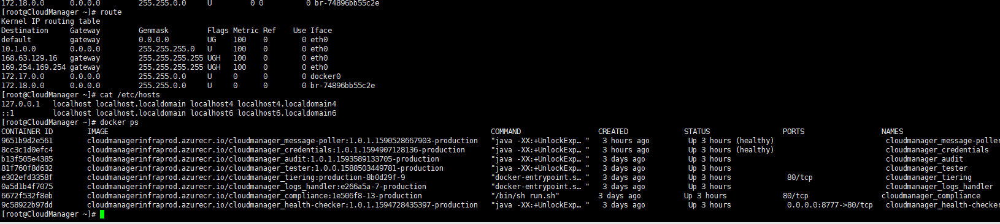

CVO 라이선스 발급이 늦어져서 어쩔수 없이 Azure-AWS 네트워크 환경구성부터 포스팅하게 되었습니다. 먼저 Cloudmanager를 배포하시는것을 권장드립니다.

## CVO를 배포하기위한 네트워크 환경 만들기

Azure와 AWS console을 양쪽에 켜두고 작업해야 하기떄문에 복잡할 수 있습니다.

네트워크 구성에 고민하고 싶지 않다고 생각하시는 분은 김세준님이 작성한 AWS-Azure VPN 테라폼으로 자동생성하기 게시물을 참조하여 기본설정으로 진행하시기 바랍니다.

[Azure와 AWS간 VPN 연결하기 (Terraform)](https://tech.cloudmt.co.kr/2019/08/09/Post/)

아무래도 스토리지관련 서비스이다보니 네트워크가 빠르고 안정적인것이 필요합니다. 
AWS DX와 같이 전용선 서비스를 사용하여 AWS 와 Azure 사이에 대역폭을 확보한다면 좀 더 강력한 성능을 확인 하실 수 있습니다. 

본 게시글에서는 VPN으로 진행합니다. 

## 1. 환경

- 구성정보
	- Network 정보
		* AWS : 64512( 기본 ) IP : 172.17.0.0/16
		* Azure : 65515 ( 기본 ) IP : 10.1.0.0/16
 
- 서브넷
	- Azure 
		- 10.1.0.0/24 default
		- 10.1.1.0/24 gatewaysubnet

- AWS

|Name|IPv4| CIDR|라우팅 테이블|
|---|---|---|---|
|wyahn-vpc-private-2c |172.17.10.0/24 |rtb-0e174629b72f9971b | wyahn-private-route|
|wyahn-vpc-private-2b |172.17.8.0/24 |rtb-0e174629b72f9971b | wyahn-private-route|
|wyahn-vpc-private-2a |172.17.9.0/24 |rtb-0e174629b72f9971b | wyahn-private-route|

## 2. AZure 가상 게이트웨이 생성

Vnet은 이미 생성하였다는 가정하에 진행합니다.  
( Cloudmanager 생성 단원에서 생성한 Vnet을 활용합니다.)

- 에저 포탈에 "가상 네트워크 게이트웨이 서비스"를 검색합니다.  

- 가상 네트워크 게이트웨이를 생성합니다.  

	VPN 설정에서 정책기반과 경로기반이 있습니다.  
	AWS는 경로기반으로 만 설정할 수 있습니다. 
	한쪽이 정책기반이라고 하더라고 연결이 안되는것은 아니지만  
	SA가 하나밖에 안되기 때문에 경로기반을 선택합니다.

~~~
Q: 현재 터널당 설정할 수 있는 IPsec 보안 연결(SA)의 수는 어떻게 됩니까?

A: AWS VPN 서비스는 라우팅 기반 솔루션입니다. 따라서 라우팅 기반 구성을 사용하는 경우에는 SA 한도가 적용되지 않습니다. 또한, AWS VPN 서비스가 라우팅 기반 솔루션이므로, 정책 기반 솔루션을 사용하는 경우에는 단일 SA로 제한해야 합니다.
~~~
- BGP 구성 "사용안함"을 체크합니다. 

**주의 스크린샷은 BGP 구성이 사용으로 되어 있지만 사용하지 않음으로 변경해야 합니다.** 
AWS-Azure VPN 구성에서는 169.254.X.X 대역 제약사항 이슈로 BGP 피어를 맺을 수 없었습니다.  

**함정카드 발동! BGP가 안되는 이유**  
[Azure doc]
~~~
Border Gateway Protocol - 사이트의 모든 연결이 BGP를 사용할 수 있음을 의미합니다. 결과적으로 링크 섹션에서 VPN 사이트의 각 링크에 대한 BGP 정보를 설정합니다. 
Virtual WAN에서 BGP를 구성하는 것은 Azure Virtual Network Gateway VPN에서 BGP를 구성하는 것과 같습니다. 
온-프레미스 BGP 피어 주소는 VPN 디바이스의 퍼블릭 IP 주소 또는 VPN 사이트의 VNet 주소 공간과 같으면 절대 안 됩니다. 
VPN 디바이스에서 BGP 피어 IP에 다른 IP 주소를 사용하세요. 디바이스에서 루프백 인터페이스에 할당한 주소가 될 수 있습니다. 

" 그러나 APIPA(169.254.x.x) 주소는 안 됩니다. "

위치를 나타내는 해당 VPN 사이트에서 이 주소를 지정합니다. BGP 필수 조건은 Azure VPN Gateway의 BGP 정보를 참조하세요. 
VPN 사이트 BGP 설정이 사용하도록 설정되면 항상 VPN 연결을 편집하여 BGP 매개 변수(링크의 피어링 IP 및 AS #)를 업데이트할 수 있습니다.
~~~

[AWS doc] 
~~~
https://docs.aws.amazon.com/ko_kr/vpn/latest/s2svpn/VPNTunnels.html
~~~

- 체크한 상태로 만들었다면 구성에서 변경 가능합니다. 

- 공용 IP를 주소를 복사하여 메모장에 기록합니다. 
(만들어지는데 생각보다 오래걸립니다. 기다리지 말고 AWS콘솔로 넘어갑시다.) 
 

## AWS TGW 생성
- 웹콘솔에서 VPC > TGW 를 선택합니다. 
{: width="100"} 
- 기본값으로 생성합니다. (옵션설명은 생락한다!)  

- TGW 연결 생성 메뉴로 이동하여 연결생성 버튼을 누릅니다. 
- 스크린샷에 나와있지 않지만 CGW(고객게이트웨이)가 없다면 NEW 라디오 박스를 체크 후 에저콘솔에서 생성된 가상 게이트웨이 IP를 등록해줍니다.

- "Static" Check 

- TGW의 VPN Connection이 생성되는지 확인! 

- 상단 구성에서 pfSense를 선택하고 다운로드 받습니다. 
(익숙한 장비가 conf가 있다면 그걸로 선택하셔도 무관합니다.) 

- 텍스트 문서가 다운로드되면 문서안의 각 터널 1 터널 2 에대한 Pre-shard Key 값을 기억합니다. 

~~~
Go to VPN-->IPSec. Add a new Phase1 entry (click + button )

General information
 a. Disabled : uncheck
 b. Key Exchange version :V1
 c. Internet Protocol : IPv4
 d. Interface : WAN
 e. Remote Gateway: 3.105.122.14
 f. Description: Amazon-IKE-vpn-06f426171cdbd2271-0
 
 Phase 1 proposal (Authentication)
 a. Authentication Method: Mutual PSK
 b. Negotiation mode : Main
 c. My identifier : My IP address
 d. Peer identifier : Peer IP address
 e. Pre-Shared Key: 너굴맨이 처리했으니 안심하라구 (^^/)

General information
 a. Disabled : uncheck
 b. Key Exchange version :V1
 c. Internet Protocol : IPv4
 d. Interface : WAN
 e. Remote Gateway: 3.105.197.195
 f. Description: Amazon-IKE-vpn-06f426171cdbd2271-1
 
 Phase 1 proposal (Authentication)
 a. Authentication Method: Mutual PSK
 b. Negotiation mode : Main
 c. My identifier : My IP address
 d. Peer identifier : Peer IP address
 e. Pre-Shared Key: 너굴맨이 처리했으니 안심하라구 (^^/)
~~~

IPsec VPN 연결에서 해당 키값이 있어야 터널연결이 가능합니다.

## Azure connection 생성 설정
- Azure 콘솔에서 연결을 검색하여 연결을 생성합니다. 

- 로컬게이트웨이가 등록이 안되있을 것이기 때문에 게이트웨이 생성 버튼을 선택합니다. 
- AWS VPN TXT 파일에 있던 Phase 1 의 Remote Gateway IP 값을 적어줍니다.
- IP 주소는 AWS 네트워크 대역을 적어줍니다.
 
- 공유키에 너굴맨이 처리한 그것을 넣어줍니다.(상단 사진 참조)
- 생성 버튼을 누르고 바로 Phase2도 연결합니다.(방법은 1과동일 값은 2로!)

Phase1만 연결해도 문제는 없습니다만 AWS VPN은 한 커넥션 생성시 이중화를 위한 두개의 장비를 제공합니다.  
AWS IPsec 터널이 무적이 아닙니다.  
가끔 죽기도하기 때문에 2개를 줍니다. (메인터넌스를 한다던지 터널 스케일링이라던지 3600초마다 SA 갱신이라던지 등등등!!) 
스토리지 서비스에서 네트워크의 안정성 확보를 위해서라도 이중화 꼭! 합시다.

- 라우팅 테이블 생성하여 AZure 서브넷에 적용해줍니다.
- 경로전파는 사용으로 해야합니다.( 안하면 수동으로 입력해야 되니까요 ) 

- 여기까지 완료하셨다면 아래와 같이 두개의 커넥션이 생성됩니다. 

## AWS 라우팅 설정
- 잠시 두 장비가 맺어지는 시간이 필요하기때문에 커피한잔 내라고 와서 아래와 같이 보면 성공입니다. 

- TGW 라우팅테이블 메뉴  
(Azure 쪽 네트워크 대역을 알려주는 라우팅설정을 진행합니다.) 

- CIDR에 Azure 쪽 네트워크 대역을 적어줍니다. 

- 아래와 같이 TGW가 VPN과 VPC 연결설정이 보인다면 성공입니다.
(VPC와 TGW 연결 설정은 생략하였음 AWS TGW 문서를 참조해주세요)

- VPC 서브넷에 할당되어 있는 라우팅테이블을 변경합니다. (VPC 웹콘솔 - 라우팅테이블)  

모든 설정이 끝났습니다. 
이제 연결 TEST 를 진행해야합니다. 
Azure 쪽에 클라우드매니저 VM을 배포하고 AWS 측에 TEST용 EC2를 생성하여 Ping TEST를 진행합니다.

과연 잘됬을까요?

트러블 슈팅을 해본 결과  
우리의 클라우드매니저가 Docker 이미지가 돌고 있는것이 확인됩니다. 

그리고 잘 해결했습니다. 

어떻게 해결했는지 궁금하시다면  
다음 포스팅 "클라우드 매니저 배포 및 볼륨생성" 을 읽어주세요

고생하셨습니다.!

