안녕하세요, í´ë¼ìš°ë“œë©”ì´íŠ¸ 배지수ì…니다.

ì „ìì œí’ˆì— ì‚¬í›„ê´€ë¦¬(A/S)ê°€ 중요하듯ì´, IT ì„œë¹„ìŠ¤ë„ ì´ˆê¸° 구성 ì´í›„ì˜ ê´€ë¦¬ì™€ ìš´ì˜ì€ 서비스 ìˆ˜ì¤€ì„ í‰ê°€í•˜ëŠ” ë° ìˆì–´ 매우 중요한 부분ì…니다. ì´ë¥¼ 위해서는 서비스를 í‰ê°€í•˜ëŠ” ê°ì¢… ë©”íŠ¸ë¦­ì„ ì§€ì†ì ìœ¼ë¡œ 수집해야 하고, ì´ ìˆ˜ì§‘ 절차를 구성하는 것 ë˜í•œ 서비스 êµ¬ì„±ì˜ ì¼ë¶€ê°€ ë©ë‹ˆë‹¤. AWSì—서는 CloudWatchë¼ëŠ” 서비스를 통해 ê° ì„œë¹„ìŠ¤ì˜ ìƒíƒœì™€ 기능 ë° ì„±ëŠ¥ì„ ëª¨ë‹ˆí„°ë§í•˜ì—¬ 사용ìì—게 제공하고 ìˆìŠµë‹ˆë‹¤.

ì´ë²ˆ 시간ì—는 Linux 서버ì—ì„œ AWS CloudWatch를 통해 프로세스 모니터ë§í•˜ê³  ì¬ì‹œì‘ì„ ìë™í™”하는 ë°©ë²•ì„ êµ¬ì„±í•´ ë³´ê³  테스트해 보는 과정ì—ì„œ ì •ë¦¬í–ˆë˜ ë‚´ìš©ë“¤ì„ ê³µìœ í•˜ê³ ì 합니다. ê°€ë³ê²Œ ì½ì–´ì£¼ì‹œë©´ ê°ì‚¬í•˜ê² ìŠµë‹ˆë‹¤.

---

##### "모니터ë§ìœ¼ë¡œë¶€í„° ì‹œì‘ë˜ëŠ” ìë™í™”"

AWS CloudWatch는 CloudWathch ì•ŒëŒì„ 통해 ì•ŒëŒ ë°œìƒ ì‹œ EC2 ì¸ìŠ¤í„´ìŠ¤ë¥¼ ì¬ì‹œì‘하는 ë™ì‘ì€ ì œê³µí•˜ì§€ë§Œ, ì¸ìŠ¤í„´ìŠ¤ 안ì—ì„œ 실행ë˜ê³  ìˆëŠ” 프로세스를 ì¬ì‹œì‘하는 ê¸°ëŠ¥ì€ ì œê³µí•˜ê³  ìˆì§€ 않습니다.

ë”°ë¼ì„œ EC2 ì¸ìŠ¤í„´ìŠ¤ ë‚´ì— CloudWatch Agent를 설치하여 í”„ë¡œì„¸ìŠ¤ì— ëŒ€í•œ ë©”íŠ¸ë¦­ì„ ìˆ˜ì§‘í•˜ê³  SSM Agent를 설치하여 ì›ê²©ìœ¼ë¡œ 프로세스를 다시 ì‹œì‘하는 명령어를 실행할 수 ìˆë„ë¡ ìë™í™”를 구성하였습니다. 그리고 Slack으로 해당 메시지를 수신하는 ê¸°ëŠ¥ì„ ì¶”ê°€í•˜ì˜€ìŠµë‹ˆë‹¤. 처ìŒì—는 몇 가지 ì„œë¹„ìŠ¤ì˜ íŠ¹ì§•ì ì¸ 기능만 떠오르고 í° ê·¸ë¦¼ì„ ê·¸ë¦¬ê¸°ê°€ 어려웠지만 ë™ë£Œë¶„ë“¤ì„ ê´´ë¡­íˆë©´ì„œ ë‹¹ê·¼ì„ ì¢€ ì¥ì–´ì¤¬ë”니 ê´œì°®ì€ ì•„ì´ë””ì–´ê°€ 나왔습니다.

êµ¬ì„±ë„ ë° ë°©ë²•ì€ ë‹¤ìŒê³¼ 같습니다.

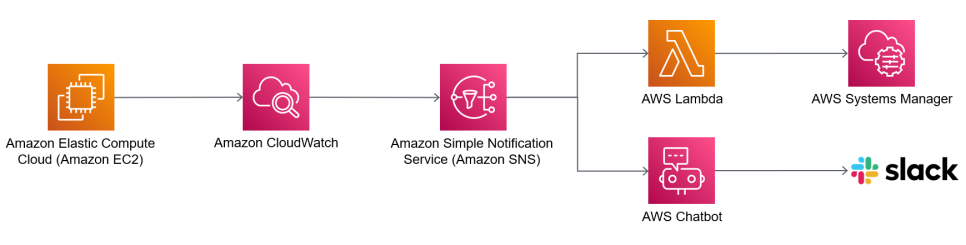

1. EC2 ì¸ìŠ¤í„´ìŠ¤ì—ì„œ ë™ì‘하는 프로세스가 다운ë˜ë©´ CloudWatch ì•ŒëŒì´ ë°œìƒí•©ë‹ˆë‹¤.
1. SNS를 통해 Lambda 함수를 호출하여 ìë™ìœ¼ë¡œ 프로세스를 ì¬ì‹œì‘합니다.
1. AWS Chatbotì— ì—°ë™ëœ Slack으로 ì•ŒëŒì„ 보냅니다.

---

##### "구성 서비스"

먼저 해당 êµ¬ì„±ì— ì´ìš©í•œ AWS ì„œë¹„ìŠ¤ì— ëŒ€í•´ ê°„ë‹¨íˆ ì„¤ëª…í•˜ê² ìŠµë‹ˆë‹¤.

**1. CloudWatch Agent**

CloudWatchì—서는 AWSì— ì‚¬ì „ì— ì •ì˜ëœ 메트릭과 사용ìê°€ 설정한 ë©”íŠ¸ë¦­ì„ ì‚¬ìš©í•  수 ìˆìŠµë‹ˆë‹¤.  
EC2 ì¸ìŠ¤í„´ìŠ¤ë¥¼ 기준으로 CPU, Network, Disk IO 등 ë¦¬ì†ŒìŠ¤ì— ëŒ€í•œ ëª¨ë‹ˆí„°ë§ ë©”íŠ¸ë¦­ì´ ì‚¬ì „ì— ì •ì˜ë˜ì–´ ìˆìŠµë‹ˆë‹¤. ê·¸ ë°–ì— í”„ë¡œì„¸ìŠ¤ë‚˜ RAM ê°™ì€ ì¶”ê°€ì ì¸ 시스템 단계 ë©”íŠ¸ë¦­ì€ EC2 ì¸ìŠ¤í„´ìŠ¤ ë‚´ì— ì¶”ê°€ì ìœ¼ë¡œ Agent를 구성하여 수집 ë° ëª¨ë‹ˆí„°ë§ì´ 가능합니다.

CloudWatch Agent는 Hypervisor ì˜ì—­ì—ì„œ 확ì¸í•  수 없는 ë©”íŠ¸ë¦­ì„ ìˆ˜ì§‘í•˜ë©° CloudWatch Logsì— ë¡œê·¸ë¥¼ 보내는 ì—­í• ì„ í•˜ë©° CloudWatch Agent를 EC2 ì¸ìŠ¤í„´ìŠ¤ë‚˜ Linux ì„œë²„ì— ì„¤ì¹˜í•˜ë©´ 다ìŒê³¼ ê°™ì€ ë©”íŠ¸ë¦­ì„ ìˆ˜ì§‘í•  수 ìˆìŠµë‹ˆë‹¤.
- CPU (active, guest, idle, system, user, steal)
- Disk metrics(free, used, total), Disk IO(writes, reads, bytes, iops)
- RAM (free, inactive, used, total, cached)
- Netstat (number of TCP and UDP connections, net packets, bytes)
- Swap Space (free, used, used %)

**2. Procstat Plugin**
- Procstat Pluginì€ CloudWatch Agent 구성 파ì¼ì˜ metrics_collected ì„¹ì…˜ì— procstat ì„¹ì…˜ì„ ì¶”ê°€í•˜ì—¬ 사용하며 개별 í”„ë¡œì„¸ìŠ¤ì˜ ë©”íŠ¸ë¦­ì„ ìˆ˜ì§‘í•©ë‹ˆë‹¤.
- Procstat Pluginì´ ìˆ˜ì§‘í•˜ëŠ” ë©”íŠ¸ë¦­ì€ ë‹¤ìŒ ë§í¬ì—ì„œ 확ì¸í•˜ì‹¤ 수 ìˆìŠµë‹ˆë‹¤.[[1]](https://docs.aws.amazon.com/ko_kr/AmazonCloudWatch/latest/monitoring/CloudWatch-Agent-procstat-process-metrics.html)


**3. CloudWatch ì•ŒëŒ**
- CloudWatch ì•ŒëŒì€ ë©”íŠ¸ë¦­ì— ëŒ€í•œ ì„계치와 ì¡°ê±´ì„ ì •ì˜í•˜ì—¬ ì•ŒëŒì„ 트리거합니다. CloudWatch ì•ŒëŒì€ SNS(Simple Notification Service)와 ì—°ë™í•˜ì—¬ ì‘ë™í•˜ë©° IT ì¸í”„ë¼ì˜ ì¥ì•  í˜¹ì€ íŠ¹ì´ì‚¬í•­ì„ ì•ŒëŒìœ¼ë¡œ ë°›ì„ ìˆ˜ ìˆìŠµë‹ˆë‹¤. 
- ë©”íŠ¸ë¦­ì˜ ìˆ˜ì¹˜ê°€ 등ë¡í•œ ì„ê³„ì¹˜ì— í¬í•¨ë˜ì§€ ì•Šì„ ê²½ìš° ì•ŒëŒì— ë”°ë¼ ìë™ìœ¼ë¡œ ë™ì‘하는 í›„ì† ì¡°ì¹˜ë¥¼ ì •ì˜í•  수 ìˆë‹¤ë©´ IT ì¸í”„ë¼ ê´€ë¦¬ì는 24/7 ì¸í”„ë¼ë¥¼ 모니터ë§í•´ì•¼ í•  필요가 없어지며 시간과 ë…¸ë ¥ì„ ì ˆì•½í•  수 ìˆê³  ì´ëŠ” ìì›ì˜ 효율ì ì¸ 활용과 ë”불어 ì„œë¹„ìŠ¤ì˜ í’ˆì§ˆ í–¥ìƒì—ë„ í° ë³´íƒ¬ì´ ë  ê²ƒì…니다.

**4. Amazon SNS**
- SNS(Simple Notification Service)는 AWSì˜ í‘¸ì‹œ 알림 서비스로 HTTP/S, Email, SMS, IT/Mobile Device 그리고 AWS ì¸í”„ë¼ë¥¼ 타겟으로 메시지를 전달할 수 ìˆìŠµë‹ˆë‹¤.

**5. SSM Agent**
- AWS SSM Agent(Systems Manager Agent)는 Systems Manager ìš”ì²­ì„ ì²˜ë¦¬í•˜ê³  ìš”ì²­ì— ì§€ì •ëœ ëŒ€ë¡œ ì‹œìŠ¤í…œì„ êµ¬ì„±í•©ë‹ˆë‹¤.
- SSM Agent는 최근 AWSì—ì„œ ì주 사용하고 ìˆëŠ” Amazon Linux, Amazon Linux 2, Amazon Linux 2 ECS 최ì í™” 기본 AMIs, SUSE Linux Enterprise Server(SLES) 12 ë° 15, Ubuntu Server 16.04, 18.04 ë° 20.04 AMIì— ê¸°ë³¸ì ìœ¼ë¡œ 설치ë˜ë©° ì´ì™¸ì˜ Linux AMIsì—ì„œ ìƒì„±ëœ EC2 ì¸ìŠ¤í„´ìŠ¤ì—서는 SSM Agent를 수ë™ìœ¼ë¡œ 설치 ë° êµ¬ì„±í•˜ì—¬ì•¼ 합니다.
- ë˜í•œ ì¸ìŠ¤í„´ìŠ¤ê°€ Systems Manager ì„œë¹„ìŠ¤ì˜ í•µì‹¬ ê¸°ëŠ¥ì„ ì‚¬ìš©í•˜ëŠ” ê²ƒì„ í—ˆìš©í•˜ë„ë¡ ì¸ìŠ¤í„´ìŠ¤ í”„ë¡œí•„ì— ì •ì±… AmazonSSMManagedInstanceCoreì— ëŒ€í•œ ê¶Œí•œì„ ì¶”ê°€í•´ì•¼ 합니다.[[2]](https://docs.aws.amazon.com/systems-manager/latest/userguide/setup-instance-profile.html#instance-profile-add-permissions)
   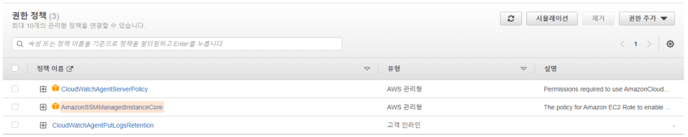

**6. SSM Run Command**
- Run Command는 AWS Systems Managerì˜ ê¸°ëŠ¥ìœ¼ë¡œ 해당 EC2 ì¸ìŠ¤í„´ìŠ¤ì— ì ‘ì†í•˜ì—¬ ì§ì ‘ 명령어를 ì…력하지 ì•Šê³  ì›ê²©ìœ¼ë¡œ 명령어를 실행하는 ê¸°ëŠ¥ì„ í•©ë‹ˆë‹¤. 
- ì¼ë°˜ì ì¸ 관리 테스í¬ë¥¼ ìë™í™”하고 대규모로 ì¼íšŒì„± 구성 ë³€ê²½ì„ ìˆ˜í–‰í•  수 ìˆì–´ 보통 ì›ê²©ìœ¼ë¡œ ì—…ë°ì´íŠ¸ ì‘ì—…ì´ë‚˜ ë‹¤ìˆ˜ì˜ ì¸ìŠ¤í„´ìŠ¤ì— í•˜ë‚˜ì˜ ëª…ë ¹ì–´ë¥¼ 실행하는 ê²½ìš°ì— ë§ì´ 사용ë©ë‹ˆë‹¤.

**7. AWS Lambda**
- Lambda는 ê°€ìƒì˜ 함수로 관리할 서버 ì—†ì´ ì½”ë“œë¥¼ 프로비저ë‹í•˜ë©´ 함수가 실행ë˜ëŠ” AWSì˜ ì„œë²„ë¦¬ìŠ¤ 서비스ì…니다. 
- 다양한 언어를 지ì›í•˜ë©° 여러 AWS 서비스와 통합ë˜ì–´ CloudWatchì™€ë„ ì‰½ê²Œ 모니터ë§ì„ 통합할 수 ìˆë‹¤ëŠ” ì¥ì ì´ ìˆìŠµë‹ˆë‹¤.

**8. AWS Chatbot**
- AWS Chatbotì´ë€ Slack ë° Amazon Chimeì„ ì±„íŒ… í´ë¼ì´ì–¸íŠ¸ë¡œ 지ì›í•˜ëŠ” 대화형 Agentë¡œ Amazon SNS 주제를 통해 여러 AWS 서비스와 통합ë©ë‹ˆë‹¤. AWS Chatbotì„ ì‚¬ìš©í•˜ë©´ AWS 환경ì—ì„œ 실행ë˜ëŠ” 애플리케ì´ì…˜ì— 대한 최신 ì´ë²¤íŠ¸ë¥¼ 놓치지 ì•Šê³  수신하고 ì´ì— 대ì‘하여 ì‹ ì†í•˜ê²Œ 조치 ë° í•´ê²°í•  수 ìˆìŠµë‹ˆë‹¤.

---

##### "구성 방법"

#### 1ï¸âƒ£ Amazon EC2 ì¸ìŠ¤í„´ìŠ¤ì— 통합 CloudWatch Agent와 SSM Agent를 설치합니다.

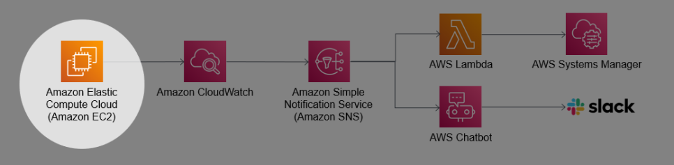

🔷 **IAM 역할**  

먼저 EC2 ì¸ìŠ¤í„´ìŠ¤ì—ì„œ CloudWatch Agent를 실행하기 위해서는 EC2 ì¸ìŠ¤í„´ìŠ¤ì˜ IAM ì—­í• ì— ì •ì±… CloudWatchAgentServerPolicyì— ëŒ€í•œ ê¶Œí•œì´ í•„ìš”í•©ë‹ˆë‹¤. 추가로 Agentê°€ CloudWatch Logsì— ë¡œê·¸ë¥¼ 전송하고 Agentê°€ ì´ëŸ¬í•œ 로그 ê·¸ë£¹ì— ëŒ€í•œ ë³´ì¡´ ì •ì±…ì„ ì„¤ì •í•  수 ìˆë„ë¡ í•˜ë ¤ë©´ IAM ì—­í• ì— logs:PutRetentionPolicy ê¶Œí•œì„ ë¶€ì—¬í•´ì•¼ 합니다.[[3]](https://docs.aws.amazon.com/AmazonCloudWatchLogs/latest/APIReference/API_PutRetentionPolicy.html)
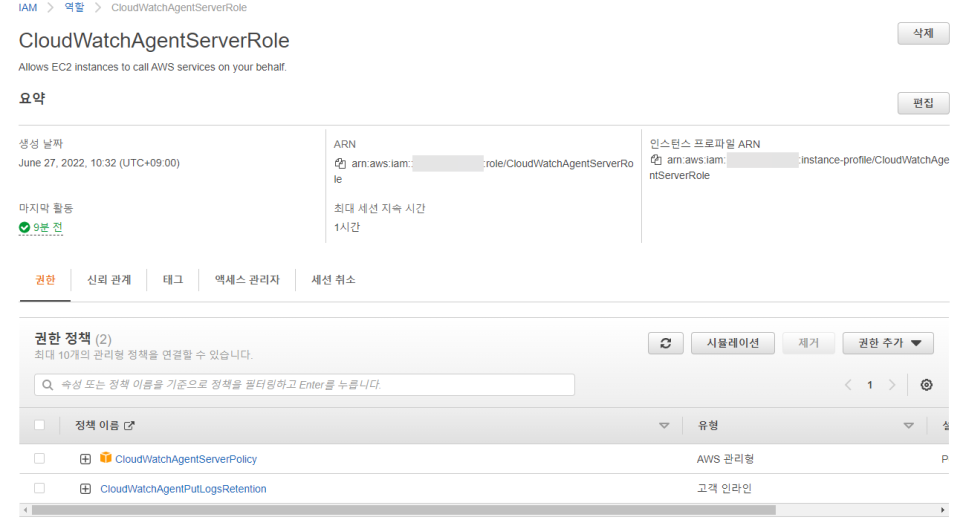

위ì—ì„œ ìƒì„±í•œ ì—­í• ì„ EC2 ì¸ìŠ¤í„´ìŠ¤ì— 연결합니다.
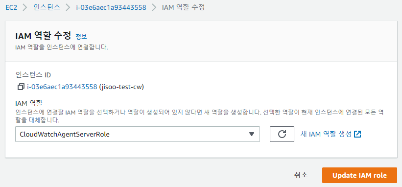

🔷 **CloudWatch Agent**

1. CloudWatch Agent 다운로드  
- CloudWatch Agent는 Amazon Linux 2ì—ì„œ 패키지로 사용할 수 ìˆìœ¼ë©° ë‹¤ìŒ ëª…ë ¹ì–´ë¥¼ ì…력하여 설치합니다.
```linux
sudo yum install amazon-cloudwatch-agent
```
2. CloudWatch Agent 구성 íŒŒì¼ ìƒì„± ë° ìˆ˜ì •  
- CloudWatch Agent를 다운로드한 후 서버ì—ì„œ Agent를 ì‹œì‘하기 ì „ì— êµ¬ì„± 파ì¼ì„ ìƒì„±í•´ì•¼ 합니다.
- Agent 구성 파ì¼ì€ 사용ì 지정 지표를 í¬í•¨í•˜ì—¬ Agentê°€ 수집해야 하는 지표 ë° ë¡œê·¸ê°€ 지정ë˜ì–´ ìˆëŠ” JSON 파ì¼ë¡œ 마법사를 사용하거나 Scratchì—ì„œ ì§ì ‘ ìƒì„±í•˜ì—¬ 구성 파ì¼ì„ ìƒì„±í•  수 ìˆìŠµë‹ˆë‹¤.
- 마법사를 사용해서 Agent 구성 파ì¼ì„ ìƒì„± ë° ìˆ˜ì •í•˜ì˜€ìœ¼ë©° ë°©ë²•ì€ ë‹¤ìŒê³¼ 같습니다.[[4]](https://docs.aws.amazon.com/ko_kr/AmazonCloudWatch/latest/monitoring/create-cloudwatch-agent-configuration-file-wizard.html)
- ë‹¤ìŒ ëª…ë ¹ì–´ë¥¼ ì…력하여 CloudWatch Agent 구성 마법사를 ì‹œì‘합니다.

```linux
sudo /opt/aws/amazon-cloudwatch-agent/bin/amazon-cloudwatch-agent-config-wizard
```

- ì§ˆë¬¸ì— ë‹µí•˜ë©° ì„œë²„ì˜ êµ¬ì„± 파ì¼ì„ 사용ì ì •ì˜í•©ë‹ˆë‹¤.

#### 2ï¸âƒ£ 통합 CloudWatch Agentì—ì„œ Procstat Pluginì„  사용하여 프로세스 지표를 수집합니다.  
🔷 **CloudWatch Agent 구성 파ì¼**

1) CloudWatch Agent 구성 íŒŒì¼ ìˆ˜ì •
- ë‹¤ìŒ ëª…ë ¹ì–´ë¥¼ ì…력하여 구성 파ì¼ì„ 엽니다.

```linux
vim /opt/aws/amazon-cloudwatch-agent/bin/config.json
```
- Procstat Pluginì„ ì‚¬ìš©í•˜ê¸° 위하여 CloudWatch Agent 구성 파ì¼ì˜ metrics_collected ì„¹ì…˜ì— procstat ì„¹ì…˜ì„ ì¶”ê°€í•©ë‹ˆë‹¤.[[5]](https://docs.aws.amazon.com/ko_kr/AmazonCloudWatch/latest/monitoring/CloudWatch-Agent-procstat-process-metrics.html)
- exe는 ì •ê·œì‹ ì¼ì¹˜ ê·œì¹™ì„ ì‚¬ìš©í•˜ì—¬ 프로세스 ì´ë¦„ì´ ì§€ì •í•œ 문ìì—´ê³¼ ì¼ì¹˜í•˜ëŠ” 프로세스를 ì„ íƒí•©ë‹ˆë‹¤. measurement는 수집할 ë©”íŠ¸ë¦­ì˜ ë°°ì—´ì„ ì§€ì •í•˜ë©° ì—¬ê¸°ì— í”„ë¡œì„¸ìŠ¤ì˜ ì‹¤í–‰ 수를 ì˜ë¯¸í•˜ëŠ” pid_count를 추가합니다.
- ë‹¤ìŒ ì˜ˆì œì˜ procstat ì„¹ì…˜ì€ ë¬¸ìì—´ httpd와 ì´ë¦„ì´ ì¼ì¹˜í•˜ëŠ” 모든 프로세스를 모니터ë§í•˜ë©° ê° í”„ë¡œì„¸ìŠ¤ì—ì„œ ë™ì¼í•œ 지표가 수집ë©ë‹ˆë‹¤.

```linux
"procstat": [
                  {
                                "exe": "httpd",
                                "measurement": "pid_count"
                  }
                ]
```

- 프로세스를 다운로드 받고 실행합니다.

```linux
sudo yum -y install httpd
sudo systemctl start httpd
```

- CloudWatch Agent 설정 ê°’ì„ ì €ì¥í•˜ê³  ì¬ì‹¤í–‰í•©ë‹ˆë‹¤. CloudWatch Agent 구성 파ì¼ì„ 변경할 때마다 Agent를 다시 ì‹œì‘하여 변경 ì‚¬í•­ì´ ì ìš©ë˜ë„ë¡ í•´ì•¼ 합니다.

```linux
sudo /opt/aws/amazon-cloudwatch-agent/bin/amazon-cloudwatch-agent-ctl -a fetch-config -m ec2 -c file:/opt/aws/amazon-cloudwatch-agent/bin/config.json -s
```

#### 3ï¸âƒ£ CloudWatch ì•ŒëŒì„ ìƒì„±í•˜ì—¬ 특정 ì„ê³„ì¹˜ì— ë„달한 경우 ì•ŒëŒì´ 트리거ë˜ë©° Amazon SNS를 ì—°ë™í•˜ì—¬ ì•Œë¦¼ì„ ë³´ëƒ…ë‹ˆë‹¤.

🔷 **Amazon SNS**
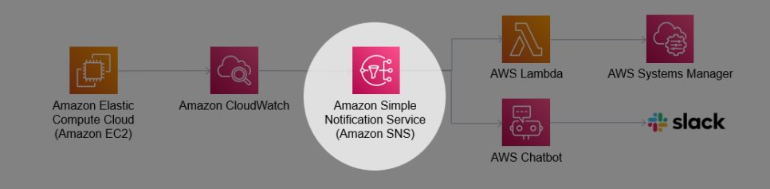

1) Amazon SNS 주제 ìƒì„±
- CloudWatch ì•ŒëŒ ë°œìƒ ì‹œ ìˆ˜í–‰ë  Amazon SNS 주제를 ìƒì„±í•©ë‹ˆë‹¤.
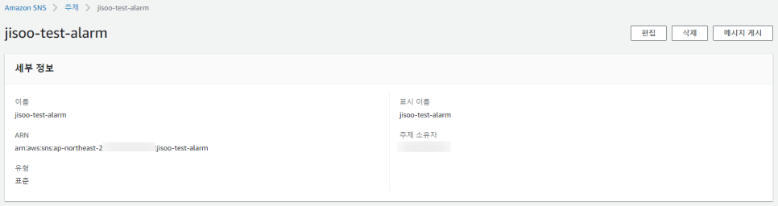
- CloudWatch ì•ŒëŒì´ í•´ì œë˜ì–´ ìƒíƒœê°€ ì •ìƒìœ¼ë¡œ ë³€ê²½ëœ ê²½ìš° ìˆ˜í–‰ë  Amazon SNS 주제를 ìƒì„±í•©ë‹ˆë‹¤.
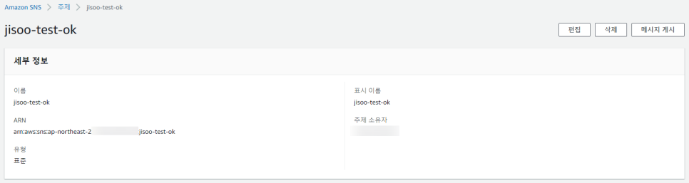

🔷 **AWS Lambda**
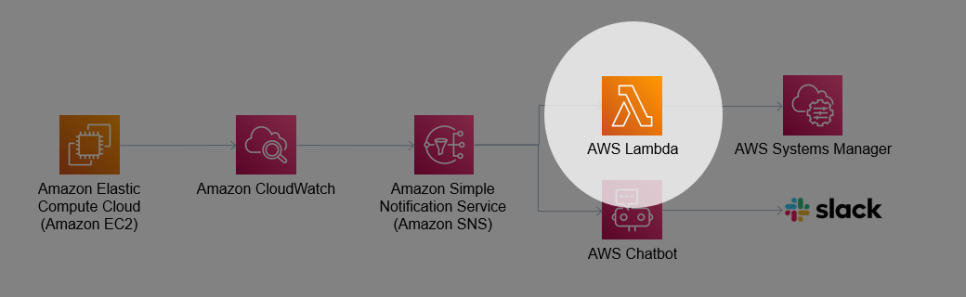

1) Lambda 함수 ìƒì„±
- CloudWatch ì•ŒëŒ ë°œìƒ ì‹œ ë™ì‘하는 Lambda 함수를 ìƒì„±í•©ë‹ˆë‹¤.
- Lambda 함수 ìƒì„± ì‹œ í•¨ìˆ˜ì— ëŒ€í•œ ê¶Œí•œì„ ì •ì˜í•˜ëŠ” IAM ì—­í• ì´ í•„ìš”í•©ë‹ˆë‹¤. 기본ì ìœ¼ë¡œ Lambda는 Amazon CloudWatch Logsì— ë¡œê·¸ë¥¼ 업로드할 수 ìˆëŠ” ê¶Œí•œì„ ê°€ì§„ 실행 ì—­í• ì„ ìƒì„±í•˜ë©° ì´ ê¸°ë³¸ ì—­í• ì€ ë‚˜ì¤‘ì— íŠ¸ë¦¬ê±°ë¥¼ 추가할 ë•Œ 사용ì ì§€ì •ì´ ê°€ëŠ¥í•©ë‹ˆë‹¤. ì •ì±…ì€ ë‹¤ìŒê³¼ 같습니다.[[6]](https://aws.amazon.com/ko/premiumsupport/knowledge-center/lambda-cloudwatch-log-streams-error/)

```json
{
    "Version": "2012-10-17",
    "Statement": [
        {
            "Effect": "Allow",
            "Action": "logs:CreateLogGroup",
            "Resource": "arn:aws:logs:ap-northeast-2:[Accound ID]:*"
        },
        {
            "Effect": "Allow",
            "Action": [
                "logs:CreateLogStream",
                "logs:PutLogEvents"
            ],
            "Resource": [
                "arn:aws:logs:ap-northeast-2:[Account ID]:log-group:/aws/lambda/jisoo-test-lambda:*"
            ]
        }
    ]
}
```
2) 트리거 추가
- Lambda í•¨ìˆ˜ì— Amazon SNS ì£¼ì œë¡œì˜ íŠ¸ë¦¬ê±°ë¥¼ 추가합니다.
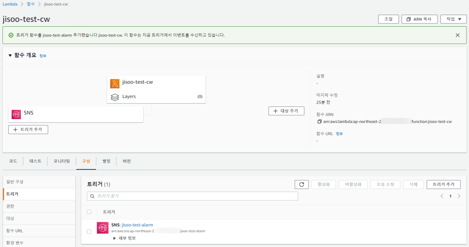

🔷 **CloudWatch ì•ŒëŒ**
1) CloudWatch ì•ŒëŒ ìƒì„±
- 특정 ì¸ìŠ¤í„´ìŠ¤ì— 대한 CloudWatch ë©”íŠ¸ë¦­ì„ ëª¨ë‹ˆí„°ë§í•˜ëŠ” CloudWatch ì•ŒëŒì„ ìƒì„±í•©ë‹ˆë‹¤.
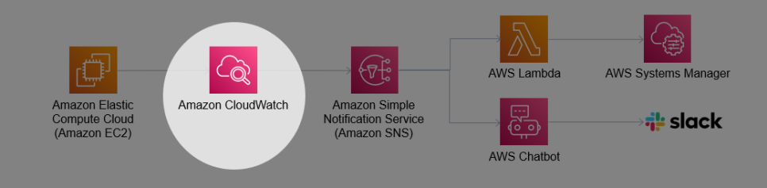
- 1분 ë™ì•ˆ 특정 ì¸ìŠ¤í„´ìŠ¤ì˜ í”„ë¡œì„¸ìŠ¤ì˜ ì‹¤í–‰ ìˆ˜ì˜ í•©ê³„ê°€ 0보다 ì‘거나 ê°™ì„ ë•Œ ìë™ìœ¼ë¡œ ì•ŒëŒì´ ë°œìƒí•˜ë„ë¡ ì§€í‘œ ë° ì¡°ê±´ì„ ì§€ì •í•©ë‹ˆë‹¤.
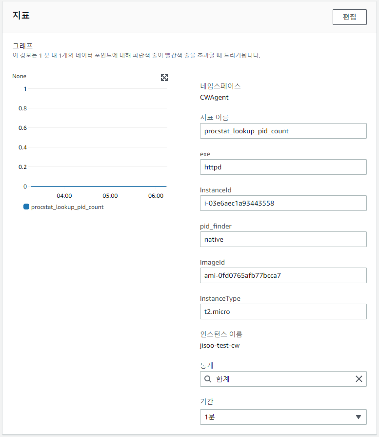
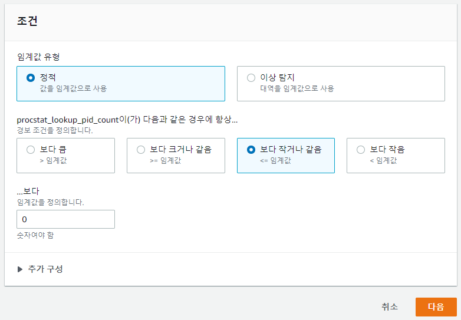
- CloudWatch ì•ŒëŒì´ ë°œìƒí•œ 경우 ë° ìƒíƒœê°€ ì •ìƒìœ¼ë¡œ ë³€ê²½ëœ ê²½ìš° 위ì—ì„œ ìƒì„±í•œ SNS 주제로 해당 ì•Œë¦¼ì„ ì „ì†¡í•˜ë„ë¡ ì—°ê²°í•©ë‹ˆë‹¤.
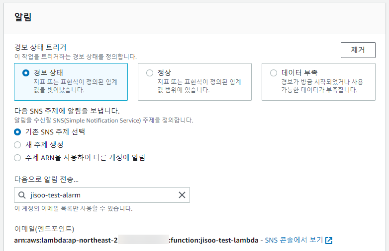
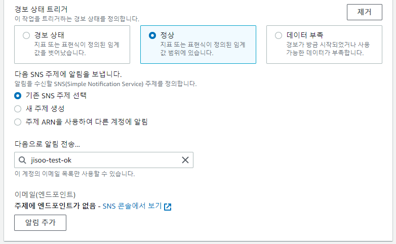
- 다ìŒê³¼ ê°™ì´ CloudWatch ì•ŒëŒì´ ìƒì„±ë˜ì—ˆìŠµë‹ˆë‹¤.
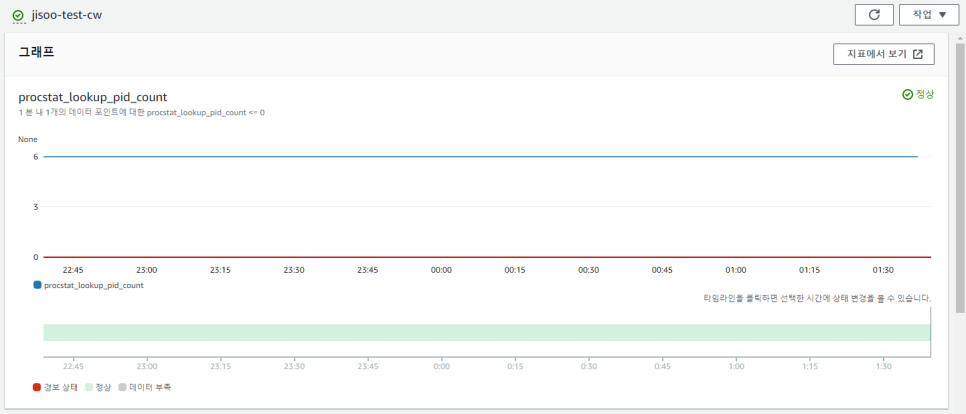
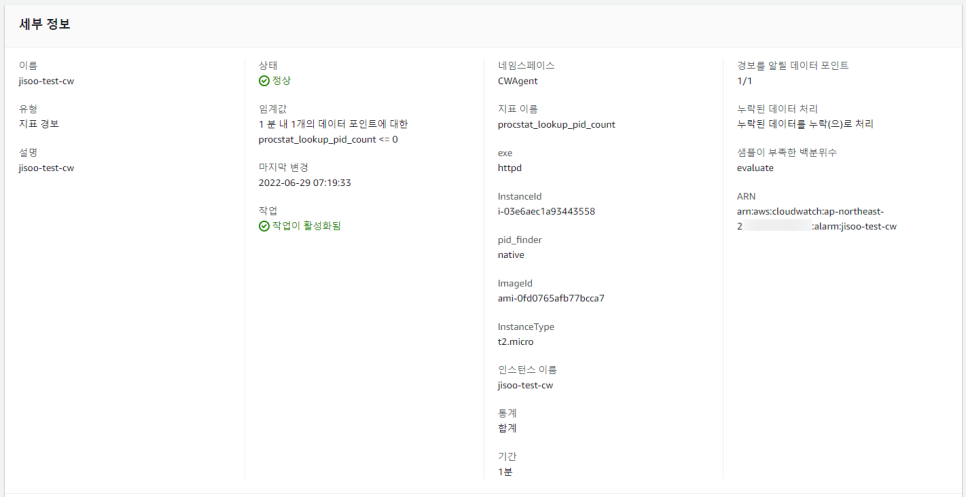

#### 4ï¸âƒ£ SNS 서비스를 Lambda 함수로 연결하여 EC2 ì¸ìŠ¤í„´ìŠ¤ ë‚´ì—ì„œ SSM Agent를 통해 Run Command를 수행하ë„ë¡ í•©ë‹ˆë‹¤.
🔷 **AWS Lambda**
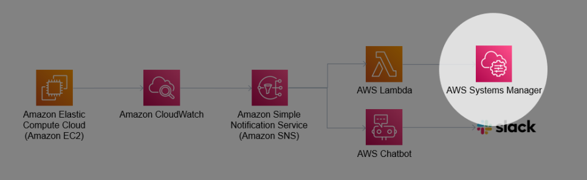
1) Lambda í•¨ìˆ˜ì˜ ì½”ë“œë¥¼ ì‘성하기 ì „ì— AWS 콘솔 > CloudWatch > Log groups > /aws/lambda/jisoo-test-cw ì—ì„œ 위ì—ì„œ ìƒì„±í•œ ì´ë²¤íŠ¸ë¥¼ 출력해보았습니다.
- 로그 ì´ë²¤íŠ¸ì˜ 결과는 다ìŒê³¼ 같습니다.
```yaml
{'Records': [{'EventSource': 'aws:sns', 'EventVersion': '1.0', 'EventSubscriptionArn': 'arn:aws:sns:ap-northeast-2:[Account ID]:jisoo-test:1081a4ec-a46b-4aff-8de7-51a915148168', 'Sns': {'Type': 'Notification', 'MessageId': '863a960f-5e65-5b50-a9c9-cd3b3c2a7d5c', 'TopicArn': 'arn:aws:sns:ap-northeast-2:[Account ID]:jisoo-test', 'Subject': 'ALARM: "jisoo-test-cw" in Asia Pacific (Seoul)', 'Message': '{"AlarmName":"jisoo-test-cw","AlarmDescription":"jisoo-test-cw","AWSAccountId":"[Account ID]","AlarmConfigurationUpdatedTimestamp":"2022-06-28T01:56:39.773+0000","NewStateValue":"ALARM","NewStateReason":"Threshold Crossed: 1 out of the last 1 datapoints [0.0 (28/06/22 01:55:00)] was less than or equal to the threshold (0.0) (minimum 1 datapoint for OK -> ALARM transition).","StateChangeTime":"2022-06-28T01:57:35.603+0000","Region":"Asia Pacific (Seoul)","AlarmArn":"arn:aws:cloudwatch:ap-northeast-2:[Account ID]:alarm:jisoo-test-cw","OldStateValue":"OK","OKActions":[],"AlarmActions":["arn:aws:sns:ap-northeast-2:[Account ID]:jisoo-test"],"InsufficientDataActions":[],"Trigger":{"MetricName":"procstat_lookup_pid_count","Namespace":"CWAgent","StatisticType":"Statistic","Statistic":"SUM","Unit":null,"Dimensions":[{"value":"httpd","name":"exe"},{"value":"i-03e6aec1a93443558","name":"InstanceId"},{"value":"ami-0fd0765afb77bcca7","name":"ImageId"},{"value":"native","name":"pid_finder"},{"value":"t2.micro","name":"InstanceType"}],"Period":60,"EvaluationPeriods":1,"DatapointsToAlarm":1,"ComparisonOperator":"LessThanOrEqualToThreshold","Threshold":0.0,"TreatMissingData":"missing","EvaluateLowSampleCountPercentile":""}}', 'Timestamp': '2022-06-28T01:57:35.666Z', 'SignatureVersion': '1', 'Signature': 'NQlL27p5fjsZkPrcj9GIyvFAYoT6oAr7Yk2b2rOBAN88kcSj0XfyjhmUNNaYAWT+Mod8KQQnIcfwicHZ3pWyztQx7B3CEnKv3t5IR8SntcvftQ8i09ugAUVb/a/3k/gjmneqezSFqxL5JWJDP4uUKCalP4nGT2ZQwP3G6V9U/XWQSkYjPCEOq+q5mKRR3Wp3vjGeOw23WUHVvaHt8y7uSKcLxvYTUmzmvNny7sujBWp1dGkpEJO50vx2IbDtAMMBdB8zUkKkzWcxwTce+UzsBcTgP/1sZTiChFDl2JxEiOJUesWFURrzl861lI5Gwb3g72m5YL1V+gN1VYdehUSdjQ==', 'SigningCertUrl': 'https://sns.ap-northeast-2.amazonaws.com/SimpleNotificationService-7ff5318490ec183fbaddaa2a969abfda.pem', 'UnsubscribeUrl': 'https://sns.ap-northeast-2.amazonaws.com/?Action=Unsubscribe&SubscriptionArn=arn:aws:sns:ap-northeast-2:[Account ID]:jisoo-test:1081a4ec-a46b-4aff-8de7-51a915148168', 'MessageAttributes': {}}}]}
```
- ê°€ë…ì„±ì„ ë†’ì´ê¸° 위해 소스 코드를 ìë™ìœ¼ë¡œ 정렬해주는 Tabifierë¼ëŠ” 사ì´íŠ¸ë¥¼ ì´ìš©í•´ 코드를 들여쓰기합니다.[[7]](https://tools.arantius.com/tabifier)
```yaml
{
	'Records': [
		{
			'EventSource': 'aws:sns',
			'EventVersion': '1.0',
			'EventSubscriptionArn': 'arn:aws:sns:ap-northeast-2:[Account ID]:jisoo-test:1081a4ec-a46b-4aff-8de7-51a915148168',
			'Sns': {
				'Type': 'Notification',
				'MessageId': '863a960f-5e65-5b50-a9c9-cd3b3c2a7d5c',
				'TopicArn': 'arn:aws:sns:ap-northeast-2:[Account ID]:jisoo-test',
				'Subject': 'ALARM: "jisoo-test-cw" in Asia Pacific (Seoul)',
				'Message': '{"AlarmName":"jisoo-test-cw","AlarmDescription":"jisoo-test-cw","AWSAccountId":"[Account ID]","AlarmConfigurationUpdatedTimestamp":"2022-06-28T01:56:39.773+0000","NewStateValue":"ALARM","NewStateReason":"Threshold Crossed: 1 out of the last 1 datapoints [0.0 (28/06/22 01:55:00)] was less than or equal to the threshold (0.0) (minimum 1 datapoint for OK -> ALARM transition).","StateChangeTime":"2022-06-28T01:57:35.603+0000","Region":"Asia Pacific (Seoul)","AlarmArn":"arn:aws:cloudwatch:ap-northeast-2:[Account ID]:alarm:jisoo-test-cw","OldStateValue":"OK","OKActions":[],"AlarmActions":["arn:aws:sns:ap-northeast-2:[Account ID]:jisoo-test"],"InsufficientDataActions":[],"Trigger":{"MetricName":"procstat_lookup_pid_count","Namespace":"CWAgent","StatisticType":"Statistic","Statistic":"SUM","Unit":null,"Dimensions":[{"value":"httpd","name":"exe"},{"value":"i-03e6aec1a93443558","name":"InstanceId"},{"value":"ami-0fd0765afb77bcca7","name":"ImageId"},{"value":"native","name":"pid_finder"},{"value":"t2.micro","name":"InstanceType"}],"Period":60,"EvaluationPeriods":1,"DatapointsToAlarm":1,"ComparisonOperator":"LessThanOrEqualToThreshold","Threshold":0.0,"TreatMissingData":"missing","EvaluateLowSampleCountPercentile":""}}',
				'Timestamp': '2022-06-28T01:57:35.666Z',
				'SignatureVersion': '1',
				'Signature': 'NQlL27p5fjsZkPrcj9GIyvFAYoT6oAr7Yk2b2rOBAN88kcSj0XfyjhmUNNaYAWT+Mod8KQQnIcfwicHZ3pWyztQx7B3CEnKv3t5IR8SntcvftQ8i09ugAUVb/a/3k/gjmneqezSFqxL5JWJDP4uUKCalP4nGT2ZQwP3G6V9U/XWQSkYjPCEOq+q5mKRR3Wp3vjGeOw23WUHVvaHt8y7uSKcLxvYTUmzmvNny7sujBWp1dGkpEJO50vx2IbDtAMMBdB8zUkKkzWcxwTce+UzsBcTgP/1sZTiChFDl2JxEiOJUesWFURrzl861lI5Gwb3g72m5YL1V+gN1VYdehUSdjQ==',
				'SigningCertUrl': 'https://sns.ap-northeast-2.amazonaws.com/SimpleNotificationService-7ff5318490ec183fbaddaa2a969abfda.pem',
				'UnsubscribeUrl': 'https://sns.ap-northeast-2.amazonaws.com/?Action=Unsubscribe&SubscriptionArn=arn:aws:sns:ap-northeast-2:[Account ID]:jisoo-test:1081a4ec-a46b-4aff-8de7-51a915148168',
				'MessageAttributes': {}
			}
		}
	]
}
```

2. 위 ë‚´ìš©ì„ ë°”íƒ•ìœ¼ë¡œ ì‘성한 Lambda í•¨ìˆ˜ì˜ ì½”ë“œëŠ” 다ìŒê³¼ 같습니다.[[8]](https://boto3.amazonaws.com/v1/documentation/api/latest/reference/services/ssm.html)
- 'Sns'ì„¹ì…˜ì˜ 'Message'ì— í•´ë‹¹í•˜ëŠ” ë‚´ìš©ì´ ë¬¸ìì—´ì´ê¸° ë•Œë¬¸ì— json ë¼ì´ë¸ŒëŸ¬ë¦¬ì˜ loads를 ì´ìš©í•˜ì—¬ Stringì„ Dictionaryë¡œ 바꿔ì¤ë‹ˆë‹¤. 
💡 `load 함수와 loads í•¨ìˆ˜ì˜ ì°¨ì´: load 함수는 json 파ì¼ì„ ì½ì–´ë“¤ì´ì§€ë§Œ, loads 함수는 íŒŒì¼ ëŒ€ì‹  문ìì—´ì„ ì½ì–´ë“¤ì…니다.`

```python
import json
import boto3

def lambda_handler(event, context):
    # TODO implement
    
    message = event['Records'][0]['Sns']['Message']
    message = json.loads(message)
    
    for dimension in message['Trigger']['Dimensions']:
        if dimension['name'] == 'InstanceId':
            instanceid = dimension['value']
        elif dimension['name'] == 'exe':
            servicename = dimension['value']
    
    print("instance id: " + instanceid)
    print("service name: " + servicename)
    
    command = "sudo systemctl restart " + servicename
    ssm_client = boto3.client('ssm') // ssm í´ë¼ì´ì–¸íŠ¸ 구성
    response = ssm_client.send_command( // boto3ì˜ SSM send_command를 사용하여 EC2 ì¸ìŠ¤í„´ìŠ¤ì—ì„œ ì§ì ‘ 명령 실행 가능
        InstanceIds=[instanceid],
        DocumentName="AWS-RunShellScript",
        Parameters={
            'commands': [command]
            },
        )
```
- "Dimension"ì€ ë°ì´í„°ë¥¼ 분리하는 단위ì…니다. ë˜í•œ AWS 계정 í•˜ë‚˜ì— EC2 ì¸ìŠ¤í„´ìŠ¤ 한대만 ì¡´ì¬í•˜ëŠ” ê²ƒì´ ì•„ë‹ˆë¯€ë¡œ, CPU 사용률 ë°ì´í„° ë˜í•œ ì¸ìŠ¤í„´ìŠ¤ 단위로 분리하여 확ì¸í•  수 ìˆì–´ì•¼ 합니다. "InstanceID"를 기준으로 EC2 ì¸ìŠ¤í„´ìŠ¤ ê°ê°ì˜ 메트릭 ê°’ì„ í™•ì¸í•  수 ìˆìŠµë‹ˆë‹¤.

#### 5ï¸âƒ£ Amazon SNS를 AWS Chatbotê³¼ 연결하고 Slackê³¼ ì—°ë™í•˜ì—¬ 해당 ì•Œë¦¼ì— ëŒ€í•œ 메시지를 수신하ë„ë¡ í•©ë‹ˆë‹¤.
🔷**AWS Chatbot**
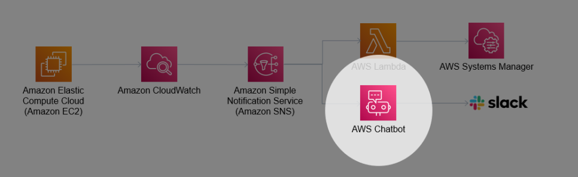
1) AWS Chatbot ìƒì„±
- AWS Chatbotì— Slack 유형으로 새 í´ë¼ì´ì–¸íŠ¸ë¥¼ 구성하고 Slack URLì„ ì…력합니다.
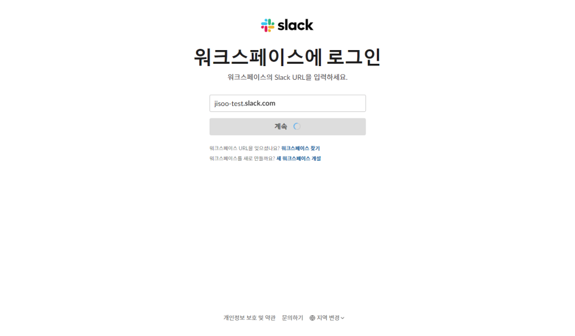
- AWS Chatbot í´ë¼ì´ì–¸íŠ¸ê°€ 구성ë˜ì—ˆìŠµë‹ˆë‹¤.
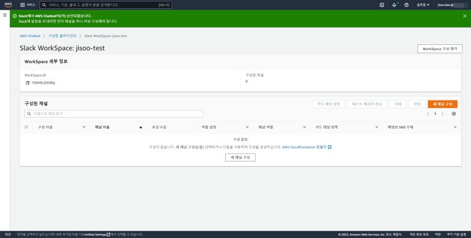
2) ì±„ë„ ê°€ë“œë ˆì¼ ì •ì±… ìƒì„±
- Slack ì±„ë„ êµ¬ì„±ì„ ìœ„í•´ ì±„ë„ ê°€ë“œë ˆì¼ ì •ì±… ì„¤ì •ì´ í•„ìš”í•©ë‹ˆë‹¤. Chatbotì— ëŒ€í•œ 모든 액세스(ì½ê¸°, 쓰기)ì„ ê°€ì§€ëŠ” ì •ì±…ì„ ìƒì„±í•˜ì—¬ 연결합니다.
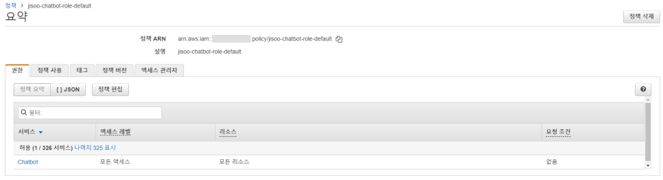
3) Slack ì±„ë„ êµ¬ì„±
- 다ìŒê³¼ ê°™ì´ Slack ì±„ë„ êµ¬ì„±ì„ ì§„í–‰í•©ë‹ˆë‹¤.
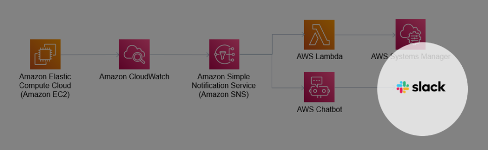
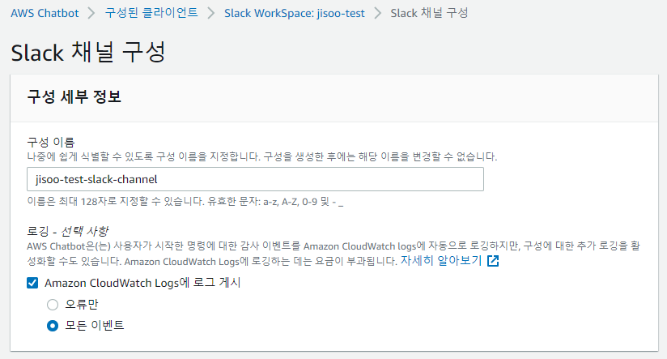
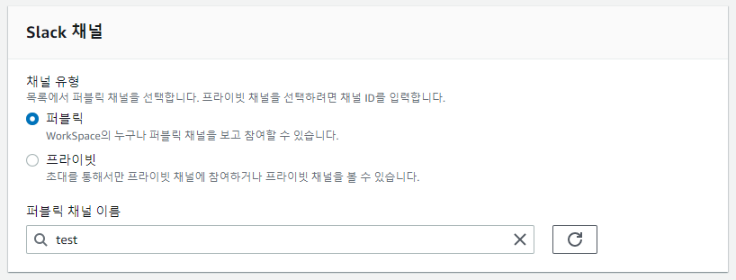
- ì±„ë„ IAM ì—­í• ì— ìœ„ì—ì„œ ìƒì„±í•œ ì—­í• ì„ ë“±ë¡í•˜ê³  ì±„ë„ ê°€ë“œ ë ˆì¼ ì •ì±…ì— ìœ„ì—ì„œ ìƒì„±í•œ ì •ì±…ì„ ë“±ë¡í•©ë‹ˆë‹¤.
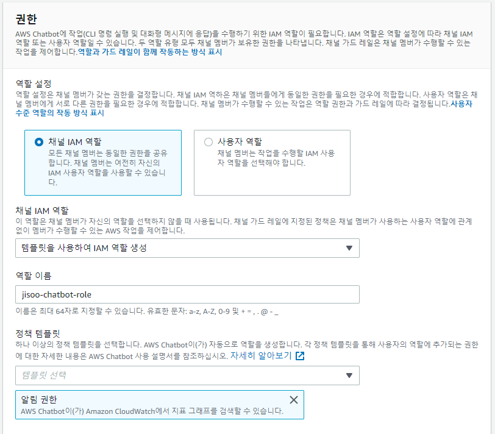
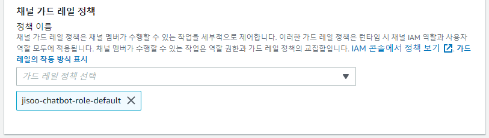
- 해당 Slack 채ë„ì— ì•Œë¦¼ì„ ì „ì†¡í•˜ë„ë¡ ì•ì—ì„œ ìƒì„±í•œ SNS 주제를 ëª¨ë‘ ì¶”ê°€í•©ë‹ˆë‹¤.
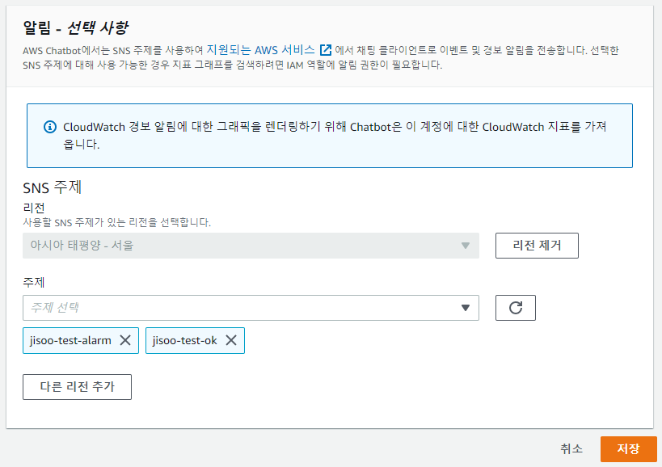
---

##### "테스트 결과"
테스트 결과는 다ìŒê³¼ 같습니다.
- 특정 ì¸ìŠ¤í„´ìŠ¤ì˜ 프로세스가 ëª¨ë‘ ë‹¤ìš´ë˜ì–´ 1분 ë™ì•ˆ í”„ë¡œì„¸ìŠ¤ì˜ ì‹¤í–‰ ìˆ˜ì˜ í•©ê³„ê°€ 0ì¸ ê²½ìš° 다ìŒê³¼ ê°™ì´ CloudWatch ì•ŒëŒì´ ë°œìƒí•©ë‹ˆë‹¤.
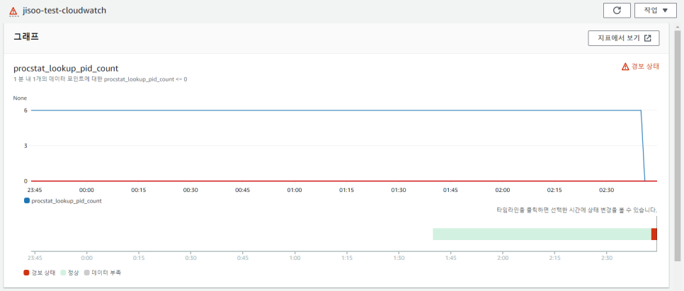

- ë˜í•œ SNSì— ë“±ë¡í•œ Slack 채ë„ë¡œ ì•ŒëŒì— 대한 메시지가 전송ë˜ë©° CloudWatch ì•ŒëŒì´ í•´ì œë˜ì–´ ìƒíƒœê°€ ì •ìƒìœ¼ë¡œ ë³€ê²½ëœ ê²½ìš°ì—ë„ ë‹¤ìŒê³¼ ê°™ì´ ë©”ì‹œì§€ê°€ 전송ë©ë‹ˆë‹¤.
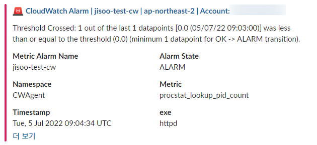
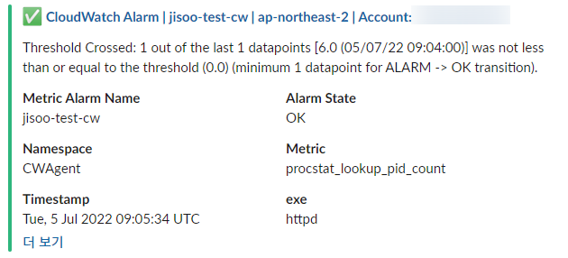

- Slack으로 ì „ì†¡ëœ ë©”ì‹œì§€ëŠ” 다양한 ëª¨ë°”ì¼ ê¸°ê¸°ì—ì„œ 확ì¸í•  수 ìˆìŠµë‹ˆë‹¤.
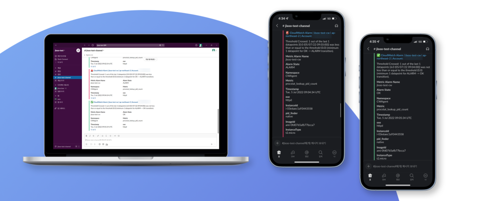
---
##### "마치며"

지금까지 ì‘ì—…í•œ ë‚´ìš©ì„ ì •ë¦¬í•´ 봅시다!
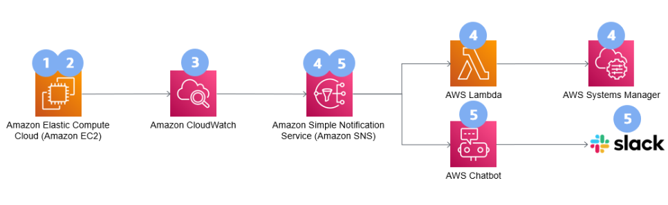

1. Amazon EC2 ì¸ìŠ¤í„´ìŠ¤ì— CloudWatch Agent와 SSM Agent를 설치합니다.
1. 통합 CloudWatch Agentì—ì„œ Procstat Pluginì„  사용하여 프로세스 지표를 수집합니다.
1. CloudWatch ì•ŒëŒì„ ìƒì„±í•˜ì—¬ 특정 ì„ê³„ì¹˜ì— ë„달한 경우 ì•ŒëŒì´ 트리거ë˜ë©° Amazon SNS를 ì—°ë™í•˜ì—¬ ì•Œë¦¼ì„ ë³´ëƒ…ë‹ˆë‹¤.
1. Amazon SNS를 AWS Lambdaë¡œ 연결하여 EC2 ì¸ìŠ¤í„´ìŠ¤ ë‚´ì—ì„œ SSM Agent를 통해 Run Command를 수행하ë„ë¡ í•©ë‹ˆë‹¤.
1. Amazon SNS를 AWS Chatbotê³¼ 연결하고 Slackê³¼ ì—°ë™í•˜ì—¬ 해당 ì•Œë¦¼ì— ëŒ€í•œ 메시지를 수신하ë„ë¡ í•©ë‹ˆë‹¤.

ì½ì–´ì£¼ì…”ì„œ ê°ì‚¬í•©ë‹ˆë‹¤.


---

🔗 참고 ë§í¬:  
[1] procstat 플러그ì¸ì„ 사용하여 프로세스 지표 수집 - [https://docs.aws.amazon.com/ko_kr/AmazonCloudWatch/latest/monitoring/CloudWatch-Agent-procstat-process-metrics.html](https://docs.aws.amazon.com/ko_kr/AmazonCloudWatch/latest/monitoring/CloudWatch-Agent-procstat-process-metrics.html)  
[2] Systems Manager ì¸ìŠ¤í„´ìŠ¤ì— í”„ë¡œíŒŒì¼ ê¶Œí•œ 추가 - [https://docs.aws.amazon.com/systems-manager/latest/userguide/setup-instance-profile.html#instance-profile-add-permissions](https://docs.aws.amazon.com/systems-manager/latest/userguide/setup-instance-profile.html#instance-profile-add-permissions)  
[3] CloudWatch Agent와 함께 사용하기 위한 IAM ì—­í•  ë° ì‚¬ìš©ì ìƒì„± - [https://docs.aws.amazon.com/ko_kr/AmazonCloudWatch/latest/monitoring/create-iam-roles-for-cloudwatch-agent-commandline.html](https://docs.aws.amazon.com/ko_kr/AmazonCloudWatch/latest/monitoring/create-iam-roles-for-cloudwatch-agent-commandline.html)  
[4] 마법사로 CloudWatch Agent 구성 íŒŒì¼ ìƒì„± - [https://docs.aws.amazon.com/ko_kr/AmazonCloudWatch/latest/monitoring/create-cloudwatch-agent-configuration-file-wizard.html](https://docs.aws.amazon.com/ko_kr/AmazonCloudWatch/latest/monitoring/create-cloudwatch-agent-configuration-file-wizard.html)  
[5] procstat 플러그 ì¸ì„ 사용하여 프로세스 지표 수집 - [https://docs.aws.amazon.com/ko_kr/AmazonCloudWatch/latest/monitoring/CloudWatch-Agent-procstat-process-metrics.html](https://docs.aws.amazon.com/ko_kr/AmazonCloudWatch/latest/monitoring/CloudWatch-Agent-procstat-process-metrics.html)  
[6] CloudWatch 콘솔ì—ì„œ Lambda 함수 ë¡œê·¸ì— ëŒ€í•œ "로그 ê·¸ë£¹ì´ ì—†ìŒ(Log group does not exist)" 오류를 해결하려면 어떻게 해야 합니까? - [https://aws.amazon.com/ko/premiumsupport/knowledge-center/lambda-cloudwatch-log-streams-error/](https://aws.amazon.com/ko/premiumsupport/knowledge-center/lambda-cloudwatch-log-streams-error/)  
[7] Tabifier - [https://tools.arantius.com/tabifier](https://tools.arantius.com/tabifier)  
[8] Boto3 Docs - [https://boto3.amazonaws.com/v1/documentation/api/latest/reference/services/ssm.html](https://boto3.amazonaws.com/v1/documentation/api/latest/reference/services/ssm.html)

📖 참고 ë„ì„œ:   
예제를 통해 쉽게 ë”°ë¼í•˜ëŠ” 아마존 웹 서비스(최준승, ì´í˜„진 지ìŒ)