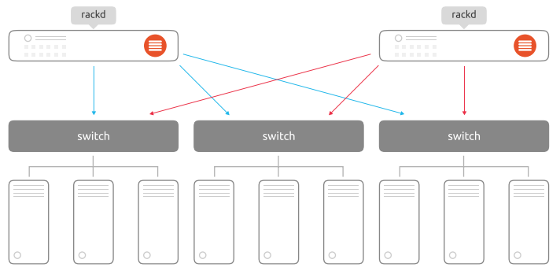

## 여는 말

바야흐로 팬데믹 라이프가 시작되었습니다. 좋든 싫든 우리는 새로운 일반 생활을 시작하였고, 과거로 회기라기 보다는 보다 새로운 환경에 적응해가고 있습니다. 누구는 COVID19를 감기라고 하지만, 실제로 걸려본 사람은 지독하게도 다신 걸리고 싶지 않은 질병 중 하나죠.

클라우드메이트도 당연히 팬데믹을 피해갈 수 없었고, 그로 인해 많은 Desktop을 Laptop으로 변경해야만 했습니다.

사실 처음 클라우드메이트를 디자인할 때 모두가 Laptop을 사용하는 환경을 꿈꿨습니다. 어디서든 언제나 일할 수 있고 그렇기에 시간과 공간의 제약이 없이 일할 수 있는 문화를 만들고 싶었죠.

Cloud를 하는 사람이라면 Cloud Native하게 일도 해 보고 그래야 고객에게 "이렇게 일 하시는 겁니다" 라고 제안도 할 수 있다고 생각했습니다. 지금도 우리 회사에 언젠가 자리잡을 문화라고 생각하고 있습니다.

하지만 Desktop을 선호하는 사람들 또는 기존 업무환경을 그대로 사용하고 싶은 사람들(혹은 미처 구매하지 못한 사람들)로 인해 일부 Desktop을 사용했지만, 팬데믹이라는 이름 아래 전 직원 Laptop화를 이루고 있습니다.

그로인해 문제가 하나 생겼는데요. 바로 "구매한 PC를 어떻게 처분할 것인가?" 입니다. 구매한지 3년도 채 안된 Desktop들이 당근에 올라가거나 선인상가로 출발하는 것은 너무나도 가슴 아팠습니다.

어떻게서든 "이 Desktop들을 활용할 방법이 없을까?" 하고 생각하다가 문득 Cloud 비용이 머릿속을 스쳤습니다. AWS SDK를 사용하기 위해, API를 테스트하기 위해, Windows Client를 가진 동료가 Bash Shell을 실행하고 싶을 때, Linux 환경이 필요할 때마다 AWS, Microsoft Azure, Google Cloud에 VM을 배포하고 사용했습니다.

"이 비용을 절약하기 위해 테스트용 VM을 On-premises에서 제공하면 어떨까?" 라는 아이디어로 버려질 Desktops를 주어다가 사내 Private Cloud를 구축해 보기로 했습니다.

## 상태 점검

일단 PC들을 다음과 같은 규칙으로 분류했습니다.

- 유교사상이 투철한 백의민족으로써 경로우대를 위한 노후 PC는 쉬게 하자
- 일단 메모리뱅크는 4개가 있는 메인보드만 모으자
- 8GB DDR4 메모리를 전부 꼽아 32GB로 만들자
- HDD는 파일저장소로, SSD는 VM boot Disk로 구성하자

아쉽게도 메모리를 16GB로 구매했어야 더 많은 VM을 띄울 수 있었겠지만... 당시 메모리를 8GB로 구매한 듯 합니다. 아마도 비용을 줄여보고자 취했던 방법이었겠죠.

옛날에 돌았던 소문 중 하나도 한 몫 했을겁니다. '메모리 뱅크를 듀얼로 꼽아야 속도가 빠르다.'는 유언비어가 돌아다녔었는데요. 맞는 말도 아니지만 틀린 말도 아닌 이 말은 앞으로 머릿속에서 지우시기 바랍니다. 지금 메인보드들은 그런거로 속도차이가 거의 없습니다.

> 교훈: 16GB 메모리가 필요하면 16GB 메모리 한 개를 구매하자

## Private Cloud 무엇으로 구축할 것인가?

가상화 하면 VMware이지만, 테스트환경으로 사내에 구축하기엔 라이선스가 너무 비쌋습니다. 손에 익은 도구지만 과감하게 포기합니다.

다음은 Hyper-V 입니다. Hyper-V 전용 OS는 무료인 것 아시나요? Windows Hyper-V Server는 라이선스가 없습니다. 오ㅋ 개꿀ㅋ 하고 검색해봤습니다만, Windows Hyper-V Server 2019를 마지막으로 출시가 되지 않습니다.

아무래도 Desktop이다 보니 리소스도 최소한으로 사용하고 싶어 Windows Nano Server 설치도 고려했습니다만, Windows Nano Server 2016을 마지막으로 업데이트가 없더군요. 눈물을 머금고 Windows Hyper-V Server 2019 Core 버전을 설치했습니다만... System Center Virtual Machine Manager(Hyper-V 관리 서버)에 Windows Hyper-V Server는 연결이 안되는군요... 관리 툴을 제작해야 하는 귀찮음이 있어 일단 대기합니다.

그러다 Ubuntu Server 22.04가 릴리즈 되었다는 소식을 듣고 구경하던 중 MaaS를 만났습니다. MaaS는 Metal as a Service의 약어로써 베어메탈 서버를 서비스형으로 제공해주는 툴킷입니다. 오? 이거 괜찮은데? 하고 삽을 들었습니다.

(추가) Openstack도 고려해봤습니다만, 제 스킬이 미천하여 접었습니다. 나중에 더 많은 기능이 필요하게 되면 Openstack도 고려해볼것 같습니다.

(추가2) Kubernetes cluster도 고려해봤습니다만, Control plane을 사용자마다 제공해야 하나? 하는 두려움에 접었습니다. 좋은 사례 있으신 분들은 sejun.kim@cloudmt.co.kr 로 사례 공유 부탁드립니다.

## MaaS를 공부해보자

일단 IT에서 삽을 들었으면 Getting Started를 해보는 것이라 배웠습니다. 그래서 그냥 실습을 해보기로 하고 Machine을 준비했죠. 언제든 만들었다 지우기엔 VM 만한게 없습니다. Desktop에서 실습했다간 제 정신건강에 치명적일 것 같거든요.

Microsoft Azure에 VM을 띄웁니다. Microsoft Azure는 Nested Virtualization을 지원하기 때문에 가상화 환경을 테스트하기에 적합합니다.

Nested Virtualization에 대해 간단히 설명하자면, 가상 머신 위에 Hypervisor를 설치하고 그 위에 가상 머신을 띄울 수 있는 기술을 말합니다.

자세한 내용은 [이 문서](https://learn.microsoft.com/ko-kr/virtualization/hyper-v-on-windows/user-guide/nested-virtualization)를 참고해 주세요!

가상 머신을 띄우고 [MaaS 튜토리얼](https://maas.io/docs/get-started-with-maas)을 수행해 봤습니다. 역시나 개념만 잡을 수 있는 문서이기에 본능적으로 이대로 구축하기 싫었습니다. 문제가 생길 것만 같은 불길한 예감... 여튼 다음 두 가지 문제가 발생했죠.

- VM을 띄우기 위해 LXD 구성이 누락되어 있다.
- 튜토리얼을 따라했더니 구성에 실패했다(??)

이때 포기할 뻔 했으나, Web UI가 너무 이뻣기에(MaaS를 선택한 가장 큰 이유) 포기할 수 없었습니다. 일단 뭐가 잘못 됐는지 하나씩 핥아보기 위해 차근차근 문서를 읽어나가 봅니다. (모종삽을 들었는데 포크레인을 부르기 시작한 시점)

MaaS는 Region과 Availability Zone 개념을 제공합니다. Region은 Database를 가지며, 통합적인 Control plane 기능을 수행합니다. 일반적으로 데이터센터를 의미합니다.

Availability Zone은 MaaS 하위의 Rack 또는 Switch를 기준으로 가용성을 분리하려는 경우 설정합니다. IDC 개념으로는 Single failure가 존재하는 영역을 Availability Zone으로 정의하면 좋을 것 같습니다.

MaaS는 당연히 HA를 지원하며 서버 배포에 중단이 있으면 안되는 경우 HA를 구성하여 가용성을 높일 수 있습니다.

하지만 제가 구성하고자 하는 인프라는 재미용(?) 사내 인프라이기 때문에 서버 배포에 대한 가용성은 보장할 필요가 없고, 지사가 생기지 않는 한 데이터센터를 추가로 구성할 일이 없으며, 사내 자그마한 서버실에 들어가기 때문에 Switch도 하나로 연결되어 있습니다.

따라서 우리는 Single control plane으로 갑니다! (그래서 실습도 단일 구성입니다.)

## 사내에선 어떻게 접근을 시켜볼까?

일단 인프라 구성은 뒤로 하고 구축할 재미용(?) 사내 인프라에 접근할 방법을 고민해야 합니다. 우리에게 중요한건 첫째도 보안, 둘째도 보안, 셋째는 자유입니다. IT 하시는 분들이라면 보안은 과하다 싶을 정도로 지키는 것이 좋습니다.

재미용(?) 사내 인프라에 접속하는 경우는 두 가지로 나눠볼 수 있을 것 같습니다.

1. 사내에서 접속

    사내에서 접속하는 경우 유선 랜 케이블이라는 혁신적인 도구가 있기 때문에 유선 접근을 허용하면 됩니다. Zero trust 방법론과는 멀지만 자유도가 높고 손쉽게 구성이 가능하다는 장점이 있습니다.

    우리의 방화벽에서 Mac address로 IP 접근제어를 하고 있기 때문에 일단 이 도구를 믿어보기로 합니다.

2. 사외에서 접속

    바야흐로 팬데믹 라이프인 상황을 고려한다면, 당연히 외부에서도 접근이 가능해야 합니다.

    방화벽 장비에서 SSL VPN을 구성해보려 했지만, VPN User 생성이 너무 귀찮은 나머지 포기해버렸습니다.

    나중에 Cloud와 IPSec VPN도 연결해봐야 하니 Cloud에서 SSL VPN을 지원하면 그걸 써보기로 합니다.

    우리는 Cloud Native하게 일을 할 것이니 VPN도 Cloud 제품을 써봐야죠!(??)

일단 VPN을 도입하기 전에 검토라는 것을 해봅니다. 비교군은 AWS, Microsoft Azure, Google Cloud 입니다.

- AWS
  - IPSec VPN과 SSL VPN을 별도로 구성, 연결 별, 사용자 별 과금
  - 저렴한 가격 (Tunnel당 $0.05/h, 사용자당 $0.05/h)
  - Windows Server Active Directory 인증 제공
  
- Microsoft Azure
  - IPSec VPN과 SSL VPN을 하나로 구성, 10개의 Tunnel과 128명의 동접User 무료
  - $0.19/h (초과시 Tunnel당 $0.015/h, 사용자당 $0.01/h)
  - Azure AD 인증 제공

- Google Cloud
  - IPSec VPN은 AWS와 동일하며 가격은 Tunnel당 $0.075/h
  - SSL VPN 없음

Google Cloud에 SSL VPN이 없다니... 위 내용만 봐서는 하루 평균 SSL VPN 동시 접속자가 3명 이상이 되면 Microsoft Azure가 더 싼 것을 알 수 있습니다.

게다가 클라우드메이트는 Microsoft 365를 쓰기 때문에 모든 동료들이 Azure AD 계정이 있어 손쉽게 접근설정이 가능한 Microsoft Azure VPN을 사용하기로 했습니다.

Azure VPN Client로 Azure AD 인증을 할 수 있으며 Windows와 통합도 잘 되어 있습니다만... Microsoft Store를 통해 제공하고 있어 Windows Client OS만 지원합니다. (일해라 MS!)

## 다음에 계속 할 내용...

쓰다보니 블로그가 길어져서 두 편으로 나눕니다.

다음 편에서는 MaaS 구성에 대한 Hands-on을 다뤄보겠습니다. 그때까지 심심하실까봐 Ubucon Asia 2022에서 발표했던 슬라이드 공유합니다.

[https://bit.ly/ubuconasia2022_wordshop](https://bit.ly/ubuconasia2022_wordshop)

그럼 다음 시간에 다시 뵙겠습니다.
