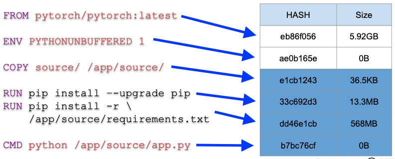

# 문서 작성의 이유

이제는 필수가 된 Dockerfile을 잘 작성하는 것 만으로도 Container의 이미지 사이즈를 줄일 수 있다. 이 말은 Dockerfile을 작성할 때 의도한 것과 다르게 작성하여 이미지 사이즈를 크게 사용하고 있을 수 있다는 말이다.

그래서 다음의 내용을 검토하면서 우리가 흔히 할 수 있는 Dockerfile 작성의 아쉬운 점을 해결해보자.
 * 흔히 Dockerfile을 어떻게 사용하는지?
 * 해결하는 과정은 어떻게 되는지?


## 미리 읽어 보면 도움이 되는 내용

이전 cloudmate tech 컨텐츠 중에 도움이 되는 이야기가 있다. 아래의 내용을 읽기 전에 한번 읽어보고 그 내용 중 **이미지 레이어** 부분을 주의 깊게 읽어 보고 오자.

[도커와 컨테이너의 이해(3/3)](https://tech.cloudmt.co.kr/2022/06/29/도커와-컨테이너의-이해-3-3-docker-image-dockerfile-docker-compose/)

이야기 하고자 하는 내용과 관련있는 중요한 내용을 발췌하면 다음과 같다.
* Dockerfile에 기입된 명령 별로 Image Layer가 쌓인다.
* Image Layer가 쌓이게 되면 파일을 삭제해도 이미지 사이즈는 줄어들지 않는다.

그렇다고 하면 명령어를 실행하는 순서 자체가 중요하다는 것이고,
이 명령어 순서에 따라서 실제로 컨테이너가 생성되는 구조가 달라진다.

# 문제상황 파악

## 우리가 흔히 작성하는 Dockerfile 의 구조

다음의 Dockerfile은 머신러닝용 컨테이너를 작성할 때 자주 사용하는 형태를 최소화 한 형태이다.

```
FROM pytorch/pytorch:latest
ENV PYTHONUNBUFFERED 1
COPY source/ /app/source/
RUN pip install –-upgrade pip
RUN pip install -r \ 
    /app/source/requirements.txt
CMD python /app/source/app.py
```

위와 같은 Dockerfile을 통해서 컨테이너 이미지를 작성한 경우 생성되는 이미지 레이어의 구조 및 사이즈를 살펴보자.


이 구조에 문제가 있는가? 라고 물어본다면 문제는 없고 동작 역시 아무런 문제가 없다. 그렇다고 개선할 부분은 없는가? 라고 물어본다면 **개선할 부분이 존재한다** 라고 말할 수 있다.


## 개발은 한번의 시행착오로 완성되지 않는다.

대부분의 개발 과정을 보면 요즘 많이 나온는 DevOps의 그림으로 설명이 가능하다.

[이미지 출처](https://pnghut.com/png/c3TiGwsLkJ/devops-business-process-software-development-deployment-technical-support-kms-technology-vietnam-transparent-png)

즉 개발하고 확인하고 수정하고 또 확인하고 이 과정의 연속이며, 이 과정에서 우리는 수 없이 이미지를 생성하고 컨테이너를 사용한다.

그렇다면 코드를 변경한 뒤 새롭게 변경되는 이미지 레이어 중 새롭게 생성된 레이어의 내용을 확인해보자. 다음의 이미지는 source 코드에 포함되어 있는 내용을 한 줄 변경한 뒤 **변경된 레이어를 역상**으로 표시하였다.



우리는 코드 한줄을 수정하였지만, 실제 새롭게 변경된 이미지 레이어는 무려 568MB 이상인 것이다.

이런 형태로 개발을 하다 보면 다음과 같은 문제에 직면하게 된다.
 - 이미지 생성 시간은 반복적으로 시간을 소모하게 되고
 - 불필요한 이미지 레이어를 만들게 되며
 - 최종적으로 개발 속도 역시 늦어지게 된다.


# 그렇다면 개선은?

## 변경되는 파일의 영역을 파악

이제 변경한 Dockerfile 의 내용을 확인해보자.

```
FROM pytorch/pytorch:latest
ENV PYTHONUNBUFFERED 1
COPY source/requirements.txt /app/source/
RUN pip install –-upgrade pip
RUN pip install -r \ 
    /app/source/requirements.txt
COPY source/ /app/source/
CMD python /app/app.py
```

크게 달라진 점이 없기 때문에 꼼꼼하게 확인을 해보자. 확인하면 다음과 같이 변경된 것을 확인 할 수 있을 것이다.

 * 프로그램 동작을 위한 라이브러리 설치를 먼저 하며,
 * 그를 위해 작성하는 코드 중 일부인 requirements.txt 만 먼저 복사한다.
 * 가장 중요한 source는 마지막에 복사 작업을 한다.
 


이렇게 **순서만 조금 바꾸는 것이 얼마나 큰 차이를 가져올까?** 싶을 것이다. 그렇다면 실질적으로 나타나는 차이에 대해서 이야기 해보자.


## 변경된 구조로 인한 이득

Dockerfile의 실행 순서의 변경으로 반복적으로 이미지 생성을 하는 경우 변경 되는 영역을 살펴 보자.


변경이 되는 영역과 사이즈를 확인해보면 36.5KB 뿐으로 이전의 568MB와는 비교하여 믿기 힘들만큼 큰 차이가 난다.

또한 직접 이 내용을 따라해보면 알겠지만 이전 구조에서는 이미지 빌드에 8분이 소요 되었지만, 이번에는 2초도 안걸릴 정도로 이미지 생성의 시간이 매우 빠르게 완료가 된다.

이미지 사이즈가 변경되는 점은 체감하기 힘들다고 하여도, 빌드 시간이 달라지는 것은 바로 체감이 될 것이다. 이런 큰 차이는 어떻게 발생하는 것인가?


# 기술적 이유

## Dockerfile을 주의깊게 작성해야하는 이유

바로 우리가 수정하는 코드 자체는 매우 일부분이기 때문에 그 부분을 고려해야 한다는 것이다. 앞서 컨테이너 이미지를 생성할 때 레이어링 과정을 통해 명령을 수행한 순서대로 결과를 저장한다고 한 것을 기억할 것이다.

즉 우리가 변경하는 것은 **최종 레이어가 만들어지기 바로 전에 수정을 해야 하는 것**이지, **변화가 거의 없는 라이브러리 설치 과정 전에 작성한 코드를 복사하면 안되는 것**이다. 코드가 동작하기 위해서 필요한 환경 부터 만들어 두고 작성한 코드를 복사하는 것이 현명하다.

우리가 작성하고 변경하는 코드는 전체 영역에서 매우 일부분이고 변경이 자주 일어나기 때문에 가장 최상위 레이어에서 변경하여 변경되지 않는 영역은 최대한 재활용 해야 한다는 것이다. 만약 이 과정을 고려하지 않는다면 일부 코드의 수정으로 인해서 매번 라이브러리를 새롭게 설치하고 그로 인해서 용량도 불필요하게 계속 사용하는 상황이 되는 것이다.


# Dockerfile을 개선하는 또 다른 방법

이 팁을 통해 8분이 걸리던 컨테이너 이미지 제작시간을 2초로 줄였으며, 568MB 씩 생성하여 보관하던 이미지 파일도 1MB 도 안되는 사이즈만 증가하는 형태로 변경하였다.

그럼 이것 팁 이외도 Dockerfile을 개선하는 방법은 없는지 궁금해질 것이다. 다음으로 작성할 내용은 빌드 과정에 필요한 라이브러리는 모두 설치를 해야하는지? 의 기준으로 추가 내용을 작성할 예정이다.

