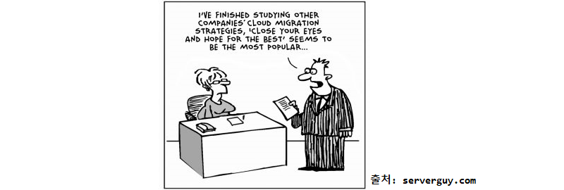
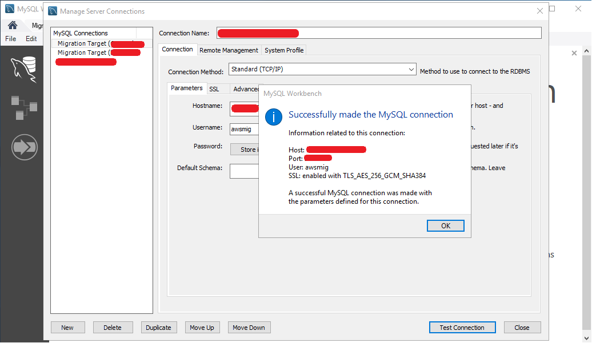
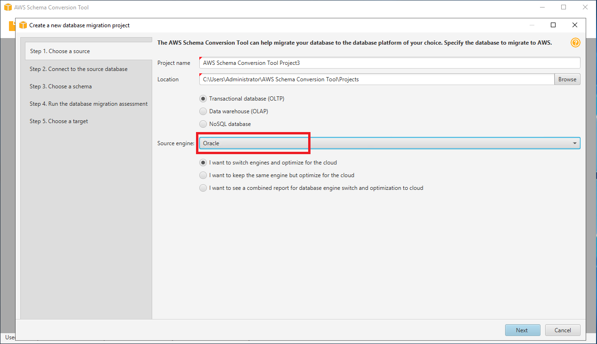
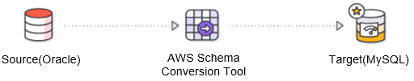
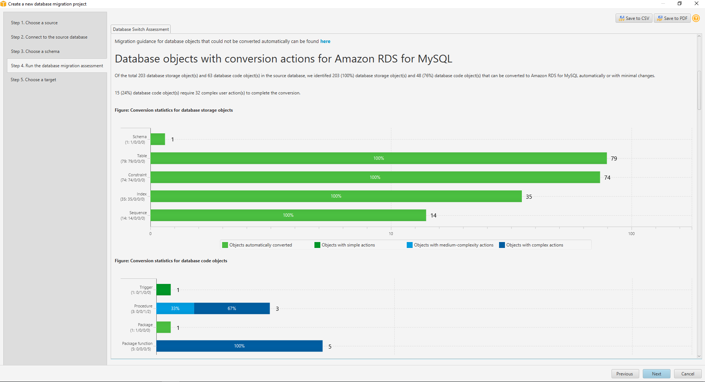
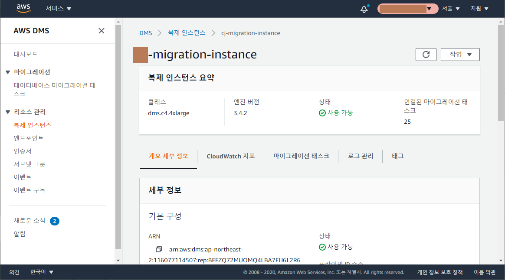
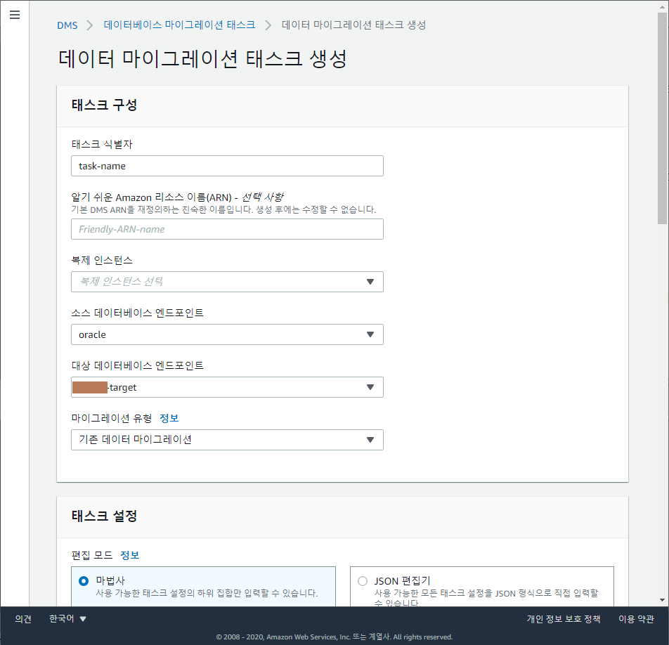
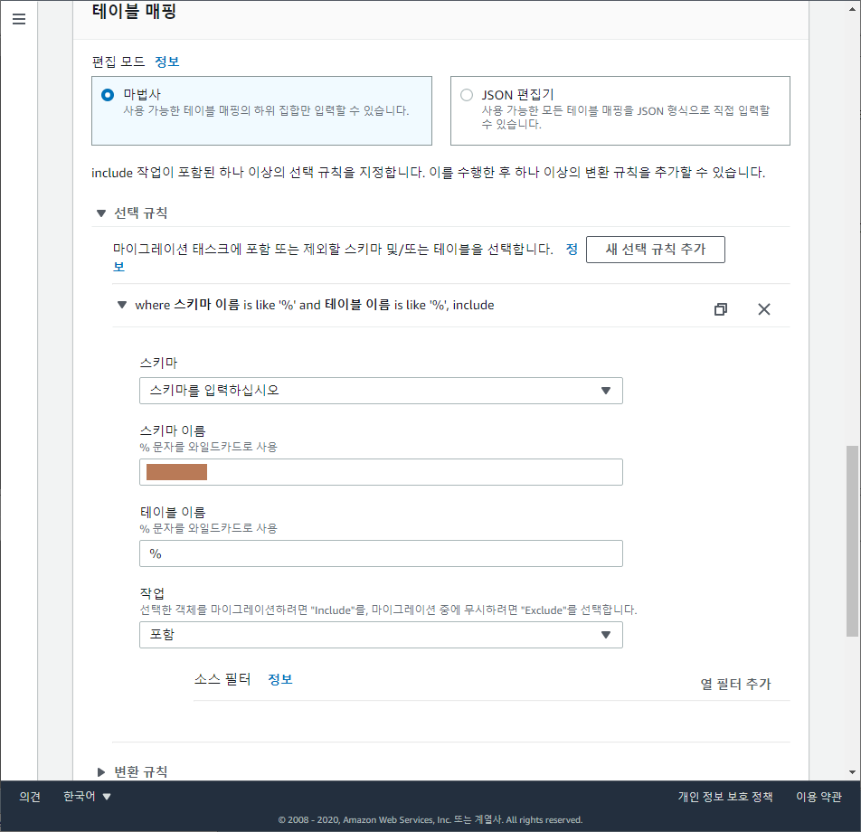
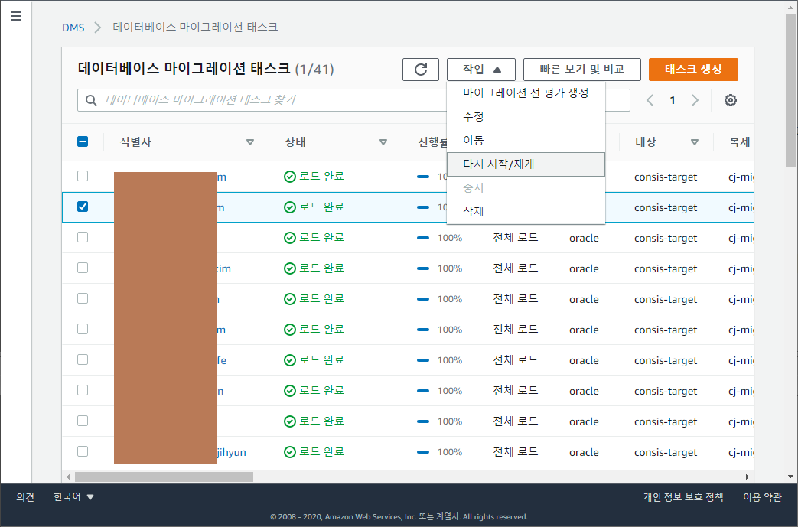

## 시작하기 전에
현대차, 카카오, KT, 대한항공 등 에서 촉발된 `탈(脫) Oracle` 프로젝트(`escape from oracle`)는 오픈소스 DB, 클라우드 DB 의 안정성이 높아지면서 국내 뿐만 아니라 해외에서 먼저 트렌드로 자리잡았으나, 그럼에도 불구하고 현존 RDBMS 중 성능 최강인 ~~(가격도 최강)~~ Oracle 을 100% 대체할 수 있는 RDBMS는 안타깝게도 아직까지는 없다고 생각합니다. (2020년말기준) 그렇기 때문에 Oracle에서 벗어나려면 Oracle에서만 지원하는 기능을 어떻게 타겟DB에서 대체 또는 구현할지 에 대한 깊은 고민이 필요합니다. ~~(굳은 신념도 필요합니다.)~~

이번 C고객사에서는 시범적으로 기존 온프레미스 Oracle 의 레플리카를 퍼블릭 클라우드 환경으로 마이그레이션 하여 향후에 있을 감사 등 에 대응할 수 있길 원하셨습니다. 미션 크리티컬한 서비스 DB 가 아니여서 다운타임에 대한 고려가 불필요했습니다. 빗발치는 OLTP 가 발생하지 않는 DB의 마이그레이션이라... 꿀냄새가 진동하네요.

  

---
## 사전 검토
- 소스 DB 체크
   1. 버전: Oracle 11g Ent (Release 11.2.0.4.0) on TNS for Linux - 64bit
   1. 총용량(1TiB 가량)
   1. 오브젝트 현황 파악
- 타겟 DB 체크
   1. 버전: MySQL 8.0.21 on Amazon Linux 2 - 64bit
   1. EC2 인스턴스 유형: r5.4xlarge (vCPUs: 16, 메모리: 128GiB)
- AWS 콘솔에서 작업자 접속용 EC2 인스턴스 생성 (이하 `작업콘솔`)
- `작업콘솔` 에서 소스, 타겟 접속 가능하도록 가상 네트워크 구성 및 방화벽 설정
- 작업 절차 거버넌스
   1. Schema Conversion Tool (이하 `SCT`) 로 스키마 이관
   1. Database Migration Service (이하 `DMS`) 로 데이터 이관
   1. 미싱 스키마, 미싱 데이터 수동 점검
- Procedure, fucntion, sequence 는 마이그레이션 대상에서 제외
- 별도의 SSL 구성은 하지 않음  

---
## 마이그레이션 아키텍쳐  


>1. 작업콘솔의 SCT에서 소스의 스키마를 DDL 형태로 로드하여 타겟에 적용합니다.
>1. AWS 콘솔에서 DMS 내에 필요한 리소스를 셋팅 합니다.  
***(복제 인스턴스, 소스/타겟 엔드포인트 생성)***
>1. DMS 내에 여러 마이그레이션 태스크를 소스 스키마 단위로 생성하고 일괄 실행합니다.
>1. 소스, 타겟에 직접 SQL을 실행하여 전체 오브젝트 현황을 비교하고 검증합니다.

자 이제 사전 검토했고 아키텍쳐 파악했으니, 실제로 시작해봅시다.

---
## 1. `작업콘솔`을 셋팅 합니다.
1. AWS 콘솔에서 퍼블릭 IPv4 와 RDP port 를 확인하여 `작업콘솔`에 원격 접속 합니다.    


1. `작업콘솔`에서 소스 검증을 위하여 SQL Developer 설치 후 소스DB 접속 테스트를 합니다.  


1. `작업콘솔`에서 타겟 검증을 위하여 WorkBench 설치 후 타겟DB 접속 테스트를 합니다.  


1. `작업콘솔`에서 스키마 이관을 위하여 SCT 설치 후 소스, 타겟 접속 테스트를 합니다. SCT > New Project wizard IU 입니다. Source engine 의 기본값이 `Oracle`인 것이 흥미롭습니다.  
  

---
## 2. 타겟DB 셋팅
### 1. Buffer pool
DMS가 타겟DB에 값을 쓸 때 버퍼캐쉬 크기가 처리 성능을 크게 좌우합니다. 디폴트값(128MB)에서 일시적으로 서버 메모리 한도 내에서 최대한으로 설정하도록 권장 드립니다. 금번 프로젝트의 경우 64GiB 로 설정하여 진행했습니다.

```sql
-- buffer pool size 확인 (GiB)
SELECT @@innodb_buffer_pool_size / 1024 / 1024 / 1024;
```
※ Innodb buffer pool size가 쓰기 성능에 얼만큼 영향이 큰지 테스트한 블로그 링크 참고 바랍니다.  
[블로그 - innodb mysql/mariadb insert 속도 높이기](https://santander.co.kr/151)

### 2. Timezone
EC2 에 MySQL 바이너리 설치한 초기 상태에서는 timezone 을 소스와 동일한 timezone 으로 설정해주어야 합니다. 먼저 소스 DB의 timezone을 확인합니다.
```sql
SELECT   DBTIMEZONE,
   SESSIONTIMEZONE
FROM  DUAL;
```

>| DBTIMEZONE | SESSIONTIMEZONE |
>|--|--|
>|+09:00|UTC|

<br>소스DB의 timezone 은 UTC + 09:00 인 Korea Standard Time(KST) 인 것을 확인 했습니다.

```sql
-- 타겟DB timezone 중에 'Seoul'이 존재하는지 확인
SELECT  B.NAME,A.TIME_ZONE_ID
FROM    MYSQL.TIME_ZONE A
        INNER JOIN MYSQL.TIME_ZONE_NAME B ON A.TIME_ZONE_ID = B.TIME_ZONE_ID
WHERE   B.NAME LIKE '%Seoul';
```

`Asia/Seoul` timezone이 존재하지 않는다면 EC2 에서 다음과 같은 명령을 실행합니다.
아래 명령을 통하여 타겟DB의 표준시간대 테이블에 데이터를 삽입해줍니다.  
[MySQL 8.0 참조 매뉴얼  /  ...  /  mysql_tzinfo_to_sql — 시간대 테이블로드](https://dev.mysql.com/doc/refman/8.0/en/mysql-tzinfo-to-sql.html)
```bash
mysql_tzinfo_to_sql /usr/share/zoneinfo | mysql -u root -p mysql
```

타겟DB 설치경로 안에 `/etc/my.cnf` 또는 `/etc/my.cnf.d/` 경로 안에 `my.cnf` 파일 또는 `my.ini` 파일을 열어 안에 다음 내용을 추가해줍니다.
```
[mysqld]
default-time-zone=Asia/Seoul
```

소스DB의 timezone에 맞춰 타겟DB 의 timezone 을 `Asia/Seoul` (KST) 로 변경해주어야 합니다.
```sql
SET GLOBAL time_zone = 'Asia/Seoul';
```

```sql
-- 변경된 timezone 확인
SELECT @@TIME_ZONE, @@system_time_zone, @@GLOBAL.TIME_ZONE, @@SESSION.TIME_ZONE;
```

>| @@TIME_ZONE | @@system_time_zone |@@GLOBAL.TIME_ZONE|@@SESSION.TIME_ZONE|
>|-|-|-|-|
>|+09:00|KST|+09:00|+09:00|

<br>정상적으로 적용되어 있는 것 확인 완료요!

※ MySQL on RDS 는 AWS 콘솔에서 `Parameter Group` 생성 및 적용하여 비교적 간단하게 변경 가능합니다.

### 3. Charset
소스DB의 charset을 확인하여 타겟DB에 적용해주도록 합니다. 데이터를 이관하기 전에 신중히 결정해야할 사항이며 이관 완료 이후에 charset, collation 변경 작업은 지옥문을 여는 경험이 될 수 있습니다. 일단 먼저 소스 DB의 charset을 확인합니다.
```sql
SELECT  NAME, VALUE$
FROM    SYS.PROPS$
WHERE   NAME IN ('NLS_LANGUAGE'
    ,'NLS_DATE_LANGUAGE'
    ,'NLS_CHARACTERSET'
    ,'NLS_NCHAR_CHARACTERSET');

SELECT  PARAMETER, VALUE
FROM    NLS_DATABASE_PARAMETERS
WHERE   PARAMETER = 'NLS_CHARACTERSET';
```
resultset[0]
>|NAME|VALUE$|
>|---|---|
>|NLS_NCHAR_CHARACTERSET|AL16UTF16|
>|NLS_LANGUAGE|AMERICAN|
>|NLS_DATE_LANGUAGE|AMERICAN|
>|NLS_CHARACTERSET|`KO16KSC5601`|

<br>resultset[1]

>|PARAMETER|VALUE|
>|---|---|
>|NLS_CHARACTERSET|`KO16KSC5601`|

NLS_CHARACTERSET 이 `KO16KSC5601`에 대응되는 charset 은 `EUCKR`, 또는 커버리지가 더 넓은 `UTF8`을 생각해볼 수 있습니다. charset `EUCKR` 에 대한 collation 은 `EUCKR_KOREAN_CI`, `EUCKR_BIN` 이 있는데 대소문자가 구별되는 이유로 `EUCKR_BIN` 이 적합합니다.

- `EUCKR_BIN`: 한국어, 바이너리, **대소문자 구분함**
- `EUCKR_KOREAN_CI`: 한국어, 대소문자 구분 안함

Charset `EUCKR`, collation `EUCKR_BIN`을 결정했으니 이제 서버에 아래 명령을 실행해줍니다.
```bash
$ vi /etc/mysql/my.cnf
```
파일 내용의 마지막에 다음 부분을 덧붙여준 후 :wq 로 저장 후 닫아줍니다. 그리고 서비스를 재시작하면 적용됩니다.
```
[client]
default-character-set=euckr

[mysql]
default-character-set=euckr

[mysqld]
collation-server = euckr_bin
init-connect='SET NAMES euckr'
character-set-server = euckr
```

Charset, collation 도 설정 완료했습니다~

---
## 3. `SCT`로 스키마를 이관해봅시다.


1. 소스에서 SCT로 이관할 스키마를 선택하고 `Next`를 클릭합니다. 선택한 스키마 내에 전체 오브젝트 개수에 비례하여 시간이 오래 걸릴 수 있습니다.  


1. 소스 스키마에 대한 로드 작업이 끝나면 여러가지 타겟의 종류 별로 몇개가 이관 가능한지, 몇개는 수동 조치를 취해야 하는지 전체 조사한 `Database migration assessment report`를 보여줍니다. pdf로도 다운로드 가능하며, 전체적으로 한번 훑어보고 `Next`를 클릭합니다.  
*(Procedure, funcion, sequence 는 migrating 대상이 아니므로 부담없이 `Next`클릭)*  


1. SCT 관점에서 타겟의 엔진이 MySQL 인 것이 의미가 있고, RDS 또는 EC2 중 어떤 것인지는 중요하지 않기 때문에 `Amazon RDS for MySQL`을 선택하고 타겟의 접속정보 입력 후 `Test connection`, 접속 성공하면 `Next`를 클릭합니다.  


1. 소스(좌측)에서 DDL을 추출할 스키마와 개체유형을 선택하고 `Convert schema`를 클릭합니다. 타겟(우측)에서 선택 체크된 항목들에 대해서 DDL을 적용하려면 `Apply to database`를 클릭하면 타겟 DB에 실제로 DDL이 적용됩니다.  


1. 타겟 DB에 아래 SQL을 실행해서 정상적으로 스키마가 적용되어 있는지 확인합니다.
```sql
SELECT	A.TABLE_SCHEMA, A.TABLE_NAME, A.TABLE_COLLATION, A.TABLE_COMMENT,
        I.INDEX_COUNT, T.TRIGGER_COUNT
FROM	INFORMATION_SCHEMA.TABLES A
	    LEFT JOIN LATERAL ( -- like OUTER APPLY
        SELECT	COUNT(DISTINCT I.INDEX_NAME) AS INDEX_COUNT
		FROM	INFORMATION_SCHEMA.STATISTICS I
        WHERE	I.TABLE_SCHEMA = A.TABLE_SCHEMA
        AND	I.TABLE_NAME = A.TABLE_NAME
        LIMIT 1
        ) I ON 1 = 1
        LEFT JOIN LATERAL (
        SELECT	COUNT(1) AS TRIGGER_COUNT
	    FROM	INFORMATION_SCHEMA.TRIGGERS T
        WHERE	T.TRIGGER_SCHEMA = A.TABLE_SCHEMA
        AND	T.EVENT_OBJECT_TABLE = A.TABLE_NAME
        LIMIT 1
        ) T ON 1 = 1
WHERE	A.TABLE_SCHEMA LIKE '%';
```


※ 타겟DB가 MySQL 인 경우 테이블과 컬럼의 `comment`가 SCT로 이관되지 않음을 확인했습니다. 금번 프로젝트 진행하면서 AWS 케이스 오픈을 통하여 정식 요청하였으며, 추후 픽스될 것으로 보입니다.

SCT에 대한 상세한 가이드는 [AWS Schema Conversion Tool User Guide](https://docs.aws.amazon.com/ko_kr/SchemaConversionTool/latest/userguide/CHAP_Welcome.html) 를 참고 바랍니다.

만약 SCT로 trigger 까지 이관시켰다면 DMS 태스크 실행 시 trigger로 인해 오류가 떨어지고 태스크가 멈출 수 있으므로 trigger 를 백업받아놓고 모두 제거하는 것을 추천드립니다.

```sql
-- 트리거 리스트 출력
SHOW TRIGGERS;

-- SCT 가 이관해준 트리거 소스는 메모장에 백업해놓고 모두 제거
DROP TRIGGER <SCHEMA_NAME>.<TABLE_NAME>.<TRIGGER_NAME>;
```

다시 한번 강조하지만 DMS로 데이터를 들이부은 이후에는 charset, collation 을 변경하는 데에 굉장히 긴 시간이 소요될 수 있습니다. 그래서 SCT 작업 끝나고 DMS 작업을 시작하기 이전에 아래 쿼리를 다시 실행해주면 세상 시원하겠습니다.
```sql
ALTER DATABASE <database_name> CHARACTER SET = EUCKR COLLATE = EUCKR_BIN;
ALTER TABLE <table_name> CONVERT TO CHARACTER SET EUCKR COLLATE EUCKR_BIN;
```


---
## 4. `DMS`로 데이터를 이관해봅시다.

이제 본격적으로 `DMS`로 데이터를 넘겨볼껀데요. 그전에 복제 인스턴스, 엔드포인트, 마이그레이션 태스크를 생성해야 합니다.

먼저, 복제 인스턴스는 아래 사양으로 생성했습니다.

- 클래스: dms.c4.4xlarge  
~~*(처음에는 c4.large였다가 너무 느려 속 터져서 업그레이드)*~~
- vCPUs: 8
- 메모리: 30GiB
- 전용EBS 대역폭: 2,000Mbps
- 할당 스토리지: 1000GiB



엔드포인트는 유형에 따라 `소스` 1개, `대상` 2개로 생성했습니다. 소스DB, 타겟DB 의 접속정보를 각각 알맞게 넣어주고 `테스트 실행`을 해봅니다.


마이그레이션 태스크는 아래 캡처대로 순서대로 값을 입력합니다.

- 태스크 식별자: 식별할 수 있는 이름
- 복제 인스턴스: 복제 인스턴스 선택
- 소스 엔드포인트: 소스DB 엔드포인트 선택
- 대상 엔드포인트: 타겟DB 엔드포인트 선택
- 마이그레이션 유형: `기존 데이터 마이그레이션` 선택  
*(기존 데이터를 일회성으로 마이그레이션할 것이기 때문에)*
- 태스크 설정 편집모드: `마법사`
- 대상 테이블 준비 모드: 아무 작업 안 함  
※ `대상에서 테이블 삭제` 는 DDL(drop & create)을 실행하기 때문에 charset, collation, trigger 등이 원래대로 생성될 수 있음
- 복제에 LOB 열 포함: `전제 LOB 모드`
- LOB 청크 크기: 64
- 검증 활성화: Y
- CloudWatch 로그 활성화: Y
※ 그외 CloudWatch 관련 설정들은 모두 `기본값`
- 테이블 매핑 편집모드: `마법사`
- 선택 규칙 > `새 선택 규칙 추가` > 스키마 입력 > 테이블 이름 (필요에 따라 입력, % 는 전체 테이블)
- 마이그레이션 전 평가: N
- 마이그레이션 태스크 시작 구성: `나중에 수동으로`
- 태그: (필요한 경우에 입력, 많이 입력할수록 추후에 찾기 용이함)
- `태스크 생성` 클릭





마이그레이션 해야할 스키마 갯수, 테이블 갯수에 따라 상황이 다르겠지만, 금번 프로젝트에서는 스키마 이름 단위로 태스크를 생성하여 마이그레이션을 진행했습니다. (테이블 이름은 % 로 그냥 둔채로)

스키마 갯수 대로 태스크를 생성해놓은 다음 태스크들을 일괄로 `시작`을 눌러줍니다.



상태 값에는 다음 값들이 올 수 있으며, 아무 오류 없이 완료 되면 `로드 완료` 로 바뀌게 됩니다. 이제 우리가 해야할 것은 오로지, `Close your eyes and hope for the best` 말고는 없습니다.

---
## 5. 마이그레이션 검증
데이터까지 마이그레이션이 완료된 후에는 소스, 타겟의 difference 가 존재하는지 검증해봐야 하며 검증 절차는 아래와 같이 구성하였습니다.

1. 소스, 타겟의 테이블(뷰 포함) 갯수 비교
1. 소스, 타겟의 테이블 당 row count 비교
1. 소스, 타겟의 Index 갯수 비교
1. 소스, 타겟의 Constraint 갯수 비교

위 절차들의 검증이 모두 끝나고 나면 비로소 DB 마이그레이션 작업이 완료됐다고 볼 수 있습니다. 아래 이미지는 Google sheet로 기록해놓았던 이관진행 문서입니다.


---
## 작업을 마치며
그동안 Youtube로만 접했던 AWS의 `DMS`, `SCT`를 직접 사용해보니 아주 약간의 버그성 동작과 모호한 UI 로 인해 작업 초반에는 생산성이 떨어졌던 것이 사실이나, 소스/타겟에서 지원하는 DB engine 종류가 매우 다양하며 특히 데이터를 일괄로 퍼서 넘기는 속도 등 성능이 뛰어나다고 봅니다. ~~(육아와 DB이관은 캐시템 으로 해결하세요.)~~

향후에 실 서비스 상태의 DB를 마이그레이션 하게 되는 경우 추가로 고려해야 할 것들을 대략 정리해봤습니다.

1. 다운타임 최소화
1. 지속적인 변경 사항 복제 시 지연시간 최소화
1. 실패 시 roll-back 방안

전통적인 DB 마이그레이션 작업은 일부 DBA, 일부 DB개발자 들만의 야간 작업으로 많이 치부되어오곤 했었습니다. 마이그레이션 진행 시 철야는 물론이었고, 스크립트 수작업하는 경우도 부지기수 였고, 경험 많은 DBA가 없으면 심각한 예외상황에 직면했을 경우 롤백하는 경우도 많았었지요.

AWS DMS의 경우 AWS콘솔에서 누구나 쉽게 이해하고 사용할 수 있도록 구성되어 있어서, 이제 앞으로의 DB 마이그레이션은 기성 DBA 들만의 작업이 아닐 수 있겠다는 생각이 들었네요.