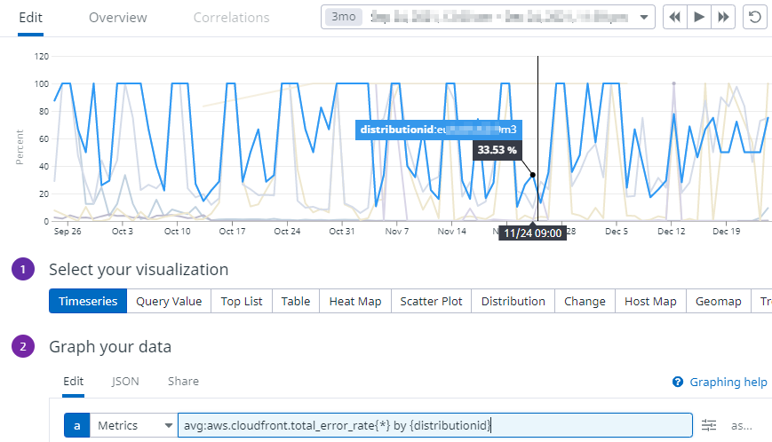
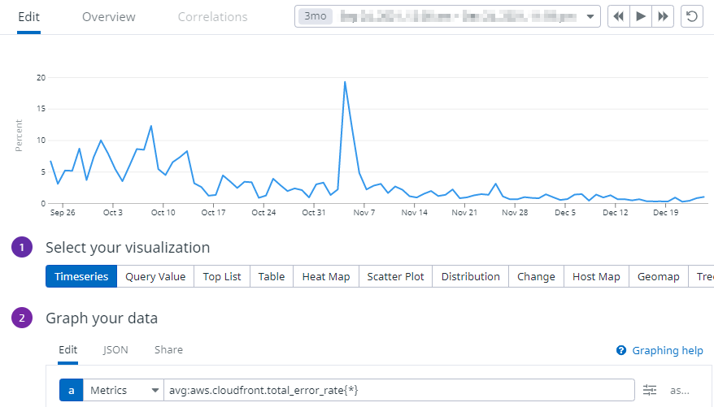
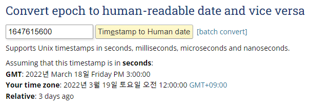
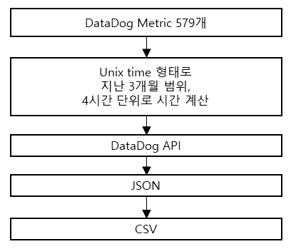
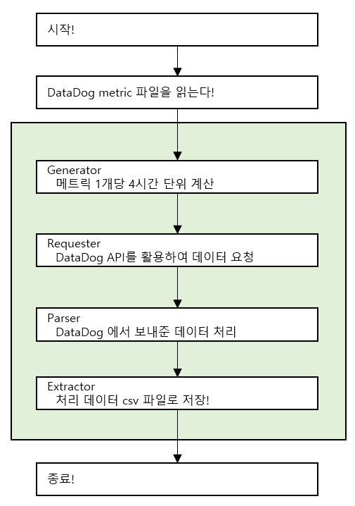
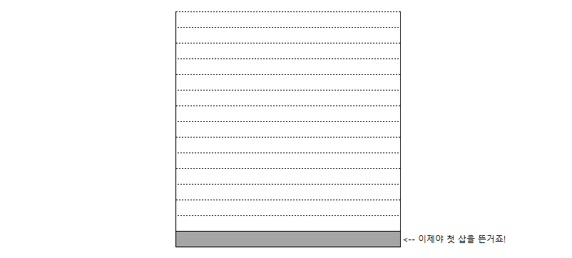
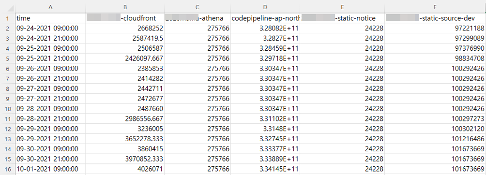
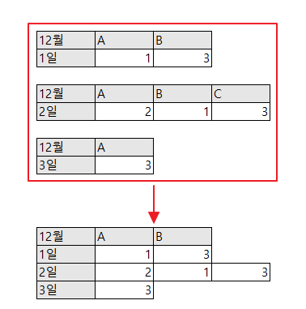
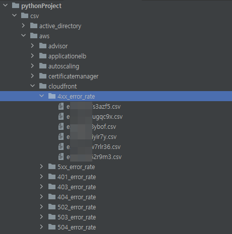

>Datadog에 특정날짜부터 3개월 동안 수집된 모든 메트릭 데이터를 백업받고 싶다고 합니다.  
>Datadog 웹 사이트에서 메트릭 데이터를 내려받을 수 없는 상황에서 어떻게 해야 할까요?

## 1. 개요

고객은 AWS 인프라를 사용하면서 Datadog 모니터링 솔루션을 사용하고 있습니다.  
지난해 3개월 동안 온라인 행사를 진행했었고 AWS 인프라 모니터링 데이터를 받아보고 싶어 합니다.

### 요구사항

요구사항은 간단합니다.  
***지난 3개월 동안 수집된 모니터링 데이터를 전부 받아보고 싶다는 것*** 입니다.

AWS나 Datadog의 웹 콘솔에서 과거 모니터링 데이터를 그래프 형태로 확인할 수 있어도 파일 형태로 다운로드 받을 수 있는 기능이 없습니다. 하지만 Datadog API를 통해 요청을 보내면 JSON 형태로 응답받을 수 있습니다.  

##### ***프로그램을 만들어 데이터를 받는다! 라는 결론에 이르게 됩니다.***

- 이벤트 `3개월` 분량
- 모든 메트릭을 `분 또는 초 단위`로 다운로드
- `4시간 단위`로 Datadog API를 요청해야 분 또는 초단위의 데이터 확인 가능
- 하루 API 요청 limit이 1,000건 제한이 있는 상태, `limit 해제 필요.`

## 2. 작업 시작

Datadog API를 지원하는 언어는 Java, Python, Ruby, Go, Typescript 가 있습니다.  
개발 언어는 익숙하고 자료가 많은 ***Python***으로 선택했습니다.

### API limit 해제가 필요합니다.

Datadog는 하루에 요청할 수 있는 API limit이 존재합니다.

> The rate limit for event aggregation is `1000` per aggregate per day per organization.  
> An aggregate is a group of similar events.

원하는 데이터를 응답받기 위해서 Datadog API에 요청해야 하는 메트릭은 579개이며, Dataodg API 특성상 초단위 메트릭을 획득하려면 기간을 4시간 이내로 요청하여야 합니다. 그러면 총 **333,504번**의 API 호출이 필요한 상황입니다.

하루에 30만 번으로 API 요청 limit을 변경할 수 있는지 Datadog에 문의를 했습니다.  
Datadog에서는 API 요청 limit을 ***시간당 3,600으로*** 변경해 주었습니다.  
시간당 3,600번이면, 10초에 10번 요청할 수 있습니다.

##### ***시간당 3,600번씩 API 요청이 가능하다면, 579개의 메트릭 데이터 작업에 93시간이 필요하게 됩니다.***

### Querying metrics의 Tags를 확인합니다.

Datadog API로 ***Querying metrics*** 질의를 하고 응답받은 데이터를 ***CSV파일*** 형태로 저장할 생각입니다.  
그러기 위해서는 아래와 같이 수집할 메트릭 리스트를 정의합니다.  

**Querying metrics**형태는 아래와 같습니다.  


메트릭 리스트를 보면 `by {xxxxx}` 가 있는 것과 없는 것을 확인할 수 있습니다.  
`by {xxxxx}`가 있는 것은 Querying metrics에서 space aggregation 부분에 태그별 ***그룹화***를 적용한다는 의미입니다.

```csv
avg:aws.ec2.cpusurplus_credit_balance{*}
avg:aws.autoscaling.group_total_instances{*} by {name}
avg:aws.certificatemanager.days_to_expiry{*} by {certificatearn}
avg:aws.cloudfront.requests{*} by {distributionid}
avg:aws.advisor.service_limit.usage{*} by {service_name}
```

#### Grouping by tag *적용*



- ***여러 개의 그래프*** 데이터를 확인할 수 있습니다.

#### Grouping by tag *미적용*



- ***단일 그래프*** 데이터를 확인할 수 있습니다.

### 시간 표기 문제가 있습니다!

앞서 설명했듯이 초 단위 데이터를 뽑기 위해서는 4시간씩 요청해야 합니다.  
Datadog에서는 시간 표현을 `Unix time` 표기하기 때문에 우리가 쉽게 알아볼 수 있도록 변환이 필요합니다.

- Unix time은 `epoch time`이라고 부르기도 합니다.
- 아래 그림처럼 `1647615600` 값을 변환하면 `2022년 3월 19일 토요일 오전 12:00:00 [GMT+09:00]` 이렇게 표시됩니다.



### 프로그램 구조

현재까지 내용을 종합하면 아래와 같습니다.  
그런데 이것을 프로그램으로 구현하자니 579개의 메트릭을 3개월 안의 범위에서 4시간씩 나누어 API 호출을 해야 한다고 생각하니 머릿속이 점점 복잡해져 가고 있었습니다.



##### 🤔

### SOLID 원칙

그러던 중에 내부 개발자분을 통해 프로그램 컨설팅을 받았습니다. 🙏  
**SOLID 원칙**(단일 역할의 책임)의 이론을 파이썬 예제코드로 만들어 주셨고, 역할에 맞게 구현하니 잘 정리 된 느낌을 받았습니다.



**579개**의 메트릭이 저장된 파일을 읽어, `Generator > Requester > Parser > Exgtractor` 순서로 1개 메트릭이 4시간 단위로 데이터를 요청하여 응답받은 내용을 저장하는 형태입니다. (**초록색 영역에 있는 함수가 333,504번을 수행**해야 프로그램이 종료됩니다.)

###  프로그램 코드

항목마다 어떤 내용을 구현했는지 간략하게 소개하겠습니다.

###### Main

```python
def main():
    queries = datadog_target_metric()
    start_time = datetime.datetime.strptime(START_TIME_RANGE, '%d/%m/%Y %H:%M:%S')
    end_time = datetime.datetime.strptime(END_TIME_RANGE, '%d/%m/%Y %H:%M:%S')
    step_hours = STEP_HOURS
    initialize(**options)

    mgr = manager.new_manager(queries, start_time, end_time, step_hours)
    mgr.run()
```

- 579개의 메트릭이 들어있는 파일을 읽습니다.
- 작업 날짜 범위와 API 조회 시간 범위를 설정합니다.
- Datadog API에 접근하기 위해서 `api_key`와 `app_key`가 필요합니다.

###### Generator

```python
def do_work(self, param1, param2, param3):
	start_seconds = int(time.mktime(self.start_date.timetuple()))
	end_seconds = int(time.mktime(self.end_date.timetuple()))
	step_time = 60 * 60 * self.step_hours

	for start_t in range(start_seconds, end_seconds, step_time):
		end_t = start_t + step_time - 1
		percent = progress_percent(start_seconds, end_seconds, end_t)
		for q in self.query:
			yield {
					  "query": q,
					  "start": start_t,
					  "end": end_t,
					  "percent": percent
				  }, None
	return
```

- Generator에서는 4시간 간격으로 Datadog API 요청을 준비하기 위해 만들었습니다.

```shell
[INFO] 2021-12-12 00:00:00 ~ 2021-12-12 03:59:59
[INFO] 2021-12-12 04:00:00 ~ 2021-12-12 07:59:59
[INFO] 2021-12-12 08:00:00 ~ 2021-12-12 11:59:59
```

`2021-12-12 00:00:00 ~ 2021-12-12 03:59:59` 시간에 579개의 메트릭 API를 호출해야 반복문 1회전이 끝나게 됩니다.



###### Requester

```python
def do_work(self, param1, param2, param3):

	start_operation = param1["start"]
	end_operation = param1["end"]
	query_operation = param1["query"]
	percent = str(param1["percent"])
	msg_start = str(convert_times(start_operation))
	msg_end = str(convert_times(end_operation))

    time.sleep(DELAY_SEC)
	metric = api.Metric.query(start=start_operation, end=end_operation, query=query_operation)

	if "errors" in metric:
		msg = metric["errors"][0]
		return None, None, "응답에 이상이 있다!"
	else:
		msg = metric['series']
		if len(msg) != 0:
			msg = msg[0]['scope']
			msg = msg.split(":")
			scope_len = len(msg)
			if scope_len < 2:
					output_log("데이터가 살짝 이상한거 같다.")
			else:
				if msg[1] == "N/A":
					output_log("데이터가 N/A 이다.")
				else:
					output_log("정상!")
		else:
			output_log("scope데이터가 이상합니다.")

	return " <- Requester " + str(param1["query"]) + ", " + str(param1["start"]) + ", " + str(param1["end"]), metric
```

- Requester는 Datadog API 요청을 보내기 위해 만들었습니다.
- 10초에 10번 API 요청 제한이 있기 때문에 요청제한을 넘어가면 `Rate limit of 10 requests in 10 seconds reached. Please try again later.`이라는 exception 메세지가 출력됩니다. 그래서 ***sleep***을 사용하여 exception이 발생하지 않도록 하였습니다.
- Datadog API에서 응답해 주는 데이터는 파이썬에서 `dict`의 형태로 처리됩니다.

###### Datadog API 에서 응답받은 데이터 예시

```shell
{'from_date': 1632409200000,
 'group_by': ['distributionid'],
 'message': '',
 'query': 'avg:aws.cloudfront.401_error_rate{*} by {distributionid}',
 'res_type': 'time_series',
 'resp_version': 1,
 'series': [{'aggr': 'avg',
             'attributes': {},
             'display_name': 'aws.cloudfront.401_error_rate',
             'end': 1632422819000,
             'expression': 'avg:aws.cloudfront.401_error_rate{distributionid:xxxxxxxxxx}',
             'interval': 60,
             'length': 64,
             'metric': 'aws.cloudfront.401_error_rate',
             'pointlist': [[1632409200000.0, 0.0],
                           [1632409320000.0, 0.0],
                           #....생략.....
                           [1632422640000.0, 0.0],
                           [1632422760000.0, 0.0]],
             'query_index': 0,
             'scope': 'distributionid:xxxxxxxxxx',
             'start': 1632409200000,
             'tag_set': ['distributionid:xxxxxxxxxx'],
             'unit': [{'family': 'percentage',
                       'id': 17,
                       'name': 'percent',
                       'plural': 'percent',
                       'scale_factor': 1.0,
                       'short_name': '%'},
                      None]}],
 'status': 'ok',
 'times': [],
 'to_date': 1632423599000,
 'values': []}
```

이처럼 다양한 정보를 보내주기 때문에 여기서 필요한 부분만 가공해야 합니다.  
또한 예외처리도 일부 되어있기 때문에 코드가 다소 길어진 부분도 있습니다.😁  
그러나 Requester는 응답받은 데이터 그대로 Parser에게 전달합니다.

###### Parser

```python
def convert_data(param2):
    s_name, s_time, s_value = "", "", ""
    s_arr = []

    for result in param2['series']:
        for key, value in result.items():
            if key == "scope":
                tmp = value.split(":")
                scope_len = len(tmp)
                if scope_len < 2:
                    s_name = "values"
                else:
                    # value= tag:name
                    s_name = tmp[1]
            if key == "pointlist":
                for k, v in value:
                    s_time = str(convert_times(k))
                    s_value = v
                    tmp_sum = s_time, s_name, s_value
                    s_arr.append(tmp_sum)

    return s_arr
```

- Parser는 Requester가 전달한 데이터를 가공하는 역할을 합니다.
- `series.scope` 에 있는 데이터는 메트릭에 태그별 그룹화가 적용되어 있지 않으면 values로 표시하고 태그별 그룹화가 적용되어 있으면 tag name을 표시하게 하였습니다.
- `series.pointlist` 에 있는 데이터는 메트릭 데이터입니다.
- 데이터는 `[1632409200000.0, 0.0]` 이런 형태이고 `,`를 기준으로 앞은 epoch time이고 뒤는 메트릭의 value입니다.

###### Extractor

```python
def data_process(param1, param2):
    header = ['date', 'values']
    data = []
    pos_s = 0
    pos_e = len(param2)
    pre_tag = param2[pos_s][1]

    for pos in range(pos_s, pos_e):
        timestamp = param2[pos][0]
        tag = param2[pos][1]
        value = param2[pos][2]
        tmp = timestamp + ',' + str(value)
        data.append(tmp)
        data_to_csv(param1, tag, header, data)
        data.clear()
```

- Extractor는 Parser로부터 전달받은 데이터를 csv 파일로 저장하는 역할을 합니다.
- 파일 저장에서 발생하는 오류에 대한 예외처리 내용을 추가작업 했었습니다.

## 3. 작업이슈

### 데이터를 파일로 저장(병합)

csv로 데이터를 저장할 때, 아래와 같이 하나의 메트릭에 ***Tags***가 있으면 파일 한 개로 저장(병합)을 했습니다.



데이터를 저장(병합)하다 보니 아래 그림처럼 결과가 이상한 점을 발견하게 됩니다.



12월 1일에 응답받은 데이터는 A, B 데이터를 받다가  
12월 2일에는 A, B, C 데이터를 받았고, 3일에는 A 만 받았을 때  
12월 1~3일까지 받은 데이터를 합쳐보니 결과가 엉망이 되었습니다.  

##### 🤔

### 데이터를 파일로 저장(분리)

> 데이터를 굳이 병합(merge)하지 말고 분리하는 것이 어때요?

##### 😮💡

내부 개발자분 조언에 데이터를 병합(merge) 아닌 각각 분리하여 저장하는 것으로 변경하였고, 기존에 문제가 되었던 것들이 해결되었습니다. 🙏 아래 그림처럼 트리구조로 각각의 리소스 별 데이터를 저장하니 잘 정리가 된 것 같은 느낌도 들었습니다.



## 4. 글을 마치며 👦

Datadog API를 활용하여 메트릭 데이터를 CSV로 저장하는 프로그램을 만들어 보며  
Datadog 솔루션이 어떤 데이터를 수집하고 활용하는지 알게 된 시간이었습니다.

만들다 보니 이 기능을 구현했으면 어땠을까 하는 아쉬운 부분도 있었습니다.  
그것은 프로그램을 실행하다가 중간에 오류가 발생하면 실패한 지점에서 다시 작업하는 기능입니다.

## 5. 참고자료 📚

- [Datadog Rate Limits](https://docs.Datadoghq.com/api/latest/rate-limits/#rate-limits)
- [Datadog Querying metrics](https://docs.Datadoghq.com/metrics/#querying-metrics)
- [Datadog Python library](https://Datadogpy.readthedocs.io/en/latest/)
