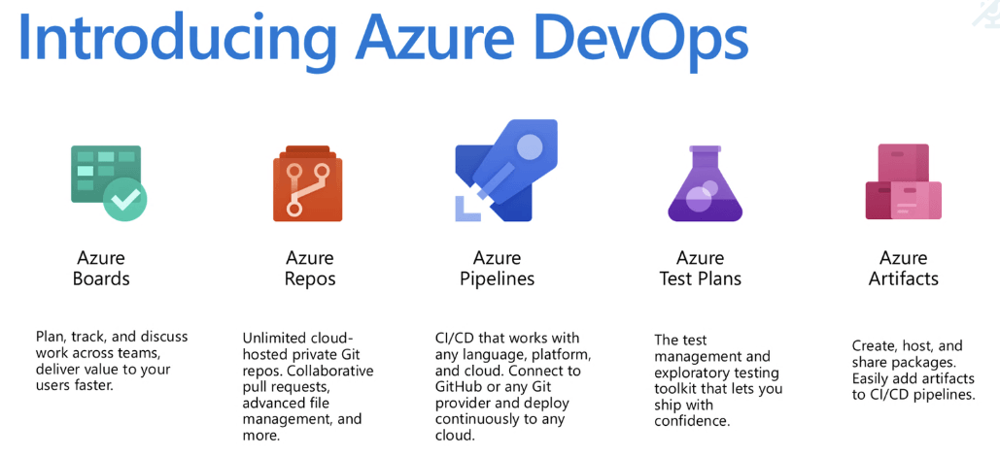
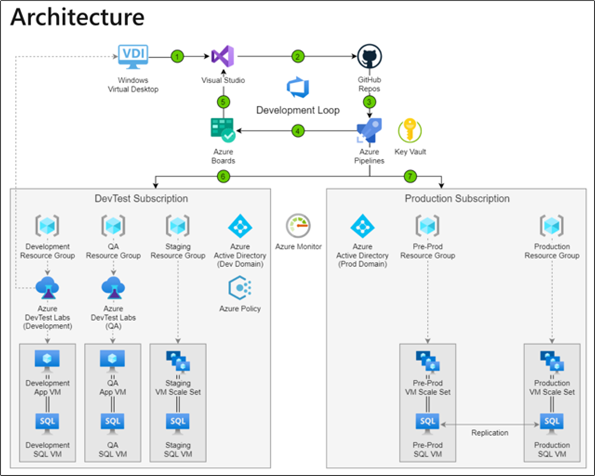

---
authors:
- jiyoung-Sung
date: "2021-02-16T00:00:00Z"
categories:
- Post
tags:
- Azure
- DevOps
- DevTest
- Architecture
title: DevTest 통한 DevOps 구성하기
---

## 1. DevOps 정의

DevOps란 개발(Development)과 운영(Operation)을 결합한 혼성어로 소프트웨어 개발 방법론의 하나이다.

 개발 과정을 들어가게 되면 개발 환경 구축, 모니터링 등의 업무처럼 담당자가 명확히 정해지지 않은 업무들이 생기고 대부분을 개발자들이 처리하다 보니 업무 처리하는 데에 있어 불균형이 발생하여 업무 분배를 명확히 하고 이에 집중하는 것이 매우 중요하다. 이를 위해서 DevOps는 애자일 방법론, 파이프라인 구축, 자동화 도구를 조직에 도입하여 개발과 운영을 보다 쉽게 실행하고 그 과정을 대시보드를 통해 공유하고 투명하게 공개하여 소통과 협업을 할 수 있게 해준다.

> Azure DevOps에서는 Boards, Pipelines, Repos, Test Plans, Artifacts 기능을 사용하여 DevOps를 원활히 진행할 수 있도록 돕는다

이 기능들은 Azure DevTest Labs와 쉽게 연동되어 개발 과정에서 조기에 테스트를 하여 개발에 더 집중할 수 있도록 해준다.
DevTest Labs에서는 개발 및 테스트를 위한 환경을 개발자가 직접 프로비젼할 수 있도록 해주고 관리자가 미리 정의한 정책대로 lab을 만들어 사용자 그룹을 묶을 수 있다. 이렇게 설정한 환경은 개발하고자 하는 프로덕션과 거의 동일한 환경이다. 이 lab 안에서 VM을 생성해 배포, 관리하여 작업을 빠르고 쉽게 만들어 주며 장비와 비용을 최소화할 수 있게 해 준다.
또한, DevTest Lab 안에서의 개발, 자체 CI/CD 파이프라인를 통한 실행, 빌드, 테스트 그리고 릴리즈 전 검증까지 일련의 단계를 거처 DevOps의 개발 과정을 수행한다.

--------
Microsoft에서 제공하는 DevOps Architecture를 살펴보자. 

## 2. IaaS에서의 Architecture
IaaS는 클라우드 공급자가 가상화 된 컴퓨팅 리소스 즉, 서버와 스토리지 등 데이터센터와 자원을 제공하고 사용자가 그 위에 운영체제, 애플리케이션 등 플랫폼을 직접 구축하여 운영하는 서비스이다.
인프라스트럭처가 가상화 기술을 통해서 제공되고 소비하는 인프라스트럭처에 대해서만 비용을 지불한다.
   

#### 1) 개발자는 Azure DevTest Labs에서 제공하는 라이브러리, 도구 및 런타임 등 적절한 Windows Virtual Desktop 이미지를 사용하여 **개발 환경을 보다 쉽게 구축한다.**
#### 2) GitHub 리포지토리는 Azure DevOps와 호환이 되어 오픈 소스 코드를 끌어와 Visual Studio에서 개발을 진행한다.
#### 3) **Azure Pipeline**를 통해 GitHub 리포지토리에서 **자동으로 CI를 수행**하고 DevTest 환경으로 전달한다. 이때, Azure Key Vault를 사용하여 비밀에 대한 접근을 제어한다.
#### 4-5) 개발자들과 운영자들이 Azure Board에서 생성된 코드와 업무, 빌드나 배포 오류에 대한 버그를 **보고** 서로 소통하여 **개발 주기를 반복한다.**
#### 6) Azure Pipeline을 통해서 구축한 환경 안에서 개발자들은 VM을 빠르게 배포하고 테스터들은 빠르게 테스트를 실행할 수 있다.
#### 7) 테스트가 완료되면 Azure Pipeline은 이미지를 일반화하여 자동으로 테스트 환경에서 프로덕션 환경으로 변경한다. 

#### - Azure Policy는 표준 및 규정 준수를 충족하기 위해 DevTest VM의 수와 비용을 제한할 수도 있다.
#### - Azure AD가 프로덕션과 DevTest에서 각각 사용되는 액세스 관리 서비스이다.
#### - Azure Monitor은 프로덕션과 DevTest 환경에서 모니터링하여 로그 데이터를 모으고 이를 Azure Security Center에서 보여준다.

## 3. PaaS에서의 Architecture
PaaS는 클라우드 공급자가 개발에 필요한 플랫폼을 제공하는 서비스로 개발자가 더 편하게 앱을 개발하고 실행 및 관리할 수 있도록 돕는다. 물리장비 이외에도 미들웨어, 운영체제 등을 제공하며 가상 머신, 가상 네트워크, 디스크 등 리소스 배포 시에 생기는 오버헤드를 줄여 효율적으로 개발이 가능하다.

#### 1-2) 개발자는 개발환경이 **미리 구성된** GitHub 코드스페이스를 공급자에게 제공받아 Azure DevOps에서 사용 가능한 GitHub 소스 코드를 이용하여 개발을 진행한다.
#### 3) GitHub Actions로 **자동화된** 빌드를 설정하고 릴리즈 워크플로우를 실행한다.
#### 4-5) 운영자와 개발자가 Azure Boards를 통해 작업 항목을 만들고 전반적인 개발 작업을 보면서 진행 상황을 **공유한다.** 또, 개발 스프린턴이나 작업 항목을 통해 분기를 수정하며 개발 주기를 유지한다.
#### 6) Azure Pipeline은 Web app과 같은 PaaS	리소스를 지원하고 VM 어플리케이션 이미지와 VM 리소스를 배포한다.
#### 7) Azure Pipeline을 통해 GitHub Actions에서 업데이트 사항을 연속적으로 개발 환경에 배포하고 테스트 상태에 따라 환경을 설정하고 스테이징 시킨다.
#### 8) 솔루션이 프로덕션 상태에 이르면 프로덕션을 릴리즈하고 배포를 최소한의 수로 제한한다.

PaaS에서는 IaaS에서와 같이 기존 Azure Key Vault, Azure Policy, Azure AD, Azure Monitor의 기능은 동일하게 가지지만 추가적으로 미들웨어, 운영체제를 지원하므로 Terraform을 통하여 Azure에서 제공되는 Azure App Service, Azure Cache for Redis, Azure SQL database을 프로비전한다.

#### - Azure App Service를 통해서 다양한 서비스를 제공하고, 특히나 Linux, Window 기반에서 언어로 애플리케이션을 쉽게 실행, 확장할 수 있는 환경과 OS 및 언어 프레임워크에 대한 유지, 보수도 지원한다.   
#### - Azure SQL Database는 PaaS 데이터베이스 엔진으로 사용자의 관여없이 대부분의 데이터 베이스 관리 함수를 처리한다.
#### - Azure Cache for Redis는 Redis를 기반한 데이터 저장소를 제공해 어플리케이션의 성능을 향상시키고 독립 실행형으로 배포하거나 다른 데이터베이스와 함께 배포할 수 있다.
이러한 서비스들을 통해서 IaaS에서는 개발 환경 설정에 고민하던 시간들을 애플리케이션 개발에 쏟을 수 있다.

---------
위에서 설명한 Architect에서 DevTest 및 Azure DevOps의 여러 도구들은 DevOps를 구축하기 위한 도구일 뿐이다. 그 구조와 도구들을 통해서 DevOps라는 일련의 과정들을 확실히 정착해야 한다.

Azure DevOps에서 Pipeline, Repos, Test Plans, Artifacts를 통해서 프로젝트 단위로 개발과 운영 작업을 진행하여 작업 상황을 서로 공유하여 구성원들이 함께 작업할 수 있도록 한다.
특히 Board를 통해서 작업 사항들을 Backlogs, Work items, Queries, Sprints를 통해 현 작업 사항들을 한눈에 다양한 형식으로 볼 수 있고, Estimate, Retrospectives는 구성원들의 의견과 건의를 받을 수 있어 소통의 장으로 사용된다.
이 때 조직 구성원들의 의견과 건의를 받아들이고 적용하는 경청과 배움의 자세를 갖추는 것이 매우 중요하다. 아무리 소통의 장을 마련하고 회의를 연다고 해도 이러한 자세를 갖추지 않는다면 DevOps 이전의 문제들은 반복되고 낭비되는 시간만 늘어날 것이다.

-----------
DevOps는 명확한 정의도 기준도 없기에 이러한 도구들을 통해 사내에서 시행착오를 겪어 정착해야 한다. A 회사에서 적용했던 방법들이 B 회사에서도 적용될 것이라는 생각을 버리고 꾸준히 정착을 위해 노력해야 한다. 이는 회사마다의 성격과 추구하는 바가 다르기에 생기는 문제이다. 끊임없는 노력들을 쌓아 간다면 우리가 흔히 생각하는 효율적인 ‘DevOps’를 우리 조직 안에서도 이룰 수 있게 될 것이다.

참조)   
<https://terms.naver.com/entry.nhn?docId=2842709&cid=40942&categoryId=32837>   
<https://cloudmt.co.kr/?p=3436>   
<https://docs.microsoft.com/en-us/azure/architecture/solution-ideas/articles/dev-test-iaas>   
<https://docs.microsoft.com/en-us/azure/architecture/solution-ideas/articles/dev-test-paas>
