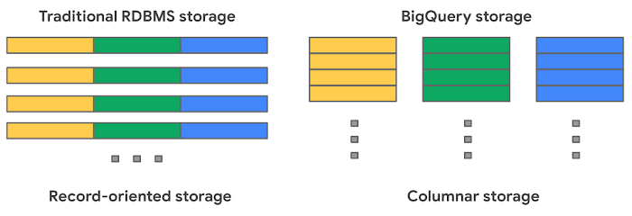
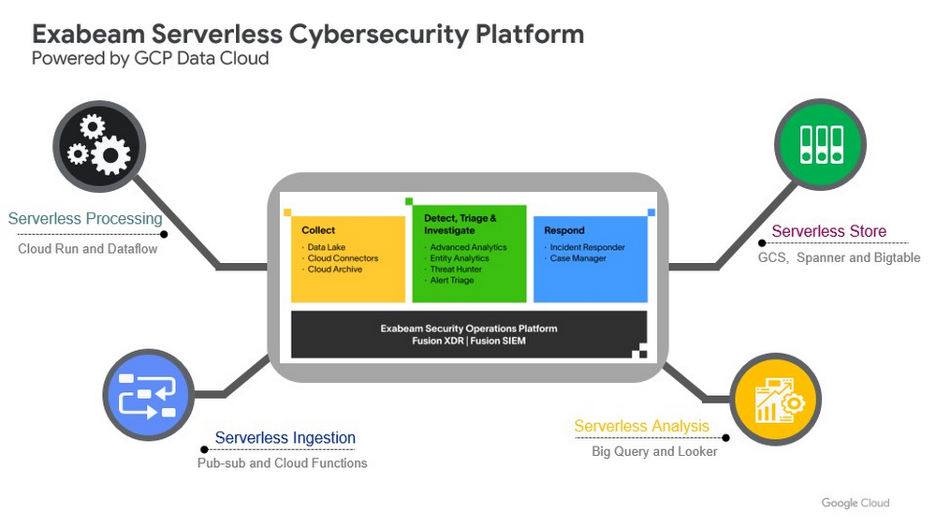

## BigQuery Compressed Storage의 GA가 기다려지는 이유

BigQuery 비용 절감을 돕기 위해 구글은 BigQuery Compressed Storage 비용 청구 모델을 곧 GA로 선보일 예정입니다. 이는 물리적으로 스토리지 비용을 낮출 수 있는 옵션이라 보면 됩니다. 실제로 BigQuery Compressed Storage는 구글 클라우드 플랫폼의 BigQuery 서비스에서 데이터를 더 경제적으로 저장하고 활용하는 길을 제시합니다. 

 

## BigQuery의 물리적 스토리지 비용 책정 모델이 개선됩니다! 

현재 공지된 일정은 2023년 7월 5일 GA로 발표되는 것입니다. 일단 GA로 공개되면 BigQuery 관련 데이터 저장 비용을 효과적으로 낮출 수 있게 될 전망입니다. BigQuery Compressed Storage 비용 청구 모델을 활성화하면 스토리지 가격은 해당 데이터 세트의 테이블에서 사용하는 압축된 바이트를 기반으로 책정됩니다.

BigQuery는 데이터 세트를 기본 청구 단위로 삼는 논리적 가격 책정 모델과 함께 압축 후 스토리지에 저장한 데이터를 기반으로 계산하는 물리적 가격 모델을 따라왔습니다. 이 중 물리적 모델의 경우 BigQuery Compressed Storage 출시로 더욱 합리적인 과금이 가능해질 것으로 보입니다. 

BigQuery는 높은 압축률을 통해 비용 절감 효과를 제공해 왔습니다. BigQuery 테이블이 압축되어 있으면 테이블의 논리적 바이트와 테이블의 청구 가능한 바이트 크기가 다르므로 해당 테이블을 쿼리하는 비용이 낮아 집니다. 

말이 나온 김에 BigQuery의 압축률이 높은 이유를 알아볼까요. Postgres 및 MySQL 같은 관계형 데이터베이스는 데이터를 레코드 지향 스토리지에 행별로 저장합니다. 따라서 데이터를 읽거나 쓰기 위해 단일 행만 열면 되므로 트랜잭션 업데이트 및 OLTP에 적합합니다. 그러나 전체 열의 합계와 같은 집계를 수행하려면 전체 테이블을 메모리로 읽어야 합니다. BigQuery는 각 열이 별도의 파일 블록에 저장되는 열 기반 스토리지를 사용합니다. 따라서 BigQuery는 OLAP에 이상적이라 할 수 있습니다. 집계를 할 경우 집계 중인 열을 읽기만 하면 됩니다. BigQuery는 Capacitor라는 독점 열 형식으로 데이터를 저장합니다. 

  

 

 
 
## BigQuery Compressed Storage로 비용을 줄인 사례

실제 사례를 좀 알아 볼까요. SIEM 및 XDR의 선두 주자인 Exabeam은 BigQuery, Dataflow, Looker, Spanner, Bigtable 등 Google Cloud를 활용하여 500개 이상의 보안 공급 업체에서 원격 측정 데이터를 수집하고, 비정형 데이터를 보안 이벤트로 변환하고, 비용 효율적인 방식으로 저장할 수 있는 공통 플랫폼을 개발해 운영하고 있습니다. Exabeam은 BigQuery Compressed Storage를 적용하여 12:1 이상의 압축률을 달성했으며 사용하는 압축된 바이트를 기반으로 비용을 낼 수 있게 되어 더 적은 비용으로 많은 데이터를 저장해 활용할 수 있게 되었습니다. 

다른 사례도 하나 알아보겠습니다. 모바일 게임 기업인 Playgendary는 두 가지 측면에서 비용을 줄였습니다. 하나는 두잇(DoiT)이란 회사가 개발한 DoiT BigQuery Lens를 이용해 사용하지 않는 테이블을 식별해 제거하는 작업이었습니다. 다른 하나는 BigQuery Compressed Storage 가격 모델을 사용한 것입니다. Playgendary는  BigQuery Lens와 BigQuery Compressed Storage를 통해  BigQuery 관련 비용을 50% 이상 줄였다고 합니다.

BigQuery Compressed Storage 가격 모델로 바꾸면 물리적인 스토리지 비용 절감 효과를 경험할 수 있습니다. 그러나 이러한 절감 효과는 데이터의 종류, 크기, 쿼리 패턴 등에 따라 다를 수 있으므로 클라우드메이트 같은 파트너를 통해 사용 사례별로 실제 절감 효과를 평가하는 것이 중요합니다. BigQuery Compressed Storage가 더 궁금하다면 지금 바로 연락 주세요. 

