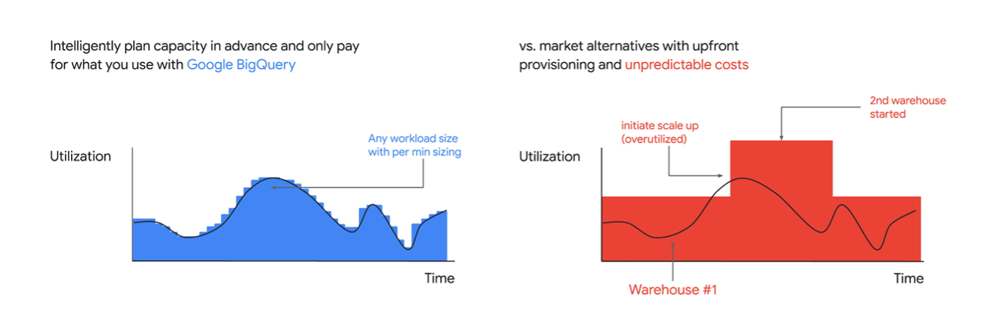
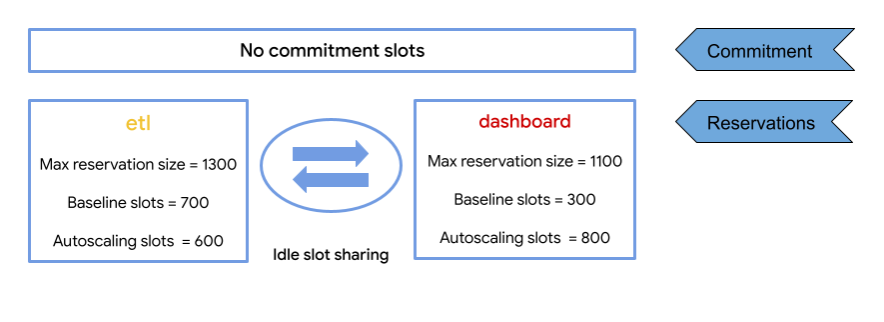

BigQuery Autoscaler를 들어 보셨나요? BigQuery Autoscaler는 이름에 특징이 잘 담겨 있습니다. 이를 활용하면 분석 워크로드의 컴퓨팅 파워 요구 증가에 맞춰 자동으로 슬롯을 확장합니다. 접속 폭주 상황이 발생하면 오토스케일링 기능으로 서버 자원을 자동 확장해 대응하는 것과 똑같습니다. 다만 워크로드가 분석이란 것이 차이라 할 수 있습니다.  

 

## BigQuery 비용 최적화 

BigQuery Autoscaler를 구글 클라우드가 제공하는 이유는 BigQuery Edition을 이용하는 고객의 비용 최적화를 돕기 위해서입니다. BigQuery의 비용 청구 모델은 데이터 스캔과 용량을 기준으로 합니다. 이 방식으로 비용을 책정한 것이 벌써 10년이 넘었네요. 이 과금 모델은 컴퓨팅 자원을 자동으로 조정하는 것과는 거리가 좀 있습니다. 이를 보완하기 위해 구글 클라우드는 가변 슬롯 옵션을 제공하였습니다. 그러던 것에서 2023년 구글 클라우드는 BigQuery Autoscaler를 통해 가격 책정 모델에 유연성을 더하였습니다.  

BigQuery Autoscaler는 워크로드 요구 사항에 맞게 컴퓨팅 리소스를 실시간으로 추가하고 사용한 용량만큼만 지불하는 온디맨드 옵션입니다. BigQuery Autoscaler가 비용 최적화에 딱 좋은 이유는 분석 워크로드의 특성에서 찾을 수 있습니다. 분석 워크로드의 경우 특정 시점에 자원을 집중적으로 사용하는 특징이 있습니다. 예를 몇 가지 들어 볼까요? 

- 연말연시 프로모션 시즌  
- 회계 결산 시기  
- 신제품 출시 초기 다양한 분석을 하는 기간  
- 코로나19 처럼 글로벌 이슈로 데이터 플랫폼을 확장해야 하는 때 

 
 
BigQuery는 서버리스 기반 서비스입니다. 따라서 가상 머신 기반 서비스와 달리 초 단위 요금 청구에 유리합니다. 이런 특징을 살려 BigQuery Autoscaler는 슬롯/시간 구조로 비용을 청구합니다. 슬롯당 1시간을 기준으로 이용 요금을 초 단위로 청구합니다. 복잡하게 들릴 수 있는데 막상 계산을 해보면 심플합니다. 예를 들자면 단일 슬롯을 3,600초 시간 동안 사용한다면 1.0슬롯/1시간에 대한 요금이 청구됩니다. 만약 900초를 이용했다면 이는 0.25슬롯/1시간으로 요금을 계산합니다.  

  

## 정액제 예약에서 BigQuery Autoscaler로 바꾸어 비용 줄이기  

 

기존에 정액 청구제를 이용 중인데 BigQuery Autoscaler로 변경하고 싶다면 예약 설정만 바꾸면 됩니다. 기존 슬롯 약정 방식으로 비용을 줄이는 것도 좋지만 스케줄링 기반의 작업이나 특정 시즌에 몰리는 워크로드의 경우 BigQuery Autoscaler가 더 좋은 선택이 될 수 있습니다. BigQuery Autoscaler는 슬롯 숫자를 100개 단위로 확장합니다. 물론 무한 확장을 하는 것은 아닙니다. 사전에 할당된 범위 내에서 슬롯 수를 늘려 컴퓨팅 파워 요구에 대응하고 쿼리 수행을 위해 더 이상 자원이 필요 없으면 다시 원래 규모로 축소됩니다. 슬롯 예약에 대한 상세 가이드는 구글 클라우드의 매뉴얼 페이지를 참조 바랍니다.  

 

슬롯 예약 개념을 간단히 살펴보겠습니다. 예약하는 슬롯은 기준(Baseline) 슬롯과 자동 확장(Autoscaling) 슬롯으로 구분을 할 수 있습니다. 이들 슬롯이 실제 자원 확장 요구가 있을 때 어떻게 늘어나는지 알아보겠습니다.  

 

다음 예를 보시죠. ETL 작업과 대시보드 두 개의 예제입니다. ETL 작업을 위한 기준 슬롯은 700개, 대시보드용으로 잡아 놓은 슬롯은 300개입니다. ETL 작업에 부하가 걸릴 때를 대비해 잡아 놓은 자동 확장 슬롯은 600개이고, 대시보드의 경우 800개입니다. 총 사용 가능한 슬롯 수는 기준 슬롯과 유휴 슬롯을 합한 것입니다. 더해보면 ETL에는 1,300개, 대시보드에는 1,100개가 최대 유휴 슬롯인 셈이죠.  

 

BigQuery Autoscaler 옵션으로 슬롯을 예약하면 좋은 점 중 하나는 다음 예와 같이 ETL, 대시보드 각각에 유휴 슬롯을 예약해 놓았을 경우 어느 한쪽 워크로드의 자원이 모자랄 경우 다른 쪽의 아이들 슬롯을 공유할 수 있다는 것입니다.  

 

 

 

BigQuery Autoscaler는 여러모로 좋은 가격 모델이라 할 수 있습니다. 이를 잘 활용할 때 얻을 수 있는 이점을 마지막으로 간단히 정리해보겠습니다.  

 

- 비용 절감: 수요에 따라 슬롯 수를 동적으로 조정하여 사용하지 않는 용량에 대한 비용을 지불하지 않아도 됩니다. 특히 워크로드가 가변적인 시나리오에서 즉각적인 비용 절감으로 이어질 수 있습니다. 

- 성능 향상: 자동 확장을 적용하면 쿼리 실행에 필요한 리소스를 제공하여 워크로드의 성능을 개선할 수 있습니다. 

- 간소화된 용량 계획: 자동 확장 기능을 사용하면 BigQuery 워크로드에 대한 용량을 계획하고 관리하는 데 시간과 노력을 들일 필요가 없습니다. 그 대신, BigQuery가 필요에 따라 리소스를 자동으로 확장하므로 데이터 분석 프로젝트에서 더 중요한 작업에 집중할 수 있습니다. 

- 유연성: 자동 확장은 다양한 수준의 수요를 가진 워크로드를 유연하게 관리하여 적시에 적절한 리소스를 확보할 수 있도록 해줍니다. 

 

현재 BigQuery를 이용 중이고, 비용 최적화에 관심이 많다면 클라우드메이트로 연락 바랍니다. 2023년 초 달라진 BigQuery 가격 모델을 기준으로 비용 절감을 위한 쉽고 빠른 길을 안내하겠습니다. 또한 캐시엔진을 통한 데이버 분석 비용절감 시나리오가 궁금하시다면, 아래의 웨비나를 놓치지 마세요!  

 
 

## [웨비나] 캐시엔진을 활용하여 빅쿼리(BigQuery) 200% 활용하기 
### 2023년 04월 26일(수) 14:00~15:00 
이번 웨비나를 통해 실시간 데이터 분석의 방법론과 특히 빅쿼리(BigQuery)를 가장 효과적으로 사용하는 방법에 대해 설명해 드리고자 합니다. 특히 다른 실시간 데이터 처리 방법들에 비해서 얼마나 효과가 있는지를 BMT(벤치마킹 테스트)의 구체적인 결과로 공유해 드립니다. 도입 전에 확실한 장단점 분석과 비교가 가능하실 것 같네요. 

  

이런 분들이라면 무조건 사전등록 필수! 

  -  실시간 빅데이터 분석의 트렌드와 방향에 대해서 궁금하신 분 

  -  데이터 처리를 위해 어떤 제품을 선택해야 하는지 고민이신 분 

  -  데이터 분석을 위해 빠른 연산 & 응답이 필요한 개발자 또는 데이터 분석가 

  -  제한된 예산안에서 효율적인 데이터 분석을 원하시는 분 

사전등록 바로가기 https://chontv.com/event/899
