안녕하십니까. 클라우드메이트 조한준입니다.

이번 블로그에서는 Grafana를 이용하여 Azure PlayFab을 모니터링하는 방법에 대하여 알아 보겠습니다.

수 개월 전 Azure PlayFab을 사용하고 있는 게임 서비스 업체와의 미팅이 있었습니다.
이와 관련하여 Azure PlayFab에 대하여 나름대로 조사를 해보았습니다.

어떤 서비스인지 간략하게 소개를 해 보겠습니다. 

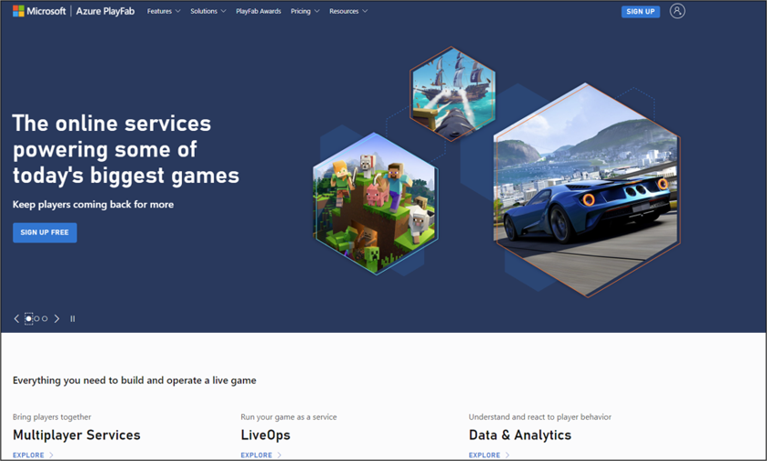
## Azure PlayFab이란?

Azure PlayFab은 라이브 게임의 빌드와 운영을 위한 종합적인 LiveOps 백 엔드 플랫폼이라고 정의할 수 있을 텐데요.

PlayFab의 백 엔드 서비스는 게임과 함께 확장되고 플레이어의 참여, 유지, 수익 창출에 도움이 되는 비용 효율적인 개발 솔루션인 스튜디오를 제공합니다.

이로써, 게임 개발자의 진입 장벽을 낮출 수 있다고 하며, 

또한, 개발자가 인텔리전트 클라우드를 사용하여 게임을 빌드 및 운영하고, 게임 데이터를 분석하고, 전반적인 게임 환경을 개선할 수 있다고도 합니다.

**게임 개발 및 운영에 있어서 클라우드를 효율적으로 활용할 수 있는 플랫폼인 것은 확실하다고 할 수 있을 거 같네요.**

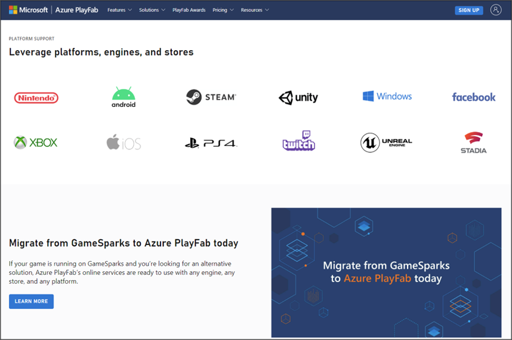

---

## Azure PlayFab Metric 도출
**미팅에서 고객이 요구한 사항은 “Azure 리소스, PlayFab 리소스에 대한 대시보드 구성 / 모니터링 / 관제를 해줄 수 있나?”라는 내용이었습니다.**

그래서 다음과 같이 고려해 보았습니다.

* Metric 수집 : Azure Monitor Or Azure Data Explorer
* 대시보드 구성, 모니터링 : Grafana 이용
* 관제 : 회사 NOC 솔루션 이용

추가적으로 BaaS 형태인 Azure PlayFab에서 서비스 이용자에게 제공하는 데이터 중에서 VM의 비정상 상태를 나타내는 이벤트와 데이터를 어떻게 수집할 수 있을까에 대하여 고민을 하게 되었습니다.
Azure PlayFab 공식 문서들을 보던 중, VM metrics 항목이라는 페이지가 존재합니다.

https://learn.microsoft.com/en-us/gaming/playfab/features/multiplayer/servers/vm-metrics

system level metrics (CPU/RAM/etc.) for the Virtual Machines을 제공한다고 되어 있긴 합니다만,웹 서비스 형태로 보여주기만 하는 것 같습니다. 
현재 미리보기 상태이며 실험적이라고 되어 있네요.
난감한 상황입니다.

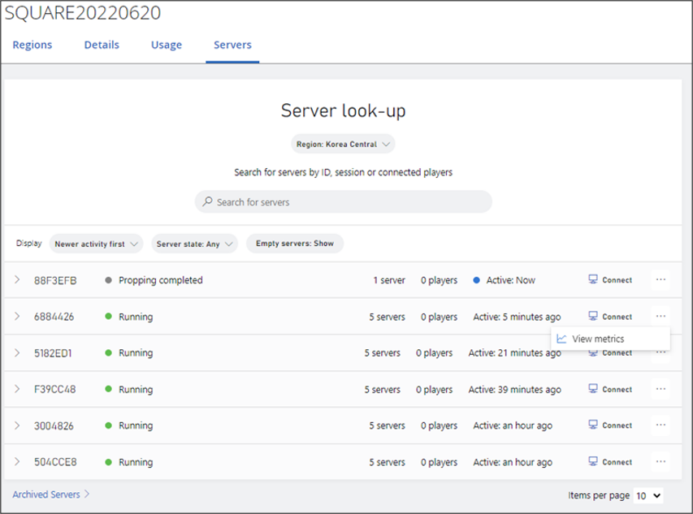

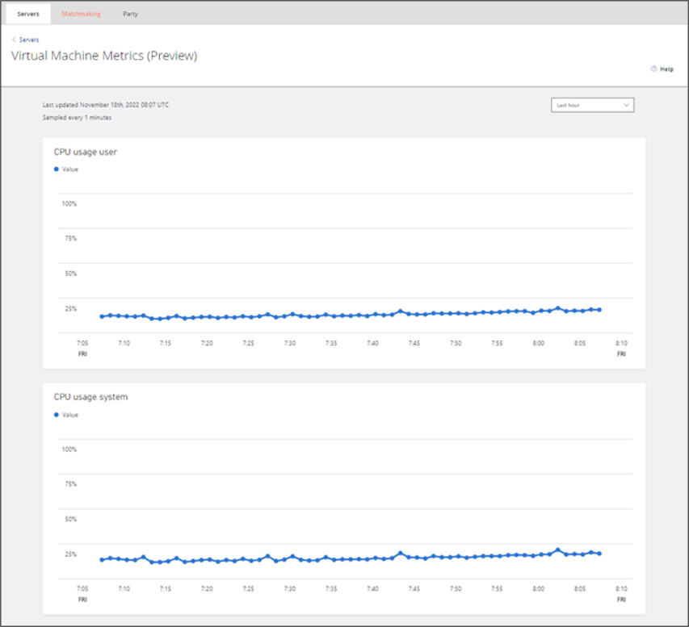

그래서, 단일 게임 타이틀에 대한 모든 이벤트와 데이터들을 저장하고 있는 데이터베이스를 사용하기로 하였습니다. 
Azure PlayFab 은 단일 게임 타이틀에 대한 모든 이벤트 및 처리된 데이터를 클라우드의 단일 타이틀 데이터베이스로 수집합니다.

Azure Managed Grafana에서는 수집된 data들을 Azure Data Explorer를 통하여 Access 할 수 있습니다. 
Azure PlayFab 웹 서비스에서는 data들을 다음과 같이 Kusto Query(KQL)를 통하여 Viewing 할 수 있습니다.

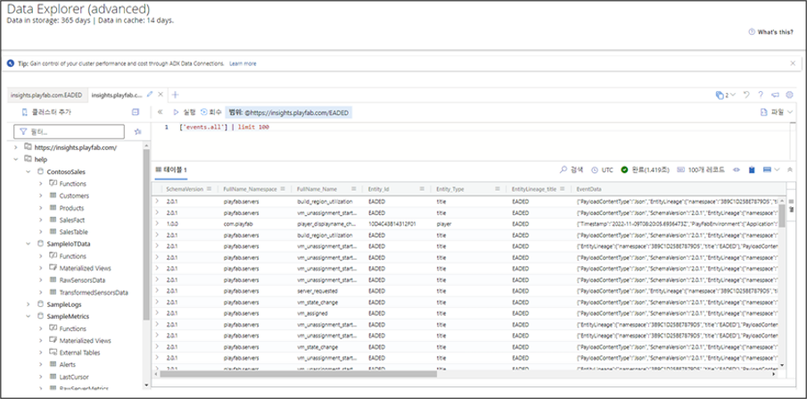

data를 확인하며, 모니터링에 활용할 수 있는 VM 이벤트들을 조사해 보기로 합니다.

조사해본 결과, 'playfab.servers'의 'vm_unhealthy' 이벤트를 찾을 수 있었습니다.

Json 포맷 데이터를 예시로 들자면 아래와 같습니다.

'''
{
  "EntityLineage":{
  "namespace":"3B9C1D25BE7879D5",
  "title":"EADED"
  },
  "Timestamp":"2022-09-13T14:03:40.2573414Z",
  "PayloadContentType":"Json",
  "SchemaVersion":"2.0.1",
  "Originator":{
  "Type":"service",
  "Id":"playfab"
  },
  "FullName":{
  "Namespace":"playfab.servers",
  "Name":"vm_unhealthy"
  },
  "Payload":{
    "BuildId":"50de9471-a984-42ba-b67a-5927c1737e99",
    "Region":"KoreaCentral",
    "VmId":"xxxx:KoreaCentral:xxxxx_5463xxx2-3ff9-41ef-b2f0-898xxxxd9d8:984a9c2b-3506-4ae3-aef4-844c4c615680",
    "HealthStatus":"NoServerHeartbeat"
  },
  "Id":"19c2f0f5903741c4b4ff632d303d9751",
  "Entity":{
  "Type":"title",
  "Id":"xxxxx"
  }
}
'''

아래와 같이 playfab.servers.vm_unhealthy 이벤트의 HealthStatus들을 찾을 수 있었습니다.

https://docs.microsoft.com/en-us/gaming/playfab/features/multiplayer/servers/multiplayer-build-region-lifecycle

각각의 HealthStatus에 대하여 기술해 봅니다.

* NoServerHeartbeat : 배포 중에 실패가 발생됨을 의미함. 어떤 게임 서버도 시작한 뒤 10분이 지날 때까지 GSDK를 통해 하트비트를 전송하지 않았습니다. 
                      이는 일반적으로 서버가 충돌하고 있음을 나타냅니다. 지역의 각 VM에 대해 NoServerHeartbeat 상태가 표시됩니다.
* NoAgentHeartbeat : PlayFab 멀티 플레이어 에이전트 자체가 충돌하고 있거나 VM에서 초기화되지 않고 있습니다(드문 경우). 
                      기본적으로 멀티 플레이어 서비스가 10분이 지날 때까지 에이전트로부터 하트비트를 받지 못했습니다.
* TooManyServerRestarts : 배포와 관련이 있는 것 같습니다. 서버 빌드에 대한 컨테이너화 확인 필요를 의미한다고 하네요.

추가적으로 API호출 및 처리에 대한 이벤트들이 있는지도 조사해 봅니다.
playfab.functions의 function_executed라는 이벤트가 있네요.

'''
{
  "PayloadContentType":"Json",
  "EntityLineage":{
  "namespace":"3B9C1D25BE7879D5",
  "title":"EADED",
  "master_player_account":"1150114A725309AB",
  "title_player_account":"8D0013EA5D4FD0D0"
  },
  "SchemaVersion":"2.0.1",
  "Originator":{
  "Type":"title_player_account",
  "Id":"8D0013EA5D4FD0D0"
  },
  "Timestamp":"2022-11-13T20:27:49.9944743Z",
  "FullName":{
  "Namespace":"playfab.functions",
  "Name":"function_executed"
  },
  "Payload":{
    "Source":"API",
    "ExecutionTimeMilliseconds":1105,
    "ResultTooLarge":false,
    "FunctionName":"xxxxxxxxxx",
    "Result":{
      "ErrorCode":0,
      "values":{
        "IPV4Address":"20.196.197.59",
        "Port":"30001"
      }
    }
  },
  "Id":"001301a3a612410f8d8b120eb0727314",
  "Entity":{
    "Type":"title_player_account",
    "Id":"8D0013EA5D4FD0D0"
  },
  "OriginInfo":{
  }
}
'''

이상을 종합하여 수집할 항목들을 리스트업 해 봅니다. 
(Functions, Storage 의 Name은 임의로 A,B라 하였습니다.)

PlayFab VM 리소스 이벤트에만 관제를 적용하기로 합니다.

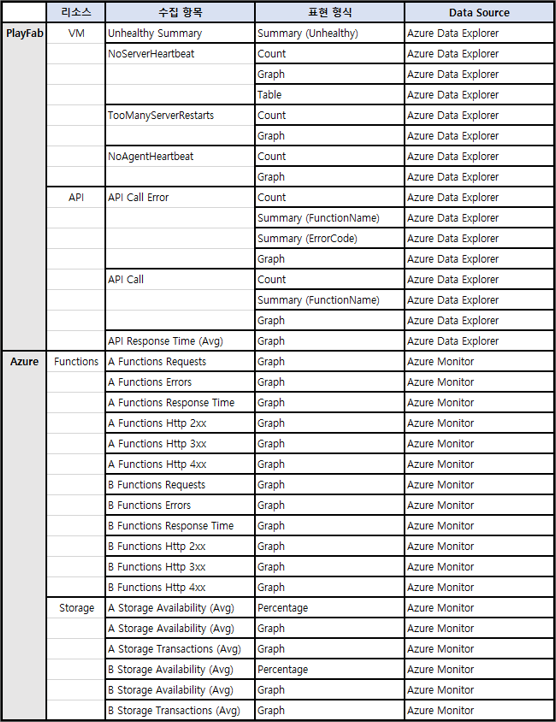

---

## Azure Managed Gragana 구성
Azure Managed Grafana를 구성하여 모니터링 대시보드를 만듭니다. 
아래의 과정을 참고하시기 바랍니다.

https://learn.microsoft.com/en-us/azure/managed-grafana/quickstart-managed-grafana-portal?source=recommendations

위의 문서를 참고하여 Managed Grafana Instance를 만들어 줍니다.

https://learn.microsoft.com/en-us/gaming/playfab/features/insights/connectivity/connecting-grafana-to-insights

위의 링크를 참조하여 Grafana를 Azure PlayFab의 데이터베이스에 연결합니다.

그리고, Configuration에서 Data sources를 설정하여 줍니다.

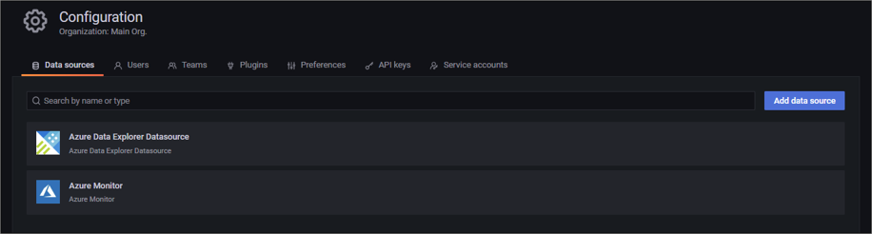

Azure Monitor Setting 탭에서 Authentication, Default Subscription을 설정하여 줍니다.

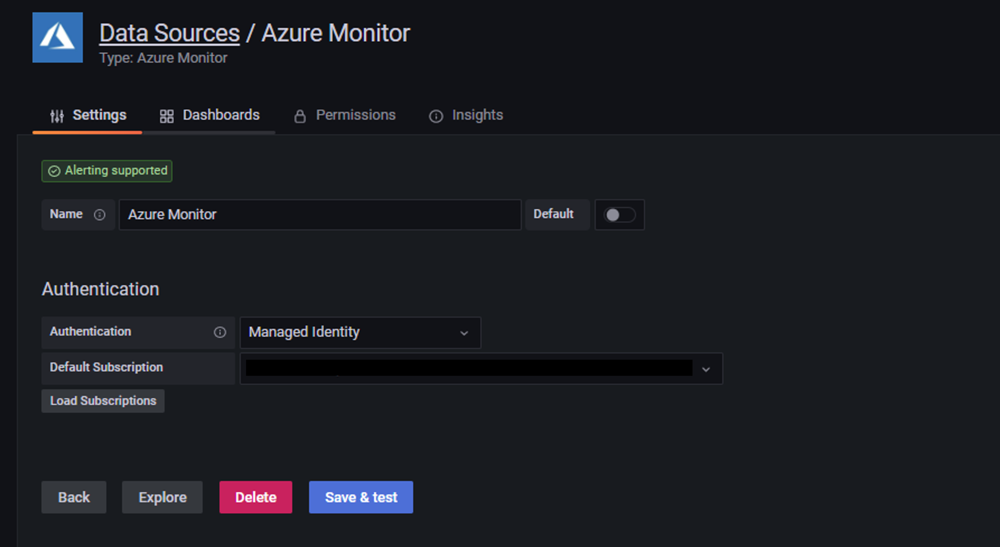

Azure Data Explorer Datasource Setting 탭에서 Connection Details, Query Optimizations, Database schema settings 섹션의 값들을 설정하여 줍니다.

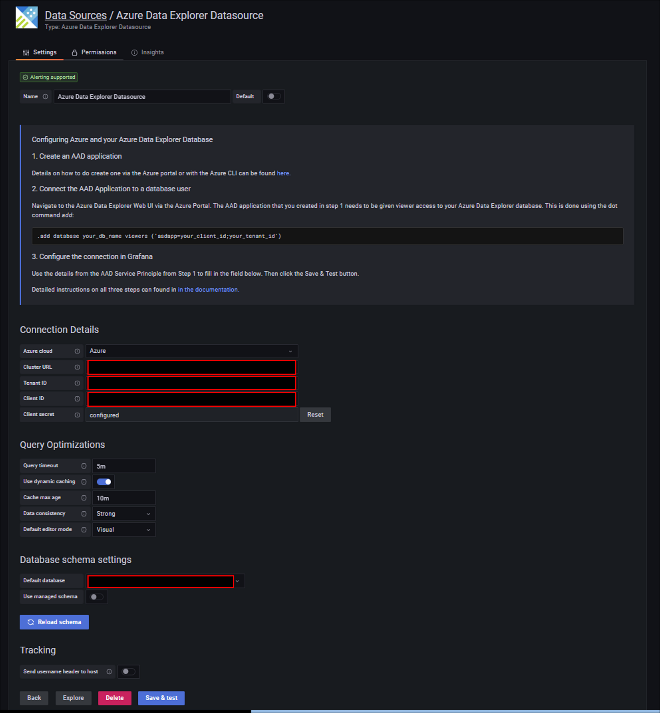

위의 과정들을 거치면, Grafana를 통한 Azure Monitor, Azure PlayFab의 데이터 연동이 가능하게 됩니다.

시각화 판넬은 4개로 정의하여 대시보드를 구성하기로 하였습니다.

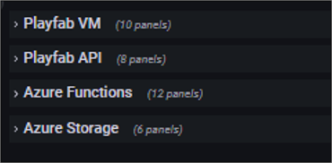

Azure Managed Grafana에서 대시보드, 판넬, Graph 등의 컴포넌트를 만들어 줍니다.
Grafana 사용법은 Grafana 공식 사이트를 참고하시기 바랍니다.

---

## Azure Monitor Data 시각화
고객사의 Azure Functions, Azure Storage 관련 metric들을 시각화 합니다.

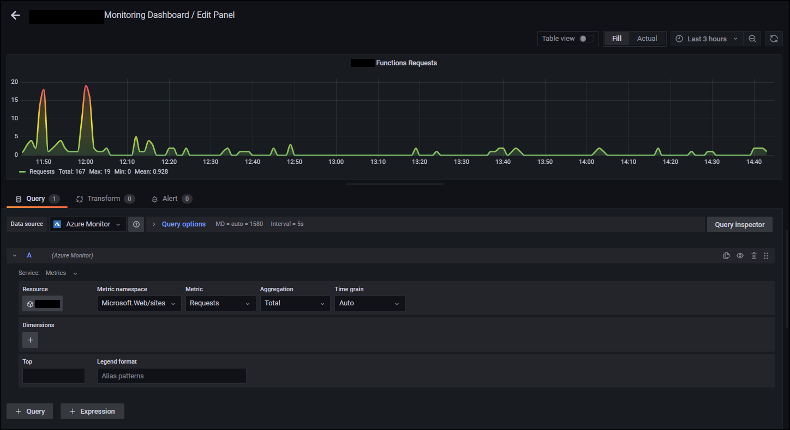

각각의 컴포넌트에 Resource, Metric의 값들을 지정하여 줍니다.

Azure Functions Row(Section)는 아래와 같이 구성하였습니다.

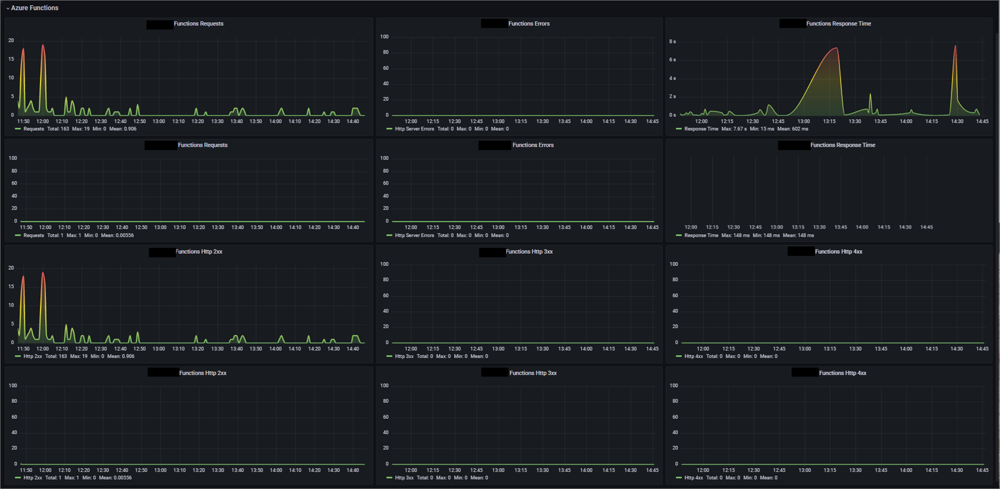

Azure Storage Row(Section)는 아래와 같이 구성하였습니다.

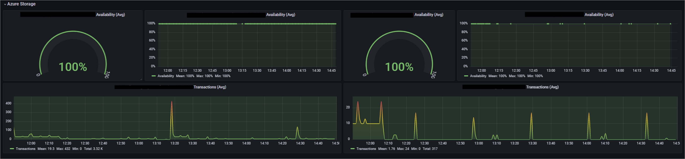

---

## Azure PlayFab VM, API 이벤트 시각화
Azure PlayFab의 VM, API 이벤트들은 Kusto Query(KQL)를 사용하여 Data들을 불러온 후 시각화 하게 됩니다.

아래는 VM NoServerHeartbeat 이벤트를 table 형식으로 viewing하는 컴포넌트입니다.

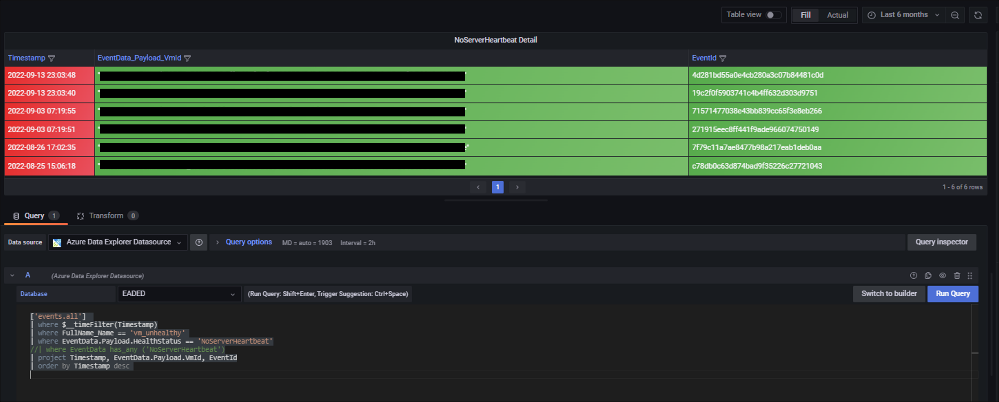

Data source와 KQL Query를 설정하여 data를 불러옵니다.
<pre><code>
['events.all']
| where $__timeFilter(Timestamp)
| where FullName_Name == 'vm_unhealthy'
| where EventData.Payload.HealthStatus == 'NoServerHeartbeat'
| project Timestamp, EventData.Payload.VmId, EventId
| order by Timestamp desc
</code></pre>
Grafana의 컴포넌트 시각화 기능을 사용하여 불러온 data를 시각화 합니다.

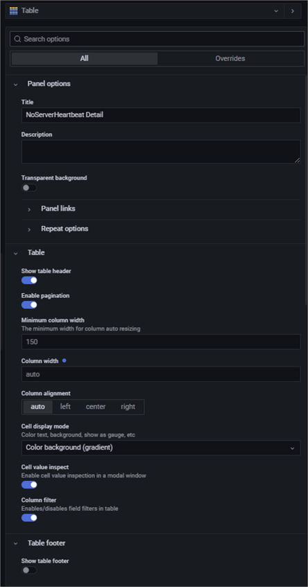

KQL에 대해서는 Azure Data Explorer 설명서를 참고하시기 바랍니다.

https://learn.microsoft.com/en-us/azure/data-explorer/kusto/query/

Azure Managed Grafana에서는 각 컴포넌트마다 Data source와 Query들을 설정하여 metric을 시각화 합니다.
특이한 점은 Time series 컴포넌트에서만 Alert를 설정할 수가 있습니다. 
따라서 Alert 설정이 필요한 metric. 즉, 관제가 필요한 metric은 Time series 컴포넌트를 사용하여 metric을 시각화 하여야 합니다.

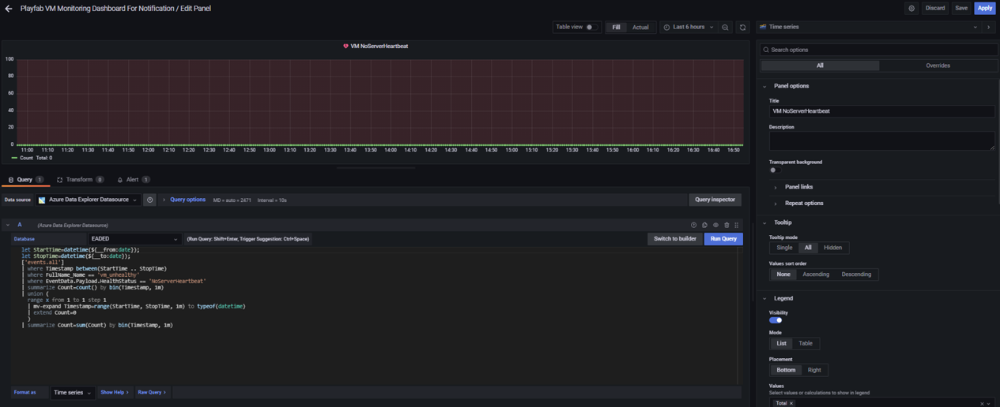

그리고 VM NoServerHeartbeat 이벤트를 Time series 형식에 맞게 KQL을 작성합니다.
다음 쿼리는 5분 단위로 NoServerHeartbeat 이벤트를 count하고 집계하는 KQL의 한 예입니다.
또한, data가 존재하지 않는 5분 단위의 구간은 0으로 data를 채워주는 서브 Query도 포함되어 있습니다.

<pre><code>
let StartTime=datetime(${__from:date});
let StopTime=datetime(${__to:date});
['events.all']  
| where Timestamp between(StartTime .. StopTime) 
| where FullName_Name == 'vm_unhealthy'
| where EventData.Payload.HealthStatus == 'NoServerHeartbeat'
| summarize Count=count() by bin(Timestamp, 5m)
| union ( 
  range x from 1 to 1 step 1 
  | mv-expand Timestamp=range(StartTime, StopTime, 5m) to typeof(datetime) 
  | extend Count=0 
  )
| summarize Count=sum(Count) by bin(Timestamp, 5m)
</code></pre>

5분 단위의 이벤트 집계를 통하여 Alert를 발생시키는 것도 좋지만, 
더욱더 세밀한 모니터링과 Alert를 발생시키려면
1분 단위의 이벤트 집계로 표현하여 Alert를 발생시키는 것이 바람직하다는 생각이 드네요.

<pre><code>
let StartTime=datetime(${__from:date});
let StopTime=datetime(${__to:date});
['events.all']  
| where Timestamp between(StartTime .. StopTime)
| where FullName_Name == 'vm_unhealthy' 
| where EventData.Payload.HealthStatus == 'NoServerHeartbeat'
| summarize Count=count() by bin(Timestamp, 1m)
| union ( 
  range x from 1 to 1 step 1 
  | mv-expand Timestamp=range(StartTime, StopTime, 1m) to typeof(datetime) 
  | extend Count=0
  )
| summarize Count=sum(Count) by bin(Timestamp, 1m)
</code></pre>

그래서, 위와 같이 작성한 KQL Query를 사용하여 모니터링 대시보드를 따로 구성하고 그 컴포넌트 각각에 Alert를 적용하기로 하였습니다.
마찬가지로, Azure PlayFab API 이벤트들도 시각화 합니다.

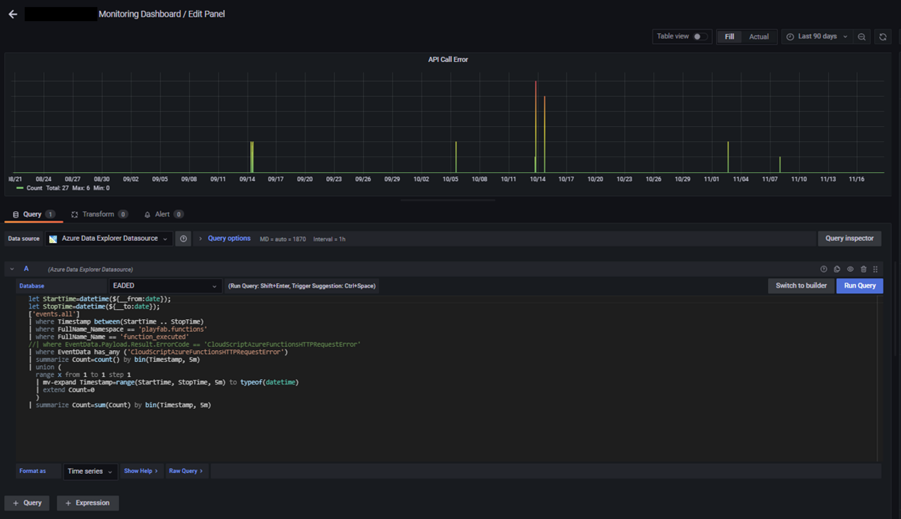

Data source와 KQL Query를 설정하여 data를 불러옵니다.

<pre><code>
let StartTime=datetime(${__from:date});
let StopTime=datetime(${__to:date});
['events.all']  
| where Timestamp between(StartTime .. StopTime) 
| where FullName_Namespace == 'playfab.functions'
| where FullName_Name == 'function_executed' 
| where EventData.Payload.Result.ErrorCode == 'CloudScriptAzureFunctionsHTTPRequestError'
| summarize Count=count() by bin(Timestamp, 5m)
| union ( 
  range x from 1 to 1 step 1 
  | mv-expand Timestamp=range(StartTime, StopTime, 5m) to typeof(datetime) 
  | extend Count=0 
  )
| summarize Count=sum(Count) by bin(Timestamp, 5m)
</code></pre>

Grafana의 컴포넌트 시각화 기능을 사용하여 불러온 data를 시각화 합니다.

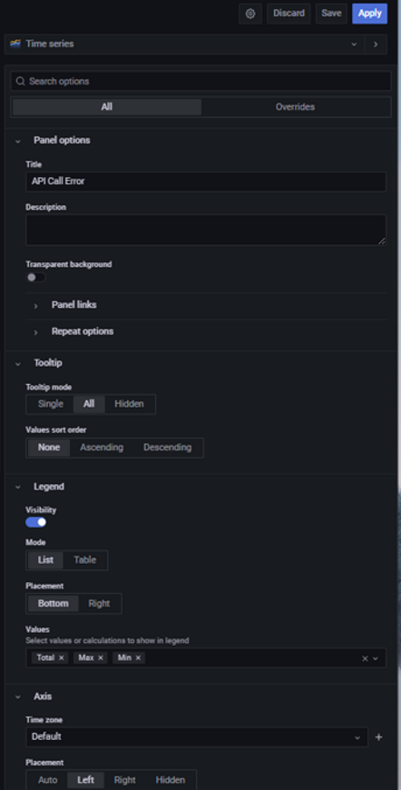

최종적으로, VM unhealthy 이벤트를 1분 단위의 집계로 표현한 

### 관제용 대시보드 2개

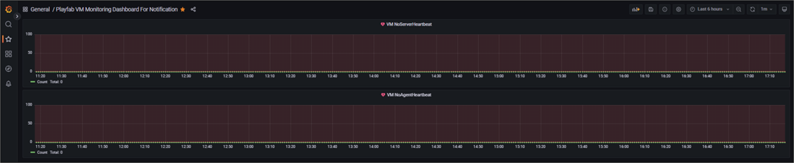
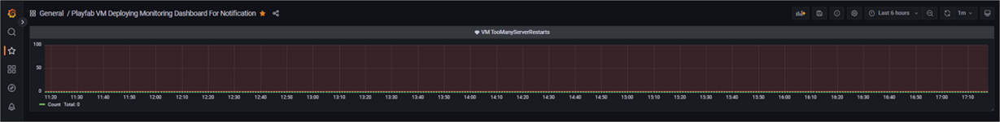

그리고, 4개의 Row(Section)로 이루어진 모니터링 대시보드 1개를 구성하였습니다.

### PlayFab VM 모니터링

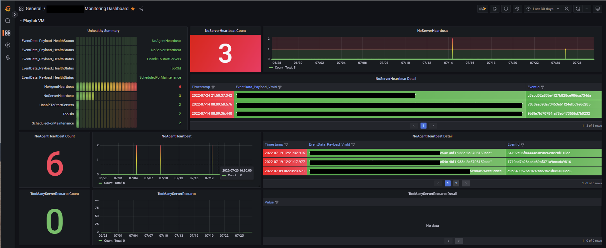

### PlayFab API 모니터링

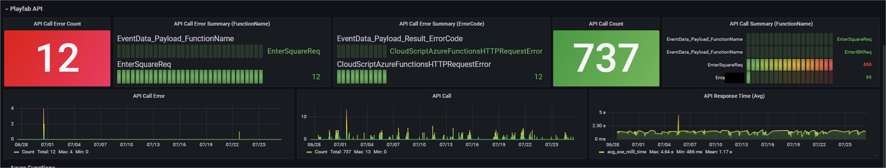

### Azure Functions 모니터링

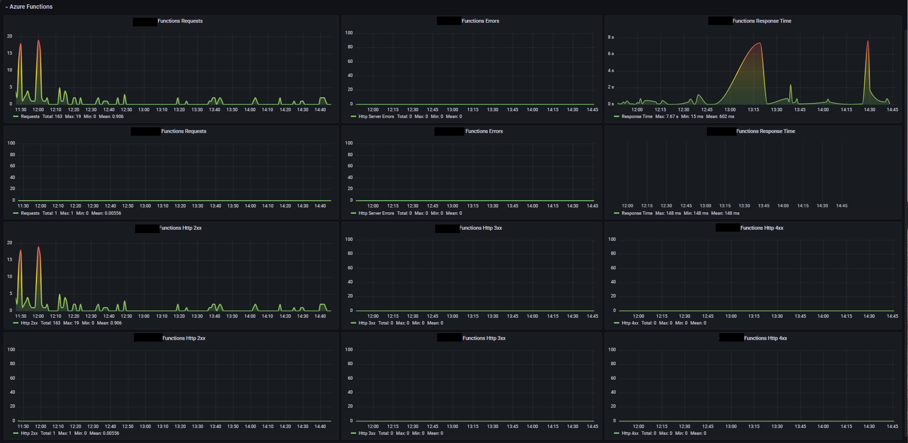

### Azure Storage 모니터링

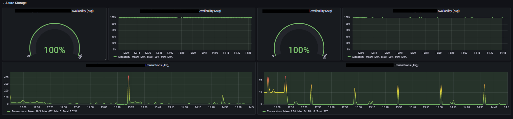

---

## Alert 설정
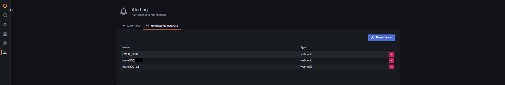

Alerting 메뉴로 이동하여 Notification channels 탭에서 New channel을 등록합니다.

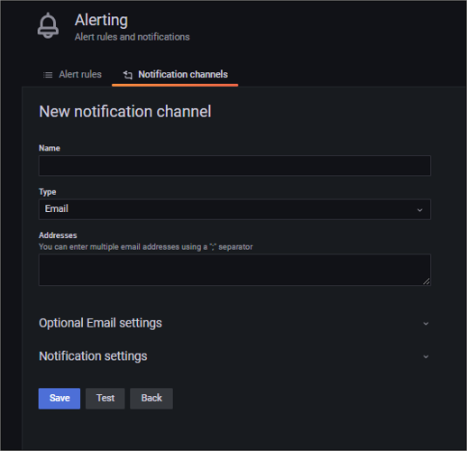

Type에는 여러가지 방식이 있는데 webhook Type으로 우리 회사의 NOC 솔루션을 이용하기로 합니다. 
Url도 등록하여 줍니다. 등록 시 Test 버튼을 통하여 Test도 가능합니다.

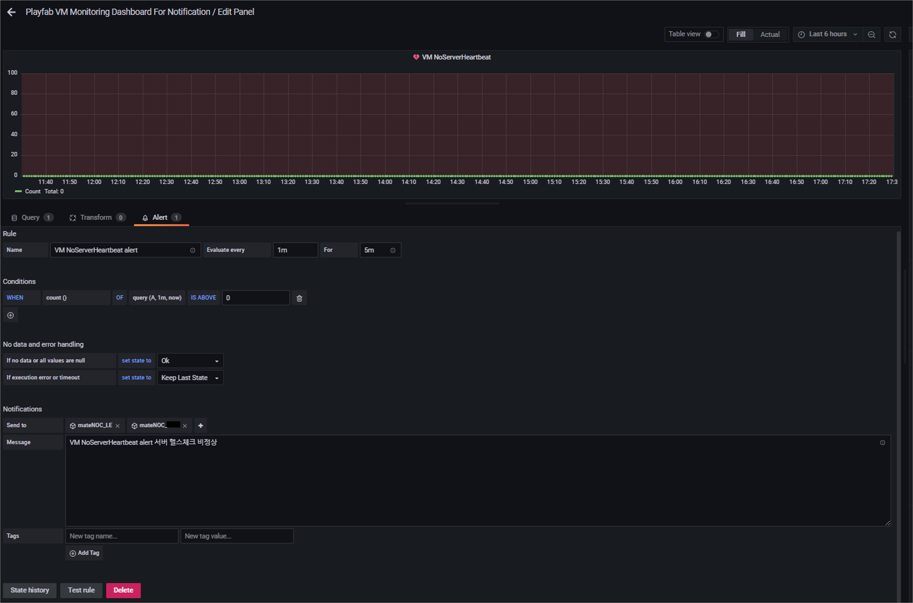

Alert 탭에서 Rule을 설정합니다.
Conditions, No data and error handling 값들을 설정합니다.
Notifications에서는 위에서 등록한 channel과 Message를 설정하면 됩니다.
이로써 Alert 설정까지 마쳤습니다.

---

## 마무리하며
Azure PlayFab 서비스에서 모니터링을 위한 PlayFab Metric을 도출하고, KQL을 이용하여 Data를 쿼리하여 모니터링 대시보드를 구성하는 과정이
매우 흥미로웠습니다. 클라우드메이트의 NOC 솔루션 연동을 통하여 휴대전화로 Direct Call을 받을 수 있어서 매우 용이하게 모니터링을 할 수 있게 되었습니다.
Azure Managed Grafana를 이용하시는 분들, Azure PlayFab 서비스를 모니터링 하고자 하시는 분들께 많은 도움이 되었으면 합니다.

---

## 출처
https://learn.microsoft.com/en-us/gaming/playfab/what-is-playfab  
https://learn.microsoft.com/en-us/gaming/playfab/features/multiplayer/servers/vm-metrics  
https://docs.microsoft.com/en-us/gaming/playfab/features/multiplayer/servers/multiplayer-build-region-lifecycle  
https://learn.microsoft.com/en-us/azure/managed-grafana/quickstart-managed-grafana-portal?source=recommendations  
https://learn.microsoft.com/en-us/gaming/playfab/features/insights/connectivity/connecting-grafana-to-insights  
https://learn.microsoft.com/en-us/azure/data-explorer/kusto/query/  