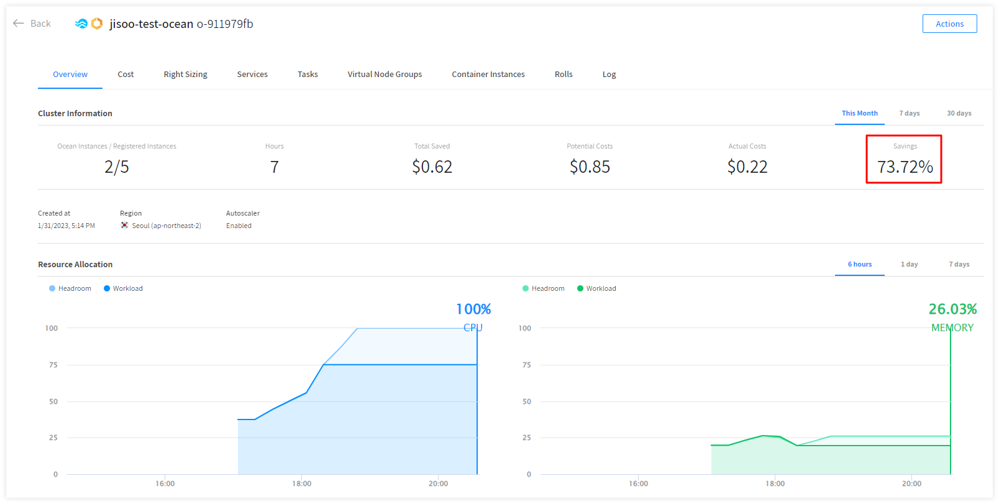

# Amazon ECS를 Spot Ocean으로 마이그레이션하기

안녕하세요, NBD팀 배지수입니다.

이번 시간에는 Amazon ECS를 Spot Ocean으로 마이그레이션하는 방법에 대해 공유하려고 합니다.

# Spot by NetApp과 Ocean

먼저 AWS의 다양한 EC2 유형에 대해 살펴볼까요?

온디맨드 인스턴스의 경우 약정 없이 사용한 만큼 비용을 내는 옵션입니다. 만약 24시간 365일 꾸준히 이 용량을 사용해야 한다면 예약 인스턴스(RI)와 Savings Plan과 같은 약정 할인 옵션을 통해 비용을 절감할 수도 있습니다.

Spot 인스턴스는 AWS에서 남는 자원을 재판매하는 서비스입니다. AWS에서 미사용되는 EC2 인스턴스를 온디맨드보다 대폭 할인된 비용으로 활용할 수 있는 것이지요. 비용 절약성은 확보하지만 배포된 인스턴스가 언제든지 회수될 가능성이 있다는 점에서 가용성을 확보하기 어렵습니다.

Spot by NetApp은 머신러닝 및 분석 알고리즘을 통해 Spot 인스턴스의 회수 이벤트를 예측하고 자동으로 새로운 인스턴스를 생성하여 가용성을 확보합니다. 또한 가용성 점수를 동적으로 제공하며 훨씬 저렴한 비용으로 인스턴스들을 워크로드에 **JUST FIT**하게 사용할 수 있습니다. 기본적으로 사용할 수 있는 Spot 인스턴스가 없는 경우 온디맨드 인스턴스를 실행하며, 사용 가능한 Spot 인스턴스가 나타나면 온디맨드 인스턴스를 종료하고 Spot 인스턴스를 실행하는 것을 반복합니다. 

AWS 계정에서 이미 사용 중인 예약 인스턴스나 Savings Plans이 있다면 이를 먼저 사용하는 것도 가능합니다. 사용되는 순서는 예약 인스턴스(RI), EC2 Instance Saving Plans, Compute Savings Plans, Spot 인스턴스입니다.

Ocean은 Spot by NetApp의 컨테이너용 클라우드 관리형 인프라 자동화 서비스입니다. ECS 클러스터와 Ocean의 통합은 Spot SaaS와 AWS ECS 서비스 간의 API 호출을 통해 실행됩니다. 대시보드에서는 시간 경과에 따라 절감된 비용과 온디맨드 대비 제공받은 할인율까지 한눈에 확인할 수 있습니다. 

# ECS to Ocean 마이그레이션

Ocean은 클러스터의 요구사항에 맞게 인프라 용량과 크기를 자동으로 조정합니다. Ocean에 기존 ECS 클러스터를 연결한 다음 기존 ECS 노드를 수동으로 Draining 하여 Ocean이 기존 워크로드에 최적화된 인프라를 프로비저닝하도록 하는 방법으로 마이그레이션을 진행합니다.

대략적인 방법은 다음과 같습니다.

## 1. AWS Account 연동

계정 연동에 대한 자세한 내용은 [다음 문서](https://docs.spot.io/connect-your-cloud-provider/aws-account)를 참고해주세요.

## 2. Spot Ocean Cluster 생성

1. Spot Console의 왼쪽 메뉴에서 Ocean > Cloud Clusters를 클릭하고 **Create Cluster**를 클릭합니다.

1. Create Ocean Cluster 페이지가 나타나면 사용 사례 템플릿을 선택해야 합니다. Join an Existing Cluster에서 **Join an Existing ECS Cluster**를 클릭합니다.

### 1단계: General 설정

1. 일반 페이지에서 클러스터가 실행 중인 **Region**을 선택하고 **Ocean 이름**을 입력한 다음 연결할 **ECS 클러스터**를 선택합니다.
    - Ocean 이름은 생성될 Ocean 클러스터의 이름입니다. Spot에서는 관련 엔터티를 쉽게 식별하기 위해 ECS 클러스터와 동일한 이름으로 지정하는 것을 권장합니다.
    - ECS 클러스터 이름은 컴퓨팅 구성을 가져올 ECS 클러스터입니다.

1. **NEXT**를 클릭합니다.

<aside>
💡 만약 다음과 같이 “Cluster Import Failed” 에러가 발생한다면?

</aside>

위 에러는 말 그대로 ECS 클러스터에 실행 중인 인스턴스가 없기 때문에 발생합니다.

먼저 노드가 네트워킹을 하고 있는지 확인해야 합니다. ECS는 EC2에 **ECS 컨테이너 에이전트**를 설치 및 관리하며 작동합니다. 따라서 ECS 에이전트를 설치하기 위해서는 반드시 인터넷 통신이 가능해야 합니다. ECS 클러스터 생성 시 Auto assign public IP가 Disabled로 설정되어 있는 것이 위 에러의 원인일 수 있습니다. 이때 Auto assign public IP 항목을 **Use subnet setting**로 변경해야 합니다. 이 부분을 수정하기 위해서는 새로운 버전의 Laucn Configuration을 생성하고 해당 Autoscaling Group의 Launch Configuration을 새로 만든 복사본으로 변경하는 작업이 필요합니다.

### 2단계: Compute 설정

1. Ocean은 ECS 클러스터에서 컴퓨팅 구성을 가져와 컴퓨팅 페이지에 표시합니다. 필요한 경우 구성을 확인하거나 편집합니다.
- Cluster Network
    - **VPC**와 **Subnet**을 선택합니다.
    - 배포된 인스턴스가 여러 개의 Subnet에 존재한다면 Subnet이 모두 선택되었는지 확인합니다.
- Instance Types
    - (선택) **Customize Instance Type**을 클릭하여 Spot 인스턴스를 배포할 인스턴스 타입을 선택합니다.
    - 인스턴스 타입을 선택하지 않는 경우 기본적으로 Ocean이 애플리케이션 요구 사항에 가장 적합한 인스턴스 타입을 자동으로 선택 및 관리합니다.
    
    
    
- Instance Specifications
    - 인스턴스의 세부사항을 설정합니다.
- Tags
    - (선택) Tag가 필요한 경우 Tag를 등록합니다.
- Resource Limit
    - (선택) 클러스터 리소스의 최대 vCPU와 최대 메모리를 지정합니다.
- Additional Configuration
    - (선택) Public IP 할당 여부와 Draining Timeout을 지정합니다.
1. **Next**를 클릭합니다.
    
    

### 3단계: Review

구성한 모든 Ocean 설정을 검토하고 **Create**를 클릭하여 생성을 완료합니다.

또는 JSON 파일로 Export 하고 다른 도구를 사용하여 Ocean 클러스터를 생성할 수도 있습니다.

배포 중에는 서비스 배포를 유연하게 하기 위해 1대의 인스턴스가 추가 프로비저닝되며 15분 내에 해당 인스턴스에 대한 사용량이 없다면 종료됩니다.

예를 들어 Ocean 클러스터를 생성하기 전 ECS 클러스터의 노드는 아래와 같습니다.

Ocean 클러스터를 생성하자 노드 1개가 추가로 생성된 것을 확인할 수 있습니다. 

Spot 콘솔에서는 마이그레이션 이후 Ocean이 관리하는 노드만을 확인할 수 있습니다.

## 3. 기존 AWS Autoscaling Group 중지

1. AWS Console의 왼쪽 메뉴에서 EC2 > Auto Scaling > Autoscaling Group을 클릭하고 ECS 클러스터에 연결된 Autoscaling Group를 검색합니다.
2. Advanced configurations 탭에서 **Edit**를 클릭합니다.
3. Suspended processes에서 **체크박스를 모두 선택**하여 Autoscaling Group에 대해 모든 프로세스를 일시 중지합니다.
    
    
    
4. **Update**를 클릭합니다.

## 4. 기존 노드 Draining

AWS Console의 왼쪽 메뉴에서 ECS > Clusters에서 해당 클러스터를 클릭한 다음 기존 노드를 모두 선택하고 **Drain**을 클릭합니다.

기존 노드가 Draining 상태가 되었으며 새로운 노드가 프로비저닝되어 기존 노드가 실행 중이던 Tasks를 실행하게 됩니다.

Spot 콘솔에서도 새로 생성된 노드에 대한 정보를 확인할 수 있습니다.

## 5. 마이그레이션 완료 후 기존 노드 종료

1. AWS Console의 왼쪽 메뉴에서 EC2 > Auto Scaling > Autoscaling Group을 클릭하고 ECS 클러스터에 연결된 Autoscaling Group를 검색합니다.
2. Advanced configurations 탭에서 **Edit**를 클릭합니다.
3. 현재 Draining 상태의 기존 노드를 완전히 종료하기 위해 Autoscaling Group의 일시중지된 프로세스 목록에서 Terminate 체크박스를 체크 해제합니다.

1. **Update**를 클릭합니다.
2. 기존 Autoscaling Group의 Group size를 모두 0으로 조정하여 Autoscaling Group을 비활성화하여 마무리합니다. 이제 Ocean이 AWS의 Autoscaling Group을 대신하게 되는 것입니다.

1. **Update**를 클릭합니다.

# 마치며

우리가 클라우드를 사용하는 가장 큰 이유는 “돈을 절약하기 위함” 입니다.  Spot by NetApp에 대해 알아보며 클라우드를 더 잘 사용하기 위해 Spot을 사용하지 않을 이유가 없다는 생각이 듭니다. 최대 VM 20대까지 무료로 사용해볼 수 있으니 Spot by NetApp으로 남는 자원을 효율적으로 활용하여 원활한 서비스를 제공할 수 있는 좋은 경험을 모두 한 번씩 해보시기를 추천해 드립니다.

Spot by NetApp이 궁금하다면?

[Cloud Operations Solutions for Cloud Optimization and Cost Management and Open Source Data Services | Spot by NetApp](https://spot.io/)

---

🖇️ 참고 문서

[1] Connect an Existing ECS Cluster - [https://docs.spot.io/ocean/getting-started/ecs](https://docs.spot.io/ocean/getting-started/ecs)

[2] Effective utilization of AWS Savings Plans and EC2 spot instances - [https://spot.io/resources/aws-ec2-pricing/effective-utilization-of-aws-savings-plans-and-ec2-spot-instances/](https://spot.io/resources/aws-ec2-pricing/effective-utilization-of-aws-savings-plans-and-ec2-spot-instances/)