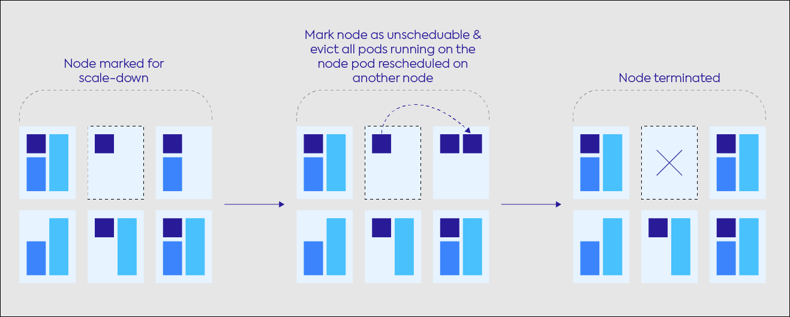

안녕하세요. 클라우드메이트 김희원입니다.

이번 주제에선 Spot by NetApp의 Ocean이라는 서비스로 AWS EKS의 운영을 효율화하고, 비용을 최적화하는 방법을 알아 보겠습니다.

빠른 이해를 위해 Spot by NetApp에 대한 서비스 소개를 먼저 하겠습니다.  
**Spot by NetApp은 컴퓨팅 비용을 최대 90%까지 절감하면서 SLA를 99.99%까지 보장하는 서비스입니다.**

그게 어떻게 가능할까요?

## Spot by NetApp

Spot by NetApp은 머신러닝 및 분석 알고리즘을 사용하여 비용을 줄이고 SLA를 보장할 수 있습니다.
OS, 인스턴스 타입, 가용 영역, 리전 등 전반에 걸쳐 Spot 풀에 지속적으로 스코어링하여 최적의 Spot 인스턴스를 선택합니다.


AWS Spot 인스턴스의 경우 회수 2분 전에 통보되기 때문에 가용성을 확보하기 어렵지만, Spot by NetApp은 회수 이벤트를 예측해서 미리 새로운 Spot 인스턴스를 자동으로 생성하여 가용성을 보장합니다.  
만약 사용 가능한 Spot 인스턴스가 없다면 온디맨드로 생성하며, 사용할 수 있는 Spot 인스턴스가 있다면 온디맨드 인스턴스를 종료하고 Spot 인스턴스로 교체합니다.


또한, Spot은 애플리케이션 중심 프로비저닝을 사용합니다.
AWS의 경우 Auto Scaling Group으로 부하에 따라 스케일링이 가능하지만 인스턴스 타입으로 고정하기 때문에 오버 프로비저닝될 가능성이 있습니다.  
그러나 Spot은 애플리케이션 중심 프로비저닝을 하기 때문에 컴퓨팅 리소스를 최적화할 수 있습니다.

---

## Ocean
이상으로 Spot by NetApp에 대한 기본적인 소개를 마쳤으며, 이제 Ocean 서비스를 소개하겠습니다.  
*※ Ocean은 EKS, AKS, GKE 등 다양한 환경에서 시작할 수 있지만, 본 포스팅은 AWS EKS를 기준으로 합니다.*

Ocean은 컨테이너용 클라우드 인프라를 자동화하는 서비스로 쿠버네티스 운영에 대한 부담을 줄일 수 있습니다.
워크로드를 지속적으로 분석하고 Spot, RI, 온디맨드 인스턴스의 최적 조합을 활용합니다.  
Pending 상태인 Pod를 모니터링하고 제약 조건 및 레이블을 기반으로 클러스터의 크기를 자동으로 조정합니다. 또한, 활용도가 낮은 노드를 Scale-in 하여 비용 최적화를 극대화합니다.


쿠버네티스 클러스터와 Ocean의 통합은 Ocean Controller와 Ocean SaaS로 구성됩니다.
Ocean Controller는 쿠버네티스 클러스터 내에 상주하고 Spot 플랫폼과 통합을 가능하게 합니다.  
Ocean Controller는 Deployment로 구성되며, 클러스터 운영에 필수적이기 때문에 ```priorityClassName : system-node-critical```로 스케줄링 시 가장 높은 우선순위를 가집니다.

Ocean을 시작하기 위해선 AWS(혹은 Azure, GCP) 연결이 필요합니다.
Spot 공식 문서 혹은 "Spot by NetApp 시작하기" 포스팅을 참고하시기 바랍니다.  
https://docs.spot.io/ocean/getting-started/eks/  
https://tech.cloudmt.co.kr/2021/02/17/spot_by_netapp_%EC%8B%9C%EC%9E%91%ED%95%98%EA%B8%B0/  

---

이제 핵심적인 기능에 대해 설명하겠습니다.

#### Scale out

Ocean은 unschedulable pod를 지속적으로 확인합니다. 쿠버네티스 스케줄러가 Pod를 배치할 수 있는 노드를 못 찾으면 Pod를 실행할 수 없습니다.
Ocean은 unschedulable pod의 수를 계산하고 pod에 대한 가장 효율적인 노드를 찾아서 생성합니다.  
생성된 노드가 클러스터에 join 하는 데에 몇 분 이상 걸리는데 Headroom으로 이 시간을 최소화 할 수 있습니다.

#### Headroom

Headroom은 클러스터가 빠른 Scale Out을 위한 예비 용량 버퍼입니다.
특정 리소스 (vCPU, 메모리)에서 Headroom을 구성하거나 클러스터의 총 요청 리소스에 대한 백분율로 Headroom을 지정하면 클러스터는 새 노드가 프로비저닝될 때까지 기다리지 않고 워크로드를 Scale Out할 수 있습니다.  
컴퓨팅 리소스를 미리 선점했기 때문에 unschedulable pod를 즉시 스케줄할 수 있지만, Scale Out을 대비하여 더 많은 인프라를 프로비저닝 합니다.

#### Scale in

Ocean은 활용도가 낮은 노드를 식별하고 [bin-packing](https://en.wikipedia.org/wiki/Bin_packing_problem)으로 비용을 줄일 수 있습니다.
매 분 마다 Ocean은 클러스터 내의 다른 노드로 이동할 수 있는 pod가 있는지 시뮬레이션 하고 가능하면 기존 노드는 종료하는 옮겨가는 방식입니다.

**노드 변경을 최소화해야 하는 워크로드라면?**

그러나, 일부 워크로드는 노드 교체에 최적화되어 있지 않을 수 있습니다.  
그럴 경우 ```spotinst.io/restrict-scale-down:true``` 레이블을 구성하여 노드의 Scale-in을 최소화할 수 있습니다.

**Scale in 설정 / Cluster Shutdown Hours를 활용하여 추가적인 비용 절감**

한 번에 몇 %의 노드씩 Scale in 할 건지 설정이 가능합니다.  
일반적인 서비스의 경우 점진적인 Scale in이 좋으며,  
스파이크성 배치 작업이라면 비용 최적화를 위해 높은 비율의 %를 설정하는 게 좋을 것입니다.

또한, Cluster Shutdown Hours를 설정하면 노드가 켜져있는 시간을 정할 수 있습니다. 테스트용으로 업무 시간에만 적용해놓았는데 이렇게 되면 Spot 인스턴스로 비용을 절약하고 추가적인 절약이 가능한 것입니다.
이 기능은 비프로덕션 환경에 권장됩니다.

#### Health Checks, Auto-Healing
노드의 문제가 발생했을 때 Ocean이 자동으로 노드를 교체합니다.  
Ocean 클러스터의 노드는 지속적으로 모니터링되고 조건이 할당됩니다.
* OutOfDisk
* Ready
* MemoryPressure
* DiskPressure
* NetworkUnavailable

이러한 조건 유형에는 상태가 할당됩니다.
* False
* True
* Unknown

최적의 성능을 보장하기 위해 Ocean은 30초마다 노드의 상태를 모니터링하고 False 또는 Unknown인 경우 노드를 Unhealthy로 간주하고 새 Spot 인스턴스로 교체합니다.

#### Labels, Taints
Ocean은 pod 스케줄링을 위해 [쿠버네티스 제약 메커니즘](https://kubernetes.io/docs/concepts/scheduling-eviction/assign-pod-node/)을 지원합니다.
* Node Selector : 특정 레이블이 있는 노드로 pod를 스케줄링합니다.
* Node Affinity : 노드 레이블을 기반으로 pod를 스케줄링할 수 있는 노드를 제한합니다.
* Pod Affinity, Pod Anti-Affinity : 다른 pod가 노드에서 실행 중인지 여부에 따라 pod를 스케줄링합니다.
* Pod Port Restrictions : 각 pod에서 사용 가능한 필수 포트가 있는지 확인합니다.
* [Well-Known Labels](https://kubernetes.io/docs/reference/labels-annotations-taints/)

#### Virtual Node Groups

VNG (Virtual Node Groups)는 동일한 클러스터에서 다양한 유형의 워크로드를 관리할 수 있는 추상화된 계층을 제공합니다.  
업계에서 사용되는 동등한 용어에는 노드 그룹, 노드 풀이 있습니다.

Taints, 최대 노드 갯수, 인스턴스 타입 설정 등 워크로드 환경에 따라 노드의 특성이 다를 수 있습니다.  
이럴 경우 VNG를 사용하여 논리적인 그룹으로 관리할 수 있습니다.

#### Cost Analysis

여러 애플리케이션과 서비스가 동일한 인프라를 공유하는 컨테이너 세계에서는 서로 다른 애플리케이션, 서비스 및 환경의 비용을 구별하기 어려운 경우가 많습니다.  
Ocean은 클러스터의 인프라 비용을 분석하고 인사이트를 제공합니다.

비용을 namespace와 namespace의 워크로드로 분류하고 컨테이너 레이블 및 주석에 따라 필터링할 수 있습니다. 이 정보는 각 워크로드에 대한 컴퓨팅 비용과 스토리지 비용으로 세분화된 것을 볼 수 있습니다.  
이를 통해 클라우드 인프라의 비용을 자세히 이해할 수 있습니다.

#### Roll

Roll은 Rolling Update 입니다.
새 이미지, user data, security group 등을 변경하기 위해 노드를 수동으로 detach하지 않고 Roll로 쉽게 업데이트 할 수 있습니다.

#### Right Sizing

Ocean은 레이블, taints, tolerations 같은 리소스 요구 사항에 맞는 최적의 VM에 pod가 배치되도록 합니다.
그러나, 리소스 요청을 할당할 때 적절한 CPU 및 메모리 양을 추정하는 것도 쿠버네티스를 설계할 때 팀이 직면하는 과제일 것입니다.  
Ocean은 실시간으로 사용률을 모니터링하여 요구 사항을 조정하기 위한 권장 사항을 제공합니다. 요청한 것보다 많거나 적은 리소스를 사용하는 경우입니다.  
권장 사항은 컨테이너 별로 제공되며 사용자가 쉽게 볼 수 있도록 전체 워크로드에 대해 요약됩니다.
이러한 권장 사항이 있다고 해서 무조건 따라야 하는 것은 아니지만, 전체 워크로드에 대한 인사이트를 가져갈 수 있는 것입니다.

---

## 비용 체계
이 글을 여기까지 보셨다면 Spot by NetApp의 비용이 궁금할 것입니다.

**기본적으로 3가지의 Plan이 있으며 비용은 할인받은 금액 기준의 일부 퍼센트에 대해서만 과금합니다.  
Pay-as-you-Go의 경우 28%이며, Annual Subscription의 경우 더 낮은 요율을 제공합니다.**

할인 받은 금액에서 과금이 되기 때문에 비용적으로 메리트가 있습니다.  
즉, 만약 할인받은 금액이 없다면 과금이 없다는 이야기 입니다.  

비용 체계 상 기존 인프라 비용에서 추가적으로 과금되는 것이 아니기 때문에 비용적인 부담이 없는 게 매력적입니다.

---

## 고객 사례

다양한 고객사에서 Spot by NetApp 제품군을 사용하고 있으며 "운영 효율화 및 비용 최적화"라는 두 마리 토끼를 함께 잡고 있습니다.  

실제 사례로 A 고객사는 한 달에 65% 이상 절감율을 보이고 있습니다.

Spot by NetApp으로 워크로드를 옮기고 싶지만 아무래도 Spot 인스턴스다 보니 도입을 망설일 수 있습니다.

워크로드에서 Spot 인스턴스의 비율을 설정할 수 있다 보니 온디맨드 위주로 충분한 테스트를 진행해본 뒤에 비율을 높여나가는 방법도 있습니다.

---

## 마무리하며
기본적으로 Spot 인스턴스를 활용하는 서비스이다 보니 비용 절감도 되지만, Ocean으로 관리할 수 있는 부분 (노드 관리, 모니터링 등)이 많아서 좋은 서비스라고 느껴집니다.  
컨테이너용 서비스인 Ocean 뿐만 아니라 Scale out 애플리케이션을 위한 [ElastiGroup](https://docs.spot.io/elastigroup/) 이라는 서비스도 있으니 참고하시기 바랍니다.

---

## 출처
https://spot.io  
https://spot.io/blog  
https://docs.spot.io/  
https://blog.naver.com/netapp_korea/222867067092  