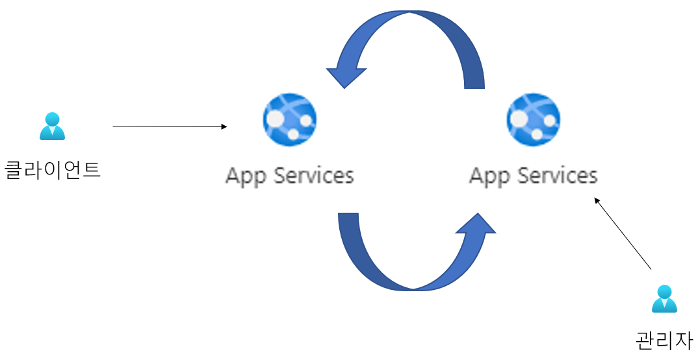

처음 클라우드를 접하고 학습할 때 IaaS, PaaS, SaaS 설명을 듣게 되신다면  
IaaS는 머신을 빌려 쓰는 거구나?  
SaaS는 소프트웨어를 가져다 쓰는 것이구나?  
하면서 알 것도 같은데
PaaS는 뭔가 감이 잘 안 올 수 있습니다.

당장 궁금한 걸 해결하고 싶어서 직접 서비스를 써보려고 하는데, 서비스가 만들어지기까지 넣어줘야 하는 설정들이 많아서 뭔가 어렵고, 잘 모르면 실수로 요금이 많이 나올 수 있다는 이야기를 듣곤 두렵기도 하는 심리적인 진입장벽들이 있을 수 있다고 생각했습니다.

그래서 Azure(Microsoft의 클라우드 서비스)의 대표 서비스인 PaaS의 정석, App Service(제품 이름입니다)로 PaaS가 대체 어떻게 생긴 건지 대신 보여드리면서 이해에 도움이 되고자 합니다.

## 런타임

보통 PaaS의 설명엔 "서비스를 개발할 때 필요한 플랫폼을 제공한다."고 적혀 있는데요, 이것은 무슨 말인가 하면

  
AppService를 만들 때 그림처럼 언어를 고르게 되는데요, AppService가 그 언어에 맞는 런타임을 제공해 주고, 우리는 그 언어로 코드만 짜서 올리면 배포가 됩니다. 컨테이너를 쓸 수도 있습니다.

이때 코드만 짜서 올린다는 말은 말 그대로 마련된 서버에 코드 파일을 올리면 된다는 말인데요, FTP 클라이언트로 그 서버에 파일을 올리는 것이 가장 기본이겠지만, 전형적인 PaaS의 장점들을 잘 갖추고 있는 AppService는 런타임뿐만 아니라 Github, Bitbucket같은 코드리포지토리와의 연동을 지원하고 CI/CD를 위한 Pipeline, Deployment slot같은 DevOps의 배포 전략을 위한 기본 개념까지 모두 지원합니다.

그래서 앱 서비스가 만들어지고 나면 리소스 페이지의 배포 센터라는 탭에서 코드리포지토리와 브랜치를 고를 수 있고,

  
  
코드리포지토리에서 특정이 된 코드가 방금 리소스를 만들 때 골라놨던 언어의 런타임 위에서 실행이 됩니다. 잠깐의 시간이 지나면 앱이 배포가 됩니다.

  
앱 서비스의 URL이 생겼고,

  
그 URL을 통해 접속이 가능합니다

\> 코드를 배포용 파일로 빌드하고  
\> 빌드 결과물을 서버에 전송하고  
\> 커맨드로 실행  
하는 부분을 대신해주고 있습니다. 사용자가 코드 개발에 더 신경을 쓸 수 있게끔 환경을 제공해 줍니다.

깃허브엔 저절로 깃허브액션 파일이 자동으로 만들어지고, 특정된 그 리포지토리의 브랜치에 푸시 할 때마다 방금 했던 작업이 자동화돼서 배포가 됩니다.

## 여러가지 기능

PaaS가 서비스를 개발할 때 필요한 플랫폼이라고 해서, 이렇게 앱을 빌드 해주는 것, 끝!이라고 생각하실 수도 있을 것 같은데요, 전형적으로 PaaS서비스의 주요 특징이라고 할 수 있는 기능들이 있습니다. 보안, 로드밸런싱, 오토스케일링.. Azure의 대표 서비스인 App Service에서는 이런 PaaS의 장점인 기능들을 제대로 갖추고 있습니다. 아래 그림은 AppService 리소스 페이지의 탭입니다.

  

굉장히 많은데요  
- 배포 관리를 할 수도 있고
- Authentication은 예를 들어서 페이스북을 등록하면 로그인을 안 했을 때 페이스북 로그인 페이지로 리다이렉션 하게 할 수도 있고
- TLS/SSL 설정
- 네트워킹에선 인바운드와 아웃바운드를 관리하고
- 그 외에도 스케일업, 스케일아웃, SSH, CORS..

이렇게 내가 올린 앱에 대해 여러 유용한 기능들을 클릭 몇 번으로 이용할 수 있게 제공해 주는 것이 PaaS입니다!  
이제부턴 이런 것들을 구체적으로 어떻게 제공해 주는지에 대해 간단한 요구사항에 맞춰 실습해 보겠습니다.

## 오토스케일링

AppService에서는 일정 이상의 스펙을 쓸 때 오토스케일링을 지원하고 있습니다. 왼쪽 탭의 스케일 업과 스케일 아웃이 보이시나요?

  
사용자 자동 크기 조정을 선택하면 크기 조건 추가 버튼으로 조건을 설정할 수 있습니다.
만약에 고객의 요구사항이 매월 5일과 25일에 이벤트를 하고 있고, 이때 이용자 수가 늘어날 것 같아 대비를 하고 싶다 라면

  
이런 식으로 스케일 조건을 줄 수도 있고 시간, 요일, 메트릭에 대해서도 가능합니다.

## SSH

  
SSH 콘솔 환경을 제공하고, 이 연결은 HTTPS가 사용됩니다.

## 배포

AppService에서는 배포 슬롯이라는 것을 통해 배포를 관리할 수 있습니다.

  
보시면 프로덕션이라고 써져 있는 게 운영되고 있고, 여기서 슬롯 하나를 추가할 수 있습니다. 둘은 스왑을 할 수 있는데요.  

  
운영서버 목적으로 쓰이는 프로덕션을 내버려 두고, 스테이징 슬롯을 만들어서 여기에다가 변경사항을 적용하고 배포하면 바로 운영되는 것이 아니니까 여기서 한번 점검을 하고 난 뒤에 스왑을 해서 운영서버가 될 수 있게 진행할 수 있습니다.

  
%를 조절하면서 롤아웃을 할 수도 있습니다.

MS 문서 중에 [App Service 배포 모범 사례](https://learn.microsoft.com/ko-kr/azure/app-service/deploy-best-practices)가 있는데요

  
그림처럼 프로덕션 슬롯을 따로 두고, 
리포지토리의 브랜치를 개발, 스테이징, 메인으로 나누고 각각 슬롯을 하나씩 연결해 줍니다. 그리고 프로덕션에서 운영을 합니다. 그림처럼 마스터 브랜치로 머지 되게 될 때마다 Master Slot에 배포가 되는데, 이때 이것을 프로덕션 슬롯과 배포 전략을 생각해서 스왑을 해주시면 됩니다.

또 장점이 프로덕션 슬롯에 브랜치를 연결해서 바로 배포를 하면 가동 중지 시간이 있는데, 스왑할 때는 발생하지 않아서 가동 중지 시간을 방지할 수 있습니다.

## CORS

CORS도 지원합니다. CORS는 웹 기술의 발전으로 SOP정책을 완화하기 위해 나왔는데요, 브라우저가 악의적인 행위로 간주되는 걸 막으려고 할 때 허용해 주는 도메인 간의 협약입니다. 서버가 리소스 호출이 허용된 출처를 명시해놓습니다.

  

허용된 원본에 허가된 출처 정보가 담기고, 저 체크박스로 Access-Control-Allow-Credentials 응답 헤더를 true로 설정해서 인증 정보를 포함한 요청을 처리하게 해줍니다.

도움이 되셨을까요? 읽어주셔서 감사합니다.