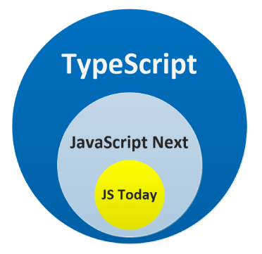
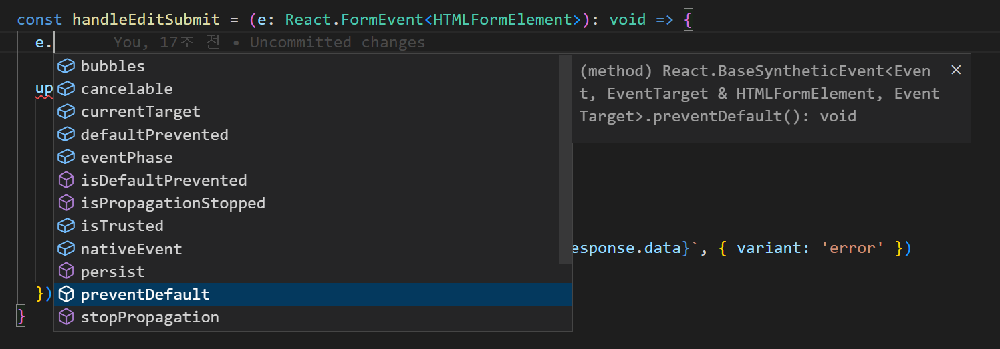
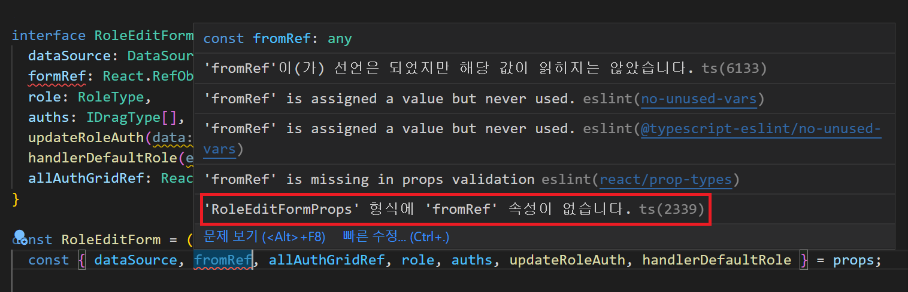
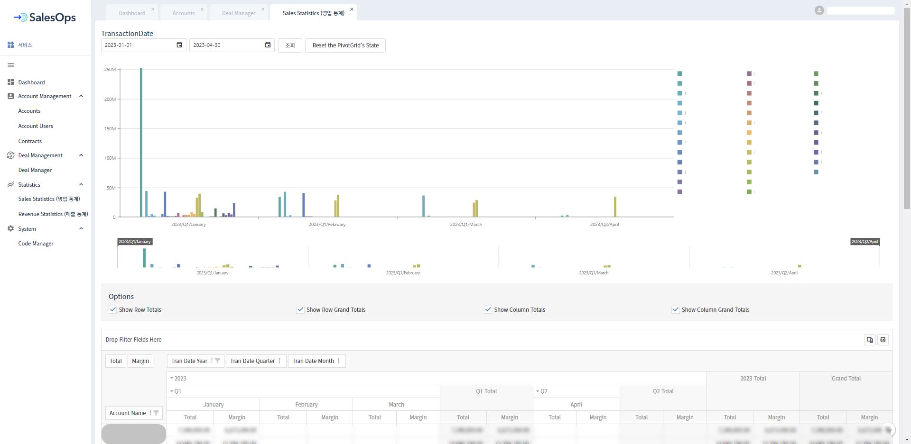
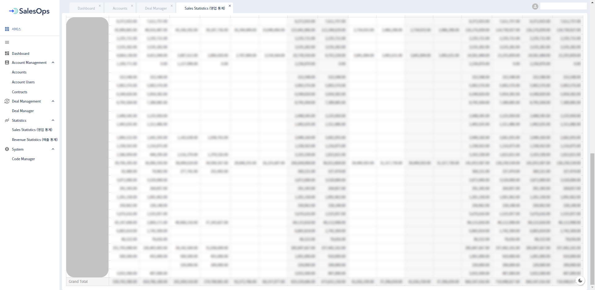

안녕하세요! SD팀(Service Development Team) 이예원입니다. 

2022년 SD팀에서 개발한 **IAM**과 **SalesOps**부터 올해 진행 중인 **Billing v3.0**, **RPM**, **SmartReport**의 프론트엔드 앱을 `React JS` + `TypeScript` 조합으로 개발하고 있습니다.

해당 글에서는 TypeScript에 대해 소개하고, React JS에 TypeScript를 사용하는 방법(문법)에 대해 알아보고, 이를 토대로 개발한 SalesOps 영업 통계 페이지의 실무 코드를 보여 드리면서 마무리하겠습니다.

## Contents

- TypeScript 소개
- TypeScript 특징
- TypeScript를 사용함으로써 얻을 수 있는 이점
- 실무 코드로 보는 React JS + TypeScript 사용법
- SalesOps 영업 통계 페이지

순으로 살펴보겠습니다.

---

먼저, TypeScript란 무엇일까요?


## TypeScript란?

TypeScript는 Microsoft에서 개발/유지하고 있는 오픈 소스 프로그래밍 언어입니다.
JavaScript가 대규모 애플리케이션을 개발하는 데 어렵고 불편하다는 불만에 대응하기 위해 개발되었습니다.

> _"TypeScript is a typed superset of JavaScript that compiles to plain JavaScript Any browser. Any host. Any OS. Open Source."_



TypeScript는 JavaScript의 Superset, 즉 상위 집합입니다. JavaScript에 플러스로 TypeScript의 기능까지 사용할 수 있습니다.

TypeScript는 스크립트 언어의 표준인 ECMA Script(ES)의 표준을 따르고 있기 때문에, JavaScript 영역을 침범하지 않고 최신 ES를 지원합니다. 새로운 ES가 나올 때마다 TypeScript 역시 버전 업을 하여 최신 ES의 기능을 지원합니다.

<br>

---

## TypeScript 특징

**`TypeScript = JavaScript + Type`**

TypeScript는 JavaScript 프로그램을 위한 `Static Type Checker`로도 볼 수 있습니다. 코드가 실행되기 전에 실행되고(Static: 정적) 프로그램 타입이 올바른 지 확인하는(Type Checker) 언어로 볼 수 있습니다.

`tsc(TypeScript Compiler)`는 컴파일 과정에서 타입 검사를 통해 에러 없이 안정성이 확보되면 타입들을 제거하고 최종적으로 JavaScript 코드를 생성하게 됩니다.

<br>

---


## TypeScript를 사용함으로써 얻을 수 있는 이점

1.  **정적 타입 언어**

JavaScript는 동적 타입 언어(Dynamic Typed Language)로, 개발 시 타입을 명시해 주지 않아도 되기 때문에 개발 속도가 빠르지만, 런타임 시 타입이 결정되므로 타입 안정성이 보장되지 않습니다.

프로그램 실행 중(런타임) 변수에 예상치 못한 타입이 들어오는 경우 에러가 발생할 수 있습니다. 코드가 길고 복잡할 수록 에러를 찾는 것(디버깅)이 어려워집니다.

**TypeScript**를 사용함으로써 이러한 어려움을 해결할 수 있습니다. TypeScript는 정적 타입 언어(Static Typed Language)로, 개발 시 변수의 타입(자료형)을 명시적으로 지정해야 합니다. 따라서 **타입 에러를 컴파일 단계에서 초기에 발견할 수 있어 타입 안정성을 높일 수 있습니다.**


2. **도움말(코드 가이드)** 및 **자동완성** 기능

TypeScript를 사용하면 IDE를 더 적극적으로 활용할 수 있게 됩니다. 타입을 지정함으로써 자동완성 기능이 지원되고 타입체킹이 되기 때문에 **개발 생산성**을 **향상**시킬 수 있습니다. 

이는 '잘못된 타입을 지정'하거나 '서로 다른 타입을 비교하는 실수', '오타', 'null 체크를 빼먹는 일' 등의 실수를 IDE 상에서 알 수 있기 때문에 **실수를 줄일 수 있다**는 장점이 있습니다.


3. **협업 및 유지 보수 용이**

2번의 연장선입니다. IDE에서 컴포넌트, 함수 등을 사용할 때 어떤 타입을 넣어야 하는지 IDE 상에서 확인이 가능하기 때문에 **협업과 유지 보수에 용이**합니다. 


이러한 이점들로 저희는 TypeScript를 선택하였습니다.

<br>

--------------------------------------------------------------------------

## 실무 코드로 보는 React JS + TypeScript 사용법

프로젝트 코드로 React JS에서 TypeScript를 사용하는 방법을 알아보겠습니다. 
변수, 함수, 객체, 컴포넌트 Props, Hook 등에 타입을 적용하였습니다.

> TypeScript에 대해 더 자세히 알고 싶다면 아래 사이트를 참고하세요!
> 
> - [TypeScript Handbook](https://www.typescriptlang.org/docs/handbook/intro.html)
> - [TypeScript Handbook 한글 문서](https://typescript-kr.github.io/)


### 1. 변수

기본 타입, 사용자 정의 타입 등을 지정하여 변수를 선언하고 사용할 수 있습니다.

```typescript
interface chartDataType { // 사용자 정의 타입
	tranDate: string,
	accountName: string,
	total: number
}

const Dashboard = () => {
	let result: string // string 타입 변수
	const dataMap = new Map<string, chartDataType>() // chartDataType 타입 Map
}

export default Dashboard
```


### 2. 함수

함수에서는 파라미터와 반환값의 타입을 정의합니다. 

```typescript
const functionName = (parameter: parameterType): returnType => {
	...
}
```

다음은 HTML Form Element의 Submit Event 함수입니다. 

```typescript
const handleEditSubmit = (e: React.FormEvent<HTMLFormElement>): void => {
	e.preventDefault()
	
	updateUserMutation.mutateAsync({ accountId: userAccountId, userId: userPageId, updateUser: user }, {
		onSuccess: () => {
			enqueueSnackbar('user 가 수정되었습니다.', { variant: 'success' })
			parentsDataSource.reload()
			userData.refetch()
		},
		onError: (error: any) => {
			enqueueSnackbar(`user 수정을 실패하였습니다. ${error?.response.data}`, { variant: 'error' })
		}
	})
}
```

파라미터의 타입을 지정하면, 아래 이미지와 같이 자동완성이 지원되어 생산성을 높일 수 있습니다.



또한, 함수 호출 시, 파라미터에 다른 타입을 넘겨주면 에러 메시지를 띄워 알려줍니다. 

반환값의 타입을 지정하면, 함수 작성 시 반환값을 누락하거나 다른 타입을 반환할 경우 에러 메시지를 띄워 알려주기 때문에 실수를 방지할 수 있습니다.


### 3. 객체

다음은 백엔드 api를 호출하는 함수에서 사용할 타입을 정의한 부분입니다. 타입 선언은 `interface` 또는 `type` alias를 통해 선언할 수 있습니다. 저희는 `interface`를 사용하여 타입을 선언합니다. 

```typescript
// '?'가 붙은 속성은 optional 타입을 의미
export interface dataParamsType {
	limit?: number,
	offset?: number,
}
```

`interface` 사용 시, `extends`를 사용하여 타입을 확장할 수 있습니다. 앞서 정의한 dataParamsType을 확장하여 아래와 같이 SalesParamsType을 정의할 수 있습니다.

```typescript
export interface SalesParamsType extends dataParamsType {
	tranDateAfter: string,
	tranDateBefore: string,
	DealId?: number,
}
```

앞서 선언한 SalesParamsType 타입으로 api를 호출하는 함수의 파라미터 타입을 지정하였습니다.

```typescript
export const salesStatistics = {
	getSales: (params?: SalesParamsType) => getReq('/sales/stats/sales', { limit: 1000, ...params }),
	// 생략
}
```


### 4. 컴포넌트 Props

React에서 UI를 독립적이고 재사용 가능한 여러 조각으로 나눈 것을 컴포넌트라고 합니다.

`props`는 properties의 줄임말로, 부모(상위) 컴포넌트가 → 자식(하위) 컴포넌트에 전달해 주는, read only 객체를 의미합니다.

다음은 Roles라는 상위 컴포넌트에서 RoleEditForm 컴포넌트를 호출하는 코드입니다. 

```typescript
const Roles = () => {
	...
	return (
		...
			<RoleEditForm
				// props ↓
				dataSource={dataSource}
				formRef={FormRef}
				allAuthGridRef={allAuthGridRef}
				role={role}
				auths={auths}
				updateRoleAuth={updateRoleAuth}
				handlerDefaultRole={handlerDefaultRole}
			/>
		...
	)
}

export default Roles
```

> `dataSource`, `formRef`, `allAuthGridRef`, `role`, `auths`, `updateRoleAuth`, `handlerDefaultRole`이 RoleEditForm의 `props`에 해당합니다.


`interface`를 사용하여 RoleEditForm **컴포넌트의 Props 타입**을 지정해 주었습니다.

```typescript
// RoleEditForm 컴포넌트의 Props 타입 선언
interface RoleEditFormProps {
	dataSource: DataSource,
	formRef: React.RefObject<Form>,
	role: RoleType,
	auths: IDragType[],
	updateRoleAuth(data: IDragType[]): void,
	handlerDefaultRole(e: ValueChangedEvent): void,
	allAuthGridRef: React.RefObject<DataGrid<string|number, string>>,
}
```

컴포넌트 `props`의 타입을 `any`로 지정해 주거나 TypeScript 없이 JavaScript만 사용하는 경우, 상위 컴포넌트에서 넘겨 받은 `props`에 오타가 나거나 상위 컴포넌트에서 다른 타입의 `props`를 잘못 넘겨주거나 필수 `props`를 넘겨주지 않아도 에러를 내지 않습니다.

TypeScript를 사용했을 때는 `props`에 오타를 내면 아래 이미지과 같이 에러가 나는 것을 확인할 수 있습니다.


> _`formRef`를 `fromRef`로 잘못 쓴 경우_


### 5. Hook

Hook은 React 16.8 버전부터 추가된 기능으로, Class를 작성하지 않고도 `state`와 다른 React의 기능들을 사용할 수 있게 해줍니다. `state`란 컴포넌트 내에서 동적인 데이터나 정보를 저장/관리하는 객체를 의미합니다. 

Hook에는 `useState`, `useEffect`, `useRef`, `useMemo` 등 다양한 Hook들이 있습니다. 이 글에서는 `useState`와 `useRef`에 타입을 지정하여 사용하는 방법을 살펴보겠습니다.

#### (1) useState

`useState`는 다음과 같이 정의되어 있습니다.

```typescript
/**
* Returns a stateful value, and a function to update it.
*
* @version 16.8.0
* @see https://react.dev/reference/react/useState
*/
function useState<S>(initialState: S | (() => S)): [S, Dispatch<SetStateAction<S>>]
function useState<S = undefined>(): [S | undefined, Dispatch<SetStateAction<S | undefined>>]
```


아래와 같이 기본 타입 및 사용자 정의 타입을 지정하여 사용할 수 있습니다.

```typescript
interface trendsInRevenueType { // 사용자 정의 타입
	period: string,
	salesTotal: number,
	purchaseTotal: number,
	marginTotal: number,
	marginRate: number
}

const Dashboard = () => {
	const [selectedYear, setSelectedYear] = useState<number>(thisYear) // number 타입
	const [isRefreshClicked, setRefreshClick] = useState<boolean>(false) // boolean 타입
	const [trendsInRevenue, setTrendsInRevenue] = useState<trendsInRevenueType[]>([]) // trendsInRevenueType 배열 타입
	
    ...
	
    // 새로고침 버튼 이벤트 리스너
	const onRefreshButtonClick = () => {
		setRefreshClick(prev => !prev) // 'isRefreshClicked' state 값 변경
		setTrendsInRevenue([]) // 'trendsInRevenue' state 값 변경
	}
	
    ...
    
    return (
	    ...
	    <Button
		    icon="refresh"
		    text="새로고침"
		    style={{ marginLeft: theme.spacing(1) }}
		    onClick={() => onRefreshButtonClick()}
		/>
		...
    )
}

export default Dashboard
```


#### (2) useRef

`useRef`는 다음과 같이 정의되어 있습니다.

```typescript
/**
* `useRef` returns a mutable ref object whose `.current` property is initialized to the passed argument
* (`initialValue`). The returned object will persist for the full lifetime of the component.
*
* Note that `useRef()` is useful for more than the `ref` attribute. It’s handy for keeping any mutable
* value around similar to how you’d use instance fields in classes.
*
* @version 16.8.0
* @see https://react.dev/reference/react/useRef
*/
function useRef<T>(initialValue: T): MutableRefObject<T>
function useRef<T>(initialValue: T|null): RefObject<T>
function useRef<T = undefined>(): MutableRefObject<T | undefined>
```


다음은 DOM을 직접 조작할 목적으로 `useRef`를 사용한 코드입니다. 위에서 본 `useRef` 정의 중 두 번째에 해당합니다. UserAddForm의 Form Element(DOM)에 ref를 연결하고 Users에서 다루고 있습니다.

```typescript
interface UserAddFormProps {
	formRef: React.RefObject<Form>
}

const UserAddForm = (props: UserAddFormProps) => {
	const { formRef } = props
	
	return (
		<Form ref={formRef} colCount={2}>
			...
		</Form>
	)
}

export default UserAddForm
```

```typescript
const Users = () => {
	const formRef = useRef<Form>(null)	// Popup Form Ref
	
	const getForm = () => {
		return formRef.current?.instance;
	}
	
	const handleAddPopupFormSubmit = async () => {
	    showLoading(true)
	    const form = getForm() as dxForm // 'as' 키워드
	    const formData = { ...form.option('formData') }
	    const validate = form.validate()
	    
	    if (validate.isValid) {
		    showLoading(true)
		    formData.accountId = userAccountId
		    await dataSource.store().insert(formData)
		    addHidePopup()
		    dataSource.reload()
		    showLoading(false)
		}
	}
	
    return (
		...
			// formRef는 React.RefObject<Form> 타입
			<UserAddForm formRef={formRef} />
		...
    )
}

export default Users
```

> (10 라인) 
> `as`는 컴파일 단계에서 타입 검사를 할 때 TypeScript가 감지하지 못하는 애매한 타입 요소들을 직접 명시해 주는 키워드입니다.

<br>

---


## SalesOps 영업 통계 페이지

앞서 살펴본 방법으로 타입을 지정하여 개발한 SalesOps의 영업 통계 페이지입니다.
Chart와 Pivot Grid는 DevExpress에서 개발한 DevExtreme UI 컴포넌트를 사용하였습니다.






DevExtreme Chart를 사용하여 재사용 가능한 Chart 컴포넌트를 만들었습니다.

```typescript
import { ReactNode, forwardRef, ForwardedRef } from 'react';
import { Chart, IChartOptions, Animation } from 'devextreme-react/chart';

// DevExtreme의 IChartOptions을 상속 받아 props 타입 정의
interface ChartProps extends IChartOptions {
  children: ReactNode
}

const DxChart = forwardRef(({ children, ...rest }: ChartProps, ref: ForwardedRef<Chart>) => {
	return (
		<Chart ref={ref} width="100%" palette="Soft Pastel" {...rest} >
			<Animation duration={500} />
				{children}
		</Chart>
	)
})

DxChart.displayName = 'DxChart'

export default DxChart
```


마찬가지로, DevExtreme Pivot Grid를 사용하여 재사용 가능한 Pivot Grid 컴포넌트를 만들었습니다.

```typescript
// import문 생략

// DevExtreme의 IPivotGridOptions을 상속 받아 props 타입 정의
interface PivotGridProps extends IPivotGridOptions {
	children?: ReactNode
}

const DxPivotGrid = forwardRef((props: PivotGridProps, ref: ForwardedRef<PivotGrid>) => {
	const { children, ...rest } = props
	
	return (
		<PivotGrid
			ref={ref}
			allowSortingBySummary
			allowSorting
			allowFiltering
			allowExpandAll
			showBorders
			width='100%'
			{...rest}
		>
			{children}
		</PivotGrid>
	)
})
  
DxPivotGrid.defaultProps = {
	children: null
}

DxPivotGrid.displayName = 'DxPivotGrid'

export default DxPivotGrid
```


위의 Pivot Grid 컴포넌트에서 디폴트로 사용할 기능들을 DefaultProps로 만들었습니다.

```typescript
// import문 생략

const fileExport: IExportProps = {
	enabled: true,
}

const fieldChooser: IFieldChooserProps = {
	enabled: true,
	allowSearch: true,
	applyChangesMode: 'onDemand',
}

const fieldPanel: IFieldPanelProps = {
	visible: true,
	allowFieldDragging: true,
}

const headerFilter: IHeaderFilterProps = {
	allowSearch: true,
}

const loadPanel: ILoadPanelProps = {
	enabled: true,
}

const pivotGridTexts: IPivotGridTextsProps = {
	expandAll: true,
}

const DefaultProps = {
	export: fileExport,
	fieldChooser,
	fieldPanel,
	headerFilter,
	loadPanel,
	pivotGridTexts,
}

export default DefaultProps
```


영업 통계 페이지(SalesStatistics) 컴포넌트입니다.

```typescript
// state 및 chart data 타입
interface VisualRangeType {
	visualRange: {
		startValue: string | number | Date,
		endValue: string | number | Date,
	}
}

interface ChartDataSourceType {
	[key: string]: string | number
}

interface chartDataType {
	tranDate: string,
	accountName: string,
	total: number
}

// SalesStatistics Component
const SalesStatistics = () => {
	const defaultProps = { ...DefaultProps }  // Pivot Grid DefaultProps
	const theme = useTheme()
	const startDate = useRef<string>(dayjs().add(-1, 'month').format())
	const endDate = useRef<string>(dayjs().format())
	const chartRef = useRef<Chart>(null)
	const rangeSelectorRef = useRef<RangeSelector>(null)
	const pivotGridRef = useRef<PivotGrid>(null)
	const [visualRange, setVisualRange] = useState<VisualRangeType>({
		visualRange: {
			startValue: '',
			endValue: ''
		}
	})
	const [seriesList, setSeriesList] = useState<string[]>([])
	const [chartDataSource, setChartDataSource] = useState<ChartDataSourceType[]>([])
	const [rowColumnTotal, setRowColumnTotal] = useState({
		showRowTotals: true,
		showRowGrandTotals: true,
		showColumnTotals: true,
		showColumnGrandTotals: true,
	})
	const [excelTranDate, setExcelTranDate] = useState({
		startDate: dayjs().add(-1, 'month').format('YYYY.MM.DD'),
		  endDate: dayjs().format('YYYY.MM.DD'),
	})
	
	// Chart DataSource 가공 함수
	const makeChartDataSource = (chartData: chartDataType[]) => {
		const dataMap = new Map<string, chartDataType>()
		
		chartData.forEach((data: chartDataType) => {
			dataMap.set(`${data.tranDate}_${data.accountName}`, { ...data, total: 0 })
		})
		chartData.forEach((data: chartDataType) => {
			if (dataMap.has(`${data.tranDate}_${data.accountName}`)) {
				dataMap.set(`${data.tranDate}_${data.accountName}`, { ...data, total: (dataMap.get(`${data.tranDate}_${data.accountName}`) as chartDataType).total += data.total })
			}
		})
		const result = Array.from(dataMap, ([key, { tranDate, accountName, total }]) => ({ tranDate, accountName, total }))
		
		return result
	}

    // Pivot Grid DataSource
    const pivotDataSource = useMemo(() => new PivotGridDataSource({
	    fields: [
			//  Row area
			{
				dataField: 'accountName',
				area: 'row',
			},
			//  Column area
			{
				dataField: 'tranDate',
				dataType: 'date',
				expanded: true,
				area: 'column',
			},
			//  Data area
			{
				caption: 'Total',
				dataField: 'total',
				dataType: 'number',
				summaryType: 'sum',
				format: { type: 'fixedPoint', precision: 2 },
				area: 'data',
			}, {
				caption: 'Margin',
				dataField: 'margin',
				dataType: 'number',
				summaryType: 'sum',
				format: { type: 'fixedPoint', precision: 2 },
				area: 'data',
			},
		],
		store: new CustomStore({
			load: () => salesStatistics.getSales({
				tranDateAfter: startDate.current,
				tranDateBefore: endDate.current,
			}).then((data) => {
				// Chart Series List 가공
				const accountNames = data.map((item: SalesStatisticsType) => item.accountName)
				const uniqAccNames = accountNames.filter((acc: string, index: number) => accountNames.indexOf(acc) === index)
				setSeriesList([...uniqAccNames])
				
				// api에서 Chart DataSource에 사용할 데이터 추출
				const chartData = data.map((item: SalesStatisticsType) => ({ tranDate: item.tranDate.substring(0, 7), accountName: item.accountName, total: item.total }))
				
				// Chart DataSource 가공
				const result = makeChartDataSource(chartData)
				
				// Chart DataSource 가공 (Pivot Grid 데이터와 동일하도록)
				result.forEach((item: chartDataType) => {
					const tranDateYearMonth = item.tranDate.substring(0, 7)
					const quarter = dayjs(tranDateYearMonth).quarter()
					const argFormat = dayjs(tranDateYearMonth).format(`YYYY/Q${quarter}/MMMM`)
					setChartDataSource(prev => [
						...prev,
						{
							arg: argFormat,
							[item.accountName]: item.total,
						}
					])
				})
				
				return data
				
			}).catch((err) => {
				console.log(err)
			}),
		}),
	}), [])

	// 조회기간 버튼 이벤트 핸들러
	const onTransactionDateClick = () => {
		pivotDataSource.reload()
		setChartDataSource([])
	}

	// Reset 버튼 이벤트 핸들러
	const onResetClick = () => {
		pivotDataSource.state({})
	}

	// Chart RangeSelector onValueChanged
	const updateVisualRange = (e: any) => {
		setVisualRange({ visualRange: e.value })
	}

    // Pivot Grid Total Option
	const onShowRowTotalsChanged = (e: CheckBoxValueChangedEvent) => {
		setRowColumnTotal({ ...rowColumnTotal, showRowTotals: e.value })
	}
	const onShowRowGrandTotalsChanged = (e: CheckBoxValueChangedEvent) => {
		setRowColumnTotal({ ...rowColumnTotal, showRowGrandTotals: e.value })
	}
	const onShowColumnTotalsChanged = (e: CheckBoxValueChangedEvent) => {
		setRowColumnTotal({ ...rowColumnTotal, showColumnTotals: e.value })
	}
	const onShowColumnGrandTotalsChanged = (e: CheckBoxValueChangedEvent) => {
		setRowColumnTotal({ ...rowColumnTotal, showColumnGrandTotals: e.value })
	}

    // Chart customizeLabel
    const customizeLabel = () => {
	    return {
		    customizeText(arg: any) {
			    return `${arg.seriesName}<br/>${arg.valueText}`
			}
		}
	}

    // Chart onLegendHoverChanged
    const onLegendHoverChanged = (parent: HTMLElement, mouseEvent: string) => {
	    const chart = chartRef.current?.instance
	    parent?.addEventListener(mouseEvent, (event: Event) => {
		    const legendName = (parent.getElementsByTagName('text')[0].innerHTML)
		    chart?.getSeriesByName(legendName).getAllPoints().forEach((point: any) => {
			    if(event.type === 'mouseover') {
				    point.getLabel().show()
				}
				else {
					point.getLabel().hide()
				}
			})
		})
	}

	// Chart onPointHoverChanged
	const onPointHoverChanged = (e: PointHoverChangedEvent) => {
		const point = e.target
		if (point.isHovered()) {
			point.getLabel().show()
		}
		else {
			point.getLabel().hide()
		}
	}
	
	// Chart onPointClick
	const onPointClick= ({ target: point }: PointClickEvent) => {
		point.select()
	}
	
	useEffect(() => {
		Array.from(document.getElementsByClassName("dxl-marker")).forEach((element: Element) => {
			const parent = element.parentElement
			if(parent) {
				onLegendHoverChanged(parent, 'mouseover')
				onLegendHoverChanged(parent, 'mouseleave')
			}
		})
	})
	
	return (
		<GridPageContainer>
			<Grid container direction="column" sx={{ paddingTop: theme.spacing(0.5), paddingBottom: theme.spacing(1) }}>
				<LabelContainer>TransactionDate</LabelContainer>
				<Grid container>
					<Box sx={{ paddingRight: theme.spacing(1) }}>
						<DateBox
							width="225"
							defaultValue={startDate.current}
							displayFormat="yyyy-MM-dd"
							onValueChanged={(e: DateBoxValueChangedEvent) => {
								startDate.current = e.value
								setExcelTranDate(prev => ({
									...prev,
									startDate: dayjs(e.value).format('YYYY.MM.DD'),
								}))
							}}
						/>
					</Box>
					<Box sx={{ paddingRight: theme.spacing(1) }}>
						<DateBox
							width="225"
							defaultValue={endDate.current}
							displayFormat="yyyy-MM-dd"
							onValueChanged={(e: DateBoxValueChangedEvent) => {
								endDate.current = e.value
								setExcelTranDate(prev => ({
									...prev,
									endDate: dayjs(e.value).format('YYYY.MM.DD'),
								}))
							}}
						/>
					</Box>
					<Button
						text="조회"
						onClick={onTransactionDateClick}
						style={{ marginRight: theme.spacing(1) }}
					/>
					<Button text={"Reset the PivotGrid's State"} onClick={onResetClick} />
				</Grid>
			</Grid>
			<br />
			
			<Box
				sx={{
					display: 'flex',
					height: '440px',
					padding: theme.spacing(1),
				}}
			>
				<CmChart
					ref={chartRef}
					dataSource={chartDataSource}
					resolveLabelOverlapping="hide"
					customizeLabel={customizeLabel}
					onPointHoverChanged={onPointHoverChanged}
					onPointClick={onPointClick}
				>
					{seriesList.map((item) => (
						<Series valueField={item} name={item} key={item} />
					))}
					<ArgumentAxis visualRange={visualRange.visualRange} />
					<CommonSeriesSettings
						type="bar"
						hoverMode="allSeriesPoints"
						selectionMode="allSeriesPoints"
					>
						<Label
							visible={false}
							border={{ visible: true, color: '#FFFFFF' }}
							format={{ type: 'fixedPoint', precision: 2 }}
						>
							<Connector visible />
						</Label>
					</CommonSeriesSettings>
					<Legend
						visible
						 verticalAlignment="top"
						 horizontalAlignment="right"
						 orientation="vertical"
					>
						<Border visible={false} />
					</Legend>
				</CmChart>
			</Box>
			
			<RangeSelector
				ref={rangeSelectorRef}
				dataSource={chartDataSource}
				onValueChanged={updateVisualRange}
			>
				<Size height={120} />
				<Margin top={20} />
				<Scale startValue={visualRange.visualRange.startValue} endValue={visualRange.visualRange.endValue} />
				<Behavior callValueChanged="onMoving" />
				
				{/* Range Seletor 내부 차트 */}
				<ChartOptions palette="Soft Pastel">
					{seriesList.map((item) => (
						<RangeSelectorChartSeries valueField={item} name={item} key={item} />
					))}
					<Legend visible={false} />
					<CommonSeriesSettingsOptions type="bar" />
				</ChartOptions>
			</RangeSelector>
			
			<OptionsContainer>
				<CaptionContainer>Options</CaptionContainer>
				<OptionContainer>
					<CheckBox
						value={rowColumnTotal.showRowTotals}
						onValueChanged={onShowRowTotalsChanged}
						text="Show Row Totals"
					/>
				</OptionContainer>
				&nbsp;
				<OptionContainer>
					<CheckBox
					value={rowColumnTotal.showRowGrandTotals}
					onValueChanged={onShowRowGrandTotalsChanged}
					text="Show Row Grand Totals"
					/>
				</OptionContainer>
				&nbsp;
				<OptionContainer>
					<CheckBox
						value={rowColumnTotal.showColumnTotals}
						onValueChanged={onShowColumnTotalsChanged}
						text="Show Column Totals"
					/>
				</OptionContainer>
				&nbsp;
				<OptionContainer>
					<CheckBox
						value={rowColumnTotal.showColumnGrandTotals}
						onValueChanged={onShowColumnGrandTotalsChanged}
						text="Show Column Grand Totals"
					/>
				</OptionContainer>
			</OptionsContainer>
			
			<CmPivotGrid
				ref={pivotGridRef}
				{...defaultProps}
				loadPanel={{ enabled: false }}
				export={{
					enabled: true,
					fileName: `[${excelTranDate.startDate}_${excelTranDate.endDate}] SalesStatistics`,
				}}
				showRowTotals={rowColumnTotal.showRowTotals}
				showRowGrandTotals={rowColumnTotal.showRowGrandTotals}
				showColumnTotals={rowColumnTotal.showColumnTotals}
				showColumnGrandTotals={rowColumnTotal.showColumnGrandTotals}
				dataSource={pivotDataSource}
			/>
		</GridPageContainer>
	)
}

export default SalesStatistics
```


---


## 마무리

제가 준비한 글은 여기까지입니다. 

저도 TypeScript를 처음 사용할 때는 빨간 에러들의 향연에 눈물이 앞을 가렸지만..☆ TypeScript를 사용함으로써 얻을 수 있는 장점이 명확하기에, 현재는 TypeScript를 사용할 수 있음에 감사하며 개발하고 있습니다. (어느 순간 타입부터 선언하고 있는 나를 발견할 수 있답니다)

JavaScript를 단독으로 사용하고 계시다면 TypeScript의 도입을 고려해 보세요! 

긴 글 읽어주셔서 감사합니다 :)


---
<Br>


##### 참고 자료

> - _TypeScript 공식 사이트 핸드북, [https://www.typescriptlang.org/docs/handbook/intro.html](https://www.typescriptlang.org/docs/handbook/intro.html)_
> - _Jeongkuk Seo, "TypeScript 란", Medium, [https://medium.com/sjk5766/typescript-%EB%9E%80-37b5b6a6f884](https://medium.com/sjk5766/typescript-%EB%9E%80-37b5b6a6f884)_
> - _devuna, "정적타입 언어 vs. 동적타입 언어 특징 비교하기", 튜나 개발일기, [https://devuna.tistory.com/82](https://devuna.tistory.com/82)_
> - _React 공식 사이트 문서, https://ko.reactjs.org/docs/_
> - _velopert, "리액트 프로젝트에서 타입스크립트 사용하기", velog.io, [https://velog.io/@velopert/using-react-with-typescript](https://velog.io/@velopert/using-react-with-typescript)_
> - _DefinitelyTyped, github, https://github.com/DefinitelyTyped/DefinitelyTyped/blob/master/types/react/index.d.ts#L1021-L1065_
