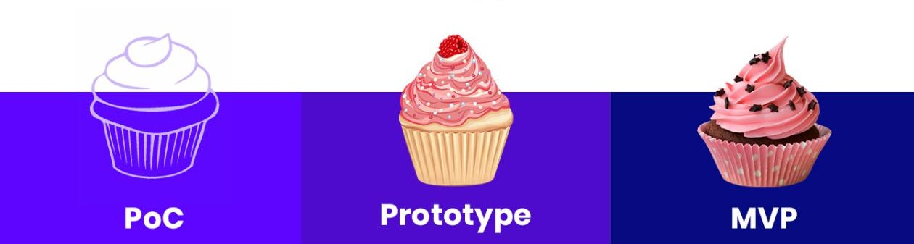
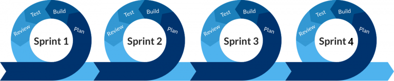
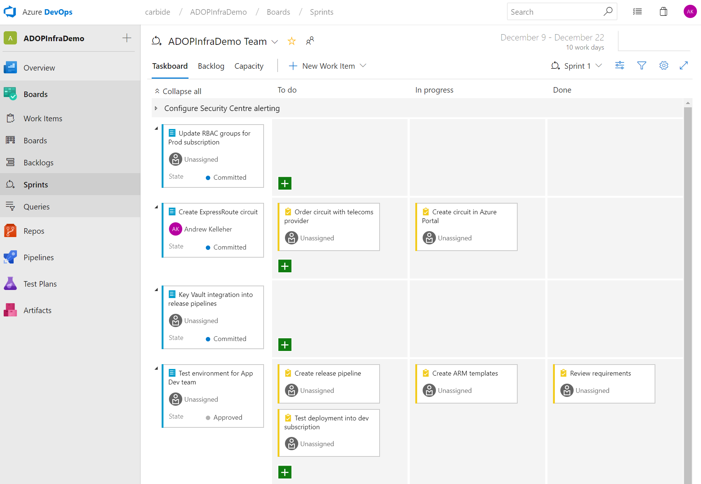

---
feature_image:
authors:
- jungwoo-kim
date: "2021-04-19T00:00:00Z"
categories:
- Mate Story

tags:
- 후기
- Azure DevOps
title: 스프린트, 직접 해본 이야기
---

## 2달 만에 자사 솔루션 MVP 만들기 (5명이서...)
자사 솔루션 개발이라는 프로젝트가 주어졌습니다.
MVP(Minimum viable product)를 2개월 동안 개발해야 하는 상황이었습니다. 이번 프로젝트를 스프린트 방식으로 개발해보고자 하는데, 스프린트 기간은 개발해야 하는 상품과 서비스, 상황에 따라 달라질 수 있습니다. 자사 솔루션을 MVP로 개발하는데 필요한 핵심 기능 구현을 목표로 세우고 각 스프린트를 2주씩 진행하기로 했습니다.

> **MVP(Minimum Viable Product) 개발이란?**
> '최소한의 노력으로 최대한의 고객 검증이 가능한 버전의 제품'을 개발하는 것!
검증하고자 하는 핵심 기능을 짧은 시간 안에 만든 뒤 고객 피드백에 따라 다음 회차 개발에 추가할 기능들을 결정합니다.

## 스프린트 설정하기
자사 솔루션의 핵심 기능 별로 스프린트 목표를 4개로 쪼개고 각 기간은 최대 2주(근무일 10일)로 설정하였습니다. 그리고 각 스프린트마다 구현해야 할 결과물에 대하여 팀원들과 협의를 통하여 결정하였습니다.

- 과제 - 자사 솔루션 만들기
- 팀 - 데이터 전문가, 웹앱 백/프론트엔드 전문가, BI 전문가, 영업 담당자
- 시간 - 프로젝트 업무만 할 수 있도록 Full time을 확보하며, 하루 업무 집중 시간은 4시간으로 정했습니다.
- 장소 - 회사 회의실을 사용하고, 중간 커뮤니케이션은 Teams 메신저를 통해 온라인으로 진행하였습니다.
- 진행자 - PM을 선정하여 전체 프로젝트 일정과 커뮤니케이션, 작업 진척도를 확인하였습니다.

### PM으로서 크루들에게 제시한 몇 가지 거버넌스 중 강조한 항목들이 있었습니다.

- **주체적 사고** : 
본인이 제품을 사용할 고객이라고 생각하고 주체적인 사고를 하자.
- **다양성** :
말한 사람이 반드시 구현의 책임을 지는 것은 아니다.
- **짧고 빈번한 논의** :
논의가 다 된 사항에 대해서는 즉시 종료. 추가 사항이 있다면 1:1로 해결.
- **실행** :
Plan - Do - See 중 'Do'가 가장 중요하다.
- **자아 실현** :
좋은 제품을 개발하는 것은 회사의 성공이기도 하지만, 본인의 성공이기도 하다.
## 진행 과정
1개의 스프린트는 5단계로 나뉘어 실행되었습니다.

- 1단계 : 아이디어 퍼붓기
- 2단계 : 기술 탐색
- 3단계 : 방향 결정 및 구현
- 4단계 : 더 열심히 구현
- 5단계 : 테스트 및 보완

### 1단계 '아이디어 쏟아내기'
업무 영역별이 아닌 모든 크루가 모여 본인의 업무 영역이 아니더라도 함께 아이디어를 개진할 수 있도록 하였습니다. 이른바 '아이디어 쏟아내기' 미팅은 우리가 갖고 있는 제한된 리소스는 배제한 상태에서 '우리가 할 수 있는', '선택할 수 있는' 모든 아이디어에 대해서 다양하게 발언하며 진행했습니다. 여러 아이디어들은 대략 아래와 같은 형태였습니다.

>"개발 스택은 이러한 이유로 이렇게 선정해야 합니다."
"디자인 테마는 유료 템플릿을 구매하여 최적화 하면 작업 시간을 줄일 수 있습니다."
"개발DB, 운영DB 에 대한 운영은 이렇게 하는 것이 좋습니다."

### 2단계 '기술 탐색'
1단계에서 나온 여러가지 아이디어들을 구현해내기 위한 기술 탐색을 진행했습니다. 러닝커브가 얼마나 발생할지, 보안 상 문제가 없는지 등에 대한 점수를 부여하기 보다 오로지 기술 스택을 찾아내는데에만 집중 했습니다.

### 3단계 '방향 결정 및 구현'
3단계에서는 2단계에서 탐색된 다양한 기술들을 한데 모아, 여러가지 측면으로 지표를 설정하여 각 기술을 모든 크루가 평가하였고 획득한 점수가 가장 높은 것을 채택하여 방향을 결정하였습니다. 시간이 여유롭지 않다고 판단되어, 결정된 방향에 맞춰서 바로 구현을 진행했습니다.

### 4단계 '더 열심히 구현'
4단계에서는 결정된 방향과 구현된 형태를 더욱 집중에서 구현해나갔던 단계였습니다. 아래는 PM 포함 5명의 크루가 각자 구현을 담당했던 job 입니다.

- A크루 : 외부 API 또는 SDK 와 연동하여 우리에게 필요한 데이터를 load하여 DB에 적재.
- B크루(PM) : DB 내에서 서비스 가능한 형태로 transform.
- C크루 : WebApp 전반적인 front-end, back-end 개발
- D크루 : WebApp의 admin 기능 개발 (BackOffice)
- E크루 : WebApp front-end 에서 데이터 시각화 개발

서비스 데이터의 흐름을 정의하였고, 대략 이렇게 유통 됩니다.

B : DB 설계/구축 → A : 외부 데이터 DB 적재 → C : 웹앱에 로그인하여 페이지 호출 → E : 데이터 시각화 표현

### 5단계 '테스트 및 보완'
Sprint 의 말미에 5단계 '테스트 및 보완' 에서는 구현된 기능에 대해 모두 모여서 (또는 온라인 미팅) 잘 된 점에 대해서 리뷰하고 기능적으로 미진한 부분에 대한 피드백을 전달했습니다. 또한 반복적인 QA 활동을 통하여 디버깅, 기능 향상, UI/UX 향상을 도모했습니다.

특정 크루에게만 연관성이 높은 이슈인 경우에는 모두 모인 자리가 아닌 별도의 1:1 미팅을 통하여 피드백을 드렸습니다.

## 스프린트 작업 진척도 관리 - Azure DevOps Board
Azure DevOps Boards에서는 Azure DevOps에서 등록한 모든 work item을 관리할 수 있습니다.
특히, Boards 기능 중 제가 가장 좋아하는 기능은 "Sprints" 인데요, 각 각의 작업(work item)에 목표 수행시기(time)를 덧입히는 기능이라고 이해하시면 됩니다. Boards 안에는 Sprints 외에도 좋은 기능들이 많이 있는데요. Boards 에서 칸반보드 형태로 각 스윔레인 마다 feature, story의 상태를 한 눈에 파악할 수 있으며, Backlog에서는 모든 work item에 대한 tree 구조의 백로그 뷰가 제공됩니다.

각 Sprint 마다 기간은 2주로 설정되어 있고, 비대면 미팅을 개최하여 2주 이내에 완수할 수 있는 task 들을 먼저 각자 sketch-up 할 수 있게 했습니다. 그리고 정해진 개발 일정을 준수할 수 있도록 1~2일 마다 크루의 작업 진행 상황을 체크하였습니다. 아무래도 짧은 기간 내에 MVP를 만들어내기 위해서는 작업 진척도 관리가 필수적이었습니다. 작업이 잘되고 있는지, 잘 안되고 있다면 어떤 부분 때문에 그런지 각 크루들과 온라인 및 오프라인으로 수시로 커뮤니케이션을 하면서 리뷰 및 QA 를 진행하였습니다. 진행 중 예상하지 못한 변수가 발생했을 때에는 함께 해결책을 찾아드리거나, Plan B를 제시하였습니다.

## 결과 및 후기
약속된 2달이 지난 시점에 우리는 당초 계획했던 MVP를 높은 달성 수준을 보이며 출시할 수 있었습니다.
TF 크루들이 굉장한 실력자였던 것은 PM으로서 크나큰 행운이었다고 생각합니다. 모든 크루들은 본인이 해야 할 일을 정확히 이해하고 있었고, 모든 task들이 계획했던 스프린트 기간 내에 모두 완료되었습니다.

개인적으로 어려웠던 점을 꼽아본다면, 어떤 어려움에 봉착한 크루가 있는지 지속적으로 살피고 업무 진척이 되지 않는 크루에게 다가가 어떤 어려움인지 들어본 후 적절한 솔루션을 찾아서 알려주는 것이었습니다. 각 크루마다의 업무 진척 상황을 살피고 다가갈 때에 너무 재촉하는 느낌으로 다가가지 않으려고 노력했습니다.

팀 내 협업 능력이 프로젝트를 성공적으로 마무리하는데 정말 큰 몫을 한다는 것을 다시 한 번 깨달았던 좋은 경험이었습니다.