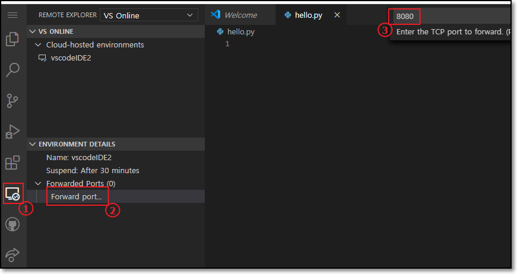
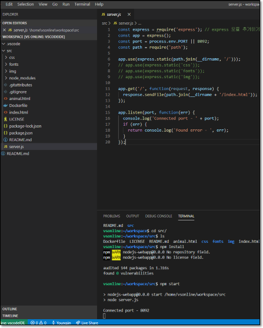

# Visual Studio Codespace.
- (추가) 5월 1일 일자로 서비스 명 변경.  
Visual Studio Online -> Visual Studio Codespace
## 특징  
- 대부분의 프로그래밍 언어를 지원하는 가상 환경(Cloud-hosted)을 제공하고,    
- 최소한의 IDE 셋팅으로 어디서든 같은환경에서 작업 혹은 협업이 가능하다.
- VS의 확장기능을 그대로 사용하고있어, 확장성이 뛰어나다.

## 사용법
### 로그인
- https://online.visualstudio.com/login
- 로그인 후 초기 화면  
first_main.png)  

### Setting
- Billing이 이루어질 Azure Subscription에 Plan을 생성한다.
- 생성한 Plan에서 Codespace(프로젝트 단위)들을 생성할 수 있다.
#### 1. Create new plan
- 새로운 Plan 생성  
NewPlan.PNG)  
- 생성할 Azure Subscription 지정하고, 해당 Plan에 대한 리소스 생성.  
#### 2. Create Codespaces
- 생성할 Codespaces에 대한 환경 정의.  
NewEnv.PNG)  
```txt
Environment Name : 프로젝트 환경 이름
Git Repository : 비워두거나, git 주소 입력
Instance Type : Standard (Linux): 4 cores, 8 GB RAM,
                Basic (Linux): 2cores, 4GB RAM
                Preminum (Linux): 8 cores, 16 GB RAM.
```
- 과금은 호스트 비용과 사용량에 따라 결정된다. [>가격플랜 보기](https://azure.microsoft.com/ko-kr/pricing/details/visual-studio-online/)

### Codespace
- Codespaces 생성 후 초기 화면  
webenv_suc.PNG)  
- Visual Code의 인터페이스.
- 왼쪽 아이콘 메뉴
```
Explorer : 프로젝트 탐색기
Search : 찾기기능
Source Control : 소스 컨트롤
Run : 소스코드 실행
Extensions : 확장기능
Remote Explorer : host 서버의 env 탐색기
Github Pull Requests : github의 풀리퀘스트기능
Live Share : 코드 협업 기능
```

### Python 실험
- hello.py 파일 생성
- Python Extension 설치를 통해 사용가능.
- 설치 후 Reload 필요.
- 실행(F5)  
Runpython.PNG)  

### Frontweb와 Portforward 
- host 접근 방법
```
좌측 메뉴 remote explorer > 좌측하단 Forwarded Ports 추가 > 실행시킬 웹서버 포트 입력
> 생성된 메뉴를 통해 접속.
```
  
- 
### 예제 - Nodejs
- [>예제 소스](https://github.com/mate365/AzureDevOps_ProblemSolving.git/tree/master/src)
- [>참고페이지](https://code.visualstudio.com/docs/nodejs/nodejs-tutorial)
- [>참고영상](https://channel9.msdn.com/Series/Visual-Studio-Online-Monaco/Getting-started-with-nodejs)
- 서버 실행 명령어
```
npm install
npm start
```
- 실행화면  
  
- Forwarded Ports 추가를 통해 웹서버 접속 확인.
### python Django
- [> Sample APP (github)](https://github.com/mate365/python_web_example)
- 버전 선택  
  
- `Python: Select Interpreter` 을 통해 버전을 선택한다.
- `pip install -r requirements.txt`을 통해 패키지 설치한다.
- Run(F5)를 통해 django 서버 실행.  
  

- Python Extension 설치후 Run(F5)을 통해 위와 같은 화면을 볼 수 있다. Django 선택을 통해 Run 할수있다.

## VisualStudio Code Application에서 편집
- Web 환경이 아닌 VS Code Application에서 그대로 사용 가능하다.
```buildoutcfg
왼쪽 Extension 메뉴 > Visual Studio Codespaces 설치
> 왼쪽 Remote Explorer 메뉴에서 Cloud-hosted Codespaces 를 통해 로그인 후 접속
```
- Web 환경과 많은 차이가 없다.
- [(참고링크1)](https://evols-atirev.tistory.com/28)
[(참고링크2)](https://code.visualstudio.com/docs/remote/vsonline)

### 후기
- VS Code를 사용하는것과 매우 유사. 강력한 Extension 기능을 그대로 사용할수있다.
- 프로젝트마다 독립적으로 Cloud-hosted 에서 작업할 수있는 장점이 있다.
- 기본적인 개발환경이 구축된 host를 제공하고, Codespace의 생성속도가 빠르기때문에 **생산성이 높다**. 
- vscode의 extension을 통해 vscode APP 에서 그대로 사용가능하다.
