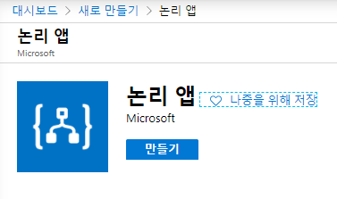
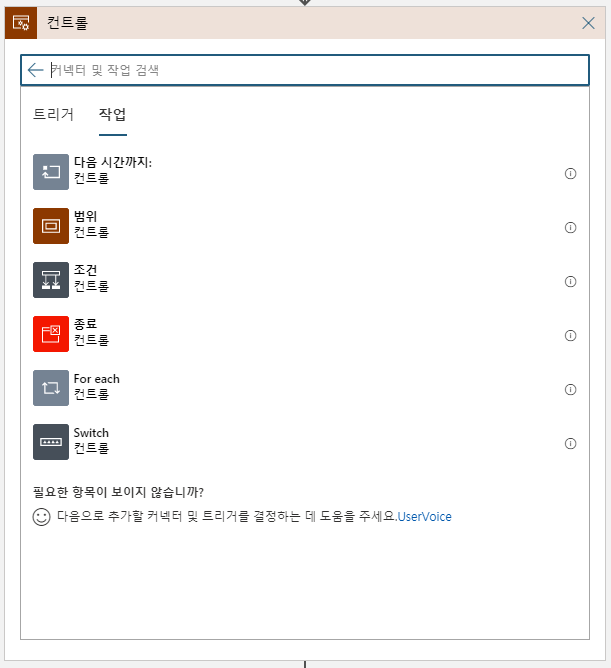
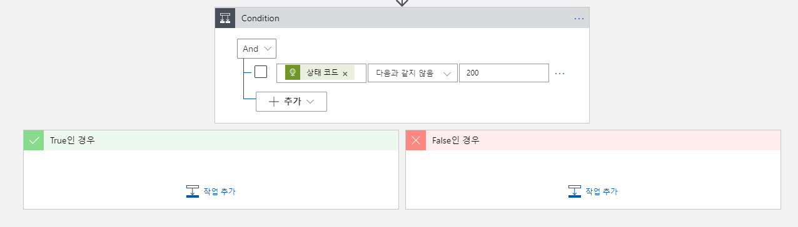
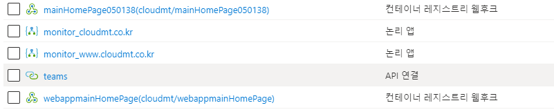
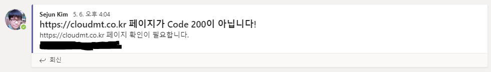

## 주저리주저리
웹사이트가 죽었다.
모니터링을 별도로 할 만큼 중요한 서비스는 아니었지만, 이대로 두다간 우리가 멍청이가 될 것 같아 모니터링을 설정하기로 했다. 우선 대응은 휴먼 드리븐으로 결정! 대응까지 자동화 하기엔 아직 이 사이트의 경험치가 부족하다고 판단되었기 때문이다. 그럼 어디 한번 모니터링을 걸어볼까?
그런데 문제가 생겼다. 이 사이트는 돈을 1원도 벌어오지 못하고 오히려 돈을 써서 유지해야 하는 사이트다 보니 유료 모니터링이 부담스러웠다. 그래서 예~~~전 Global Azure BootCamp 2017때 김영재님께서 공유해주셨던 Logic App으로 웹사이트 모니터링 하기를 설정하기로 했다.

Global Azure BootCamp 2017은 [여기](https://www.youtube.com/watch?v=fkgo8a4EO0s)서 다시보자! **49:35초**부터 시작한다.

## 준비물
1. Azure 구독
1. 모니터링을 해야 하는 웹 사이트 URL(s)
1. Teams의 특정 채널의 접근 권한 (읽기 & 쓰기)
1. 하고자 하는 의지

## Logic App을 만들어 보자!
Logic App은 워크플로(Workflow)를 GUI를 통하여 구성하면 Serverless로 동작하는 PaaS이다. 말은 복잡하지만 쉽게 이야기 하자면 GUI를 통해 드래그&드랍을 이용하여 원하는 워크플로를 구현할 수 있다는 말이다. 또한 Microsoft가 많은 Plug-in들을 만들어서 거의 대부분의 워크플로는 **코딩(Coding) 없이(codeless)** 구현할 수 있다. 개발자가 개입하여 Azure Functions나 Logic App Plug-ins를 개발할 수도 있지만 우선 codeless로 구성할 수 있다는 점과 Serverless로 동작한다는 점이 꽤 매력적이다.

한번 해보자! 우선 [Azure Portal](https://portal.azure.com/)에 접속하여 Logic App을 새로 만든다.

> Logic App은 한글로 논리 앱이라고 부르나보다.

2020년 5월 21일 기준 한국 중부와 한국 남부에 Logic App을 사용할 수 있다. (lol)

## Logic App에 기본 골격을 잡아보자!
Logic App을 만들었으면 이제 기본 워크플로를 만들 차례인데... 뭘 해야 할까? 우선 문제를 해결하기 위한 목표를 생각해 보자.
1. 웹사이트가 죽은걸 먼저 알고 싶어요.
1. 죽은 웹사이트를 고치기 위해 특정 사람을 호출하고 싶어요.

우선 첫번째 문제를 해결하기 위해서 어떤 작업을 하면 되는지 생각해 보자. 웹사이트가 죽었다는 정의는 뭘까? 보통 웹사이트가 죽었다는 것은 특정 URL을 요청했을 때 응답을 하지 않을 때 우리는 **웹사이트가 죽었다**고 표현한다. *(만약 다른 의견이 있다면, 별도로 알려주세요! 저도 배우게요.)* 이를 사람이 한다면 보통 다음과 같은 작업을 할 것이다.
1. URL을 접속해 본다.
1. 주기적으로 페이지를 리프레쉬 해본다.
1. 페이지가 뜨지 않을 때 담당자에게 알린다.

이를 워크플로로 정의해보면,
1. 일정한 주기를 가지고
1. 특정 URL에 요청을 보내어
1. URL의 상태코드가 OK가 아니면
1. 담당자에게 알린다.

그렇다면 이 워크플로를 그대로 Logic App에 구현해 보자. 위에서 정의한 워크플로를 살펴보면 첫번째 하는 일이 **주기를 가지고** 작업이 된다. 우리는 이를 스케줄에 의한 작업으로 이야기 한다. 워크플로의 가장 처음은 **"언제 시작 해야 하는가?"**를 정의하기에 특정한 시점을 지칭하는 `트리거`와 반복적인 주기 또는 지정한 시각을 지칭하는 `스케줄`로 나눌 수 있다. 이번 사례에선 `스케줄`로 시작한다. Logic App에서 **일정**을 검색하여 **되풀이**를 이용하여 일정한 주기를 통해 작업을 수행해 보자. 웹사이트의 중요도에 따라 **요청 주기**를 설정할 수 있을 건데, 여기서 주의할 점은 Logic App이 Serverless라는 것에 있다. Serverless는 사용한 만큼 비용을 지불하기 때문에 자주 사용할 수록 비용이 높은 특징일 가진다. 앞서 설명했듯이 그리 중요하지 않은 웹사이트를 모니터링 하기에 1시간에 한번 정도 웹사이트의 상태를 체크하기로 하자.

그 다음은 특정 URL에 요청을 보내야 한다. 일반적으로 `curl` 또는 `invoke-webrequest`와 같은 요청을 CLI로 수행하면 얻어낼 수 있는 결과이다. 다행히도 Logic App에 기본적인 Plug-in이 있으며 이를 이용하여 URL에 요청해 보자. 일반적인 요청만 하면 되기 때문에 GET 메서드를 사용할 것이고, 테스트 할 URI는 `https://tech.cloudmt.co.kr`을 모니터링 할 것이다. 우리가 모니터링 할 웹사이트는 단순한 웹 페이지이며 Query String이나 Custom header는 별도로 필요로 하지 않는다.

한가지 재밌는 부분은 Logic App에서 동적 콘텐츠를 지원한다는 점이다. 동적 컨텐츠는 이전 결과 값을 이용하여 다음 작업을 수행할 때 도움을 받는 콘텐츠인데 이게 꽤 유용하다. 다음에 그것을 구현해 보자.

그 다음은 프로그램에 ㅍ을 건드려본 사람은 다 아는 if문이다. **URL의 상태코드가 OK가 아니면**을 구현하려면 URL 요청의 결과값이 OK여야 한다는 것을 의미하거나, URL 요청의 결과값이 NO여야 한다는 것을 의미한다. 그렇다면 워크플로에 if문을 집어넣어야 한다.(!) 이를 가능하게 하는 것이 바로 조건(if, Condition)이다. Logic App의 `조건`은 `컨트롤`이라는 작업 내에 존재하기에 컨트롤을 먼저 검색한 후 조건을 찾아 들어가자.

여러가지 조건을 And 또는 Or 조건으로 묶을 수 있지만, 중복으로 설정할 수 없다. 우리는 하나의 조건만 가지고 분류를 할 것이기 때문에 무엇이든 상관 없다. 일반적으로 웹사이트를 요청했을 때 HTTP 상태 코드에 2xx와 3xx 가 출력되는 것은 `문제로 보지 않는다.` 그렇다고 해서 2xx와 3xx 상태코드를 전부 `정상`으로 조작하기엔 문제가 있다. 우리가 모니터링 하는 목표를 다시 한번 확인해 보자. 우리의 목표는 특정 URL을 가진 웹사이트가 죽었는지를 확인하는 절차이다. 그렇다면 특정 URL의 상태 코드가 **고정**이거나 **일정 범위 내에**있을 가능성이 높다. 그렇다면 우리는 그 범위를 초과할 시 알람을 하면 되지 않을까?

우리가 모니터링을 해야 할 페이지는 고정이고, 그 페이지의 응답코드도 고정이라면 해당 HTTP 상태코드를 기준으로 Alert설정이 가능할 것이다. 따라서 다음과 같이 `컨트롤`을 설정한다. 설정할 때 앞서 출력된 결과인 HTTP의 상태 코드를 가져온다.

화면에서 보는 것 같이 `컨트롤`을 추가하면 **Ture**와 **False**인 경우를 입력할 수 있다. 우리는 상태코드가 고정인 페이지를 확인하는 것이기 때문에 **True**인 경우 웹사이트가 예상치 않게 동작하는 것임을 알 수 있다. 따라서 **True**에 작업을 추가해 보도록 하자. 다음과 같이 `Microsoft Teams`를 입력하여 Teams 채널에 연결해 보도록 하자. Slack이나 다른 Plug-In을 사용할 경우 검색 또는 Azure Functions를 연결하여 사용하자. `Microsoft Teams`를 선택하면 로그인 창이 뜰 것이고, 해당 계정으로 Microsoft Teams에 메시지가 게시될 것이다. 인증 값은 Microsoft Azure에 암호화되어 저장되며 이는 다음과 같이 `API 연결`로 저장된다.

> 최근 Teams Flow bot을 통한 메시지 게시도 할 수 있도록 기능이 추가되었다.

여러가지 작업 중에 `메시지 게시(V3) (미리 보기)`를 선택하고 메시지를 게시할 팀과 채널을 선택한다. 앞서 Microsoft Teams에 로그인한 계정이 접근 가능한 팀과 채널을 선택할 수 있다. 그런 후 다음과 같이 메시지를 입력하면 선택된 팀 채널에 메시지가 게시된다.

> 정상적인 메시지가 확인된다!

이렇게 모니터링을 설정해 두면 해당 채널에 메시지가 게시될 때 우리의 웹사이트는 장애를 겪게 될 것이며 누구든지 이 이슈를 해결해야 할 것이다! 하지만 메시지만 게시되는 것이라면 좀 불편하지 않을까? 그래서 다음엔 특정 사용자를 @멘션 하여 호출하는 방법에 대해 알아보자!