## 1. Managed Instance 개요

NetApp by Spot의 Managed Instance는 AWS의 단일 EC2 인스턴스를 Spot으로 활용, 관리하는 서비스입니다.

실습하기 전에 다음의 요구사항이 충족해야 합니다.
* AWS계정이 [Spot 계정](https://docs.spot.io/connect-your-cloud-provider/aws-account)에 연결되어 있는지 확인해야 합니다.
* [Spot 정책](https://docs.spot.io/elastigroup/tutorials/elastigroup-tasks/update-spot-policy)이 최신 상태인지 확인해야 합니다.
* Memory 관련 그래프에는 [CloudWatch 에이전트](https://docs.aws.amazon.com/AWSEC2/latest/UserGuide/mon-scripts.html)가 필요합니다.
* 실습을 진행할 VPC와 서브넷, Security Groups, Key pair가 필요합니다.  

요구사항을 충족했다면, 바로 시작하겠습니다.

---
## 2. Managed Instance 생성

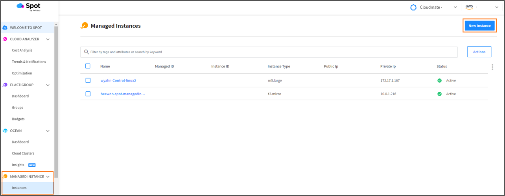
Managed Instance를 생성할 적절한 Account와 Organizations를 선택합니다.  
좌측 하단의 Managed Instance → Instance를 클릭하고 New Instance를 클릭합니다.

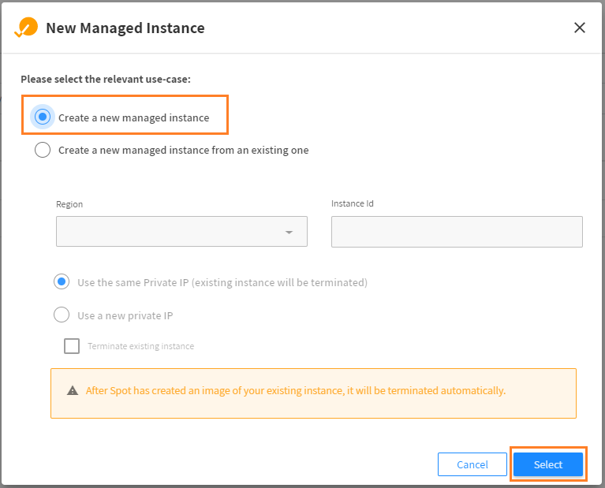
Spot 콘솔에서 EC2를 생성할 수 있고 기존에 생성되어 있는 EC2를 가져올 수도 있습니다만, 여기서는 새 EC2를 생성하겠습니다.

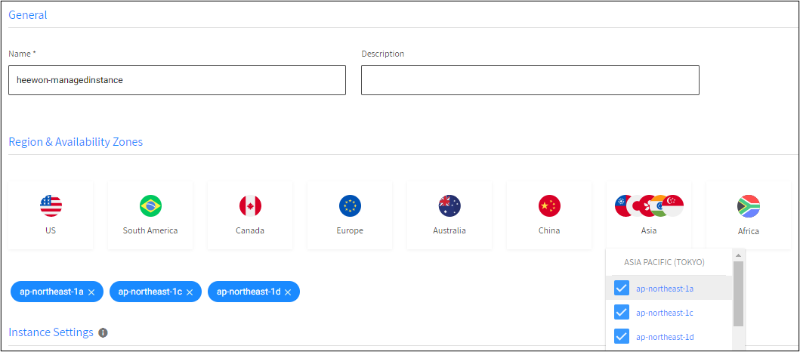
Managed Instance의 이름을 지정하고, 리전과 AZ를 선택합니다. 저는 도쿄 리전을 선택했습니다.

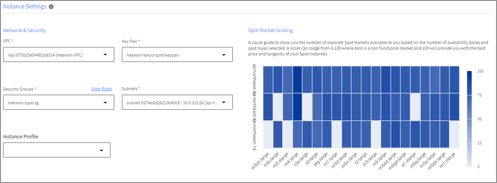
Network & Security 설정에서 적절한 VPC, Key Pair, Security Groups, Subnets, Instance Profile(Optional)을 선택합니다.
>우측의 Spot Market Scoring은 선호하는 인스턴스 유형의 마켓의 수를 보여주는 시각적인 가이드입니다. 점수 범위는 0~100이며, 높을 수록 최상의 가격과 수명을 제공합니다.

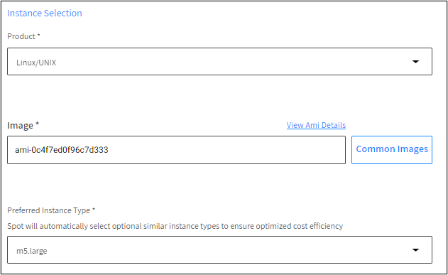
이제 인스턴스를 선택해야 합니다. 고를 수 있는 OS의 종류는 Linux/Unix, SUSE Linux, Windwos, Red Hat Enterprise Linux가 있습니다.  
이미지를 선택합니다. AMI ID를 직접 입력하셔도 되고, 우측의 Common Images를 클릭하여 SELECT 해도 무방합니다.  

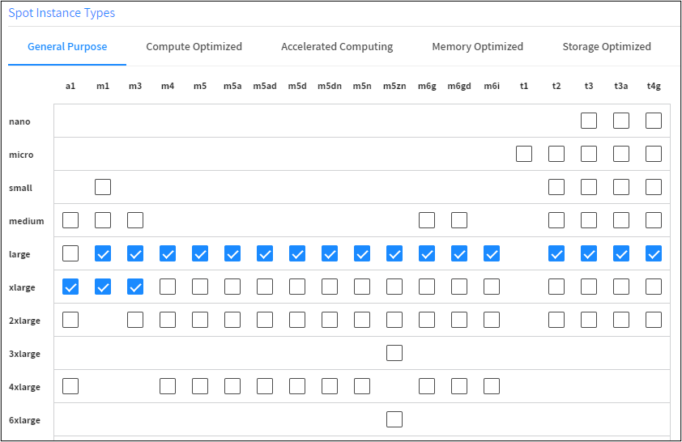
선호하는 인스턴스 타입을 선택합니다. 선택하면 유사한 인스턴스 유형이 자동으로 선택됩니다. 클릭으로 다른 유형을 추가하거나, 제외할 수 있습니다.

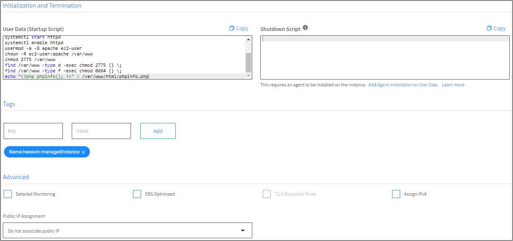
User data 스크립트를 작성하여 인스턴스가 시작될 때 스크립트를 실행할 수 있고, Shutdown Script로 인스턴스가 종료되기 전에 스크립트를 실행할 수 있습니다.  
User data에 웹 서버와 PHP를 설치하여 phpinfo를 여는 스크립트를 작성했습니다. 필요하다면 Shutdown script도 작성할 수 있고, 'Add Agent installation to User Data'를 클릭하여 User data에 에이전트 설치 항목을 추가해야 합니다.  

태그와 고급, Public IP 할당 등은 상황에 맞게 설정하면 되겠습니다. 여기까지 했다면 다음으로 넘어갑니다.

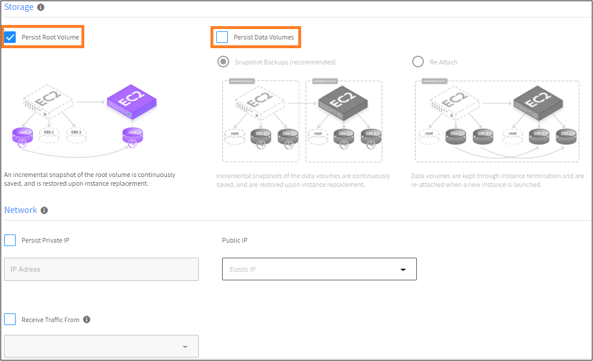
스토리지 옵션입니다. Persist Root Volume (기본값)이나 Persist Data Volumes를 설정하면 스팟 인스턴스가 교체된다 하더라도 데이터를 유지할 수 있습니다.  

Root Volume은 인스턴스가 실행되는 동안 루트 볼륨의 스냅샷이 주기적으로 생성되고, 인스턴스가 종료되면 마지막 스냅샷에서 이미지가 생성되고 그 이미지에서 새 인스턴스가 시작되는 방식입니다.  
Data Volumes은 인스턴스가 교체될 때 동일한 [BlockDeviceMapping](https://docs.aws.amazon.com/ko_kr/AWSEC2/latest/UserGuide/block-device-mapping-concepts.html) 구성을 사용하여 새 인스턴스에 표시되는 방식입니다.  

Data Volumes에는 두 가지 방식이 있습니다.
* Snapshot Backups (recommended) : 인스턴스가 실행되는 동안 데이터 볼륨의 스냅샷이 주기적으로 생성됩니다. 스팟 인스턴스 교체 시 최신 스냅샷에서 새 EBS 볼륨이 생성되고 BlockDevcieMapping을 업데이트하여 시작 시 새 인스턴스에 연결됩니다.  
* Re-Attach : 동일한 EBS 볼륨이 기존 인스턴스에서 분리되고 새로 시작된 인스턴스에 다시 연결됩니다. 새 인스턴스가 다른 AZ에서 시작되면 스냅샷을 사용하여 새 볼륨을 생성하고 새 인스턴스에 연결합니다. 동일한 AZ에서 인스턴스가 시작되는 한 동일한 볼륨이 유지됩니다.

네트워크 옵션입니다. 프라이빗 IP를 사용자가 지정하여 유지할 수 있습니다. 하지만 이 옵션을 사용하면 단일 AZ로 제한됩니다.  
퍼블릭 IP를 EIP로 적용할 수 있고, 트래픽을 Route 53이나 로드밸런서로 받을 수도 있습니다.

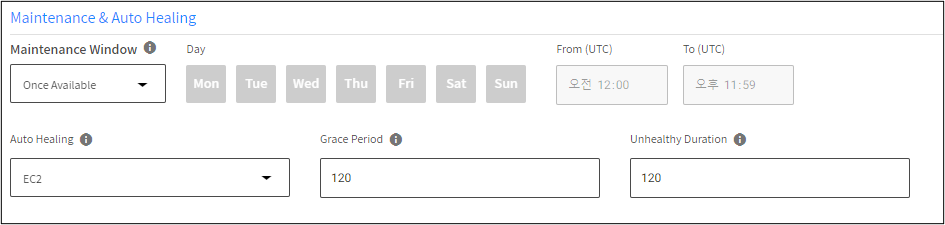
메인터넌스와 Auto Healing 옵션입니다.  
기본적으로 Spot 인스턴스를 활용하지만 스팟 시장 환경에 따라 사용 가능한 인스턴스가 없을 수도 있습니다. 그럴 경우에 Spot은 가용성을 위해 온디맨드 인스턴스로 시작합니다.  메인터넌스는 온디맨드 인스턴스를 스팟 인스턴스로 교체하는 프로세스입니다.
* Once Available (기본값) : 시장을 계속 모니터링하다가 스팟 인스턴스를 사용할 수 있으면 교체하는 옵션입니다. 그렇기에 Day와 Time이 비활성화 되어 있습니다.
* Never : 온디맨드에서 스팟 인스턴스로 대체하지 않는 옵션입니다.
* Custom : 사용자가 설정한 시간대에서만 변경이 가능한 옵션입니다.

Auto Healing을 활성화하면 Health Check가 비정상인 인스턴스를 교체할 수 있습니다.  
* Grace Period : 인스턴스가 부팅되고 애플리케이션이 완전히 시작될 수 있는 시간입니다. 설정한 시간 동안은 이 옵션이 유예됩니다. 해당 시간이 지나고 인스턴스가 비정상인 경우 [Blue-Green 배포 방식](https://en.wikipedia.org/wiki/Blue-green_deployment)으로 교체됩니다.  
* Unhealthy Duration : 인스턴스가 종료되고 새 인스턴스로 교체되기 전에 비정상이라고 간주되는 기존 인스턴스를 유지하려는 시간입니다. 인스턴스가 한 번 이상 정상이어야 유효합니다.
> 구성된 Auto Healing 시간 중 인스턴스가 비정상이어도 인스턴스를 교체하지 않습니다. 유예 시간이 끝나야 비정상 인스턴스를 교체합니다.

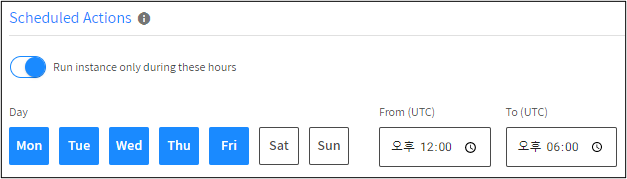
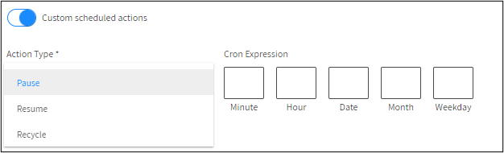
* Run instance only during these hours : 설정한 시간동안만 인스턴스를 실행합니다. 기본값이 UTC이기에 KST로 변환해서 진행해야 합니다.  
* Custom scheduled actions : cron 표현식으로 사용자 지정 스케줄을 생성할 수도 있습니다.  
Recycle은 실행중인 EC2가 종료되고 동일한 인스턴스로 시작합니다.

> 둘 중 하나만 선택이 가능합니다. Run instance only during these hours를 선택하면 Custom scheduled actions가 비활성화되고, 그 반대 경우도 동일합니다.

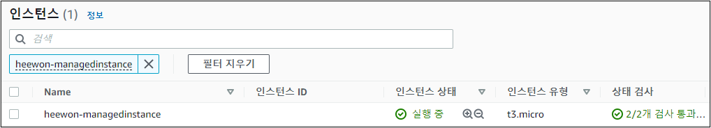
모든 설정이 완료되면 검토 후 생성합니다. 생성하면 EC2 리소스가 생성되는 것을 확인할 수 있습니다.

## 3. Managed Instance 대시보드
생성이 완료되고 Managed Instance → Instance → 해당 Instance를 클릭하면 대시보드를 볼 수 있습니다.
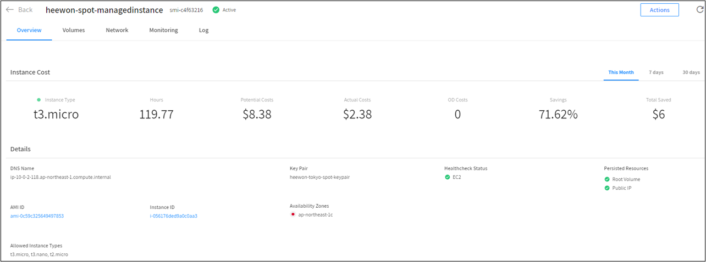
대시보드에서 전체적인 개요 및 디테일을 볼 수 있고, 볼륨 및 네트워크, 모니터링, 로그를 확인할 수 있습니다. 리소스를 미리 생성해놓아서 119시간이라고 표시되어 있습니다.  
* Potential Costs : 잠재적 비용  
* Actual Costs : 실제 비용  
* Saving : 할인율  
* Total Saved : 잠재적 비용에서 실제 비용을 뺀 금액 (할인 금액)

위 스크린샷의 경우 119.77시간동안 실행된 인스턴스의 금액이 $8.38이지만, Spot으로 $2.38 (71.62% 할인) 으로 책정됩니다.  

여기까지 Spot Managed Instance를 사용하여 EC2 인스턴스 비용절감을 진행했습니다.  

출처입니다.  
<https://docs.spot.io/>  
<https://en.wikipedia.org/wiki/Blue-green_deployment>
<https://docs.aws.amazon.com/ko_kr/AWSEC2/latest/UserGuide/block-device-mapping-concepts.html>
