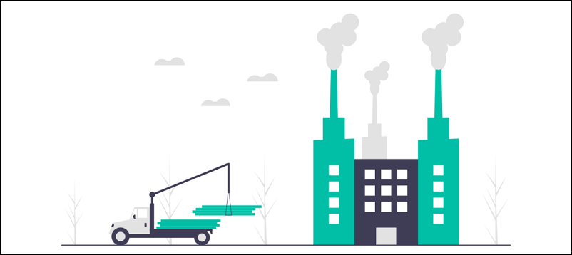

온프레미스(On-premise)또는 클라우드를 운영하다 보면 자동화에 대해 생각을 하게 될 것입니다. 자동화는 기술을 사용해 사람의 개입을 줄이면서 태스크를 수행하는 것을 뜻하며, 반복적인 태스크를 처리하는 모든 업계에서 자동화를 사용할 수 있습니다. [1]

▲ 대량 생산을 위해 단계별로 표준화하고 자동화 시킨 것이 공장과 유사하다고 생각합니다.

IT 자동화는 표준 운영 환경(Standard Operating Environment, SOE)을 사용한 프로비저닝 자동화와 같이, IT 시스템에 대한 수동 작업을 대체하기 위해 반복적인 일련의 프로세스를 수행하는 명령 시스템입니다. [2]

---

**■ 처음 경험했던 운영체제의 스케줄러를 이용한 자동화**

클라우드메이트에 합류하기 이전에는 기업 대상으로 Client & Server 형태의 솔루션을 납품하고 유지 보수하는 일을 하였습니다.  
매월 고객사로 정기 점검을 위해 방문했을 때, 서버의 스케줄러에 등록된 작업이 정상적으로 동작했었는지 확인했습니다.  
오류가 발생했다면 해당 부분을 확인하고 수정하여 정상적인 작업을 할 수 있게 하였습니다.

 

**▼ 아래는 솔루션 서버에서 자동화 관련 작업의 예시 입니다.**

- 로그&데이터 백업
    - 솔루션 프로그램 로그와 웹 서버의 로그를 압축 파일로 정리 후 특정 경로에 이동 처리
    - 솔루션 데이터베이스 서버를 전체 백업하여 특정 경로에 이동 처리
    - 특정 데이터 백업 처리
- 백업파일 보관
    - 파일이 00개만 유지될 수 있도록 관리
    - 파일이 생성 이후 00일이 지나면 삭제

예시처럼 특정 시간에 특정 작업을 수행하기 위해서는 해당 환경에 맞는 도구 또는 서비스를 활용하여 구현해야 합니다.

---

**▼ 운영체제의 스케줄러를 이용한 자동화를 3단계**

- **⏰ Trigger**
    - Trigger는 원하는 시간에 맞춰 실행하는 알람 시계 같은 역할이라 할 수 있습니다.
- **🚀 Action**
    - Trigger에 의해 Action을 수행하게 되는데, 
    미리 작성된 스크립트 또는 프로그램 언어를 사용하여 정의된 작업을 수행하게 됩니다.
- **🏁 Target**
    - Action에 의해 Target의 상태가 변경됩니다.
    따라서 어떤 Target이 작업 대상인지 명확히 분류해야 합니다.

살펴보면 Trigger는 해당 환경에 맞는 도구를 활용하면 되지만 Action과 Target 부분은 프로그램 개발 지식이 조금은 필요합니다. 최소한 스크립트를 작성하여 Target 프로그램에서 제공하는 command로 제어할 수 있다면 자동화를 할 수 있습니다.

---

**■ 클라우드 환경에서의 자동화**

On-premises라고 불리는 서버실, IDC에서는 물리 장비를 사람이 작업해야 하는 부분이 있어 자동화가 어려운 부분이 있습니다.  
하지만 클라우드에서는 CSP(클라우드 서비스 제공 업체)에서 물리 장비를 관리하고 가상화 기술을 통해 고객에게 서버와 SDK를 제공합니다. 그래서 속도 및 민첩성 향상이라는 클라우드 이점을 가져갈 수 있게 되었습니다.

클라우드에서도 Trigger, Action, Target 항목에 맞춰 분류하면 아래 표와 같습니다.

이미 자동화 관련해서는 “Tutorial: Schedule AWS Lambda functions using EventBridge” [3] 가이드가 제공되고 있습니다.  
그러면 “사용자 가이드 있는 것을 활용하지 왜 따로 연구하시나요?”라는 궁금증이 생길 수 있습니다.  
아래 예시처럼 일부는 사용자 가이드에서 제공하지 않는 요구사항이 있었기 때문입니다.

- 활성화된 리전을 탐색 ★
- 활성화된 리전에서 EC2 인스턴스를 특정 시간에 Stopped 처리
- 항상 Running 상태로 유지되어야 하는 EC2 인스턴스는 Stopped 예외 ★
- Tags를 추가하지 않아도 제어가 필요 ★

---

**■ IT 자동화를 만들기 위해서는 아래와 같이 3단계로 정의해 보았습니다.**

1. 직접 손으로 작업을 해보고 작업내용을 표준화를 시킨다.
2. 표준화된 내용을 코드를 기반으로 구현하고 테스트 또는 운영해 본다.
3. 앞 과정에서 발생하는 오류는 수정 하거나 개선한다.

1️⃣ **직접 손으로 작업을 해보고 작업내용을 표준화를 시킨다.**

생각을 정리하고 절차를 단순화 시킬 수 있으며 누락되는 작업 없이 자동화를 만드는 데 도움이 되는 단계입니다. 전체적인 작업을 단계별로 분류하게 되면 단계마다 어떤 것들이 필요한지 그리고 어떠한 IT서비스를 이용해야 할지 정할 수 있습니다.

【경험담】 
- 표준화 이후에 전반적인 동작을 그려보는 것이 좋습니다.
- 지금은 단순한 작업이지만 어려 조건들이 추가될 수 있고 작업이 복잡해지면 자동화 구현 난이도는 올라가게 됩니다.
- 그래서 처음은 간단하게 시작하는 것이 좋습니다.

2️⃣ **표준화된 내용을 코드를 기반으로 구현하고 테스트 또는 운영해 본다.**

직접 스크립트나 코드로 구현해 봅니다. 필요에 따라서는 환경에 맞는 다른 서비스를 활용할 수 있습니다.  
실제로 테스트하거나 운영을 해보면서 작업이 전체적으로 잘 작동하는지 확인하는 단계라고 할 수 있습니다.

【경험담】 
- 처음에는 AWS Lambda 함수 1개만을 사용했지만, 추가적인 요구사항과 확장성을 고려해서 AWS Stepfunction을 활용하게 되었습니다. 
- 또한 AWS에서 함수 또는 서비스 간에 데이터를 전달될 때 Input, Output이 JSON 포맷으로 활용되며 해당 포맷을 잘 다룰 수 있으면 꽤 도움이 됩니다. 
- 복잡한 요구사항을 만족하게 하기 위해 AWS Lambda에 Python과 Python용 AWS SDK(Boto3)를[4] 사용하였습니다. 
- 관리와 운영을 위해 정책(policy) 개념을 도입하였고 그것을 저장하기 위해 dynamoDB를 사용하였습니다.

**■ EventBridge에 등록된 시간대로 오차 없이 동작할까?**

- 12시 00분에 어떤 작업을 수행하도록 등록했더라도 00분 00초에 실행을 보장하지 않습니다.
- 00초에 무조건 실행하는 것이 아닌, 00초~59초 사이에 실행을 보장한다는 점을 참고해 주세요.

3️⃣ **앞 과정에서 발생하는 오류는 수정 하거나 개선한다.**

구현된 자동화를 테스트 또는 운영하는 과정에서 예측하지 못했던 오류나 불편한 점이 발생할 수 있습니다. 

- 당장 자동화하지 못한 부분은 임시로 수동처리할 수 있으며 이후에 자동화할 수 있는 대안이 나타나면 개선해 나가는 방법도 있습니다.
- 기본 기능을 구현했다면 예외 처리 또는 기능 확장도 고려해 볼 수 있습니다.
- 회사 또는 다른 사람이 만들어 공개한 자동화 사례를 참고하여 기능을 개선해 볼 수 있습니다.

【경험담】 
- 지금 자동화 작업이 시작했는지 정상적으로 끝났는지 확인하기 위해 SLACK이라는 메신저를 이용하여 작업 상태를 보냈고 모니터링을 하였습니다. 
- SLACK 메시지 길이의 한계 때문에 AWS SES 서비스를 활용하여 자동화 결과 내용을 리포트 형태로 전송하는 기능도 추가하며 운영하고 있습니다.

---

**■ 정리**

지금까지 “클라우드에서 자동화는 어떻게 할까?”에 대한 글을 읽어주셔서 감사합니다.  
지금까지 설명드린 내용을 3줄로 정리하면 아래와 같습니다.

1. 직접 손으로 작업을 해보고 작업내용을 표준화를 시킨다.
2. 표준화된 내용을 코드를 기반으로 구현하고 테스트 또는 운영해 본다.
3. 앞 과정에서 발생하는 오류는 수정 하거나 개선한다.

---

■ **참고**

- [1] [Redhat > 자동화의 이해](https://www.redhat.com/ko/topics/automation)
- [2] [Redhat > IT 자동화란 무엇일까요?](https://www.redhat.com/ko/topics/automation/whats-it-automation)
- [3] [AWS > Schedule AWS Lambda functions using EventBridge](https://docs.aws.amazon.com/eventbridge/latest/userguide/eb-run-lambda-schedule.html)
- [4] [AWS > Python용 AWS SDK(Boto3)](https://aws.amazon.com/ko/sdk-for-python/)