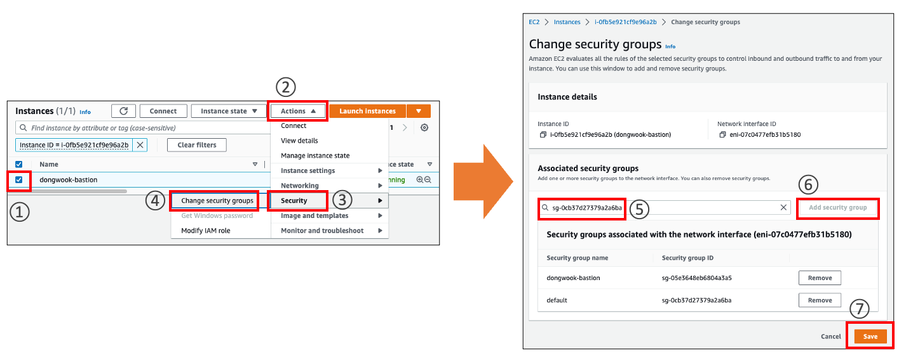
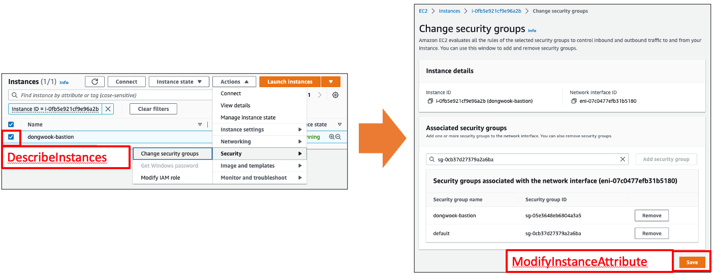
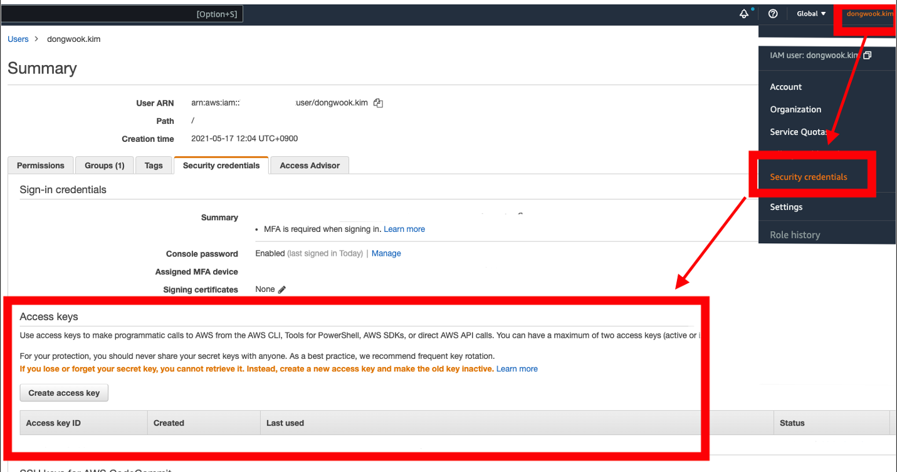
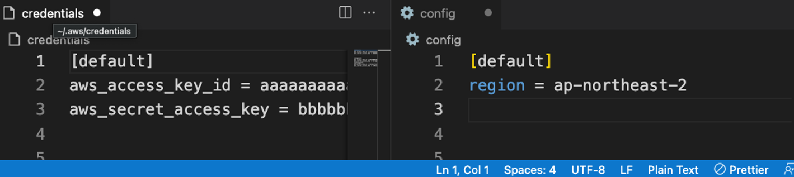

안녕하세요. 클라우드메이트 김동욱입니다.

오늘은 AWS 리소스를 관리하는 방법 중, SDK로 리소스를 관리하는 방법을 알아보겠습니다.

## AWS 리소스를 관리하는 여러 방법

### 1. AWS 관리 콘솔
AWS 리소스를 관리하는 여러 방법 중 가장 쉬운 방법은 역시 웹 환경에서 AWS 계정에 로그인하는 방법일 것입니다. 

이 웹 환경을 AWS에서는 **AWS 관리 콘솔** 이라고 표현하는데요, AWS 관리 콘솔은 웹 환경에서 통합 검색을 사용하여 필요한 서비스를 찾을 수 있습니다. 뿐만 아니라, 서비스 페이지 내에서도 각종 기능과 탭, 버튼을 활용하여 API 기반으로 원하는 액션을 쉽게 빠르게 행할 수 있습니다.

### 2. AWSCLI
AWS는 AWSCLI 라는 관리 툴도 제공하고 있습니다. AWSCLI는 커맨드라인 인터페이스(CLI) 환경에서 AWS 서비스를 관리하는 통합 도구입니다. AWSCLI를 다운로드하여 구성하면 여러 AWS 서비스를 명령줄에서 제어하고 스크립트를 통해 자동화할 수 있습니다.

### 3. AWS SDK(Software Developer Kit)
프로그래밍 개발자에게 일관되고 친숙한 AWS SDK의 라이브러리 세트를 통해 애플리케이션, 라이브러리 또는 스크립트를 AWS 서비스와 쉽게 통합할 수 있습니다.

---

## AWS 관리 콘솔에서 자동화를 고려하는 흔한 경우

예를 들면, 이미 만들어져 있는 EC2 인스턴스에 새로운 보안 그룹을 추가하기 위해서는 웹 콘솔로 다음의 절차를 수행하면 됩니다.



7번 정도의 클릭으로 소요시간은 1분 안팎으로 완료될 것입니다.

이와 같이 AWS는 사용자 친화적인(?) GUI 환경을 제공하고 있습니다. 반면, 어느 날 다음과 같은 태스크를 맞이하게 될 수 있습니다.

```css
1000대의 인스턴스에 필요한 보안 그룹 리스트 엑셀로 정리해놨으니까 보고 작업해주세요.
```

이를 콘솔에서 작업할 경우:
* 인스턴스 1대 당 30초가 소요된다 하더라도 500분이 소요됩니다.
* 거기에 인스턴스로 추가해야 할 보안 그룹이 제각각 다르다면 작업 수행자는 정신이 몽롱해질 것입니다. ~~내가 이거 하려고 회사 왔나~~...

AWS는 사용자들의 편의를 위해 직접 API 호출을 하지 않고도 보다 쉽고 편하게 자원을 프로비저닝하거나 변경 및 관리할 수 있는 여러가지 도구들도 개발해서 함께 지원합니다.

API 호출이란 쉽게 예를 들자면 내부적으로 IAM 사용자 또는 역할에서 다음과 같은 API를 질의한 다음 결과를 화면에 출력하게 됩니다.
* EC2 인스턴스 체크박스를 체크하게 되면, **DescribeInstances** API가 호출됩니다.
* 보안 그룹 변경을 저장하면, **ModifyInstanceAttribute** API가 호출됩니다.


웹 기반의 AWS 관리 콘솔도 사용자가 이용하기 쉽게 되어 있으나, **AWS CLI 혹은 SDK** 를 이용하면 위 예시와 같은 반복 작업을 자동화하여 편하게 관리할 수 있습니다.

특히 오늘 소개드릴 AWS SDK, 그 중에서도 **Python SDK(Boto3)** 를 이용하면 비교적 익숙한 프로그래밍 언어인 파이썬으로 원하는 대로 리소스를 조작할 수 있게 됩니다.

사내에서 사용되고 있는 다양한 Boto3 사용 예시를 다루고 싶으나, 오늘은 가장 기초적인 **Boto3 설치와 구성**에 대하여 다루어 보겠습니다.

## AWS SDK for Python (Boto3) 설치

AWS SDK for Python (Boto3)을 이용하기 위해서는 당연히 Python이 필요합니다.
* 작성일 기준 사용 가능한 python 최소 버전은 3.7 입니다.
필요한 python 최소 버전 확인은 [여기](https://pypi.org/project/boto3/)에서 확인하실 수 있습니다.

pip(파이썬 패키지 매니저) 명령어를 사용하여 최신 버전의 Boto3을 설치합니다.
```sh
pip intall boto3
```

## Configuration

Boto3를 사용하기 전에 콘솔에서 AWS 계정에 대한 인증 자격 증명(Secret Credentials)을 설정해야 합니다. 

다음과 같이 AWS **콘솔에서 본인 계정을 클릭 > Security credentials > Access keys > Create access key** 순으로 액세스 키를 생성합니다. **(해당 액세스 키가 github 등에 유출되지 않게 주의해주세요!)**



---

다시 쉘로 돌아와 다음 선택지 중 사용하시는 환경에 맞게 세팅합니다. **\[*\]**

**(awscli가 설치되어 있다면)** `aws configure` 명령어를 통해 방금 만든 액세스 키를 통해 자격 증명을 구성합니다.

```
$ aws configure
AWS Access Key ID [None]: aaaaaaaa
AWS Secret Access Key [None]: bbbbbbbb
Default region name [None]: ap-northeast-2
Default output format [None]: json
```

**(awscli가 설치되어 있지 않다면)** 

1. `~/.aws` 디렉터리를 생성합니다.

2. `~/.aws` 디렉터리에서, `credentials` 파일과 `config` 파일을 생성 후 다음과 같이 작성합니다.

`~/.aws/credentials`

```
[default]
aws_access_key_id = <YOUR_ACCESS_KEY>
aws_secret_access_key = <YOUR_SECRET_KEY>
```

`~/.aws/config`

```
[default]
region = <YOUR_REGION>
```



여기까지 진행하셨다면 python 파일에서 실행을 진행해보겠습니다.

## Boto3 사용해보기 - resource

Boto3 Quickstart에 나와있는 내용 대로 진행해보겠습니다.

1. python 파일을 생성 후, boto3을 import 합니다.

```python
import boto3
```

2. s3 resource를 불러 서비스에 요청을 보내봅니다. 다음 코드는 버킷 컬렉션을 사용하여 모든 버킷 이름을 출력합니다.

```python
s3 = boto3.resource('s3')
# Print out bucket names 
for bucket in s3.buckets.all(): 
    print(bucket.name)
```

에러가 있다면 boto3 구성을 점검하시거나, s3 버킷이 하나도 없거나, IAM 사용자가 listBucket 가 Deny 되는 경우가 아닌지 확인해 보시기 바랍니다.

정상적으로 실행이 되었다면 **여러분들은 Boto3에 발을 딛으셨습니다.** 축하드립니다! ~~(너무 Quickstart 인 것)~~

## Boto3 사용해보기 - Client

한편, S3 버킷 list를 출력하는 다른 예제에서는, `resource()` 대신 `client()`를 사용합니다.

```python
# Retrieve the list of existing buckets 
s3 = boto3.client('s3') 
response = s3.list_buckets() 

# Output the bucket names 
print('Existing buckets:') 
for bucket in response['Buckets']:
    print(f' {bucket["Name"]}')
```

## Boto3 에러 핸들링

AWS를 사용하는 사용자라면, 작업 도중 셀 수 없는 많은 에러를 만나보셨을 것입니다.

타 프로그램과 같이 Boto3를 사용할 때에도 에러 핸들링은 필수 요소인데요,

AWS 서비스 예외는 기본 botocore 예외인 `ClientError`로 예외처리를 할 수 있습니다.

예시로, 위의 `client('s3').list_buckets()` 를 다음과 같이 예외처리 할 수 있습니다. 

```python
import boto3
import botocore

s3 = boto3.client('s3') 
try:
    response = s3.list_buckets() 
except botocore.exceptions.ClientError as e:
    print("%s : %s" % (e.response['Error']['Code'], e.response['Error']['Message']))
    raise e
```

resource 클래스의 경우, `client.meta` 속성을 따라 예외처리를 진행합니다.

```python
client = boto3.resource('s3')

try:
    client.create_bucket(BucketName='myTestBucket')

except client.meta.client.exceptions.BucketAlreadyExists as err:
    print("Bucket {} already exists!".format(err.response['Error']['BucketName']))
    raise err
```


## 개인적인 사용 경험은, client() 방식이 직관적이고 사용하기 좋았습니다.

저는 AWS 작업 간 boto3 사용하는 경우, `client`를 주로 이용하는데요,

공식 문서에는 `client`에 대해 다음과 같이 설명하고 있습니다.

> **Client는 메서드가 서비스 API와 1:1에 가깝게 매핑되는 낮은 수준의 인터페이스(low-level interface) 입니다.**

간단한 설명을 위해 아까 위의 예시를 가져오자면, **콘솔에서 EC2 인스턴스 검색 시** `DescribeInstaces` API 콜이 일어난다고 언급하였습니다.

이는 **AWS CLI와 Boto3(client 사용)** 로 각각 표현하면 다음과 같습니다.

* **AWS CLI**

```bash
aws ec2 describe-instances \
    --instance-id i-aaaaaaaaaaaa
```

* **Boto3 using client**

```python
import boto3

client = ec2.client('ec2')

response = client.describe_instances(
    InstanceIds=['i-aaaaaaaaaaaa'] # 팁으로, 복수 명사처럼 생긴 파라미터 대부분은 리스트로 값을 받습니다.
)
```

이처럼 API와 client 메서드는 거의 1:1 매핑되어 있다는 것을 이해하고 나니, 작업 속도가 더 빨라지는 효과가 있었습니다.

## 마무리

지금까지 AWS 리소스를 다루는 방법은 여러가지가 있고, 그 중 AWS SDK for Python 의 구성을 알아보았습니다.

이 글을 통해 Boto3를 활용하여 단순 작업이 있다면 주저하지 말고 작은 것부터 자동화를 하고, 

그 시간을 확보하여 더 가치 있는 일에 투자하는 데에 도움이 되었으면 좋겠습니다.


감사합니다!


---

**\[*\]** : 위 방법 말고도 boto3 에서 AWS 자격 증명을 얻는 순서는 다음과 같습니다. 
1. `boto.client()` 메서드에서 자격 증명을 매개변수로 전달
2. `Session` 객체를 만들 때 자격 증명을 매개 변수로 전달
3. 환경 변수 지정
4. 공유 자격 증명 파일 (`~/.aws/credentials`)
5. AWS 구성 파일 (`~/.aws/config`)
6. AssumeRole provider
7. Boto2 config 파일 (`/etc/boto.cfg` and `~/.boto`)

보다 자세한 사항은 [Boto3 Developer Guide](https://boto3.amazonaws.com/v1/documentation/api/latest/guide/credentials.html) 에서 확인하실 수 있습니다.

### 출처
* https://boto3.amazonaws.com/v1/documentation/api/latest/guide/quickstart.html
* https://boto3.amazonaws.com/v1/documentation/api/latest/guide/s3-example-creating-buckets.html#list-existing-buckets
* https://boto3.amazonaws.com/v1/documentation/api/latest/guide/clients.html
* https://boto3.amazonaws.com/v1/documentation/api/latest/guide/error-handling.html#error-handling