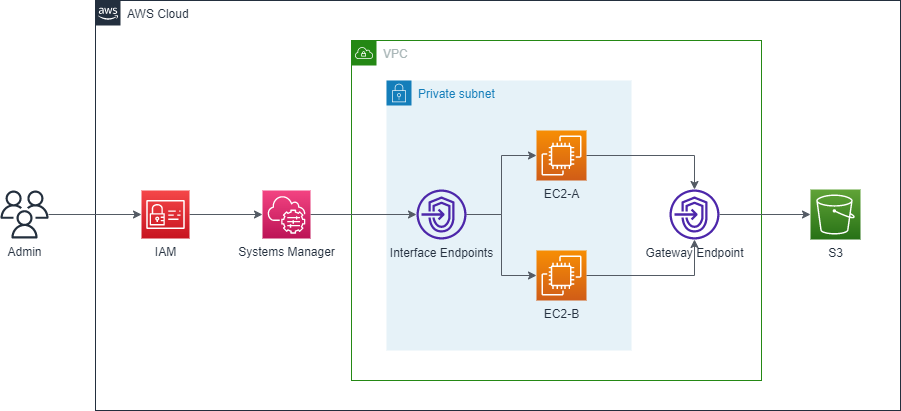

## 목차
> 1️⃣ [서버 접근통제란](#서버-접근통제란)  
> 2️⃣ [Session Manager란](#session-manager란)  
>> 2-1 [계획](#계획)  
>> 2-2 [아키텍처](#아키텍처)  
>  
> 3️⃣ [Session Manager 설정하기](#session-manager-설정하기)  
>> 3-1 [사전 조건](#사전-조건)  
>> 3-2 [엔드포인트 설정](#엔드포인트-설정)  
>> 3-3 [EC2 설정](#ec2-설정)  
>> 3-4 [IAM 설정](#iam-설정)  
>> 3-5 [S3 Logging 설정](#s3-logging-설정)  
>> 3-6 [로그 확인](#로그-확인)  
>  
> 4️⃣ [마치며](#마치며)  
---
안녕하세요. 클라우드메이트 TE팀 이도현입니다.  
AWS의 서비스 중 간편하게 서버 접근통제를 구현할 수 있는 **Session Manager**에 대해 공유하고자 합니다.  
테스트하실 수 있게 핸즈온으로 구성했습니다.

## 서버 접근통제란
접근통제란 적절한 권한이 인가된 사용자만 해당 시스템에 접근할 수 있도록 하고, 권한이 없는 사용자는 접근하지 못하도록 통제하는 것입니다.  
또한 인가된 사용자의 부인 방지를 위해 작업 이력에 대한 로깅을 할 수 있어야 합니다.  

## Session Manager란
간단하게 Session Manager의 기능에 대해 설명드리겠습니다.

Session Manager는 Systems Manager의 기능 중 하나로써,  
EC2 인스턴스, 엣지 디바이스, 온프레미스 서버 및 가상 머신을 브라우저 기반 셸 또는 AWS CLI를 통해 관리할 수 있습니다.

또한 Session Manager는 4가지 장점이 있습니다.
- 인바운트 포트를 열 필요가 없습니다.  
- Bastion 호스트를 사용하지 않습니다.  
- SSH 키를 사용하지 없습니다.  
- 세션 활동을 로깅 및 감사가 가능합니다.  

로깅 및 감사 기능은 다음과 같은 AWS 서비스와의 통합을 통해 제공됩니다.  
- S3  
- CloudTrail  
- CloudWatch Logs  
- EventBridge 및 SNS

### 계획
> 1️⃣ 인터넷이 되지 않는 Private 환경을 구성합니다.  
> 2️⃣ 특정 사용자만 특정 EC2 인스턴스에 접근이 가능하도록 합니다.  
> 3️⃣ MFA 인증이 되지 않으면 접근하지 못하도록 합니다.  
> 4️⃣ 사용자가 인스턴스에 접근할 때 접근 이력과 명령어 실행 이력이 로깅되도록 합니다.

IAM 정책을 이용하여 특정 사용자에게만 권한을 부여하고 특정 인스턴스에만 접근할 수 있도록 합니다.  
또한 Session Manager의 장점을 좀 더 살리고 싶어 보안성을 높여 폐쇄망에서 사용하는 것을 전제로 하고 MFA 인증을 강제하였습니다.  
그리고 인스턴스 내부의 명령어 실행 이력을 S3 버킷에 로깅하도록 하겠습니다.

### 아키텍처

편의상 User를 Admin으로 표시하였지만,  
테스트 환경에서는 User A는 EC2-A에만 User B는 EC2-B에만 접근할 수 있도록 구성하겠습니다.  

Session Manager의 작동 방식을 잠시 살펴보겠습니다.  
사용자가 세션을 시작하라는 첫 번째 명령을 보내면, Session Manager 서비스에서 사용자의 ID를 인증하고, IAM 정책에 따라 사용자에게 부여된 권한을 확인한 다음 구성 설정을 확인하고, SSM Agent에 양방향 연결을 열라는 메시지를 보냅니다.  
연결이 설정되어 사용자가 다음 명령을 입력하면 SSM Agent의 명령 출력이 이 통신 채널로 업로드되고 다시 사용자의 로컬 시스템으로 전송됩니다.

## Session Manager 설정하기
이 글에서는 VPC를 생성하는 설명은 생략하도록 하겠습니다.