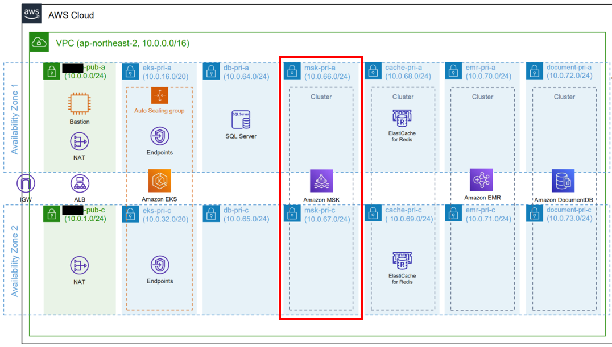
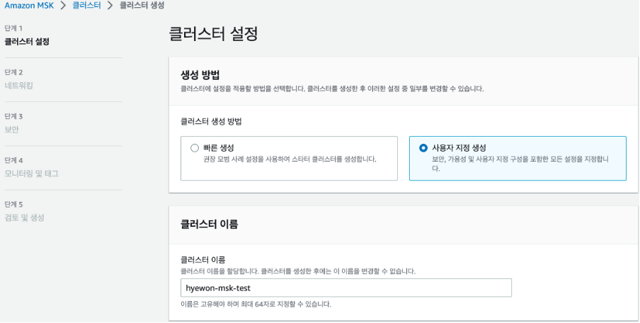
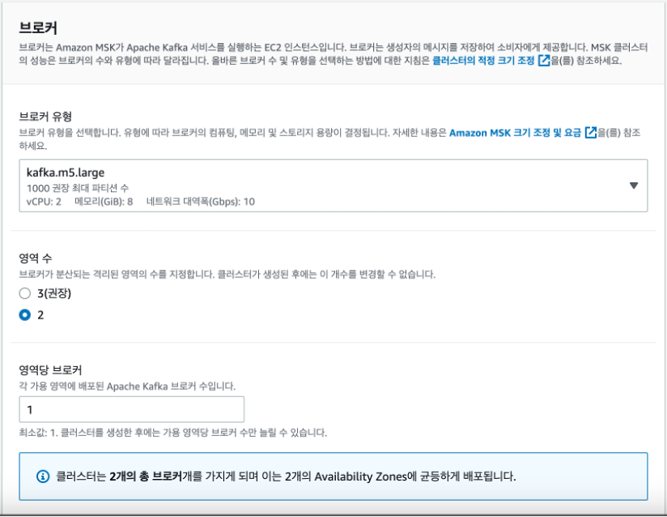
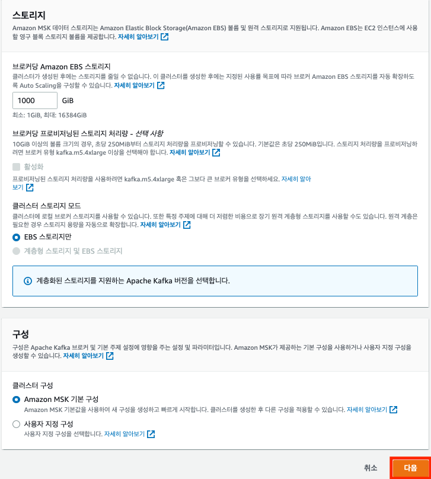
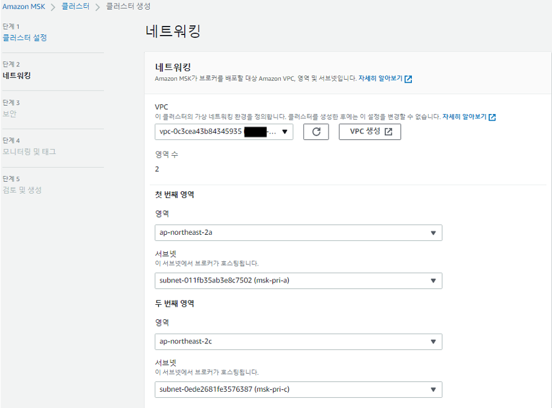
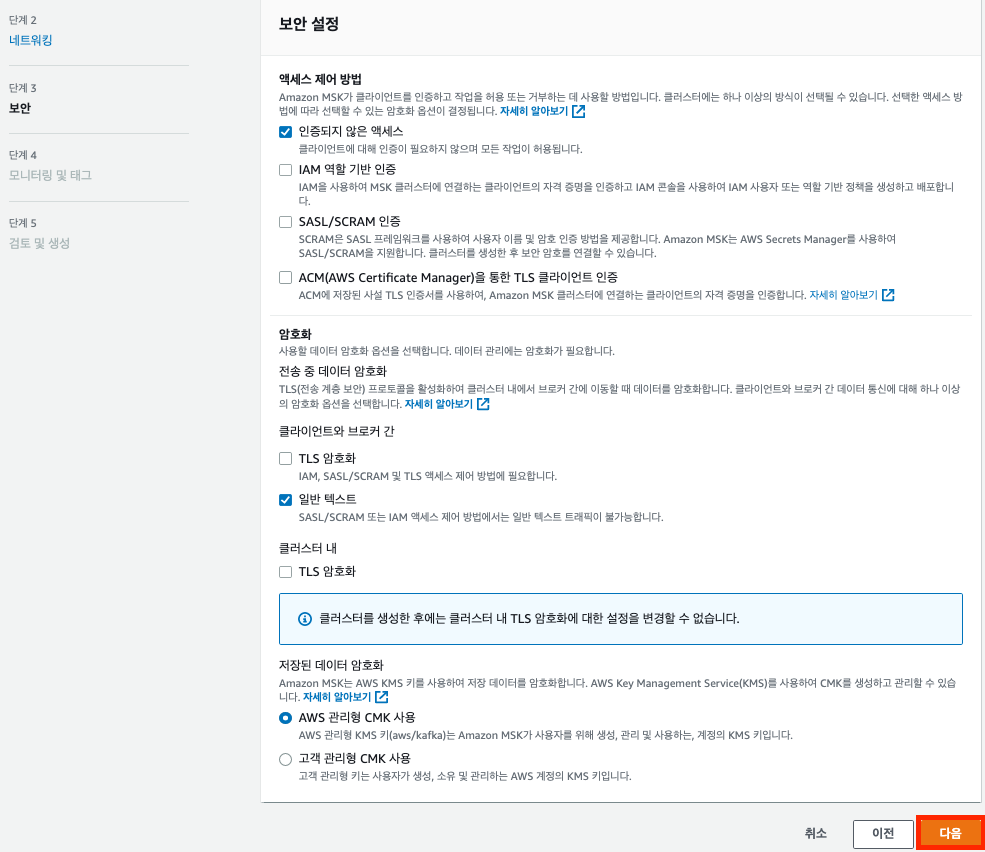
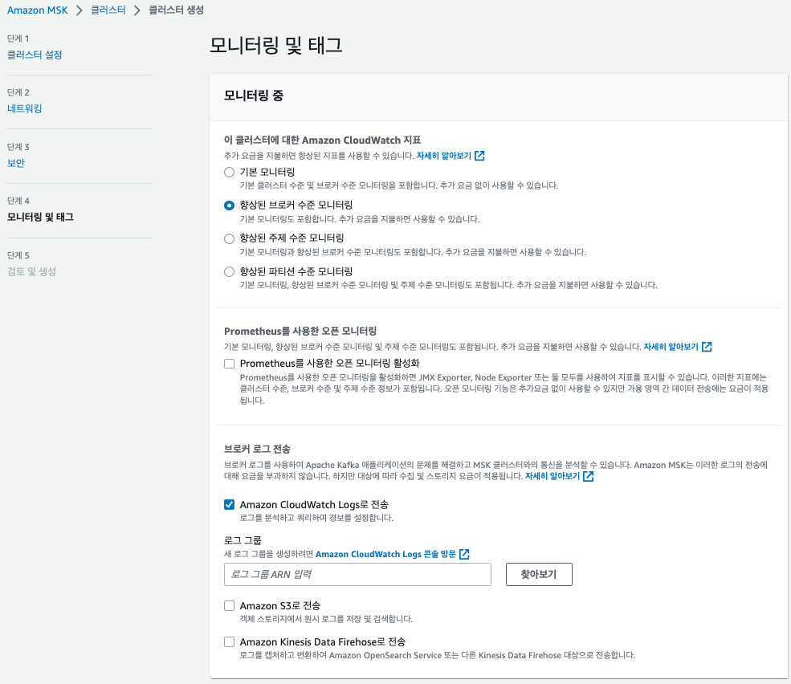
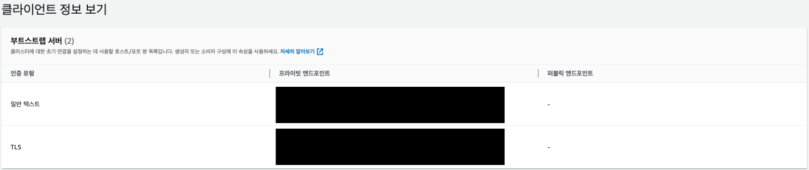

안녕하세요. 클라우드메이트 TE팀 정혜원입니다.

고객의 인프라 환경을 마이그레이션하며 MSK를 사용하게 되었고, 이해를 돕기 위해 해당 서비스를 직접 실습해 보실 수 있는 핸즈온으로 구성하였습니다.

### MSK?

MSK는 Amazon Managed Streaming for Apache Kafka의 약자로 kafka를 사용하여 Streaming 데이터를 처리하는 완전 관리형 서비스입니다. EC2에 직접 kafka를 구축하는 방법도 있지만, 시간과 비용이 많이 소요되고 cloudwatch에서 지표를 확인하기 어려워, 이슈가 발생했을 때 분석이 어렵습니다. 반면에 MSK를 활용하면 빠르게 클러스터를 구축하고 브로커와 디스크를 AWS에서 관리하기 때문에 확장성이 좋으며 업그레이드도 간편하여 운영에 용이합니다.

### MSK 클러스터 구축



구현한 아키텍처의 일부입니다. 이 글에서는 VPC 생성 및 IAM 설정 같은 과정은 생략하도록 하겠습니다. MSK는 2개의 가용 영역의 Private Subnet에서 동작하고, 보안 그룹은 Bastion, EKS 그룹을 허용한 설정입니다.



본격적으로 MSK에서 클러스터 생성을 클릭하면, 빠른 생성과 사용자 지정 생성 중에 선택이 가능한데, 네트워킹 및 보안을 선택하여 생성하기 위해 사용자 지정 생성을 선택합니다.



고객의 요구사항 및 아키텍처에 따라 2개의 가용 영역에 브로커가 1개씩 생성되도록 설정하였습니다. 원래 브로커는 3개 이상 두는 것이 권장 사항이지만, 가용 영역 단위로 생성할 수 있어서 2개와 4개 중 논의한 결과 비용 문제로 2개로 결정하게 되었습니다. Kafka 버전은 권장 버전인 2.6.2를 사용하였습니다.



EBS 스토리지 볼륨은 설명과 같이 늘릴 수는 있지만 줄일 수는 없기 때문에 신중하게 설정해야 하며, 1000GiB 이상의 iops는 3000으로 고정되어 있어, 권장 값인 1000으로 설정하였습니다. 이는 추후에 AutoScaling 설정이 가능합니다. 구성은 MSK 기본 구성을 선택하였습니다.

구성에 관한 내용은 아래 문서 참고 부탁드립니다.

(https://docs.aws.amazon.com/ko_kr/msk/latest/developerguide/msk-configuration-properties.html)



생성된 VPC, 서브넷을 선택합니다. 보안 그룹도 선택한 후 다음을 선택합니다.

보안 그룹의 경우 클라이언트가 브로커와 통신하는 형식이 일반 텍스트인지, tls 형식인지에 따라 알맞은 포트를 기입하고 클라이언트의 보안 그룹에 추가하면 됩니다.
보안 그룹 포트는 아래 문서 참고 부탁드립니다. 

(https://docs.aws.amazon.com/ko_kr/msk/latest/developerguide/port-info.html)  



다음은 보안 설정입니다. 고객 측에서 tls 암호화를 사용하지 않을 거 같다고 하여 추후에 제외하였고 일반 텍스트만 사용하도록 구성하였습니다.



클러스터를 생성하는 마지막 단계인 모니터링입니다. 권장 사항은 향상된 브로커 수준 모니터링이며, 실제로 브로커 수준 모니터링으로 적용하였습니다. 또한, Amazon CloudWatch Logs로 전송 옵션을 추가하여(로그 그룹이 없다면 새로 만들어야 합니다) 문제 분석을 조금 더 쉽게 할 수 있도록 구성하였습니다.

이후, 검토 및 생성 단계에서 설정값을 확인하고 클러스터 생성을 선택합니다. (클러스터 생성은 15분~30분 정도 소요됩니다.)

### MSK 사용 – CLI를 통한 Topic 생성

이제 클러스터를 생성했으니 클라이언트에서 사용해 볼 차례입니다.

아래 명령어를 통해 클라이언트에서 MSK를 사용할 준비를 합니다.

```bash
sudo yum update
sudo yum install java-1.8.0
sudo wget https://archive.apache.org/dist/kafka/2.6.2/kafka_2.12-2.6.2.tgz
sudo tar -xzf kafka_2.12-2.6.2.tgz
cd kafka_2.12-2.6.2
```




Console에서 해당 클러스터로 이동한 후 클라이언트 정보 보기를 선택하여 부트스트랩 서버 프라이빗 엔드포인트를 확인합니다. 해당 엔드포인트는 초기 연결 시 인증 및 설정에 활용됩니다. 이 값을 아래 BootstrapServerString에 대입하고, 다른 값들도 원하는 대로 수정하여 토픽을 생성합니다. 

```bash
<path-to-your-kafka-installation>/bin/kafka-topics.sh --create --bootstrap-server BootstrapServerString --replication-factor 3 --partitions 1 --topic MSKTutorialTopic
```

Topic 생성 관련 공식 문서 링크도 남겨두겠습니다.

(https://docs.aws.amazon.com/msk/latest/developerguide/create-topic.html)

*> 토픽* *생성* *후* *확인은* *아래* *명령어를* *통해* *가능합니다.*

*Kafka-topics.sh –list –bootstrap-server BootstrapServerString*

### 마치며

AWS에서 Kafka를 이용하는 방법을 알아보았습니다. 생각보다 빠르고 편리하게 만들 수 있었으나, 한 가지 아쉬운 점이 있다면 클러스터를 생성, 수정, 삭제와 같은 작업을 할 때마다 20분 이상씩 소요돼서 작업 시 시간이 많이 걸린다는 것이었습니다.

여기까지 긴 글 읽어주셔서 감사합니다.


