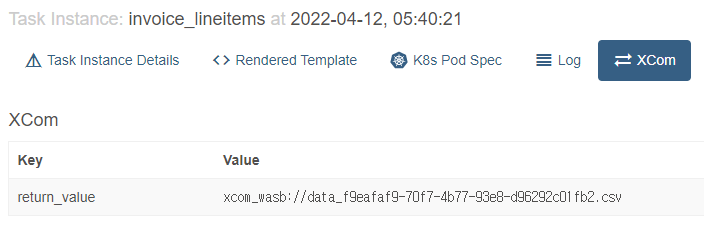

안녕하세요, 지난번에 작성한 Airflow 관련 포스팅인 (사실 Airflow 보다는 Kubernetes 와 연관성이 더 있는 글 입니다만.) ["KEDA를 활용하여 방문자가 있을 때만 작동하는 서비스 배포하기"](/2022/03/11/http-traffic-based-autoscaling-with-keda/)에 이어서, 이번 글에서는 Airflow 에서 Task 간 크기가 큰 데이터를 공유하는 방법에 대해 이야기 해 보고자 합니다. XCom 을 통해 Task 간 데이터를 전달하는 것을 알아보고, 전달할 데이터 크가가 클 때는 어떤 방법을 시도 해 볼 수 있는지, 마지막으로 커스텀 XCom 백엔드 작성으로 큰 데이터도 DAG 에서 별도의 추가적인 업로드나 다운로드 작업 없이 Task 간 주고 받는 방법에 대해 알아보겠습니다.

## XCom - Cross Comunication
Airflow 의 각 워크플로우에 해당하는 DAG는 여러개의 Task로 구성되어 있습니다. 여러 Task가 지정된 순서대로 실행되어 작업 하나가 완성 되는데요, 각 Task는 기본적으로 서로 다른 환경 또는 완전히 다른 머신에서 작동하고 있다고 가정하고 실행됩니다. 이러한 경우 Task간 데이터를 공유 하기가 어려운데요, 이런 환경에서도 데이터를 공유 할 수 있도록 해 주는 Airflow의 기능이 XCom(cross-communication)기능입니다.

각 XCom은 해당 XCom 의 Key 값과, 데이터를 Push 한 Task의 ID(`task_id`), 그리고 해당 Task 를 포함하는 DAG의 ID(`dag_id`)로 구별됩니다.
기본적으로 XCom 을 사용 할 때는 데이터를 공유 할 Task에서 `xcom_push` 메소드로 데이터를 `push` 하거나, 데이터를 가져올 Task에서 `xcom_pull` 메소드로 데이터를 `pull`하여 가져옵니다. 

아래처럼 명시적으로 메소드를 호출하여 XCom 을 통해 데이터를 공유 할 수도 있고.
```python
# Pulls the return_value XCOM from "pushing_task"
value = task_instance.xcom_pull(task_ids='pushing_task')
```

대부분의 Operator에서는 값을 반환할 때 XCom 에 Push 까지 같이 처리하기 때문에, 보통 명시적으로 값을 Push하는 경우는 많지 않습니다. [예를 들어 아래 DAG 는 TaskFlow API로 작성된 ETL 작업을 수행하는 DAG 입니다. (코드 일부 생략, Airflow 소스코드에서 발췌)](https://github.com/apache/airflow/blob/main/airflow/example_dags/tutorial_taskflow_api_etl.py)

`@task` 데코레이터가 있는 각 함수가 Airflow 에서 실행시 각각 별도의 Task 로 실행 되는데요, 이들 Task 함수가 반환하는 값은 Task 함수 내에서 명시적으로 XCom 에 Push/Pull 하지 않아도 Airflow 에서 내부적으로 Push/Pull 을 수행하여 Task 간 데이터가 공유됩니다.

```python
@dag(
    schedule_interval=None,
    start_date=pendulum.datetime(2021, 1, 1, tz="UTC"),
    catchup=False,
    tags=['example'],
)
def tutorial_taskflow_api_etl():
  
    @task()
    def extract():
        data_string = '{"1001": 301.27, "1002": 433.21, "1003": 502.22}'
        order_data_dict = json.loads(data_string)
        return order_data_dict

    @task(multiple_outputs=True)
    def transform(order_data_dict: dict):
        total_order_value = 0

        for value in order_data_dict.values():
            total_order_value += value

        return {"total_order_value": total_order_value}

    @task()
    def load(total_order_value: float):
        print(f"Total order value is: {total_order_value:.2f}")

    order_data = extract() # "extract" Task 에서 반환된 값이 Airflow 에서 내부적으로 XCom 에 자동으로 Push됨
    order_summary = transform(order_data) # "transform" Task 시작시 XCom 에서 Pull. 마찬가지로 값 반환과 함께 XCom 에 자동으로 Push
    load(order_summary["total_order_value"]) # "transform" 에서 Push 한 XCom 데이터 Pull 하여 Task 실행


tutorial_etl_dag = tutorial_taskflow_api_etl()
```

## XCom 에 넣을 데이터가 큰 경우
이러한 XCom 은 Task 간 데이터를 공유할 수 있게 해 주므로 유용하고 많이 쓰이지만, Task 실행시 필요한 설정 값 정도만 전달하는 것을 목적으로 만들어 진 것이여서 큰 사이즈의 데이터를 전달하기에 적합하지는 않습니다. 기본적으로 XCom 데이터는 Airflow 에 설정된 DB에 저장되므로, 큰 데이터를 XCom 으로 전달하면 모두 DB에 쌓이게 됩니다.
[또한 각 XCom 데이터가 SQLAlchemy 가 제공하는 `LargeBinary` 타입의 칼럼에 저장](https://github.com/apache/airflow/blob/main/airflow/models/xcom.py#L67)되기 때문에 저장 가능한 크기도 제한적입니다. [`LargeBinary`는 MySQL에서는 `BLOB`타입, PostgreSQL의 경우 `BYTEA`에 해당합니다.](https://docs.sqlalchemy.org/en/14/core/type_basics.html#sqlalchemy.types.LargeBinary) 각 XCom 데이터를 `LargeBinary`타입에 해당되는 DB의 타입의 크기 한도까지만 넣을 수 있습니다. 

그렇다면 만약, Task 간 큰 데이터를 주고 받아야 할 때는 어떻게 해야 할까요? 생각 해 볼 수 있는 방법 중 하나로 데이터를 파일로 외부 저장소에 저장하고, 저장된 파일의 정보만 XCom 을 통해 전달하는 방법이 있습니다. 예를 들면 아래의 예제 코드 처럼, 데이터를 Azure Blob Storage 에 파일로 저장한 후 해당 파일의 위치를 XCom 으로 공유하고, 다음 Task 에서 다시 Azure Blob Storage 에서 파일을 가져오는 방법을 생각 해 볼 수 있습니다.

```python
...
@task()
def task_upload_json():
    import json

    large_json_data = {...} # 48KB를 넘는 큰 사이즈의 딕셔너리 데이터라고 가정

    wasb_conn_id="<Airflow 에 설정한 Azure 스토리지 계정 연결 정보 ID>"
    blob_name="<Blob Storage 저장시 파일 이름>"
    container_name="<파일 저장한 Blob Container 이름>"

    # Blob Storage 에 업로드
    hook = WasbHook(wasb_conn_id=wasb_conn_id)
    hook.load_string(json.dumps(large_json_data),
        blob_name=blob_name,
        container_name=blob_name)
    
    # 파일 정보만 반환
    return {"container_name": container_name, "blob_name": blob_name}

@task()
def task_get_and_print_json(container_name, blob_name):
    import json
    wasb_conn_id="<Airflow 에 설정한 Azure 스토리지 계정 연결 정보 ID>"

    # Blob Storage 에서 불러오기
    hook = WasbHook(wasb_conn_id=wasb_conn_id)
    json_data = json.loads(hook.read_file(container_name, blob_name))
    
    # 불러 온 데이터 출력
    print(json_data)
  
# Task 순서 정의
file_meta = task_upload_json()
task_get_and_print_json(file_meta["container_name"], file_meta["blob_name"])
```

Azure Blob Storage 외에, AWS를 사용한다면 S3에 업로드/다운로드 하는 로직을 추가로 넣을 수도 있을 것이고, 로컬 파일시스템에 저장하는 로직을 생각 해 볼 수도 있는 등 다양한 방법이 있겠습니다.

하지만 이렇게 외부 저장소에 직접 올리고 받는 로직을 각 Task 에 넣으면, 비슷한 경우를 만날 때 마다 매번 해당 작업을 수행하는 코드를 넣어줘야 해서 번거롭다는 단점이 있습니다.
이렇게 주고받은 데이터나 파일은 Airflow 에서 내부적으로 관리되지 않기 때문에, 별도로 관리해야 하는 문제도 있을 수 있습니다.
또한 DAG 에서 Airflow 가 기본 제공하는 Operator나 필요에 의해 별도로 설치해 사용하는 Operator가 있다면 함께 사용하기 어려울 수도 있다는 문제도 있습니다.

## Custom XCom Backend 작성 및 설정

앞서 소개된 해결 방안은 Task 에 추가적인 로직을 넣어서 해결 해 보는 방법이였다면, Airflow 에서 XCom 을 처리하는 방식을 커스터마이징 하여 내부적으로 작동하는 방식을 변경하여 해결하는 방법도 있습니다. 바로 커스텀 XCom 백엔드를 작성하여 적용하는 것 입니다. 번거롭게 DAG 에 별도의 로직을 넣어 줄 필요도 없이 기존에 DAG 작성하면서 XCom으로 데이터를 전달 할 때와 같은 방식으로 할 수 있고, Task 간 전달되는 데이터나 파일을 따로 관리해야 하거나, 외부 패키지에서 불러온 Operator 와 함께 사용 하는 것에도 문제가 없기 때문에 DAG나 Task 에 별도의 로직을 넣는 것에 비해 좋은 방법이라고 할 수 있습니다. [이 방법은 Airflow 문서에서 Task 간 큰 크기의 데이터 전달 시 추천하는 방법 이기도 합니다.](https://airflow.apache.org/docs/apache-airflow/stable/best-practices.html?highlight=xcom#communication)

커스텀 XCom 백엔드를 작성하여 적용하는 방법은 이미 많이 사용하는 방법이기도 해서 소개된 글이 많이 있기도 합니다. 보통 AWS S3와 연동된 것을 작성하여 적용하는 방법에 대한 사례가 많은데요, [관리형 Airflow 서비스를 제공하는 Astronomer 에서 작성한 튜토리얼 또한 그렇습니다.](https://www.astronomer.io/guides/custom-xcom-backends)

S3로 연동하는 사례에 관한 글은 이미 많이 있기도 하고, 이 글은 제목에서도 보셨다 싶이 Azure Blob Storage 와의 연동에 관한 글 이므로, Azure Blob Storage 와 연동된 XCom 백엔드를 작성하는 방법을 알아보겠습니다.

### 직렬화 및 역직렬화 메소드 재정의

커스텀 XCom 백엔드 작성은 기본적으로, `BaseXCom` 클래스를 상속받은 클래스에 정적 메소드인 `serialize_value` 및 `deserialize_value` 메소드를 재정의 하는 것으로 시작합니다.
우리는 전달 받은 데이터를 Azure Blob Storage 에 올리고 내려받는 형태로 구현을 할 것이니, 재정의한 두 매소드에 해당 로직을 하나씩 넣어 주면 되겠습니다.

```python
from airflow.models.xcom import BaseXCom

class WasbXComBackend(BaseXCom):
    ...

    @staticmethod
    def serialize_value(value: Any):
        if ...:
            value = ...

        return BaseXCom.serialize_value(value)

    @staticmethod
    def deserialize_value(result) -> Any:
        result = BaseXCom.deserialize_value(result)
        if ...:
            result = ...
        return result
```

먼저 XCom 에 Push 할때 실행되는 `serialize_value`를 먼저 작성 해 보겠습니다. 여기에는 Azure Blob Storage 에 업로드를 하는 로직을 넣으면 되겠습니다.
보통 Python 에서 데이터 처리를 할때 Pandas DataFrame 으로 처리를 하는 경우가 많은데요, 이를 고려해서 Pandas DataFrame 타입의 데이터면 Azure Blob Storage 에 업로드 하고, 그렇지 않다면 원래의 BaseXCom 에서 처리하는 방법을 사용하도록 작성 해 보겠습니다. 

```python
from airflow.models.xcom import BaseXCom
from airflow.providers.microsoft.azure.hooks.wasb import WasbHook
import pandas as pd
import uuid

class WasbXComBackend(BaseXCom):
    PREFIX = "xcom_wasb://"
    CONTAINER_NAME = "airflow-xcom-data"
    WASB_CONN_ID = "azure_container_volume_default"

    @staticmethod
    def serialize_value(value: Any):
        
        if isinstance(value, pd.DataFrame):
            hook = WasbHook(wasb_conn_id=WasbXComBackend.WASB_CONN_ID)
            file_name = f"data_{str(uuid.uuid4())}.csv"
            
            hook.load_string(
                string_data=value.to_csv(filename),
                container_name=WasbXComBackend.CONTAINER_NAME,
                blob_name=filename,
            )
            value = WasbXComBackend.PREFIX + file_name

        return BaseXCom.serialize_value(value)
    ...
```

작성된 `serialize_value` 메소드는 위 코드와 같습니다. Azure Blob Storage 에 업로드 및 다운로드를 위해 Airflow 의 Azure Provider 패키지가 제공하는 `WasbHook` 클래스로 연결을 설정하고, `WasbHook`의 `load_string` 메소드로 문자열 데이터를 Azure Blob 에 바로 파일로 저장하도록 작성하였습니다. 그리고 임의로 이름을 지정하여 Blob Storage 에 저장한 파일 이름을 다른 데이터와 구분할 수 있도록 앞에 `xcom_wasb://`라는 접두사를 붙여서 반환하도록 작성하였습니다. 이렇게 작성하여 적용하면 실제로 Airflow Web UI 상에는 아래 사진처럼 XCom 값이 표시되게 됩니다.



이어서 `deserialize_value` 메소드 또한 작성 해 줍니다. `serialize_value` 에서 수행한 작업과는 반대로, Azure Blob Storage 에서 파일을 내려받아 Python 객체로 변환해서 반환하도록 작성하면 되겠습니다.

```python
from airflow.models.xcom import BaseXCom
from airflow.providers.microsoft.azure.hooks.wasb import WasbHook
import pandas as pd
import uuid

class WasbXComBackend(BaseXCom):
    PREFIX = "xcom_wasb://"
    CONTAINER_NAME = "airflow-xcom-data"
    WASB_CONN_ID = "azure_container_volume_default"

    ...

    @staticmethod
    def deserialize_value(value: Any):
        
        result = BaseXCom.deserialize_value(result)
        if isinstance(result, str) and result.startswith(WasbXComBackend.PREFIX):
            hook = WasbHook(wasb_conn_id=WasbXComBackend.WASB_CONN_ID)
            file_name = result.replace(WasbXComBackend.PREFIX, "")
            xcom_file_path = os.path.join(pathlib.Path().resolve(), file_name)
            hook.get_file(
                file_path=str(xcom_file_path),
                container_name=WasbXComBackend.CONTAINER_NAME,
                blob_name=file_name
            )
            result = pd.read_csv(xcom_file_path)
        return result
```

### 작성한 XCom 백엔드 적용

이제 작성한 커스텀 XCom 백엔드를 `azblob_xcom_backend.py`등의 이름으로 저장하고, 적절한 디렉토리를 옮기고 설정을 변경해서 적용 해 보겠습니다. 먼저 파일을 복사해야 하는데요, 보통 VM등 환경에 Python 패키지로 설치했다면 `AIRFLOW_HOME` 환경변수가 설정되어 있을 것입니다. 해당 환경변수가 가리키는 경로에 `include` 디렉토리를 만들고 새로 만든 디렉토리에 복사하면 됩니다.

```bash
mkdir -p $AIRFLOW_HOME/include
cp azblob_xcom_backend.py $AIRFLOW_HOME/include/
```

Kubernetes 환경에 배포한다면, Airflow 컨테이너 이미지를 커스터마이징 하거나 볼륨을 마운트 해서 적용할 수 있습니다. Dockerfile 을 작성해서 이미지를 커스터마이징 하는 경우, 아래처럼 `/opt/airflow/include` 에 파일을 들어가도록 하면 됩니다. 볼륨을 마운트 한다면, 컨테이너의 `/opt/airflow/include/`에 마운트 하면 되겠습니다.

``` dockerfile
FROM apache/airflow:2.2.4-python3.8
...
RUN mkdir -p /opt/airflow/include
COPY azblob_xcom_backend.py /opt/airflow/include/
```

그리고 앞에서 작성한 XCom 백엔드가 적용되도록 설정을 적용합니다. `AIRFLOW__CORE__XCOM_BACKEND` 환경변수를 지정하거나, Airflow 설정 파일인 `airflow.cfg` 수정시에는 `xcom_backend`값을 수정합니다.

> `airflow.cfg` 수정시
```bash
# Path to custom XCom class that will be used to store and resolve operators results
# Example: xcom_backend = path.to.CustomXCom
xcom_backend = include.azblob_xcom_backend.WasbXComBackend
```

> 환경변수 설정시
```bash
export AIRFLOW__CORE__XCOM_BACKEND=include.azblob_xcom_backend.WasbXComBackend
```

또한, `PYTHONPATH` 환경변수도 설정하여, XCom 이 있는 디렉터리를 포함시켜서 Airflow 에서 불러올 수 있도록 해 줍니다. 시스템 전체에 설정하거나, 컨테이너 이미지를 커스터마이징 한다면, 컨테이너에 설정도 가능합니다.

> 환경변수 설정시
```bash
export PYTHONPATH=$AIRFLOW_HOME:$PYTHONPATH
```

> Dockerfile 작성시
```dockerfile
ENV PYTHONPATH "${PYTHONPATH}:/opt/airflow"
```

이렇게 환경변수까지 모두 적용하고 나면, 직접 작성한 커스텀 XCom 백엔드를 Airflow 에 적용하여 사용할 수 있습니다.

## 정리
지금까지 Airflow의 XCom과 커스텀 XCom 백엔드를 작성해서 적용하는 방법을 알아 보았는데요. 이렇게 커스텀 XCom 백엔드를 적용하면 조금 더 큰 크기의 데이터를 쉽게 주고 받을 수 있을 뿐만 아니라, XCom 데이터가 Airflow 가 사용하는 Metadata Database 가 아닌 다른곳에 저장되도록 할 수 있어, XCom 데이터를 더 쉽게 확인 및 관리가 가능하고, Metadata Database를 통해 전달하기 어려운 형태의 데이터도 전달이 가능한 장점이 있습니다.

그럼에도 Airflow는 방대한 크기의 데이터를 배치 처리 하기 위한 프로젝트는 아니기 때문에, 마찬가지로 XCom 을 통해 방대한 크기의 데이터를 전달하는 것 또한 적합하지는 않습니다. 대용량 데이터 처리가 필요하다면, Apache Spark 와 같은 데이터 처리 프레임워크를 별도로 데이터 처리용으로 사용하고, 데이터 처리 작업 흐름을 Airflow 로 관리하는 형태를 대신 고려해 볼 수 있습니다.

- [XComs - Airflow Documentation](https://airflow.apache.org/docs/apache-airflow/stable/concepts/xcoms.html)
- [Custom XCom Backends - Astronomer](https://www.astronomer.io/guides/custom-xcom-backends)
- [airflow.providers.microsoft.azure.hooks.wasb - apache-airflow-providers-microsoft-azure](https://airflow.apache.org/docs/apache-airflow-providers-microsoft-azure/stable/_api/airflow/providers/microsoft/azure/hooks/wasb/index.html)