최근 회사 내에서, 기존 클라우드 점검 스크립트에 새 기능을 넣는 작업을 하고 있는데요. 이번에 작업을 하면서 Azure DevOps 점검도 자동화 할 필요가 있어, Azure DevOps 를 점검하는 기능도 구현하고 있습니다. 기존 Azure 의 리소스를 점검할 때는 Azure SDK for Python 으로 충분했지만, Azure DevOps는 원래 Visual Studio Team Services 였던 서비스가 이름이 바뀌고 변화해 온 서비스여서, Azure 와는 별개로 사용됩니다. 

Azure에 가입하지 않아도, Azure DevOps만 따로 사용이 가능하죠. 그래서 API와 SDK 도 따로 있습니다. 이 글에서는 이렇게 따로 존재하는 Azure DevOps REST API 와, 이 REST API 기반으로 만들어진 Azure DevOps Python API 모듈을 사용해서 Azure DevOps 검사 기능을 구현해 본 것에 대해 정리해 보고자 합니다.

## Azure 에서의 Azure DevOps 리소스
위에서 언급했듯, Azure DevOps 는 Azure 와 별개의 서비스여서, 기본적으로 Azure SDK 에서 Azure 리소스로 조회가 되지 않습니다. Azure 구독과 Azure DevOps 조직을 연동하면 Azure Portal 이나 Azure SDK로도 Azure 리소스로서 조회가 가능한데요. 

하지만 이 경우 조회가 가능한 것은 Azure DevOps 조직 목록만으로 한정되어 조회해서 점검 할 수 있는 것이 제한적입니다. 다시 말해 Azure DevOps 의 Git 저장소, Azure Pipeline, Azure Boards, Test Plans, Artifacts 등 Azure DevOps 에 포함된 세부 서비스를 조회하여 점검할 수 없습니다.

## Azure SDK - Management 라이브러리로 리소스 조회 해 보기
기존에는 Azure SDK 의 Management Libraries 를 활용하여 리소스를 조회하고 점검하는 스크립트를 작성 했는데요, 간단한 예제로 리소스를 조회 해 보고 Azure DevOps 는 어떻게 조회 되는지 살펴봅시다.

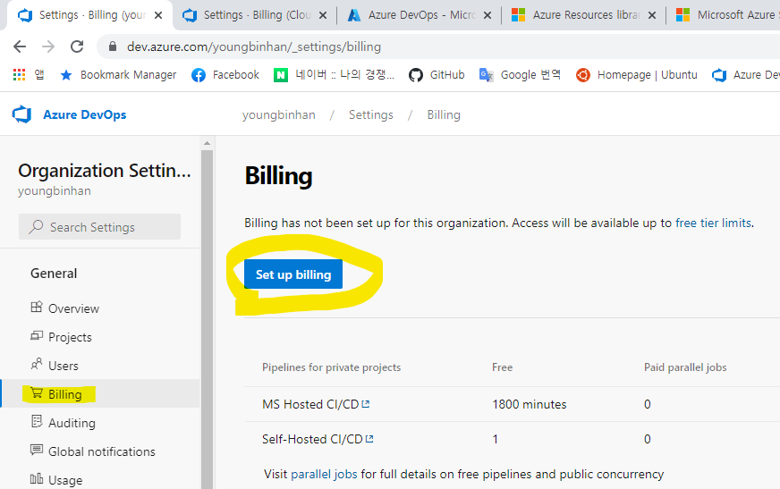

먼저 Azure DevOps 조직에 Azure 구독을 연결해야 조회가 가능합니다. 조직 설정(Organization) 의 Billing 화면에서 Azure 구독을 연결할 수 있습니다. 아래 URL로도 들어갈 수 있습니다.

```
https://dev.azure.com/{조직_이름}/_settings/billing
```
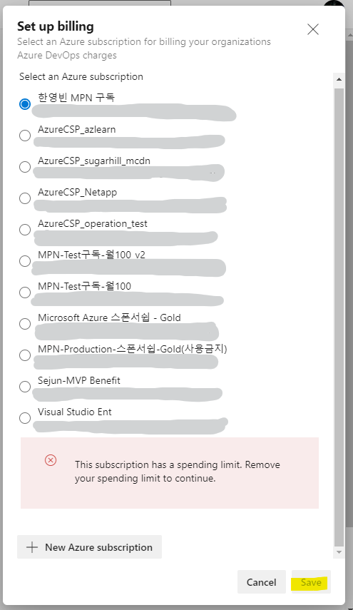

연결할 구독을 선택하고 연결합니다. 참고로 지출 제한 없는 구독만 연결이 가능하니, 지출제한 설정이 없는 구독을 선택 하시거나 지출 제한을 제거해야 연동이 가능합니다.

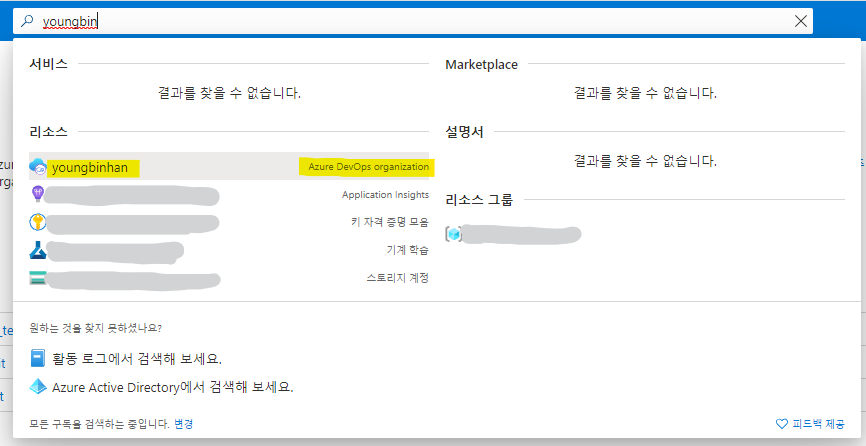

구독을 연결하면, Azure Portal 에서도 Azure DevOps Organization 리소스로 조회가 가능 한 것을 확인할 수 있습니다. 하지만 이름만 조회 될 뿐, 클릭하여 들어가면 Azure DevOps 로 리다이렉트 해 주는 화면만 나오는 것이 다 입니다.

이번에는 Azure SDK for Python 으로 간단한 예제 코드를 작성하여 리소스를 조회 해 봅시다. Azure SDK Python 모듈을 설치 합니다. Azure SDK는 각 서비스별로 모듈이 나누어져 있어서 필요한 모듈만 설치해서 사용이 가능합니다. 여기서는 인증을 위한 `azure-mgmt-identity` 및 Azure 리소스 관리를 위한 `azure-mgmt-resource` 모듈을 설치해 사용해 보겠습니다. `azure-mgmt-core` 도 설치가 필요한데요, 보통 다른 Azure SDK 모듈 설치 시 자동으로 같이 설치 되기 때문에 명시적으로 설치 할 필요는 없습니다.

```bash
# Python 가상 환경 생성 및 진입
python -m venv venv
. venv/bin/activate

# Azure SDK 모듈 설치
pip install azure-mgmt-identity azure-mgmt-resource
```

```python
from azure.identity import InteractiveBrowserCredential
from azure.mgmt.resource import ResourceManagementClient

# Azure DevOps 조직에 연동한 Azure 구독 ID
subscription_id = "********-****-****-****-************"
credential = InteractiveBrowserCredential()

resource_client = ResourceManagementClient(credential, subscription_id)
res = iter(resource_client.resources.list())
for i in res:
    print(f"{i.name} ({i.type}))
```
위 예제 코드를 실행하면 아래처럼 리소스 목록이 출력됩니다. 아래는 출력된 내용 중 일부로, 앞서 연결한 DevOps 조직이 목록에 나타나는 모습 입니다. `youngbinhan(microsoft.visualstudio/account)`로 조회된 DevOps 조직을 확인할 수 있는데요. 하지만 Azure Portal 에서 처럼 조직 이름만 조회가 될 뿐, 파이프라인, Azure Repos 등은 조회가 되지 않는 모습을 확인할 수 있습니다.
```bash
...
teams(Microsoft.Web/connections)
youngbinhan(microsoft.visualstudio/account)
sharedachboardvm_OsDisk_1_12345d3a92454f70af1d882123457cae(Microsoft.Compute/disks)
...
```

[Azure SDK for Python](https://azure.github.io/azure-sdk-for-python) API 문서에서도 Azure DevOps 관련 모듈에 대한 문서는 찾을 수 없음을 확인할 수 있습니다.

## Azure DevOps REST API 활용하기
Azure SDK 로는 DevOps 서비스의 데이터를 조회하거나 정책 설정을 바꾸는 등의 작업을 할 수 없기 때문에, 별도의 API 를 사용해야 합니다. Azure DevOps 의 경우, [Azure DevOps Services REST API](https://docs.microsoft.com/en-us/rest/api/azure/devops) 를 사용해서 Azure DevOps 에서 관리중인 각종 서비스나 자원을 프로그래밍 방식으로 제어할 수 있습니다.

### Personal Access Token 으로 인증하기
Azure DevOps REST API 에 인증할 때 여러 방법으로 인증하여 API호출을 할 수 있는데요, MSAL, oAuth, PAT(Personal Access Token) 등 다양한 방법으로 인증이 가능합니다. 여기서는 Azure DevOps 에서 PAT를 발급하여 인증 해 보도록 하겠습니다.

PAT 는 이름 그대로 개인별로 생성해서 사용 가능한 액세스 토큰 입니다. 간단히 생성하여 인증 할 때 암호 대신 사용할 수 있고, 생성 시 PAT 유효 기간이나 권한 범위 등도 같이 설정하여 사용하고, 필요에 따라 원격으로 토큰을 취소 시킬 수도 있습니다.

인증에 사용할 PAT를 간단히 발급해 보겠습니다. 먼저 Azure DevOps 화면에서 우측 상단의 프로필 버튼 바로 옆에 설정 버튼을 누르면 아래와 같은 메뉴가 나타납니다. 여기서 `Personal access tokens`를 선택하여 들어갑니다.

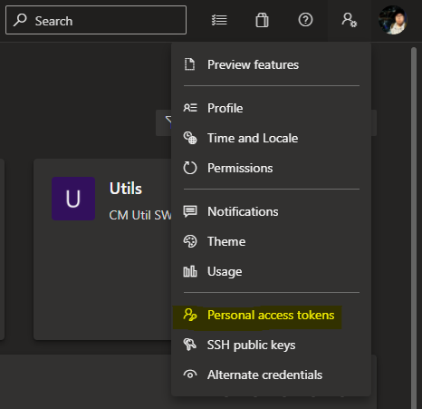

좌측 상단에 `+ New Token` 을 클릭하면, 우측에 새 토큰 생성 패널이 나타납니다. 여기서 이름과 유효기간, 토큰에 부여할 권한 등을 지정해 줍니다. PAT는 암호와도 같기 때문에, 외부에 노출되지 않도록 잘 관리하는것도 중요하고, 유효기간과 권한 범위도 필요한 만큼만 적절히 지정해서 유출 되더라도 그로 인한 위험성을 최소화 해 주는것이 좋습니다.

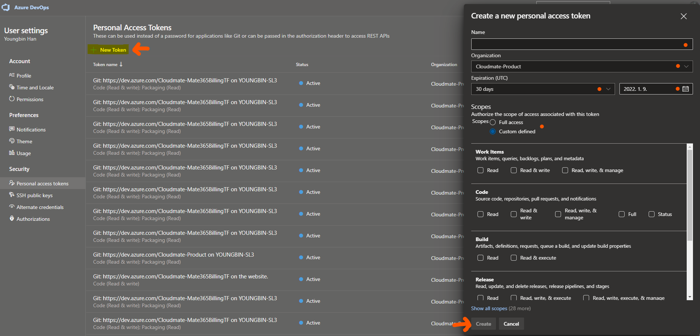

## REST API 호출 해 보기
이제 발급한 PAT로 Azure DevOps REST API 를 간단히 호출 해 보겠습니다. 여기서는 예시로 [Azure DevOps 조직의 프로젝트를 나열하는 API](https://docs.microsoft.com/en-us/rest/api/azure/devops/core/projects/list?view=azure-devops-rest-6.1)를 호출 해 보겠습니다.

API 참조 문서를 확인 해 보면, 아래와 같은 경로로 `GET` 요청을 보내면 된다고 나와 있습니다.

```
GET https://dev.azure.com/{organization}/_apis/projects?api-version=6.1-preview.4
```

PAT 로 인증 또한 해 주어야 하는데요, [이 문서에 따르면](https://docs.microsoft.com/en-us/rest/api/azure/devops/?view=azure-devops-rest-6.1#assemble-the-request) Basic Auth 방식으로 인증하면 된다고 나와 있습니다. GUI 로 HTTP 요청을 만들어 테스트 해 볼수 있는 [hoppscotch](https://hoppscotch.io/)를 사용하여 간단히 테스트 해 보겠습니다.

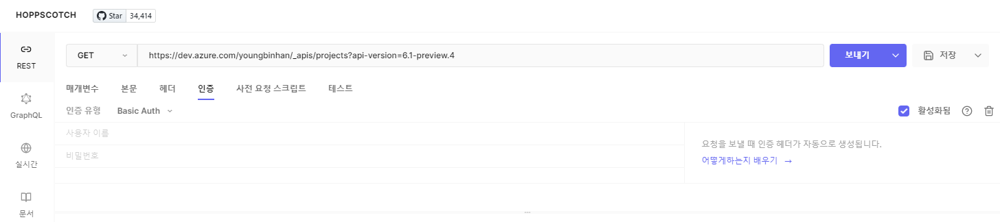

Hoppscotch 에 접속하셔서, 위 사진처럼 설정합니다.
- URL: `https://dev.azure.com/{organization}/_apis/projects?api-version=6.1-preview.4` - `{organization}`은 Azure DevOps 조직 이름으로 수정
- 요청 방식: GET
- 인증: Basic Auth 선택
  - 사용자 이름: 비워두기
  - 비밀번호: 앞에서 발급한 PAT 입력

입력 후, `보내기` 버튼을 클릭하여 API 를 호출하면 아래와 같이 JSON 형식으로 된 Azure DevOps 조직의 프로젝트 목록 데이터가 조회되는 것을 확인하실 수 있습니다.
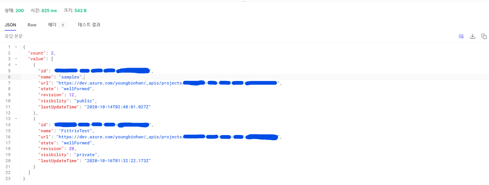

CLI 환경이 편하다면, `curl` 명령으로 아래와 같이 호출해 볼 수 있습니다.

```bash
# curl -u <사용자 이름>:<암호> <URL>
curl -u :<발급한 PAT> https://dev.azure.com/youngbinhan/_apis/projects?api-version=6.1-preview.4
```

## Python 코드로 작성해서 호출 해 보기
PAT 발급도 했고, REST API 호출도 해 보았는데요. 이번에는 Python 으로 API 호출하는 코드를 작성 해 보겠습니다.
Python HTTP 라이브러리인 [`requests`](https://docs.python-requests.org/en/latest/)로 API 를 호출하는 코드를 간단히 작성해 봅시다.

```bash
# requests 라이브러리 설치
pip install requests
```

`requests.auth` 패키지의 `HTTPBasicAuth` 클래스로 인증 정보가 담긴 객체를 만들어 Azure DevOps REST API 에 인증하고 API 를 호출하는 작업을 할 수 있습니다.
```python
import requests
from requests.auth import HTTPBasicAuth
PAT = "<앞에서 발급한 PAT>"
AZ_DEVOPS_ORG = "youngbinhan" # Azure DevOps 조직 이름

result = requests.get(f'https://dev.azure.com/{AZ_DEVOPS_ORG}/_apis/projects?api-version=6.1-preview.4', auth=HTTPBasicAuth('', PAT))
print(result.json())
```
> 실행 결과 
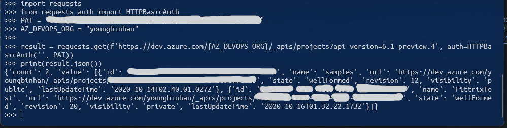
```json
{
   "count":2,
   "value":[
      {
         "id":"********-****-****-****-************",
         "name":"samples",
         "url":"https://dev.azure.com/youngbinhan/_apis/projects/********-****-****-****-************",
         "state":"wellFormed",
         "revision":12,
         "visibility":"public",
         "lastUpdateTime":"2020-10-14T02:40:01.027Z"
      },
      {
         "id":"********-****-****-****-************",
         "name":"FittrixTest",
         "url":"https://dev.azure.com/youngbinhan/_apis/projects/********-****-****-****-************",
         "state":"wellFormed",
         "revision":20,
         "visibility":"private",
         "lastUpdateTime":"2020-10-16T01:32:22.173Z"
      }
   ]
}
```
## Python 클라이언트 라이브러리 사용하기
앞서 API를 호출하는 코드를 작성 할 때는, 직접 URL 을 넣고 호출 했는데요. 간단한 작업 한 두게면 큰 문제가 없겠지만, 만약 Azure DevOps 조직의 대부분의 데이터를 호출해야 해서 상당히 많은 숫자의 API 를 호출해야 한다면, 그 URL 경로나 조회 했을 때 나오는 데이터 등을 관리 하는 것도 아마 쉽지 않을 겁니다.

앞서 보았던 Azure SDK 처럼, Azure DevOps 도 [.Net](https://docs.microsoft.com/en-us/azure/devops/integrate/concepts/dotnet-client-libraries?view=azure-devops), [Go](https://github.com/Microsoft/azure-devops-go-api), [Node.js](https://github.com/Microsoft/vsts-node-api), [Python](https://github.com/Microsoft/azure-devops-python-api) 등 다양한 언어별로 클라이언트 라이브러리가 제공됩니다. 이를 이용하면, URL 을 직접 명시할 필요 없이, 라이브러리에 있는 함수 중 해당 API 를 호출 해 주는 것으로 호출 해 주면 되고, 딕셔너리가 아닌 클래스 기반 객체로도 변환을 해 줍니다. 때문에 많은 숫자의 API 를 호출하여 작업을 자동화 하는 코드를 작성한다면 좀 더 편리하게 코드를 작성할 수 있습니다.  

Python 용 클라이언트 라이브러리를 사용 하려면, `azure-devops` 패키지를 설치하면 됩니다.

```bash
pip install azure-devops
```

그러면 이제 설치된 패키지를 활용하여, Azure DevOps REST API 와의 연결 설정을 초기화 해서 사용할 수 있습니다. 인증 데이터가 담긴 객체는 `msrest.authentication` 패키지의 `BasicAuthentication`를 사용 하는데요, `azure-devops` 패키지 설치 시 같이 설치되므로, 별도로 설치하지 않아도 됩니다.

```python
from azure.devops.connection import Connection
from msrest.authentication import BasicAuthentication

personal_access_token = '<앞에서 발급한 PAT>'
organization_url = 'https://dev.azure.com/youngbinhan' # youngbinhan 를 사용중인 DevOps 조직 이름으로 변경

# Basic Auth 인증 정보 만들기
credentials = BasicAuthentication('', personal_access_token)
# 연결 객체 만들기
connection = Connection(base_url=organization_url, creds=credentials)
```

Python 용 클라이언트 라이브러리의 경우, REST API 문서에서 분류 되어 있는 것 처럼 함수 및 클래스가 모듈화 되어 있습니다. 그래서 REST API 문서 목록에 분류 되어 있는 것을 참고해서 필요한 모듈을 불러오고 모듈에 있는 함수로 API 호출을 할 수 있습니다.

예를 들어 앞서 호출했던 프로젝트 목록 조회 API 는 `Core` - `Projects` 분류에 `List` 에 해당함을 API 문서에서 확인할 수 있습니다.
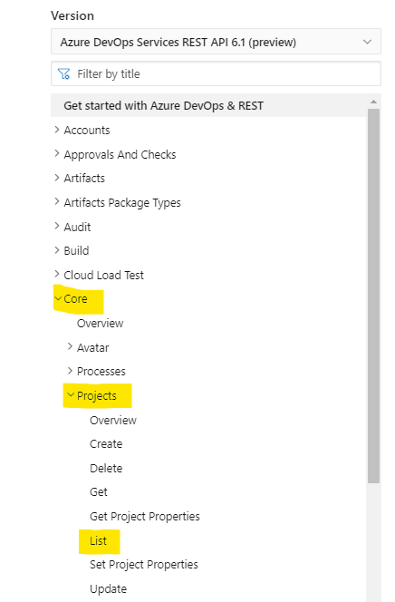

이는 Python 클라이언트 라이브러리에서는 앞에서 만든 `connection` 객체에 있는 `core_client` 에 포함된 `get_projects()` 함수에 해당합니다.
아래와 같은 코드로, `core_client` 를 얻고, 해당 클라이언트 객체에서 `get_projects()` 함수를 호출해서 프로젝트 목록을 조회할 수 있습니다.

```python
# Core 클라이언트 객체 얻기
core_client = connection.clients.get_core_client()

# Core 클라이언트 객체에서 프로젝트 목록 조회
get_projects_response = core_client.get_projects()
```

함수를 호출해서 반환된 객체의 `value` 속성을 출력 해 보면, JSON 이나 Python 딕셔너리가 아닌 클래스가 담긴 배열로 출력되는 것을 볼 수 있습니다.
```python
print(get_projects_response.value)
```
```python
[<azure.devops.v5_1.core.models.TeamProjectReference object at 0x000001CA7BD8FBE0>, <azure.devops.v5_1.core.models.TeamProjectReference object at 0x000001CA7BD8FB80>]
```

아래와 같이 간단한 반복문으로 프로젝트 이름만 출력 해 볼 수 있습니다.
```python
project_names = [ project.name for project in get_projects_response.value]
print(project_names)
```
```python
['samples', 'FittrixTest']
```

이렇게 클라이언트 라이브러리를 활용해서 코드를 작성하면, 사용하는 API의 URL이나 객체 바인딩 등을 관리할 필요가 없어져, 좀더 편리하게 API 를 호출하여 사용하는 코드를 작성하실 수 있습니다. 참고해야 할 점은, 잘 관리되고 있는 Node.js 및 Go 클라이언트 라이브러리와 달리, Python 클라이언트 라이브러리는 지금 시점에서 보면 작년 여름 이후 업데이트가 없어 구현 되어 있지 않은 함수도 여럿 있습니다.
때문에 필요한 경우, Python 클라이언트 라이브러리를 사용하는 방법과 REST API 를 직접 호출하는 방법을 같이 활용해야 할 수도 있습니다.
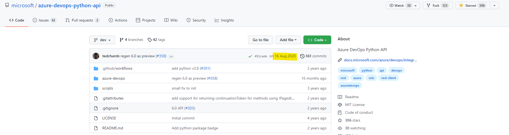

## 웹 브라우저의 개발자 콘솔로, 호출 할 API 찾기
Azure DevOps 의 REST API 를 보면, 상당히 다양한 숫자의 API 가 제공 되고 있고, 어떤 API 의 경우 이름이 여러분이 예상했던 이름과 일치하지 않아서 찾기 어려운 경우도 많이 있습니다.
Azure DevOps 의 REST API는 단지 Azure DevOps 기능을 외부에서 호출하기 위해서만 쓰는것이 아니라, Azure DevOps 웹 프론트에서도 호출해서 여러분이 보는 Azure DevOps 화면의 데이터 표시에도 많이 사용되기 때문에, 이를 활용하면 여러분이 원하는 API 를 좀 더 쉽게 찾을 수 있습니다.

아래 사진 처럼 Azure Boards 에 나오는 Work Item 목록을 조회하는 것을 예로 들어 보겠습니다. 사진에 나오는 것을 API 로 조회 하려면 어떻게 해야 할까요? 문서에서 Work Item 관련 API 를 찾으면 되긴 하겠지만. API 문서를 처음 본다면 API 가 많아서 그 중에 찾기 어려울 겁니다. 
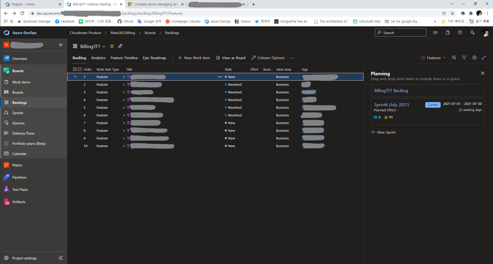

해당 페이지에서 개발자 도구를 열고, `네트워크` 탭으로 이동한 후, 새로 고침을 하면. 페이지에서 발생하는 HTTP 호출 등을 보실 수 있습니다. 그 중, 경로에 `_apis` 가 포함된 것을 찾아서 확인해 보면 되겠습니다.
여기서는 `_apis/wit/workItemsBatch` 에 해당하는 `workItemsBatch` 항목이 해당 되겠네요. 
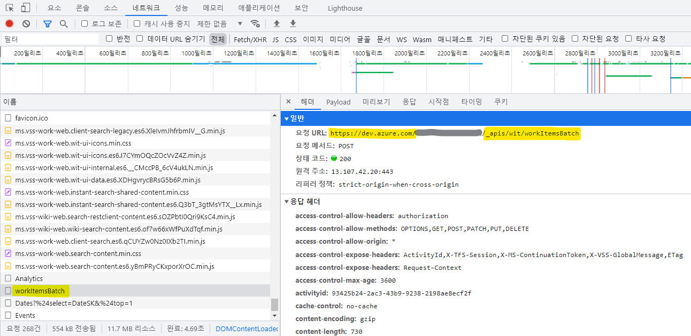

해당 항목을 누르고, `미리보기` 탭을 클릭하면, API를 호출해서 응답으로 전달받은 데이터를 확인할 수 있습니다. 데이터를 열어보니, 각 항목마다 또다른 API를 호출하기 위한 URL 이 포함되어 있는것이 보이는데요. 하나 선택해서 API 를 호출하여 어떤 데이터를 가져다 주는지 테스트 해 보겠습니다.
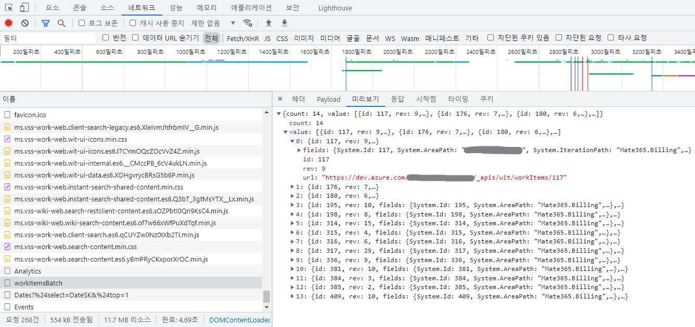

`콘솔` 탭에서, 앞에서 `미리보기` 탭에서 본 `url` 값으로 아래와 같은 코드를 작성해서 실행해 봅니다.
```js

// 예시: "https://dev.azure.com/youngbinhan/_apis/wit/workItems/117"
let workItem = "앞에서 복사한 Work Item의 URL 값"
await fetch(workItem).json()
```
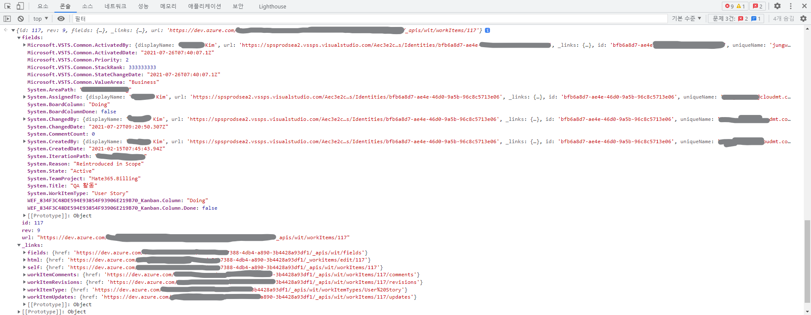
실행 해 보면, API 호출에 대한 응답 데이터가 콘솔에 바로 나타나서 확인할 수 있는데요. Work Item 하나에 대한 자세한 데이터를 조회해서 보여주는 것을 확인할 수 있습니다.

이렇게 호출 해 본 API 의 경로에서. API 문서 상에선 어디에서 찾을 수 있는지 대략 유추해 볼 수 있습니다. 여기서 예제로 찾아본 Work Item 조회 관련 API 의 경우, `wit (Work Items Tracking)` 에 해당하는 **Work Items** 아래에 **List** 및 **Get Work Item** 에서 찾을 수 있습니다.

- [Work Items - Get Work Items Batch](https://docs.microsoft.com/en-us/rest/api/azure/devops/wit/work-items/get-work-items-batch?view=azure-devops-rest-6.1)
- [Work Items - Get Work Item](https://docs.microsoft.com/en-us/rest/api/azure/devops/wit/work-items/get-work-item?view=azure-devops-rest-6.1)

## Work Item 목록 조회하는 코드 작성해보기
이번에는 위에서 찾아본 **Work Items - Get Work Items Batch** API 로 한번 Work Item 과 각 Work Item 제목을 출력하는 것을 간단히 Python 으로 작성 해 보겠습니다.

### REST API 직접 호출
```python
import requests
from requests.auth import HTTPBasicAuth
PAT = "<앞에서 발급한 PAT>"
AZ_DEVOPS_ORG = "youngbinhan" # Azure DevOps 조직 이름
PROJECT = "samples"
URL = f'https://dev.azure.com/{AZ_DEVOPS_ORG}/{PROJECT}/_apis/wit/workitemsbatch?api-version=6.1-preview.1'
body = {
    "fields":["System.Id", "System.Title"],
    "ids":[1,2,3]
}
result = requests.post(URL, auth=HTTPBasicAuth('', PAT), json=body)
print(result.json())
```
PAT, DevOps 조직 URL 을 지정하고, **Work Items - List** API 를 바로 호출합니다. API 문서를 참고하여, 프로젝트 이름과 조회할 데이터에 대한 조건도 JSON 으로 넣어주어 호출합니다. 
여기서는 조회 조건으로 조회할 Work Item ID 와 Work Item 의 필드를 넣어 주었습니다. 필드의 경우 ID(`System.Id`)와 제목(`System.Title`)을 지정 하였습니다. 
그러면 아래와 같은 형태의 JSON 데이터가 출력되는 것을 확인할 수 있습니다.
```json
{
   "count":3,
   "value":[
      {
         "id":1,
         "rev":2,
         "fields":{
            "System.Id":1,
            "System.Title":"test"
         },
         "url":"https://dev.azure.com/youngbinhan/_apis/wit/workItems/1"
      },
      {
         "id":2,
         "rev":1,
         "fields":{
            "System.Id":2,
            "System.Title":"Bug fix"
         },
         "url":"https://dev.azure.com/youngbinhan/_apis/wit/workItems/2"
      },
      {
         "id":3,
         "rev":1,
         "fields":{
            "System.Id":3,
            "System.Title":"Sign in feature"
         },
         "url":"https://dev.azure.com/youngbinhan/_apis/wit/workItems/3"
      }
   ]
}
```
여기서 ID 와 제목만 출력 되도록 아래와 같이 수정합니다.
```python
...
result = requests.post(URL, auth=HTTPBasicAuth('', PAT), json=body)
# 추가한 코드
workItems = result.json()["value"]
for workItem in workItems:
    print(f"[{workItem['id']}] {workItem['fields']['System.Title']}")
```
수정한 코드를 실행하면, 아래과 같이 Work Item 목록이 출력 되는 것을 확인할 수 있습니다.
```bash
[1] test
[2] Bug fix
[3] Sign in feature
```

### Python 클라이언트 라이브러리 활용
같은 작업을 이번에는 Python 클라이언트 라이브리를 활용해서 작성 해 보겠습니다. 먼저 앞에서 작성 했던 코드 처럼 연결을 초기화 합니다.
```python
from azure.devops.connection import Connection
from msrest.authentication import BasicAuthentication

personal_access_token = '<PAT>'
organization_url = 'https://dev.azure.com/youngbinhan' # youngbinhan 를 사용중인 DevOps 조직 이름으로 변경
PROJECT = "samples"
# Basic Auth 인증 정보 만들기
credentials = BasicAuthentication('', personal_access_token)
# 연결 객체 만들기
connection = Connection(base_url=organization_url, creds=credentials)
```
Python 클라이언트 라이브러리의 경우, `work_item_tracking_client` 모듈에서 Work Item 관련 API 를 호출하는 함수를 불러와 호출할 수 있습니다. 이를 위해 `get_work_item_tracking_client()` 메서드를 이용합니다.
이후 해당 모듈의 `get_work_items_batch()` 로 동일한 데이터를 조회할 수 있습니다.
```python
...
from azure.devops.v6_0.work_item_tracking import WorkItemBatchGetRequest

...
# 연결 객체 만들기
connection = Connection(base_url=organization_url, creds=credentials)
# Work Item 클라이언트 얻기
client = connection.clients.get_work_item_tracking_client()

# Work Item 목록 조회
body = WorkItemBatchGetRequest(
    ids=[1,2,3], 
    fields=["System.Id", "System.Title"])
result = client.get_work_items_batch(body, project=PROJECT)
```
Python 클라이언트의 경우, 앞에서 언급했듯, 조회된 결과 데이터를 클래스 기반 객체로 변환하여 반환 해 줍니다. `get_work_item_tracking_client()` 함수의 경우, `WorkItem` 타입의 배열을 반환 해 주는데요. 이 클래스에 어떤 필드가 있는지 소스코드로 확인 해 보겠습니다. 설치된 Python 패키지의 `azure/devops/v6_0/work_item_tracking/models.py` 에서 `WorkItem` 클래스를 확인할 수 있습니다.

```python
class WorkItem(WorkItemTrackingResource):
    """
    Describes a work item.

    :param url:
    :type url: str
    :param _links: Link references to related REST resources.
    :type _links: :class:`ReferenceLinks <azure.devops.v6_0.work_item_tracking.models.ReferenceLinks>`
    :param comment_version_ref: Reference to a specific version of the comment added/edited/deleted in this revision.
    :type comment_version_ref: :class:`WorkItemCommentVersionRef <azure.devops.v6_0.work_item_tracking.models.WorkItemCommentVersionRef>`
    :param fields: Map of field and values for the work item.
    :type fields: dict
    :param id: The work item ID.
    :type id: int
    :param relations: Relations of the work item.
    :type relations: list of :class:`WorkItemRelation <azure.devops.v6_0.work_item_tracking.models.WorkItemRelation>`
    :param rev: Revision number of the work item.
    :type rev: int
    """

    _attribute_map = {
        'url': {'key': 'url', 'type': 'str'},
        '_links': {'key': '_links', 'type': 'ReferenceLinks'},
        'comment_version_ref': {'key': 'commentVersionRef', 'type': 'WorkItemCommentVersionRef'},
        'fields': {'key': 'fields', 'type': '{object}'},
        'id': {'key': 'id', 'type': 'int'},
        'relations': {'key': 'relations', 'type': '[WorkItemRelation]'},
        'rev': {'key': 'rev', 'type': 'int'}
    }

    def __init__(self, url=None, _links=None, comment_version_ref=None, fields=None, id=None, relations=None, rev=None):
        super(WorkItem, self).__init__(url=url, _links=_links)
        self.comment_version_ref = comment_version_ref
        self.fields = fields
        self.id = id
        self.relations = relations
        self.rev = rev
```
확인 해 보면, REST API 로 호출 했을 때 처럼, `id` 와 배열 형태의 `fields` 필드가 포함 되어 있는데요. 이를 이용해 Work Item ID 와 제목을 출력하도록 작성하면 아래와 같습니다.
```python
...
from azure.devops.v6_0.work_item_tracking import WorkItemBatchGetRequest

...
# 연결 객체 만들기
connection = Connection(base_url=organization_url, creds=credentials)
# Work Item 클라이언트 얻기
client = connection.clients.get_work_item_tracking_client()

# Work Item 목록 조회
body = WorkItemBatchGetRequest(
    ids=[1,2,3], 
    fields=["System.Id", "System.Title"])
result = client.get_work_items_batch(body, project=PROJECT)
for item in result:
    print(f"[{item.id}] {item.fields['System.Title']}")
```
이제 수정한 코드를 실행 해 보면, REST API 로 호출 했을 때 처럼 Work Item 목록이 출력되는 것을 확인할 수 있습니다.
```bash
[1] test
[2] Bug fix
[3] Sign in feature
```

# 정리

지금까지 Azure DevOps REST API 를 활용하여 DevOps 의 데이터를 조회하거나 업데이트 하고, 각 언어별 DevOps 클라이언트 라이브러리 등에 대해 알아보았습니다.
그리고 Work Item 조회를 예로 들어 간단한 예제 코드를 통해 사용 방법에 대해서도 알아보았습니다. Azure와 Azure DevOps 를 사용 하다 보면 일괄적으로 데이터를 조회해서 확인 하거나, 해당 서비스에서의 정해진 작업을 자동화 할 때도 자주 있을 텐데요, 이럴 때 각 서비스가 제공하는 API를 활용하여 자동화를 해 볼 수 있습니다.

