## 1. Azure Database Migration Service 소개
이 글에서는 Azure DMS 에 대한 개요, 소개는 짤막하게 주요 링크들로 대체하고 DMS로 실제 마이그레이션 프로젝트를 진행했던 과정 위주로 기술하겠습니다.

Azure 안에서 소개된 내용은,
> Azure Database Migration Service는 Azure로의 데이터베이스 마이그레이션을 간소화하고, 가속화할 수 있게 도와주며, 안내하고, 자동화하는 데 도움이 되는 도구입니다.

라고 소개되어 있습니다.  
[Azure Database Migration Service 소개](https://azure.microsoft.com/ko-kr/services/database-migration/)  
[Azure Database Migration Service 설명서](https://docs.microsoft.com/ko-kr/azure/dms/)

### Azure DMS 의 장점
`Azure 데이터베이스 마이그레이션 가이드`에서 migration 가능한 원본과 대상의 조합을 다양하게 확인할 수 있습니다.

[Azure 데이터베이스 마이그레이션 가이드](https://docs.microsoft.com/ko-kr/data-migration)  
[데이터 마이그레이션 시나리오에 사용할 수 있는 서비스 및 도구](https://docs.microsoft.com/ko-kr/azure/dms/dms-tools-matrix)

## 2. DB 마이그레이션 계획

### 원본 DB 진단
- AWS EC2 (IaaS)
- OS : Microsoft Windows Server 2019
- class: r5.4xlarge (16 vCPU, memory 128 GiB, 네트워킹 성능 최대 10 Gbps)
- storage: 16,384 GiB (≒ 16 TiB)
- EBS 대역폭 4,750 Mbps
- DBMS: SQL Server 2017 (14.0.3048.4)
- catalog: 16개
- DB data 용량: 121.8 GiB
- Compatibility level: catalog 마다 상이함. (100, 110, 140)
- 마이그레이션 대상 오브젝트: table, stored procedure, agent job  
※ *그 외에 view, synonym, function, assembly 등 은 없음.*

### 대상 DB 선정
- Azure SQL Managed Instance (PaaS)
- 고객의 요구에 따르면 PaaS DB 로의 마이그레이션을 희망하였기 때문에 다음 2가지 서비스에 대하여 고민하였고, 원본DB에서 agent job을 대상DB에서도 계속 운영해야 했기에 SQL agent 서비스가 가능한 Azure SQL Managed Instance 로 선정하였습니다.
1. Azure SQL Managed Instance (*SQL agent 서비스 지원*)
1. Azure SQL Database (*SQL agent 서비스 불가*)

※ 참고: Azure SQL 서비스 별 특성
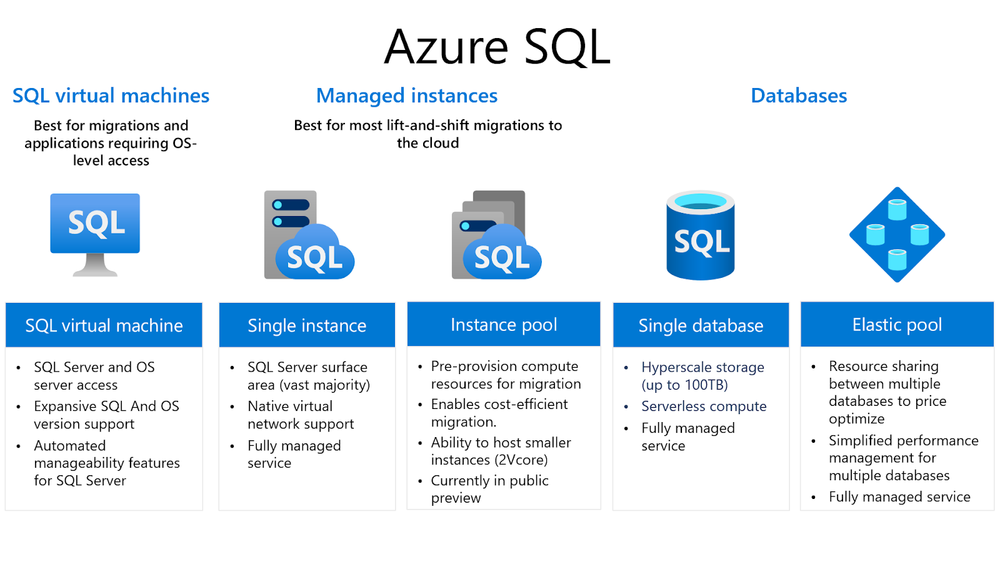  

- tier 선택: general purpose, Gen5, 16 vCore (memory 81.6GiB)  
※ 원본DB 16 vCPU 와 가장 근사치
- storage: 416 GiB

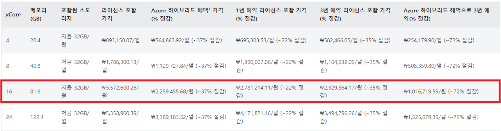
[Azure SQL Managed Instance 가격](https://azure.microsoft.com/ko-kr/pricing/details/azure-sql/sql-managed-instance/single/)  
  
## 3. 작업 시나리오

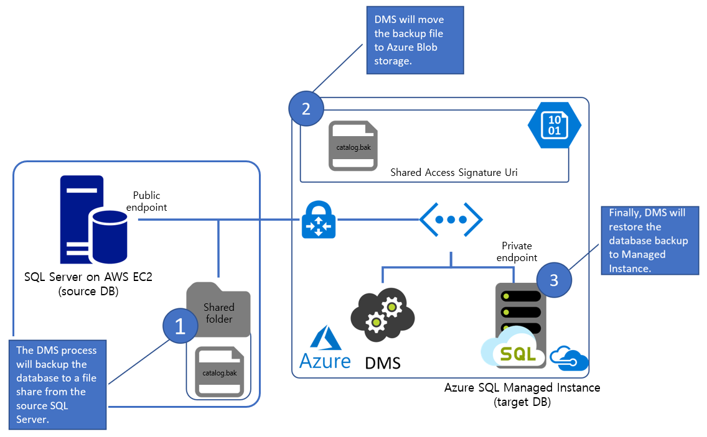

### 사전 준비

1. 네트워크 연결
- Azure DMS 에서 원본DB에 접속할 수 있도록 네트워크를 구성합니다.
- 원본DB 내에서 백업파일(.bak)을 생성할 공유폴더를 생성하고, SQL Server 서비스의 시작계정이 해당 공유폴더에 대한 모든 권한을 갖도록 설정합니다.
- `\\public_ip\Shared_folder` 로 접근할 수 있도록 네트워크 어댑터 안에 IPv4 항목에 DHCP 가 아닌 현재 부여받은 internal ip, public ip 를 입력합니다.  

> *모든 제어판 항목 > 네트워크 연결 > 특정 ethernet adapter (우클릭) 속성 > 인터넷 프로토콜 버전 4(TCP/IPv4) 속성 > 다음 IP/DNS 주소 사용에서 IP 입력 > 고급 > IP 설정 탭 > IP 주소 "추가" > public ip 입력 후 확인 > 확인 > 확인*
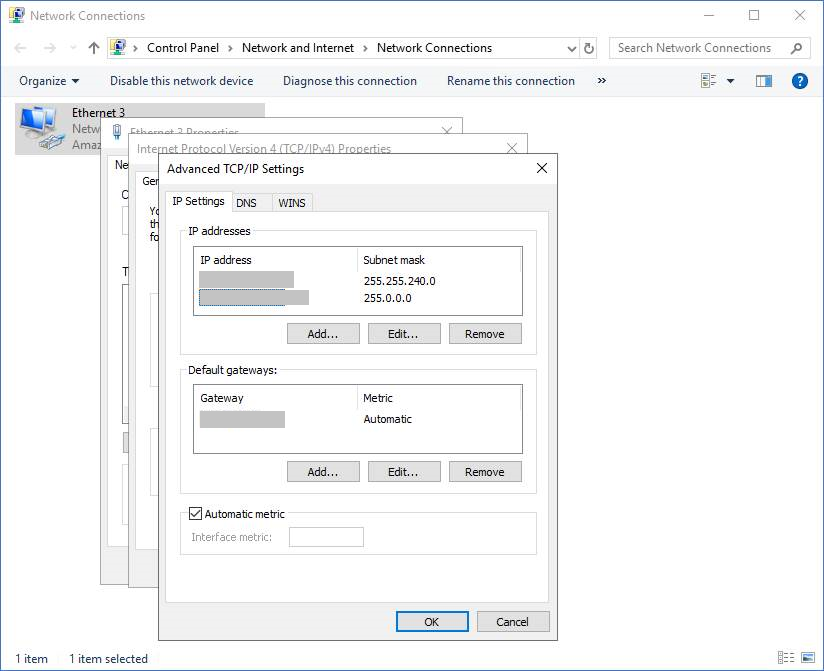

1. **DMS**와 **migration project** 생성
- DMS 리소스는 생성이 완료되는 데까지 시간이 오래 걸리니 미리 생성해놓으시는 것을 추천드립니다. (아주 오~래 걸립니다ㅠ)  

> DMS 이름 입력 > 계층은 **프리미엄** (4vCore) 선택 > vnet 선택 > 태그 입력 > 검토 + 만들기

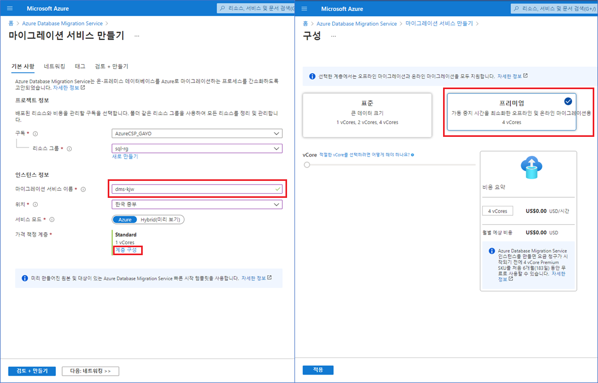

- DMS 생성이 완료되면 DMS 하위에 DMP (`Database Migration Project`)를 생성합니다. DMP 는 짧은 시간 내에 생성이 됩니다.  
- **Migration activity type** 은 online, offline, SSIS package 가 있으며 activity type에 따라 지원되는 source, target 별 DB 유형은 다음 링크에서 확인할 수 있습니다.  

[Azure Database Migration Service에서 지원하는 마이그레이션 시나리오의 상태](https://docs.microsoft.com/ko-kr/azure/dms/resource-scenario-status)

- DMP를 생성한 다음, 바로 이어서 migration wizard 가 나옵니다.  
1) Select source: 원본DB에 대한 접속 정보 입력  
1) Select target: 대상DB에 대한 접속 정보 입력  
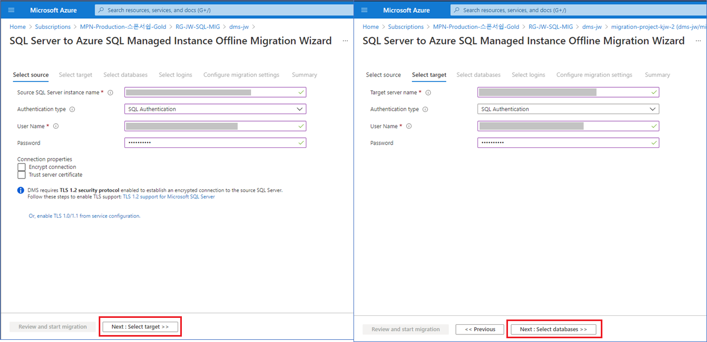  

1) Select databases: migration 할 catalog를 선택  
1) Select logins: migration 할 SQL로그인을 선택  
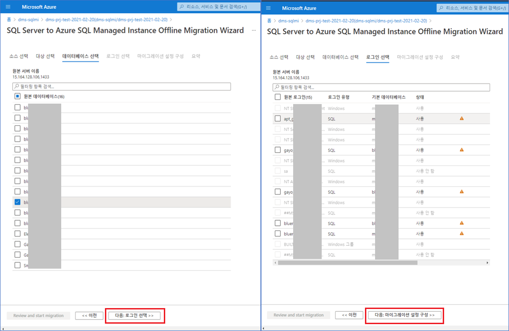  


1) Configure migrations settings: 백업경로, 계정, SAS (share access signature) URI 입력  
※ 가장 까다로운 부분입니다.  
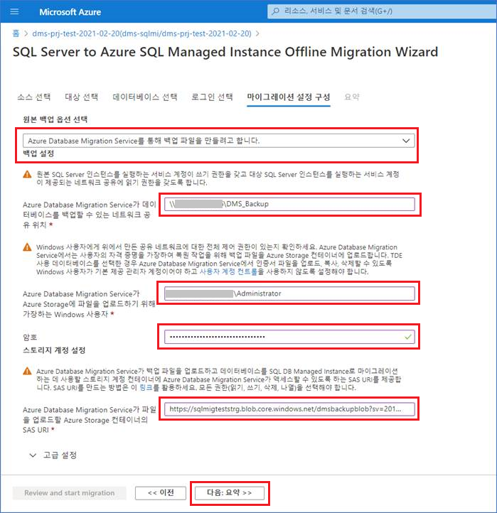  

1. Azure blob storage account
- 원본DB 의 백업파일(*.bak)을 만들어서 Azure 영역 안으로 가져올 때 사용될 storage account 를 생성하고 그 하위에 blob container를 생성합니다. **Large file shares** 는 **Enabled**로 설정합니다.  

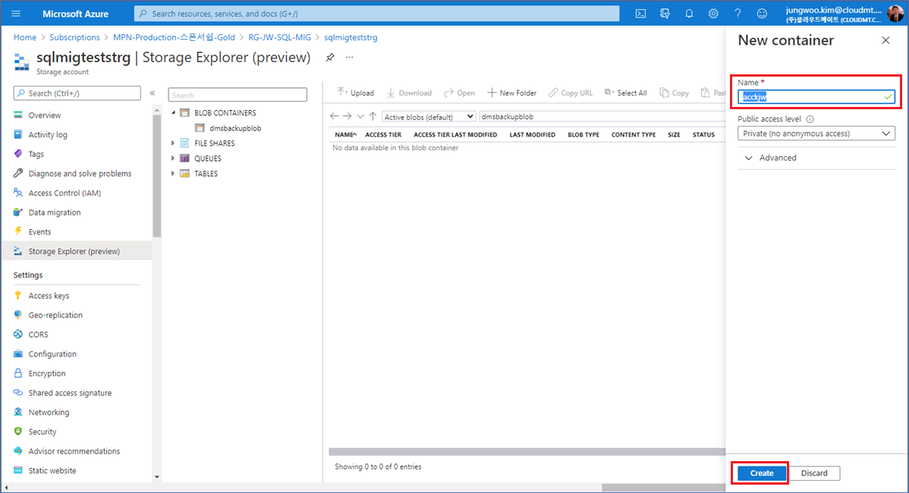

## 4. 마이그레이션을 시작하자
자, 이제 모든 힘겨운 사전 준비는 마쳤으며 산뜻한 기분으로 실제 마이그레이션 작업을 시작해보겠습니다.  

### Azure DMS > Database Migragion Project > task (오프라인 마이그레이션)
**새 작업** 클릭 > 원본DB, 대상DB에 로그인 비밀번호 다시 입력 > **작업 이름** 입력 >  **Start migration** 클릭  

아래 그림대로 작업 이름이 보여지게 되고 [상태] 값은 `대기,진행중,실패,완료됨` 등으로 표시됩니다.  
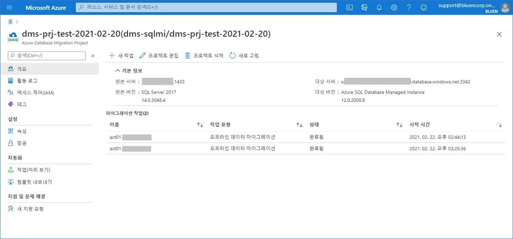

원본DB의 네트워크 대역폭이 클수록, 백업파일의 용량이 작을수록 migration 작업 시간은 단축됩니다.

## 5. 마이그레이션 사후평가
아래 엑셀시트로 정리한 catalog list 대로 마이그레이션 작업을 진행했습니다.
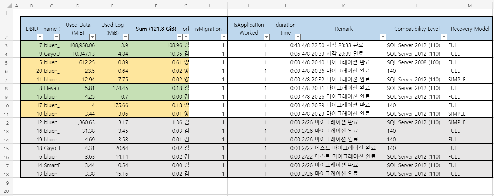

### 원본,대상 의 object, data 차이 비교
다음 SQL문을 원본DB, 대상DB에 각각 실행하고 한 엑셀시트에 모아서 테이블의 갯수와 각 테이블의 record count를 비교해보았습니다.

```sql
-- 모든 catalog에 대한 각 테이블의 record count 출력
USE tempdb;
GO
IF OBJECT_ID('tempdb.dbo.#TBL_ROW_COUNT') IS NOT NULL
   DROP TABLE tempdb.dbo.#TBL_ROW_COUNT;
GO
CREATE TABLE #TBL_ROW_COUNT (DB_NAME NVARCHAR(100), TBL_NAME NVARCHAR(100), CNT INT);
GO
EXEC sp_MSforeachdb N'USE ?
IF DB_ID() > 4 BEGIN
SELECT ''INSERT INTO #TBL_ROW_COUNT SELECT DB_NAME = '''''' + DB_NAME() + '''''', TABLE_NAME = N'''''' + CAST(B.name AS NVARCHAR(100)) + ''.'' + A.name + '''''', CNT = COUNT(*) FROM ['' + DB_NAME() + ''].['' + B.name + ''].['' + A.NAME + ''] (nolock)''
FROM SYS.OBJECTS A INNER JOIN SYS.SCHEMAS B ON A.schema_id = B.schema_id
WHERE TYPE = ''U'''
END
GO
SELECT * FROM tempdb.dbo.#TBL_ROW_COUNT
```

### 추가적인 조치
```sql
-- 마이그레이션 이후에 대상DB에는 원본DB와는 다르게 쿼리저장소 기능이 자동으로 켜져있었습니다.
-- 동일한 환경으로 만들어주기 위해 QUERY_STORE = OFF 처리했습니다.
SELECT 'ALTER DATABASE [' + name + '] SET QUERY_STORE = OFF;'
FROM sys.databases
WHERE database_id > 4;
```

```sql
-- 각 데이터베이스에 적용할 옵션 스크립트 생성 - 소유자 변경
SELECT 'ALTER AUTHORIZATION ON DATABASE::[' + name + '] TO [owner_name];'
FROM sys.databases
WHERE database_id > 4;
```

## 6. 느낀 점
Azure 내에서 DB를 운영하기 위한 migration 도구로서 Azure DMS 는 매우 좋은 서비스라고 생각합니다. source, target에서 migration 지원 가능한 DB 유형을 숙지한 상태에서 적절한 migration 계획이 나올 수 있겠습니다. AWS DMS와 비교해보았을 때 Azure DMS는 MS SQL Server에 조금 더 최적화된 서비스라고 보여집니다. 이 글에서 표현되지는 않았지만, 공유폴더 및 계정을 설정하는 부분에서 사례에 걸맞는 인터넷 자료를 찾기 어려워서 애를 먹었었습니다.

### Thanks to.  
감사의 말씀 전합니다.

공유폴더 및 계정을 설정하는 부분에서 Microsoft의 SQL Server 엔지니어 분의 많은 도움을 받았습니다.  
최근(21년 3월)에 우리 **클라우드메이트**에 합류해주신 **cm.yang** 님께서 migration 작업을 함께 해주셔서 원활히 진행되었습니다.