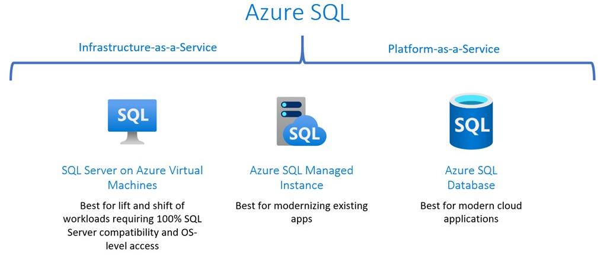
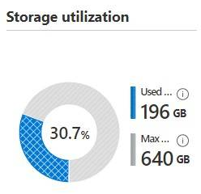
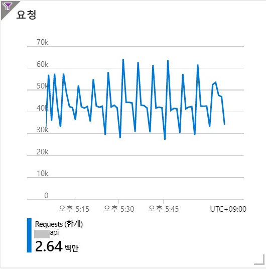
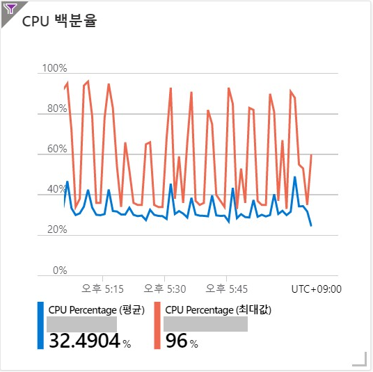
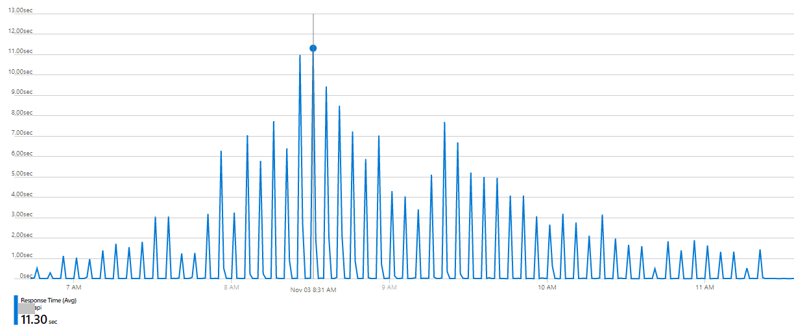
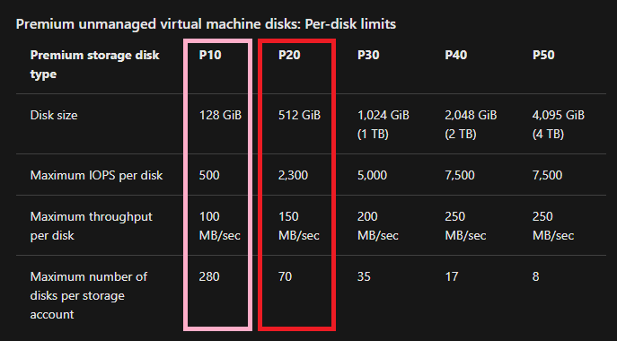
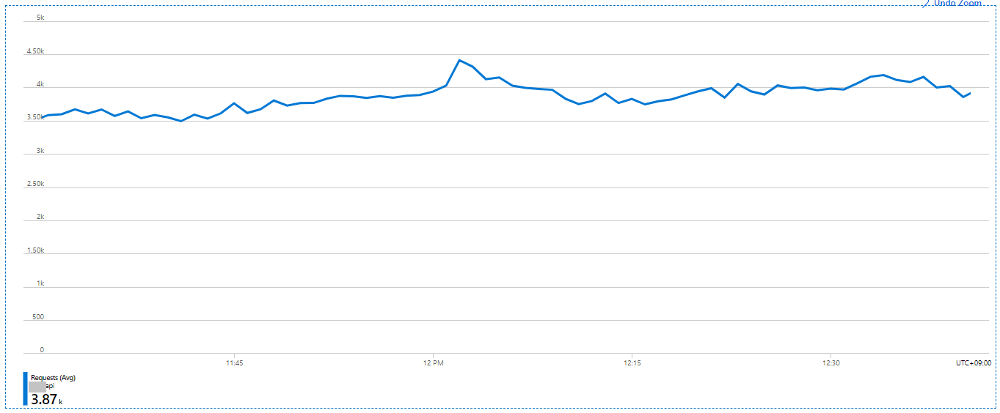
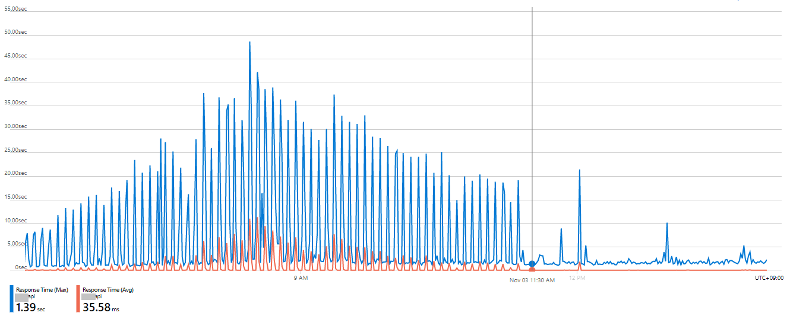
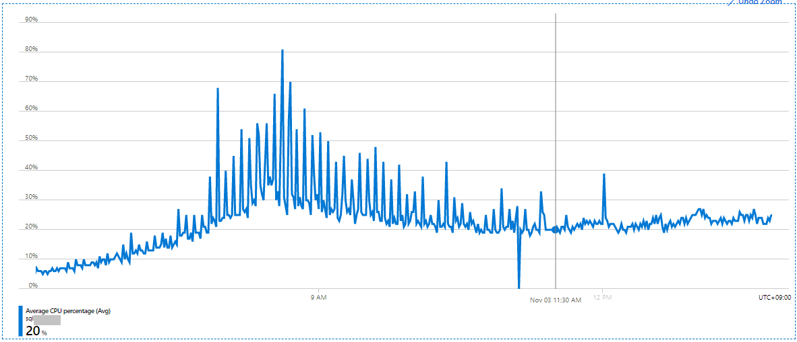

깔끔하게 정리정돈된 도서관 내부 모습은 마치, 잘 관리되고 있는 데이터베이스를 보는 것 같다. 참고로 썸네일 사진은 충남도서관이고 나랑 아무런 연관은 없다.

# 시작하기에 앞서

우리가 클라우드 서비스를 사용하게 되면 처음에는 비싸지 않는데 이상하게 점점 더 비싸지는 느낌적인 느낌이 있다. 이에 과금 최적화 작업을 종종 진행하고는 하는데, 얼마 전에 한 account 내에서 과금 최적화를 위하여 데이터베이스 스토리지 최적화를 진행했었는데, 이때 전혀 예상치 못한 일들이 벌어졌었던 삽질 이야기를 공유하고자 글로 옮긴다.

# Azure SQL Managed Instance 은 아주 좋은 서비스

마우스 몇번의 클릭으로 PaaS DB 가 떡하니 생기고, 알아서 vnet과 subnet에 배치해주고, 알아서 public endpoint도 만들어주고, 알아서 연결 구성 만들어주고, 알아서 PITR 구성해주고, 굉장히 편리하고 좋은 서비스이다. _(SQL Managed Instance 만세👍)_

한번 만들어놓으면 메인터넌스 할 것이 거의 없다. login 추가라던가, 쿼리 튜닝 정도 는 해줘야 겠지만, 뭐 거의 알아서 잘 돌아간다. ~~물론 과금도 잘 돌아간다~~

[Azure SQL Managed Instance에 조금 더 알아보려면 이 링크를 클릭! https://docs.microsoft.com/ko-kr/azure/azure-sql/managed-instance/sql-managed-instance-paas-overview](https://docs.microsoft.com/ko-kr/azure/azure-sql/managed-instance/sql-managed-instance-paas-overview)

# 문제 상황의 등장

> 어떤 DB 의 reserved storage가 640GiB이고 used storage 는 400GiB 정도였으며, used storage의 96% 가 하나의 테이블에 집중되어 있다. 이 테이블을 **tbl_his** 라고 부르겠다. tbl_his 에는 최근 4~5년간 히스토리 성격의 데이터가 담겨 있고, insert 만 되고 있으며 select 하는 경우는 거의 없다고 한다.

---

# 내가 생각한 솔루션

데이터 보존 관리 정책을 수립해야겠다고 판단했다. tbl_his 에는 최근 3개월 간의 데이터만 남기고 나머지 데이터는 Azure blob storage 로 옮긴다거나, 또는 아카이브 용도의 Azure SQL single database를 아주 낮은 tier 로 생성하여, 아주 간혹 있을 select 에 대응하면 되겠다.

tbl_his 에 최근 3개월 간 데이터만 남기게 되면 mdf 의 크기는 너무 헐렁해져 있을 것이니 shrinkfile notruncate 한 이후에 shrinkfile truncateonly 하면 되겠다. 후후 좋아. 이 정도면 완벽한 플랜이고 이제 이 플랜대로 작업을 해야겠다.

> 누구나 그럴듯한 계획을 갖고 있다. 쳐맞기 전까지는. by 전설의 Michael Tyson 옹
---

# 이제 작업을 시작해보자

작업 순서는 아래와 같이 구성했다.

1. tbl_his 와 동일한 구조를 갖는 tbl_his_new 테이블 생성.  
 tbl_his_new 의 년월 단위로 파티셔닝.  
 `1900-01` ~ `2099-12` 까지 파일그룹 `n`개. 파일 `n`개.  
 이때 낱개의 데이터 파일은 init size 64 MiB 에 growth는 16MiB 로 설정.
1. tbl_his 의 최근 3개월 데이터만 tbl_his_new 테이블에 담기.
1. tbl_his 이름 변경 -> tbl_his_old
1. tbl_his_new 이름 변경 -> tbl_his
1. tbl_his_old 테이블 삭제
1. shrinkfile notruncate
1. shrinkfile truncateonly

위 작업 중에서 3번과 4번은 세션이 거의 없는 시간대에 동시에 처리해야 어플리케이션 단에서 에러가 나지 않을 것이다.  
(이른바 **테이블 바꿔치기** 전략)

테이블 바꿔치기 전략을 사용한 이유는, tbl_his 테이블에서 최근 3개월 데이터를 제외한 과거 데이터를 모두 delete 하는 시간 보다, tbl_his 테이블에서 최근 3개월 데이터만 별도의 테이블에 담는 시간이 훨씬 짧게 소요될 것으로 판단했기 떄문이다.

위 작업 순서대로 순조롭게 모든 작업을 마쳤고, 깔끔하게 쉬링크 된 이후의 storage utilization은 아래와 같다.

used storage가 400GiB에서 196GiB으로 절반 수준으로 줄어든 모습. used storage를 많이 줄였으니 Azure portal에서 reserved storage를 많이 줄일 수 있겠군. 이제 모두가 행복해졌다.

---

# 장애의 시작

메트릭을 가만히 쳐다보고 있던 나는 뭔가 섬뜩해져 오는 기분을 느꼈다. 아래 메트릭을 보자.
> 참고로 이 account 내의 어플리케이션 환경은 .NET Core 2.1 이고 Azure App Service를 활용하여 서비스 운영 중에 있다.

App Service의 request metric이 위 그림처럼 규칙적으로 요동을 치기 시작했다.

Azure SQL Managed Instance의 CPU % 값은 App Service의 request metric의 패턴과 일치하게 파도를 쳤고 CPU % 값이 최대 95%까지 육박하였다.

App Service의 response time이다. Avg가 저정도인데 Max는 얼마나 높았을까.. 정말 많은 requests 가 매우 오랫동안 기다리며 응답성이 느려졌던 건데, 이 포스트를 쓰고 있는 시점에도 저 metric을 보면 심장이 두근거린다.

---

# 트러블슈팅

생각을 해보자. 해당일자에 App은 변경된 것이 없고, 변경된 것은 DB 밖에 없다. 그럼 DB에서도 무엇이 변경됐지? shrink 작업을 통해 DB의 used storage가 절반 수준으로 줄어들었고, 데이터 용량의 대부분을 차지하고 있던 tbl_his 테이블의 파티셔닝 작업을 통하여 단일 데이터 파일의 용량이 작아졌다. App의 요청량이 파도를 쳤고 요청량의 파도에 따라 DB의 CPU % 값 역시 파도를 쳤다. DB 에서의 Batch request/sec 는 일정했으며 Active worker count가 거의 두배로 증가를 했다. 그렇다면..!

DB의 reserved storage 용량과 used storage 용량에 따라 보장되는 IOPS가 다른 것인가? 라는 가설에 따라 Azure portal에서 DB의 reserved storage 용량을 증설해보았다. (몇분 이내 적용 완료)

> 흠, 그래도 상황은 나아지지 않았다.

웹검색을 통하여 몇가지 새로운 인사이트를 얻을 수 있었다. Azure SQL Managed Instance에 장착되어 있는 Premium storage disk 에는 disk size 계층에 따라 각기 다른 maximum IOPS per disk 을 제공한다는 것이다.

Scalability and performance targets for VM disks  
https://docs.microsoft.com/en-us/azure/virtual-machines/disks-scalability-targets

Storage performance best practices and considerations for Azure SQL DB Managed Instance (General Purpose)  
https://techcommunity.microsoft.com/t5/datacat/storage-performance-best-practices-and-considerations-for-azure/ba-p/305525

tbl_his 테이블을 파티셔닝 하기 전에는 Primary 파일그룹에 담겨있었는데, 이 Primary 단일 파일에서 파티셔닝하면서 단일 data file size가 64MiB로 확 줄어들면서 해당 파일의 IOPS 가 2,300 에서 500 으로 떨어진 것으로 추정된다.  
그렇다면 이번에는!

각 개별 data file size를 128GiB 보다 큰 값, 예를 들어 136GiB으로 늘려 장애 상황이 해소되는지 알아보기로 했다.

> 오오! 문제가 해결되었다.

아래 메트릭처럼 data file size를 늘리자마자 App의 requests가 일정하게 유입되는 것으로 확인된다.

아래 메트릭처럼, **11:30 AM**을 기점으로 App의 response time(avg,max) 이 정상 수준으로 내려간 것이 확인된다.

또한 DB의 CPU % 역시 아래 메트릭처럼, 기존 장애 상황에서 스파이크 치던 모습에서 **11:30 AM**을 기점으로 스파이크가 거의 없어진 모습이 확인된다.

---

# 교훈

1. Azure SQL Managed Instance의 IOPS는 reserved storage, used storage가 아닌 **data file size**에 따라 제공된다.

1. 과금 최적화한다고 무작정 데이터 용량을 줄였다가는 폭풍야근을 하게될 수 있다.

1. 글자 많은 블로그라고 대충 넘기지 말고 자세히 읽어보면 그 안에 지혜가 담겨있다.

---

# 추신
> 닷넷이 미래 입니다. (.NET 6 LTS 만세)

