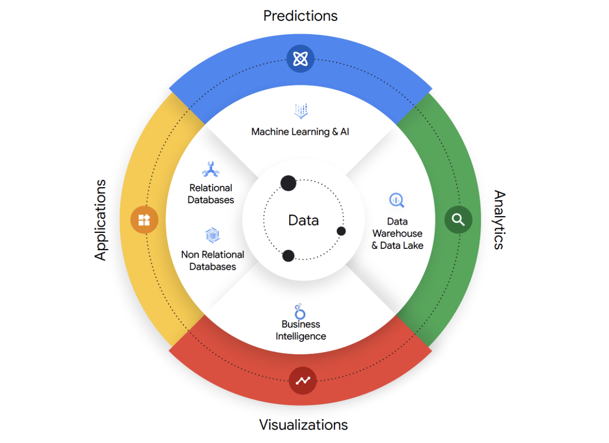
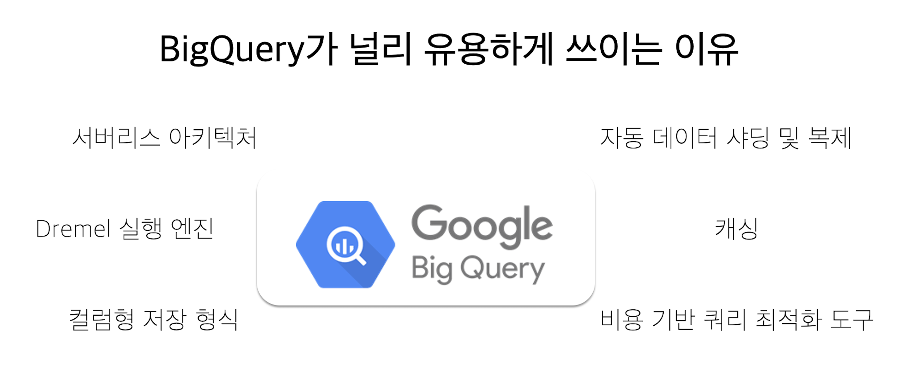

클라우드 서비스에도 ‘치트키’가 있는 것을 아시나요? 데이터웨어하우스, 데이터 레이크 등 엔터프라이즈 데이터 플랫폼을 구축하는 것은 클라우드 환경에서도 쉽지 않은 일입니다. 이 어려운 일을 게임에서 치트키 쓰듯 쉬운 일로 만든 서비스가 있습니다. 바로 구글 클라우드(Google Cloud)의 BigQuery입니다.  

 

## 데이터 생태계라 불러야 할 정도로 성장한 BigQuery 

 

BigQuery를 보통 서버리스 데이터웨어하우스로 알고 있는 분들이 많습니다. 이는 반은 맞고 반은 틀립니다. 이후 진화를 거듭하면서 BigQuery는 구글 클라우드가 제공하는 데이터 관련 서비스 및 도구의 중요 요소가 되었습니다. 이런 이유로 요즘에는 BigQuery를 구글 클라우드가 제공하는 통합된 개방형 지능형 데이터 생태계의 중요 요소라 설명합니다.  

 

BigQuery는 정말 안 끼는 곳이 없습니다. 구글 클라우드 환경에서 데이터로 가는 모든 길목에 BigQuery가 자리잡고 있는 느낌마저 들 정도입니다. BigQuery 진화 과정에서 파생된 서비스들을 정리하면 다음과 같습니다.  

 

- BlgQuery Omni: 여러 클라우드 환경에 파편화되어 있는 데이터의 사일로를 뛰어넘어 BigQuery 단일 콘솔에서 활용할 수 있도록 해주는 서비스 

- BigQuery ML: 표준 SQL 쿼리로 ML 모델 생성과 실행 

- BlgLake: 데이터웨어하우스의 속도와 데이터 레이크의 용량을 모두 지원하는 차세대 데이터 플랫폼 

- BigQuery Migration Service: 쉽고 빠른 데이터 마이그레이션 지원 

- Analytics Hub: 데이터 자산을 효율적이고 안전하게 공유할 수 있는 데이터 공유 및 구독 서비스 

- Log Analytics: Cloud Logging 안의 데이터를 Query 기반으로 빠르게 분석할 수 있는 기능 제공 

- Stream Analytics: Event stream을 실시간으로 수집 및 분석할 수 있는 서비스 

- BI Engine: 지연 걱정 없는 인메모리 SQL 분석 캐시  

- BeyondSQL: 다양한 언어를 지원하는 사용자 지정 함수  

 
 

## BigQuery의 남다른 성능 비결 ‘태생이 우량아’  

 

BigQuery가 널리 유용하게 쓰이는 이유로 성능을 꼽습니다. BigQuery의 남다른 성능은 혁신적인 아키텍처, 구글의 검증을 거친 가속 기술, 구글 클라우드 인프라와 긴밀한 통합 등 여러 이유가 있습니다. 간단히 정리하자면 다음과 같습니다.  

 
- 서버리스 아키텍처: BigQuery는 완전 관리형 서버리스이므로 사용자는 인프라를 관리하거나 확장에 대해 걱정할 필요가 없습니다. 또한, 시스템이 자동으로 확장되어 모든 워크로드를 성능 이슈 없이 원활하게 처리할 수 있습니다. 

- Dremel 실행 엔진: BigQuery는 대규모 데이터 세트를 실시간으로 처리하도록 설계된 매우 효율적인 쿼리 실행 엔진인 Google의 Dremel 기술을 기반으로 구축되었습니다. Dremel은 컬럼형 저장 형식과 트리 아키텍처를 사용하여 쿼리를 병렬화하여 수천 대의 머신에 분산시켜 신속하게 실행합니다. 

- 컬럼형 저장 형식: BigQuery는 데이터를 열 형식으로 저장하여 보다 효율적인 압축과 빠른 데이터 검색을 가능하게 합니다. 데이터를 행 단위가 아닌 열 단위로 저장함으로써, BigQuery는 쿼리에 필요한 열만 읽을 수 있으므로 스토리지에서 읽는 데이터의 양을 줄이고 쿼리 성능을 개선할 수 있습니다. 

- 자동 데이터 샤딩 및 복제: BigQuery는 여러 스토리지 노드에 걸쳐 데이터를 자동으로 샤딩하여 대규모 데이터 세트가 균등하게 분산되도록 합니다. 이 샤딩은 데이터 복제와 결합되어 고가용성, 내결함성, 빠른 쿼리 성능을 보장합니다. 

- 캐싱: BigQuery는 최근 쿼리의 결과를 캐싱하여 반복되거나 유사한 쿼리의 성능을 개선합니다. 이 기능을 통해 사용자는 자주 요청하는 데이터에 더 빠르게 액세스하여 쿼리 실행 시간을 단축할 수 있습니다. 

- 비용 기반 쿼리 최적화 도구: BigQuery의 비용 기반 쿼리 옵티마이저는 쿼리를 분석하여 효율적인 쿼리 실행 계획을 생성합니다. 옵티마이저는 다양한 쿼리 실행 전략을 평가하고 가장 효율적인 전략을 선택함으로써 리소스 사용량을 최소화하면서 쿼리를 최대한 빠르게 실행할 수 있도록 합니다. 

 

구글 클라우드는 집착에 가까울 정도로 BigQuery 성능을 지속해서 개선하고 있습니다. 2023년 3월 기준으로 최근 개선 사항 중 몇 가지 주목할 개선으로 Capacitor의 적응형 사이징으로 소규모 쿼리 성능 향상, 이력 기반 쿼리 최적화로 이전 실행 메트릭 사용, 동적 쿼리 동시성 및 큐잉으로 동시성 제한에 대해 걱정할 필요가 없음, Capacitor 동적 메타데이터는 메타데이터에 빅데이터 기술을 사용하여 쿼리를 가속 등이 눈에 들어오네요.  

 
 

## 성능에 가성비는 덤! 

 

구글 클라우드는 그렇지 않아도 매력적인 서비스인 BigQuery에 가성비를 높이는 방안을 내놓았습니다. 이름하여 BigQuery Editions입니다. 구글 클라우드는 BigQuery 이용 조직의 의견에 귀를 기울이며 상품 이용 조건을 개선합니다. 관련해 최근 공식 발표된 것이 BigQuery Editions입니다. 이게 무엇이냐 하면 워크로드 유형에 맞게 Standard, Enterprise, Enterprise Plus의 세 가지 버전 중 맞는 것을 쓸 수 있는 선택지를 제공하는 것입니다. 버전 선택 후 예약 또는 용량 약정 옵션을 선택하면 최적의 비용으로 BigQuery를 활용할 수 있습니다. 참고로 스탠다드는 일반적인 SQL 분석, 엔터프라이즈는 기업의 LOB(Line of Business) 워크로드, 엔터프라이즈 플러스는 미션크리티컬한 워크로드에 적합하다고 합니다. 각 에디션은 이용할 수 있는 기능에 차이가 좀 있습니다. 비용과 기능에 대한 상세 정보가 필요하시면 <a src="https://cloudmt.co.kr/">클라우드메이트</a>가 도움을 드리겠습니다.  

 

> ## [웨비나] 캐시엔진을 활용하여 빅쿼리(BigQuery) 200% 활용하기   

### 2023년 04월 26일(수) 14:00~15:00 
이번 웨비나를 통해 실시간 데이터 분석의 방법론과 특히 빅쿼리(BigQuery)를 가장 효과적으로 사용하는 방법에 대해 설명해 드리고자 합니다. 특히 다른 실시간 데이터 처리 방법들에 비해서 얼마나 효과가 있는지를 BMT(벤치마킹 테스트)의 구체적인 결과로 공유해 드립니다. 도입 전에 확실한 장단점 분석과 비교가 가능하실 것 같네요. 

  

이런 분들이라면 무조건 사전등록 필수! 

  -  실시간 빅데이터 분석의 트렌드와 방향에 대해서 궁금하신 분 

  -  데이터 처리를 위해 어떤 제품을 선택해야 하는지 고민이신 분 

  -  데이터 분석을 위해 빠른 연산 & 응답이 필요한 개발자 또는 데이터 분석가 

  -  제한된 예산안에서 효율적인 데이터 분석을 원하시는 분 

 

  
다음 포스팅에서는 비용 절감에 도움이 되는 BigQuery Autoscaling에 대해 알아보겠습니다.  