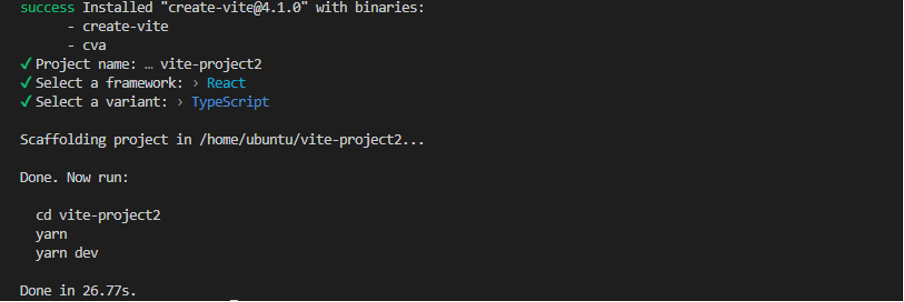
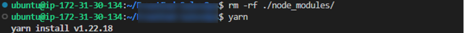
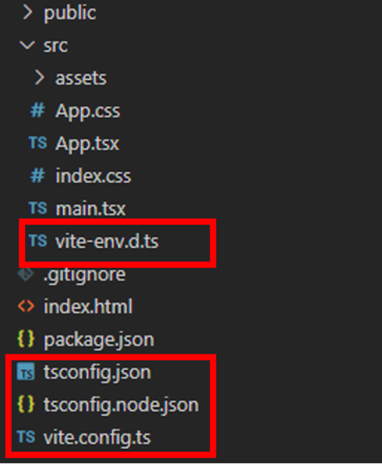
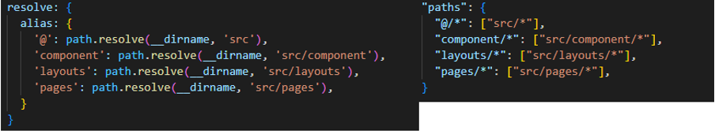
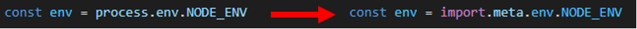
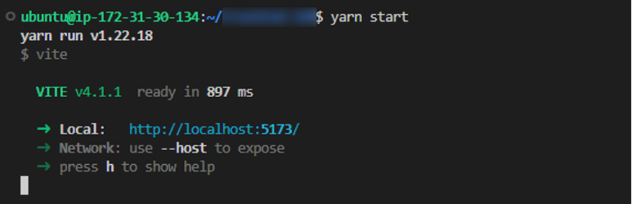
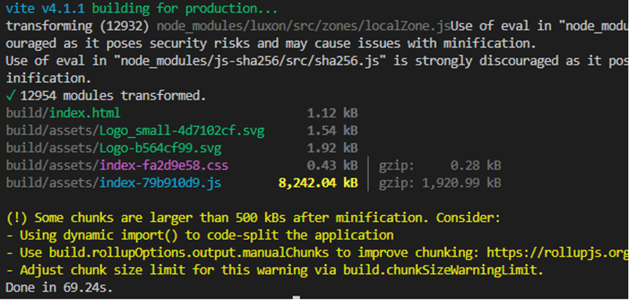

Vite는 Vue.js 팀이 개발한 웹 개발용 빌드 도구로 요즘 인기를 끌고 있습니다. 인기 비결은 뭐니해도 ‘속도’입니다. 개발과 빌드 속도가 매우 빠릅니다. Vite가 빠른 이유와 Create-React-App(CRA)으로 개발, 운영하고 있던 기존 사내 프로젝트의 번들러를 Webpack에서 Vite로 마이그레이션 하는 과정 및 트러블슈팅 방법을 알아보겠습니다.

## Vite가 빠른 이유

Vite가 빠른 이유는 크게 두 가지 측면에서 살펴볼 수 있습니다. 

- 개발 서버: Webpack의 번들 기반 개발 서버는 소스 코드와 모든 종속 관계의 모듈을 번들링 후 서버가 준비됩니다. 반면에 Vite는 극단적으로 빠른 Esbuild로 미리 번들링 한 모듈을 필요시 동적으로 가져오므로 명령 시 즉각적으로 서버가 구동됩니다.  
- 프로덕션 빌드: 프로덕션 빌드에 필요한 기능이 미비한 Esbuild 대신 사용한 Rollup은 각 모듈을 개별적인 범위의 함수로 맵핑하여 결합하는 Webpack 방식과 달리 하나의 파일에 모든 종속 모듈을 전역 범위로 선언해 결합합니다. 따라서 중복제거 및 가볍고 빠른 빌드 결과를 냅니다.  

## Webpack에서 Vite로의 마이그레이션 과정

Vite의 설정 파일들을 옮겨오기 위해 빈 Vite 프로젝트를 생성합니다. 참고로 Vite는 14.18 또는 16 이상의 Node.js를 요구합니다.

### $ yarn create vite



프롬프트에 출력된 메시지를 따라 동일한 구성의 템플릿으로 프로젝트를 생성합니다. 여기서는 React와 TypeScript 템플릿으로 생성하였습니다.

### package.json 복사

```json
// package.json (vite 프로젝트)

{
  "name": "vite-project2",
  "private": true,
  "version": "0.0.0",
  "type": "module",
  "scripts": {
    "dev": "vite",                   <- "start"로 복사
    "build": "tsc && vite build",   <- 복사
    "preview": "vite preview"       <- 복사
  },
  "dependencies": {
    "react": "^18.2.0",
    "react-dom": "^18.2.0"
  },
  "devDependencies": {
    "@types/react": "^18.0.27",
    "@types/react-dom": "^18.0.10",
    "@vitejs/plugin-react": "^3.1.0", <- 복사
    "typescript": "^4.9.3",
    "vite": "^4.1.0"                  <- 복사
  }
}
```

생성된 빈 Vite 프로젝트 package.json 파일의 Script 명령줄과 devDependencies의 Vite 관련 내용을 마이그레이션 할 기존 프로젝트 package.json으로 복사합니다.  
여기서는 기존 프로젝트에 맞춰 스크립트 `dev`가 아닌 `start`에 `vite` 명령줄을 주었습니다.

### 모듈 재설치

기존 프로젝트의 node_modules 디렉토리 제거 후 재설치 합니다.
 


### 설정 파일 복사



아래 주의 사항을 참고하여 Vite 프로젝트에서 위의 파일을 복사해옵니다.

- `tsconfig.json`: 기존 프로젝트에서 추가했던 `compilerOptions`이 있다면 복사해온 `tsconfig.json`에도 추가합니다.
- `src/vite-env.d.ts`: 기존 프로젝트의 `src/react-app-env.d.ts` 파일에 추가한 내용이 있다면 `src/vite-env.d.ts`에도 추가합니다. 기존 프로젝트의 `src/react-app-env.d.ts` 파일은 제거합니다.

### public/index.html 이동

기존 프로젝트의 `public/index.html`을 루트 디렉토리로 이동 후 `<body>`에 아래 내용을 추가합니다.

```html
// index.html

<!DOCTYPE html>
<html lang="ko">

<head>
  ...
</head>

<body>
  <noscript>You need to enable JavaScript to run this app.</noscript>
  <div id="root"></div>
  <script type="module" src="/src/index.tsx"></script>	<- 추가
</body>

</html>
```

src에 해당하는 부분은 각자의 엔트리 파일을 적어줍니다. CRA에서는 기본적으로 `src/index.tsx`를 사용합니다.

기본적인 설정은 여기까지 이고, 기존 프로젝트에 추가적으로 구성된 환경으로 인해 발생한 여러 문제들은 아래의 트러블 슈팅 단락에서 다룹니다.

## 트러블 슈팅

### 1. 절대경로 사용

<strong style="color: red">Failed to resolve import "xxx" from "yyy". Does the file exist?</strong>

절대경로 사용으로 인해 파일을 찾을 수 없어, Vite에서 절대경로 사용을 위하여 아래 두 파일을 수정하였습니다.

```ts
// vite.config.ts

import { defineConfig } from 'vite'
import react from '@vitejs/plugin-react'
import path from 'path'                     <- 추가

// https://vitejs.dev/config/
export default defineConfig({
  plugins: [react()],
  resolve: {
    alias: {
      '@': path.resolve(__dirname, 'src'),  <- 추가
    }
  }
})
```

```json
// tsconfig.json

{
"compilerOptions": {
    ...
    "baseUrl": ".",       <- 추가
    "paths": {
      "@/*": ["src/*"],   <- 추가
    }
  },
}
```

src 디렉토리 alias를 @로 설정하여 소스 코드에서 `@/components/xxx`와 같이 절대경로 사용이 가능합니다. 하지만 `components/xxx` 형식으로 사용하기 위하여 아래와 같이 디렉토리 별로 모두 alias를 추가해야 합니다.



### 2. SVG를 ReactComponent로 사용

다음은 .svg 파일을 ReactComponent로 사용하여 발생한 에러 메시지입니다. `vite-plugin-svgr` 플러그인 사용으로 해결 가능하였습니다.

```
Uncaught SyntaxError: The requested module 'xxx' does not provide an export named 'ReactComponent'
```

모듈 설치: `$ yarn add -D vite-plugin-svgr`

```ts
// vite.config.ts

import { defineConfig } from 'vite'
import react from '@vitejs/plugin-react'
import path from 'path'
import svgr from 'vite-plugin-svgr'     <- 추가

// https://vitejs.dev/config/
export default defineConfig({
  plugins: [
    react(),
    svgr(),           <- 추가
  ],
  ...
})
```

```ts
// src/vite-env.d.ts

/// <reference types="vite/client" />
/// <reference types="vite-plugin-svgr/client" />  <- 추가

declare namespace NodeJS {
  interface ProcessEnv {
    NODE_ENV: 'development' | 'production';
    VITE_ENV: string;
    VITE_KEYCLOAK_URL: string;
    VITE_KEYCLOAK_REALM: string;
    VITE_KEYCLOAK_CLIENT_ID: string;
    VITE_API_URL: string;
  }
}
```

### 3. 환경변수 사용

다음은 기존 프로젝트에서 `process.env` 객체로 환경변수를 사용하여 발생한 에러 메시지입니다. 

```
Uncaught ReferenceError: process is not defined
```

Vite에서 접근 가능한 환경 변수는 접두사 `VITE_`를 붙입니다. 또한, `import.meta.env` 객체를 이용해 접근할 수 있도록 합니다.  
그러므로 .env 파일 등에서 `REACT_APP_`으로 시작하는 환경변수를 설정하였거나, 소스 코드에서 `process.env` 객체를 사용하여 환경변수를 사용하였다면 아래와 같이 변경해야 합니다.

#### 환경변수 정의


 
#### 환경변수 사용
 


리눅스 환경에서는 `grep`, `find`를 활용하여 편하게 치환할 수 있습니다.

```
$ grep -r ‘REACT_APP_’ ./src	// src에서 ‘REACT_APP_’ 찾기
$ find ./src -exec perl -pi -e 's/REACT_APP_/VITE_/g' {} \;	// `REACT_APP_`을 `VITE_`로 치환
```

### 4. 일부 모듈 호환성 문제

프로덕션 빌드 과정에서 일부 모듈이 누락되어 빌드가 되었습니다. 프로젝트에서 사용하는 모듈 내에서 아무것도 가져오지 않고 side effect만을 위해 import하는 아래와 같은 ‘side effect import’가 문제였습니다. 

```ts
import './some_module_file'
```

이런 import는 번들링 과정에서 의존성이 없는 모듈로 판단해 포함시키지 않은 것으로 보입니다. 현재 해결 방법은 `resolve.alias` 설정으로 누락되는 모듈에 의존성을 걸어 주거나 빌드 옵션으로 TreeShaking 기능을 비활성화 해야 합니다.

#### resolve.alias 사용

```ts
// vite.config.ts

export default defineConfig({
  ...
  resolve: {
    alias: {
      "devextreme/ui": 'devextreme/esm/ui',   <- 예시 모듈
      ...
    }
  }
})
```

#### TreeShaking 비활성화

```ts
// vite.config.ts

export default defineConfig({
  ...
  build: {
    rollupOptions: {
      treeshake: false
    }
  },
  ...
})
```

둘 중 한가지 방법으로 어떻게 든 누락된 모듈을 빌드에 포함시켜 주어야 합니다. TreeShaking 비활성은 빌드 결과에 불필요한 모듈들을 모두 포함시켜 용량이 대폭 늘어나기 때문에 여기서는 resolve.alias 사용으로 해결하였습니다.

## 결과

### 개발 서버 구동


 
수십 초 이상 걸리던 개발 서버 구동이 0.897초로 단축됨을 확인할 수 있습니다. 

### 프로덕션 빌드


 
평균 200초가량 소요되던 빌드 작업도 69초로 단축되었습니다.

총 3개의 Webpack 프로젝트를 Vite로 마이그레이션한 결과 빌드 시간이 규모에 따라 평균적으로 50~70%가량 감소하였습니다.

살펴본 바와 같이 Vite를 이용하면 더욱 빠르고 효율적인 웹 애플리케이션 개발이 가능합니다. 대규모 프로젝트에서도 빌드 속도를 개선할 수 있으니 관심 있는 분들은 한번 써보는 것을 추천합니다.

### References

- https://vitejs-kr.github.io/guide/why.html
- https://vitejs.dev/config/#resolve-alias
- https://supportcenter.devexpress.com/ticket/details/t1054272/vue3-react-vite-rollup-devextreme-fails-in-production-because-some-modules-do-not-pass

