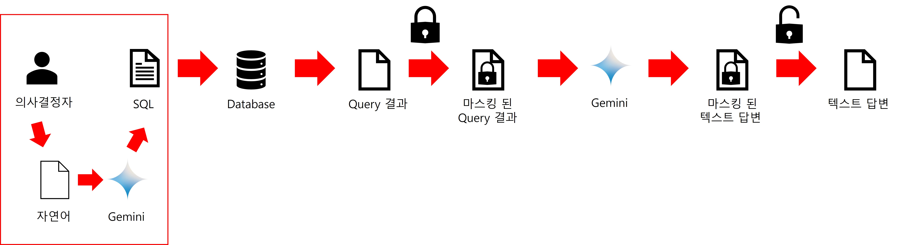

바로 데모를 실행해보고 싶으신 분은  <a href="https://colab.research.google.com/drive/12AvHi10g4krezB3zNzW0S7D5HpKaMjTk"></a> 이쪽으로 들어가시면 됩니다.

# 들어가며 
기업 내부의 데이터를 LLM에게 전송하지 않고도 클라우드 LLM의 파워를 최대한 사용하는 방법이 있을까요?

클라우드메이트에서는 이를 위해 기본적으로 `NL2SQL`기법과 함께, 나아가 프롬프트를 통해 데이터를 은닉하는 `masked data prompting`기법을 제안합니다.

# 데이터 보안 정책

많은 기업에서는 정보보안을 위해 내부 데이터가 네트워크를 통해 밖으로 나가는 것을 정책적으로 철저히 막고 있습니다. 

일부 조직은 해당 데이터 거버너스에 대해 자유롭거나 정책조정이 가능하지만 특정 조직은 매우 민감한 데이터를 다루고 있어 이러한 점에 있어서 조심스럽습니다.

하지만 이러한 데이터 보안 정책에 묶여있는 조직도 Azure의 OpenAI GPT나 GCP의 Gemini, Anthopic(AWS)의 Claude 등의 클라우드 LLM(Large Language Model: 초거대언어모델)을 사용하고 싶어합니다.


그래서 이들에게 필요한 것은 내부의 데이터를 내보내지 않더라도 최대한 클라우드 LLM의 파워를 사용하도록 하는 것입니다.

# 정책 안에서 클라우드 LLM 사용하기

기업차원에서 LLM을 사용하는 가장 대표적인 방법이면서 수요가 가장 높은 방식은 기업 자체의 데이터와 LLM을 결합하는 방식입니다. 하지만 기업 내부의 그 어떤 데이터도 LLM으로 보낼 수 없다면 방법이 없을까요?

사실 이를 우회하거나 해결할 수 있는 방법은 있습니다. 다음과 같은 방법들이죠
- Open source LLM을 On-premise에서 가동
- NL2SQL
- masked data prompting

Open source LLM는 추후에 이야기하도록 하고 이번 시간에는 `NL2SQL`과 클라우드메이트의 `masked data prompting`을 위주로 이야기하려 합니다.

## NL2SQL

자연어를 SQL문으로 바꾸는 개념인 NL2SQL은 본래 데이터 정책을 위해 만들어진 개념은 아니었습니다. 

LLM이 등장하기 전부터 자연어를 통해 프로그래밍 언어 코드를 작성하려는 시도와 함꼐 프로그래밍과 SQL작성의 편의를 위해 연구되었습니다.

그리고 GPT, Claude, Gemini 등의 클라우드 LLM이 등장하면서 이러한 시도는 프롬프트 엔지니어링 레벨로 넘어가 좀 더 좋은 결과를 얻을 수 있었습니다.

### 기존의 SQL작성 방식
의사결정을 위해 데이터를 조회할 때, 기존의 방식은 개발자나 DB관련 엔지니어가 SQL을 작성하고 그 결과를 주는 방식이었습니다.


### LLM을 이용한 SQL작성 방식
기존의 방식은 데이터 모델과 SQL을 잘 이해하는 사람만이 작성하여 데이터를 조회할 수 있었습니다.
히자만 실제 데이터를 조회하는 사람은 이러한 개발자나 엔지니어가 아닐 수 있습니다. 

이러한 사람들을 위해 LLM으로 자연어 형태의 질의를 하면 LLM이 SQL로 변환하여 데이터를 조회하는 방식을 사용할 수 있습니다.


### 데이터 정책과 NL2SQL
그렇다면 이러한 ML2SQL로 어떻게 데이터 보안 정책상에서 클라우드 LLM과 기업 데부 데이터를 결합할 수 있다는 것일까요?

기업마다 데이터 거버넌스가 다르겠지만 일반적으로 기업 데이터 자체의 유출은 철저하게 막습니다. 하지만 데이터 자체가 아닌 데이터 스키마가 외부로 나가는 것은 부분적으로 혀용하고 있는 곳이 많습니다. 


이렇게 데이터 스키마를 전송하고 SQL을 받게 되면 그 이후에는 해당 SQL로 데이터를 조회만 하면 되는 것입니다. 이렇게 되면 클라우드 LLM이 직접적으로 내부 데이터를 받지 않더라도 처리가 가능합니다.

### NL2SQL 데모
여러분의 이해를 돕기 위해 <a href="https://colab.research.google.com/drive/12AvHi10g4krezB3zNzW0S7D5HpKaMjTk"></a>에서 데모를 제공하고 있습니다.

#### 데이터 준비
데이터는 [국토교통부 실거래가 공개시스템](https://rt.molit.go.kr/pt/xls/xls.do?mobileAt=)의 2024년 3월 한달간의 아파트 매매 데이터를 이용하였습니다.


이 데이터를 편의상 sqlite3에 저장하고 쿼리하는 예제로 준비했습니다.


#### 프롬프트
자연어를 SQL로 변환하기 위해서는 해당 task를 수행하도록 프롬프트로 LLM에 전달해야 합니다. 

프롬프트에 들어갈 사항은 다음과 같습니다.

- role : LLM에게 역할을 부여해서 해당 task를 잘 수행하도록 지시합니다.
- context : 도메인에 대한 특수한 정보나 작업 방식들을 알려줘야 합니다.
- schemas : SQL을 만들기 위한 DB table의 정보를 제공해줘야 합니다.
- step : CoT(Chain of Thought)를 위해 LLM이 수행해야 하는 생각(작업)을 단계적으로 명시할 수 있습니다.
- output : LLM이 응답할 데이터 포멧이나 언어를 지시할 수 있습니다.
- instruction : 실제로 LLM이 어떤 명령을 수행해야 하는지 지시합니다.
- example : 질의와 LLM 답변에 대한 예시를 제공합니다.

아래는 역할부여, single-turn CoT, few-shot등의 기법이 적용된 NL2SQL의 프롬프트입니다.
```prompt
[ROLE]
You are the world's best database engineer and sqlite expert.

[CONTEXT]
You have actual apartment price data.
Based on this data, we can provide tailored answers to user questions.
In order to write SQL in SQLite3, you must refer to [SCHEMAS] and process it according to the processing order defined in [STEP].
'평' calculates the square meter area divided by 3.3.

[SCHEMAS]
{schemas}

[STEP]
1. keywords: Extract key keywords from user queries.
2. columns: Refer to [SCHEMA] and extract the column names corresponding to the main keywords extracted in 1. At this time, the column name must be extracted as {{{{table_name}}}}.{{{{column_name}}}} and must be a column name that exists in the table.
3. tables: Refer to 1 and 2 to extract the required tables.
4. conditions: Write conditions to answer the question. If not found, null is output.
5. group: Write data grouping column and column aggregration. If not found, null is output.
6. order_by: Write conditions for data output order. If not found, null is output.
7. prepared_sql: Write SQL for sqlite based on items 1 to 6.

[OUTPUT]
The output format is as follows:
{{
    "keywords" : {{{{keywords:list(str)}}}},
    "columns" : {{{{columns:list(str)}}}},
    "tables" : {{{{tables:list(str)}}}},
    "conditions" : {{{{conditions:list(str) | null}}}},
    "group" : {{{{ {{
        "group_by" : {{{{group_by_columns:list(str)}}}},
        "aggregations" : {{
            {{{{column1}}}} : {{{{operations1}}}},
            {{{{column2}}}} : {{{{operations2}}}}
        }}
    }} | null}}}},
    "order_by" : {{
        {{{{column1}}}} : {{{{ ASC | DESC }}}},
        {{{{column2}}}} : {{{{ ASC | DESC }}}}
    }},
    "prepared_sql" : {{{{prepared_sql}}}}
}}

[INSTRUCTION]
Refer to [SCHEMA] and create sql statements that can answer the following user questions in the manner described in [CONTEXT].
---
question : 지역별 거래금액 평균을 알려줘
answer : {{
    "keywords" : ["지역별","거래금액", "평균"],
    "columns" : ["real_transaction.시군구","real_transaction.거래금액_만원"],
    "tables" : ["real_transaction"],
    "conditions" : null,
    "group" : {{
        "group_by" : ["시군구"],
        "aggregations" : {{
            "거래금액_만원" : "AVG"
        }}
    }},
    "order_by" : null,
    "prepared_sql" : "SELECT 시군구,AVG(거래금액_만원) AS 평균_거래금액 FROM real_transaction GROUP BY 시군구"
}}
---
question : 서울특별시 강남구 대치동의 평당 가격 평균이 가장 높은 아파트 5건을 보여줘
answer : {{
    "keywords" : ["서울특별시 강남구 대치동","평당", "가격", "평균", "가장 높은", "아파트", "5건"],
    "columns" : ["real_transaction.시군구","real_transaction.전용면적_m2","real_transaction.거래금액_만원","real_transaction.단지명"],
    "tables" : ["real_transaction"],
    "conditions" : "시군구 is 서울특별시 강남구 대치동",
    "group" : {{
        "group_by" : ["단지명"],
        "aggregations" : {{
            "거래금액/(전용면적_m2/3.3)" : "AVG"
        }}
    }},
    "order_by" : {{
        "AVG(거래금액/(전용면적_m2/3.3))" : "DESC"
    }},
    "prepared_sql" : "SELECT 단지명, AVG(거래금액_만원/(전용면적_m2/3.3)) AS 평균_평당거래금액_만원 FROM real_transaction WHERE 시군구 = '서울특별시 강남구 대치동'  GROUP BY 단지명 ORDER BY  평균_평당거래금액_만원 DESC"
}}
---
question : {user_question}
answer :
```

위 프롬프트는 헨즈온 데모를 위한 간단한 형태의 NL2SQL 프롬프트입니다.
실제 기업 데이터와 결합하기 위해서는 몇가지 추가적인 기법들을 더 사용해야 합니다.

#### LLM 답변
헨즈온 데모에서는
> 서울특별시 성동구 옥수동에서 가장 비싸게 거래되는 아파트 상위 3개를 알려줘

라는 질의를 해보았습니다. (질의는 다른 것으로 변경이 가능합니다.)

그 결과 LLM의 답변은 다음과 같이 나오게 됩니다.
```json
{
    "keywords" : ["서울특별시 성동구 옥수동","가장 비싸게 거래되는", "아파트", "상위 3개"],
    "columns" : ["real_transaction.단지명","real_transaction.거래금액_만원"],
    "tables" : ["real_transaction"],
    "conditions" : '시군구 = "서울특별시 성동구 옥수동"',
    "group" : null,
    "order_by" : {
        "거래금액_만원" : "DESC"
    },
    "prepared_sql" : 'SELECT 단지명,거래금액_만원 FROM real_transaction WHERE 시군구 = "서울특별시 성동구 옥수동" ORDER BY 거래금액_만원 DESC LIMIT 3'
}
```
여기서 sql만 추출하면 `SELECT 단지명,거래금액_만원 FROM real_transaction WHERE 시군구 = "서울특별시 성동구 옥수동" ORDER BY 거래금액_만원 DESC LIMIT 3`가 되고 이를 sqlite3에 넣어서 데이터를 조회하면 다음과 같은 결과를 얻을 수 있습니다.
|단지명|거래금액_만원|
|---|---|
|옥수하이츠|191000|
|옥수파크힐스101동~116동|180000|
|옥수파크힐스101동~116동|173000|

## masked data prompting
이렇게 쿼리 결과를 얻고 나면 다 되었다고 생각할 수 있겠지만, 아직 한가지 문제가 남아있습니다. 

일반적으로 쳇봇의 UX는 텍스트 형태로 응답을 받길 기대합니다. 그래서 일반적으로는 이렇게 조회된 데이터를 LLM으로 전송하여 정제된 택스트 형태로 응답을 받습니다.


하지만 이렇게 되는 경우, 내부 데이터가 외부로 나가면 안된다는 데이터 정책을 위반하게 됩니다.

그래서 저희는 별도로 데이터를 은닉한 후 전달하고 데이터가 은닉된 답변을 원 데이터로 바꾸는 과정이 추가로 필요합니다.


### 데이터 마스킹

쿼리 결과는 다음과 같이 `[[hidden_value_{{row}}_{{col}}]]`의 규칙에 따라 LLM이 실제 데이터를 알지 못하도록 은닉화를 합니다.

### 프롬프트
프롬프트의 컨텍스트와 지시 사항을 짧게 정리하면 다음과 같습니다.
- `[[hidden_value_{{row}}_{{col}}]]`로 되어있는 것은 실제데이터를 은닉화한 것이다.
- `[[hidden_value_{{row}}_{{col}}]]`으로 처리된 데이터는 임의로 값을 대입하지 말고 그대로 `[[hidden_value_{{row}}_{{col}}]]`로 출력한다.
- 출력 언어는 한국어이고 포멧은 markdown 형태로 출력한다.

### 데이터 마스킹된 응답 복원
해당 프롬프트로 마스킹된 쿼리 결과를 LLM으로 전송할 경우 다음과 같은 데이터가 마스킹된 응답을 얻을 수 있습니다.
> 서울특별시 성동구 옥수동에서 가장 비싸게 거래되는 아파트 상위 3개는 다음과 같습니다.\n1. 1위는 \[[hidden_value_1_단지명]]으로 거래금액은 \[[hidden_value_1_거래금액_만원]]만원입니다.\n2. 2위는 \[[hidden_value_2_단지명]]으로 거래금액은 \[[hidden_value_2_거래금액_만원]]만원입니다.\n3. 3위는 \[[hidden_value_3_단지명]]으로 거래금액은 \[[hidden_value_3_거래금액_만원]]만원입니다.

이러한 응답의 마스킹되어있는 영역에 실제 값을 대입하면 다음과 같은 실제 데이터가 반영된 LLM의 응답을 얻을 수 있습니다.
> 서울특별시 성동구 옥수동에서 가장 비싸게 거래되는 아파트 상위 3개는 다음과 같습니다.\n1. 1위는 옥수하이츠으로 거래금액은 191000만원입니다.\n2. 2위는 옥수파크힐스101동~116동으로 거래금액은 180000만원입니다.\n3. 3위는 옥수파크힐스101동~116동으로 거래금액은 173000만원입니다.

### masked data prompting 데모

#### 데이터 마스킹
데이터를 `[[hidden_value_{{row}}_{{col}}]]`로 마스킹 하기 위해 다음과 같은 함수를 사용합니다.
```python
def mask_query_result(query_result):
    # 이 함수는 쿼리 결과를 LLM에게 전달하지 않기 위해 값을 hidden_value_{{row}}_{{col}}으로 마스킹합니다.
    return [{ col : f"[[hidden_value_{i+1}_{col}]]"  for j, col in enumerate(row)} for i, row in enumerate(query_result)]
```
이 함수를 호출하여 실제 데이터를 마스킹하면 다음과 같은 결과를 얻을 수 있습니다.
```python
# 쿼리 결과를 gemini에게 전달하지 않기 위해 hidden_value로 마스킹처리를 합니다.
hidden_query_result = mask_query_result(query_result)
```
```json
[{'단지명': '[[hidden_value_1_단지명]]', '거래금액_만원': '[[hidden_value_1_거래금액_만원]]'},
 {'단지명': '[[hidden_value_2_단지명]]', '거래금액_만원': '[[hidden_value_2_거래금액_만원]]'},
 {'단지명': '[[hidden_value_3_단지명]]', '거래금액_만원': '[[hidden_value_3_거래금액_만원]]'}]
```
#### 프롬프트
마스킹된 데이터를 받아 마스킹된 응답을 얻기 위해서는 해당 task를 수행하도록 프롬프트로 LLM에 전달해야 합니다. 

프롬프트에 들어갈 사항은 다음과 같습니다.
- SQL : 이 데이터를 얻기 위한 sql 정보를 제공합니다.
- masked_data : 실제 조회된 데이터를 마스킹한 결과를 제공합니다.
- context : `[[hidden_value_{{row}}_{{col}}]]`의 의미와 그대로 은닉화된 응답을 해야 한다는 정보를 제공합니다.
- output : 마크다운 포멧으로 한국어로 응답해야 한다고 지시합니다.
- instruction : 마스크된 데이터를 바탕으로 LLM이 응답을 하도록 지시합니다.
- example : 질의와 데이터 마스킹된 LLM 답변에 대한 예시를 제공합니다.

아래는  masked data prompting, few-shot등의 기법이 적용된 프롬프트입니다.
```prompt
[SQL]
{gemini_sql}

[DATA]
{hidden_query_result}

[CONTEXT]
You created the following [SQL] to query the data in sqlite3:
[DATA] above is a query result whose value is [[hidden_value_{{{{row}}}}_{{{{col}}}}]] to hide the actual data.
Therefore, when responding, the value set as [[hidden_value_{{{{row}}}}_{{{{col}}}}]] must be responded as [[hidden_value_{{{{row}}}}_{{{{col}}}}]].

[OUTPUT]
language : korean
format : markdown

[INSTRUCTION]
Please refer to [DATA] above and respond to the user's questions below.
---
question : 지역별 거래금액 평균 중 가장 높은 3곳을 알려줘
answer : 지역별 거래금액 평균이 가장 높은 곳 3곳은
1. 1위는  [[hidden_value_1_시군구]]으로 평균거래가는 [[hidden_value_0_평균_거래금액_만원]]만원입니다.
2. 2위는  [[hidden_value_1_시군구]]으로 평균거래가는 [[hidden_value_1_평균_거래금액_만원]]만원입니다.
2. 3위는  [[hidden_value_2_시군구]]으로 평균거래가는 [[hidden_value_2_평균_거래금액_만원]]만원입니다.
---
question : 평당 가격이 가장 높게 거래된 아파트는 어디야?
answer : 평당 가격이 가장 높게 거래된 아파트는 [[hidden_value_1_시군구]]에 있는 [[hidden_value_1_단지명]]로 전용면적은 [[hidden_value_1_전용면적_m2]]이고 거래가는 [[hidden_value_1_거래금액_만원]], 평당 거래금액은  [[hidden_value_1_평당거래금액_만원]]에 거래되었습니다.
---
question : {user_question}
answer :
```

#### LLM 답변
헨즈온 데모에서는
> 서울특별시 성동구 옥수동에서 가장 비싸게 거래되는 아파트 상위 3개를 알려줘

라는 질의를 해보았습니다. (질의는 다른 것으로 변경이 가능합니다.)
그리고 같이 들어간 데이터는 다음과 같습니다.
|단지명|거래금액_만원|
|---|---|
|\[\[hidden_value_1_단지명]]|\[\[hidden_value_1_거래금액_만원]]|
|\[\[hidden_value_2_단지명]]|\[\[hidden_value_2_거래금액_만원]]|
|\[\[hidden_value_3_단지명]]|\[\[hidden_value_3_거래금액_만원]]|

그 결과 LLM의 답변은 다음과 같이 나오게 됩니다.
> 서울특별시 성동구 옥수동에서 가장 비싸게 거래되는 아파트 상위 3개는 다음과 같습니다.\n1. 1위는 \[[hidden_value_1_단지명]]으로 거래금액은 \[[hidden_value_1_거래금액_만원]]만원입니다.\n2. 2위는 \[[hidden_value_2_단지명]]으로 거래금액은 \[[hidden_value_2_거래금액_만원]]만원입니다.\n3. 3위는 \[[hidden_value_3_단지명]]으로 거래금액은 \[[hidden_value_3_거래금액_만원]]만원입니다.

#### 데이터 마스킹된 응답 복원
`[[hidden_value_{{row}}_{{col}}]]`로 마스킹된 부분을 다시 실 데이터로 치환하기 위해 다음과 같은 포멧팅함수를 사용합니다. 
```python
def format_hidden_value(message:str, real_values:list[dict]) -> str:
    # 마스킹 되어있는 LLM의 값을 실제 값으로 포멧팅하는 함수입니다.
    for i, real_value in enumerate(real_values):
        for key, value in real_value.items():
            message = message.replace(f"[[hidden_value_{i+1}_{key}]]", f"{value}")
    return message
``` 

이 함수를 호출하여 마스킹되어 있는 부분을 실제 데이터로 포멧팅하면 다음과 같은 결과를 얻을 수 있습니다.
```python
# 마스킹 처리 되어있는 LLM의 응답을 실제 데이터로 치환
real_response = format_hidden_value(response.text, query_result)
```
```markdown
서울특별시 성동구 옥수동에서 가장 비싸게 거래되는 아파트 상위 3개는 다음과 같습니다.\n1. 1위는 옥수하이츠으로 거래금액은 191000만원입니다.\n2. 2위는 옥수파크힐스101동~116동으로 거래금액은 180000만원입니다.\n3. 3위는 옥수파크힐스101동~116동으로 거래금액은 173000만원입니다.
```

# 나가며
기업 내부의 민감한 데이터를 외부로 나가지 않게 정책적으로 막는 것은 매우 중요한 일압니다. 

하지만 이 정책으로 인하여 Google Gemini와 같은 클라우드 LLM을 제대로 사용하지 못하고 내부 데이터와 결합하지 못한다면 클라우드 LLM을 사용하는 의미가 없을 것입니다.

저희 클라우드메이트는 고객사의 내부데이터를 지키면서도 클라우드 LLM의 성능을 최대한 이끌어내는 여러가지 기법들을 만들고 사용하고 있습니다.

클라우드메이트는 데이터 보안과 클라우드 LLM와의 결합 이 두마리 토끼를 모두 잡고 있습니다.

또한 클라우드 LLM 도입을 위한 컨설팅, 아키텍처 설계 등의 기술지원에 있어서 지속적으로 역량을 강화하고 있습니다.

비즈니스에 클라우드 LLM을 도입하는데 문의가 있으시면 언제든 연락주시기 바랍니다.
문의 : https://www.cloudmt.co.kr/contact

저희 클라우드메이트는 고객님의 LLM을 통한 생산성 혁신에 함께하겠습니다.