최근 통합 클라우드 빌링 서비스인 mateBilling 에서 사용하는 SOAP API 기반 카드결제 API 서버를 RESTful API 서버로 다시 개발하는 작업을 하고 있습니다.
그러면서 컨테이너화 하는 작업도 같이 진행했는데, Windows Container 를 이용해서 컨테이너화를 시도했습니다. 그 경험에 대해서 글로 정리해 공유해 보고자 합니다.

# 고려사항
결제 API 앱은 .Net(C#) 으로 작성되어 있고, API 호출이 들어오면 PG사에서 제공한 결제 클라이언트 라이브러리를 참조하여 호출하고, 그 결과를 다시 전달해 주는 방식으로 구성되어 있습니다. 
PG사에서 제공한 결제 클라이언트 라이브러리가 `*.dll` 확장자의 COM 라이브러리 형식으로 되어있는데, 때문에 아래와 같은 사항을 고려해야 했습니다.

- 빌드 및 빌드된 앱 실행 전 `regsvr32.exe` 명령으로 COM 라이브러리를 시스템에 등록해야 합니다. (컨테이너화 하는 경우 Windows Container 에서만 가능)
- .Net CLI 는 COM 라이브러리 참조가 있는 앱을 빌드하지 못하기 때문에, MSBuild 를 사용하여 빌드해야 합니다.

## 컨테이너에서의 MSBuild 사용
먼저 .Net CLI 로 빌드하지 못하는 점이 고려할 점 입니다. COM 라이브러리를 참조하는 프로젝트를 아래와 같이 .Net CLI 의 `dotnet build` 로 빌드를 실행하면 아래와 같은 오류가 발생합니다.

```powershell
❯ dotnet build
.NET용 Microsoft (R) Build Engine 버전 16.9.0+57a23d249
Copyright (C) Microsoft Corporation. All rights reserved.

  복원할 프로젝트를 확인하는 중...
  복원할 모든 프로젝트가 최신 상태입니다.
C:\Program Files\dotnet\sdk\5.0.201\Microsoft.Common.CurrentVersion.targets(2805,5): error : MSB4803: "ResolveComReference" 작업은 MSBuild의 .NET Core 버전에서 지원되지 않습니다. MSBuild의 .NET Framework 버전을 사용하세요.  자세한 내용은 https://aka.ms/msbuild/MSB4803을 참조하세요. [C:\Users\YoungbinHan\Documents\WorkProjects\MatePayApiService\MatePayApiService\MatePayApiService.csproj]

빌드하지 못했습니다.

C:\Program Files\dotnet\sdk\5.0.201\Microsoft.Common.CurrentVersion.targets(2805,5): error : MSB4803: "ResolveComReference" 작업은 MSBuild의 .NET Core 버전에서 지원되지 않습니다. MSBuild의 .NET Framework 버전을 사용하세요.  자세한 내용은 https://aka.ms/msbuild/MSB4803을 참조하세요. [C:\Users\YoungbinHan\Documents\WorkProjects\MatePayApiService\MatePayApiService\MatePayApiService.csproj]
    경고 0개
    오류 1개

경과 시간: 00:00:02.28
```
> MSB4803: "ResolveComReference" 작업은 MSBuild의 .NET Core 버전에서 지원되지 않습니다. MSBuild의 .NET Framework 버전을 사용하세요.  자세한 내용은 https://aka.ms/msbuild/MSB4803을 참조하세요.

때문에 GUI 환경에서 수동으로 빌드 하는 경우, 간단히 해당 프로젝트를 Visual Studio (Visual Studio Code 가 아닙니다.)에서 열어 빌드를 진행하면 됩니다.
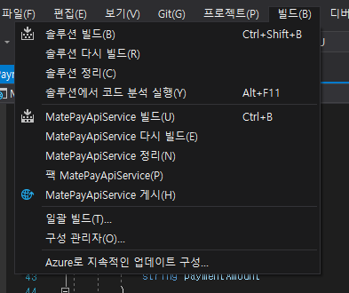

Dockerfile을 작성해서 컨테이너화 할 때도 같은 방식으로 해야 할 텐데, 컨테이너 이미지 빌드는 CLI 환경에서만 진행하기 때문에 방금처럼 Visual Studio 를 GUI 로 열어서 마우스로 `솔루션 빌드` 를 클릭하도록 Dockerfile 에서 지정 할 수는 없습니다. 대신 Visual Studio Build Tools 설치 프로그램을 명령 행으로 실행하여 빌드 도구를 설치하고, Developer Command Prompt for Visual Studio (또는 Developer PowerShell for Visual Studio) 에서 사용 가능한 `MSBuild.exe` 를 통해 빌드해야 합니다.

컨테이너 빌드 과정에서 이러한 환경이 필요한 경우, Microsoft 에서 제공하는 [컨테이너에 Visual Studio Build Tools 설치 가이드](https://docs.microsoft.com/ko-kr/visualstudio/install/build-tools-container?view=vs-2019) 문서를 참고하여, .Net 앱 빌드 전 필요한 도구를 먼저 설치하도록 Dockerfile을 작성할 수 있습니다.

## 베이스 컨테이너 이미지
두 번째 고려사항, 베이스 컨테이너 이미지 입니다. 이는 앞에서 언급한 `regsvr32.exe` 명령으로 COM 라이브러리를 등록하는 것과 관련이 있습니다. [Windows Container 의 경우 4가지의 베이스 이미지가 있습니다.](https://docs.microsoft.com/ko-kr/virtualization/windowscontainers/manage-containers/container-base-images)

- Windows : 데스크탑 Windows 에 포함된 대부분의 프로그램과 라이브러리가 포함된 베이스 이미지 입니다.
- Windows Server Core : Windows Server 에서 데스크탑 GUI 를 제거한 버전.
- Windows Nano Server : 컨테이너에 최적화한 Windows 이미지. 일부 API, PowerShell, WMI 등 도구를 제거하여 사이즈를 더 줄인 이미지.
- Windows IoT Core : IoT 장비(Reapberry Pi 등)에서의 사용에 최적화된 버전의 Windows.

여기서 데스크탑 Windows의 모든것을 포함한 Windows 이미지는 사이즈가 너무 크기 때문에 적합하지 않고, IoT Core 또한 IoT 장비용 소프트웨어를 빌드할 때 적합하지 일반적인 웹 앱 빌드와 운영에는 적합하지 않습니다. 

그렇다면 Server Core, Nano Server 만 남는데 여기서 고려할 것은 등록하고자 하는 COM 라이브러리가 64bit용으로도 있는지, 32bit용만 있는지 여부 입니다. Nano Server의 경우 경량화를 위해 일부 도구나 API뿐만 아니라 32bit 지원도 제거되어 있어, 64bit만 지원하기 때문입니다. 그래서 SysWOW64 와 같은 32bit 호환성 지원을 위한 구성요소도 전부 제거되어 있습니다. 때문에 `C:\Windows\System32\regsvr32.exe` 명령을 통해 64bit COM 라이브러리는 등록이 가능하지만, 32bit COM 라이브러리 등록에 사용하는 `C:\Windows\SysWOW64\regsvr32.exe` 는 없기 때문에, 32bit COM 라이브러리는 등록할 수 없습니다.

> Nano Server의 중요한 차이점
>
> Nano Server는 컨테이너 및 마이크로서비스를 기반으로 하는 클라우드-네이티브 애플리케이션을 실행하기 위한 간단한 운영 체제로 또는 훨씬 더 작은 공간을 차지하는 민첩하고 비용 효과적인 데이터 센터 호스트로 최적화되어 있으므로 Nano Server와 Server Core 또는 데스크톱 환경 포함 Server 설치 간에는 중요한 차이점이 있습니다.
> - ...
> - **64비트** 애플리케이션, 도구 및 에이전트**만 지원됩니다.**
> - ...
>
> https://docs.microsoft.com/ko-kr/windows-server/get-started/getting-started-with-nano-server

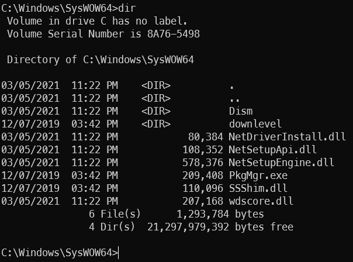

실제로 Windows Nano Server 컨테이너 이미지로 컨테이너를 만들어 내부에 접속해 확인 해 보면, SysWOW64 디렉토리 자체는 존재하긴 하지만, 대부분의 라이브러리와 실행 파일은 존재하지 않는 것을 확인할 수 있습니다.

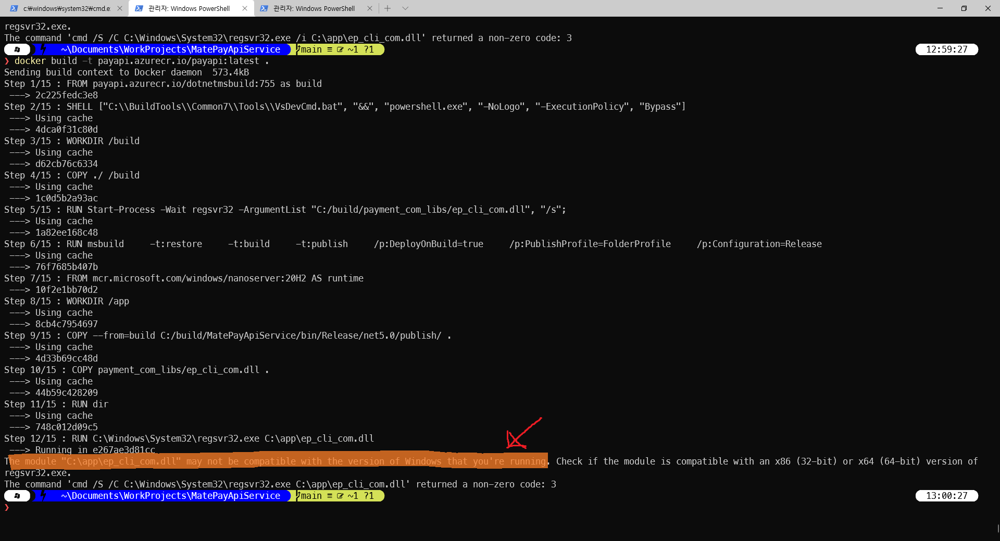

당연하겠지만, `C:\Windows\System32\regsvr32.exe` 명령으로 32bit COM 라이브러리 등록도 불가능 합니다. PG사에서 제공받은 결제 클라이언트 라이브러리의 경우 64bit 버전도 제공받긴 했지만 정상적으로 작동하는 라이브러리가 아니였기 때문에 32bit 버전을 사용해야 했습니다. 때문에 컨테이너화에 적합한 Nano Server 를 사용하지 못하고 Server Core 이미지를 사용해야 했습니다.

# MSBuild 사용을 Visual Studio Build Tools 설치

컨테이너 환경에서 Visual Studio Build Tools 를 사용하려면, 해당 도구가 미리 포함된 공식 컨테이너 이미지가 따로 없기 때문에 직접 설치해야 합니다. 앞서 언급한 [컨테이너에 Visual Studio Build Tools 설치 가이드](https://docs.microsoft.com/ko-kr/visualstudio/install/build-tools-container?view=vs-2019)를 참고하여 Dockerfile 의 빌드 도구 설치 부분을 작성해 봅시다.

먼저 베이스 이미지를 지정합니다. 문서의 권장사항에 따라 .Net 이 미리 포함된 이미지를 사용합니다. 여기서 빌드할 프로젝트는 .Net 5 기반이고, 빌드 과정에서 32bit COM 라이브러리 등록도 필요하므로, Windows Server Core 기반의 .Net 5 SDK 컨테이너 이미지를 사용하겠습니다.

```dockerfile
FROM mcr.microsoft.com/dotnet/sdk:5.0-windowsservercore-ltsc2019
```

그리고 `vs_buildtools.exe` 를 다운로드 받아 실행하여 Visual Studio Build Tools 를 설치하도록 작성합니다. 보통 Visual Studio 를 설치하면 중간에 재부팅을 하는 경우도 간혹 있는데, 컨테이너 빌드 중에는 이러한 상황이 발생하면 빌드가 중단되므로, 재부팅이 일어나지 않도록 하기 위해 `--norestart` 옵션을 넣어줍니다. 설치 도중 사용자 입력을 요구하는 경우에도 빌드가 중단되므로, 이러한 상황 또한 발생하지 않도록 `--quiet` 옵션도 넣어줍니다.

또한 설치 시, 컨테이너에 설치할 수 없는 버전의 Windows SDK 는 설치되지 않도록 `--remove` 옵션을 통해 설정해 줍니다.
```dockerfile
FROM mcr.microsoft.com/dotnet/sdk:5.0-windowsservercore-ltsc2019

# Restore the default Windows shell for correct batch processing.
SHELL ["cmd", "/S", "/C"]

# Download the Build Tools bootstrapper.
ADD https://aka.ms/vs/16/release/vs_buildtools.exe C:\TEMP\vs_buildtools.exe

# Install Build Tools with the Microsoft.VisualStudio.Workload.AzureBuildTools workload, excluding workloads and components with known issues.
RUN C:\TEMP\vs_buildtools.exe --quiet --wait --norestart --nocache \
    --installPath C:\BuildTools \
    --add Microsoft.VisualStudio.Workload.AzureBuildTools \
    --remove Microsoft.VisualStudio.Component.Windows10SDK.10240 \
    --remove Microsoft.VisualStudio.Component.Windows10SDK.10586 \
    --remove Microsoft.VisualStudio.Component.Windows10SDK.14393 \
    --remove Microsoft.VisualStudio.Component.Windows81SDK \
 || IF "%ERRORLEVEL%"=="3010" EXIT 0
```
지금 위 Dockerfile 의 경우 `Microsoft.VisualStudio.Workload.AzureBuildTools` 워크로드만 설치하도록 지정되어 있는데요, .Net 앱 빌드에 필요한 도구와 MSBuild도 설치 하도록 추가로 지정해 줍시다. Microsoft 문서 중 [Visual Studio Build Tools 구성 요소 디렉터리](https://docs.microsoft.com/ko-kr/visualstudio/install/workload-component-id-vs-build-tools?view=vs-2019) 문서를 참고하여 아래와 같은 워크로드(구성 요소 묶음) 을 추가로 설치하도록 지정하겠습니다.

- .NET Core 빌드 도구 `Microsoft.VisualStudio.Workload.NetCoreBuildTools`
- 웹 개발 빌드 도구 `Microsoft.VisualStudio.Workload.WebBuildTools`
- MSBuild 도구 `Microsoft.VisualStudio.Workload.MSBuildTools`

웹 개발 도구(`Microsoft.VisualStudio.Workload.WebBuildTools`) 워크로드의 경우, "권장" 에 해당하는 구성요소도 설치하도록 하기 위해, 뒤에 `;includeRecommended` 도 붙여 주었습니다.

```dockerfile
...

# Install Build Tools with the Microsoft.VisualStudio.Workload.AzureBuildTools workload, excluding workloads and components with known issues.
RUN C:\TEMP\vs_buildtools.exe --quiet --wait --norestart --nocache \
    --installPath C:\BuildTools \
    --remove Microsoft.VisualStudio.Component.Windows10SDK.10240 \
    --remove Microsoft.VisualStudio.Component.Windows10SDK.10586 \
    --remove Microsoft.VisualStudio.Component.Windows10SDK.14393 \
    --remove Microsoft.VisualStudio.Component.Windows81SDK \
    --add Microsoft.VisualStudio.Workload.AzureBuildTools \
    --add Microsoft.VisualStudio.Workload.MSBuildTools \
    --add Microsoft.VisualStudio.Workload.NetCoreBuildTools \
    --add Microsoft.VisualStudio.Workload.WebBuildTools;includeRecommended \
 || IF "%ERRORLEVEL%"=="3010" EXIT 0
```

# Developer PowerShell for Visual Studio 실행 및 COM 라이브러리 등록
설치 완료 후에는, MSBuild 명령 사용을 위해 Developer PowerShell for Visual Studio 를 활성화 하고, MSBuild 를 사용할 수 있습니다. 이는 `SHELL` 지시자를 이용해서 활성화 할 수 있습니다.

```dockerfile
...
    --add Microsoft.VisualStudio.Workload.WebBuildTools;includeRecommended \
 || IF "%ERRORLEVEL%"=="3010" EXIT 0

SHELL ["C:\\BuildTools\\Common7\\Tools\\VsDevCmd.bat", "&&", "powershell.exe", "-NoLogo", "-ExecutionPolicy", "Bypass"]
```

빌드를 진행하기 전에, 빌드에 필요한 소스코드를 가져오고, 프로젝트에 COM 라이브러리 참조가 있으므로 앞서 언급한 `regsvr32.exe` 명령으로 등록해 줍니다. 
여기서 등록할 라이브러리는 32bit COM 라이브러리 이므로, `C:\Windows\SysWOW64\regsvr32.exe` 명령을 사용해 등록하겠습니다. 또한, `/s` 옵션을 주어 자동으로 등록을 처리하도록 작성합니다. 등록할 라이브러리 파일 이름은 `com_lib_32bit.dll` 이라고 가정하고, 소스코드 디렉터리에 포함되어 있다고 가정하고 작성해 보겠습니다.

```dockerfile
...
SHELL ["C:\\BuildTools\\Common7\\Tools\\VsDevCmd.bat", "&&", "powershell.exe", "-NoLogo", "-ExecutionPolicy", "Bypass"]

WORKDIR /build
COPY ./ /build

RUN C:\Windows\SysWOW64\regsvr32.exe /s com_lib_32bit.dll
```
# 게시 프로파일(Publish Profile) 생성

이제 MSBuild 를 이용해 빌드를 진행할 수 있습니다. 빌드를 진행하기 앞서, [게시 프로파일(Publish Profile) 파일을 Visual Studio 를 이용해 생성하여 빌드를 간소화 해 보겠습니다.](https://docs.microsoft.com/ko-kr/aspnet/core/host-and-deploy/visual-studio-publish-profiles?view=aspnetcore-5.0#publish-profiles) 게시 프로파일은 사진처럼 Visual Studio 의 *빌드* -> *~게시* 를 선택하고, *시작* 버튼을 눌러서 새로운 게시 프로필 생성을 시작합니다.


*폴더* 에 게시하도록 지정하고, 경로는 기본값을 유지한 후 *마침* 을 눌러 게시 프로파일을 생성합니다.
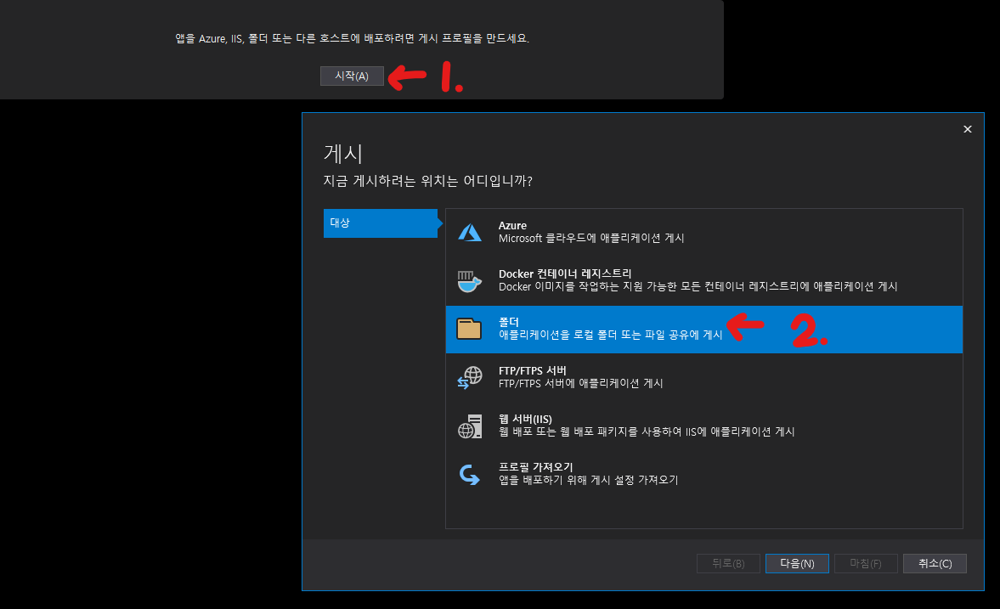
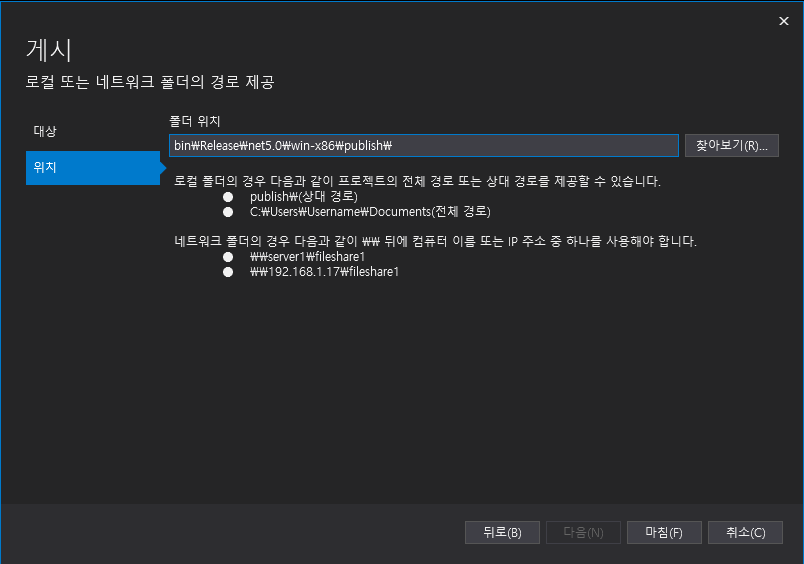

생성된 프로파일을 조금 더 수정해 주도록 하겠습니다. 되도록이면 빌드해서 나온 컨테이너 이미지 크기를 줄이기 위해 빌드한 .Net 앱에 런타임이 함께 포함되도록 설정해 보겠습니다.
이를 위해, 게시 프로파일 화면에서 *모두 보기* 버튼을 눌러 세부 설정 화면을 열고 *구성*, *배포 모드*, *대상 런타임* 등을 설정합니다.
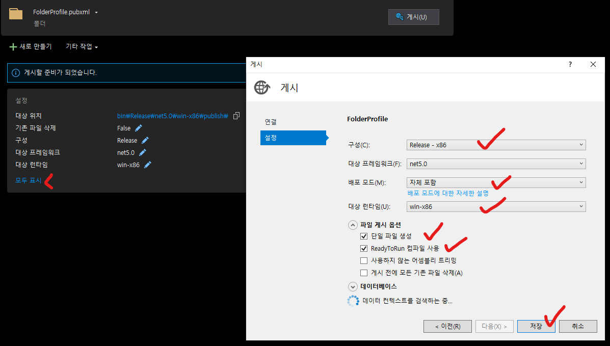
여기서는 사진처럼 아래와 같은 사항을 설정했습니다.
- 구성: Release - x86
- 대상 프레임워크: net5.0
- 배포 모드: 자체 포함(Self Contained)
- 대상 런타임: win-x86
- 파일 게시 옵션
  - 단일 파일 생성(켬)
  - [ReadyToRun 컴파일 사용](https://docs.microsoft.com/ko-kr/dotnet/core/deploying/ready-to-run)(켬) <- 앱 시작 및 대기 시간 개선하는 AOT 컴파일 방식입니다. 필요하지 않으면 선택하지 않아도 됩니다.

# 빌드
```dockerfile
...
RUN C:\Windows\SysWOW64\regsvr32.exe /s com_lib_32bit.dll

RUN msbuild \
    -t:restore \
    -t:build \
    -t:publish \
    /p:DeployOnBuild=true \
    /p:PublishProfile=FolderProfile \
    /p:Configuration=Release 
```
그리고 이제 생성된 게시 프로파일을 MSBuild 로 지정하여 빌드해 보겠습니다.
- `-t`옵션을 여러번 넣어서 총 3가지의 수행 작업 대상(Targets)을 지정합니다.
  - `restore`: .Net 프로젝트의 NuGet 패키지 의존성을 내려받습니다. .Net CLI의 `dotnet restore` 와 동일한 작업입니다.
  - `build`: .Net 프로젝트를 빌드합니다. .Net CLI의 `dotnet build` 와 동일한 작업입니다.
  - `publish`: 빌드한 .Net 프로젝트를 최종적으로 패키징 합니다. .Net CLI의 `dotnet publish` 와 동일한 작업입니다.
- `/p` 옵션을 여러번 사용하여 통해 속성값을 지정해 줍니다.
  - `/p:DeployOnBuild=true`: 빌드 후, 배포까지 같이 진행하도록 지정합니다.
  - `/p:PublishProfile=FolderProfile`: 빌드에 사용할 게시 프로파일을 지정합니다. 여기서는 앞에서 생성한 `FolderProfile`를 사용하도록 지정했습니다.
  - `/p:Configuration=Release`: 빌드 진행 시, `Release` 구성으로 빌드 하도록 지정합니다.

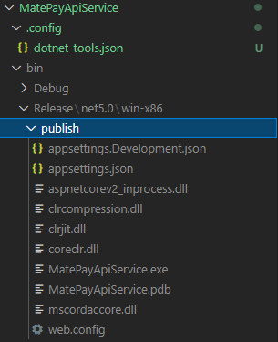
빌드가 완료되면, 게시 프로파일에서 지정한 디렉토리인 `bin/Release/net5.0/win-x86/publish` 경로에 실행파일과 앱 설정파일 등이 나오게 됩니다. 이제 이 파일과 COM 라이브러리만 컨테이너에 포함하여 실행하도록 설정해 봅시다. 

# Multi Stage Builds
컨테이너에는 실행할 파일과 실행에 필요한 COM 라이브러리만 있으면 되는데, 이미 Visual Studio Build Tools 와 빌드 전 소스코드 등 너무 많은 것을 컨테이너에 넣었습니다. 이 상태에서 `ENTRYPOINT` 나 `CMD` 로 실행 파일을 실행하도록 지정하고 끝나면, 컨테이너에 불필요한 것 까지 포함되어 컨테이너 이미지 크기 또한 불필요 하게 커집니다. [Multi Stage Builds](https://docs.docker.com/develop/develop-images/multistage-build/) 기능을 활용해서 새로운 Build Stage 를 만들고 나누고, 이전 Build Stage 에서 필요한 파일만 가져와서 최종 컨테이너 이미지에는 필요한 파일만 포함되도록 할 수 있습니다.

방법은 간단합니다. 빌드가 끝나서 실행 파일이 나온 후, `FROM` 지시자를 한번 더 사용하여 새로운 환경을 만들 수 있습니다. 빌드 해서 나온 실행 파일은 내부에 런타임이 포함되어 있어, 최종 컨테이너 이미지에는 .Net SDK 나 .Net 런타임을 넣을 필요가 없으므로, Windows Server Core 이미지(`mcr.microsoft.com/windows/servercore:2004`) 를 사용하겠습니다.

```dockerfile
FROM mcr.microsoft.com/dotnet/sdk:5.0-windowsservercore-ltsc2019
...
RUN msbuild \
    -t:restore \
    -t:build \
    -t:publish \
    /p:DeployOnBuild=true \
    /p:PublishProfile=FolderProfile \
    /p:Configuration=Release 

FROM mcr.microsoft.com/windows/servercore:2004
...
```

`AS` 를 사용해서 각 환경에 이름도 붙여줄 수 있습니다. 여기서는 빌드 과정에서 사용한 환경을 `build`, 최종 컨테이너 이미지 환경을 `runtime`으로 이름을 지정했습니다.
```dockerfile
FROM mcr.microsoft.com/dotnet/sdk:5.0-windowsservercore-ltsc2019 AS build
...
RUN msbuild \
    -t:restore \
    -t:build \
    -t:publish \
    /p:DeployOnBuild=true \
    /p:PublishProfile=FolderProfile \
    /p:Configuration=Release 

FROM mcr.microsoft.com/windows/servercore:2004 AS runtime
...
```
이제 빌드해서 나온 결과물을 `COPY` 지시자와 `--from=<stage-name>`옵션으로 `build` Stage 에서 가져오고, 소스 디렉터리에서 COM 라이브러리도 다시 한번 가져옵니다.
```dockerfile
FROM mcr.microsoft.com/dotnet/sdk:5.0-windowsservercore-ltsc2019 AS build
...
FROM mcr.microsoft.com/windows/servercore:2004 AS runtime

WORKDIR /app
COPY --from=build C:/build/MatePayApiService/bin/Release/net5.0/publish/ .
COPY payment_com_libs/com_lib_32bit.dll .
```

COM 라이브러리를 다시 한번 등록하고, 컨테이너에서 노출할 포트를 지정합니다. .Net 앱은 `ASPNETCORE_URLS` 환경 변수로도 실행할 .Net 앱의 호스트 주소를 정할 수 있습니다. 
컨테이너의 경우 호스트가 `localhost`나 `172.0.0.1`이 아닌, `0.0.0.0` 으로 되어 있어야 외부에서 해당 앱에 접근이 가능하므로 소스코드에서 호스트 주소를 지정하지 않은 경우 환경변수로 지정해 줍니다.
마지막으로 `ENTRYPOINT` 지시자로 컨테이너 생성시 실행할 명령을 지정 한 후 마무리 합니다.
```dockerfile
FROM mcr.microsoft.com/dotnet/sdk:5.0-windowsservercore-ltsc2019 AS build
...
FROM mcr.microsoft.com/windows/servercore:2004 AS runtime

WORKDIR /app
COPY --from=build C:/build/MatePayApiService/bin/Release/net5.0/publish/ .
COPY payment_com_libs/ep_com_lib_32bitcli_com.dll .

RUN C:\Windows\SysWOW64\regsvr32.exe /s com_lib_32bit.dll

EXPOSE 5000 5001

ENV ASPNETCORE_URLS="http://0.0.0.0:5000"

ENTRYPOINT [ "MatePayApiService.exe" ]
```

# 컨테이너 이미지 빌드

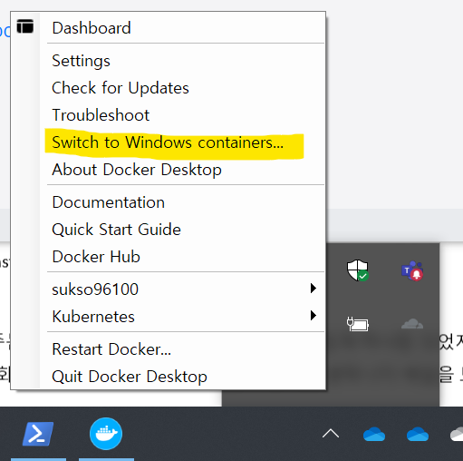
컨테이너 이미지를 빌드하고, 컨테이너를 실행해 봅시다. Docker Desktop 을 사용하는 경우, Windows Container 를 사용하도록 설정되어 있는지 확인합니다. 시스템 트레이에서 `Switch to Windows containers...` 로 나오면, Linux Container 를 사용 중이므로 클릭하여 Windows Container 를 사용하도록 설정합니다. 그리고 `docker build` 명령으로 빌드합니다.

```powershell
docker build -t payapi:latest .
```

이렇게 빌드를 진행하면, 아래와 같은 요인 때문에 빌드에 상당히 오랜 시간이 소요되는 것을 볼 수 있습니다.
- 베이스 이미지 크기가 큼: Windows Server Core 이미지 크기 - 3~4GB
   - `build` Stage 와 `runtime` Stage 이미지가 다르므로, 두 이미지 모두 다 받아야 하는데 두 이미지 모두 Windows Server Core 기반이고, 기반 OS 버전이 다르면 별도로 받아야 해서 더 긴 시간 소요.
- Visual Studio Build Tools 설치에도 오랜 시간 소요

아래 사진은 Azure Pipelines 를 사용하여 위에서 작성한 Dockerfile 에 의한 컨테이너 이미지 빌드와, 이미지를 컨테이너 레지스트리에 푸시하는 과정을 자동화 한 결과인데요. 총 16분 8초, 그 중 이미지 빌드에 15분 58초로 컨테이너 이미지 빌드에 정말 긴 시간이 소요된 것을 볼 수 있습니다.
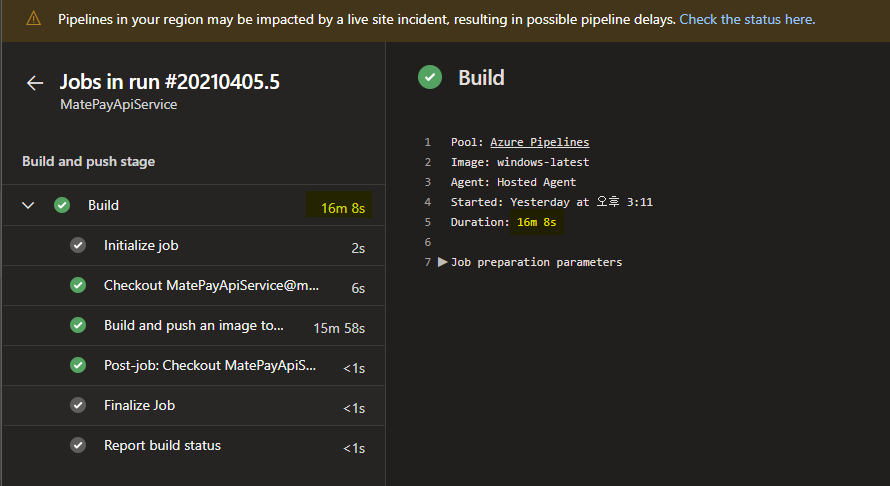

# Visual Studio Build Tools 설치된 컨테이너 이미지 분리
Windows Server Core 이미지는 어떻게 할 수 없지만, Visual Studio Build Tools 의 경우, 해당 도구가 미리 설치된 이미지로 분리하여 컨테이너 이미지 빌드 시간을 어느정도 줄일 수 있습니다.
이미지를 분리하기 위해, Dockerfile 도 2개로 분리하고, 이미지 빌드도 2번 합니다.

> vsbuildtools.Dockerfile
```dockerfile
FROM mcr.microsoft.com/dotnet/sdk:5.0-windowsservercore-ltsc2019 AS vsbuildtoools

# Restore the default Windows shell for correct batch processing.
SHELL ["cmd", "/S", "/C"]

# Download the Build Tools bootstrapper.
ADD https://aka.ms/vs/16/release/vs_buildtools.exe "C:\TEMP\vs_buildtools.exe"

# Install Build Tools with the Microsoft.VisualStudio.Workload.AzureBuildTools workload, excluding workloads and components with known issues.
RUN C:\TEMP\vs_buildtools.exe --quiet --wait --norestart --nocache \
    --installPath C:\BuildTools \
    --remove Microsoft.VisualStudio.Component.Windows10SDK.10240 \
    --remove Microsoft.VisualStudio.Component.Windows10SDK.10586 \
    --remove Microsoft.VisualStudio.Component.Windows10SDK.14393 \
    --remove Microsoft.VisualStudio.Component.Windows81SDK \
    --add Microsoft.VisualStudio.Workload.AzureBuildTools \
    --add Microsoft.VisualStudio.Workload.MSBuildTools \
    --add Microsoft.VisualStudio.Workload.NetCoreBuildTools \
    --add Microsoft.VisualStudio.Workload.WebBuildTools;includeRecommended \
 || IF "%ERRORLEVEL%"=="3010" EXIT 0

# Define the entry point for the docker container.
# This entry point starts the developer command prompt and launches the PowerShell shell.
SHELL ["C:\\BuildTools\\Common7\\Tools\\VsDevCmd.bat", "&&", "powershell.exe", "-NoLogo", "-ExecutionPolicy", "Bypass"]
ENTRYPOINT ["C:\\BuildTools\\Common7\\Tools\\VsDevCmd.bat", "&&", "powershell.exe", "-NoLogo", "-ExecutionPolicy", "Bypass"]
```
```powershell
docker build -t vsbuildtools:latest -f vsbuildtools.Dockerfile
```
하나는 Visual Studio Build Tools 를 설치하여 이미지로 빌드하도록 작성하고, `vsbuildtools:latest` 태그를 달아 빌드합니다.

> app.Dockerfile
```dockerfile
FROM vsbuildtools:latest AS build

WORKDIR /build
COPY ./ /build

RUN C:\Windows\SysWOW64\regsvr32.exe /s C:\app\com_lib_32bit.dll

RUN msbuild \
    -t:restore \
    -t:build \
    -t:publish \
    /p:DeployOnBuild=true \
    /p:PublishProfile=FolderProfile \
    /p:Configuration=Release 

FROM mcr.microsoft.com/windows/servercore:2004 AS runtime

SHELL ["powershell.exe", "-Command"]

WORKDIR /app
COPY --from=build C:/build/MatePayApiService/bin/Release/net5.0/publish/ .
COPY payment_com_libs/com_lib_32bit.dll .

RUN C:\Windows\SysWOW64\regsvr32.exe /s C:\app\com_lib_32bit.dll

EXPOSE 5000 5001

ENV ASPNETCORE_URLS="http://0.0.0.0:5000"

ENTRYPOINT [ "MatePayApiService.exe" ]
```
```powershell
docker build -t payapi:latest -f app.Dockerfile
```
나머지 하나는 앞에서 빌드한 `vsbuildtools:latest` 이미지를 베이스 이미지로 사용하도록 하여 앱 컨테이너를 빌드하는 Dockerfile 을 작성합니다.

아래 사진은 이렇게 컨테이너 이미지를 분리한 후, `vsbuildtools:latest` 에 해당하는 이미지를 미리 컨테이너 레지스트리에 올린 후 Azure Pipeliens 을 이용해 컨테이너 이미지를 빌드한 결과입니다. 총 8분 35초가 소요 되었다고 나오는데, 기존 16분 8초 소요된 것에 비해 절반 수준으로 시간이 단축된 것을 확인할 수 있습니다.
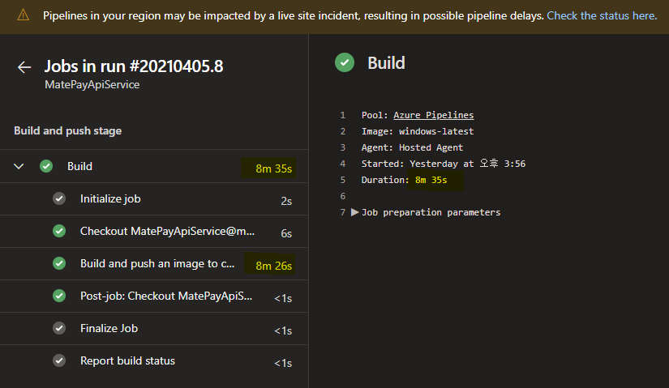

# 결론 
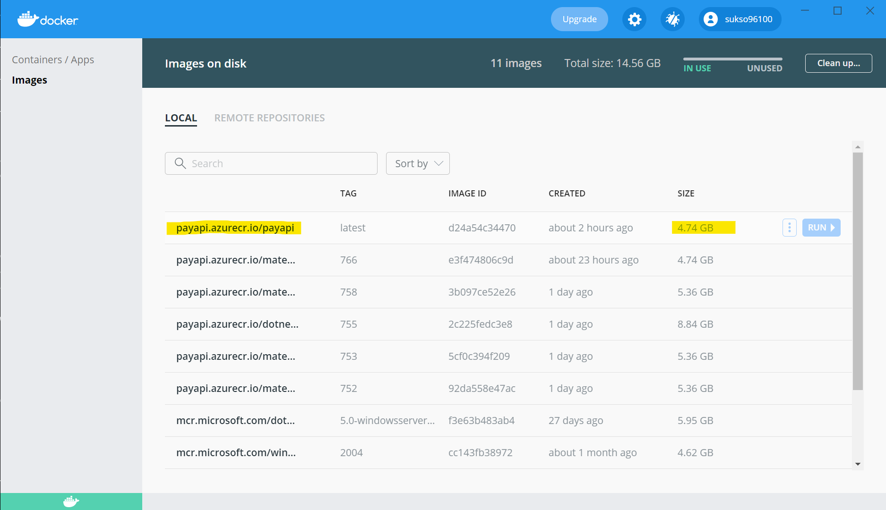
빌드 시간은 단축 했지만, 여전히 이미지 크기가 3~4GB에 육박하는 Windows Server Core 이미지를 베이스 이미지를 사용하기 때문에, 최종 컨테이너 이미지 또한 이에 비례하게 나오는 것을 확인할 수 있습니다.