팀즈는 마이크로소프트에서 제공하는 기업 및 학교를 위한 메신저 프로그램입니다. 기본적인 메신저 기능뿐만 아니라 화상회의, PC 원격 조작, 파일 공유 등의 다양한 기능을 제공합니다.

또한, 윈도우 11부터는 기본적으로 마이크로소프트 팀즈가 설치되어있기 때문에 구글에 윈도우 11 팀즈를 검색하면 검색 결과에 팀즈 삭제 방법이 검색 결과의 대부분을 차지하기도 합니다.

클라우드메이트는 기본 메신저 프로그램으로 팀즈를 사용하고 있으며 사내 봇(Bot) 프로그램인 콜슨 또한 팀즈 앱으로 제작되었습니다. 참고로 콜슨은 사내 생일자 복지 알림, 근무지 등록 및 조회, 주변 식당 검색 등의 서비스를 제공하고 있으며 더 다양한 기능 제공을 위해 추가 개발이 진행 중입니다.

이쯤에서 궁금증이 생길 것입니다. 굳이 팀즈 기반 사내 봇을 만드는 이유는 무엇일까? 조직마다 업무 처리와 소통 방식이 다르고 문화가 틀리다는 데에 그 답이 있습니다. 마이크로소프트 팀즈를 이용한 봇 개발은 기업의 업무 효율성, 커뮤니케이션 개선, 개발 생산성 향상, 사용자 경험 개선 등 다양한 이점을 제공합니다. 따라서 시간이 허락한다면 조직에 맞는 봇을 개발해 쓰는 것을 추천합니다.

이번 포스팅에서는 클라우드메이트 사내 봇 프로그램인 콜슨을 개발한 경험을 바탕으로 마이크로소프트 팀즈 기반 봇앱 개발 방법과 로컬 환경에서 팀즈 명령 봇과 알림 봇 기능을 가진 프로젝트를 생성하고 실행하는 과정을 실습 방식으로 알아보겠습니다.

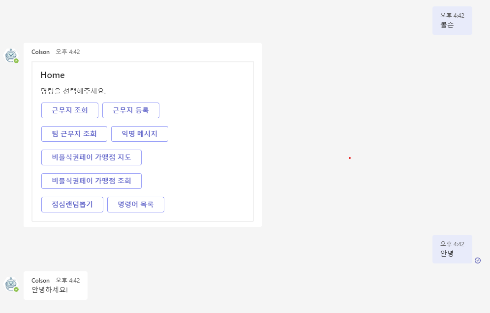

## 팀즈 앱 종류

팀즈에는 다양한 앱이 존재합니다.
마이크로소프트에서 제공하는 앱도 있지만 다른 회사에서 제공하는 유료 앱도 많습니다.

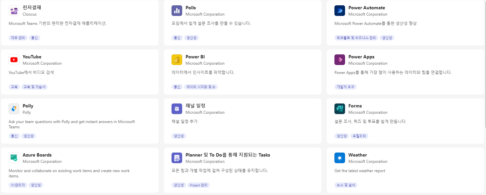
팀즈에서 사용할 수 있는 다양한 앱이 존재하며 유료 앱 또한 존재합니다.
{.text-center}

팀즈 앱은 크게 다음과 같이 분류할 수 있습니다.

1. 메신저 기능을 기반으로 앱과 메시지를 주고받을 수 있는 봇앱
2. 팀즈의 웹 브라우징 기능을 이용하여 특정 페이지 내에서 기능하는 탭(Tab) 앱
3. 사용자가 보내는 메시지에 어댑티브 카드 기반의 오브젝트를 추가할 수 있는 메시지 확장(Message extension) 앱

이 외에도 팀즈 화상회의 시 사용할 수 있는 미팅 확장(Meeting extension) 앱이나 외부 프로그램과 연동하는 앱 등도 있습니다.

콜슨은 이 중 봇 앱과 탭 앱의 기능을 적용해 구현하였습니다. 콜슨의 예와 같이 팀즈 앱 기반 봇을 개발할 때는 원하는 기능을 조합할 수 있습니다.

다만 하나의 앱에 여러 종류의 앱을 넣으면 사용자가 하나의 앱만 설치하면단여러 기능을 편히 사용할 수 있는 장점이 있지만 관리가 어려워지는 단점이 있어 앱 제작 시 고려가 필요한 부분입니다.

이번 포스팅은 봇 앱만 살펴보도록 하겠습니다.

## 알림 봇과 대화봇

봇앱은 명령 봇(Command bot 또는 Conversation Bot)과 알림 봇(Notification Bot)으로 나뉘는데 프로젝트 생성 시 선택 방법에 따라서 내부 구조가 약간 다르게 생성됩니다.

명령 봇의 경우 기본적으로 사용자가 봇에게 메시지를 보내거나 봇이 보낸 어댑티브 카드의 버튼을 누르는 등의 동작을 하면 봇앱이 이 요청에 대한 응답을 전달하는 방식으로 동작합니다.

알림 봇의 경우 기본적으로 특정 시간이나 특정 이벤트 발생 시 이 봇을 설치한 사용자들에게 메시지를 전달하는 방식으로 동작합니다.

이 두 가지 기능을 모두 가진 봇을 만들 수는 없을까요?

물론 가능합니다. 두 가지 앱의 통신 기능을 하나의 프로젝트에 넣어주면 간단히 구현할 수 있습니다. 다만 프로젝트 생성 시 두 가지 기능을 모두 가진 프로젝트를 만들 수 없어 순서데로 하나씩 프로젝트를 만들어 기능을 적용하면 됩니다.

참고로 명령 봇은 사용자가 보낸 요청에 대하여 직접적으로 응답을 보내주면 사용자에게 메시지가 전달되는 방식입니다. 알림 봇의 경우 자신에게 등록된 사용자 정보를 불러와 각 사용자에게 메시지를 전달하는 방식으로 통신을 합니다.

기본적으로 명령 봇 방식이 속도가 빠르고 알림 봇 방식이 속도가 느리기 때문에 명령 봇 방식으로 응답할 수 있는 요청에 대해서는 명령 봇 방식으로 응답해 주는 것이 좋습니다.

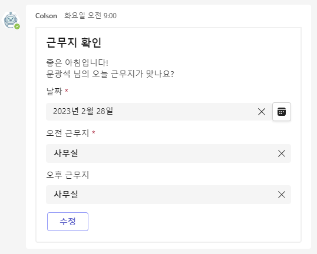
알림 봇의 기능을 이용하여 만들어진 콜슨의 근무지 확인 메시지
{.text-center}

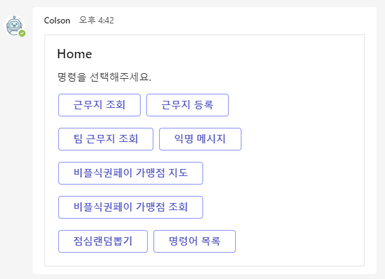
명령 봇의 기능을 이용하여 만들어진 콜슨의 명령어 목록 기능
{.text-center}

## 알림 봇 프로젝트 생성

이제 팀즈 앱 프로젝트를 생성하는 방법을 설명하겠습니다.
팀즈 앱은 Vscode 확장 마켓플레이스에서 ‘Teams Toolkit’이라는 확장을 다운받아 생성할 수 있습니다.

프로젝트는 Nodejs 기반으로 생성되며 프로젝트 생성 시 javascript, typescript 중 하나의 언어를 골라 생성할 수 있습니다.

먼저 typescript로 된 알림 봇 프로젝트를 생성해 보겠습니다.

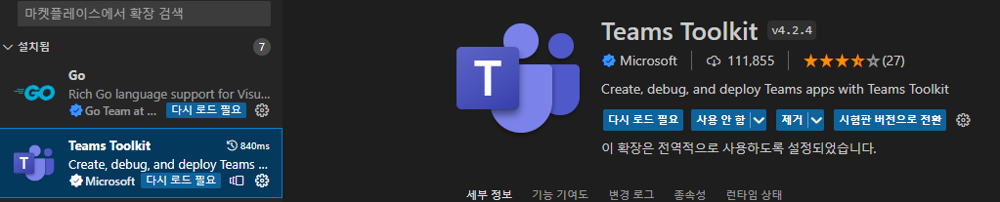
Teams Toolkit 을 설치합니다.
{.text-center}

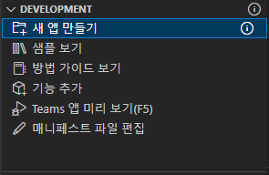
Teams Toolkit 을 선택하고 새 앱 만들기를 클릭합니다.
{.text-center}

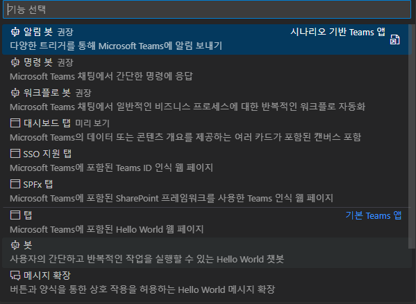
알림 봇을 선택해 줍니다.
{.text-center}

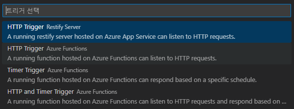
typescript를 선택 후 Restify Server 기반의 HTTP Trigger 항목을 선택합니다.
{.text-center}

이후 프로젝트 이름을 입력하여 프로젝트를 생성해 줍니다.

프로젝트가 생성되면 Teams Toolkit에서 로컬 환경으로 앱을 실행시켜 줍니다.
프로젝트에 필요한 모듈을 다운받고 코드 수정 없는 기본 샘플 프로그램이 잘 실행되는지 확인하기 위함입니다.

다만 기본적으로 npm이 설치되어 있어 노드와 팀즈를 실행할 수 있는 환경이어야 합니다.

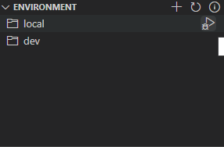
버튼 클릭 후 브라우저를 선택하면 모듈 다운로드 및 실행이 시작됩니다.
{.text-center}

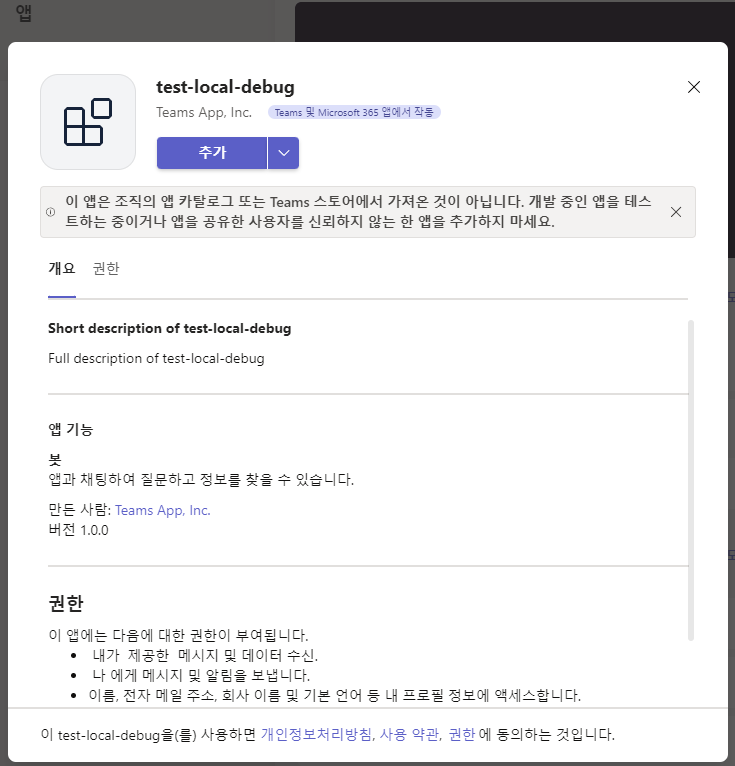
실행이 완료되면 추가 버튼을 누릅니다.
{.text-center}

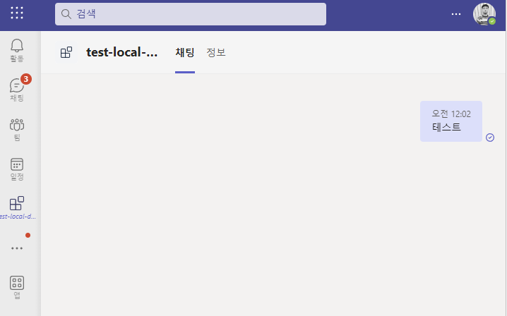
앱이 실행되었습니다.
{.text-center}

앱이 실행되었지만 알림 봇의 기능상 메시지를 보내도 아무런 응답이 오지 않습니다.

알림봇 샘플은 API 요청을 받으면 등록된 모든 사용자에게 메시지를 전달하는 기능이 있으므로 API를 날려보도록 하겠습니다.

저는 Postman을 이용해서 API를 날려보겠습니다.
알림봇의 기본 포트는 3978이므로 다음의 주소로 POST 요청을 하겠습니다.
http://127.0.0.1:3978/api/notification

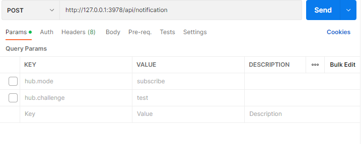
포스트맨으로 요청을 보냅니다.
{.text-center}

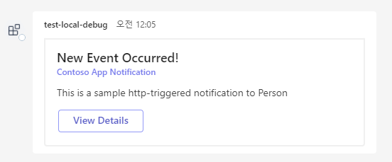
알림 봇이 메시지를 보냈습니다.
{.text-center}

이렇게 알림 봇 앱이 정상적으로 메시지를 보내준 것을 확인하였습니다.

## 명령 봇 기능 추가

이번에는 위에서 생성한 프로젝트에 명령 봇의 커멘드 처리 기능을 추가해 보겠습니다.

참고로 ‘새 앱 만들기’ 버튼을 클릭하여 명령 봇 프로젝트를 생성하면 프로젝트 구조가 아래 코드와 약간 다른 것을 확인할 수 있습니다.
필자가 사용한 코드가 좀 더 예전 방식의 코드이고 현재 기본 명령 봇 프로젝트가 더 최신 방식의 코드이기 때문입니다.

하지만 기능 면에서는 예전 방식이 더 좋은 점이 있습니다.
사용자가 전송한 메시지를 직접 처리할 수 있기 때문에 커멘드를 추가하기가 훨씬 편리하고, 인터넷에서 현재 방식보다 예전 방식에 관련된 정보를 찾기가 훨씬 쉽습니다.

또한 봇이 메시지를 보낼 것처럼 ... 아이콘을 띄운다거나 사용자가 보낸 리액션에 대응할 수도 있습니다.

그러면 예전 방식의 코드를 사용하여 명령 봇 기능을 추가해 보겠습니다.

코드를 한 줄 한 줄 추가하면 따라 하기 힘들기 때문에 약간 수정한 파일 2개의 내용을 통째로 적도록 하겠습니다.

알림봇에 존재하는 index.ts 파일을 수정합니다.

```js
import * as restify from "restify";
import { bot } from "./internal/initialize";
import { BotFrameworkAdapter } from "botbuilder";
import { TeamsBot } from "./teamsBot";

const adapter = new BotFrameworkAdapter({
  appId: process.env.BOT_ID,
  appPassword: process.env.BOT_PASSWORD,
});
const teamsBot = new TeamsBot();

const server = restify.createServer();
server.use(restify.plugins.bodyParser());
server.listen(process.env.port || process.env.PORT || 3978, () => {
  console.log(`\nBot Started, ${server.name} listening to ${server.url}`);
});

server.post(
  "/api/notification",
  restify.plugins.queryParser(),
  restify.plugins.bodyParser(),
  async (req, res) => {
    for (const target of await bot.notification.installations()) {
      await target.sendMessage("알림 API를 전달받았습니다!");
    }
    res.json({});
  }
);

server.post("/api/messages", async (req, res) => {
  await adapter.processActivity(req, res, async (context) => {
    await teamsBot.run(context);

    //봇에 사용자를 등록시키는 부분입니다.
    await bot.requestHandler(req, res);
  });
});
```

이후 index.js 와 같은 위치에 teamsBot.ts 라는 파일을 추가하겠습니다.

```js
import { TeamsActivityHandler, TurnContext } from "botbuilder";

export class TeamsBot extends TeamsActivityHandler {
  constructor() {
    super();

    this.onMessage(async (context: TurnContext, next) => {
      //봇이 메시지를 받으면 사용자에게 ... 을 보여줍니다.
      const message = MessageFactory.text("");
      message.type = ActivityTypes.Typing;
      await context.sendActivity(message);

      //사용자가 전송한 텍스트와 ' 텍스트를 입력하셨습니다.'를 합쳐서 사용자에게 돌려줍니다.
      await context.sendActivity(
        context.activity.text + " 텍스트를 입력하셨습니다."
      );
      await next();
      return;
    });
  }
}
```

이후 프로젝트를 다시 실행합니다.

이제 봇에게 텍스트 메시지를 전송하면 봇에게 응답이 돌아옵니다.

기존 기능인 API를 받았을 때 알림을 전달하는 기능을 다시 테스트해보겠습니다.
포스트맨을 이용해서 API를 날리면 '알림 API를 전달받았습니다!'라는 텍스트가 전송됩니다.

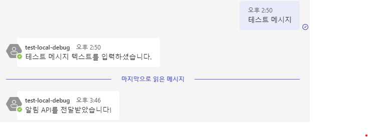
제대로 응답이 돌아옵니다.
{.text-center}

여기까지 완료한다면 팀즈 봇 앱의 가장 기본적인 기능이자 중요한 기능 구현이 완료되었습니다.

이 이후는 일반적인 Restify Nodejs 프로젝트와 똑같은 방법으로 원하는 기능을 추가하면 됩니다.

## 마치며

이번 포스팅에서는 가장 기본적인 명령 봇과 알림 봇의 기능을 가지고 있는 프로젝트를 생성하는 과정을 알아보았습니다.

팀즈 봇에 대해서는 아직 할 이야기가 많이 남아 있습니다. 몇 개 추려 보면 다음과 같습니다. 이들 주제에 대해 모두 알면 좋지만 그렇지 않아도 상관 없습니다. 대부분 부가적인 사항입니다. 이번 포스팅에서 소개한 기본 프로젝트 생성 방법만 숙지하면 누구나 팀즈 봇 앱을 만들 수 있습니다.

- 어댑티브 카드 만드는 방법과 어댑티브 카드 기능의 한계
- 모바일 환경과 PC 환경의 기능 차이
- 리소스 재실행 시 모든 사용자 정보가 삭제되는 치명적인 문제점 및 대처 방법
- 봇 앱 배포 방법과 주의사항
- 팀즈 그룹 채팅 및 팀 그룹에 봇을 추가할 수 있도록 설정하는 방법

이상으로 이번 포스팅을 마무리할까 합니다.
다음에 다른 주제로 찾아 뵙겠습니다.

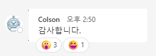

## 참고자료

https://learn.microsoft.com/en-us/microsoftteams/platform/sbs-gs-workflow-bot?tabs=vscode
