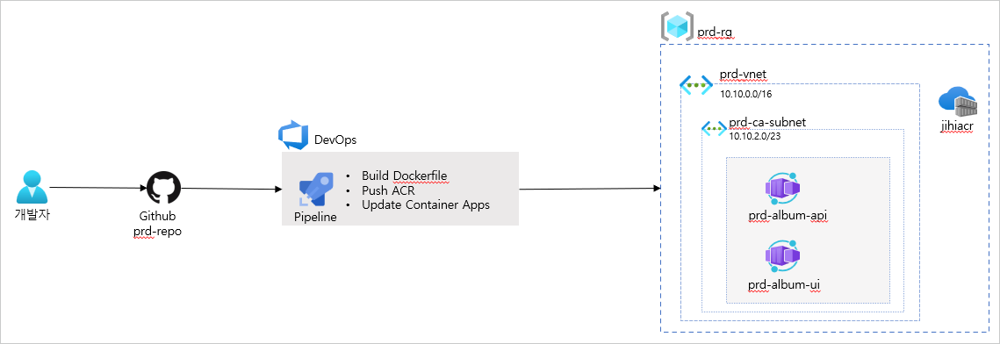
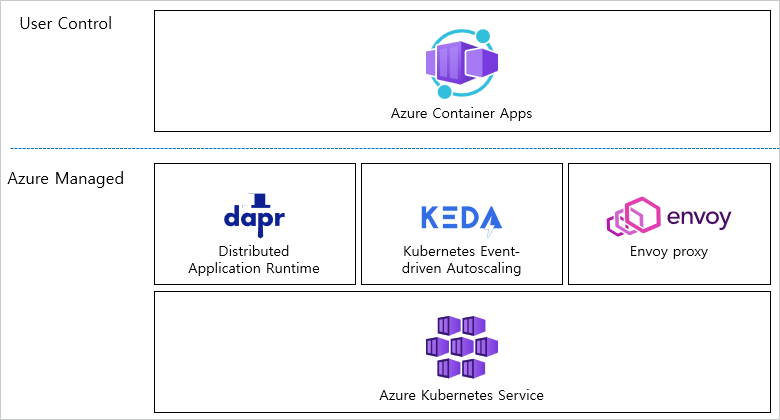
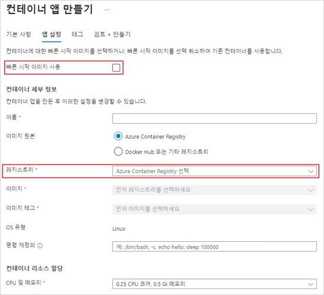
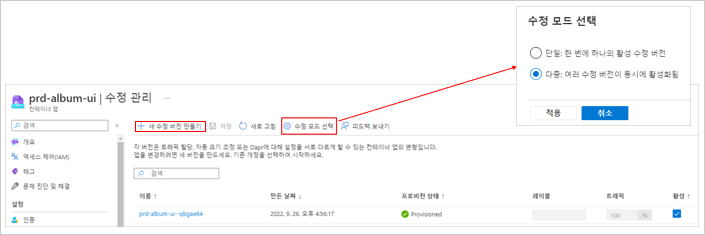
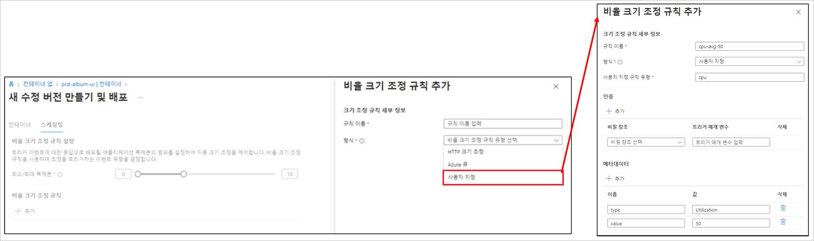
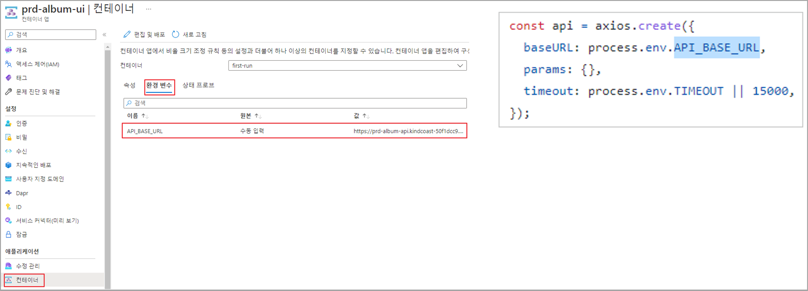
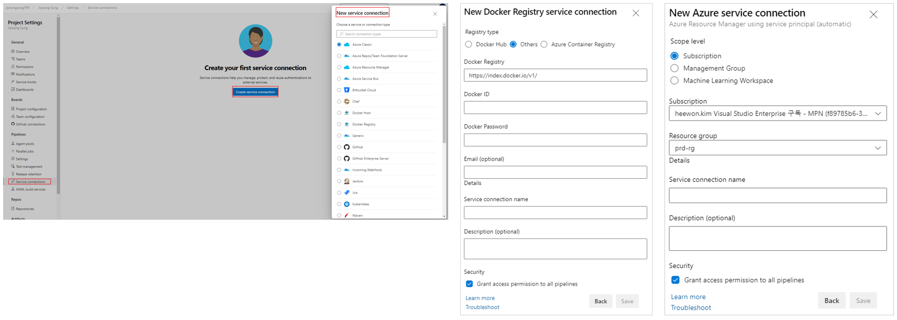
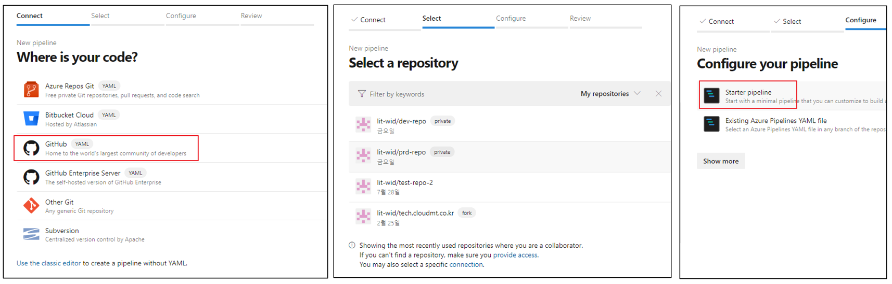
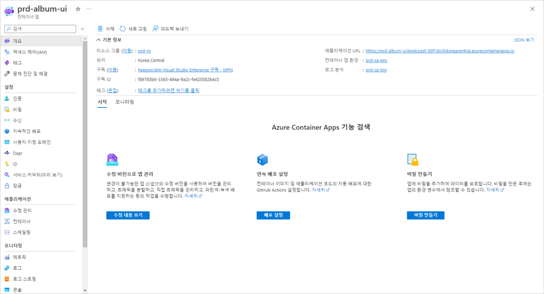

---
authors:
- jiyong sung, heewon kim
date: "2022-12-26T00:00:00Z"
categories:
- Hands on

tags:
- Azure
- DevOps
- CICD
- Container Apps

title: CI/CD로 컨테이너 애플리케이션 배포해보자
feature_image: images/coverimg.png
---

안녕하세요! 

저희가 이번에 "CI/CD로 컨테이너 애플리케이션 배포해보자"라는 주제로 내부 프로젝트를 진행했습니다.

저희가 구현하고자 하는 아키텍처를 아래에 소개합니다!

CI/CD를 위해서 Azure DevOps를, 컨테이너 애플리케이션을 배포하기 위해 Azure Container Apps 서비스를 사용하였습니다. SaaS와 PaaS 서비스를 사용하기에 전체 아키텍처가 더 간단하고, 관리하는데 유용할 거라는 이점을 기대하며 아키텍처링을 진행했습니다.

그럼 먼저, Azure DevOps란 어떤 서비스일까요?

Azure DevOps는 팀이 작업을 계획하고, 코드 개발에 대해 공동 작업을 수행하고, 애플리케이션을 빌드 및 배포할 수 있도록 하는 개발자 서비스를 제공합니다.   
개발자, 프로젝트 관리자 및 기여자가 함께 소프트웨어를 개발할 수 있도록 협업 문화 및 툴을 지원합니다. 이를 통해 조직은 기존 보다 더 빠른 속도로 제품을 만들고 개선할 수 있습니다.   
클라우드 호스팅 서비스로 제공이 되는 Azure DevOps Service는 단순화된 서버 관리, 최신 기능에 대한 즉각 액세스, 원격 사이트와 연결성 향상 전환이라는 이점도 있습니다.   
Github 및 이외의 많은 확장을 추가하여 타 서비스와 통합 가능합니다.
팀 대시보드를 사용하여 프로젝트 정보, 진행 상황 및 추세 등을 팀원들과 공유하거나 내장된 위키를 통해 정보를 공유할 수도 있습니다. 또한, 서비스 후크를 통해서는 알림을 보내는 등의 다양한 협업 도구를 사용하여 팀 생산성을 높일 수 있습니다.

Azure DevOps에는 5개 정도의 독립 실행형 서비스가 포함이 되어 있습니다.

1. Azure Board
    - 소프트웨어 프로젝트를 관리하는 데 필요한 대화형 및 사용자 지정 가능한 도구 
    - Kanban 보드, 백로그, 구성가능한 대시보드, 스프린턴 등 도구 제공. 
    - 이를 통해 프로젝트에 대해 선택된 기본 프로세스 모델(Agile, scrum 및 Kanban 프로세스)을 사용하여 소프트웨어 개발 프로세스를 지원

2. Azure Repos
    - 코드 관리할 수 있는 버전 제어 도구 집합. 
    - Git/ TFVC(Team Foundation Version Control) 지원
Azure Repos에서는 코드를 편집할 때 버전 제어 시스템에 파일의 스냅샷을 찍고 스냅샷을 영구적으로 저장이 되어 나중에 필요할 때 다시 불러올 수 있습니다.
이 스냅샷은 수정하거나 삭제하기 어려우니, 코드 보안에 유의해야 합니다.

3. Azure Pipelines
    - 코드 프로젝트를 자동으로 빌드하고 테스트.
    - CI(지속적 통합)와 CD(지속적 배포)를 결합하여 코드를 테스트 및 빌드해주는 서비스. 
    - Python, Java, JavaScript, PHP, Ruby, C#, C++ 및 Go를 비롯한 여러 언어와 다양한 프로젝트 유형에서 작동
    - 배포대상으로는 가상 머신, 환경, 컨테이너, 온프레미스 및 클라우드 플랫폼 또는 PaaS 서비스가 포함

```
CI : 개발팀이 코드 병합 및 테스트를 자동화하는 방식. 결과로 생성되는 아티팩트를 릴리스 프로세스에 공급하여 빈번한 배포 유도하는 프로세스.   
CD : 하나 이상의 테스트/프로덕션 환경에 코드를 실제로 빌드, 테스트 및 배포하는 프로세스
```

Azure Pipelines의 경우, 동시에 다른 유형의 대상에 배포해야 하는경우, Azure 배포나 Github과의 통합을 진행해야 하는 경우 Windows, Linux 또는 Mac 시스템에서 빌드해야 하는 경우 사용하기에 유용합니다.

4. Azure Test Plans 
    - 브라우저 기반 테스트 관리 솔루션 
    - 계획된 수동 테스트, 사용자 승인 테스트, 예비 테스트 진행 가능. 
    - 진행하는 테스트 및 결과를 요구사항과 빌드에 자동으로 연결하여 추적 및 피드백에 도움. 
    - 테스트 데이터 통해 통합 분석을 위한 Power BI, 위젯 및 사용자 지정 보고서 사용 가능.

5. Azure Artifacts
    - 개발자가 코드를 효율적으로 공유하고 모든 패키지를 한 곳에서 관리. 
    - 패키지를 피드에 게시하고 동일한 팀 내, 조직 전체, 공개적으로 공유 가능. 

이러한 CI/CD 툴을 이용하여 저희는 Azure Container Apps를 배포하려고 합니다.   
그럼 Azure Container Apps는 구체적으로 어떤 서비스일까요?

Container Apps는 스케일링을 관리하는 완전 관리형 서버리스 컨테이너 서비스입니다.   
Container Apps는 AKS(Azure Kubernetes Service)를 기반으로 구축되었지만, 직접적인 쿠버네티스 API를 지원하진 않습니다. 그래서 쿠버네티스 API, yaml을 사용 하지 않고도 패키징된 컨테이너를 가져오기만 하면 됩니다.   
같은 AKS 기반이라 할지라도 쿠버네티스에 대한 러닝 커브가 높은 AKS와 같은 서비스보다는 편리하게 서비스를 운영 및 관리 가능합니다.

Azure Container Apps는 아래와 같은 구조로 구성되어 있습니다.

Dapr, KEDA, Envoy 프록시와 통합을 포함해서 Azure Kubernetes Service를 기반으로 구축되었습니다.   
__Dapr__ 를 통해 마이크로서비스 간 연결을 단순화할 수 있는 API를 제공하는 분산 애플리케이션 런타임입니다. KEDA와 Envoy와 달리 활성화 및 비활성화를 선택할 수 있습니다.   
__[KEDA](https://keda.sh/docs/2.9/scalers/)__ 는 HTTP 트래픽, CPU, 메모리 등을 기반으로 스케일링할 수 있는 쿠버네티스 이벤트 기반 오토 스케일러입니다.   
__Envoy__ 는 클라우드 네이티브 애플리케이션용으로 설계된 프록시로, 컨테이너 앱스에선 트래픽 분할과 ingress를 제공하는 역할을 합니다.

이로써 Azure Container Apps에서는 쿠버네티스로 운영하기 위해 Deployment, Service, Ingress 등 복잡한 부분들을 구성할 필요가 없습니다.   
단지 컨테이너화된 애플리케이션의 원하는 구성을 맞추기 위해 비교적 간단한 Azure CLI 혹은 포털을 통해 구성하면 됩니다.

이외에도 다양한 기능들을 가지고 있습니다.
- 여러 컨테이너 버전을 실행, 애플리케이션의 수명 주기를 관리 가능.
- 다른 Azure 인프라를 관리할 필요 없이 HTTPS 설정이 가능.   
  (예를들어, Container Apps를 생성하면 LB, 퍼블릭 IP 등 리소스가 자동으로 생성되기 때문에 추가적인 리소스를 만들 필요 없습니다.)
- 쉬운 Blue/Green 배포 및 카나리아 배포가 가능.
- 비밀을 사용하여 DB 접속 정보 같은 민감한 데이터 관리.

더 자세한 Azure Conatiner Apps 및 서버리스의 개념에 대한 이야기는 [이 블로그](https://tech.cloudmt.co.kr/2022/05/31/2022-azure-korea-user-group-%EC%83%88%EC%8B%B9%EB%B0%98-%ED%9B%84%EA%B8%B0_azure-container-apps-preview-%EA%B0%84%EB%8B%A8%ED%95%98%EA%B2%8C-wordpress-%EB%9D%84%EC%9A%B0%EA%B8%B0/)를 참고해주세요~

---
아키텍처에서 컨테이너 이미지를 관리하는 Azure Container Registry가 있고 여기 저장된 이미지를 통해서 Container Apps가 배포됩니다. 마이크로서비스 애플리케이션 아키텍처를 위해 api, ui 기능을 나눠 기능별로 각각 Azure Contaier Apps에 배포합니다.   
이 구성을 Azure DevOps를 통하여서 CI/CD를 구성하였습니다.


그럼 본격적으로 저희가 아키텍처를 구축한 과정을 설명드리겠습니다. :)

1. 먼저는 Azure Container Registry를 배포합니다.
    - 여기 레지스트리에 애플리케이션 이미지를 올립니다.
    - prd-album-api와 prd-album-ui의 각각 두 개의 이미지를 올리기에 ACR에는 두개의 리포지토리가 존재합니다.
2. Azure Container Apps를 생성합니다.
    - 컨테이너 앱스 생성시에는 레지스트리를 선택이 가능한데, 이번 구현에서는 이전 과정에서 생성한 Azure Container Registry를 선택합니다.
    
3. Azure Container Apps의 버전 관리 및 Blue/Green 배포를 위해 수정 관리 탭에서 수정 모드를 다중으로 선택합니다.
    
4. 스케일링을 위해 스케일링 탭에서 편집 및 배포를 클릭합니다.
    - 컨테이너 탭 : 최소 및 최대 복제본 수를 지정합니다.   
    (최소를 1로 지정하면 사용자가 없더라도 항상 최소 1개의 컨테이너가 띄워져 있으며, 서비스를 제공할 수 있습니다.)
    - 스케일링 탭 : 형식을 사용자 지정으로 선택하여 메타데이터를 "type : Utilization", "value : 50"을 추가하여 비율 크기 조정 규칙을 생성합니다. 이를 통해 CPU 가 50% 이상이 되었을 때 컨테이너 크기를 조정하는 규칙을 생성하였습니다.   
    (테스트 예시로 50%라 지정했지만, 실무에서는 이보다는 높은 수치에서 스케일링하는 것이 일반입니다.)
    
5. 마이크로 서비스 구조에서는 각 Container Apps 에서는 다른 Container Apps를 호출합니다. 이때 호출하는 API URL을 환경변수 탭에 넣습니다.
  이렇게 되면 애플리케이션 코드에서 URL을 하드 코딩하지 않을 수 있습니다.
    
6. Azure DevOps 를 통해 CI/CD를구성하기위해 Azure DevOps에 조직 및 프로젝트를 생성합니다. 그리고는 먼저 ACR 및 Azure Subscription에 대한 Service Connection을 생성해야 합니다.
    
7. 그리고 본격적으로 CI/CD로 구성하기 위해 Pipeline 탭에서 새로운 Pipeline을 구성합니다.
    
    - 코드가 있는 GitHub을 선택하고 GitHub에 로그인한 다음, GitHub 리포지토리와 Azure DevOps를 연동하기 위한 권한 부여 작업을 진행합니다.
    - Github 리포지토리를 선택하고 Starter pipeline을 선택해 yaml 파일 작성합니다.
현재 파이프라인에서 구성된 yaml 파일은 아래와 같습니다.


```
trigger:
- main

resources:
- repo: self

variables:
  # Container registry service connection established during pipeline creation
  azureSubscription: '_azure subscription service connection id_'
  dockerRegistryServiceConnection: '_azure container registry service connection id_'
  imageRepository: 'prd-album-ui'
  containerRegistry: '_azure container registry login server url_'
  dockerfilePath: '$(Build.SourcesDirectory)/src/Dockerfile'
  tag: '$(Build.BuildId)'

  # Agent VM image name
  vmImageName: 'ubuntu-latest'

stages:
- stage: Build
  displayName: Build and push stage
  jobs:
  - job: Build
    displayName: Build
    pool:
      vmImage: $(vmImageName)
    steps:
    - task: Docker@2
      displayName: Build and push an image to container registry
      inputs:
        command: buildAndPush
        repository: $(imageRepository)
        dockerfile: $(dockerfilePath)
        containerRegistry: $(dockerRegistryServiceConnection)
        tags: |
          $(tag)
# Build and push an image to Azure Container Registry
- stage: update_aca
  displayName : update container apps
  jobs:
    - job: update
      displayName: update
      steps:
      - task: AzureCLI@2
        inputs:
          azureSubscription: 'prd-rg-connection'
          scriptType: 'bash'
          scriptLocation: 'inlineScript'
          inlineScript: |
            az config set extension.use_dynamic_install=yes_without_prompt
            az containerapp update \
              --name prd-album-ui \
              --resource-group prd-rg \
              --image _azure container registry login server url_/prd-album-ui:'$(Build.BuildId)'
          addSpnToEnvironment: true
```

이 yaml 파일에 정의된 대로 Azure Pipeline이 돌아가게 됩니다. trigger로 정한 작업이 일어나게 되면 stage에 정의된 작업들이 자동으로 동작 합니다.   
Build 스테이지에서 Github에 올린 코드를 이미지화 시켜 Azure Container Registry에 올리고, 이 작업이 끝나고 나면 update_aca 스테이지에서는 Azure Container Apps를 업데이트 시켜 새 버전의 컨테이너를 배포합니다.

Azure Container Apps는 이외에도 다양한 기능들을 사용 가능합니다.

비밀을 사용하여서 민감한 정보들을 하드 코딩 하지 않고도 사용 가능합니다.   
Azure Monitor 기반의 모니터링도 가능하여 메트릭이나 다양한 로그를 쿼리, 아카이브할수도 있습니다. 또한, 로그 스트림, 콘솔을 통하여서 각각의 컨테이너 내부를 직접 확인할 수도 있습니다.

이렇게 저희가 구현하고자 하는 Container Apps 배포와 Azure DevOps를 통한 CI/CD를 구현해 보았습니다.

이렇게 구성하고자 하면 각 서비스의 과금 정책을 확인하지 않을 수 없겠죠? 각 서비스의 과금 정책 소개로 이 글을 마무리 하겠습니다.

- Azure DevOps
|사용자 라이선스 기반|사용량 기반|
|:---:|:---:|:---:|
|기본 플랜 (처음 5명의 사용자 무료)​|Azure Pipeline : Microsoft-hosted / Self-hosted에 따라​, 병렬 작업 개수에 따라​|
|기본 + 테스트플랜|Azure Artifact: 2GiB 이상이 되면 아티팩트 크기 별에 따라​|
- Azure Container Apps   
|구독당 매월 무료|사용량기반|
|:---:|:---:|
|처음 180,000 vCPU 초|​리소스 사용: vCPU 초 및 GiB 초 단위에 따라​
|처음 360,000 GiB 초​|컨테이너 앱이 수신하는 HTTP 요청 수에 따라|
|처음 2백만 개의 HTTP 요청​||

감사합니다.