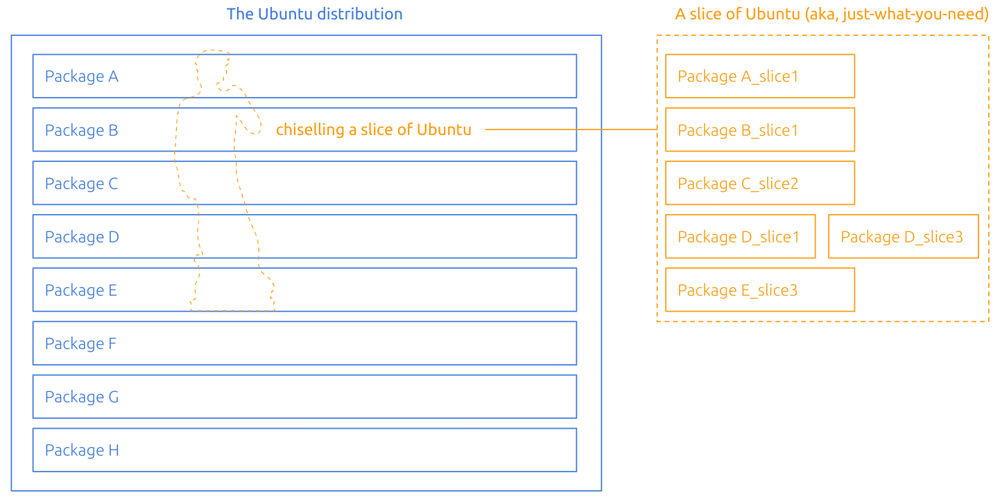
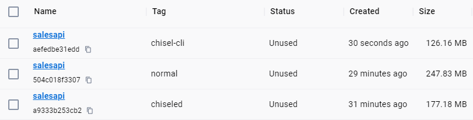

오늘날 많은 조직에서 웹 애플리케이션을 컨테이너 이미지로 만들어 Kubernetes와 같은 컨테이너를 호스팅 할 수 있는 환경에 배포하고 있는데요. 이러한 환경에서 탄력적인 배포를 위해 컨테이너 이미지를 최대한 경량화 하여 만들고 있기도 합니다. [다만 이 글을 보시면 아시겠지만, 컨테이너 이미지 경량화를 처음 해 본다면 쉽지많은 않을 것이고. 고려할 사항도 어느정도 있습니다.](/2022/11/08/container-imagesize-diet/) 최근에는 이를 위한 다양한 솔루션이나 베이스 컨테이너 이미지 또한 많이 나오고 있습니다. 특히 요즘은 Alpine Linux와 같이 처음부터 경량 컨테이너를 위한 OS나 Google의 Distroless처럼 경량화된 컨테이너 이미지 이면서도 프로그래밍 언어 툴체인이나 런타임을 넣어 두어서 쉽게 사용 가능한 컨테이너 이미지도 있습니다.

리눅스 배포판중 많이 쓰이는 Ubuntu도 최근 경량 컨테이너 이미지를 출시 했는데요, 바로 Chiselled Ubuntu Container 이미지 입니다. Ubuntu를 개발한 Canonical과 Microsoft과 최근 여러 부분에서 협업을 많이 하다 보니, .Net을 위한 Chiselled Container 이미지도 함께 출시 되었습니다. 때마침 서비스 개발팀의 많은 서비스 백엔드가 .Net 기반이기도 하여서 실제 서비스에 적용 하기도 하였는데요. 이번 포스팅을 통해 Chiselled Container 에 대해 알아보고, 다른 경량 컨테이너 이미지와 무엇이 다른지 그리고 서비스 개발팀에서는 어떻게 적용 했는지에 대해 다뤄 보고자 합니다.

# Chiselled Container란?
Distroless 컨셉의 컨테이너로, 우분투 기반 환경에서 애플리케이션 실행에 필요한 것만 남겨두고 다른 불필요한 패키지나 구성요소는 모두 제거한 형태의 컨테이너 입니다. 예를 들어 .Net 앱을 Chiselled Container 로 컨테이너화 한다면, .Net 런타임과 빌드해서 나온 애플리케이션 어셈블리 파일과 애플리케이션이 요구하는 라이브러리를 제외한 모든 것을 제거한 컨테이너라고 보면 되겠습니다. 제거 되는 것에는 앱 실행에 굳이 필요하지 않은 `bash`, `cd`, `ls` 같은 명령도 제거가 되고. 컨테이너 이미지 완성 후에는 더 사용하지 않는 패키지 관리자(`apt`, `dpkg`)등도 모두 제거 대상에 포함이 됩니다. 컨테이너에 포함된 패키지라 해도 패키지에서 앱 실행에 굳이 필요하지 않은 부분(매뉴얼, 설정 스크립트, 헤더 파일 등)도 모두 제거가 됩니다. 이렇게 앱 실행에 필요한 것만 남기고, 다른 불필요한 것들은 모두 정리가 되기 때문에, 기존의 일반적인 우분투 혹은 다른 배포판 이미지 기반으로 만들 때에 비하여 훨씬 작은 크기의 컨테이너 이미지를 만들 수 있습니다. 또한 이러한 컨테이너 내부를 수정할 때 사용 가능한 도구를 삭제 함으로써 컨테이너 대상 보안 공격의 여지 또한 미리 제거 하기 때문에, 보안 측면에서도 더 좋다고 할 수 있겠습니다.

이렇게 불필요한 것을 제거하는 작업을 직접 한다면 아마 꽤나 복잡하고 수고스러운 과정이 될텐데요. Chiselled Container의 경우, [Chisel](https://github.com/canonical/chisel) 이라는 CLI 도구를 활용해서 경량화된 컨테이너 이미지를 만들 때, 포함 시키고자 하는 데비안 패키지의 필요한 부분만 잘라다가 넣을 수 있습니다. Chisel CLI은 컨테이너에 패키지를 추가할 때, 사전에 각 데비안 패키지를 대상으로 만들어진 Slice 정의 파일을 참고하여 설치 작업을 하는데, 각각의 Slice 정의 파일에는 패키지의 어떤 파일을 설치할 지 혹은 설치하지 않을지에 대한 사항이 정의되어 있습니다. 

예를 들어, `chisel` 명령으로 Ubuntu 22.04의 [`ca-certificates`](https://packages.ubuntu.com/jammy/ca-certificates)패키지를 `myrootfs/` 경로의 루트 파일시스템에 설치 한다고 가정하면, 아래와 같은 명령을 실행하게 됩니다.
```bash
chisel cut --release ubuntu-22.04 --root myrootfs/ ca-certificates
```

그러면 Chisel CLI에서 [`chisel-release`](https://github.com/canonical/chisel-releases) 아카이브에 있는 [`ca-certificates.yaml`](https://github.com/canonical/chisel-releases/blob/ubuntu-22.04/slices/ca-certificates.yaml)를 참고하여 해당 파일의 `contents` 속성 아래에 정의된 경로에 해당하는 파일만 설치를 하게 됩니다. 해당 `ca-certificates.yaml` 파일 내용은 아래와 같이 생겼는데, [원래의 데비안 패키지에 포함된 파일 목록](https://packages.ubuntu.com/jammy/all/ca-certificates/filelist)과 비교하면. 인증서 파일 이외 불필요한 문서 파일 등은 모두 제외 되어 있음을 알 수 있습니다.

```yaml
package: ca-certificates

slices:
  data:
    contents:
      /etc/ssl/certs/ca-certificates.crt: {text: FIXME, mutable: true}
      /usr/share/ca-certificates/mozilla/: {until: mutate}
      /usr/share/ca-certificates/mozilla/*: {until: mutate}
    mutate: |
      certs_dir = "/usr/share/ca-certificates/mozilla/"
      certs = [content.read(certs_dir + path) for path in content.list(certs_dir)]
      content.write("/etc/ssl/certs/ca-certificates.crt", "".join(certs))
```
이렇게 Chisel CLI로 패키지 추가 작업을 진행하면, 결론적으로 아래 그림처럼 원하는 데비안 패키지에서 딱 필요한 부분만 "끌로 깎아(Chisel)" 내어다가 컨테이너 이미지를 만드는데 사용하는 형태가 되게 됩니다.


> 그림 출처: https://github.com/canonical/chisel/blob/main/docs/_static/slice-of-ubuntu.png

# .Net 앱 컨테이너화 하기
그렇다면 이러한 Chiselled Container 로 .Net 앱을 작은 사이즈의 컨테이너 이미지로 만들어 봅시다. .Net 런타임이나 .Net 실행에 필요한 의존성이 포함된 Chiselled Container가 이미 배포가 되고 있기 때문에, 이를 이용해서 어렵지 않게 컨테이너를 만드실 수 있습니다. 다만 .Net Chiselled Container 이미지에 Shell은 물론 빌드 도구도 포함 되어 있거나 하지는 않기 때문에, .Net SDK가 포함된 다른 컨테이너 이미지에서 빌드를 한 후 런타임 환경인 .Net Chiselled Container 이미지 기반 환경으로 복사 하도록 할 필요가 있습니다. 이를 위해서는 컨테이너 이미지 빌드에 사용하는 Dockerfile에서 Multi-stage build를 정의하면 되겠습니다. 예를 들어 ASP.NET 앱을 컨테이너화 하는 경우 아래처럼 Dockerfile을 작성할 수 있습니다.

> [GitHub dotnet/dotnet-docker 저장소의 샘플](https://github.com/dotnet/dotnet-docker/blob/main/samples/aspnetapp/Dockerfile.chiseled)을 기반으로 작성 하였습니다.
```dockerfile
# .Net SDK 가 설치된 베이스 이미지로 "build" stage 생성 및 해당 stage 에서 앱 빌드 작업 수행
FROM mcr.microsoft.com/dotnet/sdk:8.0-jammy AS build
WORKDIR /source

# C# 프로젝트 파일 (*.csproj) 복사 및 해당 프로젝트 의존성 복원
COPY aspnetapp/*.csproj .
RUN dotnet restore

# 소스코드 복사 및 앱 빌드
COPY aspnetapp/. .
RUN dotnet publish --no-restore -o /app


# ASP.NET 런타임이 포함된 Chiselled Container 이미지를 최종 런타임 환경으로 쓸 stage로 생성
FROM mcr.microsoft.com/dotnet/aspnet:8.0-jammy-chiseled
WORKDIR /app

# "build" stage 에서 빌드된 파일 복사
COPY --from=build /app .  
ENTRYPOINT ["./aspnetapp"]
```

# `icu`, `tzdata` 패키지가 필요한 경우
.Net 으로 개발된 앱을 실행할 때 종종 `icu`및 `tzdata`라이브러리가 필요한 경우가 많이 있습니다. [.Net의 Globalization 기능](https://learn.microsoft.com/en-us/dotnet/core/extensions/globalization)을 사용하는 경우 필요한데요. 대표적인 예시로 [SqlClient](https://github.com/dotnet/SqlClient)를 사용할 때 라고 할 수 있겠습니다. [이러한 경우를 위해 `-extra` 버전의 이미지도 있습니다.](https://github.com/dotnet/dotnet-docker/blob/main/documentation/ubuntu-chiseled.md#how-do-i-use-globalization-with-chiseled-images) (예: `mcr.microsoft.com/dotnet/nightly/runtime-deps:8.0-jammy-chiseled-extra`)

[아쉽게도 이러한 `extra` 이미지는, .Net 런타임이 포함된 것을 대상으로는 제공되고 있지 않고, .Net 프로젝트에서 별도로 제공할 계획도 없다고 합니다.](https://github.com/dotnet/dotnet-docker/discussions/4821) 때문에 `icu`및 `tzdata`가 필요한 경우 크게 두가지 방법을 고려해 보실 수 있는데, 하나는 앱을 Self-Contained 방식으로 빌드하여 `extra` 유형의 `runtime-deps` 이미지에 넣어 빌드하는 방법. 나머지 하나는 앞서 잠시 소개한 Chisel CLI로 직접 `icu`와 `tzdata`를 넣는 방법 입니다.

## Self-Contained 방식 빌드
.Net 앱을 [Self-Contained 방식으로 빌드하면](https://learn.microsoft.com/en-us/dotnet/core/deploying/#publish-self-contained), 하나의 실행 파일에 런타임까지 모두 자체적으로 포함 되므로 런타임이 없지만 Self-Contained 된 .Net 앱 실행에 필요한 것이 포함된 `extra` 유형의 `runtime-deps`이미지를 활용할 수 있습니다. 앱 빌드 명령과 런타임 stage 이미지 정보만 조금 수정하면 되기 때문에, 여러분의 .Net 프로젝트를 Self-Contained 방식으로 빌드하는데 크게 문제가 없다면 쉽게 선택 해 볼 수 있는 방법이라고 할 수 있습니다. 아무래도 쉽게 적용 해 볼 수 있는 방법이다 보니, 저희 팀에서는 이 방법을 몇몇 백엔드 서비스 컨테이너화에 적용하여 활용하고 있습니다.

위에서 보여드린 Dockerfile을 이러한 사항에 맞춰 수정하면 아래와 같이 작성할 수 있겠습니다.
```dockerfile
# .Net SDK 가 설치된 베이스 이미지로 "build" stage 생성 및 해당 stage 에서 앱 빌드 작업 수행
FROM mcr.microsoft.com/dotnet/sdk:8.0-jammy AS build
WORKDIR /source

# C# 프로젝트 파일 (*.csproj) 복사 및 해당 프로젝트 의존성 복원
COPY aspnetapp/*.csproj .
RUN dotnet restore

# 소스코드 복사
COPY aspnetapp/. .
# 앱 빌드: --self-contained 옵션 넣어서 
RUN dotnet publish --self-contained --no-restore -o /app


# icu, tzdata 가 포함된 extra 유형의 runtime-deps 이미지에서 최종 stage로 생성
FROM mcr.microsoft.com/dotnet/runtime-deps:8.0-jammy-chiseled-extra
WORKDIR /app

# "build" stage 에서 빌드된 파일 복사
COPY --from=build /app .  
ENTRYPOINT ["./aspnetapp"]
```

## Chisel CLI로 `icu`, `tzdata` 직접 추가
전자에 비해서는 복잡한 방법이지만, .Net 런타임이 포함된 Chiselled Container 환경에 `icu`, `tzdata`를 추가한 것이 필요하다면, Chisel CLI로 해당 패키지를 직접 추가하는 방법도 있습니다.

이러한 방법으로 Dockerfile을 작성 하려면, 먼저 컨테이너 빌드 중에 임시로 Chisel CLI를 설치 하도록 작성 해야 합니다. 이를 위해 `golang`이미지에서 stage를 따로 생성하여 Chisel CLI를 빌드 하고 이를 .Net SDK가 설치된 stage를 따로 만들어서 복사 해 올 수 있습니다. 이를 Dockerfile로 작성한 것을 보면 아래와 같습니다.
```Dockerfile
# Golang 이미지에서 "chisel" stage 생성 
FROM golang:1.21 as chisel

# 빌드 결과물 저장할 디렉토리 생성
RUN mkdir /opt/chisel
# /opt/chisel 에 Chisel CLI를 빌드 및 설치
RUN GOBIN=/opt/chisel go install github.com/canonical/chisel/cmd/chisel@latest

# .Net SDK 가 설치된 베이스 이미지로 "build" stage 생성 및 해당 stage 에서 앱 빌드 작업 수행
FROM mcr.microsoft.com/dotnet/sdk:8.0-jammy AS build

# "chisel" stage에서 빌드한 실행 파일을 "build" stage로 복사
COPY --from=chisel /opt/chisel/chisel /usr/bin/

```

그러면 이제 `chisel` 명령으로 원하는 패키지의 원하는 파일만 깎아올 수 있습니다. 예를 들어, [`libicu70`의 Slice 정의 파일](https://github.com/canonical/chisel-releases/blob/ubuntu-22.04/slices/libicu70.yaml)과 [`tzdata`의 Slice 정의 파일](https://github.com/canonical/chisel-releases/blob/ubuntu-22.04/slices/tzdata.yaml)을 참고해서 아래와 같이 작성이 가능합니다.

```Dockerfile
...
# .Net SDK 가 설치된 베이스 이미지로 "build" stage 생성 및 해당 stage 에서 앱 빌드 작업 수행
FROM mcr.microsoft.com/dotnet/sdk:8.0-jammy AS build

# "chisel" stage에서 빌드한 실행 파일을 "build" stage로 복사
COPY --from=chisel /opt/chisel/chisel /usr/bin/

# Chisel CLI로 필요한 패키지의 필요한 Slice 를 /rootfs로 복사 
# libicu70_libs - libicu70 의 "libs" Slice
# tzdata_eurasia - tzdata 의 "eurasia" Slice
# tzdata_zoneinfo-icu - tzdata 의 "zoneinfo-icu" Slice
RUN mkdir /rootfs \
    && chisel cut --release ubuntu-22.04 --root /rootfs \
        libicu70_libs tzdata_eurasia tzdata_zoneinfo-icu

WORKDIR /source

# C# 프로젝트 파일 (*.csproj) 복사 및 해당 프로젝트 의존성 복원
COPY aspnetapp/*.csproj .
RUN dotnet restore

# 소스코드 복사 및 앱 빌드
COPY aspnetapp/. .
RUN dotnet publish --no-restore -o /app

```
이렇게 Chisel CLI로 복사해 온 패키지 조각과 빌드하여 나온 .Net 앱 어셈블리 파일을 최종 stage 에 복사해서 컨테이너 이미지를 완성할 수 있습니다.
```Dockerfile
...
FROM mcr.microsoft.com/dotnet/aspnet:8.0-jammy-chiseled

WORKDIR /app
# "build" stage 에서 Chiseled 로 받은 패키지 Slice 파일 복사
COPY --from=build /rootfs /
# "build" stage 에서 빌드된 파일 복사
COPY --from=build /app .  
ENTRYPOINT ["./aspnetapp"]

```

이렇게 하면 완성된 Dockerfile은 아래와 같습니다. 보시다 싶이 Dockerfile이 꽤 복잡해 지므로, 권장되는 방법 까지는 아니지만 추가적으로 원하는 패키지를 추가해야 하는 경우에는 활용 해 보실 수 있겠습니다.
```Dockerfile
# Golang 이미지에서 "chisel" stage 생성 
FROM golang:1.21 as chisel

# 빌드 결과물 저장할 디렉토리 생성
RUN mkdir /opt/chisel
# /opt/chisel 에 Chisel CLI를 빌드 및 설치
RUN GOBIN=/opt/chisel go install github.com/canonical/chisel/cmd/chisel@latest

# .Net SDK 가 설치된 베이스 이미지로 "build" stage 생성 및 해당 stage 에서 앱 빌드 작업 수행
FROM mcr.microsoft.com/dotnet/sdk:8.0-jammy AS build

# "chisel" stage에서 빌드한 실행 파일을 "build" stage로 복사
COPY --from=chisel /opt/chisel/chisel /usr/bin/

# Chisel CLI로 필요한 패키지의 필요한 Slice 를 /rootfs로 복사 
# libicu70_libs - libicu70 의 "libs" Slice
# tzdata_eurasia - tzdata 의 "eurasia" Slice
# tzdata_zoneinfo-icu - tzdata 의 "zoneinfo-icu" Slice
RUN mkdir /rootfs \
    && chisel cut --release ubuntu-22.04 --root /rootfs \
        libicu70_libs tzdata_eurasia tzdata_zoneinfo-icu

WORKDIR /source

# C# 프로젝트 파일 (*.csproj) 복사 및 해당 프로젝트 의존성 복원
COPY aspnetapp/*.csproj .
RUN dotnet restore

# 소스코드 복사 및 앱 빌드
COPY aspnetapp/. .
RUN dotnet publish --no-restore -o /app

FROM mcr.microsoft.com/dotnet/aspnet:8.0-jammy-chiseled

WORKDIR /app
# "build" stage 에서 Chiseled 로 받은 패키지 Slice 파일 복사
COPY --from=build /rootfs /
# "build" stage 에서 빌드된 파일 복사
COPY --from=build /app .  
ENTRYPOINT ["./aspnetapp"]
```

# 컨테이너 빌드하여 크기 비교 해 보기
이렇게 작성한 Dockerfile로 컨테이너 이미지를 빌드해서 비교 해 보면, Chisel Container 기반 이미지가 적게는 70mb에서 많게는 120mb정도 더 작은 사이즈임을 알 수 있습니다.


이렇게 지금까지 Chiselled Ubuntu Container에 대해 알아보고, 이를 활용한 .Net 앱 컨테이너화를 하는 방법, 필요에 따라 추가적인 패키지 설치를 위해 Chisel CLI를 활용하는 방법을 알아보고 마지막으로 빌드된 컨테이너 이미지 용량도 비교 해 보았습니다. Chiselled Ubuntu Container와 .Net Chiselled Container는 최근 정식으로 출시(GA)되어 바로 프로덕션 환경에 적용 해 보실 수 있습니다. Chiselled Ubuntu Container컨테이너와 .Net Chiselled Container가 더 궁금하다면, 아래 링크에서 더 자세히 알아보실 수 있습니다.

# 참고 링크
- [Ubuntu Chiselled + .Net](https://github.com/dotnet/dotnet-docker/blob/main/documentation/ubuntu-chiseled.md)
- [Chisel CLI](https://github.com/canonical/chisel)
- [chisel-releases - Chisel CLI 에서 사용하는 Slice 정의 모음](https://github.com/canonical/chisel-releases)
- [Chiselled Ubuntu Containers (YouTube)](https://www.youtube.com/watch?v=o8NILnbjhQ4)
- [Canonical announces the general availability of chiselled Ubuntu containers](https://canonical.com/blog/chiselled-ubuntu-ga)