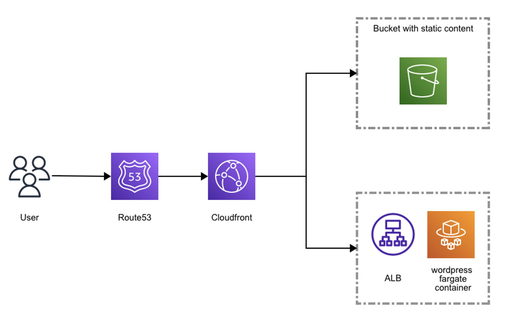

## 신입에게 던져진 퀘스트(feat. ECS)

안녕하세요 클라우드 메이트 신입사원 정휘영입니다 🙂

저는 2021년 12월 클라우드 메이트에 입사하여 주어진 과제를 2개월동안 해결해 나가는 과제입니다.

기존에 발표하신 분들과 다른 방향으로 해결해보자 라는 것을 목표로 준비했습니다.

먼저 주어진 과제에 따른 요구사항이 어떤 것인지 부터 파악이 필요했습니다.

> ### <span style="color:red">🔑 Quest</span>
>
> <span style="color:gray"> \[Wordpress를 이용하여 웹사이트 최적화하는 과제이다. 인프라 운영자는 단 2명이다. 사용자가 증가할 것을 우려하여 AWS 도입을 검토 중이다. 매월 5일과 25일에 각각 2일 정도 사용자가 많이 유입된다. 과금 효율적으로 인프라를 운영하라.]</span>

기본적인 기술 요구사항과 보안 요구 사항을 조합해보았습니다. 

> ✔️ 인프라 운영자가 2명
>
> ✔️ 최소2vCPU와 8GiB 메모리 서버
>
> ✔️ Application 배포시 Downtime 최소화
>
> ✔️외부 Endpoint를 최소화하여 공격 표면을 줄여야함
>
> ✔️HTTPS 사용

전 여기서 초점을 맞춘 내용은 적은 인프라 관리자로 배포를 해보고 보안에 디테일을 신경써보자였습니다.

그래서 **CD tool을 사용하기로 했습니다.**제가 구성한 부분에서는 ECR을 이용한 배포만 구성하였습니다.

CI/CD는 애플리케이션 개발에 필요한 여러 단계에 자동화를 통해서 애플리케이션을 보다 빠르고 짧은 주기로 고객에게 제공하는 방법론입니다.

인프라 운영자가 적다면 그에 맞는 서비스를 사용해야한다고 생각했습니다. 

😊 간단히 말하면 새로운 코드의 통합이나 테스트, 배포 등을 할 때 전체에 대한 자동화 과정이라고 하겠죠.

하지만 저는 이 서비스를 **~~처.음.~~** 사용해봤었기에 안될거라고는 전혀 상상을 못했습니다.

먼저 그려본 처음 아키텍처입니다.

- - -

### \[Architecture - 1 ]

✔️ CI/CD tool ✔️  ECS - Fargate ✔️  EFS ✔️  Route53 ✔️ Cloudfront ✔️ WAF

크게 이렇게 구성해보았습니다.


- - -

## <span style='background-color:#fff5b1'> \[내부 인테리어-1]</span>

#### \[Test step1]

먼저 CI/CD tool 을 사용하기 전에

1. 가상인스턴스에 docker로 먼저 컨테이너를 띄워보고, 포트를 붙이고, 로드밸런서를 붙여서 웹이 잘 띄워지는지 확인해보았습니다
2. 그 이미지로 ECS를 배포해보겠습니다.

<details>
<summary> Amazon EC2 Instance Docker</summary>
<div markdown="1">       

Instance에 도커를 설치합니다. 그 후 Wordpress도 image pull 을 합니다.

```shell
#Package update
sudo yum update -y
#최신 Docker Engine 패키지를 설치 (Amazon Linux2)
sudo amazon-linux-extras install docker
#ocker Start
sudo service docker start
```

보통 Star를 많이 받은 이미지를 사용하는게 좋다고 합니다. bitnami/wordpress를 선택합니다.

```shell
#Dokcer image Search
ec2-user@ip-10-0-159-238 ~]$ docker search wordpress
NAME                                     DESCRIPTION                                     STARS     OFFICIAL   AUTOMATED
bitnami/wordpress                        Bitnami Docker Image for WordPress              186                  [OK]
bitnami/wordpress-nginx                  Bitnami Docker Image for WordPress with NGINX   55                   [OK]
tutum/wordpress                          Out-of-the-box Wordpress docker image           41
aveltens/wordpress-backup                Easily backup and restore your WordPress blo…   25                   [OK]
arm32v7/wordpress                        The WordPress rich content management system…   15
centurylink/wordpress                    Wordpress image with MySQL removed.             14                   [OK]
appsvcorg/wordpress-alpine-php            This is a WordPress Docker image which can …   12

#Docker image pull
ec2-user@ip-10-0-159-238 ~]$ docker pull bitnami/wordpress
\Using default tag: latest
latest: Pulling from bitnami/wordpress
a2b89359fa38: Extracting [==================================================>]  26.68MB/26.68MB
b135efb8e22c: Download complete
f3b45a4975f4: Download complete
07d01749eab0: Download complete
ad0ebeedffa9: Download complete
52df937e4aa7: Downloading [==================================================>]  17.34MB/17.34MB
8b1a7dd55279: Download complete
6d9e3f9ed14c: Download complete
cc1fb97762e5: Download complete
784c61505255: Download complete
035892fe58ac: Download complete
```

</div>
</details>

확인이 되었군요!


데이터 베이스를 쓰라고하네요

이렇게 다 쓰면 보안의 위험이 있기 때문에 사용자명이나 비밀번호를 보이지 않게 바꿔야합니다.

데이터베이스 호스트도 RDS endpoint로 수정합니다. 일단 테스트니까 그대로 해봅시다.

띄우기 성공! 잘 되는군요 🙂


이렇게 docker에 잘 떴다면 이제 AWS ECR 프라이빗 레포지토리로 생성을 하고 push 명령을 통해 ECR 에 이미지를 등록하였습니다.

```shell
[ec2-user@ip-10-0-159-238 ~]$ docker ps
CONTAINER ID   IMAGE                COMMAND                  CREATED       STATUS       PORTS                               NAMES
80581a7b203e   complete_image_v3   "docker-entrypoint.s…"   2 weeks ago   Up 2 weeks   0.0.0.0:80->80/tcp, :::80->80/tcp   objective_euler
[ec2-user@ip-10-0-159-238 ~]$ docker images complete*
REPOSITORY           TAG       IMAGE ID       CREATED       SIZE
complete_image_v3    latest    de6038e95286   5 weeks ago   616MB
complete_image_v2    latest    82edb9a75a63   5 weeks ago   616MB
complete_image       latest    53e51a811751   5 weeks ago   616MB
```

push 명령은 ECR에서 확인할 수 있습니다.


\[올라간 이미지]


- - -

#### \[Test step2]

이제 CI/CD를 하기 전에 ECS 테스트를 해보겠습니다.

최초의 작업은 EC2로 띄우는 것이였습니다. 추후에는 Fargate로 변경했습니다.


2vCPU로 맞췄습니다.EC2 일단 띄우긴 띄우고

***대상그룹에 추가해서 로드밸런서로 띄우긴 띄웠으나***

## <span style="color:red">***내부적인 문제는 총 3가지였습니다.***</span>

| Issue                   | 난이도  |
| ----------------------- | ----- |
| **mixed contents**      | ⭐⭐⭐⭐  |
| **환경변수 입력**             | ⭐⭐⭐⭐⭐ |
| **8080포트로만 계속 접속되는 이슈** | ⭐⭐⭐   |

### <span style='background-color:#f5f0ff'> 🤯 \[Mixed contents]</span>


Mixed content 가 떴네요

### <span style='color:red'>***\[원인 확인]</span>***

확인해본 것은 2가지 입니다.

> 1. Database에서 https로 고정이 되었거나
> 2. 내부에서 리다이렉션이 되거나

혹시 몰라 로드밸런서의 443포트가 문제인가 해서 등록을 해봤습니다.


~~앗 이건 아닌 것 같군요.~~

## 해결방법?

1. wordpress 오프로드 미디어 라이트의 <span style="color:red">강제 HTTPS를 off</span>

   
2. wp-config.php에 X_forworded-for를 설정.

   ```shell
   if ( isset( $_SERVER['HTTP_X_FORWARDED_FOR'] ) ) {

   $http_x_headers = explode( ',', $_SERVER['HTTP_X_FORWARDED_FOR'] );

   $_SERVER['REMOTE_ADDR'] = $http_x_headers[0];

   }
   ```

그 후 해결은 했는데


여기서 계속 반복되네요 ...

~~뭐지 분명 DB에 입력했는데?~~

### <span style='background-color:#f5f0ff'> 🤯 \[환경변수]</span>

여기서부터였을까요 docker 에 대해서 헷갈리기 시작했습니다.

컨테이너 안을 확인했습니다.

환경변수가 없는 이미지 (wp-config.php) 

제가 ECR에 올리기 전의 이미지입니다. 손으로 일일히 넣은 상태죠.

### <span style='color:red'>***\[원인 확인]</span>***


이 것을 그대로 다시 올린다면 wp-config-docker.php 로 됩니다.

그게 그대로 뜨면서 도르마무가 되네요.

결국 해야하는 것은 <span style='background-color:#dcffe4'>**환경변수가 삽입된 상태에서 이미지화 </span>** 입니다.

***Hash 값이 맞지않으면 셋팅이 날아가게 됩니다.***

**\[이렇게 작성하면 된다😇]**

`docker run -d -p 80:80 complete_image_v2 -e WORDPRESS_DB_HOST='hwidb.csyfd3cw0qgh.ap-northeast-1.rds.amazonaws.com' -e WORDPRESS_DB_USER='hwi' -e WORDPRESS_DB_PASSWORD='hwi123!@#' -e WORDPRESS_DB_NAME='wordpress'`

다시 올렸습니다.


드디어 나라 고르기가 아니라 웹페이지 확인이 되네요!


그 이후...

오잉 그런데 무료도메인을 사서 Route53에 등록도 했는데 계속 ALB:8080포트로 돌아가더라구요?

### <span style='background-color:#f5f0ff'> 🤯 \[8080포트로만 계속 접속되는 이슈]</span>

그래서 DB를 봤습니다.

<details>
<summary> RDS Check </summary>
<div markdown="1">       

<span style="color:red">DB에 8080 포트로 박혀있었네요 .</span>

```shell
MySQL [wordpress]> select * from wp_options limit 10;
+-----------+--------------------+----------------------------------------------------------------+----------+
| option_id | option_name        | option_value                                                   | autoload |
+-----------+--------------------+----------------------------------------------------------------+----------+
|         1 | siteurl            | http://hwi-alb-976846782.ap-northeast-1.elb.amazonaws.com:8080 | yes      |
|         2 | home               | http://hwi-alb-976846782.ap-northeast-1.elb.amazonaws.com:8080 | yes      |
|         3 | blogname           | TalTalSisters                                                  | yes      |
|         4 | blogdescription    |우리의 인생도, 경운기도 탈탈                                  | yes      |
|         5 | users_can_register | 0                                                              | yes      |
|         6 | admin_email        | xxxx.xx@gmail.com                                              | yes      |
|         7 | start_of_week      | 0                                                              | yes      |
|         8 | use_balanceTags    | 0                                                              | yes      |
|         9 | use_smilies        | 1                                                              | yes      |
|        10 | require_name_email | 1                                                              | yes      |
+-----------+--------------------+----------------------------------------------------------------+----------+
```

냉큼 무료도메인으로 바꿔놓습니다.

```shell
MySQL [wordpress]> select * from wp_options limit 10;
+-----------+--------------------+-------------------------------------------+----------+
| option_id | option_name        | option_value                              | autoload |
+-----------+--------------------+-------------------------------------------+----------+
|         1 | siteurl            | https://taltalsister.cf                   | yes      |
|         2 | home               | https://taltalsister.cf                   | yes      |
|         3 | blogname           | TalTalSisters                             | yes      |
|         4 | blogdescription    |우리의 인생도, 경운기도 탈탈             | yes      |
|         5 | users_can_register | 0                                         | yes      |
|         6 | admin_email        | xxxx.xx@gmail.com                         | yes      |
|         7 | start_of_week      | 0                                         | yes      |
|         8 | use_balanceTags    | 0                                         | yes      |
|         9 | use_smilies        | 1                                         | yes      |
|        10 | require_name_email | 1                                         | yes      |
+-----------+--------------------+-------------------------------------------+----------+
```

\*\*무료도메인 구입처

[Freenom - A Name for Everyone](https://www.freenom.com/en/index.html?lang=en)

</div>
</details>

네. 이렇게 내부인테리어를 차근차근 해결했습니다.

그러나 또 장벽이 하나 있었으니.

- - -

## <span style='background-color:#fff5b1'> \[ Cl/CD 의 장벽 & Fargate ]</span>

이제 내부인테리어를 잘 구성했으니까 한번 ECS로 올려보겠습니다.

기존에는 EC2를 Bridge mode나 Host mode로 설정했습니다.

**지금은 Fargate - awsvpc 모드로 선택했습니다.**

네 그런데 아예 컨테이너에 붙지를 않더군요


아 또 시작인가요

> ## 😎 이유를 보자면
>
> ### <span style="color:red">\[ 작업 정의의 네트워크 모드가 [호스트]일 때는 호스트 포트 매핑이 유효하지 않습니다.  </span>
>
> ### <span style="color:red"> 다른 호스트 및 컨테이너 포트 매핑을 지정하려면 \[브리지] 네트워크 모드를 선택하십시오. ]  </span>

\[host]


\[bridge]


> EC2로 배포를 하려면 컨테이너당 ENI를 주기 마련인데 
>
> host는 단일컨테이너 사용과 ENI - container 1:1 매핑이 되어있고
>
>  bridge는 다중 컨테이너 대신 노드당 하나의 포트 실제로 외부로 노출시 고유한 포트가 동작시 제약이 있습니다. 

### <span style='color:red'>***\[원인 확인]</span>***

**무한 배포로 해결이 안되고 찾아보니 매핑이 안되는 이슈가 있었네요.**


그래서 bridge 모드를 사용하지 않았습니다.

그럼 다른 방법이 무엇이 있을까 봤더니 네트워크 구성이 간소화를 위해서 Fargate를 선택하게 되었습니다. 

물론 EC2에서도 awsvpc 모드를 사용할 수 있지만 

### <span style='background-color:#fff5b1'>**서버리스 컨테이너 서비스인 fargate에서 Task에 eni를 직접 연결할 수 있는게 편하지 않겠어요?**

- - -

다시 ECS를 생성해보겠습니다.

### <span style='background-color:#ffdce0'>\[ ECS 생성 ]

1. 작업정의 생성
2. 서비스 업데이트

### 1. 작업정의 생성

ECR 에 있는 이미지를 가져와 사용했으며 호스트의 80번 포트와 컨테이너의 80번 포트를 매핑하였습니다.

✔️ 컨테이너 정의시 이미지를 가져와 사용할 수 있습니다.


### 2. 서비스 업데이트

이제 CI/CD로 배포를 해보겠습니다.

> AWS 서비스의 Codecommit, Codebuild, Codedeploy는 물론 각각 하나씩 사용할 수있지만
>
> Codepipeline으로 배포를 자동화 할 수 있습니다.  
>
> Codepipeline 생성시 작업 공급자로 선택할 수있습니다. 

1. Codecommit

   > <span style='background-color:#ffdce0'> 개발자를 위한 코드 관리 서비스인 Codecommit에 ECS 작업 정의 파일인 taskdef.json과 어플리케이션에 대한 정보를 지정하는 어플리케이션 사양 파일인 appspec.yaml파일을 작성하였습니다. 
   >
   > <span style='background-color:#ffdce0'>추 후 Codepipeline 생성시 작업 공급자로 선택하고 소스코드를 push한 리포지토리로 선택합니다. </span>


<details>
<summary> Code </summary>
<div markdown="1">       

1. > appspec.yaml

```shell
#appspec.yaml
version: 0.0
Resources:
  - TargetService:
      Type: AWS::ECS::Service
      Properties:
        TaskDefinition: "arn:aws:ecs:ap-northeast-1:782621889128:task-definition/hwi-task:20"
        LoadBalancerInfo:
          ContainerName: "wordpress"
          ContainerPort: 80
```

2. > taskdef.json

```shell
#taskdef.json
{
    "executionRoleArn": "arn:aws:iam::782621889128:role/ecsTaskExecutionRole",
    "containerDefinitions": [
        {
            "name": "wordpress",
            "image": "782621889128.dkr.ecr.ap-northeast-1.amazonaws.com/complete_image",
            "essential": true,
            "portMappings": [
                {
                    "hostPort": 80,
                    "protocol": "tcp",
                    "containerPort": 80
                }
            ]
        }
    ],
    "requiresCompatibilities": [
        "FARGATE"
    ],
    "networkMode": "awsvpc",
    "cpu": "2048",
    "memory": "8192",
    "family": "hwi-task"
}
```

</div>
</details>


HTTPS나 SSH를 활용하여, 파일을 송수신할 수 있는데 IAM에서 자격증명도 해주시면 훨씬 좋답니다 😃

2. Codedeploy

> <span style='background-color:#ffdce0'>다양한 컴퓨팅 서비스에 대해서 배포를 자동화하는 완전 관리형 배포서비스입니다. 대표적인 AWS의 CD 도구입니다. </span>

➕ Option :

모든 트래픽이 기존 Amazon ECS 작업 세트에서 업데이트된 Amazon ECS 작업 세트로 한 번 에 이동하는 Allatonce로 지정하였습니다.

대체 환경을 만들어 점진적인 배포를 수행하는 블루/그린(Blue/Green)를 사용하였습니다.


* ### Blue/Green deploy

> <span style='background-color:#f1f8ff'> Blue/Green은 Blue site(기존)과 동일한 환경의 Green site(신규)를 생성하여 트래픽 전환으로 새로운 환경에 접속할 수 있도록 하는 방식입니다. 
>
> <span style='background-color:#f1f8ff'> 또 다른 배포 방식인 Canary Deploy는 점진적 트래픽 이동인 반면, Blue/Green은 순간 트래픽 이동입니다. 
>
> <span style='background-color:#f1f8ff'> 순간 트래픽 이동이기 때문에 기존 사용자는 Blue에 접속할 지 몰라도, 신규 사용자는 Green에 접속됩니다.</span>

### \[과정 살펴보기]

1.코드 코밋에서 새 코드를 변경하게 되면 코드 디플로이에서 배포가 시작되고 블루 그룹에 존재하는 컨테이너수와 동일하게 그린 그룹을 만드는 과정이 일어나고 그린 그룹에 작업정의에서 지정한 버전으로 배포가 됩니다.


2.블루그린 배포는 2개의 그룹을 가지고 진행을 하죠. 이 상태는 잠시동안 두개의 그룹이 모두 트래픽이 처리되도록 리스너에 연결됩니다.로드밸런서 대상그룹에서 healthy check를 하는 것도 필요하겠죠?


3.블루 그룹이 종료 되면 로드밸런서에 그린 그룹에서 트래픽이 전환되어 모든 요청을 처리하도록 합니다.

현재 그림은 신버전, 그린 그룹에 배포가 완료가 된 상태입니다. 타겟그룹 2에 지정되어있는 상태이고 기존 갯수의 작업내역으로 돌아가있음을 확인할 수 있습니다


3. Codepipeline

> <span style='background-color:#ffdce0'>📍 Codepipeline은 빠르고 안정적인 애플리케이션 및 인프라 업데이트를 위해 릴리스 파이프라인을 자동화하는 데 도움이 되는 완전관리형 지속적 전달 서비스입니다. </span>


➕ Option :

작업공급자는 위에서 말씀드린대로 AWS codecommit을 선택하였습니다.

codecommit의 repository로 선택한 ‘hwi-codecommit’을 선택합니다.

변경 감지 옵션은 Amazon cloudwatch event로, codepipeline 기본값으로 선택했습니다.

### <span style='background-color:#fff5b1'>번외) 🤯 \[Codebuild]</span>

번외) codebuild 는?

> <span style='background-color:#ffdce0'> 📍 Codebuild는 소스코드를 컴파일하는 단계에서 테스트 후 소프트웨어 배포까지의 단계를 지원하는 완전 관리형 지속적 통합 서비스입니다. </span>

보통 코드 빌드 및 테스트, 그리고 구성 설정과 배포를 하고 그에 대한 모니터링도 필요한데

<span style="color:red"> 🤪**저는 이미 다른 분이 만들어 놓은 wordpress 이미지를 가져왔기 때문에 build 과정을 거칠 필요가 없었습니다.**  

<span style="color:red">**이미 ECR에 남이 build를 했는데 CI/CD tool에 대한 이해를 하지 못해서 파워삽질을 했죠🤪** </span>


#### 그래도 나름 배운 점은 codebuild 할 때 여러 권한이 필요하다는 점이였죠

\[Error message]

`An error occurred (AccessDeniedException) when calling the GetAuthorizationToken operation: User: arn:aws:sts::782621889128:assumed-role/hwi/AWSCodeBuild-4f674b22-7969-46be-b1c5-a65362888e45 is not authorized to perform: ecr:GetAuthorizationToken on resource: * because no identity-based policy allows the ecr:GetAuthorizationToken action`

<span style="color:green"> **권한 확인하는 위치 👌🏻 </span>**

➕ container registry의 policy 정책 json

➕ ecr:GetAuthorizationToken 이 있는지

➕ assumed-role/user/AWSCodeBuild을 확인했는지 정도로 보면 될 것같네요 😉

\[실패의 향연을 거쳤네요 하하]


아무래도 이런 것도 이해 못하고 삽질을 몇 일 넘게 한 저는 앞으로 이름을 바꿔야겠네요 😇


<span style="color:gray"> 개명추천 </span> 😇

그래서 codecommit codedeploy로 서비스가 업데이트되는 과정까지 해봤습니다.

- - -

## <span style='background-color:#fff5b1'> \[내부 인테리어-2]</span>

이제 컨테이너를 올려보니 문제가 두 가지 정도 있었습니다.

| Issue                            | 난이도  |
| -------------------------------- | ----- |
| **Plugin Reset**                 | ⭐⭐⭐⭐⭐ |
| **5.9 version alias_update.php** | ⭐⭐⭐⭐⭐ |
|                                  |       |

### <span style='background-color:#f5f0ff'> 🤯 \[Plugin Reset]</span>

막상 컨테이너에 wordpress image를 올리고 작업정의를 설정해서 어찌저찌 올려 성공했으나

 그 전에 설정한 cloudfront 플러그인이 기존 도커이미지에서 띄운 웹은 되는데

### 前:\[테스트도커에서 확인했을 때의 이미지] - NOW


### 後:\[설정 다하고 commit 후에 ECS fargate에 띄운 이미지]


플러그인이 안붙어옵니다.. 


cloudfront 설정이 다 날아가버렸어요.. 🥲

### <span style='color:red'>***\[원인 확인]</span>***

#### docker 컨테이너는 기본적으로 stateless입니다.

> <span style='background-color:#ffdce0'>📍 내부 어플리케이션이 빌드된 후에 플러그인을 수정하면 빌드가 바뀌게 됩니다.
>
> <span style='background-color:#ffdce0'>컨테이너를 변경하게 되면 컨테이너 계층에 있던 모든 파일과 정보가 사라지고 RDS에 붙어있으니 data는 남아있지만 플러그인을 설치한 파일들은 전부 사라지게 되는거죠 </span>


돌이켜보니까 무한 또 도르마무 고통을 한 순간이 생각나군요...

<span style='color:green'>**이 상황을 방지하기 위해 컨테이너의 데이터를 영속적(Persistent) 데이터로 활용할 수 있는 방법은 볼륨을 활용하는 것입니다.** </span>

> ### <span style='background-color:#fff5b0'>컨테이너가 뜰 때 마운트되는 파일 위치와 플러그인이 제대로 뜨는 정상이라고 확인하는 가상머신의 파일위치가 같은가? 라는 것만 생각해보면 됩니다.</span>

***그럼 EC2, ECS의 파일을 공유하고 같이 활용할 수 있는건?>>>>*AWS EFS 입니다.**

> <span style='background-color:#ffdce0'>📍 Amazon Elastic File System(Amazon EFS)은 스토리지를 프로비저닝하거나 관리하지 않고도 파일 데이터를 공유할 수 있게 해주는 간단하고 한 번만 설정하면 되는 탄력적 서버리스 파일 시스템을 제공합니다.</span>

만들어 보시죠!

```
[ec2-user@ip-10-0-159-238 ~]$ df -h
Filesystem      Size  Used Avail Use% Mounted on
devtmpfs        462M     0  462M   0% /dev
tmpfs           471M     0  471M   0% /dev/shm
tmpfs           471M  848K  470M   1% /run
tmpfs           471M     0  471M   0% /sys/fs/cgroup
/dev/nvme0n1p1  8.0G  7.3G  776M  91% /
tmpfs            95M     0   95M   0% /run/user/1000
127.0.0.1:/     8.0E   98M  8.0E   1% /mnt/efs
```

1)기존 도커 컨테이너에 /var/www/html 폴더와 미리 마운트해둔 EFS 를 사용하였습니다.

EFS도 처음 써본 저에겐 정말 이것도 난관이였네요😩

```
# EFS 탑재 헬퍼를 먼저 설치하고
sudo mount -t efs -o tls fs-000000000000:/ /mnt/efs

#NFS 클라이언트를 사용해야합니다.
sudo mount -t nfs4 -o nfsvers=4.1,rsize=1048576,wsize=1048576,hard,timeo=600,retrans=2,noresvport fs-000000000000.efs.ap-northeast-1.amazonaws.com:/ /mnt/efs
```

✔️  docs 를 참조하였습니다 !

[EFS 탑재 헬퍼를 사용하여 파일 시스템 탑재](https://docs.aws.amazon.com/ko_kr/efs/latest/ug/efs-mount-helper.html)

2)이렇게 마운트 후에 확인해보면 플러그인이 잘 붙어있군요!

```
# /mnt/efs 에서 확인
ec2-user@ip-10-0-159-238 efs]$ ls -al
합계 240
...
drwxr-xr-x  7   33 tape  6144  2월 22 06:54 wp-content
...
[ec2-user@ip-10-0-159-238 efs]$ cd wp-content/plugins/
[ec2-user@ip-10-0-159-238 plugins]$ ls
akismet  amazon-s3-and-cloudfront  hello.php  index.php
```

그리고 컨테이너를 띄워보겠습니다.


## (경) 😚 와 잘 살아있어요! 잘 붙어서 왔네요!!!!!! 😚 (축)

➕ Option :

그 후에 DB 호스트와 DB 네임을 환경 변수의 value로 지정하고 민감한 정보인 DB ID와 Password는 파라미터스토어에서 파라미터로 생성하여 매칭하여서 다시 배포했습니다.


아 맞다 이제 아키텍처도 좀 수정해야할 것 같아요!

- - -

### \[Architecture - 2]

EFS 적용을 했으니까요 🙂


### <span style='background-color:#f5f0ff'> 🤯  \[5.9 version alias_update.php]</span>

Container의 서비스 업데이트를 하다보면 로그를 확인할 수 있습니다.


그런데 alias_update.php 이 후에


이렇게 아무것도 안뜨더라구요...


### <span style='color:red'>***\[원인 확인]</span>***

어떻게 할까 하다가

그래서 배포 이후에 이렇게 명령어가 뜬다면 사용하지 않는 Target group 1에 경로를 지정합니다.


그럼 이쪽으로 업데이트 타겟은 돌아가고 healthy check는 다른 Target group 2로 가겠죠

이 당시 2월 2일에 wordpress 5.9로 업데이트하면서 이런 저런 이슈가 겹쳤는데

저도 그 중에 하나가 걸려든거 같습니다.

현재 2월 17일에 확인해보니 이제는 이슈는 없네요.


### <span style='background-color:#fff5b0'> 이렇게 내부 인테리어 공사를 마칩니다.

- - -

## <span style='background-color:#f7ddbe'> \[외부 인테리어-1]</span>

내부 인테리어를 마쳤으니 외부 인테리어(?) 를 해봅시다.


* #### 정적 컨텐츠 & 동적 컨텐츠는 Cloudfront의 대체 도메인으로 설정하였습니다.
* #### 중국에서 들어오는 IP는 우회하게 만들었습니다.
* #### WebACL & WAF filter로 최소한의 Endpoint를 만들었습니다.

### <span style='background-color:#f1f8ff'>\[ Route53 설정 ]

 이제 진짜 도메인을 구입한 후!


지리적 위치 라우팅 정책으로 나라를 차단해보겠습니다.


보통 중국의 해커가 좀 많아서.. 중국은 문서용 IP로 우회하게끔 설정했습니다.
다른 나라는 도메인을 타고 접속할 수 있게끔 했고 중국이 차단되는지 테스트도 해봤습니다.


문서용 IP는 RFC 5735 에 의해 특수한 목적으로 예약된 IP 주소이므로 공인 IP 주소로 할당 받는 것이 불가능한 것을 이용하였습니다.


한번 더 확인해보면 중국은 문서용 IP로 넘어감을 확인할 수 있었습니다.


고마워요 너굴맨! 

### <span style='background-color:#f1f8ff'>\[ Cloudfront 설정 ]

웹컨텐츠의 배포 속도를 높이기 위해 Cloudfront를 사용했습니다. 특별히 정적, 동적 둘로 나누었는데요.



정적컨텐츠는 S3을 Origin으로 지정했고 동적컨텐츠는 application load balancer를 Origin으로 지정했습니다. 참조 분리기능과 Behavior 수정으로 세부화 했습니다.

❓ Cloudfront 정적컨텐츠, 동적컨텐츠를 분리를 하는 이유는 ?

솔직히.. 말하면 **관리가 편하기 때문입니다.**


Cloudfront 보고서 분석에서 캐시통계로 이미지 캐시율을 확인할 수 있고
모니터링 지표를 확인하기 편하기 때문이죠.

그리고 Origin content 가 S3/ALB 로 다르기 때문에 Behavior를 이용해서 나누는 것보다 배포를 둘로 나누는것이 명시적이기 때문에 나누게 되었습니다. 

 정적 컨텐츠는 wordpress 내부에 이미지를 두면 컨테이너에 가해지는 부하가 점점 늘어날 것 같더라구요. 그렇기 때문에 upload 되는 컨텐츠만 S3로 분리했습니다.

### <span style='background-color:#f1f8ff'>\[WAF 설정]

지리적 라우팅 정책으로 차단했어도 다른 방법으로 웹 사이트를 공격할 수 있기 때문에 최소한의 엔드포인트로 접근하게끔으로 웹 어플리케이션을 보호하는 방법을 찾아봤습니다. 

AWS WAF를 이용할 수 있습니다.

> AWS WAF를 사용하면 IP 주소, HTTP 헤더 및 본문 또는 사용자 정의 URI와 같은 조건을 기준으로 웹 트래픽을 필터링하도록 규칙을 생성할 수 있습니다. 이를 통해 사용자 지정 또는 타사 웹 애플리케이션의 취약성을 악용하려는 웹 공격에 대비하여 보안 계층을 더 추가할 수 있습니다. 또한, AWS WAF는 SQL 명령어 주입과 교차 사이트 스크립팅 같은 일반적인 웹 취약점 공격을 차단하는 규칙을 손쉽게 생성할 수 있게 해줍니다.


🚫 Web ACL : AWS WAF의 최상위 컴포넌트로 하위 컴포넌트인 Rule을 추가하여 AWS 리소스를 보호합니다.      Web ACL을 사용하여 CloudFront 배포, API Gateway REST API 또는 ALB가 응답하는 웹 요청을 세부적으로 제어할 수 있었습니다.

🚫  Rule:  Web ACL의 하위 컴포넌트입니다. Rule을 사용하여 일치 대상에 대해 요청을 차단하거나 요청을 허용하게끔 설정합니다.

🚫  Statement : Rule의 하위 컴포넌트로 웹 필터링의 상세 조건을 정의 했습니다.


이렇게 4가지 룰을 추가하였고 3가지는 Managed Rule입니다. 

\[Managed Rule]

* Amazon IP reputation list : Amazon 위협 인텔리전스를 기반으로하는 규칙입니다. 봇 또는 기타 위협과 관련된 소스를 차단하려는 경우 사용합니다.
* PHP application : 안전하지 않은 PHP 함수 삽입을 포함하여 PHP 사용과 관련된 취약점 악용과 관련된 요청 패턴을 차단하는 규칙을 포함합니다. 이를 사용하면 공격자가 코드나 명령을 원격으로 실행할 수있는 악용을 방지할 수 있습니다.
* WordPress application : WordPress  애플리케이션 그룹에는 WordPress 사이트와 관련된 취약성 악용과 관련된 요청 패턴을 차단하는 규칙이 포함되어 있습니다.

이 중에서 /xmlrpc.php 를 차단하거나 다른 IP로 admin page를 들어오지 못하게 했습니다.


- - -

네, 여기까지가 제가 신입과제를 하면서 설정하고 삽질한 과정입니다.

### <span style='background-color:#f1f8ff'>\[보안해야할 점]

<span style='color:green'>**EFS 에 개발과 운영이 붙어있어서 떼어내서 운영하기** 

<span style='color:green'>**비용 관점에서 해당 아키텍처를 통해 과연 비용최적화 수치 표현하기
운영 관점에서 고객 담당자가 향후 시스템을 어떻게 유지보수/운영할 수 있을지 모니터링을 포함해서 다시 구축해보기** 

회고에서 한번 느낀 점을 더 풀어볼게요.

## <span style='background-color:#fff5b1'>\[ 회고 ]

 2달동안 ECS, Fargate, Docker, Container, CI/CD 등 단 한번도 건드려보지 않은 (!) 서비스를 만지려니까 꽤 힘들었던 것 같아요. 물론 여러 가지를 공부해보면서 신입이 하기엔 조금 버거웠던 주제가 아닐까 생각했습니다. 넓은 인사이트가 필요한 서비스였고, 꼬리에 꼬리를 무는 해결방법들이 많았습니다. 

구글링 100번은 기본이고 해도 나오지 않는 건 고수 분들이 쓰신 기본서적인 책에서 찾아보면서 테스트 해봤습니다. 제일 크게 느낀 건 ‘기초’가 부족하면 더 좋은 서비스를 쓰고 싶어도 부딪히는 상황이 많았다는 것입니다. 특히 도커파일 작성을 하지 않고 남이 만든 이미지를 쓰다보니 어디서 확인하면 해결되는지도 꽤 오래걸렸던 것 같아요. 

~~이젠 Wordpress의 W는 안 보고싶지만...~~ 돌이켜보면 이렇게 열심히도 했었구나 라는 생각이 드네요. 주변에 많이 여쭤봤었는데 늘 친절하게 도와주신 클라우드메이트 분들에게 감사를 표하고싶어요.

 프로젝트를 혼자 하다가 이렇게 오랫동안 같이 해결하는 과정에서도 예상치 못한 벽도 있었는데요. 협업은 역시 소통도 필요했던 것 같아요. 소통으로 풀어나가면서 그 벽을 부수는 날이 있었어요. 엔지니어가 아닌 내 자신 자체를를 더 성장하게끔 만든 프로젝트가 아닐까 싶어요. 😊

 아무래도 신입 과제다보니 부족한 것 투성이에요. 남들은 3초면 해결하는 것을 저는 3일 걸렸던 적도 있고 허탈함이 꽤 오래갔었던 적도 있네요. AWS 서비스의 모니터링이 아닌 서드파티(Datadog)도 사용해보고 보안을 더 강화해볼 걸..이라는 생각도 들어요.

특히 테스트!! 테스트를 못해본게 아쉬웠어요. 많은 트래픽을 견딜 수 있는지, 많은 트래픽에서 AutoScaling은 정말 되는건지 궁금했거든요. 다시 한번 저만의 프로젝트로 포함해서 해결해보고 싶어요.

 남은 시간 동안 클라우드메이트에서 공부하고 서로 도움을 주는 날, 엔지니어로 성장하고 회사에 기여할 수 있는 사람이 되고싶네요.

**휘영청 삽질기 읽어주셔서 감사합니다 😃**

### \[ Reference ]

[How to Accelerate Your WordPress Site with Amazon CloudFront | Amazon Web Services](https://aws.amazon.com/ko/blogs/startups/how-to-accelerate-your-wordpress-site-with-amazon-cloudfront/)

[Task Networking in AWS Fargate | Amazon Web Services](https://aws.amazon.com/ko/blogs/compute/task-networking-in-aws-fargate/)

[자습서: Amazon ECR 소스 및 ECS-to-CodeDeploy 배포를 사용하여 파이프라인 생성](https://docs.aws.amazon.com/ko_kr/codepipeline/latest/userguide/tutorials-ecs-ecr-codedeploy.html)

