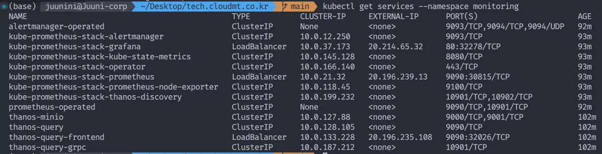
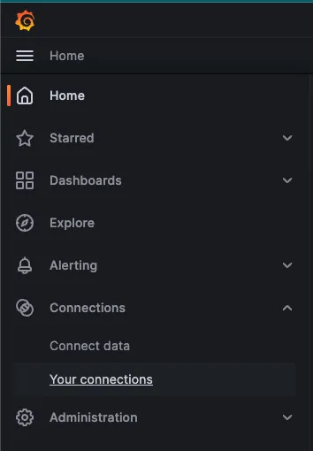

급하신 분들은 [설치](#설치)로 바로 가시면 됩니다.

# Prometheus의 저장소 및 HA 문제

Prometheus도 remote storage에 저장하는 기능을 제공하긴 하지만, 어디까지나 '제공'하는 정도입니다.  
기본적으로는 Adapter를 이용해 Third-party Storage에 저장하도록 안내하고 있죠.

아래 이미지는 [remote-storage-integrations]에서 가져온 이미지입니다.


그래서 [통합할 수 있는 Adapter들을 소개하는 문서]도 따로 있습니다.

그래서 이번에 소개할 것은 메트릭을 Third-party Storage에 저장하고, HA구성을 도와주는 Thanos 입니다.  
(물론 Prometheus에서도 HA[^Prometheus HA] 와 Scaling[^Prometheus scaling] 을 제공하긴 합니다.)

# 언제 Thanos가 필요한가요?

클라우드를 사용하면 보통은 모니터링을 지원하기 때문에 Prometheus를 사용 할 필요가 없습니다.  
직접 클러스터를 구축하는 경우에도 [Google Cloud의 Anthos](https://cloud.google.com/anthos?hl=ko) 같은걸 이용하면 모니터링이 되기 때문에 직접 모니터링 툴을 세팅 할 필요가 없습니다.  
(Anthos의 도입이 필요하시다면 클라우드메이트로 컨설팅 요청 하실 수 있습니다. 국내 첫 Anthos 사례를 보유하고 있으며, 21년도부터 지금까지 프로젝트를 운영하고 있습니다.)

하지만 보안사항에 의해서나, 클러스터를 직접 운영하고 싶은 경우에는 모니터링을 위해 Prometheus를 사용하게 됩니다.  
그런 경우에 Prometheus의 메트릭을 장기 저장하고, HA구성을 하기 위해 Thanos를 사용하면 좋습니다.

## Thanos가 뭔가요?

[Thanos]는 Prometheus의 메트릭을 장기 저장하고, HA구성을 도와주는 오픈소스 프로젝트입니다.  
홈페이지에 들어가보시면 소개 문구에도  
**Open source, highly available Prometheus setup with long term storage capabilities.**  
라고 소개되어 있습니다.

Prometheus의 Adapter 리스트를 보면 Thanos도 있습니다.

# 설치

> 이 핸즈온에서는 Argo CD를 사용해서 설치합니다.  
> Argo CD의 설치는 [Argo를 사용해보자]의 설치를 참고해주세요.

## Thanos 설치

> 여기서는 minio를 사용하지만, 다른걸 사용하셔도 됩니다.

- Application Name: thanos
- Namespace: monitoring
- Helm Repo: https:\/\/charts.bitnami.com/bitnami
- Chart: thanos
- Tag: 12.6.1
- Sync Options
  - Auto-Create Namespace
- ServerSide Apply
- Parameters
  - minio.enabled: true
  - minio.auth.rootPassword: password
  - queryFrontend.service.type: LoadBalancer  
    (이 설정은 테스트를 위한 설정입니다.)


## kube-prometheus-operator 설치

### crds 설치

- Application Name: prometheus-operator-crds
- Namespace: monitoring
- Helm Repo: https:\/\/prometheus-community.github.io/helm-charts
- Chart: prometheus-operator-crds
- Tag: 3.0.0
- Sync Options
  - Auto-Create Namespace
  - ServerSide Apply


### kube-prometheus-operator 설치

> `objstore.yaml` 을 secret으로 설정해야만 thanos와 연동이 가능합니다.  
> thanos sidecar(thanos-discovery)가 해당 설정으로 작동합니다.

```sh
cat <<EOF > objstore.yaml
type: s3
config:
  bucket: thanos
  endpoint: thanos-minio:9000
  access_key: admin
  secret_key: password
  insecure: true
EOF


kubectl create secret generic objstore-secret \
  --from-file=objstore.yaml \
  --namespace monitoring
```

- Application Name: kube-prometheus-stack
- Namespace: monitoring
- Helm Repo: https:\/\/prometheus-community.github.io/helm-charts
- Chart: kube-prometheus-stack
- Tag: 45.28.1
- Sync Options
  - Auto-Create Namespace
  - ServerSide Apply
- Parameters
  - values
    ```yaml
    prometheus:
      prometheusSpec:
        thanos:
          objectStorageConfig:
            key: objstore.yaml
            name: objstore-secret
    ```
  - prometheus.thanosService.enabled: true
  - prometheus.thanosService.clusterIP: " "


### thanos 설정 변경

- Parameters
  - query.dnsDiscovery.sidecarsNamespace: monitoring
  - query.dnsDiscovery.sidecarsService: kube-prometheus-stack-thanos-discovery


설정을 변경한 뒤 다시 sync를 누르고 터미널에 아래 명령어를 입력합니다.

```sh
kubectl get services --namespace monitoring
```


`thanos-query-frontend` 의 External IP를 확인합니다.  
저의 경우엔 http:\/\/20.196.235.108:9090 으로 들어가면 되곘군요.

해당 페이지에 들어가신 뒤 상단에 있는 Status > Targets를 누릅니다.


Targets 페이지가 아래와 같이 나오면 성공입니다.


## Grafana 세팅

Grafana는 kube-prometheus-operator를 설치할 때 같이 설치가 됩니다.  
서비스 조회하는 명령어를 입력했을 때 `kube-prometheus-stack-grafana` 라는게 나오는걸 보셨을겁니다.

접속을 위해 아래 명령어를 입력해주세요.  
(프로덕션 환경에선 이렇게 하지 마시고 ingress를 이용해야 합니다.)

```sh
kubectl patch service kube-prometheus-stack-grafana --namespace monitoring --patch '{"spec": {"type": "LoadBalancer"}}'
```



저의 경우엔 http:\/\/20.214.65.32 로 들어가면 되겠군요. 여러분도 출력된 IP를 입력해서 접속하세요.  
기본 계정 정보는 아래와 같습니다.

- username: admin
- password: prom-operator

접속 후 좌측 메뉴를 눌러 `Connections > Your connections` 를 클릭합니다.



그 후 `Add new data source` 를 클릭하고 `Prometheus` 를 선택합니다.  
정보는 아래와 같습니다.

- Name: Thanos
- URL: http:\/\/thanos-query:9090
- Prometheus type: Thanos


추가를 완료하셨으면 좌측 메뉴를 눌러 `Dashboards`를 클릭합니다.


그 후 `New` 버튼을 눌러 `Import`를 선택하세요.


원하시는 대시보드의 ID를 입력하고 `Load` 버튼을 누르시면 됩니다.  
저의 경우엔 [17900]을 입력했습니다.  
한국어로 되어있기도 하고 보여주는 지표도 많아서 추천드립니다.


Data source는 Thanos를 선택하고 완료하면 아래와 같은 대시보드가 나옵니다.


## 데이터 장기저장 확인

Thanos가 데이터를 잘 저장하고 있는지 궁금하실 수 있습니다.  
이번 핸즈온에서는 minio를 사용하였으니, 아래 명령어를 넣어서 minio에 External IP를 부여합니다.

```sh
kubectl patch service thanos-minio --namespace monitoring --patch '{"spec": {"type": "LoadBalancer"}}'
```

해당 IP의 9001 포트로 들어가시면 minio 웹페이지가 나옵니다.

- username: admin
- password: password

로그인 해서 들어가보시면 아래와 같이 잘 저장이 되고 있는 것을 보실 수 있습니다.


[remote-storage-integrations]: https://prometheus.io/docs/prometheus/latest/storage/#remote-storage-integrations
[통합할 수 있는 Adapter들을 소개하는 문서]: https://prometheus.io/docs/operating/integrations/#remote-endpoints-and-storage
[Argo를 사용해보자]: https://tech.cloudmt.co.kr/2023/02/27/juunini-why-argo/#%EC%84%A4%EC%B9%98%ED%95%98%EA%B8%B0
[17900]: https://grafana.com/grafana/dashboards/17900-1-kubernetes-all-in-one-cluster-monitoring-kr-v1-26-0/
[thanos]: https://thanos.io/
[^Prometheus HA]: Prometheus에서 제공하는 HA는 모니터링 자체의 HA라기보단, Alertmanager의 HA입니다.
[^Prometheus scaling]: Prometheus 자체의 [Scaling and Fedarating](https://www.robustperception.io/scaling-and-federating-prometheus/)문서를 제공합니다.
