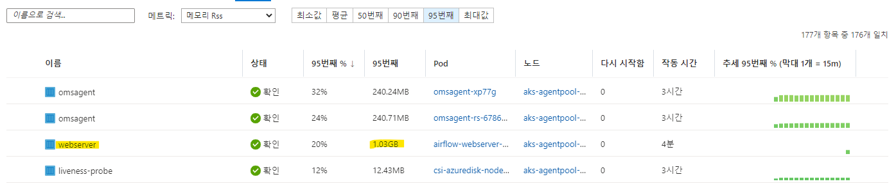
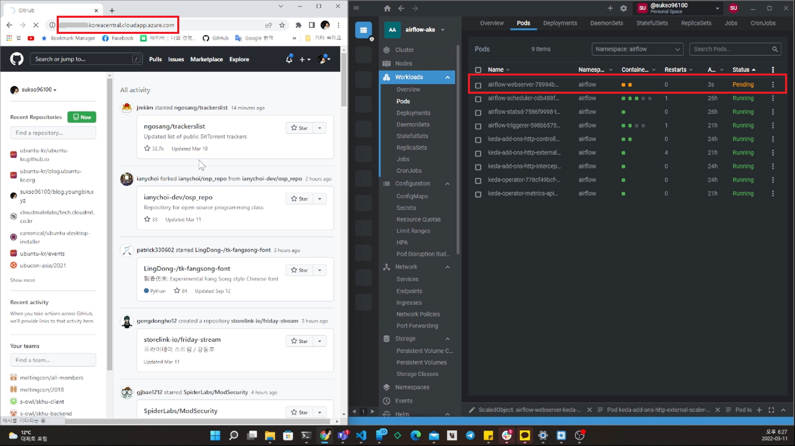
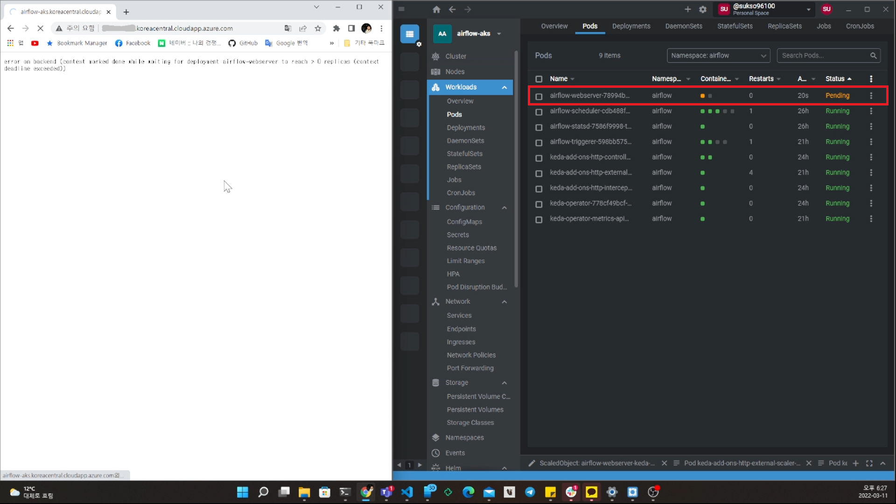
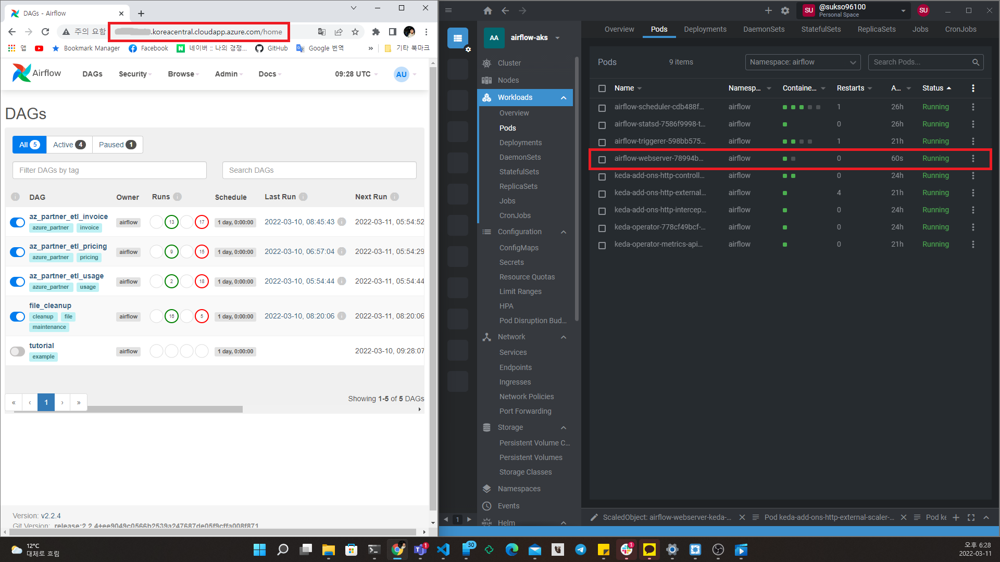

최근 사내 통합 빌링 시스템의 빌링 데이터 수집 프로그램을 Apache Airflow로 이전하기 위해, Kubernetes 환경에서 Airflow 를 구축하여 운영 해 보는 것을 테스트 해 보고 있습니다. 
Kubernetes 환경의 경우 안정적인 클러스터 운영을 위해 둘 이상의 노드로 클러스터를 구성하는 것이 일반적입니다. 그러다 보니 테스트 환경을 운영 하거나 작은 규모의 서비스를 운영하기에는 비용 부담이 있을 수도 있습니다. 그렇다고 낮은 사양의 노드로 클러스터를 구성하면, 테스트 할 서비스를 모두 배포하기에 어려움이 있을 수도 있습니다. 

그런데 테스트 환경이면 보통 항상 서비스를 켜 두기 보단, 테스트가 필요할 때만 켜는 방식으로 비용 부담을 조금은 줄여 볼 수 있습니다. 이를 매번 수동으로 하기는 번거로우니, 자동으로 필요할 때만 켜지도록 하면 편리할 텐데요, Kubernetes 환경에서는 이 글에서 소개할 KEDA를 활용하여 필요할 때만 자동으로 켜지는 서비스를 배포할 수 있습니다. Airflow 테스트 환경을 구축 사례를 통해 왜 KEDA 를 사용해 보게 되었는지, 어떻게 사용했는지에 대해 정리 해 보고자 합니다.

# 높은 리소스를 사용하지만, 자주 접속할 일은 없는 Airflow Webserver

Airflow 는 다양한 컴포넌트로 구성되어 있는데요. DAG 스케줄링과 실행 상태를 보여주는 Webserver, DAG로 정의된 각종 작업이 정해진 시간에 실행될 수 있도록 스케줄링 하는 Scheduler, 실제 작업을 스케줄링 하고 실행하는 Executor 와 Worker, Airflow 환경 설정 데이터와 DAG 실행 상태와 기록 등을 저장하는 Metadata Database (보통 PostgreSQL 많이 사용) 등으로 구성 되어 있습니다.

이들 중 Metadata Database 의 경우 기존에 사용중인 외부 DB에 연동하는 형태로 구성할 수 있고, Scheduler, Executor, Worker 는 작업이 정해진 시간에 잘 수행되기 위해 항상 실행 되고 있어야 하지만. Webserver 의 경우 항상 켜져 있을 필요는 없습니다. Airflow 환경 설정을 하거나 DAG 상태를 볼 때만 잠깐 켜도 되고, 꺼져 있어도 DAG 가 실행 되는 것에는 문제가 없습니다.

그런데 이렇게 자주 사용할 일이 없는 Webserver 가 아래 사진처럼 메모리를 많이 사용하고, 또 사용 가능한 리소스가 적은 테스트 용도로 구축한 Kubernetes 클러스터에서 운영하다 보니, Webserver 때문에 다른 Airflow 컴포넌트가 제대로 실행되지 않거나, 정해진 시간에 DAG 가 실행 되다가 메모리가 부족하여 실행에 실패하는 경우도 있고, DAG 를 실행하기 위해 Kubernetes 에서 Webserver 를 종료 시키는 경우가 많았습니다. 그래서 Webserver 를 항상 띄어 놓기 보단, 이 글에서 소개할 KEDA 를 활용해서 필요할 때만 잠깐 띄우는 형태로 구성 하여 DAG 가 실행될 때 문제가 없도록 구성 해 보기로 하였습니다.



# KEDA와 KNative

[KEDA(Kubernetes Event-driven Autoscaling)](https://keda.sh/)는 이벤트 기반으로 Kuibernetes 환경에서 운영중인 컨테이너를 자동 스케일링 하는 Kubernetes 컴포넌트 입니다. HTTP 트래픽, 메시지 큐에서 온 이벤트, 데이터베이스 쿼리 결과 등 다양한 이벤트를 수신 받아 이를 기반으로 컨테이너를 스케일링 할 수 있도록 해 줍니다. 또한 기존에 Kubernetes 환경에 배포한 Service 나 Deployment 를 수정하지 않고 KEDA로 확장하여 사용할 수 있어, 운영중인 Kubernetes 클러스터에 어렵지 않게 도입하여 사용할 수 있습니다.

KEDA와 비슷한 프로젝트로, [KNative](https://knative.dev/) 프로젝트가 있습니다. KNative 의 경우 Kubernetes 환경에 서비리스를 쉽게 구현할 수 있도록 다양한 도구와 컴포넌트를 제공하는 점에서 KEDA 와는 조금 다르다고 할 수 있습니다. 또한 자체적으로 제공하는 자동 스케일러[(KNative Pod Scaler)](https://knative.dev/docs/serving/autoscaling/autoscaling-concepts/#knative-pod-autoscaler-kpa) 등 서버리스 앱 배포에 유용한 기능을 다양하게 제공합니다. 하지만 KNative가 제공하는 강력한 기능을 사용하려면, 기존 Service나 Deployment를 KNative 에서 제공하는 KNative 서비스로 변환해서 사용해야 합니다. 기존 Service 를 그대로 두고 추가적으로 확장하여 사용하고 싶은 경우에는 적합하지 않다고 할 수 있습니다.

자동 스케일링을 적용 하고자 하는 Airflow Webserver 의 경우, [공식 Airflow Helm 차트](https://airflow.apache.org/docs/helm-chart/stable/index.html)를 통해 배포된 서비스 입니다. 이 경우 KNative 를 사용 하려면, Helm 차트를 직접 수정해야 KNative를 사용할 수 있는데 이는 복잡한 방법이여서, KEDA 를 사용하여 기존 서비스를 확장하는 형태로 구성하는 것을 시도 하였습니다.

# KEDA HTTP Add On

KEDA에는 다양한 유형의 이벤트를 받아서 Service나 Deployment 를 스케일 할 수 있는 Scaler가 있는데요. 이 글에서 구현할 HTTP 트래픽을 기반으로 스케일 되는 서비스를 구현하기 위해, KEDA HTTP Add On 이 제공하는 `HTTPScaledObject`를 사용할 수 있습니다. 이를 통해 HTTP 트래픽이 있으면 1개 이상의 Pod 를 배포하도록 하고, 트래픽이 많아지면 다수의 Pod를, 그리고 HTTP 트래픽이 없으면 0으로 스케일 하여 Pod를 모두 종료하도록 할 수도 있습니다.

[HTTP Add On 의 경우 프로젝트 문서의 설명에 따르면 크게 3가지로 구성되어 있습니다.](https://github.com/kedacore/http-add-on/blob/main/docs/design.md#high-level-components)
- Operator: `HTTPScaledObject`와 관련된 이벤트를 수신하여, 스케일러 구성을 생성/수정/삭제 하여 적용 하는 구성요소
- Intercepter: 외부 HTTP 트래픽을 받아 클러스터에 배포된 애플리케이션에 전달하는 역할 수행
- Scaler: HTTP 요청 숫자 모니터링 하고 KEDA 에 전달하여, 요청 숫자에 따른 스케일링이 작동하도록 하는 역할 수행 


> KEDA HTTP Add On 이 배포된 Kubernetes 클러스터 내부 구성  
> https://github.com/kedacore/http-add-on/blob/main/docs/design.md#architecture-overview

# KEDA, KEDA HTTP Add On 설치 및 구성하기

## 설치하기
KEDA 와 KEDA HTTP Add On 에 대해 알아 보았으니, 이제 직접 Kubernetes 클러스터에 설치하고 구성 해 보겠습니다.

> 참고: KEDA HTTP Add On 의 경우 아직 베타 단계에 있는 프로젝트 입니다. 테스트 환경에는 괜찮겠지만, 프로덕션 환경에 적용 하기에는 문서화나 제공되는 기능 등이 부족할 수 있으니 참고 하시기 바랍니다.

먼저 Helm 을 사용하여 KEDA 를 설치 합니다. `${NAMESPACE}` 의 경우 본인이 KEDA 를 설치할 Kubernetes 네임스페이스로 지정합니다.

> 참고: 최근 Helm은 대부분의 관리형 Kubernetes 환경이나, Microk8s, Minikube 등 경량 Kubernetes 환경에도 이미 포함되어 있어 바로 Helm 을 사용할 수 있습니다.

```bash
helm repo add kedacore https://kedacore.github.io/charts
helm repo update
helm install keda kedacore/keda --namespace ${NAMESPACE} --create-namespace
```

HTTP Add On 또한 Helm 을 통해 쉽게 설치가 가능합니다.

```bash
helm install http-add-on kedacore/keda-add-ons-http --namespace ${NAMESPACE}
```

## 구성하기
설치가 다 되었으니, `HTTPScaledObject`와 Ingress 를 하나씩 만들어서 배포 해 보겠습니다. 먼저 기존 Service 를 자동 스케일링 해줄 `HTTPScaledObject`를 작성합니다.

```yaml
kind: HTTPScaledObject
apiVersion: http.keda.sh/v1alpha1
metadata:
    name: airflow-webserver-keda
    namespace: airflow
spec:
    host: my-airflow-on-aks.koreacentral.cloudapp.azure.com
    targetPendingRequests: 100 
    scaleTargetRef:
        deployment: airflow-webserver
        service: airflow-webserver
        port: 8080
    replicas:
        min: 0
        max: 1
```

- `namespace`: 자동 스케일링할 Service/Deployment가 배포된 Namespace로 지정 해 줍니다. 예를 들어, 대상 Service/Deployment 가 `airflow` Namespace 에 배포되어 있다면, `airflow`로 지정합니다.
- `host`: 외부에서 HTTP 트래픽을 수신할 호스트(주소)를 입력합니다.
- `targetPendingRequests`: 스케일링 할 때의 HTTP 요청 수 기준점 입니다. 설정된 숫자보다 많은 요청이 처리/대기 중이면 Replica 수를 늘리고, 적으면 Replica 수를 줄입니다. (기본값: 100)
- `scaleTargetRef`: 스케일 대상 Service, Deployment 트래픽 전달 포트 등을 지정합니다. 여기서는 이미 배포된 Service 인 `airflow-webserver`와 이로 인해 같이 생성된 Deployment인 `airflow-webserver` 그리고 포트는 `8080`으로 지정 하였습니다.
- `replicas`: 스케일 할 대상의 최소 및 최대 Replica 수를 지정 합니다.

작성을 완료 하였다면, `http-scaled-object.yml` 등의 적절한 이름으로 저장하고, 클러스터에 배포합니다.

```bash
kubectl apply -f http-scaled-object.yml
```

외부에서 트래픽을 받아 전달할 수 있도록 Ingress 도 배포합니다. Airflow Helm 차트를 사용하면, 간단히 Ingress 관련 설정을 아래처럼 활성화 하여 배포하는 것도 가능하지만, 그렇게 하면 트래픽이 바로 Airflow Webserver 로 가기 때문에 자동 스케일링이 작동하지 않습니다. 

```yaml
...
ingress:
  enabled: false # true 로 변경하고 적용하면 Ingress 자동 배포
  ...
  web:
    annotations: {}
    host: ""
    hosts: []
    ingressClassName: ""
    path: /
    pathType: ImplementationSpecific
    precedingPaths: []
    succeedingPaths: []
    tls:
      enabled: false
      secretName: ""
```

HTTP 트래픽 모니터링을 위한 HTTP Add On 의 Intercepter 를 거쳐야 Intercepter 에서 모니터링 한 트래픽을 기반으로 자동 스케일링이 가능하므로, 아래처럼 별도로 Ingress 를 작성하여 배포합니다. 아래 예제 Ingress 를 보면, `host` 는 앞서 작성한 `HTTPScaledObject` 에서 명시한 호스트로 되어 있는 것을 볼 수 있고, Intercepter 에서 트래픽을 받도록 하기 위해 `keda-add-ons-http-interceptor-proxy` 서비스가 백엔드로 지정 되어 있는 것을 볼 수 있습니다.

> 참고: 아래 작성된 YAML 코드는 클러스터에 Nginx Ingress Controller 가 이미 구성되어 있음을 가정하고 작성된 것입니다. 아직 Ingress Controller 가 구성되어 있지 않다면, [이 문서](https://kubernetes.github.io/ingress-nginx/deploy/#quick-start)를 참고해서 Nginx Ingress 를 구성할 수 있습니다.

```yaml
apiVersion: networking.k8s.io/v1
kind: Ingress
metadata:
  name: airflow-webserver-keda-ingress
  namespace: airflow
  annotations:
    nginx.ingress.kubernetes.io/rewrite-target: /
    kubernetes.io/ingress.class: nginx
spec:
  rules:
  - host: my-airflow-on-aks.koreacentral.cloudapp.azure.com
    http:
      paths:
      - path: /
        pathType: Prefix
        backend:
          service:
            name: keda-add-ons-http-interceptor-proxy
            port:
              number: 8080
```

마찬가지로, `airflow-webserver-keda-ingress.yml` 등의 적당한 이름으로 저장해서 클러스터에 배포합니다.

```bash
kubectl apply -f airflow-webserver-keda-ingress.yml
```

## 테스트
필요한 것을 다 배포 하였으니, 실제로 배포한 URL 에 접속해 보면서 어떻게 작동하는지 살펴보겠습니다.

Ingress 에 Host로 설정한 주소로 접속하면 아래 사진처럼 `airflow-webserver-***` Pod 가 새로 생성되는 것을 볼 수 있습니다.
 

Airflow Webserver 의 경우 리소스 사용량이 크고, 다양한 기능이 있는 웹 애플리케이션 Pod 이다 보니 초기화에 시간이 오래 소요되어 타임아웃 오류가 발생 하기도 합니다.


아래 사진처럼 Pod 가 성공적으로 실행 된 후 부터는, Airflow 웹 콘솔에 정상적으로 접속 가능한 것을 확인할 수 있습니다.


KEDA에서 Deployment의 스케일링을 처리하는 `keda-operator` Deployment의 Pod인 `keda-operator-***` Pod 의 로그에서도 `airflow-webserver`를 스케일링 한 것을 확인할 수 있습니다.

```
...
1.6472195814979117e+09	INFO	controller.scaledobject	Initializing Scaling logic according to ScaledObject Specification	{"reconciler group": "keda.sh", "reconciler kind": "ScaledObject", "name": "keda-add-ons-http-interceptor", "namespace": "airflow"}
1.6472195815011077e+09	INFO	controller.scaledobject	Initializing Scaling logic according to ScaledObject Specification	{"reconciler group": "keda.sh", "reconciler kind": "ScaledObject", "name": "airflow-webserver-keda-app", "namespace": "airflow"}
1.647219716826971e+09	INFO	controller.scaledobject	Reconciling ScaledObject	{"reconciler group": "keda.sh", "reconciler kind": "ScaledObject", "name": "keda-add-ons-http-interceptor", "namespace": "airflow"}
1.647223844091361e+09	INFO	scaleexecutor	Successfully updated ScaleTarget	{"scaledobject.Name": "airflow-webserver-keda-app", "scaledObject.Namespace": "airflow", "scaleTarget.Name": "airflow-webserver", "Original Replicas Count": 0, "New Replicas Count": 1}
1.6472238458556235e+09	INFO	controller.scaledobject	Reconciling ScaledObject	{"reconciler group": "keda.sh", "reconciler kind": "ScaledObject", "name": "airflow-webserver-keda-app", "namespace": "airflow"}
1.6472238530737023e+09	INFO	controller.scaledobject	Reconciling ScaledObject	{"reconciler group": "keda.sh", "reconciler kind": "ScaledObject", "name": "keda-add-ons-http-interceptor", "namespace": "airflow"}
1.6472238682097535e+09	INFO	controller.scaledobject	Reconciling ScaledObject	{"reconciler group": "keda.sh", "reconciler kind": "ScaledObject", "name": "keda-add-ons-http-interceptor", "namespace": "airflow"}
1.647223876009515e+09	INFO	controller.scaledobject	Reconciling ScaledObject	{"reconciler group": "keda.sh", "reconciler kind": "ScaledObject", "name": "airflow-webserver-keda-app", "namespace": "airflow"}
1.6472241543949137e+09	INFO	controller.scaledobject	Reconciling ScaledObject	{"reconciler group": "keda.sh", "reconciler kind": "ScaledObject", "name": "keda-add-ons-http-interceptor", "namespace": "airflow"}
1.6472241628582501e+09	INFO	controller.scaledobject	Reconciling ScaledObject	{"reconciler group": "keda.sh", "reconciler kind": "ScaledObject", "name": "airflow-webserver-keda-app", "namespace": "airflow"}
1.6472243830425234e+09	INFO	scaleexecutor	Successfully set ScaleTarget replicas count to ScaledObject minReplicaCount	{"scaledobject.Name": "airflow-webserver-keda-app", "scaledObject.Namespace": "airflow", "scaleTarget.Name": "airflow-webserver", "Original Replicas Count": 1, "New Replicas Count": 0}
1.647224389093124e+09	INFO	controller.scaledobject	Reconciling ScaledObject	{"reconciler group": "keda.sh", "reconciler kind": "ScaledObject", "name": "airflow-webserver-keda-app", "namespace": "airflow"}
...
```

# 글을 마치며

지금까지 KEDA와 KEDA Http Add On 을 적용하여, 기존에 배포된 Service 나 Deployment 를 확장하여 HTTP 트래픽이 있을 때만 작동하는 서버리스 형태로 구성 해 보았습니다. Kubernetes 환경에 서버리스 방식으로 작동하도록 애플리케이션을 배포 하고 싶지만, 기존에 배포된 것을 최소한으로 수정하고 확장하여 서버리스 형태로 바꾸고자 할 때 KEDA와 KEDA Http Add On 을 활용하면 어렵지 않게 적용할 수 있습니다. 다만, 참고해야 할 점은 앞에서도 언급 했듯 KEDA Http Add On은 이 글이 작성된 시점에서 아직 베타 단계에 있는 프로젝트라는 점 입니다. 본인의 Kubernetes 클러스터에 적용할 때 이 점을 꼭 참고 하셔야 겠습니다.


## 참고자료

- [Architecture Overview - Airflow Documentation](https://airflow.apache.org/docs/apache-airflow/stable/concepts/overview.html)
- [Helm Chart for Apache Airflow](https://airflow.apache.org/docs/helm-chart/stable/index.html)
- [kedacore/http-add-on - GitHub](https://github.com/kedacore/http-add-on)
- [Announcing KEDA HTTP Add-on v0.1.0](https://keda.sh/blog/2021-06-24-announcing-http-add-on/)
- [Deploying KEDA](https://keda.sh/docs/2.6/deploy/)
- [Installing the KEDA HTTP Add On](https://github.com/kedacore/http-add-on/blob/main/docs/install.md)
- [Getting Started With The HTTP Add On](https://github.com/kedacore/http-add-on/blob/main/docs/walkthrough.md)
- [KEDA-HTTP Frequently Asked Questions](https://github.com/kedacore/http-add-on/blob/main/docs/faq.md)